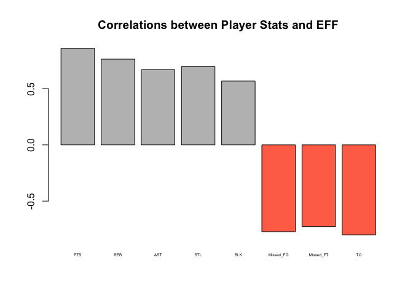
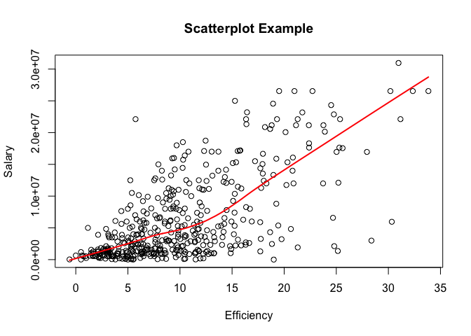
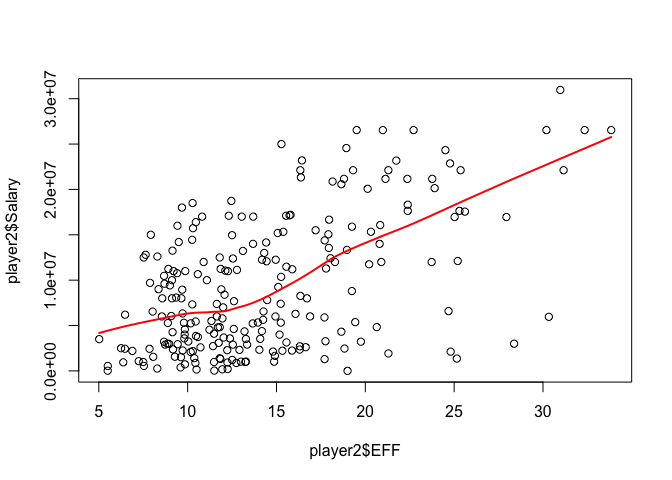

hw02-sandeep-tiwari
================
Sandeep Tiwari
9/29/2017

2. Import the data in R
=======================

``` r
#install.packages("readr")
library("readr")
library("dplyr")
```

    ## Warning: package 'dplyr' was built under R version 3.4.2

    ## 
    ## Attaching package: 'dplyr'

    ## The following objects are masked from 'package:stats':
    ## 
    ##     filter, lag

    ## The following objects are masked from 'package:base':
    ## 
    ##     intersect, setdiff, setequal, union

``` r
library("ggplot2")
```

``` r
dat <- read.csv("data/nba2017-player-statistics.csv", 
                colClasses = c("Player"="character", "Team"="character", "Experience"="character", "Position"="factor", "Salary"="double"))
```

``` r
nba <- read_csv("data/nba2017-player-statistics.csv",
                col_types = cols(Player = col_character(), Team = col_character(), Experience = col_integer(), Position = col_factor(levels = c("PG", "SG", "SF", "PF", "C")), Salary = col_double()))
```

    ## Warning in rbind(names(probs), probs_f): number of columns of result is not
    ## a multiple of vector length (arg 1)

    ## Warning: 80 parsing failures.
    ## row # A tibble: 5 x 5 col     row        col   expected actual                                 file expected   <int>      <chr>      <chr>  <chr>                                <chr> actual 1     4 Experience an integer      R 'data/nba2017-player-statistics.csv' file 2     9 Experience an integer      R 'data/nba2017-player-statistics.csv' row 3    24 Experience an integer      R 'data/nba2017-player-statistics.csv' col 4    36 Experience an integer      R 'data/nba2017-player-statistics.csv' expected 5    37 Experience an integer      R 'data/nba2017-player-statistics.csv'
    ## ... ................. ... ......................................................................... ........ ......................................................................... ...... ......................................................................... .... ......................................................................... ... ......................................................................... ... ......................................................................... ........ .........................................................................
    ## See problems(...) for more details.

``` r
str(dat)
```

    ## 'data.frame':    441 obs. of  24 variables:
    ##  $ Player      : chr  "Al Horford" "Amir Johnson" "Avery Bradley" "Demetrius Jackson" ...
    ##  $ Team        : chr  "BOS" "BOS" "BOS" "BOS" ...
    ##  $ Position    : Factor w/ 5 levels "C","PF","PG",..: 1 2 5 3 4 3 4 5 4 2 ...
    ##  $ Experience  : chr  "9" "11" "6" "R" ...
    ##  $ Salary      : num  26540100 12000000 8269663 1450000 1410598 ...
    ##  $ Rank        : int  4 6 5 15 11 1 3 13 8 10 ...
    ##  $ Age         : int  30 29 26 22 31 27 26 21 20 29 ...
    ##  $ GP          : int  68 80 55 5 47 76 72 29 78 78 ...
    ##  $ GS          : int  68 77 55 0 0 76 72 0 20 6 ...
    ##  $ MIN         : int  2193 1608 1835 17 538 2569 2335 220 1341 1232 ...
    ##  $ FGM         : int  379 213 359 3 95 682 333 25 192 114 ...
    ##  $ FGA         : int  801 370 775 4 232 1473 720 58 423 262 ...
    ##  $ Points3     : int  86 27 108 1 39 245 157 12 46 45 ...
    ##  $ Points3_atts: int  242 66 277 1 111 646 394 35 135 130 ...
    ##  $ Points2     : int  293 186 251 2 56 437 176 13 146 69 ...
    ##  $ Points2_atts: int  559 304 498 3 121 827 326 23 288 132 ...
    ##  $ FTM         : int  108 67 68 3 33 590 176 6 85 26 ...
    ##  $ FTA         : int  135 100 93 6 41 649 217 9 124 37 ...
    ##  $ OREB        : int  95 117 65 2 17 43 48 6 45 60 ...
    ##  $ DREB        : int  369 248 269 2 68 162 367 20 175 213 ...
    ##  $ AST         : int  337 140 121 3 33 449 155 4 64 71 ...
    ##  $ STL         : int  52 52 68 0 9 70 72 10 35 26 ...
    ##  $ BLK         : int  87 62 11 0 7 13 23 2 18 17 ...
    ##  $ TO          : int  116 77 88 0 25 210 79 4 68 39 ...

``` r
str(nba)
```

    ## Classes 'tbl_df', 'tbl' and 'data.frame':    441 obs. of  24 variables:
    ##  $ Player      : chr  "Al Horford" "Amir Johnson" "Avery Bradley" "Demetrius Jackson" ...
    ##  $ Team        : chr  "BOS" "BOS" "BOS" "BOS" ...
    ##  $ Position    : Factor w/ 5 levels "PG","SG","SF",..: 5 4 2 1 3 1 3 2 3 4 ...
    ##  $ Experience  : int  9 11 6 NA 9 5 4 2 NA 6 ...
    ##  $ Salary      : num  26540100 12000000 8269663 1450000 1410598 ...
    ##  $ Rank        : int  4 6 5 15 11 1 3 13 8 10 ...
    ##  $ Age         : int  30 29 26 22 31 27 26 21 20 29 ...
    ##  $ GP          : int  68 80 55 5 47 76 72 29 78 78 ...
    ##  $ GS          : int  68 77 55 0 0 76 72 0 20 6 ...
    ##  $ MIN         : int  2193 1608 1835 17 538 2569 2335 220 1341 1232 ...
    ##  $ FGM         : int  379 213 359 3 95 682 333 25 192 114 ...
    ##  $ FGA         : int  801 370 775 4 232 1473 720 58 423 262 ...
    ##  $ Points3     : int  86 27 108 1 39 245 157 12 46 45 ...
    ##  $ Points3_atts: int  242 66 277 1 111 646 394 35 135 130 ...
    ##  $ Points2     : int  293 186 251 2 56 437 176 13 146 69 ...
    ##  $ Points2_atts: int  559 304 498 3 121 827 326 23 288 132 ...
    ##  $ FTM         : int  108 67 68 3 33 590 176 6 85 26 ...
    ##  $ FTA         : int  135 100 93 6 41 649 217 9 124 37 ...
    ##  $ OREB        : int  95 117 65 2 17 43 48 6 45 60 ...
    ##  $ DREB        : int  369 248 269 2 68 162 367 20 175 213 ...
    ##  $ AST         : int  337 140 121 3 33 449 155 4 64 71 ...
    ##  $ STL         : int  52 52 68 0 9 70 72 10 35 26 ...
    ##  $ BLK         : int  87 62 11 0 7 13 23 2 18 17 ...
    ##  $ TO          : int  116 77 88 0 25 210 79 4 68 39 ...
    ##  - attr(*, "problems")=Classes 'tbl_df', 'tbl' and 'data.frame': 80 obs. of  5 variables:
    ##   ..$ row     : int  4 9 24 36 37 43 50 57 58 60 ...
    ##   ..$ col     : chr  "Experience" "Experience" "Experience" "Experience" ...
    ##   ..$ expected: chr  "an integer" "an integer" "an integer" "an integer" ...
    ##   ..$ actual  : chr  "R" "R" "R" "R" ...
    ##   ..$ file    : chr  "'data/nba2017-player-statistics.csv'" "'data/nba2017-player-statistics.csv'" "'data/nba2017-player-statistics.csv'" "'data/nba2017-player-statistics.csv'" ...
    ##  - attr(*, "spec")=List of 2
    ##   ..$ cols   :List of 24
    ##   .. ..$ Player      : list()
    ##   .. .. ..- attr(*, "class")= chr  "collector_character" "collector"
    ##   .. ..$ Team        : list()
    ##   .. .. ..- attr(*, "class")= chr  "collector_character" "collector"
    ##   .. ..$ Position    :List of 3
    ##   .. .. ..$ levels    : chr  "PG" "SG" "SF" "PF" ...
    ##   .. .. ..$ ordered   : logi FALSE
    ##   .. .. ..$ include_na: logi FALSE
    ##   .. .. ..- attr(*, "class")= chr  "collector_factor" "collector"
    ##   .. ..$ Experience  : list()
    ##   .. .. ..- attr(*, "class")= chr  "collector_integer" "collector"
    ##   .. ..$ Salary      : list()
    ##   .. .. ..- attr(*, "class")= chr  "collector_double" "collector"
    ##   .. ..$ Rank        : list()
    ##   .. .. ..- attr(*, "class")= chr  "collector_integer" "collector"
    ##   .. ..$ Age         : list()
    ##   .. .. ..- attr(*, "class")= chr  "collector_integer" "collector"
    ##   .. ..$ GP          : list()
    ##   .. .. ..- attr(*, "class")= chr  "collector_integer" "collector"
    ##   .. ..$ GS          : list()
    ##   .. .. ..- attr(*, "class")= chr  "collector_integer" "collector"
    ##   .. ..$ MIN         : list()
    ##   .. .. ..- attr(*, "class")= chr  "collector_integer" "collector"
    ##   .. ..$ FGM         : list()
    ##   .. .. ..- attr(*, "class")= chr  "collector_integer" "collector"
    ##   .. ..$ FGA         : list()
    ##   .. .. ..- attr(*, "class")= chr  "collector_integer" "collector"
    ##   .. ..$ Points3     : list()
    ##   .. .. ..- attr(*, "class")= chr  "collector_integer" "collector"
    ##   .. ..$ Points3_atts: list()
    ##   .. .. ..- attr(*, "class")= chr  "collector_integer" "collector"
    ##   .. ..$ Points2     : list()
    ##   .. .. ..- attr(*, "class")= chr  "collector_integer" "collector"
    ##   .. ..$ Points2_atts: list()
    ##   .. .. ..- attr(*, "class")= chr  "collector_integer" "collector"
    ##   .. ..$ FTM         : list()
    ##   .. .. ..- attr(*, "class")= chr  "collector_integer" "collector"
    ##   .. ..$ FTA         : list()
    ##   .. .. ..- attr(*, "class")= chr  "collector_integer" "collector"
    ##   .. ..$ OREB        : list()
    ##   .. .. ..- attr(*, "class")= chr  "collector_integer" "collector"
    ##   .. ..$ DREB        : list()
    ##   .. .. ..- attr(*, "class")= chr  "collector_integer" "collector"
    ##   .. ..$ AST         : list()
    ##   .. .. ..- attr(*, "class")= chr  "collector_integer" "collector"
    ##   .. ..$ STL         : list()
    ##   .. .. ..- attr(*, "class")= chr  "collector_integer" "collector"
    ##   .. ..$ BLK         : list()
    ##   .. .. ..- attr(*, "class")= chr  "collector_integer" "collector"
    ##   .. ..$ TO          : list()
    ##   .. .. ..- attr(*, "class")= chr  "collector_integer" "collector"
    ##   ..$ default: list()
    ##   .. ..- attr(*, "class")= chr  "collector_guess" "collector"
    ##   ..- attr(*, "class")= chr "col_spec"

3. Right after importing the data
=================================

### Replacing all occurrences of "R" in Experience vector with 0 and making it an integer vector

``` r
dat$Experience[dat$Experience=="R"] = 0
dat$Experience = as.integer(dat$Experience)
dat$Experience
```

    ##   [1]  9 11  6  0  9  5  4  2  0  6  1  3  2  1  4 10 12 11  5  1  5 12 13
    ##  [24]  0  8 13  5 13 15  5  2  5  1  7  7  0  0  4 10  2  1  5  0  6  7  2
    ##  [47]  4  7  1  0  8  8  6  9  5  3  0  0  3  0  3 12  8 11  4 12  0 14  3
    ##  [70] 10  3 10  3  3  6  2 17  4  4  0  3  8  4  1  9  0  3  8 12 11  0  7
    ##  [93]  1  6  6  5 11  1  6  1  9  8  1  1  1  0 13  3  1  5  2  3  2  0 10
    ## [116]  8  4  8  4  7  9  1  1  6  0  0  2 13  7  1  4  4 12  1  1  0  6  5
    ## [139]  3  5  0  3  5  1  5  4  1  1  3  1  4  2  5  9 11  4  4  8  9  0 13
    ## [162]  0  8  7  9  3  1  4  5  0  0  0  0  9  0  2  5  9  8  2  2  4  8  7
    ## [185]  0  1  5  0  0  4  0  0  7  1  8  0  1  2  1  3  4  0  1  6  0  4  3
    ## [208]  8  0  0  6  2  2  2  4 10  1  2  2  6 12  0 13  4  3  2  8  9  1  5
    ## [231] 13  0 11  7 13  0  7 11  0  0  3  9  1  5  2 10 14  7 15 15  2  0  2
    ## [254]  8  0  7  0 11  1  4  8  1 12  0  7  4  6 11  0 11  8  0 10 16  8  8
    ## [277] 18 11  6  5 13  1  6  8  6  3  2 15  0  1  2  3  5  1  0  3  0  2  5
    ## [300]  2  1  4 12  5  8  0  3  7  3  0  8  5  0  2  2  1  8  9 12  3 18  0
    ## [323]  0 15  6  3  3  4  6  6  0  2  4  4  2  1  2  0  7  7  1  2  0 12  0
    ## [346]  5  0  3 16  1  8  4  8  6  4  1  0  7  6  4  5  4  7  6  0  3  2  0
    ## [369]  3 12 18  0  2  4 10  0  2  0  1  3  7  0  8  9  3  0  7  6  0  8  2
    ## [392]  0 10  0  7  7  1  2  2  8  6  3  7  1  0  1  7  5  3  1  2  0  9  1
    ## [415]  0  0  2  2  1 12 16  9  2  4  6  2  1  3  5  0  1  0  2  6  9 13  0
    ## [438] 11  2  0 15

4. Performance of players
=========================

### Adding an EFF variable to our data frame

Creating Missed\_FG variable

``` r
dat$Missed_FG <- dat$FGA - dat$FGM
dat$Missed_FG
```

    ##   [1]  422  157  416    1  137  791  387   33  231  148   19  248  480  260
    ##  [15]   80  282    5   79   53    1  288  233   48   96  497  138  749  608
    ##  [29]  190  175   10  362   67  824  329   72   48  311  492   53  279   76
    ##  [43]  102  230  151  127  685   77    1   15   46  155  788  284  483  389
    ##  [57]   45   85  139   51  667  225  133   34  426  127  243   73  167  542
    ##  [71]   20  221  497  603  339  415  138  150  183  345  326  190  262   99
    ##  [85]   29   98  295  179  236  366   27  507   46   89   26   91  310  425
    ##  [99]  727   24  325   17  192   42   94  186  541  110  173  682   55  194
    ## [113]  367  133  332  393  382  590  431  401   74  311  145  168   54  270
    ## [127]  467   12  324  123  428  136  105   60   79   41  420  336  558  586
    ## [141]    9   74  393  236  552   76   26   11  190  482  265    7  806  351
    ## [155]  407  323   10  582  163   21  787   44  383  517  102  305  542  198
    ## [169]  147   14   47  211  135   94  219  472  160  152  322   57  482  522
    ## [183]  338  153    5  213  548    7   21  152   29  546  319  229   21  229
    ## [197]   87  383  182  440  326   48  276   17  216   21   27  617  209  304
    ## [211]  225  208  205   55   88  207  307  430  168  286  196    8  117  378
    ## [225]  222   55  111  475   51  732   52  139  143  768  143   63  273  172
    ## [239]  131   66   98    6  244  675  116  549  268  349  301  304   37    2
    ## [253]  201  604    6  859   10  162  120  315  450  226  472   22   50  408
    ## [267]  492   79    5  411  165   10  494  510  187  304   42  293  127  149
    ## [281]  181  209  214  317  611   48  247  353    7   50  394  210  211  280
    ## [295]  207  248  289   68  335  165    5   49    9   36 1117  146  281   90
    ## [309]  520  243   52  147   23  175  250   93  628  545  321  310  297   79
    ## [323]   30  531  283  344  749  827   67  317   63  116  310  232  140   35
    ## [337]  110   16  415  120  343  316  434  336  122  187   40   82   14  362
    ## [351]    1  372  507   89  757    3   40  185  172   81  336  113  489   34
    ## [365]   19  294  241   25    3  205  382  209  183  681  201   22   57   89
    ## [379]   49  365  514  203  196  235  239  154  374  249   46  176   62   40
    ## [393]  241  101  285   84  226   31  861  117   41  329    8  677  195  205
    ## [407]   20  389  310  106  384  410   68  516   34  112  594  396  171  260
    ## [421]   49  361  144   91  159   79  129  233  316   53  825  104    6  585
    ## [435]  189  220  348   20  411  253   75

Creating Missed\_FT variable

``` r
dat$Missed_FT <- dat$FTA - dat$FTM
dat$Missed_FT
```

    ##   [1]  27  33  25   3   8  59  41   3  39  11   6  33  47  15  17  11   1
    ##  [18]   4  12   1  19   5   7  14  38   1  31 173  28 107   0  28  13 102
    ##  [35]  28   4  26  41  66  23  33   5  10  17   4   5  60   5   1   2  32
    ##  [52]  16 105  56  35  20   4  10   7  10  37 198  13   1  49  18  18   4
    ##  [69]  15  94   1  20  50 141  62  56   5  33  11  17  14  27  10   3   4
    ##  [86]  17  11   8  20   9   0  55   4   8   1  10  35  58  38   8  41   0
    ## [103]  20   3  33   4  58   3   8  91   6  19  29   9  20  29  45  79 133
    ## [120]  63   3  17  18   4   2  27  59   6   6  39 218  15   2  11   7   4
    ## [137]  30  15  31  40   0   2  18  17  36   6   4   4  63  38  19   1  55
    ## [154]  18  19  42   1  41  27   5  61   2  13  32  44  14  54  19   8  11
    ## [171]   7  13  15   7  34  61 109   9  30   0  65  54  23   9   1  10  53
    ## [188]   0   2   4   2  48  32  52   1  53   9  28  31  31   9  16  17   2
    ## [205]  18   0   9  69  26  22  26  14  13   5  14   9  63  38  33  36  30
    ## [222]   7  13  62  14  21  55  48  13  32   3   8  18  37  28   1   5  33
    ## [239]   6   9  28   3  33  64  12  51  21  14  54  32   0   0  83  28   1
    ## [256] 135   1  15  45  22  21  30  33   1   4  59 101  11   0  28 220   0
    ## [273]  22  29  28  17   3  14   6  18   9  15  42  39  67  12  18  14   3
    ## [290]   1  25 165  24  22   5  64  23   5  61  53   1   4   3   2 130  14
    ## [307] 100  11  38  46  12   8   8  24  33  10  54  52  50  11  27   6   6
    ## [324]  52  40  19  26  57  31  18   4  33  47   5  34   2  11   3  38   3
    ## [341]  36  30  14  18  19  58   2  29   0  40   0  47  53  11 128   0   6
    ## [358]  11  27  24  17   6  49  16   1  25  31  11   1  22  14  15  34  39
    ## [375]   7   2  14   5  25  15  33   9  21  10  23   8  24  16   2  24   1
    ## [392]   4  20  22  44  10  50   5 130   5   7  31   0  72  23  16   3  31
    ## [409]  43  10  23  81   6  41  14  17  34  78  21  17   6  13  27  35  15
    ## [426]   3  42  58  22  12  74   7   1  70  22   5  68   1  35  16  33

Creating PTS variable

``` r
dat$PTS <- dat$Points3*3 + dat$Points2*2 + dat$FTM
dat$PTS
```

    ##   [1]  952  520  894   10  262 2199  999   68  515  299   38  678  835  410
    ##  [15]  178  676    9  179  156    6  567  351  132  166 1142  373 1816 1954
    ##  [29]  448  630   14  740  150 2020  638  107  165  959 1344  253  636  139
    ##  [43]  229  445  327  330 1779   81    1   24  173  420 1805  883 1063 1075
    ##  [57]   90  154  285  101 1414 1002  270   61  801  257  391  169  435 1246
    ##  [71]   25  444 1143 1832  951 1025  307  392  426  767  577  528  451  142
    ##  [85]   83  226  683  322  535  815   21 1254   68  232   43  177  630 1173
    ##  [99] 1775   59  814   41  437   54  316  291 1096  181  370 1816   89  297
    ## [113]  744  240  538  839  729 1483 1309  975  107  539  196  324   98  497
    ## [127] 1002   31  648  374 1105  365  227  191  127   60  758  767 1047 1105
    ## [141]    4  141  752  339 1321  142   50   35  639  874  603   18 1830  780
    ## [155]  849  743   31 1164  312   57 1659   95  835 1154  232  629 1196  496
    ## [169]  275   40   98  425  215  124  587 1019  483  281  616   82 1046 1167
    ## [183]  638  327   14  317 1096    0   23  299   64 1040  662  590   33  627
    ## [197]  203  756  559  864  530  148  556   39  445   30   95 1539  468  543
    ## [211]  523  428  442  126  209  357  675  919  432  709  574   19  316  776
    ## [225]  527  147  472 1555  135 1742  114  282  389 1999  426   94  497  576
    ## [239]  303  130  387   25  483 1888  246 1243  517  759  792  638   62   14
    ## [253]  818 1217    3 2356   13  343  527  639  979  504  936   58   86  889
    ## [267] 1316  292    4 1104 1029   10 1173 1008  484  711   81  538  186  283
    ## [281]  338  412  476  829 1601  146  581  715   22  100  748 1137  430  440
    ## [295]  406  522  479  145 1033  421   14   88   33   43 2558  183  905  207
    ## [309] 1067  425  189  210   58  429  689  165 1446 1415  643  551  586  106
    ## [323]   55 1028  532  845 1837 2024  200  586   78  304  773  401  327   98
    ## [337]  218   31 1145  262  603  851  811  687  305  587   83  245   28 1221
    ## [351]    4  820 1117  207 2099   11   87  435  414  150  700  267 1029   85
    ## [365]   52  563  464   48    8  437  769  350  516 1518  381   40  188  150
    ## [379]  213  898  986  408  461  515  495  378  900  506  124  470  114   79
    ## [393]  562  289  681  163  611   63 1933  197  105  816   12 2061  293  403
    ## [407]   45  836  772  209  889  740  129  984  120  284 1205  975  449  425
    ## [421]   57  791  383  241  401  170  346  613  595  168 1726  146    3 1390
    ## [435]  434  419  753   14  951  444  397

Creating REB variable

``` r
dat$REB <- dat$DREB + dat$OREB
dat$REB
```

    ##   [1]  464  365  334    4   85  205  415   26  220  273   34  360  306  227
    ##  [15]  124  290    2   45   57   10  219  113   38   41  666   97  230  640
    ##  [29]  202  716   10  236   48  386  275   42  165  759  287  243  168  129
    ##  [43]  186  291  156   80  239   44    2   22  150  258  326  849  492  515
    ##  [57]   34   83   47   59  248  940  151   32  231  206  124   68  240  533
    ##  [71]   18  270  224  700  532  314  106  295  123  213  147  193  162   49
    ##  [85]   45  114  248   69  278  229   17  331   17  142   24  220  204  587
    ##  [99]  492   56  449    2  295   17  311  151  271   49  111  470   68  152
    ## [113]  384  125  355  520  154  278 1088  375   74  168   94  142   82  257
    ## [127]  293   36  133  332 1116  333   57  130   33   41  235  402  248  366
    ## [141]    3   64  113  189  416   39   22   29  405  336  264    8  308  178
    ## [155]  498  565   42  481   73   22  436   27  260  246  402  225  475  439
    ## [169]  142   51   64  126   98   59  502  405  567   89  117   25  387  209
    ## [183]  214   77    9  146  779    7   35   68   29  514  185  240   12  243
    ## [197]   96  226  311  436  157   85  251   22  148   27   28  403  188  184
    ## [211]  135  147  262   52  107  155  452  280  164  570  304   23  203  599
    ## [225]  122   90  244  513  124  285   91  101  151  353  410   23  224  440
    ## [239]   99   42  495   31  160  430  208  524  157  142  501  113    6   10
    ## [253]  526  201    3  659   10   70  219  394  330  284  459   24   24  161
    ## [267]  496  129    3  304 1114    6  171  129  174  373   48  217  181  120
    ## [281]  158  132  305  167  393  121  260  242   17   30  202 1035  128  235
    ## [295]   86  402  287   49  482  199    9   48   30   11  864   88  615  103
    ## [309]  291  136   78   84   60  259  544  162  462  242  391  100  227   46
    ## [323]   11  598  451  225  291  368  243  247   24  207  341  236  387   52
    ## [337]   61   14  326  112  180  178  214  192  187  459   17  173   39  715
    ## [351]    2  259  460  177  886    1   73  277  212  101  152   34  264  163
    ## [365]    4  307  173   36    7  127  353  221  307  397   84   22  150   95
    ## [379]  308  178  259   99  239  125  130  103  153  183   86  403   35   23
    ## [393]  190  162  179   51  340   33  329   99  158  647   14 1007  166  244
    ## [407]   20  305  220   67  159  317   52  222   62  159  246  636  369  295
    ## [421]   20  137  342  223  264   27  292  510  118   79  249  103    6  320
    ## [435]  225  104  348   11  339   95  539

Creating MPG variable

``` r
dat$MPG <- dat$MIN / dat$GP
dat$MPG
```

    ##   [1] 32.250000 20.100000 33.363636  3.400000 11.446809 33.802632 32.430556
    ##   [8]  7.586207 17.192308 15.794872  5.640000 20.506667 30.367089 17.067568
    ##  [15] 10.294118 18.891892 12.000000 20.250000 17.080000 24.000000 25.486842
    ##  [22] 28.951220  7.937500  9.190476 31.416667 24.542857 35.069444 37.756757
    ##  [29] 20.430380 29.948718  4.444444 25.037500 16.518519 35.405405 26.138889
    ##  [36]  7.945946 11.592593 25.825000 37.400000 19.087719 18.000000 25.375000
    ##  [43] 15.618182 24.600000 30.956522 23.115385 34.857143 16.260870  4.000000
    ##  [50]  3.947368 17.903226 14.432432 36.358974 31.170732 31.236842 32.562500
    ##  [57]  9.566667 12.614035 12.333333  9.763158 31.455696 29.716216 24.346154
    ##  [64] 14.529412 26.890411 12.303571 17.095890 15.833333 17.671429 33.956522
    ##  [71]  6.875000 25.741935 27.265823 35.562500 22.506173 33.882353 18.445946
    ##  [78] 19.362069 30.655172 26.426667 26.131579 16.696429 16.185714 11.170732
    ##  [85]  9.000000  9.859649 29.200000 13.753846 14.106061 23.368421  4.043478
    ##  [92] 32.402439  4.090909 11.408163 22.000000 14.278689 27.000000 31.370370
    ##  [99] 35.853333  7.551724 30.229730  9.666667 15.625000 12.909091 15.757576
    ## [106] 17.122807 29.866667 15.179487 16.317460 36.960526 12.050000 18.800000
    ## [113] 23.985714 19.159091 26.710145 28.037037 30.086957 33.684932 32.636364
    ## [120] 27.434211 17.318182 30.452830 34.722222 15.661765 13.457143 25.205128
    ## [127] 29.835616  7.647059 24.193548 14.521127 29.740741 15.506667 14.358974
    ## [134]  8.371429  9.769231  7.684211 24.135802 25.920000 33.276316 32.468354
    ## [141]  3.555556 15.064516 27.384615 17.805195 31.304878 10.146341 12.230769
    ## [148]  8.230769 27.822581 26.053333 18.435484  8.500000 34.670886 24.027027
    ## [155] 30.197368 29.000000 13.384615 33.987013 16.220000  7.000000 34.297297
    ## [162] 12.500000 31.935065 32.531250 22.065217 19.987805 32.787879 15.556962
    ## [169] 21.043478  8.095238 10.343750 14.941176 16.480769  9.714286 18.388889
    ## [176] 28.725000 22.135802 16.322581 19.717949  6.977778 29.414634 32.852941
    ## [183] 22.231884 20.500000  9.600000 14.769231 28.840000  8.600000  5.684211
    ## [190] 31.166667 26.166667 26.283951 23.152778 22.680000 23.666667 25.354839
    ## [197] 21.583333 27.350000 20.929825 31.626866 22.323529 13.000000 26.333333
    ## [204]  9.500000 17.246377 11.100000 15.333333 29.626667 21.701754 22.506849
    ## [211] 24.527778 21.884615 18.390625 14.650000 15.937500 18.608696 22.576923
    ## [218] 25.057143 22.610169 24.704225 26.289474  8.500000 12.558824 32.513158
    ## [225] 14.766234  8.788462  9.597403 33.387097  8.433962 33.961538 20.500000
    ## [232] 15.126761 17.697368 33.392405 18.114286  7.916667 26.573529 18.696203
    ## [239] 12.059701  8.473684 17.500000  6.421053 17.846154 33.432432 14.166667
    ## [246] 32.430556 18.710145 21.925000 25.421875 25.190476  4.920000 10.400000
    ## [253] 23.861538 30.973333 13.000000 36.382716  3.142857 25.695652 18.344828
    ## [260] 30.716418 29.388889 18.428571 34.662500 23.166667 10.266667 27.756757
    ## [267] 34.032787 11.096154  3.000000 31.491803 31.728395  3.428571 28.179487
    ## [274] 26.304878 22.337500 15.682927 11.080000 21.250000 11.911765 15.547619
    ## [281] 17.575342 18.606061 23.720000 31.510204 34.465753  8.470588 24.048780
    ## [288] 23.628205  4.416667  8.650000 27.000000 33.876543 21.909091 16.309859
    ## [295] 15.514706 30.075949 20.148148 19.545455 21.291667 19.102564 15.500000
    ## [302] 12.031250  6.400000  9.615385 34.592593 15.203125 29.862500 21.173913
    ## [309] 33.164179 20.472222 15.964286 19.852941  6.611111 23.453125 27.285714
    ## [316] 13.285714 34.202703 33.217391 26.957746 17.656716 24.643836 12.272727
    ## [323] 17.181818 24.465753 29.065574 28.531646 34.950000 35.920000 17.152174
    ## [330] 25.507692  7.114286 29.200000 28.870130 16.513514 17.094595  8.102564
    ## [337]  9.660377  5.000000 33.873016 15.585366 25.563636 31.263158 21.512195
    ## [344] 27.266667 13.580645 21.245902  7.500000 23.407407  7.550000 27.917808
    ## [351]  1.833333 28.416667 30.943662 14.974359 36.106667 20.500000 11.705882
    ## [358] 24.984848 33.764706 14.088235 24.931507 23.263158 32.686567 15.548387
    ## [365] 12.333333 29.675000 23.461538  7.409091 25.000000 16.723077 26.370370
    ## [372] 20.271605 17.311688 35.481013 22.028571 12.777778 21.954545  9.648148
    ## [379] 12.397260 28.985714 34.178082 29.055556 22.723077 25.901639 19.278689
    ## [386] 29.080000 30.338235 26.584615 16.136364 19.985915 19.736842  9.000000
    ## [393] 33.766667 18.545455 25.101449 22.428571 18.946667  7.500000 37.170732
    ## [400] 21.914894  8.564516 32.353659  6.714286 36.951220 17.089744 18.307692
    ## [407] 17.076923 32.920000 19.435897 12.900000 37.212766 28.848101 14.916667
    ## [414] 28.746032 19.850000 16.026316 29.231707 28.810811 22.888889 26.535714
    ## [421]  6.400000 25.933333 16.283582 11.666667 20.444444 17.818182 15.063830
    ## [428] 20.259740 21.111111 17.031250 35.000000 13.348837 11.500000 32.969697
    ## [435] 21.281250 14.373134 21.256098  9.571429 31.030303 18.409836 27.617021

Creating EFF variable

``` r
dat$EFF <- (dat$PTS + dat$REB + dat$AST + dat$STL + dat$BLK - dat$Missed_FG - dat$Missed_FT - dat$TO) / dat$GP
```

Summary statistics of EFF

``` r
summary(dat$EFF)
```

    ##    Min. 1st Qu.  Median    Mean 3rd Qu.    Max. 
    ##  -0.600   5.452   9.090  10.137  13.247  33.840

``` r
ggplot(data = dat, aes(EFF)) + geom_histogram(binwidth = 5)
```


Top-10 players by EFF in decreasing order

``` r
slice(arrange(dat, desc(EFF)), 1:10)
```

    ## # A tibble: 10 x 30
    ##                   Player  Team Position Experience   Salary  Rank   Age
    ##                    <chr> <chr>   <fctr>      <int>    <dbl> <int> <int>
    ##  1     Russell Westbrook   OKC       PG          8 26540100     1    28
    ##  2          James Harden   HOU       PG          7 26540100     1    27
    ##  3         Anthony Davis   NOP        C          4 22116750     1    23
    ##  4          LeBron James   CLE       SF         13 30963450     1    32
    ##  5    Karl-Anthony Towns   MIN        C          1  5960160     2    21
    ##  6          Kevin Durant   GSW       SF          9 26540100     4    28
    ##  7 Giannis Antetokounmpo   MIL       SF          3  2995421     1    22
    ##  8      DeMarcus Cousins   NOP        C          6 16957900    11    26
    ##  9          Jimmy Butler   CHI       SF          5 17552209     1    27
    ## 10      Hassan Whiteside   MIA        C          4 22116750     1    27
    ## # ... with 23 more variables: GP <int>, GS <int>, MIN <int>, FGM <int>,
    ## #   FGA <int>, Points3 <int>, Points3_atts <int>, Points2 <int>,
    ## #   Points2_atts <int>, FTM <int>, FTA <int>, OREB <int>, DREB <int>,
    ## #   AST <int>, STL <int>, BLK <int>, TO <int>, Missed_FG <int>,
    ## #   Missed_FT <int>, PTS <dbl>, REB <int>, MPG <dbl>, EFF <dbl>

Names of players with negative EFF

``` r
negEFF <- filter(dat, EFF<0)
negEFF[, "Player"]
```

    ## [1] "Patricio Garino"

Correlation between EFF and PTS

``` r
cor1 <- cor(dat$EFF, dat$PTS)
cor1
```

    ## [1] 0.8588644

Correlation between EFF and REB

``` r
cor2 <- cor(dat$EFF, dat$REB)
cor2
```

    ## [1] 0.7634501

Correlation between EFF and AST

``` r
cor3 <- cor(dat$EFF, dat$AST)
cor3
```

    ## [1] 0.6689232

Correlation between EFF and STL

``` r
cor4 <- cor(dat$EFF, dat$STL)
cor4
```

    ## [1] 0.6957286

Correlation between EFF and BLK

``` r
cor5 <- cor(dat$EFF, dat$BLK)
cor5
```

    ## [1] 0.5679571

Correlation between EFF and Missed\_FG

``` r
cor6 <- -cor(dat$EFF, dat$Missed_FG)
cor6
```

    ## [1] -0.7722477

Correlation between EFF and Missed\_FT

``` r
cor7 <- -cor(dat$EFF, dat$Missed_FT)
cor7
```

    ## [1] -0.7271456

Correlation between EFF and TO

``` r
cor8 <- -cor(dat$EFF, dat$TO)
cor8
```

    ## [1] -0.8003289

``` r
correlations <- c(cor1, cor2, cor3, cor4, cor5, cor6, cor7, cor8)
cols <- c("coral1", "grey")[(correlations > 0) + 1]
barplot(correlations, main = "Correlations between Player Stats and EFF", names.arg = c("PTS", "REB", "AST", "STL", "BLK", "Missed_FG", "Missed_FT", "TO"), cex.names = 0.4, col = cols)
```



5. Efficiency and Salary
========================

``` r
eff_plot = plot(x = dat$EFF, y = dat$Salary, main="Scatterplot Example", xlab="Efficiency", ylab="Salary")
lines(lowess(dat$EFF, dat$Salary), col=2, lwd=2)
```



Correlation between efficiency and salary

``` r
cor(dat$EFF, dat$Salary)
```

    ## [1] 0.655624

We can say that efficiency and salary are positively correlated. So the more efficient a player is, the more he is paid.

Creating the player2 data frame

``` r
player2 <- filter(dat, MPG>20)
player2
```

    ##                       Player Team Position Experience   Salary Rank Age GP
    ## 1                 Al Horford  BOS        C          9 26540100    4  30 68
    ## 2               Amir Johnson  BOS       PF         11 12000000    6  29 80
    ## 3              Avery Bradley  BOS       SG          6  8269663    5  26 55
    ## 4              Isaiah Thomas  BOS       PG          5  6587132    1  27 76
    ## 5                Jae Crowder  BOS       SF          4  6286408    3  26 72
    ## 6               Kelly Olynyk  BOS        C          3  3094014    7  25 75
    ## 7               Marcus Smart  BOS       SG          2  3578880    2  22 79
    ## 8             Deron Williams  CLE       PG         11   259626   11  32 24
    ## 9                Edy Tavares  CLE        C          1     5145   18  24  1
    ## 10             Iman Shumpert  CLE       SG          5  9700000    4  26 76
    ## 11                J.R. Smith  CLE       SG         12 12800000    8  31 41
    ## 12                Kevin Love  CLE       PF          8 21165675    5  28 60
    ## 13               Kyle Korver  CLE       SG         13  5239437    9  35 35
    ## 14              Kyrie Irving  CLE       PG          5 17638063    2  24 72
    ## 15              LeBron James  CLE       SF         13 30963450    1  32 74
    ## 16         Richard Jefferson  CLE       SF         15  2500000    6  36 79
    ## 17          Tristan Thompson  CLE        C          5 15330435    3  25 78
    ## 18               Cory Joseph  TOR       SG          5  7330000    4  25 80
    ## 19             DeMar DeRozan  TOR       SG          7 26540100    1  27 74
    ## 20           DeMarre Carroll  TOR       SF          7 14200000    5  30 72
    ## 21         Jonas Valanciunas  TOR        C          4 14382022    3  24 80
    ## 22                Kyle Lowry  TOR       PG         10 12000000    2  30 60
    ## 23               P.J. Tucker  TOR       SF          5  5300000   13  31 24
    ## 24         Patrick Patterson  TOR       PF          6  6050000    6  27 65
    ## 25               Serge Ibaka  TOR       PF          7 12250000   11  27 23
    ## 26          Bojan Bogdanovic  WAS       SF          2  3730653   10  27 26
    ## 27              Bradley Beal  WAS       SG          4 22116750    2  23 77
    ## 28                 John Wall  WAS       PG          6 16957900    1  26 78
    ## 29             Marcin Gortat  WAS        C          9 12000000    4  32 82
    ## 30           Markieff Morris  WAS       PF          5  7400000    5  27 76
    ## 31               Otto Porter  WAS       SF          3  5893981    3  23 80
    ## 32           Dennis Schroder  ATL       PG          3  2708582    1  23 79
    ## 33             Dwight Howard  ATL        C         12 23180275    3  31 74
    ## 34            Ersan Ilyasova  ATL       PF          8  8400000   12  29 26
    ## 35             Kent Bazemore  ATL       SF          4 15730338    5  27 73
    ## 36              Paul Millsap  ATL       PF         10 20072033    2  31 69
    ## 37           Thabo Sefolosha  ATL       SF         10  3850000    6  32 62
    ## 38              Tim Hardaway  ATL       SG          3  2281605    4  24 79
    ## 39     Giannis Antetokounmpo  MIL       SF          3  2995421    1  22 80
    ## 40               Greg Monroe  MIL        C          6 17100000    5  26 81
    ## 41             Jabari Parker  MIL       PF          2  5374320    6  21 51
    ## 42           Khris Middleton  MIL       SF          4 15200000   11  25 29
    ## 43           Malcolm Brogdon  MIL       SG          0   925000    4  24 75
    ## 44       Matthew Dellavedova  MIL       PG          3  9607500    3  26 76
    ## 45                Tony Snell  MIL       SG          3  2368327    2  25 80
    ## 46                C.J. Miles  IND       SF         11  4583450    6  29 76
    ## 47               Jeff Teague  IND       PG          7  8800000    2  28 82
    ## 48          Lance Stephenson  IND       SG          6  4000000   15  26  6
    ## 49               Monta Ellis  IND       SG         11 10770000    5  31 74
    ## 50              Myles Turner  IND        C          1  2463840    3  20 81
    ## 51               Paul George  IND       SF          6 18314532    1  26 75
    ## 52            Thaddeus Young  IND       PF          9 14153652    4  28 74
    ## 53               Dwyane Wade  CHI       SG         13 23200000    4  35 60
    ## 54              Jimmy Butler  CHI       SF          5 17552209    1  27 76
    ## 55            Nikola Mirotic  CHI       PF          2  5782450    5  25 70
    ## 56               Rajon Rondo  CHI       PG         10 14000000    3  30 69
    ## 57               Robin Lopez  CHI        C          8 13219250    2  28 81
    ## 58              Dion Waiters  MIA       SG          4  2898000    8  25 46
    ## 59              Goran Dragic  MIA       PG          8 15890000    2  30 73
    ## 60          Hassan Whiteside  MIA        C          4 22116750    1  27 77
    ## 61             James Johnson  MIA       PF          7  4000000    4  29 76
    ## 62           Josh Richardson  MIA       SG          1   874636    6  23 53
    ## 63           Justise Winslow  MIA       SF          1  2593440   11  20 18
    ## 64           Rodney McGruder  MIA       SG          0   543471    5  25 78
    ## 65             Tyler Johnson  MIA       PG          2  5628000    3  24 73
    ## 66           Wayne Ellington  MIA       SG          7  6000000    7  29 62
    ## 67            Andre Drummond  DET        C          4 22116750    4  23 81
    ## 68                 Ish Smith  DET       PG          6  6000000    5  28 81
    ## 69                 Jon Leuer  DET       PF          5 10991957    6  27 75
    ## 70  Kentavious Caldwell-Pope  DET       SG          3  3678319    3  23 76
    ## 71             Marcus Morris  DET       SF          5  4625000    2  27 79
    ## 72            Reggie Jackson  DET       PG          5 14956522    7  26 52
    ## 73             Tobias Harris  DET       PF          5 17200000    1  24 82
    ## 74               Cody Zeller  CHO       PF          3  5318313    7  24 62
    ## 75            Frank Kaminsky  CHO        C          1  2730000    5  23 75
    ## 76              Kemba Walker  CHO       PG          5 12000000    1  26 79
    ## 77           Marco Belinelli  CHO       SG          9  6333333    6  30 74
    ## 78           Marvin Williams  CHO       PF         11 12250000    4  30 76
    ## 79    Michael Kidd-Gilchrist  CHO       SF          4 13000000    3  23 81
    ## 80             Nicolas Batum  CHO       SG          8 20869566    2  28 77
    ## 81           Carmelo Anthony  NYK       SF         13 24559380    1  32 74
    ## 82              Courtney Lee  NYK       SG          8 11242000    2  31 77
    ## 83              Derrick Rose  NYK       PG          7 21323250    4  28 64
    ## 84               Joakim Noah  NYK        C          9 17000000   10  31 46
    ## 85        Kristaps Porzingis  NYK       PF          1  4317720    3  21 66
    ## 86              Lance Thomas  NYK       PF          5  6191000   11  28 46
    ## 87              Aaron Gordon  ORL       SF          2  4351320    2  21 80
    ## 88           Bismack Biyombo  ORL        C          5 17000000    5  24 81
    ## 89             Elfrid Payton  ORL       PG          2  2613600    1  22 82
    ## 90             Evan Fournier  ORL       SG          4 17000000    3  24 68
    ## 91                Jeff Green  ORL       PF          8 15000000    8  30 69
    ## 92               Jodie Meeks  ORL       SG          7  6540000   12  29 36
    ## 93            Nikola Vucevic  ORL        C          5 11750000    4  26 75
    ## 94             Terrence Ross  ORL       SF          4 10000000   11  25 24
    ## 95            Alex Poythress  PHI       PF          0    31969   16  23  6
    ## 96               Dario Saric  PHI       PF          0  2318280    3  22 81
    ## 97          Gerald Henderson  PHI       SG          7  9000000    5  29 72
    ## 98             Jahlil Okafor  PHI        C          1  4788840   10  21 50
    ## 99            Jerryd Bayless  PHI       PG          8  9424084   19  28  3
    ## 100              Joel Embiid  PHI        C          0  4826160   11  22 31
    ## 101          Justin Anderson  PHI       SF          1  1514160   14  23 24
    ## 102             Nik Stauskas  PHI       SG          2  2993040    1  23 80
    ## 103           Richaun Holmes  PHI        C          1  1025831    8  23 57
    ## 104         Robert Covington  PHI       SF          3  1015696    4  26 67
    ## 105         Sergio Rodriguez  PHI       PG          4  8000000    6  30 68
    ## 106           T.J. McConnell  PHI       PG          1   874636    2  24 81
    ## 107              Brook Lopez  BRK        C          8 21165675    1  28 75
    ## 108             Caris LeVert  BRK       SF          0  1562280    9  22 57
    ## 109         Isaiah Whitehead  BRK       PG          0  1074145    5  21 73
    ## 110               Jeremy Lin  BRK       PG          6 11483254   12  28 36
    ## 111               Joe Harris  BRK       SG          2   980431   11  25 52
    ## 112  Rondae Hollis-Jefferson  BRK       SF          1  1395600    2  22 78
    ## 113          Sean Kilpatrick  BRK       SG          2   980431    4  27 70
    ## 114        Spencer Dinwiddie  BRK       PG          2   726672    7  23 59
    ## 115            Trevor Booker  BRK       PF          6  9250000    3  29 71
    ## 116           Andre Iguodala  GSW       SF         12 11131368    5  33 76
    ## 117           Draymond Green  GSW       PF          4 15330435    3  26 76
    ## 118             Kevin Durant  GSW       SF          9 26540100    4  28 62
    ## 119            Klay Thompson  GSW       SG          5 16663575    1  26 78
    ## 120              Matt Barnes  GSW       SF         13   383351   14  36 20
    ## 121            Stephen Curry  GSW       PG          7 12112359    2  28 79
    ## 122              Danny Green  SAS       SG          7 10000000    3  29 68
    ## 123            Kawhi Leonard  SAS       SF          5 17638063    1  25 74
    ## 124        LaMarcus Aldridge  SAS       PF         10 20575005    2  31 72
    ## 125              Patty Mills  SAS       PG          7  3578948    4  28 80
    ## 126                Pau Gasol  SAS        C         15 15500000    5  36 64
    ## 127              Tony Parker  SAS       PG         15 14445313    6  34 63
    ## 128             Clint Capela  HOU        C          2  1296240    6  22 65
    ## 129              Eric Gordon  HOU       SG          8 12385364    3  28 75
    ## 130             James Harden  HOU       PG          7 26540100    1  27 81
    ## 131             Lou Williams  HOU       SG         11  7000000   11  30 23
    ## 132         Patrick Beverley  HOU       SG          4  6000000    5  28 67
    ## 133            Ryan Anderson  HOU       PF          8 18735364    4  28 72
    ## 134             Trevor Ariza  HOU       SF         12  7806971    2  31 80
    ## 135            Troy Williams  HOU       SF          0   150000   14  22  6
    ## 136            Austin Rivers  LAC       SG          4 11000000    5  24 74
    ## 137            Blake Griffin  LAC       PF          6 20140838    4  27 61
    ## 138               Chris Paul  LAC       PG         11 22868828    6  31 61
    ## 139           DeAndre Jordan  LAC        C          8 21165675    1  28 81
    ## 140              J.J. Redick  LAC       SG         10  7377500    2  32 78
    ## 141           Jamal Crawford  LAC       SG         16 13253012    3  36 82
    ## 142         Luc Mbah a Moute  LAC       SF          8  2203000    7  30 80
    ## 143           Raymond Felton  LAC       PG         11  1551659    8  32 80
    ## 144           Derrick Favors  UTA       PF          6 11050000   10  25 50
    ## 145              George Hill  UTA       PG          8  8000000    6  30 49
    ## 146           Gordon Hayward  UTA       SF          6 16073140    2  26 73
    ## 147               Joe Ingles  UTA       SF          2  2250000    3  29 82
    ## 148              Joe Johnson  UTA       SF         15 11000000    4  35 78
    ## 149              Rodney Hood  UTA       SG          2  1406520    5  24 59
    ## 150              Rudy Gobert  UTA        C          3  2121288    1  24 81
    ## 151             Shelvin Mack  UTA       PG          5  2433334    9  26 55
    ## 152           Andre Roberson  OKC       SF          3  2183072    3  25 79
    ## 153         Domantas Sabonis  OKC       PF          0  2440200    5  20 81
    ## 154              Enes Kanter  OKC        C          5 17145838    6  24 72
    ## 155        Russell Westbrook  OKC       PG          8 26540100    1  28 81
    ## 156             Steven Adams  OKC        C          3  3140517    2  23 80
    ## 157               Taj Gibson  OKC       PF          7  8950000   12  31 23
    ## 158           Victor Oladipo  OKC       SG          3  6552960    4  24 67
    ## 159          Andrew Harrison  MEM       PG          0   945000    8  22 72
    ## 160              James Ennis  MEM       SF          2  2898000    7  26 64
    ## 161           JaMychal Green  MEM       PF          2   980431    3  26 77
    ## 162               Marc Gasol  MEM        C          8 21165675    1  32 74
    ## 163              Mike Conley  MEM       PG          9 26540100    2  29 69
    ## 164               Tony Allen  MEM       SG         12  5505618    4  35 71
    ## 165             Vince Carter  MEM       SF         18  4264057    5  40 73
    ## 166            Zach Randolph  MEM       PF         15 10361445    6  35 73
    ## 167          Al-Farouq Aminu  POR       SF          6  7680965    5  26 61
    ## 168             Allen Crabbe  POR       SG          3 18500000    3  24 79
    ## 169            C.J. McCollum  POR       SG          3  3219579    1  25 80
    ## 170           Damian Lillard  POR       PG          4 24328425    2  26 75
    ## 171              Evan Turner  POR       SF          6 16393443    6  28 65
    ## 172             Jusuf Nurkic  POR        C          2  1921320   11  22 20
    ## 173         Maurice Harkless  POR       SF          4  8988764    4  23 77
    ## 174         Danilo Gallinari  DEN       SF          7 15050000    2  28 63
    ## 175          Emmanuel Mudiay  DEN       PG          1  3241800    8  20 55
    ## 176              Gary Harris  DEN       SG          2  1655880    5  22 57
    ## 177             Jamal Murray  DEN       SG          0  3210840    6  19 82
    ## 178            Jameer Nelson  DEN       PG         12  4540525    3  34 75
    ## 179           Kenneth Faried  DEN       PF          5 12078652    9  27 61
    ## 180            Mason Plumlee  DEN        C          3  2328530   13  26 27
    ## 181             Nikola Jokic  DEN        C          1  1358500    4  21 73
    ## 182              Will Barton  DEN       SG          4  3533333    7  26 60
    ## 183          Wilson Chandler  DEN       SF          8 11200000    1  29 71
    ## 184            Anthony Davis  NOP        C          4 22116750    1  23 75
    ## 185             Axel Toupane  NOP       SF          1    20580   23  24  2
    ## 186         Dante Cunningham  NOP       SF          7  2978250    5  29 66
    ## 187         DeMarcus Cousins  NOP        C          6 16957900   11  26 17
    ## 188            E'Twaun Moore  NOP       SG          5  8081363    4  27 73
    ## 189          Jordan Crawford  NOP       SG          4   173094   15  28 19
    ## 190             Jrue Holiday  NOP       PG          7 11286518    3  26 67
    ## 191             Solomon Hill  NOP       SF          3 11241218    2  25 80
    ## 192              Tim Frazier  NOP       PG          2  2090000    6  26 65
    ## 193          DeAndre Liggins  DAL       SG          3  1015696   23  28  1
    ## 194            Dirk Nowitzki  DAL       PF         18 25000000    5  38 54
    ## 195      Dorian Finney-Smith  DAL       PF          0   543471    4  23 81
    ## 196          Harrison Barnes  DAL       PF          4 22116750    1  24 79
    ## 197               J.J. Barea  DAL       PG         10  4096950   11  32 35
    ## 198             Nerlens Noel  DAL        C          2  4384490   15  22 22
    ## 199               Seth Curry  DAL       PG          3  2898000    3  26 70
    ## 200          Wesley Matthews  DAL       SG          7 17100000    2  30 73
    ## 201             Yogi Ferrell  DAL       PG          0   207798    9  23 36
    ## 202         Anthony Tolliver  SAC       PF          8  8000000    6  31 65
    ## 203            Arron Afflalo  SAC       SG          9 12500000    5  31 61
    ## 204              Buddy Hield  SAC       SG          0  3517200   12  23 25
    ## 205          Darren Collison  SAC       PG          7  5229454    1  29 68
    ## 206           Garrett Temple  SAC       SG          6  8000000    4  30 65
    ## 207                 Rudy Gay  SAC       SF         10 13333333   11  30 30
    ## 208                Ty Lawson  SAC       PG          7  1315448    3  29 69
    ## 209             Tyreke Evans  SAC       SF          7 10661286   17  27 14
    ## 210           Andrew Wiggins  MIN       SF          2  6006600    1  21 82
    ## 211             Brandon Rush  MIN       SG          8  3500000    9  31 47
    ## 212             Gorgui Dieng  MIN       PF          3  2348783    3  27 82
    ## 213       Karl-Anthony Towns  MIN        C          1  5960160    2  21 82
    ## 214              Ricky Rubio  MIN       PG          5 13550000    4  26 75
    ## 215              Zach LaVine  MIN       SG          2  2240880    5  21 47
    ## 216           Brandon Ingram  LAL       SF          0  5281680    2  19 79
    ## 217         D'Angelo Russell  LAL       PG          1  5332800    4  20 63
    ## 218          Jordan Clarkson  LAL       SG          2 12500000    1  24 82
    ## 219            Julius Randle  LAL       PF          2  3267120    3  22 74
    ## 220          Larry Nance Jr.  LAL       PF          1  1207680    7  24 63
    ## 221                Luol Deng  LAL       SF         12 18000000    6  31 56
    ## 222               Nick Young  LAL       SG          9  5443918    5  31 60
    ## 223           Timofey Mozgov  LAL        C          6 16000000    9  30 54
    ## 224                 Alex Len  PHO        C          3  4823621    6  23 77
    ## 225           Brandon Knight  PHO       SG          5 12606250    9  25 54
    ## 226             Devin Booker  PHO       SG          1  2223600    1  20 78
    ## 227             Eric Bledsoe  PHO       PG          6 14000000    2  27 66
    ## 228             Jared Dudley  PHO       PF          9 10470000    7  31 64
    ## 229          Marquese Chriss  PHO       PF          0  2941440    4  19 82
    ## 230              T.J. Warren  PHO       SF          2  2128920    3  23 66
    ## 231           Tyson Chandler  PHO        C         15 12415000    8  34 47
    ##     GS  MIN FGM  FGA Points3 Points3_atts Points2 Points2_atts FTM FTA
    ## 1   68 2193 379  801      86          242     293          559 108 135
    ## 2   77 1608 213  370      27           66     186          304  67 100
    ## 3   55 1835 359  775     108          277     251          498  68  93
    ## 4   76 2569 682 1473     245          646     437          827 590 649
    ## 5   72 2335 333  720     157          394     176          326 176 217
    ## 6    6 1538 260  508      68          192     192          316  90 123
    ## 7   24 2399 269  749      94          332     175          417 203 250
    ## 8    4  486  68  147      22           53      46           94  21  25
    ## 9    0   24   3    4       0            0       3            4   0   1
    ## 10  31 1937 201  489      94          261     107          228  71  90
    ## 11  35 1187 123  356      95          271      28           85  10  15
    ## 12  60 1885 370  867     145          389     225          478 257 295
    ## 13   1  859 131  269      97          200      34           69  14  15
    ## 14  72 2525 671 1420     177          441     494          979 297 328
    ## 15  74 2794 736 1344     124          342     612         1002 358 531
    ## 16  13 1614 153  343      62          186      91          157  80 108
    ## 17  78 2336 262  437       0            3     262          434 106 213
    ## 18  22 2003 299  661      48          135     251          526  94 122
    ## 19  74 2620 721 1545      33          124     688         1421 545 647
    ## 20  72 1882 220  549     109          320     111          229  89 117
    ## 21  80 2066 391  702       1            2     390          700 176 217
    ## 22  60 2244 426  918     193          468     233          450 299 365
    ## 23   4  609  52  128      24           60      28           68  11  16
    ## 24   8 1599 154  384      94          253      60          131  43  60
    ## 25  23  712 128  279      41          103      87          176  30  34
    ## 26   0  601 107  234      45          115      62          119  71  76
    ## 27  77 2684 637 1322     223          552     414          770 282 342
    ## 28  78 2836 647 1435      89          272     558         1163 422 527
    ## 29  82 2556 390  674       0            2     390          672 103 159
    ## 30  76 2374 406  889      71          196     335          693 180 215
    ## 31  80 2605 414  803     148          341     266          462  99 119
    ## 32  78 2485 548 1215     100          294     448          921 218 255
    ## 33  74 2199 388  613       0            2     388          611 226 424
    ## 34  12  633  93  226      32           92      61          134  52  65
    ## 35  64 1963 295  721      92          266     203          455 119 168
    ## 36  67 2343 430  972      75          241     355          731 311 405
    ## 37  42 1596 174  395      41          120     133          275  55  75
    ## 38  30 2154 415  912     149          417     266          495 164 214
    ## 39  80 2845 656 1259      49          180     607         1079 471 612
    ## 40   0 1823 387  726       0            4     387          722 177 239
    ## 41  50 1728 399  814      65          178     334          636 162 218
    ## 42  23  889 150  333      45          104     105          229  81  92
    ## 43  28 1982 290  635      78          193     212          442 109 126
    ## 44  54 1986 208  534      79          215     129          319  82  96
    ## 45  80 2336 246  541     144          355     102          186  47  58
    ## 46  29 1776 281  647     169          409     112          238  84  93
    ## 47  82 2657 402  909      90          252     312          657 360 415
    ## 48   0  132  18   44       5            8      13           36   2   3
    ## 49  33 1998 247  557      43          135     204          422  93 128
    ## 50  81 2541 444  869      40          115     404          754 245 303
    ## 51  75 2689 622 1349     195          496     427          853 336 374
    ## 52  74 2237 362  687      45          118     317          569  45  86
    ## 53  59 1792 414  955      45          145     369          810 223 281
    ## 54  75 2809 570 1252      91          248     479         1004 585 676
    ## 55  15 1679 258  625     129          377     129          248  99 128
    ## 56  42 1843 229  561      50          133     179          428  30  50
    ## 57  81 2271 382  775       0            2     382          773  75 104
    ## 58  43 1384 281  663      85          215     196          448  82 127
    ## 59  73 2459 534 1124     117          289     417          835 298 377
    ## 60  77 2513 542  973       0            0     542          973 225 358
    ## 61   5 2085 368  769      87          256     281          513 152 215
    ## 62  34 1614 202  513      75          227     127          286  60  77
    ## 63  15  625  80  225       7           35      73          190  29  47
    ## 64  65 1966 190  460      73          220     117          240  44  71
    ## 65   0 2178 357  824      93          250     264          574 195 254
    ## 66  13 1500 231  555     149          394      82          161  37  43
    ## 67  81 2409 483  911       2            7     481          904 137 355
    ## 68  32 1955 329  749      28          105     301          644  72 102
    ## 69  34 1944 310  646      49          167     261          479  98 113
    ## 70  75 2529 370  928     153          437     217          491 154 185
    ## 71  79 2565 421 1007     118          357     303          650 145 185
    ## 72  50 1424 284  677      66          184     218          493 118 136
    ## 73  48 2567 511 1063     109          314     402          749 190 226
    ## 74  58 1725 253  443       0            1     253          442 133 196
    ## 75  16 1954 320  802     116          354     204          448 118 156
    ## 76  79 2739 643 1449     240          602     403          847 304 359
    ## 77   0 1778 264  615     102          283     162          332 150 168
    ## 78  76 2295 297  704     124          354     173          350 131 150
    ## 79  81 2349 295  618       1            9     294          609 152 194
    ## 80  77 2617 393  975     135          405     258          570 243 284
    ## 81  74 2538 602 1389     151          421     451          968 304 365
    ## 82  74 2459 321  704     108          269     213          435  85  98
    ## 83  64 2082 460  977      13           60     447          917 221 253
    ## 84  46 1015  99  201       0            1      99          200  34  78
    ## 85  65 2164 443  985     112          314     331          671 198 252
    ## 86  15  968  97  244      38           85      59          159  43  51
    ## 87  72 2298 393  865      77          267     316          598 156 217
    ## 88  27 1793 179  339       0            0     179          339 125 234
    ## 89  58 2412 430  912      40          146     390          766 146 211
    ## 90  66 2234 408  930     128          360     280          570 223 277
    ## 91  11 1534 220  558      53          193     167          365 145 168
    ## 92  10  738 103  256      56          137      47          119  65  74
    ## 93  55 2163 483 1031      23           75     460          956 107 160
    ## 94  24  748 115  267      46          135      69          132  23  27
    ## 95   1  157  25   54       6           19      19           35   8  10
    ## 96  36 2129 381  927     106          341     275          586 172 220
    ## 97  41 1667 234  553      61          173     173          380 133 165
    ## 98  33 1134 242  471       0            0     242          471 106 158
    ## 99   1   71  11   32       2            5       9           27   9  10
    ## 100 31  786 200  429      36           98     164          331 191 244
    ## 101  8  518  75  162      21           72      54           90  32  41
    ## 102 27 2188 251  634     132          359     119          275 122 150
    ## 103 17 1193 230  412      27           77     203          335  72 103
    ## 104 67 2119 292  732     137          412     155          320 143 174
    ## 105 30 1518 210  536      92          252     118          284  18  27
    ## 106 51 2133 236  512      11           55     225          457  73  90
    ## 107 75 2222 555 1172     134          387     421          785 295 364
    ## 108 26 1237 171  380      59          184     112          196  67  93
    ## 109 26 1643 204  508      44          149     160          359  91 113
    ## 110 33  883 175  400      58          156     117          244 115 141
    ## 111 11 1138 154  362      85          221      69          141  35  49
    ## 112 50 1761 235  542      15           67     220          475 190 253
    ## 113 24 1754 305  735     105          308     200          427 204 242
    ## 114 18 1334 134  302      38          101      96          201 126 159
    ## 115 43 1754 305  591      25           78     280          513  74 110
    ## 116  0 1998 219  415      64          177     155          238  72 102
    ## 117 76 2471 272  650      81          263     191          387 151 213
    ## 118 62 2070 551 1026     117          312     434          714 336 384
    ## 119 78 2649 644 1376     268          647     376          729 186 218
    ## 120  5  410  38   90      18           52      20           38  20  23
    ## 121 79 2638 675 1443     324          789     351          654 325 362
    ## 122 68 1807 176  449     118          311      58          138  27  32
    ## 123 74 2474 636 1311     147          386     489          925 469 533
    ## 124 72 2335 500 1049      23           56     477          993 220 271
    ## 125  8 1754 273  622     147          356     126          266  66  80
    ## 126 39 1627 303  604      56          104     247          500 130 184
    ## 127 63 1587 265  569      23           69     242          500  85 117
    ## 128 59 1551 362  563       0            0     362          563  94 177
    ## 129 15 2323 412 1016     246          661     166          355 147 175
    ## 130 81 2947 674 1533     262          756     412          777 746 881
    ## 131  0  591 102  264      41          129      61          135  98 113
    ## 132 67 2058 228  543     110          288     118          255  73  95
    ## 133 72 2116 323  773     204          506     119          267 129 150
    ## 134 80 2773 326  798     191          555     135          243  93 126
    ## 135  3  139  22   44       8           21      14           23   6   7
    ## 136 29 2054 323  731     111          299     212          432 132 191
    ## 137 61 2076 479  971      38          113     441          858 320 421
    ## 138 61 1921 374  785     124          302     250          483 232 260
    ## 139 81 2570 412  577       0            2     412          575 205 425
    ## 140 78 2198 396  890     201          468     195          422 180 202
    ## 141  1 2157 359  869     116          322     243          547 174 203
    ## 142 76 1787 191  378      43          110     148          268  59  87
    ## 143 11 1700 221  514      46          144     175          370  50  64
    ## 144 39 1186 203  417       3           10     200          407  67 109
    ## 145 49 1544 289  606      94          233     195          373 157 196
    ## 146 73 2516 545 1156     149          374     396          782 362 429
    ## 147 26 1972 204  451     123          279      81          172  50  68
    ## 148 14 1843 273  626     106          258     167          368  63  77
    ## 149 55 1593 272  666     114          306     158          360  90 115
    ## 150 81 2744 413  623       0            1     413          622 311 476
    ## 151  9 1205 170  381      37          120     133          261  53  77
    ## 152 79 2376 215  463      45          184     170          279  47 111
    ## 153 66 1632 192  481      51          159     141          322  44  67
    ## 154  0 1533 402  737       5           38     397          699 224 285
    ## 155 81 2802 824 1941     200          583     624         1358 710 840
    ## 156 80 2389 374  655       0            1     374          654 157 257
    ## 157 16  487  89  179       1            1      88          178  28  39
    ## 158 67 2222 412  932     127          352     285          580 116 154
    ## 159 18 1474 117  360      43          156      74          204 148 194
    ## 160 28 1501 146  321      51          137      95          184  86 110
    ## 161 75 2101 250  500      55          145     195          355 134 167
    ## 162 74 2531 532 1160     104          268     428          892 278 332
    ## 163 68 2292 464 1009     171          419     293          590 316 368
    ## 164 66 1914 274  595      15           54     259          541  80 130
    ## 165 15 1799 193  490     112          296      81          194  88 115
    ## 166  5 1786 433  964      21           94     412          870 141 193
    ## 167 25 1773 183  466      70          212     113          254  96 136
    ## 168  7 2254 303  647     134          302     169          345 105 124
    ## 169 80 2796 692 1441     185          440     507         1001 268 294
    ## 170 75 2694 661 1488     214          578     447          910 488 545
    ## 171 12 1658 235  552      31          118     204          434  85 103
    ## 172 19  584 120  236       0            1     120          235  64  97
    ## 173 69 2223 314  624      68          194     246          430  77 124
    ## 174 63 2134 335  750     126          325     209          425 349 387
    ## 175 41 1406 208  551      56          177     152          374 131 167
    ## 176 56 1782 320  636     107          255     213          381 104 134
    ## 177 10 1764 295  729     115          344     180          385 106 120
    ## 178 39 2045 268  604     106          273     162          331  45  63
    ## 179 34 1296 228  415       0            6     228          409 131 189
    ## 180 10  632  99  181       0            1      99          180  47  76
    ## 181 59 2038 494  856      45          139     449          717 188 228
    ## 182 19 1705 295  667      87          235     208          432 143 190
    ## 183 33 2197 433  940     110          326     323          614 141 194
    ## 184 75 2708 770 1527      40          134     730         1393 519 647
    ## 185  0   41   5    8       1            3       4            5   0   0
    ## 186 35 1649 174  359      71          181     103          178  16  27
    ## 187 17  574 142  314      36           96     106          218  94 121
    ## 188 22 1820 283  619      77          208     206          411  57  74
    ## 189  0  442 105  218      37           95      68          123  20  26
    ## 190 61 2190 405  894     100          281     305          613 119 168
    ## 191 71 2374 183  477      94          270      89          207 103 128
    ## 192 35 1525 163  404      40          128     123          276  98 129
    ## 193  0   25   3    6       0            1       3            5   2   3
    ## 194 54 1424 296  678      79          209     217          469  98 112
    ## 195 35 1642 124  333      56          191      68          142  46  61
    ## 196 79 2803 599 1280      78          222     521         1058 242 281
    ## 197  6  771 142  343      53          148      89          195  44  51
    ## 198 12  483  77  134       0            0      77          134  34  48
    ## 199 42 2029 338  703     137          322     201          381  85 100
    ## 200 73 2495 333  847     174          479     159          368 146 179
    ## 201 29 1046 142  345      60          149      82          196  64  73
    ## 202  9 1477 155  351      90          230      65          121  61  82
    ## 203 45 1580 185  420      62          151     123          269  83  93
    ## 204 18  727 142  296      59          138      83          158  35  43
    ## 205 64 2063 340  714      73          175     267          539 147 171
    ## 206 21 1728 183  432      82          220     101          212  58  74
    ## 207 30 1013 201  442      42          113     159          329 118 138
    ## 208 24 1732 237  522      34          118     203          404 173 217
    ## 209  6  314  59  143      21           48      38           95  24  34
    ## 210 82 3048 709 1570     103          289     606         1281 412 542
    ## 211 33 1030  70  187      44          114      26           73  13  18
    ## 212 82 2653 332  661      16           43     316          618 136 167
    ## 213 82 3030 802 1479     101          275     701         1204 356 428
    ## 214 75 2469 261  650      60          196     201          454 254 285
    ## 215 47 1749 326  710     120          310     206          400 117 140
    ## 216 40 2279 276  686      55          187     221          499 133 214
    ## 217 60 1811 351  867     135          384     216          483 147 188
    ## 218 19 2397 477 1071     117          356     360          715 134 168
    ## 219 73 2132 377  773      17           63     360          710 204 282
    ## 220  7 1442 190  361      10           36     180          325  59  80
    ## 221 49 1486 164  424      51          165     113          259  46  63
    ## 222 60 1556 272  633     170          421     102          212  77  90
    ## 223 52 1104 169  328       0            1     169          327  63  78
    ## 224 34 1560 230  463       3           12     227          451 150 208
    ## 225  5 1140 209  525      45          139     164          386 132 154
    ## 226 78 2730 606 1431     147          405     459         1026 367 441
    ## 227 66 2176 449 1034     104          310     345          724 388 458
    ## 228  7 1362 157  346      77          203      80          143  43  65
    ## 229 75 1743 284  632      72          224     212          408 113 181
    ## 230 59 2048 403  814      26           98     377          716 119 154
    ## 231 46 1298 153  228       0            0     153          228  91 124
    ##     OREB DREB AST STL BLK  TO Missed_FG Missed_FT  PTS  REB      MPG
    ## 1     95  369 337  52  87 116       422        27  952  464 32.25000
    ## 2    117  248 140  52  62  77       157        33  520  365 20.10000
    ## 3     65  269 121  68  11  88       416        25  894  334 33.36364
    ## 4     43  162 449  70  13 210       791        59 2199  205 33.80263
    ## 5     48  367 155  72  23  79       387        41  999  415 32.43056
    ## 6     72  288 148  43  29  96       248        33  678  360 20.50667
    ## 7     78  228 364 125  34 159       480        47  835  306 30.36709
    ## 8      1   44  86   6   6  40        79         4  179   45 20.25000
    ## 9      4    6   1   0   6   2         1         1    6   10 24.00000
    ## 10    39  180 109  62  27  78       288        19  567  219 25.48684
    ## 11    17   96  62  40  11  26       233         5  351  113 28.95122
    ## 12   148  518 116  53  22 122       497        38 1142  666 31.41667
    ## 13     7   90  35  11   8  29       138         1  373   97 24.54286
    ## 14    52  178 418  83  25 180       749        31 1816  230 35.06944
    ## 15    97  543 646  92  44 303       608       173 1954  640 37.75676
    ## 16    28  174  78  26  10  52       190        28  448  202 20.43038
    ## 17   287  429  77  39  84  64       175       107  630  716 29.94872
    ## 18    52  184 265  66  13 109       362        28  740  236 25.03750
    ## 19    70  316 290  78  13 180       824       102 2020  386 35.40541
    ## 20    63  212  74  81  27  54       329        28  638  275 26.13889
    ## 21   226  533  57  37  63 106       311        41  959  759 25.82500
    ## 22    48  239 417  88  19 173       492        66 1344  287 37.40000
    ## 23    23  106  26  31   5  14        76         5  139  129 25.37500
    ## 24    62  229  76  40  23  38       230        17  445  291 24.60000
    ## 25    29  127  15   7  33  39       151         4  327  156 30.95652
    ## 26    14   66  21  10   4  38       127         5  330   80 23.11538
    ## 27    53  186 267  83  21 157       685        60 1779  239 34.85714
    ## 28    58  268 831 157  49 323       788       105 1805  326 36.35897
    ## 29   238  611 121  40  65 118       284        56  883  849 31.17073
    ## 30   107  385 126  82  42 129       483        35 1063  492 31.23684
    ## 31   118  397 121 116  41  43       389        20 1075  515 32.56250
    ## 32    42  206 499  74  16 258       667        37 1414  248 31.45570
    ## 33   296  644 104  64  92 170       225       198 1002  940 29.71622
    ## 34    42  109  43  22   8  34       133        13  270  151 24.34615
    ## 35    45  186 177  91  52 125       426        49  801  231 26.89041
    ## 36   111  422 252  90  62 158       542        94 1246  533 33.95652
    ## 37    54  216 107  96  31  58       221        20  444  270 25.74194
    ## 38    35  189 182  55  15 106       497        50 1143  224 27.26582
    ## 39   142  558 434 131 151 234       603       141 1832  700 35.56250
    ## 40   167  365 187  92  38 140       339        62  951  532 22.50617
    ## 41    79  235 142  51  22  92       415        56 1025  314 33.88235
    ## 42    11  112  99  41   7  65       183        11  426  123 30.65517
    ## 43    47  166 317  84  12 113       345        17  767  213 26.42667
    ## 44    24  123 357  53   0 133       326        14  577  147 26.13158
    ## 45    22  226  96  54  14  55       295        11  683  248 29.20000
    ## 46    30  199  48  46  25  40       366         9  815  229 23.36842
    ## 47    33  298 639 100  32 216       507        55 1254  331 32.40244
    ## 48     1   23  25   3   2  11        26         1   43   24 22.00000
    ## 49    19  185 236  79  27 135       310        35  630  204 27.00000
    ## 50   139  448 106  74 173 105       425        58 1173  587 31.37037
    ## 51    58  434 251 117  27 218       727        38 1775  492 35.85333
    ## 52   131  318 122 114  30  96       325        41  814  449 30.22973
    ## 53    64  207 229  86  41 138       541        58 1096  271 29.86667
    ## 54   128  342 417 143  32 159       682        91 1816  470 36.96053
    ## 55    61  323  75  53  56  79       367        29  744  384 23.98571
    ## 56    73  282 461  99  11 168       332        20  538  355 26.71014
    ## 57   244  276  80  18 117  90       393        29  839  520 28.03704
    ## 58    18  136 200  41  20 103       382        45  729  154 30.08696
    ## 59    61  217 423  89  13 212       590        79 1483  278 33.68493
    ## 60   293  795  57  56 161 154       431       133 1309 1088 32.63636
    ## 61    66  309 276  76  86 171       401        63  975  375 27.43421
    ## 62    35  133 140  60  39  65       311        17  539  168 30.45283
    ## 63    23   71  66  27   6  33       145        18  196   94 34.72222
    ## 64    95  162 124  45  18  56       270        27  497  257 25.20513
    ## 65    50  243 233  84  44  90       467        59 1002  293 29.83562
    ## 66    18  115  70  35   4  30       324         6  648  133 24.19355
    ## 67   345  771  89 124  89 152       428       218 1105 1116 29.74074
    ## 68    21  214 418  61  33 112       420        30  758  235 24.13580
    ## 69   102  300 111  31  26  66       336        15  767  402 25.92000
    ## 70    55  193 193  89  12  86       558        31 1047  248 33.27632
    ## 71    77  289 160  52  25  87       586        40 1105  366 32.46835
    ## 72    21   92 270  35   5 114       393        18  752  113 27.38462
    ## 73    63  353 142  60  39  95       552        36 1321  416 31.30488
    ## 74   135  270  99  62  58  65       190        63  639  405 27.82258
    ## 75    57  279 162  47  34  76       482        38  874  336 26.05333
    ## 76    45  263 435  85  22 168       806        55 1830  308 34.67089
    ## 77    14  164 147  44   9  70       351        18  780  178 24.02703
    ## 78    89  409 106  58  53  60       407        19  849  498 30.19737
    ## 79   156  409 114  81  77  56       323        42  743  565 29.00000
    ## 80    46  435 455  86  29 194       582        41 1164  481 33.98701
    ## 81    62  374 213  60  34 153       787        61 1659  436 34.29730
    ## 82    53  207 179  81  23  69       383        13  835  260 31.93506
    ## 83    66  180 283  44  17 147       517        32 1154  246 32.53125
    ## 84   161  241 103  30  37  58       102        44  232  402 22.06522
    ## 85   111  364  97  47 130 118       542        54 1196  475 32.78788
    ## 86    32  110  35  21   5  25       147         8  275  142 21.04348
    ## 87   116  289 150  64  40  89       472        61 1019  405 28.72500
    ## 88   157  410  74  25  91  95       160       109  483  567 22.13580
    ## 89    89  298 529  88  40 178       482        65 1046  387 29.41463
    ## 90    44  165 202  66   4 141       522        54 1167  209 32.85294
    ## 91    39  175  81  37  13  75       338        23  638  214 22.23188
    ## 92     5   72  45  34   4  36       153         9  327   77 20.50000
    ## 93   176  603 208  77  74 117       548        53 1096  779 28.84000
    ## 94     4   64  43  34  13  35       152         4  299   68 31.16667
    ## 95    11   18   5   3   2   3        29         2   64   29 26.16667
    ## 96   112  402 182  57  30 183       546        48 1040  514 26.28395
    ## 97    34  151 112  41  15  62       319        32  662  185 23.15278
    ## 98    81  159  58  20  49  91       229        52  590  240 22.68000
    ## 99     3    9  13   0   0   9        21         1   33   12 23.66667
    ## 100   61  182  66  27  76 117       229        53  627  243 25.35484
    ## 101   30   66  34  13   7  26        87         9  203   96 21.58333
    ## 102   21  205 188  46  32 128       383        28  756  226 27.35000
    ## 103   94  217  58  42  55  55       182        31  559  311 20.92982
    ## 104   92  344 102 127  69 131       440        31  864  436 31.62687
    ## 105   21  136 344  48   4 128       326         9  530  157 22.32353
    ## 106   39  212 534 133  10 159       276        17  556  251 26.33333
    ## 107  121  282 176  38 124 184       617        69 1539  403 29.62667
    ## 108   23  165 110  49   8  59       209        26  468  188 21.70175
    ## 109   32  152 192  42  36 142       304        22  543  184 22.50685
    ## 110   11  124 184  41  14  86       225        26  523  135 24.52778
    ## 111   16  131  54  30   8  55       208        14  428  147 21.88462
    ## 112   96  356 154  82  44 116       307        63  675  452 22.57692
    ## 113   22  258 157  46   6 136       430        38  919  280 25.05714
    ## 114   27  137 185  44  23  66       168        33  432  164 22.61017
    ## 115  142  428 138  76  28 127       286        36  709  570 24.70423
    ## 116   51  253 262  76  39  58       196        30  574  304 26.28947
    ## 117   98  501 533 154 106 184       378        62  776  599 32.51316
    ## 118   39  474 300  66  99 138       475        48 1555  513 33.38710
    ## 119   49  236 160  66  40 128       732        32 1742  285 33.96154
    ## 120   15   76  45  12   9  24        52         3  114   91 20.50000
    ## 121   61  292 523 143  17 239       768        37 1999  353 33.39241
    ## 122   31  193 124  71  58  76       273         5  497  224 26.57353
    ## 123   80  350 260 132  55 154       675        64 1888  430 33.43243
    ## 124  174  350 139  46  89  98       549        51 1243  524 32.43056
    ## 125   24  118 280  65   3 101       349        14  759  142 21.92500
    ## 126  107  394 150  24  70  81       301        54  792  501 25.42188
    ## 127    9  104 285  33   2  89       304        32  638  113 25.19048
    ## 128  178  348  64  34  80  87       201        83  818  526 23.86154
    ## 129   29  172 188  48  40 121       604        28 1217  201 30.97333
    ## 130   95  564 906 120  37 464       859       135 2356  659 36.38272
    ## 131   12   58  56  15   9  40       162        15  343   70 25.69565
    ## 132   95  299 281  99  25 100       315        22  639  394 30.71642
    ## 133  112  218  68  32  14  55       450        21  979  330 29.38889
    ## 134   54  405 175 147  20  74       472        33  936  459 34.66250
    ## 135    9   15   6   3   1   6        22         1   58   24 23.16667
    ## 136   20  141 204  48  10 115       408        59  889  161 27.75676
    ## 137  111  385 300  58  23 142       492       101 1316  496 34.03279
    ## 138   41  263 563 118   8 147       411        28 1104  304 31.49180
    ## 139  297  817  96  52 135 116       165       220 1029 1114 31.72840
    ## 140   11  160 110  55  13  98       494        22 1173  171 28.17949
    ## 141   17  112 213  59  14 134       510        29 1008  129 26.30488
    ## 142   47  127  39  81  35  47       187        28  484  174 22.33750
    ## 143   33  184 191  67  22  83       293        14  538  217 21.25000
    ## 144   92  213  56  45  40  60       214        42  476  305 23.72000
    ## 145   23  144 203  50  11  85       317        39  829  167 31.51020
    ## 146   49  344 252  73  20 140       611        67 1601  393 34.46575
    ## 147   23  237 224  96   8 107       247        18  581  260 24.04878
    ## 148   33  209 144  35  18  69       353        14  715  242 23.62821
    ## 149   16  186  96  39  11  65       394        25  748  202 27.00000
    ## 150  314  721  97  49 214 148       210       165 1137 1035 33.87654
    ## 151   20  108 154  42   3  90       211        24  430  128 21.90909
    ## 152   98  304  79  94  79  51       248        64  522  402 30.07595
    ## 153   45  242  82  39  32  83       289        23  479  287 20.14815
    ## 154  195  287  67  32  38 123       335        61 1033  482 21.29167
    ## 155  137  727 840 133  31 438      1117       130 2558  864 34.59259
    ## 156  282  333  86  88  78 146       281       100  905  615 29.86250
    ## 157   38   65  13  14  15  28        90        11  207  103 21.17391
    ## 158   39  252 176  78  21 119       520        38 1067  291 33.16418
    ## 159   23  113 198  54  20  85       243        46  425  136 20.47222
    ## 160   69  190  64  46  19  59       175        24  429  259 23.45312
    ## 161  167  377  84  46  34  94       250        33  689  544 27.28571
    ## 162   60  402 338  67  99 166       628        54 1446  462 34.20270
    ## 163   31  211 433  92  19 156       545        52 1415  242 33.21739
    ## 164  166  225  98 115  29 100       321        50  643  391 26.95775
    ## 165   36  191 133  60  36  50       297        27  586  227 24.64384
    ## 166  182  416 122  38  10  99       531        52 1028  598 24.46575
    ## 167   77  374  99  60  44  94       283        40  532  451 29.06557
    ## 168   19  206  93  54  20  62       344        19  845  225 28.53165
    ## 169   60  231 285  72  42 172       749        26 1837  291 34.95000
    ## 170   46  322 439  68  20 197       827        57 2024  368 35.92000
    ## 171   36  211 205  53  24 100       317        18  586  247 25.50769
    ## 172   65  142  63  25  38  62       116        33  304  207 29.20000
    ## 173  125  216  89  85  70  85       310        47  773  341 28.87013
    ## 174   39  287 136  41  15  81       415        38 1145  326 33.87302
    ## 175   30  150 217  41  13 123       343        36  603  180 25.56364
    ## 176   48  130 164  71   8  76       316        30  851  178 31.26316
    ## 177   41  173 170  53  24 113       434        14  811  214 21.51220
    ## 178   28  164 385  53   8 129       336        18  687  192 27.26667
    ## 179  180  279  55  43  40  58       187        58  587  459 21.24590
    ## 180   50  123  70  19  29  46        82        29  245  173 23.40741
    ## 181  212  503 358  60  55 171       362        40 1221  715 27.91781
    ## 182   58  201 206  48  28  97       372        47  820  259 28.41667
    ## 183  104  356 143  52  30 114       507        53 1117  460 30.94366
    ## 184  174  712 157  94 167 181       757       128 2099  886 36.10667
    ## 185    0    1   0   1   1   0         3         0   11    1 20.50000
    ## 186   56  221  36  39  28  28       185        11  435  277 24.98485
    ## 187   38  174  66  25  19  62       172        27  414  212 33.76471
    ## 188   33  119 164  50  32  62       336        17  700  152 24.93151
    ## 189    4   30  57  11   2  25       113         6  267   34 23.26316
    ## 190   46  218 488 100  43 194       489        49 1029  264 32.68657
    ## 191   51  256 141  71  32  82       294        25  563  307 29.67500
    ## 192   34  139 335  56   6 101       241        31  464  173 23.46154
    ## 193    3    4   0   2   0   0         3         1    8    7 25.00000
    ## 194   23  330  82  30  38  51       382        14  769  353 26.37037
    ## 195   55  166  67  52  25  45       209        15  350  221 20.27160
    ## 196   94  303 117  66  15 102       681        39 1518  397 35.48101
    ## 197    9   75 193  14   1  63       201         7  381   84 22.02857
    ## 198   47  103  20  22  25  22        57        14  188  150 21.95455
    ## 199   25  153 188  79   7  92       365        15  898  178 28.98571
    ## 200   18  241 210  77  16 102       514        33  986  259 34.17808
    ## 201   16   83 155  40   7  56       203         9  408   99 29.05556
    ## 202   51  188  77  33  20  56       196        21  461  239 22.72308
    ## 203    9  116  78  21   7  42       235        10  515  125 25.90164
    ## 204   16   87  44  20   2  53       154         8  378  103 29.08000
    ## 205   23  130 312  67   9 114       374        24  900  153 30.33824
    ## 206   32  151 169  84  28  78       249        16  506  183 26.58462
    ## 207   35  155  82  44  26  74       241        20  562  190 33.76667
    ## 208   44  135 335  74   6 129       285        44  681  179 25.10145
    ## 209    7   44  33  12   5  22        84        10  163   51 22.42857
    ## 210  103  226 189  82  30 187       861       130 1933  329 37.17073
    ## 211   16   83  45  22  23  28       117         5  197   99 21.91489
    ## 212  188  459 158  88  95 107       329        31  816  647 32.35366
    ## 213  296  711 220  57 103 212       677        72 2061 1007 36.95122
    ## 214   68  237 682 128  10 195       389        31  836  305 32.92000
    ## 215   18  141 139  41  10  85       384        23  889  159 37.21277
    ## 216   60  257 166  50  36 116       410        81  740  317 28.84810
    ## 217   31  191 303  87  16 176       516        41  984  222 28.74603
    ## 218   49  197 213  88   8 164       594        34 1205  246 29.23171
    ## 219  151  485 264  49  37 173       396        78  975  636 28.81081
    ## 220  120  249  96  82  40  56       171        21  449  369 22.88889
    ## 221   63  232  74  48  20  43       260        17  425  295 26.53571
    ## 222   25  112  58  37  14  36       361        13  791  137 25.93333
    ## 223  104  160  43  16  31  72       159        15  401  264 20.44444
    ## 224  156  354  44  37  98 102       233        58  613  510 20.25974
    ## 225   25   93 130  27   5  89       316        22  595  118 21.11111
    ## 226   46  203 268  72  21 241       825        74 1726  249 35.00000
    ## 227   52  268 418  92  31 223       585        70 1390  320 32.96970
    ## 228   31  194 121  42  16  72       189        22  434  225 21.28125
    ## 229   96  252  60  67  70 108       348        68  753  348 21.25610
    ## 230  125  214  75  76  39  57       411        35  951  339 31.03030
    ## 231  154  385  30  33  24  67        75        33  397  539 27.61702
    ##           EFF
    ## 1   19.514706
    ## 2   10.900000
    ## 3   16.345455
    ## 4   24.684211
    ## 5   16.069444
    ## 6   11.746667
    ## 7   12.379747
    ## 8    8.291667
    ## 9   19.000000
    ## 10   7.881579
    ## 11   7.634146
    ## 12  22.366667
    ## 13  10.171429
    ## 14  22.388889
    ## 15  30.972973
    ## 16   6.253165
    ## 17  15.384615
    ## 18  10.262500
    ## 19  22.716216
    ## 20   9.500000
    ## 21  17.712500
    ## 22  23.733333
    ## 23   9.791667
    ## 24   9.076923
    ## 25  14.956522
    ## 26  10.576923
    ## 27  19.311688
    ## 28  25.025641
    ## 29  18.292683
    ## 30  15.236842
    ## 31  17.700000
    ## 32  16.316456
    ## 33  21.743243
    ## 34  12.076923
    ## 35  10.301370
    ## 36  20.130435
    ## 37  10.467742
    ## 38  12.227848
    ## 39  28.375000
    ## 40  15.543210
    ## 41  19.431373
    ## 42  15.068966
    ## 43  12.240000
    ## 44   8.697368
    ## 45   9.175000
    ## 46   9.842105
    ## 47  19.243902
    ## 48   9.833333
    ## 49   9.405405
    ## 50  18.827160
    ## 51  22.386667
    ## 52  14.418919
    ## 53  16.433333
    ## 54  25.605263
    ## 55  11.957143
    ## 56  13.681159
    ## 57  13.111111
    ## 58  13.347826
    ## 59  19.246575
    ## 60  25.363636
    ## 61  15.171053
    ## 62  10.433962
    ## 63  10.722222
    ## 64   7.538462
    ## 65  14.246575
    ## 66   8.548387
    ## 67  21.296296
    ## 68  11.641975
    ## 69  12.266667
    ## 70  12.026316
    ## 71  12.594937
    ## 72  12.500000
    ## 73  15.792683
    ## 74  15.241935
    ## 75  11.426667
    ## 76  20.898734
    ## 77   9.716216
    ## 78  14.184211
    ## 79  14.308642
    ## 80  18.155844
    ## 81  18.932432
    ## 82  11.857143
    ## 83  16.375000
    ## 84  13.043478
    ## 85  18.651515
    ## 86   6.478261
    ## 87  13.200000
    ## 88  10.814815
    ## 89  16.646341
    ## 90  13.691176
    ## 91   7.927536
    ## 92   8.027778
    ## 93  20.213333
    ## 94  11.083333
    ## 95  11.500000
    ## 96  12.913580
    ## 97   8.361111
    ## 98  11.700000
    ## 99   9.000000
    ## 100 20.645161
    ## 101  9.625000
    ## 102  8.862500
    ## 103 13.280702
    ## 104 14.865672
    ## 105  9.117647
    ## 106 12.740741
    ## 107 18.800000
    ## 108  9.280702
    ## 109  7.246575
    ## 110 15.555556
    ## 111  7.500000
    ## 112 11.807692
    ## 113 11.485714
    ## 114  9.847458
    ## 115 15.098592
    ## 116 12.776316
    ## 117 20.315789
    ## 118 30.193548
    ## 119 17.961538
    ## 120  9.600000
    ## 121 25.202532
    ## 122  9.117647
    ## 123 25.297297
    ## 124 18.652778
    ## 125  9.812500
    ## 126 17.203125
    ## 127 10.253968
    ## 128 17.707692
    ## 129 12.546667
    ## 130 32.345679
    ## 131 12.000000
    ## 132 14.940299
    ## 133 12.458333
    ## 134 14.475000
    ## 135 10.500000
    ## 136  9.864865
    ## 137 23.901639
    ## 138 24.770492
    ## 139 23.765432
    ## 140 11.641026
    ## 141  9.146341
    ## 142  6.887500
    ## 143  8.062500
    ## 144 12.120000
    ## 145 16.714286
    ## 146 20.835616
    ## 147  9.719512
    ## 148  9.205128
    ## 149 10.372881
    ## 150 24.802469
    ## 151  7.854545
    ## 152 10.291139
    ## 153  6.469136
    ## 154 15.736111
    ## 155 33.839506
    ## 156 15.562500
    ## 157  9.695652
    ## 158 14.268657
    ## 159  6.375000
    ## 160  8.734375
    ## 161 13.246753
    ## 162 21.135135
    ## 163 20.985507
    ## 164 11.338028
    ## 165  9.150685
    ## 166 15.260274
    ## 167 12.606557
    ## 168 10.278481
    ## 169 19.750000
    ## 170 24.506667
    ## 171 10.461538
    ## 172 21.300000
    ## 173 11.896104
    ## 174 17.920635
    ## 175 10.036364
    ## 176 14.912281
    ## 177  8.670732
    ## 178 11.226667
    ## 179 14.442623
    ## 180 14.037037
    ## 181 25.150685
    ## 182 14.083333
    ## 183 15.887324
    ## 184 31.160000
    ## 185  5.500000
    ## 186  8.954545
    ## 187 27.941176
    ## 188  9.356164
    ## 189 11.947368
    ## 190 17.791045
    ## 191  8.912500
    ## 192 10.169231
    ## 193 13.000000
    ## 194 15.277778
    ## 195  5.506173
    ## 196 16.341772
    ## 197 11.485714
    ## 198 14.181818
    ## 199 12.542857
    ## 200 12.315068
    ## 201 12.250000
    ## 202  8.569231
    ## 203  7.524590
    ## 204 13.280000
    ## 205 13.661765
    ## 206  9.646154
    ## 207 18.966667
    ## 208 11.840580
    ## 209 10.571429
    ## 210 16.890244
    ## 211  5.021277
    ## 212 16.304878
    ## 213 30.329268
    ## 214 17.946667
    ## 215 15.872340
    ## 216  8.886076
    ## 217 13.952381
    ## 218 11.804878
    ## 219 17.756757
    ## 220 12.507937
    ## 221  9.678571
    ## 222 10.450000
    ## 223  9.425926
    ## 224 11.805195
    ## 225  8.296296
    ## 226 15.333333
    ## 227 20.803030
    ## 228  8.671875
    ## 229  9.439024
    ## 230 14.803030
    ## 231 18.042553

Creating the player2 scatterplot of efficiency vs salary

``` r
plot(player2$EFF, player2$Salary)
lines(lowess(player2$EFF, player2$Salary), col=2, lwd=2)
```



Correlation for players who play more than 20 minutes

``` r
cor(player2$EFF, player2$Salary)
```

    ## [1] 0.5367224

Looking at the scatterplot and the correlation coefficient, we can conclude that there is a weaker correlation between efficiency and salary, while it is still positive.

6. Comments and Reflection
==========================

### 1. What things were hard, even though you saw them in class/lab?

For some reason, making the bar chart was difficult because even though the bars were the correct heights, I had a hard time getting them to display in decreasing order.

### 2. What was easy(-ish) even though we haven't done it in class/lab?

Making the histograms and some of the plots were fairly easy

### 3. Did you need help to complete the assignment? If so, what kind of help?

I needed a little bit of help on question 4. So I ended up working with a friend for that question

### 4. How much time did it take to complete this HW?

It took me about 2 hours

### 5. What was the most time consuming part?

The most time consuming part was the barchart for the correlations for the variables of the EFF formula.

### 6. Was there anything that you did not understand? or fuly grasped?

I am still figuring how to fully use ggplot functions

### 7. Was there anything frustrating in particular?

The barchart was the most frustrating part for me in this assignment and there wasn't much help on Piazza

### 8. Was there anything exciting? Something that you feel proud of?

Not really
