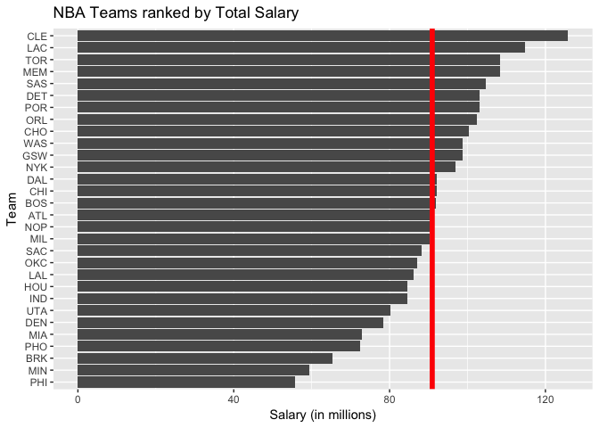

hw03-sandeep-tiwari
================
Sandeep Tiwari
10/6/2017

Data Preparation
================

``` r
library(readr) # importing data
library(dplyr) # data wrangling
```

    ## Warning: package 'dplyr' was built under R version 3.4.2

    ## 
    ## Attaching package: 'dplyr'

    ## The following objects are masked from 'package:stats':
    ## 
    ##     filter, lag

    ## The following objects are masked from 'package:base':
    ## 
    ##     intersect, setdiff, setequal, union

``` r
library(ggplot2) # graphics
```

### Roster and Stats

``` r
roster <- read.csv('../data/nba2017-roster.csv')
stats <- read.csv('../data/nba2017-stats.csv')
teams <- read.csv('../data/nba2017-teams.csv')
```

Basic Rankings
--------------

### Ranking according to salary

``` r
dec_sal <- arrange(teams, desc(salary))
ggplot(dec_sal, aes(reorder(team, salary), salary)) + geom_bar(position = "dodge", stat = 'summary', fun.y = "mean") + coord_flip() + labs(x = "Team", y = "Salary (in millions)", title = "NBA Teams ranked by Total Salary") + geom_hline(yintercept = mean(dec_sal$salary), lwd=2, col="red")
```

 Here, we have ranked the teams according to the teams' total salaries. We can see that the Cleveland Cavaliers are the highest paid team in the NBA, where as the Philadelphia 76ers are the lowest paid.

### Rankings according to total points

``` r
dec_pts <- arrange(teams, desc(points))
ggplot(dec_pts, aes(reorder(team, points), points)) + geom_bar(stat = 'identity') + coord_flip() + labs(x = "Team", y = "Total Points", title = "NBA Teams ranked by Total Points") + geom_hline(yintercept = mean(dec_pts$points), lwd=2, col="red")
```

 Here, we have ranked the teams according to the teams' total points. We can see that the Golden State Warriors are the highest scoring team in the NBA, where as the Sacramento Kings are the lowest scoring

### Rankings according to efficiency

``` r
dec_eff <- arrange(teams, desc(efficiency))
ggplot(dec_eff, aes(reorder(team, efficiency), efficiency)) + geom_bar(stat = 'identity') + coord_flip() + labs(x = "Team", y = "Total Efficiency", title = "NBA Teams ranked by Total Efficiency") + geom_hline(yintercept = mean(dec_eff$efficiency), lwd=2, col="red")
```

 Here, we have ranked the teams according to the teams' total efficiencies. We can see that the Cleveland Cavaliers have the highest efficiency in the NBA, closely followed by the Warriors, where as the Orlando Magic have the lowest efficiency.

Principal Components Analysis (PCA)
===================================

PCA of points3, points2, free\_throws, off\_rebounds, def\_rebounds, assists, steals, blocks, turnovers, fouls

``` r
pca <- prcomp(teams[, c("points3", "points2", "free_throws", "off_rebounds", "def_rebounds", "assists", "steals", "blocks", "turnovers", "fouls")], scale. = TRUE)
pca
```

    ## Standard deviations (1, .., p=10):
    ##  [1] 2.1669994 1.3046111 0.9897094 0.8784756 0.7308134 0.6913872 0.6182263
    ##  [8] 0.5101592 0.3655034 0.2503921
    ## 
    ## Rotation (n x k) = (10 x 10):
    ##                    PC1         PC2         PC3          PC4         PC5
    ## points3      0.1121782 -0.65652993  0.28806873 -0.042637313  0.28657624
    ## points2      0.3601766  0.32892544 -0.06763180 -0.347710703 -0.15173866
    ## free_throws  0.3227564 -0.17651228  0.39157491  0.147596178 -0.21363792
    ## off_rebounds 0.3029366  0.35931603  0.33884845 -0.288483019 -0.16571824
    ## def_rebounds 0.3719432 -0.12808273  0.15026131 -0.492969442  0.26476256
    ## assists      0.3125312 -0.44134618 -0.26294129 -0.088066602 -0.36972525
    ## steals       0.3447256 -0.03540585 -0.48554101  0.177578661 -0.33549491
    ## blocks       0.3162237  0.06131890 -0.48869371  0.003935374  0.65459381
    ## turnovers    0.3353958 -0.02169833  0.08910421  0.532117541 -0.04471763
    ## fouls        0.3072548  0.28954426  0.26469871  0.454751471  0.26814214
    ##                       PC6         PC7         PC8         PC9         PC10
    ## points3      -0.028435666  0.38167878  0.18027569 -0.20631322  0.409762462
    ## points2      -0.088714347  0.07302430 -0.47216199 -0.35836740  0.499011524
    ## free_throws  -0.487342521 -0.62732220  0.07726675 -0.08283563 -0.006875686
    ## off_rebounds  0.283093235  0.13535335  0.64646479 -0.14735551 -0.124601143
    ## def_rebounds  0.066309015 -0.04926346 -0.23787252  0.64632050 -0.168579984
    ## assists       0.176019008  0.11785039 -0.18235775 -0.34086739 -0.547385461
    ## steals       -0.303664534  0.25883825  0.32703573  0.41596580  0.246739300
    ## blocks       -0.009954065 -0.30799231  0.23947533 -0.27071160 -0.057627209
    ## turnovers     0.675777660 -0.18850849 -0.14308362  0.13524769  0.250947823
    ## fouls        -0.298848473  0.47268121 -0.21462859 -0.04367200 -0.335087245

Creating a data frame with the eigenvalues

``` r
eigs <- data.frame(
  eigenvalue = round(pca$sdev ^ 2, 4)
)
eigs$prop <- round(eigs$eigenvalue / sum(eigs$eigenvalue), 4)
eigs$cumprop <- round(cumsum(eigs$prop), 4)
eigs
```

    ##    eigenvalue   prop cumprop
    ## 1      4.6959 0.4696  0.4696
    ## 2      1.7020 0.1702  0.6398
    ## 3      0.9795 0.0980  0.7378
    ## 4      0.7717 0.0772  0.8150
    ## 5      0.5341 0.0534  0.8684
    ## 6      0.4780 0.0478  0.9162
    ## 7      0.3822 0.0382  0.9544
    ## 8      0.2603 0.0260  0.9804
    ## 9      0.1336 0.0134  0.9938
    ## 10     0.0627 0.0063  1.0001

Using first two PCs to get a scatterplot of the teams

``` r
teams$PC1 <- pca$x[, 1]
teams$PC2 <- pca$x[, 2]
ggplot(teams, aes(PC1, PC2)) + geom_point() + geom_text(aes(label=team)) + labs(title = "PCA plot (PC1 and PC2)")
```


Index based on PC1
------------------

``` r
z1 <- teams$PC1
s1 <- 100 * ((z1 - min(z1)) / (max(z1) - min(z1)))
teams$z1_rescaled <- s1
dec_s1 <- arrange(teams, desc(s1))
ggplot(dec_s1, aes(reorder(team, z1_rescaled), z1_rescaled)) + geom_bar(stat = "identity") + coord_flip() + labs(x = "Team", y = "First PC (scaled from 0 to 100)", title = "NBA Teams ranked by scaled PC1")
```

 Here, we have ranked the teams by scaled PC1. The rescaled PC1 values are more meaningful, as they are rescaled to values between 0 and 100. We can see that the Golden State Warriors have the highest index in the NBA, where as the Sacramento Kings have the lowest index.

Comments and Reflections
========================

1.  This isn't my first time working on a project with this sort of file structure, as I have done similar projects in some CS classes.

2.  This wasn't my first time using relative paths. Relative paths are important as it makes code more portable and R has already set the project directory for you.

3.  This was my firs time using an R script. Honestly, I prefer the R markdown, because I like how the code is split into its own chunks, separate from the rest of the file text, and so it is easy to run one specific block of code.

4.  I found the principal components analysis a bit difficult. Also creating the horizontal bar charts in order was a bit tricky.

5.  Everything else seemed pretty straightforward.

6.  Nobody helped my complete this assignment.

7.  The most time consuming part was the principal components analysis

8.  Even though I found it a bit complicated, I found the PCA interesting in terms of how it can summarize variables without losing the true content of the data.
