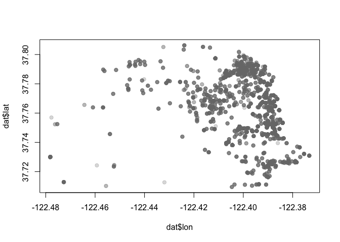
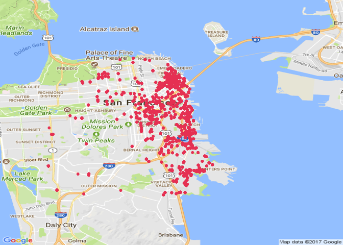
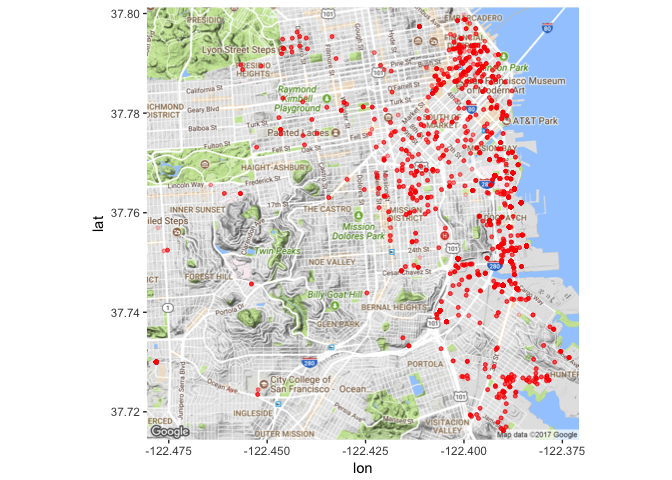
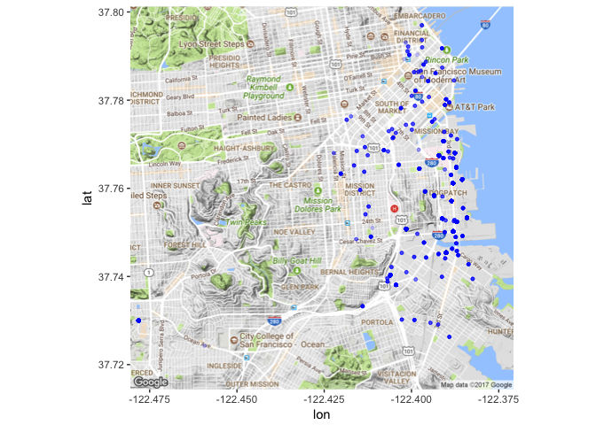

Lab 11: Regular Expressions
================
Sandeep Tiwari
11/17/2017

> ### Learning Objectives
>
> -   Work with the package `"stringr"`
> -   String manipulation
> -   More regular expressions
> -   A bit of data cleaning
> -   Making some maps

------------------------------------------------------------------------

Motivation
----------

So far we've been working with data sets that have been already cleaned, and can be imported in R ready to be analyzed.

Today we are going to start dealing with "messy" datasets. Most real life data sets require a pre-processing phase, and most of the time in any data analysis project will be spent on getting the data in the right shape. So it is extremely important that you gain skills to help you clean raw data.

While you work on this lab you may want to look at the [regex cheatsheet](https://github.com/ucb-stat133/stat133-fall-2017/blob/master/cheat-sheets/regular-expressions-cheatsheet.pdf)

### Mobile Food Schedule Data

The data set is on the github repo: <https://raw.githubusercontent.com/ucb-stat133/stat133-fall-2017/master/data/mobile-food-sf.csv>

The original source comes from the SF Open Data website: <https://data.sfgov.org/Economy-and-Community/Mobile-Food-Schedule/jjew-r69b>

Download a copy of the file to your working directory:

``` r
github <- "https://raw.githubusercontent.com/ucb-stat133/stat133-fall-2017/master/"
datafile <- "data/mobile-food-sf.csv"
download.file(paste0(github, datafile), destfile = "mobile-food-sf.csv")
```

Once you've downloaded the data file, you can read it in R:

``` r
dat <- read.csv('mobile-food-sf.csv', stringsAsFactors = FALSE)
```

The variables are:

-   `DayOfWeekStr`
-   `starttime`
-   `endtime`
-   `PermitLocation`
-   `optionaltext`
-   `ColdTruck`
-   `Applicant`
-   `Location`

### Package `"stringr"`

R has a set of built-in functions for manipulating strings. But there is also the package `"stringr"` that provides more functionality and a more user friendly syntax.

``` r
# install.packages("stringr")
library(stringr)
```

Changing Times
--------------

Let's begin processing the values in column `starttime`. The goal is to obtain new times in 24 hr format. For example, a starting time of `10AM` will be transformed to `10:00`. Likewise, a starting time of `1PM` will be transformed to `13:00`.

We are going to be manipulating character strings. Hence, I recommend to start working on a small subset of values. Figure out how to get the answers working on this subset, and then generalize to the entire data set.

Consider the first starting time that has a value of `10AM`. To get a better feeling of string manipulation, let's create a toy string with this value:

``` r
# toy string
time1 <- '10AM'
```

### Function `str_sub()`

To get the time and period values, you can use `str_sub()`:

``` r
# hour
str_sub(time1, start = 1, end = 2)
```

    ## [1] "10"

``` r
# period
str_sub(time1, start = 3, end = 4)
```

    ## [1] "AM"

**Your turn**: What about times where the hour has just one digit? For example: `9AM`, or `8AM`? Create the following vector `times` and try to subset the hour and the periods with `str_sub()`

``` r
times <- c('12PM', '10AM', '9AM', '8AM')

# subset time
str_sub(times, start = 1, end = -3)
```

    ## [1] "12" "10" "9"  "8"

``` r
# subset period
str_sub(times, start = -2)
```

    ## [1] "PM" "AM" "AM" "AM"

``` r
#
```

The nice thing about `str_sub()` is that it allows you to specify negative values for the `start` and `end` positions. Run the command below and see what happens:

``` r
# period
str_sub(times, start = -2)
```

### Function `str_replace()`

The tricky part with the vector `times` is the extraction of the hour. One solution is to "remove" the characters `AM` or `PM` from each time. You can do this with the substitution function `str_replace()`:

``` r
str_replace(times, pattern = 'AM|PM', replacement = '')
```

    ## [1] "12" "10" "9"  "8"

### Your Turn

So far you've managed to get the hour value and the period. Notice that you still need to convert the hours as numeric vectors:

``` r
hours <- as.numeric(str_replace(times, pattern = 'AM|PM', replacement = ''))
periods <- str_sub(times, start = -2)
```

-   Transform the hours into 24 hr values. Write R code to create a vector `start24` that contains the hour in 24hr scale.

``` r
# your vector start24
start24 <- c()
for(i in 1:length(hours)) {
  if (periods[i] == 'AM') {
    start24[i] = paste((hours[i]+12)%%12, ':00', sep = "")
  } else {
    start24[i] = paste((hours[i]), ':00', sep = "")
  }
}
start24
```

    ## [1] "12:00" "10:00" "9:00"  "8:00"

-   Add two columns `start` and `end` to the data frame `dat`, containing the starting and ending hour respectively (columns must be `"numeric"`).

``` r
# add 'start' hours
for(i in 1:nrow(dat)) {
  if (str_sub(dat$starttime[i], start = -2) == 'PM') {
    dat$start[i] = as.numeric(str_replace(dat$starttime[i], pattern = "AM|PM", replacement = ""))+12
  } else {
    dat$start[i] = as.numeric(str_replace(dat$starttime[i], pattern = "AM|PM", replacement = ""))%%12
  }
}

# add 'end' hours
for(i in 1:nrow(dat)) {
  if (str_sub(dat$endtime[i], start = -2) == 'PM') {
    dat$end[i] = as.numeric(str_replace(dat$starttime[i], pattern = "AM|PM", replacement = ""))+12
  } else {
    dat$end[i] = as.numeric(str_replace(dat$endtime[i], pattern = "AM|PM", replacement = ""))%%12
  }
}
dat$start = strtoi(dat$start)
dat$end = strtoi(dat$end)
```

-   With the starting and ending hours, calculate the duration, and add one more column `duration` to the data frame `dat`:

``` r
# add 'duration'
dat$duration = abs(dat$end - dat$start)
```

------------------------------------------------------------------------

Latitude and Longitude Coordinates
----------------------------------

Another interesting column in the data is `Location`. If you look at this column, you will see values like the following string `loc1`

``` r
loc1 <- "(37.7651967350509,-122.416451692902)"
```

The goal is to split `Location` into latitude and longitude. The first value corresponds to latitude, while the second value corresponds to longitude.

First we need to remove the parenthesis. The issue here is that the characters `(` and `)` have special meanings; recall they are metacharacters. So you need to **escape** in R them by pre-appending two backslashes: `\\(` and `\\)`

``` r
# "remove" opening parenthesis 
str_replace(loc1, pattern = '\\(', replacement = '')
```

    ## [1] "37.7651967350509,-122.416451692902)"

``` r
# "remove" closing parenthesis
str_replace(loc1, pattern = '\\)', replacement = '')
```

    ## [1] "(37.7651967350509,-122.416451692902"

You can also combine both patterns in a single call. But be careful:

``` r
str_replace(loc1, pattern = '\\(|\\)', replacement = '')
```

    ## [1] "37.7651967350509,-122.416451692902)"

`str_replace()` replaces only the first occurrence of `(` or `)`. However, the location values contain both opening and closing parentheses. To replace them all, you have to use `str_replace_all()`

``` r
str_replace_all(loc1, pattern = '\\(|\\)', replacement = '')
```

    ## [1] "37.7651967350509,-122.416451692902"

Now we need to get rid of the comma `,`. You could replace it with an empty string, but then you will end up with one long string like this:

``` r
lat_lon <- str_replace_all(loc1, pattern = '\\(|\\)', replacement = '')

str_replace(lat_lon, pattern = ',', replacement = '')
```

    ## [1] "37.7651967350509-122.416451692902"

Instead of replacing the comma, what we need to use is `str_split()`

``` r
# string split in stringr
str_split(lat_lon, pattern = ',')
```

    ## [[1]]
    ## [1] "37.7651967350509"  "-122.416451692902"

Notice that `str_split()` returns a list.

### Manipulating more location values

Let's define a vector with more location values, so we can start generalizing our code:

``` r
locs <- c(
  "(37.7651967350509,-122.416451692902)",
  "(37.7907890558203,-122.402273431333)",
  "(37.7111991003088,-122.394693339395)",
  "(37.7773000262759,-122.394812784799)",
  NA
)
```

-   create a list `lat_lon` containing the latitude and the longitude values of `locs`

``` r
lat_lon <- str_split(str_replace_all(locs, pattern = '\\(|\\)', replacement = ""), pattern = ",")
lat_lon
```

    ## [[1]]
    ## [1] "37.7651967350509"  "-122.416451692902"
    ## 
    ## [[2]]
    ## [1] "37.7907890558203"  "-122.402273431333"
    ## 
    ## [[3]]
    ## [1] "37.7111991003088"  "-122.394693339395"
    ## 
    ## [[4]]
    ## [1] "37.7773000262759"  "-122.394812784799"
    ## 
    ## [[5]]
    ## [1] NA

Assuming that you have `lat_lon`, to retrieve the latitude and longitude values, you can use the `lapply()` function, and then specify an *anonymous* function to get the first element (for the latitude):

``` r
lat <- lapply(lat_lon, function(x) x[1])
```

### Your Turn

Create a list `lon` by using `lapply()` with an anonymous function to extract longitude value (i.e. the second element):

To convert from list to a vector, use `unlist()`

``` r
latitute <- as.numeric(unlist(lat))
longitude <- as.numeric(unlist(lon))
```

Add two more columns: `lat` and `lon` to the data frame `dat`

``` r
# your code
str_split(str_replace_all(dat$Location, pattern = '\\(|\\)', replacement = ""), pattern = ",")
```

    ## [[1]]
    ## [1] "37.7651967350509"  "-122.416451692902"
    ## 
    ## [[2]]
    ## [1] "37.7907890558203"  "-122.402273431333"
    ## 
    ## [[3]]
    ## [1] "37.7111991003088"  "-122.394693339395"
    ## 
    ## [[4]]
    ## [1] "37.7773000262759"  "-122.394812784799"
    ## 
    ## [[5]]
    ## [1] NA
    ## 
    ## [[6]]
    ## [1] "37.7270392647114"  "-122.400141029645"
    ## 
    ## [[7]]
    ## [1] "37.7791347875605"  "-122.409112429172"
    ## 
    ## [[8]]
    ## [1] "37.7111428086172"  "-122.390768390822"
    ## 
    ## [[9]]
    ## [1] "37.7669552085597"  "-122.389155218908"
    ## 
    ## [[10]]
    ## [1] "37.7259394852676"  "-122.388280728611"
    ## 
    ## [[11]]
    ## [1] "37.7481349335447"  "-122.402362570049"
    ## 
    ## [[12]]
    ## [1] "37.7633319911646"  "-122.420235403432"
    ## 
    ## [[13]]
    ## [1] "37.7456828142552"  "-122.387911761433"
    ## 
    ## [[14]]
    ## [1] "37.7166561002993"  "-122.390559039934"
    ## 
    ## [[15]]
    ## [1] "37.7741429232436"  "-122.409095016264"
    ## 
    ## [[16]]
    ## [1] "37.7421620878271"  "-122.389107048701"
    ## 
    ## [[17]]
    ## [1] "37.7497006783758"  "-122.397932791641"
    ## 
    ## [[18]]
    ## [1] "37.7477067391559"  "-122.396413656839"
    ## 
    ## [[19]]
    ## [1] "37.7667124225934"  "-122.429712749525"
    ## 
    ## [[20]]
    ## [1] "37.7755007902079" "-122.44089299009"
    ## 
    ## [[21]]
    ## [1] "37.7950473983156"  "-122.443611961361"
    ## 
    ## [[22]]
    ## [1] "37.7919274798426"  "-122.446351899572"
    ## 
    ## [[23]]
    ## [1] "37.7666322775493"  "-122.392728509584"
    ## 
    ## [[24]]
    ## [1] "37.726685271787"   "-122.381502925492"
    ## 
    ## [[25]]
    ## [1] "37.7789072614613"  "-122.411420115933"
    ## 
    ## [[26]]
    ## [1] "37.7187638807592"  "-122.390579577708"
    ## 
    ## [[27]]
    ## [1] "37.7508581374316"  "-122.394102374471"
    ## 
    ## [[28]]
    ## [1] "37.8033613224352"  "-122.424123509274"
    ## 
    ## [[29]]
    ## [1] "37.745078648302"   "-122.392261844141"
    ## 
    ## [[30]]
    ## [1] "37.7637507401569"  "-122.390705976388"
    ## 
    ## [[31]]
    ## [1] "37.7239376882365"  "-122.386832585234"
    ## 
    ## [[32]]
    ## [1] "37.76833824373"    "-122.389400461508"
    ## 
    ## [[33]]
    ## [1] "37.7489503634271"  "-122.401493189708"
    ## 
    ## [[34]]
    ## [1] "37.7923326412243"  "-122.395649033197"
    ## 
    ## [[35]]
    ## [1] "37.7482492881932"  "-122.396524546777"
    ## 
    ## [[36]]
    ## [1] "37.7758704298588"  "-122.423847229106"
    ## 
    ## [[37]]
    ## [1] "37.7873606094505"  "-122.392701953926"
    ## 
    ## [[38]]
    ## [1] "37.7756456857724"  "-122.397696734316"
    ## 
    ## [[39]]
    ## [1] "37.7244499679315"  "-122.393984693201"
    ## 
    ## [[40]]
    ## [1] "37.7299854741476"  "-122.376954714967"
    ## 
    ## [[41]]
    ## [1] "37.7110500071211" "-122.39934738525"
    ## 
    ## [[42]]
    ## [1] "37.7228645657946"  "-122.389692712248"
    ## 
    ## [[43]]
    ## [1] "37.7553930872542"  "-122.418673985373"
    ## 
    ## [[44]]
    ## [1] "37.7910703986756"  "-122.401145196973"
    ## 
    ## [[45]]
    ## [1] "37.7558763209725"  "-122.412271386632"
    ## 
    ## [[46]]
    ## [1] "37.7863630776208"  "-122.399264358097"
    ## 
    ## [[47]]
    ## [1] "37.7736321199408" "-122.44051423368"
    ## 
    ## [[48]]
    ## [1] "37.7496104682221"  "-122.399429343357"
    ## 
    ## [[49]]
    ## [1] "37.7686648241945"  "-122.407903224274"
    ## 
    ## [[50]]
    ## [1] "37.7686648241945"  "-122.407903224274"
    ## 
    ## [[51]]
    ## [1] "37.7745761256077"  "-122.398261747293"
    ## 
    ## [[52]]
    ## [1] "37.7864296546035"  "-122.398069300142"
    ## 
    ## [[53]]
    ## [1] "37.786705596962"   "-122.392030655401"
    ## 
    ## [[54]]
    ## [1] "37.7240189919943"  "-122.390118463974"
    ## 
    ## [[55]]
    ## [1] "37.7863927555352"  "-122.395726074077"
    ## 
    ## [[56]]
    ## [1] "37.7953746521913"  "-122.433507424647"
    ## 
    ## [[57]]
    ## [1] "37.7667867792956"  "-122.388078331989"
    ## 
    ## [[58]]
    ## [1] "37.7885298177102"  "-122.396140544185"
    ## 
    ## [[59]]
    ## [1] "37.7652922254458"  "-122.415375651896"
    ## 
    ## [[60]]
    ## [1] "37.7538342401608"  "-122.389912147781"
    ## 
    ## [[61]]
    ## [1] "37.7523560542966"  "-122.388784980412"
    ## 
    ## [[62]]
    ## [1] "37.7523560542966"  "-122.388784980412"
    ## 
    ## [[63]]
    ## [1] "37.7666322775493"  "-122.392728509584"
    ## 
    ## [[64]]
    ## [1] "37.7269806226365"  "-122.381785388427"
    ## 
    ## [[65]]
    ## [1] "37.7348787351337"  "-122.415531470861"
    ## 
    ## [[66]]
    ## [1] "37.751548491531"   "-122.387718127295"
    ## 
    ## [[67]]
    ## [1] "37.7496706104363"  "-122.398431642605"
    ## 
    ## [[68]]
    ## [1] "37.7425490595565"  "-122.387326932203"
    ## 
    ## [[69]]
    ## [1] "37.748203685056"   "-122.387245352135"
    ## 
    ## [[70]]
    ## [1] "37.7541031367651"  "-122.387962966002"
    ## 
    ## [[71]]
    ## [1] "37.7514511815096"  "-122.390465773031"
    ## 
    ## [[72]]
    ## [1] "37.7603214583917"  "-122.412573240495"
    ## 
    ## [[73]]
    ## [1] "37.750453803667"   "-122.390398059007"
    ## 
    ## [[74]]
    ## [1] "37.7628501796944"  "-122.412966144746"
    ## 
    ## [[75]]
    ## [1] "37.7822802514051" "-122.44098487304"
    ## 
    ## [[76]]
    ## [1] "37.745078648302"   "-122.392261844141"
    ## 
    ## [[77]]
    ## [1] "37.7239376882365"  "-122.386832585234"
    ## 
    ## [[78]]
    ## [1] "37.7863630776208"  "-122.399264358097"
    ## 
    ## [[79]]
    ## [1] "37.7446858481632"  "-122.386571458803"
    ## 
    ## [[80]]
    ## [1] "37.7876871932612"  "-122.399490236599"
    ## 
    ## [[81]]
    ## [1] "37.7489503634271"  "-122.401493189708"
    ## 
    ## [[82]]
    ## [1] "37.788589113579"   "-122.405613673233"
    ## 
    ## [[83]]
    ## [1] "37.7270006086593"  "-122.390150411037"
    ## 
    ## [[84]]
    ## [1] "37.771814022357"   "-122.413989317366"
    ## 
    ## [[85]]
    ## [1] "37.7898310241126"  "-122.397562684622"
    ## 
    ## [[86]]
    ## [1] "37.7904940956493"  "-122.399633341677"
    ## 
    ## [[87]]
    ## [1] "37.7394652718683"  "-122.382463242698"
    ## 
    ## [[88]]
    ## [1] "37.7451679475044"  "-122.392181270945"
    ## 
    ## [[89]]
    ## [1] "37.7789806675378"  "-122.401876399982"
    ## 
    ## [[90]]
    ## [1] "37.7631162577319"  "-122.412988853417"
    ## 
    ## [[91]]
    ## [1] "37.7805621947803"  "-122.431189105466"
    ## 
    ## [[92]]
    ## [1] "37.7302332323588"  "-122.402759048478"
    ## 
    ## [[93]]
    ## [1] NA
    ## 
    ## [[94]]
    ## [1] "37.7264916637361"  "-122.389253644975"
    ## 
    ## [[95]]
    ## [1] "37.7863927555352"  "-122.395726074077"
    ## 
    ## [[96]]
    ## [1] "37.7685079333296"  "-122.417013921855"
    ## 
    ## [[97]]
    ## [1] "37.7633319911646"  "-122.420235403432"
    ## 
    ## [[98]]
    ## [1] "37.7678503715903" "-122.41063025867"
    ## 
    ## [[99]]
    ## [1] "37.7887517683903" "-122.45623065616"
    ## 
    ## [[100]]
    ## [1] "37.7267339112889"  "-122.378972003992"
    ## 
    ## [[101]]
    ## [1] "37.7538342401608"  "-122.389912147781"
    ## 
    ## [[102]]
    ## [1] "37.7477067391559"  "-122.396413656839"
    ## 
    ## [[103]]
    ## [1] "37.7895884629627"  "-122.421183529217"
    ## 
    ## [[104]]
    ## [1] "37.7111783070436"  "-122.403573115181"
    ## 
    ## [[105]]
    ## [1] "37.7490358344714"  "-122.411623966472"
    ## 
    ## [[106]]
    ## [1] "37.7490358344714"  "-122.411623966472"
    ## 
    ## [[107]]
    ## [1] "37.7663593026796" "-122.41644564135"
    ## 
    ## [[108]]
    ## [1] "37.7365999870093"  "-122.377204056226"
    ## 
    ## [[109]]
    ## [1] "37.7667867792956"  "-122.388078331989"
    ## 
    ## [[110]]
    ## [1] "37.7399293110874"  "-122.391283611001"
    ## 
    ## [[111]]
    ## [1] "37.7640523949866"  "-122.394139809417"
    ## 
    ## [[112]]
    ## [1] "37.7731540275458"  "-122.452684612088"
    ## 
    ## [[113]]
    ## [1] "37.777844286068"   "-122.394123606062"
    ## 
    ## [[114]]
    ## [1] "37.7584408101697"  "-122.391167953092"
    ## 
    ## [[115]]
    ## [1] "37.7508581374316"  "-122.394102374471"
    ## 
    ## [[116]]
    ## [1] "37.7555059783625"  "-122.385220879126"
    ## 
    ## [[117]]
    ## [1] "37.7555059783625"  "-122.385220879126"
    ## 
    ## [[118]]
    ## [1] "37.7169690643397"  "-122.389355637131"
    ## 
    ## [[119]]
    ## [1] "37.7527217661049"  "-122.392725753817"
    ## 
    ## [[120]]
    ## [1] "37.7332557262018"  "-122.413998779197"
    ## 
    ## [[121]]
    ## [1] "37.7162121435373"  "-122.389968007493"
    ## 
    ## [[122]]
    ## [1] "37.7597465483315"  "-122.409865798217"
    ## 
    ## [[123]]
    ## [1] "37.76833824373"    "-122.389400461508"
    ## 
    ## [[124]]
    ## [1] "37.7446858481632"  "-122.386571458803"
    ## 
    ## [[125]]
    ## [1] "37.72866509729"    "-122.381660626351"
    ## 
    ## [[126]]
    ## [1] "37.7679905171377"  "-122.413407603967"
    ## 
    ## [[127]]
    ## [1] "37.7683111651865" "-122.40787860481"
    ## 
    ## [[128]]
    ## [1] "37.7873606094505"  "-122.392701953926"
    ## 
    ## [[129]]
    ## [1] "37.7988115687589"  "-122.399664721789"
    ## 
    ## [[130]]
    ## [1] "37.786705596962"   "-122.392030655401"
    ## 
    ## [[131]]
    ## [1] "37.779488829411"   "-122.389190496856"
    ## 
    ## [[132]]
    ## [1] "37.7756956924416"  "-122.393372938554"
    ## 
    ## [[133]]
    ## [1] "37.788837572632"   "-122.398844308239"
    ## 
    ## [[134]]
    ## [1] "37.7908392304258"  "-122.396308779248"
    ## 
    ## [[135]]
    ## [1] "37.7732001359429"  "-122.422286181031"
    ## 
    ## [[136]]
    ## [1] "37.7767220798015"  "-122.446585903135"
    ## 
    ## [[137]]
    ## [1] "37.7767220798015"  "-122.446585903135"
    ## 
    ## [[138]]
    ## [1] "37.780188074444"   "-122.390098985325"
    ## 
    ## [[139]]
    ## [1] "37.780188074444"   "-122.390098985325"
    ## 
    ## [[140]]
    ## [1] "37.7128718139384"  "-122.472687037509"
    ## 
    ## [[141]]
    ## [1] "37.786447007962"  "-122.40187181337"
    ## 
    ## [[142]]
    ## [1] "37.7447250168321"  "-122.386402793857"
    ## 
    ## [[143]]
    ## [1] "37.7447250168321"  "-122.386402793857"
    ## 
    ## [[144]]
    ## [1] "37.7481349335447"  "-122.402362570049"
    ## 
    ## [[145]]
    ## [1] "37.750453803667"   "-122.390398059007"
    ## 
    ## [[146]]
    ## [1] "37.745078648302"   "-122.392261844141"
    ## 
    ## [[147]]
    ## [1] "37.7267728572176"  "-122.388073576343"
    ## 
    ## [[148]]
    ## [1] "37.7856640823991"  "-122.399568868889"
    ## 
    ## [[149]]
    ## [1] "37.7482822297931"  "-122.415908342523"
    ## 
    ## [[150]]
    ## [1] "37.7455819612317"  "-122.401251043957"
    ## 
    ## [[151]]
    ## [1] "37.7578416291379"  "-122.391250489057"
    ## 
    ## [[152]]
    ## [1] "37.7522353219293" "-122.38975002217"
    ## 
    ## [[153]]
    ## [1] "37.7522353219293" "-122.38975002217"
    ## 
    ## [[154]]
    ## [1] "37.7474780240452"  "-122.396175096381"
    ## 
    ## [[155]]
    ## [1] "37.7591086681241"  "-122.390400000543"
    ## 
    ## [[156]]
    ## [1] "37.7591086681241"  "-122.390400000543"
    ## 
    ## [[157]]
    ## [1] "37.7491830922641"  "-122.385380152928"
    ## 
    ## [[158]]
    ## [1] "37.7456251136816"  "-122.391799229195"
    ## 
    ## [[159]]
    ## [1] "37.7256013829105" "-122.38141316378"
    ## 
    ## [[160]]
    ## [1] "37.7948472365487"  "-122.446058770817"
    ## 
    ## [[161]]
    ## [1] "37.7697486159216"  "-122.415593736173"
    ## 
    ## [[162]]
    ## [1] "37.7496175291101"  "-122.387588501326"
    ## 
    ## [[163]]
    ## [1] "37.7448503261018"  "-122.386622994805"
    ## 
    ## [[164]]
    ## [1] "37.7646370033035"  "-122.413445537287"
    ## 
    ## [[165]]
    ## [1] "37.7746102279804"  "-122.399580294284"
    ## 
    ## [[166]]
    ## [1] "37.7394046148963"  "-122.401386698396"
    ## 
    ## [[167]]
    ## [1] "37.7846912153683" "-122.39458113071"
    ## 
    ## [[168]]
    ## [1] "37.7508581374316"  "-122.394102374471"
    ## 
    ## [[169]]
    ## [1] "37.779488829411"   "-122.389190496856"
    ## 
    ## [[170]]
    ## [1] "37.7892862133639"  "-122.395117913536"
    ## 
    ## [[171]]
    ## [1] "37.7553805997368"  "-122.388085445297"
    ## 
    ## [[172]]
    ## [1] "37.7529521222808"  "-122.387906207247"
    ## 
    ## [[173]]
    ## [1] "37.7760385105764"  "-122.392939332071"
    ## 
    ## [[174]]
    ## [1] "37.7886109721909" "-122.39272561329"
    ## 
    ## [[175]]
    ## [1] "37.7463072924429"  "-122.388364499595"
    ## 
    ## [[176]]
    ## [1] "37.7463072924429"  "-122.388364499595"
    ## 
    ## [[177]]
    ## [1] "37.72727724475"    "-122.399160735119"
    ## 
    ## [[178]]
    ## [1] "37.7494702507258"  "-122.399927745604"
    ## 
    ## [[179]]
    ## [1] "37.786447007962"  "-122.40187181337"
    ## 
    ## [[180]]
    ## [1] "37.7271017536177"  "-122.387234037178"
    ## 
    ## [[181]]
    ## [1] "37.7524774154426"  "-122.475310777243"
    ## 
    ## [[182]]
    ## [1] "37.7725616893359"  "-122.404474023931"
    ## 
    ## [[183]]
    ## [1] "37.7482822297931"  "-122.415908342523"
    ## 
    ## [[184]]
    ## [1] "37.729095881394"   "-122.392369958155"
    ## 
    ## [[185]]
    ## [1] "37.7592586029513"  "-122.387508486641"
    ## 
    ## [[186]]
    ## [1] "37.772965881143"   "-122.406510236721"
    ## 
    ## [[187]]
    ## [1] "37.7792036135615"  "-122.398421700749"
    ## 
    ## [[188]]
    ## [1] "37.763898172112"   "-122.393787763456"
    ## 
    ## [[189]]
    ## [1] "37.7581452995887"  "-122.391140229024"
    ## 
    ## [[190]]
    ## [1] "37.7491830922641"  "-122.385380152928"
    ## 
    ## [[191]]
    ## [1] "37.7456251136816"  "-122.391799229195"
    ## 
    ## [[192]]
    ## [1] "37.7811636144171" "-122.39303923437"
    ## 
    ## [[193]]
    ## [1] "37.7448503261018"  "-122.386622994805"
    ## 
    ## [[194]]
    ## [1] "37.760780278477"   "-122.407206690641"
    ## 
    ## [[195]]
    ## [1] "37.7759468088778"  "-122.437383577606"
    ## 
    ## [[196]]
    ## [1] "37.7744110410018"  "-122.401582774174"
    ## 
    ## [[197]]
    ## [1] "37.7747758874698"  "-122.407328371042"
    ## 
    ## [[198]]
    ## [1] "37.7525527576463"  "-122.387867927348"
    ## 
    ## [[199]]
    ## [1] "37.7630476291484"  "-122.388652881267"
    ## 
    ## [[200]]
    ## [1] "37.7809744769695"  "-122.399942924764"
    ## 
    ## [[201]]
    ## [1] "37.7263696196635"  "-122.384041765309"
    ## 
    ## [[202]]
    ## [1] "37.7263381578801"  "-122.387543034105"
    ## 
    ## [[203]]
    ## [1] "37.729483926788"   "-122.394571014085"
    ## 
    ## [[204]]
    ## [1] "37.7592948961276" "-122.39611224788"
    ## 
    ## [[205]]
    ## [1] "37.7641509499715"  "-122.412358791534"
    ## 
    ## [[206]]
    ## [1] "37.7095211282262"  "-122.404617048658"
    ## 
    ## [[207]]
    ## [1] "37.7529617064123"  "-122.406401730502"
    ## 
    ## [[208]]
    ## [1] "37.7644655822132"  "-122.397747616123"
    ## 
    ## [[209]]
    ## [1] "37.7693786950827"  "-122.410988658263"
    ## 
    ## [[210]]
    ## [1] "37.7845283055703"  "-122.407272318144"
    ## 
    ## [[211]]
    ## [1] "37.7103860077608"  "-122.396464771663"
    ## 
    ## [[212]]
    ## [1] "37.7988115687589"  "-122.399664721789"
    ## 
    ## [[213]]
    ## [1] "37.7781283797338"  "-122.418652129997"
    ## 
    ## [[214]]
    ## [1] "37.7705660724513"  "-122.390073746001"
    ## 
    ## [[215]]
    ## [1] "37.7494702507258"  "-122.399927745604"
    ## 
    ## [[216]]
    ## [1] "37.7705678488858"  "-122.420273262356"
    ## 
    ## [[217]]
    ## [1] "37.7884519937144"  "-122.396042848565"
    ## 
    ## [[218]]
    ## [1] "37.7128718139384"  "-122.472687037509"
    ## 
    ## [[219]]
    ## [1] "37.7128718139384"  "-122.472687037509"
    ## 
    ## [[220]]
    ## [1] "37.7902665460329"  "-122.400629258559"
    ## 
    ## [[221]]
    ## [1] "37.7917627624843"  "-122.391253645033"
    ## 
    ## [[222]]
    ## [1] "37.7489613833537"  "-122.387339637684"
    ## 
    ## [[223]]
    ## [1] "37.7447250168321"  "-122.386402793857"
    ## 
    ## [[224]]
    ## [1] "37.7734404634488"  "-122.405556607063"
    ## 
    ## [[225]]
    ## [1] "37.7437519273424"  "-122.403462463841"
    ## 
    ## [[226]]
    ## [1] "37.7260001319965"  "-122.383390817067"
    ## 
    ## [[227]]
    ## [1] "37.7462754843591"  "-122.392447441505"
    ## 
    ## [[228]]
    ## [1] "37.7442960182807"  "-122.395807199913"
    ## 
    ## [[229]]
    ## [1] "37.7442960182807"  "-122.395807199913"
    ## 
    ## [[230]]
    ## [1] "37.7231692072554" "-122.38697483362"
    ## 
    ## [[231]]
    ## [1] "37.7953974901072"  "-122.441735157542"
    ## 
    ## [[232]]
    ## [1] "37.767519417299"   "-122.412539656202"
    ## 
    ## [[233]]
    ## [1] "37.7618425082863"  "-122.389690061404"
    ## 
    ## [[234]]
    ## [1] "37.7631791971676"  "-122.408323348249"
    ## 
    ## [[235]]
    ## [1] "37.7750209861951"  "-122.413222349168"
    ## 
    ## [[236]]
    ## [1] "37.7444352289816"  "-122.386131058867"
    ## 
    ## [[237]]
    ## [1] "37.7365999870093"  "-122.377204056226"
    ## 
    ## [[238]]
    ## [1] "37.7843370711132"  "-122.395225723073"
    ## 
    ## [[239]]
    ## [1] "37.7453520187473"  "-122.402789774322"
    ## 
    ## [[240]]
    ## [1] "37.7653536432638" "-122.40365294813"
    ## 
    ## [[241]]
    ## [1] "37.7653536432638" "-122.40365294813"
    ## 
    ## [[242]]
    ## [1] "37.7426493577383"  "-122.385861558324"
    ## 
    ## [[243]]
    ## [1] "37.7637290705316"  "-122.389871672284"
    ## 
    ## [[244]]
    ## [1] "37.7543346885192"  "-122.389824170428"
    ## 
    ## [[245]]
    ## [1] "37.7690273253983"  "-122.415681626119"
    ## 
    ## [[246]]
    ## [1] "37.7668538737285"  "-122.390858284639"
    ## 
    ## [[247]]
    ## [1] "37.7668538737285"  "-122.390858284639"
    ## 
    ## [[248]]
    ## [1] "37.7644655822132"  "-122.397747616123"
    ## 
    ## [[249]]
    ## [1] "37.7789161780122"  "-122.390426395944"
    ## 
    ## [[250]]
    ## [1] "37.7114336729248"  "-122.393703104382"
    ## 
    ## [[251]]
    ## [1] "37.7286139518831"  "-122.394644631904"
    ## 
    ## [[252]]
    ## [1] "37.7575700580023"  "-122.393184466145"
    ## 
    ## [[253]]
    ## [1] "37.7891611498687"  "-122.409540294778"
    ## 
    ## [[254]]
    ## [1] "37.7929442181312"  "-122.397423158071"
    ## 
    ## [[255]]
    ## [1] "37.7930054602042"  "-122.401993004284"
    ## 
    ## [[256]]
    ## [1] "37.7936048767403"  "-122.396415980979"
    ## 
    ## [[257]]
    ## [1] "37.7885298177102"  "-122.396140544185"
    ## 
    ## [[258]]
    ## [1] "37.7892526344794"  "-122.395226296171"
    ## 
    ## [[259]]
    ## [1] "37.7892526344794"  "-122.395226296171"
    ## 
    ## [[260]]
    ## [1] "37.7863836212372"  "-122.402297224865"
    ## 
    ## [[261]]
    ## [1] "37.7856812513257"  "-122.405778850215"
    ## 
    ## [[262]]
    ## [1] "37.7969615325232"  "-122.399444500759"
    ## 
    ## [[263]]
    ## [1] "37.8062721441523" "-122.42388615342"
    ## 
    ## [[264]]
    ## [1] "37.7930490854658"  "-122.401650717955"
    ## 
    ## [[265]]
    ## [1] "37.7924579257151"  "-122.398634107992"
    ## 
    ## [[266]]
    ## [1] "37.7920514593666"  "-122.400943208625"
    ## 
    ## [[267]]
    ## [1] "37.7849061488879"  "-122.407072991554"
    ## 
    ## [[268]]
    ## [1] "37.7849061488879"  "-122.407072991554"
    ## 
    ## [[269]]
    ## [1] "37.786635282569"   "-122.406472958687"
    ## 
    ## [[270]]
    ## [1] "37.7908897937244"  "-122.399494126212"
    ## 
    ## [[271]]
    ## [1] "37.7764065244709"  "-122.394110513855"
    ## 
    ## [[272]]
    ## [1] "37.7928878954774"  "-122.402704171869"
    ## 
    ## [[273]]
    ## [1] "37.7924472039343"  "-122.397442495538"
    ## 
    ## [[274]]
    ## [1] "37.7741408778527"  "-122.420350503908"
    ## 
    ## [[275]]
    ## [1] "37.7262238053212"  "-122.379024844696"
    ## 
    ## [[276]]
    ## [1] "37.7193678479621"  "-122.398371361923"
    ## 
    ## [[277]]
    ## [1] "37.757106787801"   "-122.388061294812"
    ## 
    ## [[278]]
    ## [1] "37.7630476291484"  "-122.388652881267"
    ## 
    ## [[279]]
    ## [1] "37.7263696196635"  "-122.384041765309"
    ## 
    ## [[280]]
    ## [1] "37.79226517009"    "-122.443698807802"
    ## 
    ## [[281]]
    ## [1] "37.7704529501655"  "-122.400042655595"
    ## 
    ## [[282]]
    ## [1] "37.7655925448088"  "-122.389099860237"
    ## 
    ## [[283]]
    ## [1] "37.7641509499715"  "-122.412358791534"
    ## 
    ## [[284]]
    ## [1] "37.7758232844754"  "-122.446527752912"
    ## 
    ## [[285]]
    ## [1] "37.7644655822132"  "-122.397747616123"
    ## 
    ## [[286]]
    ## [1] "37.7777290650886"  "-122.410905331989"
    ## 
    ## [[287]]
    ## [1] "37.754283115204"   "-122.412085299034"
    ## 
    ## [[288]]
    ## [1] "37.7228143678148"  "-122.391102685187"
    ## 
    ## [[289]]
    ## [1] "37.7789161780122"  "-122.390426395944"
    ## 
    ## [[290]]
    ## [1] "37.764203655834"   "-122.389875569211"
    ## 
    ## [[291]]
    ## [1] "37.7719979905519"  "-122.388695736053"
    ## 
    ## [[292]]
    ## [1] "37.7555059783625"  "-122.385220879126"
    ## 
    ## [[293]]
    ## [1] "37.7873303235077"  "-122.392859291165"
    ## 
    ## [[294]]
    ## [1] "37.7751228745778"  "-122.394097441849"
    ## 
    ## [[295]]
    ## [1] "37.7599819816022"  "-122.413769206324"
    ## 
    ## [[296]]
    ## [1] "37.792945427344"   "-122.445824652024"
    ## 
    ## [[297]]
    ## [1] "37.7301361101663"  "-122.399162749749"
    ## 
    ## [[298]]
    ## [1] "37.7757486299466"  "-122.424223873217"
    ## 
    ## [[299]]
    ## [1] "37.7899264436726"  "-122.391250706732"
    ## 
    ## [[300]]
    ## [1] "37.7889460031071"  "-122.403692234115"
    ## 
    ## [[301]]
    ## [1] "37.7693456875221"  "-122.413329888831"
    ## 
    ## [[302]]
    ## [1] "37.7796402072113"  "-122.390153758805"
    ## 
    ## [[303]]
    ## [1] "37.7697377914123"  "-122.389256662556"
    ## 
    ## [[304]]
    ## [1] "37.7555197319435"  "-122.384999937383"
    ## 
    ## [[305]]
    ## [1] "37.7935583358987"  "-122.397654505859"
    ## 
    ## [[306]]
    ## [1] "37.7630433072676"  "-122.410942976716"
    ## 
    ## [[307]]
    ## [1] "37.7921033879545"  "-122.397585967453"
    ## 
    ## [[308]]
    ## [1] "37.7596236343405"  "-122.414706934828"
    ## 
    ## [[309]]
    ## [1] "37.7830953918322"  "-122.440170134632"
    ## 
    ## [[310]]
    ## [1] "37.7847140158543"  "-122.407771493331"
    ## 
    ## [[311]]
    ## [1] "37.7908897937244"  "-122.399494126212"
    ## 
    ## [[312]]
    ## [1] "37.7861609344287"  "-122.405127311306"
    ## 
    ## [[313]]
    ## [1] "37.7839488842882"  "-122.408008279363"
    ## 
    ## [[314]]
    ## [1] "37.789691367587"   "-122.396595637084"
    ## 
    ## [[315]]
    ## [1] "37.789691367587"   "-122.396595637084"
    ## 
    ## [[316]]
    ## [1] "37.7821634269963"  "-122.398858175825"
    ## 
    ## [[317]]
    ## [1] "37.7821634269963"  "-122.398858175825"
    ## 
    ## [[318]]
    ## [1] "37.7812661735253"  "-122.425596113366"
    ## 
    ## [[319]]
    ## [1] "37.7812661735253"  "-122.425596113366"
    ## 
    ## [[320]]
    ## [1] "37.7193678479621"  "-122.398371361923"
    ## 
    ## [[321]]
    ## [1] NA
    ## 
    ## [[322]]
    ## [1] "37.7547401744411" "-122.39000416543"
    ## 
    ## [[323]]
    ## [1] "37.7706453983908" "-122.3934769372" 
    ## 
    ## [[324]]
    ## [1] "37.7250092583289"  "-122.388305168263"
    ## 
    ## [[325]]
    ## [1] "37.7753407062288"  "-122.407045641377"
    ## 
    ## [[326]]
    ## [1] "37.7235928942816"  "-122.391044912211"
    ## 
    ## [[327]]
    ## [1] "37.7529330108826" "-122.38674649469"
    ## 
    ## [[328]]
    ## [1] "37.7229710660157"  "-122.391616677859"
    ## 
    ## [[329]]
    ## [1] "37.7252506712014"  "-122.392050803801"
    ## 
    ## [[330]]
    ## [1] "37.7740748410583"  "-122.390668458146"
    ## 
    ## [[331]]
    ## [1] "37.7740748410583"  "-122.390668458146"
    ## 
    ## [[332]]
    ## [1] "37.7269088991548"  "-122.388709328768"
    ## 
    ## [[333]]
    ## [1] "37.7724753140911"  "-122.414688457015"
    ## 
    ## [[334]]
    ## [1] "37.7877437884077"  "-122.394943017483"
    ## 
    ## [[335]]
    ## [1] "37.764451962648"   "-122.412387323606"
    ## 
    ## [[336]]
    ## [1] "37.7811982218612"  "-122.423315547721"
    ## 
    ## [[337]]
    ## [1] "37.7762823730273"  "-122.417645919077"
    ## 
    ## [[338]]
    ## [1] "37.7949843862247"  "-122.400720442063"
    ## 
    ## [[339]]
    ## [1] "37.787379499857"   "-122.391182442661"
    ## 
    ## [[340]]
    ## [1] "37.7478431533724"  "-122.394575214957"
    ## 
    ## [[341]]
    ## [1] "37.7683069928"     "-122.412000336092"
    ## 
    ## [[342]]
    ## [1] "37.7638394608477"  "-122.456786975662"
    ## 
    ## [[343]]
    ## [1] "37.7824758824599"  "-122.392962638578"
    ## 
    ## [[344]]
    ## [1] "37.7707029760975"  "-122.390790355566"
    ## 
    ## [[345]]
    ## [1] "37.7707029760975"  "-122.390790355566"
    ## 
    ## [[346]]
    ## [1] "37.7707029760975"  "-122.390790355566"
    ## 
    ## [[347]]
    ## [1] "37.7707029760975"  "-122.390790355566"
    ## 
    ## [[348]]
    ## [1] "37.7707029760975"  "-122.390790355566"
    ## 
    ## [[349]]
    ## [1] "37.7707029760975"  "-122.390790355566"
    ## 
    ## [[350]]
    ## [1] "37.7884553541868"  "-122.418493877061"
    ## 
    ## [[351]]
    ## [1] "37.7207115524695"  "-122.395916084904"
    ## 
    ## [[352]]
    ## [1] "37.7708968719166"  "-122.420303482979"
    ## 
    ## [[353]]
    ## [1] "37.7270036160148"  "-122.380330046337"
    ## 
    ## [[354]]
    ## [1] "37.7706453983908" "-122.3934769372" 
    ## 
    ## [[355]]
    ## [1] "37.7818065268172"  "-122.429790840366"
    ## 
    ## [[356]]
    ## [1] "37.7703531653561" "-122.39120602229"
    ## 
    ## [[357]]
    ## [1] "37.7251110717256"  "-122.388484554934"
    ## 
    ## [[358]]
    ## [1] "37.7255714777643" "-122.38953365883"
    ## 
    ## [[359]]
    ## [1] "37.7892526344794"  "-122.395226296171"
    ## 
    ## [[360]]
    ## [1] "37.791985742424"   "-122.396954967384"
    ## 
    ## [[361]]
    ## [1] "37.749338052069"   "-122.402065734207"
    ## 
    ## [[362]]
    ## [1] "37.7811622673542"  "-122.434852967987"
    ## 
    ## [[363]]
    ## [1] "37.747103654263"   "-122.398580950956"
    ## 
    ## [[364]]
    ## [1] "37.7740748410583"  "-122.390668458146"
    ## 
    ## [[365]]
    ## [1] "37.7665109269083" "-122.40926014493"
    ## 
    ## [[366]]
    ## [1] "37.7262979060055"  "-122.389150144527"
    ## 
    ## [[367]]
    ## [1] "37.7656006287902"  "-122.411489324943"
    ## 
    ## [[368]]
    ## [1] "37.7724753140911"  "-122.414688457015"
    ## 
    ## [[369]]
    ## [1] "37.772039113525"   "-122.395974631586"
    ## 
    ## [[370]]
    ## [1] "37.7950829637594"  "-122.440073143561"
    ## 
    ## [[371]]
    ## [1] "37.7931917077927"  "-122.443886114646"
    ## 
    ## [[372]]
    ## [1] "37.7936702903518"  "-122.401180084353"
    ## 
    ## [[373]]
    ## [1] "37.7475231528558"  "-122.387175828519"
    ## 
    ## [[374]]
    ## [1] "37.7997177464055"  "-122.400003237392"
    ## 
    ## [[375]]
    ## [1] "37.7478431533724"  "-122.394575214957"
    ## 
    ## [[376]]
    ## [1] "37.763052166424"   "-122.409207143844"
    ## 
    ## [[377]]
    ## [1] "37.7773091349679"  "-122.399781433622"
    ## 
    ## [[378]]
    ## [1] "37.7861254592402"  "-122.393107088067"
    ## 
    ## [[379]]
    ## [1] "37.7707029760975"  "-122.390790355566"
    ## 
    ## [[380]]
    ## [1] "37.7707029760975"  "-122.390790355566"
    ## 
    ## [[381]]
    ## [1] "37.7707029760975"  "-122.390790355566"
    ## 
    ## [[382]]
    ## [1] "37.7882497741491"  "-122.400004792045"
    ## 
    ## [[383]]
    ## [1] "37.7475231528558"  "-122.387175828519"
    ## 
    ## [[384]]
    ## [1] "37.7475231528558"  "-122.387175828519"
    ## 
    ## [[385]]
    ## [1] "37.7719465886426"  "-122.398310611973"
    ## 
    ## [[386]]
    ## [1] "37.7787288086546"  "-122.399022720471"
    ## 
    ## [[387]]
    ## [1] "37.7862355858498"  "-122.389553869597"
    ## 
    ## [[388]]
    ## [1] "37.7758691440212"  "-122.409050269203"
    ## 
    ## [[389]]
    ## [1] "37.7592948961276" "-122.39611224788"
    ## 
    ## [[390]]
    ## [1] "37.7592948961276" "-122.39611224788"
    ## 
    ## [[391]]
    ## [1] "37.7592948961276" "-122.39611224788"
    ## 
    ## [[392]]
    ## [1] "37.7641509499715"  "-122.412358791534"
    ## 
    ## [[393]]
    ## [1] "37.7683808413349"  "-122.406725948569"
    ## 
    ## [[394]]
    ## [1] "37.7500640921275" "-122.39046456696"
    ## 
    ## [[395]]
    ## [1] "37.747071424905"   "-122.398898846675"
    ## 
    ## [[396]]
    ## [1] "37.7114336729248"  "-122.393703104382"
    ## 
    ## [[397]]
    ## [1] "37.7774339476738"  "-122.410171696902"
    ## 
    ## [[398]]
    ## [1] "37.7241695078863"  "-122.390145774514"
    ## 
    ## [[399]]
    ## [1] "37.7809034942283" "-122.39317222474"
    ## 
    ## [[400]]
    ## [1] "37.8052267720474"  "-122.416322260146"
    ## 
    ## [[401]]
    ## [1] "37.7852809994896"  "-122.396937139317"
    ## 
    ## [[402]]
    ## [1] "37.7874073985061"  "-122.407413025679"
    ## 
    ## [[403]]
    ## [1] "37.7815623541021"  "-122.391624958655"
    ## 
    ## [[404]]
    ## [1] "37.7715562139518"  "-122.405194076275"
    ## 
    ## [[405]]
    ## [1] "37.7913214095017"  "-122.400843415211"
    ## 
    ## [[406]]
    ## [1] "37.7942216943085"  "-122.402565935088"
    ## 
    ## [[407]]
    ## [1] "37.7935583358987"  "-122.397654505859"
    ## 
    ## [[408]]
    ## [1] "37.7892526344794"  "-122.395226296171"
    ## 
    ## [[409]]
    ## [1] "37.7863836212372"  "-122.402297224865"
    ## 
    ## [[410]]
    ## [1] "37.7921033879545"  "-122.397585967453"
    ## 
    ## [[411]]
    ## [1] "37.7637618472594"  "-122.413533208474"
    ## 
    ## [[412]]
    ## [1] "37.782143532929"   "-122.430449785949"
    ## 
    ## [[413]]
    ## [1] "37.7822813709122"  "-122.388447868215"
    ## 
    ## [[414]]
    ## [1] "37.7818464873205"  "-122.388426441806"
    ## 
    ## [[415]]
    ## [1] "37.7889252304878"  "-122.406923276928"
    ## 
    ## [[416]]
    ## [1] "37.7889112552309"  "-122.403082024484"
    ## 
    ## [[417]]
    ## [1] "37.786635282569"   "-122.406472958687"
    ## 
    ## [[418]]
    ## [1] "37.7536799789675"  "-122.390414532294"
    ## 
    ## [[419]]
    ## [1] "37.788837572632"   "-122.398844308239"
    ## 
    ## [[420]]
    ## [1] "37.7648798999969"  "-122.421594806498"
    ## 
    ## [[421]]
    ## [1] "37.7707029760975"  "-122.390790355566"
    ## 
    ## [[422]]
    ## [1] "37.7707029760975"  "-122.390790355566"
    ## 
    ## [[423]]
    ## [1] "37.7583041058491"  "-122.395215975869"
    ## 
    ## [[424]]
    ## [1] "37.755438822485"   "-122.386299593481"
    ## 
    ## [[425]]
    ## [1] "37.7602511077651"  "-122.409073157312"
    ## 
    ## [[426]]
    ## [1] "37.7641009359961"  "-122.391543378852"
    ## 
    ## [[427]]
    ## [1] "37.7655864681473"  "-122.393197101166"
    ## 
    ## [[428]]
    ## [1] "37.7932429688316"  "-122.394845565197"
    ## 
    ## [[429]]
    ## [1] "37.75023466372"    "-122.388046499994"
    ## 
    ## [[430]]
    ## [1] "37.75023466372"    "-122.388046499994"
    ## 
    ## [[431]]
    ## [1] "37.75023466372"    "-122.388046499994"
    ## 
    ## [[432]]
    ## [1] "37.75023466372"    "-122.388046499994"
    ## 
    ## [[433]]
    ## [1] "37.75023466372"    "-122.388046499994"
    ## 
    ## [[434]]
    ## [1] "37.7531551067155"  "-122.391174184456"
    ## 
    ## [[435]]
    ## [1] "37.7531551067155"  "-122.391174184456"
    ## 
    ## [[436]]
    ## [1] "37.7531551067155"  "-122.391174184456"
    ## 
    ## [[437]]
    ## [1] "37.7454064294164"  "-122.390081224847"
    ## 
    ## [[438]]
    ## [1] "37.7454064294164"  "-122.390081224847"
    ## 
    ## [[439]]
    ## [1] "37.7454064294164"  "-122.390081224847"
    ## 
    ## [[440]]
    ## [1] "37.7524049924783"  "-122.387000196298"
    ## 
    ## [[441]]
    ## [1] "37.7524049924783"  "-122.387000196298"
    ## 
    ## [[442]]
    ## [1] "37.7524049924783"  "-122.387000196298"
    ## 
    ## [[443]]
    ## [1] "37.7524049924783"  "-122.387000196298"
    ## 
    ## [[444]]
    ## [1] "37.7524049924783"  "-122.387000196298"
    ## 
    ## [[445]]
    ## [1] "37.7524049924783"  "-122.387000196298"
    ## 
    ## [[446]]
    ## [1] "37.7524049924783"  "-122.387000196298"
    ## 
    ## [[447]]
    ## [1] "37.7524049924783"  "-122.387000196298"
    ## 
    ## [[448]]
    ## [1] "37.7524049924783"  "-122.387000196298"
    ## 
    ## [[449]]
    ## [1] "37.7524049924783"  "-122.387000196298"
    ## 
    ## [[450]]
    ## [1] "37.7524049924783"  "-122.387000196298"
    ## 
    ## [[451]]
    ## [1] "37.7524049924783"  "-122.387000196298"
    ## 
    ## [[452]]
    ## [1] "37.7524049924783"  "-122.387000196298"
    ## 
    ## [[453]]
    ## [1] "37.7381177715919"  "-122.404418467212"
    ## 
    ## [[454]]
    ## [1] "37.7381177715919"  "-122.404418467212"
    ## 
    ## [[455]]
    ## [1] "37.7381177715919"  "-122.404418467212"
    ## 
    ## [[456]]
    ## [1] "37.7381177715919"  "-122.404418467212"
    ## 
    ## [[457]]
    ## [1] "37.7381177715919"  "-122.404418467212"
    ## 
    ## [[458]]
    ## [1] "37.7381177715919"  "-122.404418467212"
    ## 
    ## [[459]]
    ## [1] "37.7381177715919"  "-122.404418467212"
    ## 
    ## [[460]]
    ## [1] "37.7381177715919"  "-122.404418467212"
    ## 
    ## [[461]]
    ## [1] "37.7381177715919"  "-122.404418467212"
    ## 
    ## [[462]]
    ## [1] "37.7381177715919"  "-122.404418467212"
    ## 
    ## [[463]]
    ## [1] "37.7409748262265" "-122.40145941404"
    ## 
    ## [[464]]
    ## [1] "37.7381177715919"  "-122.404418467212"
    ## 
    ## [[465]]
    ## [1] "37.7381177715919"  "-122.404418467212"
    ## 
    ## [[466]]
    ## [1] "37.7381177715919"  "-122.404418467212"
    ## 
    ## [[467]]
    ## [1] "37.7507607694601"  "-122.401540291357"
    ## 
    ## [[468]]
    ## [1] "37.7507607694601"  "-122.401540291357"
    ## 
    ## [[469]]
    ## [1] "37.7507607694601"  "-122.401540291357"
    ## 
    ## [[470]]
    ## [1] "37.7507607694601"  "-122.401540291357"
    ## 
    ## [[471]]
    ## [1] "37.7571245603861"  "-122.388529515257"
    ## 
    ## [[472]]
    ## [1] "37.7571245603861"  "-122.388529515257"
    ## 
    ## [[473]]
    ## [1] "37.7571245603861"  "-122.388529515257"
    ## 
    ## [[474]]
    ## [1] "37.7571245603861"  "-122.388529515257"
    ## 
    ## [[475]]
    ## [1] "37.7571245603861"  "-122.388529515257"
    ## 
    ## [[476]]
    ## [1] "37.7571245603861"  "-122.388529515257"
    ## 
    ## [[477]]
    ## [1] "37.7571245603861"  "-122.388529515257"
    ## 
    ## [[478]]
    ## [1] "37.7571245603861"  "-122.388529515257"
    ## 
    ## [[479]]
    ## [1] "37.7571245603861"  "-122.388529515257"
    ## 
    ## [[480]]
    ## [1] "37.7571245603861"  "-122.388529515257"
    ## 
    ## [[481]]
    ## [1] "37.7571245603861"  "-122.388529515257"
    ## 
    ## [[482]]
    ## [1] "37.7571245603861"  "-122.388529515257"
    ## 
    ## [[483]]
    ## [1] "37.7571245603861"  "-122.388529515257"
    ## 
    ## [[484]]
    ## [1] "37.7679955456856"  "-122.387549426547"
    ## 
    ## [[485]]
    ## [1] "37.7679955456856"  "-122.387549426547"
    ## 
    ## [[486]]
    ## [1] "37.7679955456856"  "-122.387549426547"
    ## 
    ## [[487]]
    ## [1] "37.7679955456856"  "-122.387549426547"
    ## 
    ## [[488]]
    ## [1] "37.7679955456856"  "-122.387549426547"
    ## 
    ## [[489]]
    ## [1] "37.7679955456856"  "-122.387549426547"
    ## 
    ## [[490]]
    ## [1] "37.740303872806"   "-122.406059743494"
    ## 
    ## [[491]]
    ## [1] "37.740303872806"   "-122.406059743494"
    ## 
    ## [[492]]
    ## [1] "37.7655864681473"  "-122.393197101166"
    ## 
    ## [[493]]
    ## [1] "37.7655864681473"  "-122.393197101166"
    ## 
    ## [[494]]
    ## [1] "37.7179084879527"  "-122.391343346823"
    ## 
    ## [[495]]
    ## [1] "37.727181952082"   "-122.378928760296"
    ## 
    ## [[496]]
    ## [1] "37.796984468437"   "-122.397015212071"
    ## 
    ## [[497]]
    ## [1] "37.75023466372"    "-122.388046499994"
    ## 
    ## [[498]]
    ## [1] "37.75023466372"    "-122.388046499994"
    ## 
    ## [[499]]
    ## [1] "37.75023466372"    "-122.388046499994"
    ## 
    ## [[500]]
    ## [1] "37.75023466372"    "-122.388046499994"
    ## 
    ## [[501]]
    ## [1] "37.7536799789675"  "-122.390414532294"
    ## 
    ## [[502]]
    ## [1] "37.7531551067155"  "-122.391174184456"
    ## 
    ## [[503]]
    ## [1] "37.7531551067155"  "-122.391174184456"
    ## 
    ## [[504]]
    ## [1] "37.7454064294164"  "-122.390081224847"
    ## 
    ## [[505]]
    ## [1] "37.7454064294164"  "-122.390081224847"
    ## 
    ## [[506]]
    ## [1] "37.7454064294164"  "-122.390081224847"
    ## 
    ## [[507]]
    ## [1] "37.7454064294164"  "-122.390081224847"
    ## 
    ## [[508]]
    ## [1] "37.7454064294164"  "-122.390081224847"
    ## 
    ## [[509]]
    ## [1] "37.7454064294164"  "-122.390081224847"
    ## 
    ## [[510]]
    ## [1] "37.7454064294164"  "-122.390081224847"
    ## 
    ## [[511]]
    ## [1] "37.7454064294164"  "-122.390081224847"
    ## 
    ## [[512]]
    ## [1] "37.7454064294164"  "-122.390081224847"
    ## 
    ## [[513]]
    ## [1] "37.7524049924783"  "-122.387000196298"
    ## 
    ## [[514]]
    ## [1] "37.7524049924783"  "-122.387000196298"
    ## 
    ## [[515]]
    ## [1] "37.7524049924783"  "-122.387000196298"
    ## 
    ## [[516]]
    ## [1] "37.7696400322177"  "-122.386236654199"
    ## 
    ## [[517]]
    ## [1] "37.7696400322177"  "-122.386236654199"
    ## 
    ## [[518]]
    ## [1] "37.7381177715919"  "-122.404418467212"
    ## 
    ## [[519]]
    ## [1] "37.7381177715919"  "-122.404418467212"
    ## 
    ## [[520]]
    ## [1] "37.7381177715919"  "-122.404418467212"
    ## 
    ## [[521]]
    ## [1] "37.7507607694601"  "-122.401540291357"
    ## 
    ## [[522]]
    ## [1] "37.7507607694601"  "-122.401540291357"
    ## 
    ## [[523]]
    ## [1] "37.7507607694601"  "-122.401540291357"
    ## 
    ## [[524]]
    ## [1] "37.7507607694601"  "-122.401540291357"
    ## 
    ## [[525]]
    ## [1] "37.7507607694601"  "-122.401540291357"
    ## 
    ## [[526]]
    ## [1] "37.7571245603861"  "-122.388529515257"
    ## 
    ## [[527]]
    ## [1] "37.7571245603861"  "-122.388529515257"
    ## 
    ## [[528]]
    ## [1] "37.7944378622969"  "-122.394689039468"
    ## 
    ## [[529]]
    ## [1] "37.7912587083087"  "-122.398658299327"
    ## 
    ## [[530]]
    ## [1] "37.7270052686849"  "-122.393638715681"
    ## 
    ## [[531]]
    ## [1] "37.7796723277022"  "-122.396946995316"
    ## 
    ## [[532]]
    ## [1] "37.7664794033031"  "-122.396987155992"
    ## 
    ## [[533]]
    ## [1] NA
    ## 
    ## [[534]]
    ## [1] NA
    ## 
    ## [[535]]
    ## [1] "37.749182132016"   "-122.414871846056"
    ## 
    ## [[536]]
    ## [1] "37.7638778647129"  "-122.460878237733"
    ## 
    ## [[537]]
    ## [1] "37.7706453983908" "-122.3934769372" 
    ## 
    ## [[538]]
    ## [1] "37.7239657282687"  "-122.389786723376"
    ## 
    ## [[539]]
    ## [1] "37.7239657282687"  "-122.389786723376"
    ## 
    ## [[540]]
    ## [1] "37.7892526344794"  "-122.395226296171"
    ## 
    ## [[541]]
    ## [1] "37.7892526344794"  "-122.395226296171"
    ## 
    ## [[542]]
    ## [1] "37.789903983243"   "-122.395893039607"
    ## 
    ## [[543]]
    ## [1] "37.7262531942834"  "-122.382406855227"
    ## 
    ## [[544]]
    ## [1] "37.749338052069"   "-122.402065734207"
    ## 
    ## [[545]]
    ## [1] "37.7392408053026"  "-122.391734313508"
    ## 
    ## [[546]]
    ## [1] "37.747103654263"   "-122.398580950956"
    ## 
    ## [[547]]
    ## [1] "37.747103654263"   "-122.398580950956"
    ## 
    ## [[548]]
    ## [1] "37.792274296118"   "-122.401036872913"
    ## 
    ## [[549]]
    ## [1] "37.7444364893036"  "-122.399228839168"
    ## 
    ## [[550]]
    ## [1] "37.7601914209313" "-122.41913245488"
    ## 
    ## [[551]]
    ## [1] "37.7686648241945"  "-122.407903224274"
    ## 
    ## [[552]]
    ## [1] "37.7568964591739"  "-122.404742854153"
    ## 
    ## [[553]]
    ## [1] "37.7456907227869"  "-122.453995481257"
    ## 
    ## [[554]]
    ## [1] "37.772039113525"   "-122.395974631586"
    ## 
    ## [[555]]
    ## [1] "37.772039113525"   "-122.395974631586"
    ## 
    ## [[556]]
    ## [1] "37.7669505236804"  "-122.389017531712"
    ## 
    ## [[557]]
    ## [1] "37.7457950012142"  "-122.387010722473"
    ## 
    ## [[558]]
    ## [1] "37.7712263375524"  "-122.413130084838"
    ## 
    ## [[559]]
    ## [1] "37.7441222181346"  "-122.390343286511"
    ## 
    ## [[560]]
    ## [1] "37.7949843862247"  "-122.400720442063"
    ## 
    ## [[561]]
    ## [1] "37.7949843862247"  "-122.400720442063"
    ## 
    ## [[562]]
    ## [1] "37.7683069928"     "-122.412000336092"
    ## 
    ## [[563]]
    ## [1] "37.740303872806"   "-122.406059743494"
    ## 
    ## [[564]]
    ## [1] "37.740303872806"   "-122.406059743494"
    ## 
    ## [[565]]
    ## [1] "37.740303872806"   "-122.406059743494"
    ## 
    ## [[566]]
    ## [1] "37.740303872806"   "-122.406059743494"
    ## 
    ## [[567]]
    ## [1] "37.740303872806"   "-122.406059743494"
    ## 
    ## [[568]]
    ## [1] "37.740303872806"   "-122.406059743494"
    ## 
    ## [[569]]
    ## [1] "37.7620084580302"  "-122.385441811568"
    ## 
    ## [[570]]
    ## [1] "37.7620084580302"  "-122.385441811568"
    ## 
    ## [[571]]
    ## [1] "37.7620084580302"  "-122.385441811568"
    ## 
    ## [[572]]
    ## [1] "37.7620084580302"  "-122.385441811568"
    ## 
    ## [[573]]
    ## [1] "37.7620084580302"  "-122.385441811568"
    ## 
    ## [[574]]
    ## [1] "37.7620084580302"  "-122.385441811568"
    ## 
    ## [[575]]
    ## [1] "37.7620084580302"  "-122.385441811568"
    ## 
    ## [[576]]
    ## [1] "37.7620084580302"  "-122.385441811568"
    ## 
    ## [[577]]
    ## [1] "37.7674330173312"  "-122.392149114172"
    ## 
    ## [[578]]
    ## [1] "37.7674330173312"  "-122.392149114172"
    ## 
    ## [[579]]
    ## [1] "37.7674330173312"  "-122.392149114172"
    ## 
    ## [[580]]
    ## [1] "37.7674330173312"  "-122.392149114172"
    ## 
    ## [[581]]
    ## [1] "37.7674330173312"  "-122.392149114172"
    ## 
    ## [[582]]
    ## [1] "37.7674330173312"  "-122.392149114172"
    ## 
    ## [[583]]
    ## [1] "37.7674330173312"  "-122.392149114172"
    ## 
    ## [[584]]
    ## [1] "37.7674330173312"  "-122.392149114172"
    ## 
    ## [[585]]
    ## [1] "37.7674330173312"  "-122.392149114172"
    ## 
    ## [[586]]
    ## [1] "37.7674330173312"  "-122.392149114172"
    ## 
    ## [[587]]
    ## [1] "37.7674330173312"  "-122.392149114172"
    ## 
    ## [[588]]
    ## [1] "37.7674330173312"  "-122.392149114172"
    ## 
    ## [[589]]
    ## [1] "37.7300036831892"  "-122.478186325415"
    ## 
    ## [[590]]
    ## [1] "37.7300036831892"  "-122.478186325415"
    ## 
    ## [[591]]
    ## [1] "37.7300036831892"  "-122.478186325415"
    ## 
    ## [[592]]
    ## [1] "37.7810746780754"  "-122.391705661167"
    ## 
    ## [[593]]
    ## [1] "37.7533400011811"  "-122.384128384237"
    ## 
    ## [[594]]
    ## [1] "37.7875865680045"  "-122.397137441482"
    ## 
    ## [[595]]
    ## [1] "37.7902665460329"  "-122.400629258559"
    ## 
    ## [[596]]
    ## [1] "37.7902665460329"  "-122.400629258559"
    ## 
    ## [[597]]
    ## [1] "37.778714701469"   "-122.438629528705"
    ## 
    ## [[598]]
    ## [1] "37.7186827082609"  "-122.396304347601"
    ## 
    ## [[599]]
    ## [1] "37.7756072968774"  "-122.411404019951"
    ## 
    ## [[600]]
    ## [1] "37.7728213280588"  "-122.390619360681"
    ## 
    ## [[601]]
    ## [1] "37.7787677332342" "-122.42275734107"
    ## 
    ## [[602]]
    ## [1] "37.7805621947803"  "-122.431189105466"
    ## 
    ## [[603]]
    ## [1] "37.7190820167404"  "-122.398093320211"
    ## 
    ## [[604]]
    ## [1] "37.7541031367651"  "-122.387962966002"
    ## 
    ## [[605]]
    ## [1] "37.7929258933385"  "-122.445978398338"
    ## 
    ## [[606]]
    ## [1] "37.7646547537034"  "-122.425320325481"
    ## 
    ## [[607]]
    ## [1] "37.7266610348631" "-122.39900250944"
    ## 
    ## [[608]]
    ## [1] "37.790955058385"   "-122.432498648221"
    ## 
    ## [[609]]
    ## [1] "37.7591086681241"  "-122.390400000543"
    ## 
    ## [[610]]
    ## [1] "37.7936404099575"  "-122.397010347778"
    ## 
    ## [[611]]
    ## [1] "37.7842243326515"  "-122.418244143414"
    ## 
    ## [[612]]
    ## [1] "37.7267339112889"  "-122.378972003992"
    ## 
    ## [[613]]
    ## [1] "37.7831088429738" "-122.39355933746"
    ## 
    ## [[614]]
    ## [1] "37.7624673931128"  "-122.411953474682"
    ## 
    ## [[615]]
    ## [1] "37.7426597692556"  "-122.385390043533"
    ## 
    ## [[616]]
    ## [1] "37.754107828202"   "-122.413168445667"
    ## 
    ## [[617]]
    ## [1] "37.7610350136584"  "-122.421584017938"
    ## 
    ## [[618]]
    ## [1] "37.7268101667412"  "-122.385055802573"
    ## 
    ## [[619]]
    ## [1] "37.7887067092358"  "-122.395892291496"
    ## 
    ## [[620]]
    ## [1] "37.7719979905519"  "-122.388695736053"
    ## 
    ## [[621]]
    ## [1] "37.7790910539426" "-122.44702105228"
    ## 
    ## [[622]]
    ## [1] "37.7782015384395"  "-122.402992686912"
    ## 
    ## [[623]]
    ## [1] "37.7782015384395"  "-122.402992686912"
    ## 
    ## [[624]]
    ## [1] "37.757534443698"   "-122.394141190871"
    ## 
    ## [[625]]
    ## [1] "37.7904940956493"  "-122.399633341677"
    ## 
    ## [[626]]
    ## [1] "37.7713720013329"  "-122.405422020146"
    ## 
    ## [[627]]
    ## [1] "37.8047323091815"  "-122.413488050797"
    ## 
    ## [[628]]
    ## [1] "37.7639151913093"  "-122.388942967508"
    ## 
    ## [[629]]
    ## [1] "37.7332557262018"  "-122.413998779197"
    ## 
    ## [[630]]
    ## [1] NA
    ## 
    ## [[631]]
    ## [1] "37.7446858481632"  "-122.386571458803"
    ## 
    ## [[632]]
    ## [1] "37.7653883456078" "-122.39977571028"
    ## 
    ## [[633]]
    ## [1] "37.7447250168321"  "-122.386402793857"
    ## 
    ## [[634]]
    ## [1] "37.7685570713121"  "-122.409610236298"
    ## 
    ## [[635]]
    ## [1] "37.7685570713121"  "-122.409610236298"
    ## 
    ## [[636]]
    ## [1] "37.7934498719601"  "-122.397632559839"
    ## 
    ## [[637]]
    ## [1] "37.7679955456856"  "-122.387549426547"
    ## 
    ## [[638]]
    ## [1] "37.7679955456856"  "-122.387549426547"
    ## 
    ## [[639]]
    ## [1] "37.7679955456856"  "-122.387549426547"
    ## 
    ## [[640]]
    ## [1] "37.7679955456856"  "-122.387549426547"
    ## 
    ## [[641]]
    ## [1] "37.7679955456856"  "-122.387549426547"
    ## 
    ## [[642]]
    ## [1] "37.7679955456856"  "-122.387549426547"
    ## 
    ## [[643]]
    ## [1] "37.7679955456856"  "-122.387549426547"
    ## 
    ## [[644]]
    ## [1] "37.7679955456856"  "-122.387549426547"
    ## 
    ## [[645]]
    ## [1] "37.7679955456856"  "-122.387549426547"
    ## 
    ## [[646]]
    ## [1] "37.7721522432444"  "-122.387742984116"
    ## 
    ## [[647]]
    ## [1] "37.7721522432444"  "-122.387742984116"
    ## 
    ## [[648]]
    ## [1] "37.740303872806"   "-122.406059743494"
    ## 
    ## [[649]]
    ## [1] "37.740303872806"   "-122.406059743494"
    ## 
    ## [[650]]
    ## [1] "37.740303872806"   "-122.406059743494"
    ## 
    ## [[651]]
    ## [1] "37.740303872806"   "-122.406059743494"
    ## 
    ## [[652]]
    ## [1] "37.740303872806"   "-122.406059743494"
    ## 
    ## [[653]]
    ## [1] "37.7620084580302"  "-122.385441811568"
    ## 
    ## [[654]]
    ## [1] "37.7620084580302"  "-122.385441811568"
    ## 
    ## [[655]]
    ## [1] "37.7674330173312"  "-122.392149114172"
    ## 
    ## [[656]]
    ## [1] "37.7674330173312"  "-122.392149114172"
    ## 
    ## [[657]]
    ## [1] "37.7674330173312"  "-122.392149114172"
    ## 
    ## [[658]]
    ## [1] "37.7674330173312"  "-122.392149114172"
    ## 
    ## [[659]]
    ## [1] "37.7674330173312"  "-122.392149114172"
    ## 
    ## [[660]]
    ## [1] "37.7674330173312"  "-122.392149114172"
    ## 
    ## [[661]]
    ## [1] "37.7300036831892"  "-122.478186325415"
    ## 
    ## [[662]]
    ## [1] "37.7300036831892"  "-122.478186325415"
    ## 
    ## [[663]]
    ## [1] "37.7300036831892"  "-122.478186325415"
    ## 
    ## [[664]]
    ## [1] "37.7300036831892"  "-122.478186325415"
    ## 
    ## [[665]]
    ## [1] "37.7300036831892"  "-122.478186325415"
    ## 
    ## [[666]]
    ## [1] "37.7300036831892"  "-122.478186325415"
    ## 
    ## [[667]]
    ## [1] "37.7300036831892"  "-122.478186325415"
    ## 
    ## [[668]]
    ## [1] "37.7300036831892"  "-122.478186325415"
    ## 
    ## [[669]]
    ## [1] "37.7810746780754"  "-122.391705661167"
    ## 
    ## [[670]]
    ## [1] "37.7533400011811"  "-122.384128384237"
    ## 
    ## [[671]]
    ## [1] "37.7533400011811"  "-122.384128384237"
    ## 
    ## [[672]]
    ## [1] "37.763052166424"   "-122.409207143844"
    ## 
    ## [[673]]
    ## [1] "37.763052166424"   "-122.409207143844"
    ## 
    ## [[674]]
    ## [1] "37.7861254592402"  "-122.393107088067"
    ## 
    ## [[675]]
    ## [1] "37.7707029760975"  "-122.390790355566"
    ## 
    ## [[676]]
    ## [1] "37.7707029760975"  "-122.390790355566"
    ## 
    ## [[677]]
    ## [1] "37.7882497741491"  "-122.400004792045"
    ## 
    ## [[678]]
    ## [1] "37.7760481690018"  "-122.399511651401"
    ## 
    ## [[679]]
    ## [1] "37.7701386094072"  "-122.403875074853"
    ## 
    ## [[680]]
    ## [1] "37.7932429688316"  "-122.394845565197"
    ## 
    ## [[681]]
    ## [1] "37.727181952082"   "-122.378928760296"
    ## 
    ## [[682]]
    ## [1] "37.7739391556487"  "-122.395594562816"
    ## 
    ## [[683]]
    ## [1] "37.7866777205543"  "-122.397372166403"
    ## 
    ## [[684]]
    ## [1] "37.75023466372"    "-122.388046499994"
    ## 
    ## [[685]]
    ## [1] "37.75023466372"    "-122.388046499994"
    ## 
    ## [[686]]
    ## [1] "37.75023466372"    "-122.388046499994"
    ## 
    ## [[687]]
    ## [1] "37.75023466372"    "-122.388046499994"
    ## 
    ## [[688]]
    ## [1] "37.75023466372"    "-122.388046499994"
    ## 
    ## [[689]]
    ## [1] "37.75023466372"    "-122.388046499994"
    ## 
    ## [[690]]
    ## [1] "37.7536799789675"  "-122.390414532294"
    ## 
    ## [[691]]
    ## [1] "37.7531551067155"  "-122.391174184456"
    ## 
    ## [[692]]
    ## [1] "37.7531551067155"  "-122.391174184456"
    ## 
    ## [[693]]
    ## [1] "37.7531551067155"  "-122.391174184456"
    ## 
    ## [[694]]
    ## [1] "37.7531551067155"  "-122.391174184456"
    ## 
    ## [[695]]
    ## [1] "37.7531551067155"  "-122.391174184456"
    ## 
    ## [[696]]
    ## [1] "37.7531551067155"  "-122.391174184456"
    ## 
    ## [[697]]
    ## [1] "37.7531551067155"  "-122.391174184456"
    ## 
    ## [[698]]
    ## [1] "37.7531551067155"  "-122.391174184456"
    ## 
    ## [[699]]
    ## [1] "37.7531551067155"  "-122.391174184456"
    ## 
    ## [[700]]
    ## [1] "37.7454064294164"  "-122.390081224847"
    ## 
    ## [[701]]
    ## [1] "37.7454064294164"  "-122.390081224847"
    ## 
    ## [[702]]
    ## [1] "37.7454064294164"  "-122.390081224847"
    ## 
    ## [[703]]
    ## [1] "37.7454064294164"  "-122.390081224847"
    ## 
    ## [[704]]
    ## [1] "37.7454064294164"  "-122.390081224847"
    ## 
    ## [[705]]
    ## [1] "37.7533400011811"  "-122.384128384237"
    ## 
    ## [[706]]
    ## [1] "37.7533400011811"  "-122.384128384237"
    ## 
    ## [[707]]
    ## [1] "37.7533400011811"  "-122.384128384237"
    ## 
    ## [[708]]
    ## [1] "37.7533400011811"  "-122.384128384237"
    ## 
    ## [[709]]
    ## [1] "37.7533400011811"  "-122.384128384237"
    ## 
    ## [[710]]
    ## [1] "37.7533400011811"  "-122.384128384237"
    ## 
    ## [[711]]
    ## [1] "37.7533400011811"  "-122.384128384237"
    ## 
    ## [[712]]
    ## [1] "37.7583033956425"  "-122.393514054817"
    ## 
    ## [[713]]
    ## [1] "37.764741322675"   "-122.387124812179"
    ## 
    ## [[714]]
    ## [1] "37.764741322675"   "-122.387124812179"
    ## 
    ## [[715]]
    ## [1] "37.764741322675"   "-122.387124812179"
    ## 
    ## [[716]]
    ## [1] "37.764741322675"   "-122.387124812179"
    ## 
    ## [[717]]
    ## [1] "37.764741322675"   "-122.387124812179"
    ## 
    ## [[718]]
    ## [1] "37.7309061503597"  "-122.373302577485"
    ## 
    ## [[719]]
    ## [1] "37.7263829321822"  "-122.378434782668"
    ## 
    ## [[720]]
    ## [1] "37.7263829321822"  "-122.378434782668"
    ## 
    ## [[721]]
    ## [1] "37.7611829945051"  "-122.388118704077"
    ## 
    ## [[722]]
    ## [1] "37.7611829945051"  "-122.388118704077"
    ## 
    ## [[723]]
    ## [1] "37.7611829945051"  "-122.388118704077"
    ## 
    ## [[724]]
    ## [1] "37.7611829945051"  "-122.388118704077"
    ## 
    ## [[725]]
    ## [1] "37.7611829945051"  "-122.388118704077"
    ## 
    ## [[726]]
    ## [1] "37.7973946460656"  "-122.411309805654"
    ## 
    ## [[727]]
    ## [1] "37.7757301903637"  "-122.409029971059"
    ## 
    ## [[728]]
    ## [1] "37.7630427472863"  "-122.434353042649"
    ## 
    ## [[729]]
    ## [1] "37.7930875932608"  "-122.400475568028"
    ## 
    ## [[730]]
    ## [1] "37.7544023207176"  "-122.418717635916"
    ## 
    ## [[731]]
    ## [1] "37.7728071230649"  "-122.391301857151"
    ## 
    ## [[732]]
    ## [1] "37.7569954193224"  "-122.418649839389"
    ## 
    ## [[733]]
    ## [1] "37.7763241441394"  "-122.417326413733"
    ## 
    ## [[734]]
    ## [1] "37.7892526344794"  "-122.395226296171"
    ## 
    ## [[735]]
    ## [1] "37.7934866365953"  "-122.398217219171"
    ## 
    ## [[736]]
    ## [1] "37.7328665512493"  "-122.391511992518"
    ## 
    ## [[737]]
    ## [1] "37.7928465951332"  "-122.402366496939"
    ## 
    ## [[738]]
    ## [1] "37.7244403335214"  "-122.452276591615"
    ## 
    ## [[739]]
    ## [1] "37.7887217268887"  "-122.420241378986"
    ## 
    ## [[740]]
    ## [1] "37.7714019465879"  "-122.391771646847"
    ## 
    ## [[741]]
    ## [1] "37.7885445211484"  "-122.399019231479"
    ## 
    ## [[742]]
    ## [1] "37.7907890558203"  "-122.402273431333"
    ## 
    ## [[743]]
    ## [1] "37.7111991003088"  "-122.394693339395"
    ## 
    ## [[744]]
    ## [1] "37.7728213280588"  "-122.390619360681"
    ## 
    ## [[745]]
    ## [1] NA
    ## 
    ## [[746]]
    ## [1] "37.7791347875605"  "-122.409112429172"
    ## 
    ## [[747]]
    ## [1] "37.7259394852676"  "-122.388280728611"
    ## 
    ## [[748]]
    ## [1] "37.7481349335447"  "-122.402362570049"
    ## 
    ## [[749]]
    ## [1] "37.7863927555352"  "-122.395726074077"
    ## 
    ## [[750]]
    ## [1] "37.7633319911646"  "-122.420235403432"
    ## 
    ## [[751]]
    ## [1] "37.7633319911646"  "-122.420235403432"
    ## 
    ## [[752]]
    ## [1] "37.7646547537034"  "-122.425320325481"
    ## 
    ## [[753]]
    ## [1] "37.7591086681241"  "-122.390400000543"
    ## 
    ## [[754]]
    ## [1] "37.7166561002993"  "-122.390559039934"
    ## 
    ## [[755]]
    ## [1] "37.7267339112889"  "-122.378972003992"
    ## 
    ## [[756]]
    ## [1] "37.7267339112889"  "-122.378972003992"
    ## 
    ## [[757]]
    ## [1] "37.7538342401608"  "-122.389912147781"
    ## 
    ## [[758]]
    ## [1] "37.7497006783758"  "-122.397932791641"
    ## 
    ## [[759]]
    ## [1] "37.7477067391559"  "-122.396413656839"
    ## 
    ## [[760]]
    ## [1] "37.7667124225934"  "-122.429712749525"
    ## 
    ## [[761]]
    ## [1] "37.7895884629627"  "-122.421183529217"
    ## 
    ## [[762]]
    ## [1] "37.7111783070436"  "-122.403573115181"
    ## 
    ## [[763]]
    ## [1] "37.7490358344714"  "-122.411623966472"
    ## 
    ## [[764]]
    ## [1] "37.7268101667412"  "-122.385055802573"
    ## 
    ## [[765]]
    ## [1] "37.7663593026796" "-122.41644564135"
    ## 
    ## [[766]]
    ## [1] "37.726685271787"   "-122.381502925492"
    ## 
    ## [[767]]
    ## [1] "37.7365999870093"  "-122.377204056226"
    ## 
    ## [[768]]
    ## [1] "37.7640523949866"  "-122.394139809417"
    ## 
    ## [[769]]
    ## [1] "37.7790910539426" "-122.44702105228"
    ## 
    ## [[770]]
    ## [1] "37.777844286068"   "-122.394123606062"
    ## 
    ## [[771]]
    ## [1] "37.7584408101697"  "-122.391167953092"
    ## 
    ## [[772]]
    ## [1] "37.7789072614613"  "-122.411420115933"
    ## 
    ## [[773]]
    ## [1] "37.7782015384395"  "-122.402992686912"
    ## 
    ## [[774]]
    ## [1] "37.8047323091815"  "-122.413488050797"
    ## 
    ## [[775]]
    ## [1] "37.7555059783625"  "-122.385220879126"
    ## 
    ## [[776]]
    ## [1] "37.7169690643397"  "-122.389355637131"
    ## 
    ## [[777]]
    ## [1] "37.7527217661049"  "-122.392725753817"
    ## 
    ## [[778]]
    ## [1] "37.7332557262018"  "-122.413998779197"
    ## 
    ## [[779]]
    ## [1] NA
    ## 
    ## [[780]]
    ## [1] "37.7597465483315"  "-122.409865798217"
    ## 
    ## [[781]]
    ## [1] "37.76833824373"    "-122.389400461508"
    ## 
    ## [[782]]
    ## [1] "37.76833824373"    "-122.389400461508"
    ## 
    ## [[783]]
    ## [1] "37.7446858481632"  "-122.386571458803"
    ## 
    ## [[784]]
    ## [1] "37.7446858481632"  "-122.386571458803"
    ## 
    ## [[785]]
    ## [1] "37.7489503634271"  "-122.401493189708"
    ## 
    ## [[786]]
    ## [1] "37.7653883456078" "-122.39977571028"
    ## 
    ## [[787]]
    ## [1] "37.72866509729"    "-122.381660626351"
    ## 
    ## [[788]]
    ## [1] "37.7685570713121"  "-122.409610236298"
    ## 
    ## [[789]]
    ## [1] "37.7269088991548"  "-122.388709328768"
    ## 
    ## [[790]]
    ## [1] "37.7693786950827"  "-122.410988658263"
    ## 
    ## [[791]]
    ## [1] "37.7730281135037" "-122.3967467627" 
    ## 
    ## [[792]]
    ## [1] "37.7508581374316"  "-122.394102374471"
    ## 
    ## [[793]]
    ## [1] "37.7892862133639"  "-122.395117913536"
    ## 
    ## [[794]]
    ## [1] "37.7529521222808"  "-122.387906207247"
    ## 
    ## [[795]]
    ## [1] "37.7760385105764"  "-122.392939332071"
    ## 
    ## [[796]]
    ## [1] "37.7884519937144"  "-122.396042848565"
    ## 
    ## [[797]]
    ## [1] "37.72727724475"    "-122.399160735119"
    ## 
    ## [[798]]
    ## [1] "37.7494702507258"  "-122.399927745604"
    ## 
    ## [[799]]
    ## [1] "37.7917627624843"  "-122.391253645033"
    ## 
    ## [[800]]
    ## [1] "37.7926668973726"  "-122.403785280289"
    ## 
    ## [[801]]
    ## [1] "37.7734404634488"  "-122.405556607063"
    ## 
    ## [[802]]
    ## [1] "37.7746861812322"  "-122.415473420734"
    ## 
    ## [[803]]
    ## [1] "37.7725616893359"  "-122.404474023931"
    ## 
    ## [[804]]
    ## [1] "37.729095881394"   "-122.392369958155"
    ## 
    ## [[805]]
    ## [1] "37.7437519273424"  "-122.403462463841"
    ## 
    ## [[806]]
    ## [1] "37.7592586029513"  "-122.387508486641"
    ## 
    ## [[807]]
    ## [1] "37.7442960182807"  "-122.395807199913"
    ## 
    ## [[808]]
    ## [1] "37.7442960182807"  "-122.395807199913"
    ## 
    ## [[809]]
    ## [1] "37.7231692072554" "-122.38697483362"
    ## 
    ## [[810]]
    ## [1] "37.7953974901072"  "-122.441735157542"
    ## 
    ## [[811]]
    ## [1] "37.7750209861951"  "-122.413222349168"
    ## 
    ## [[812]]
    ## [1] "37.7250799567856"  "-122.391987897132"
    ## 
    ## [[813]]
    ## [1] "37.7811636144171" "-122.39303923437"
    ## 
    ## [[814]]
    ## [1] "37.7365999870093"  "-122.377204056226"
    ## 
    ## [[815]]
    ## [1] "37.7843370711132"  "-122.395225723073"
    ## 
    ## [[816]]
    ## [1] "37.7653536432638" "-122.40365294813"
    ## 
    ## [[817]]
    ## [1] "37.7744110410018"  "-122.401582774174"
    ## 
    ## [[818]]
    ## [1] "37.7543346885192"  "-122.389824170428"
    ## 
    ## [[819]]
    ## [1] "37.7668538737285"  "-122.390858284639"
    ## 
    ## [[820]]
    ## [1] "37.7668538737285"  "-122.390858284639"
    ## 
    ## [[821]]
    ## [1] "37.7533400011811"  "-122.384128384237"
    ## 
    ## [[822]]
    ## [1] "37.7533400011811"  "-122.384128384237"
    ## 
    ## [[823]]
    ## [1] "37.7533400011811"  "-122.384128384237"
    ## 
    ## [[824]]
    ## [1] "37.7533400011811"  "-122.384128384237"
    ## 
    ## [[825]]
    ## [1] "37.7533400011811"  "-122.384128384237"
    ## 
    ## [[826]]
    ## [1] "37.7583033956425"  "-122.393514054817"
    ## 
    ## [[827]]
    ## [1] "37.7583033956425"  "-122.393514054817"
    ## 
    ## [[828]]
    ## [1] "37.7583033956425"  "-122.393514054817"
    ## 
    ## [[829]]
    ## [1] "37.7583033956425"  "-122.393514054817"
    ## 
    ## [[830]]
    ## [1] "37.7583033956425"  "-122.393514054817"
    ## 
    ## [[831]]
    ## [1] "37.7583033956425"  "-122.393514054817"
    ## 
    ## [[832]]
    ## [1] "37.764741322675"   "-122.387124812179"
    ## 
    ## [[833]]
    ## [1] "37.764741322675"   "-122.387124812179"
    ## 
    ## [[834]]
    ## [1] "37.764741322675"   "-122.387124812179"
    ## 
    ## [[835]]
    ## [1] "37.764741322675"   "-122.387124812179"
    ## 
    ## [[836]]
    ## [1] "37.764741322675"   "-122.387124812179"
    ## 
    ## [[837]]
    ## [1] "37.764741322675"   "-122.387124812179"
    ## 
    ## [[838]]
    ## [1] "37.7309061503597"  "-122.373302577485"
    ## 
    ## [[839]]
    ## [1] "37.7263829321822"  "-122.378434782668"
    ## 
    ## [[840]]
    ## [1] "37.7611829945051"  "-122.388118704077"
    ## 
    ## [[841]]
    ## [1] "37.7611829945051"  "-122.388118704077"
    ## 
    ## [[842]]
    ## [1] "37.7611829945051"  "-122.388118704077"
    ## 
    ## [[843]]
    ## [1] "37.7611829945051"  "-122.388118704077"
    ## 
    ## [[844]]
    ## [1] "37.7611829945051"  "-122.388118704077"
    ## 
    ## [[845]]
    ## [1] "37.7611829945051"  "-122.388118704077"
    ## 
    ## [[846]]
    ## [1] "37.7611829945051"  "-122.388118704077"
    ## 
    ## [[847]]
    ## [1] "37.7973946460656"  "-122.411309805654"
    ## 
    ## [[848]]
    ## [1] "37.7863630776208"  "-122.399264358097"
    ## 
    ## [[849]]
    ## [1] "37.7921599140391" "-122.40096522707"
    ## 
    ## [[850]]
    ## [1] "37.7586236968811"  "-122.418982387443"
    ## 
    ## [[851]]
    ## [1] "37.7672981863691" "-122.40314102991"
    ## 
    ## [[852]]
    ## [1] "37.7660700596174"  "-122.403677685348"
    ## 
    ## [[853]]
    ## [1] "37.7909907606803"  "-122.399212233401"
    ## 
    ## [[854]]
    ## [1] "37.7952923836472"  "-122.398573051937"
    ## 
    ## [[855]]
    ## [1] "37.795922726101"   "-122.396938330446"
    ## 
    ## [[856]]
    ## [1] "37.7885445211484"  "-122.399019231479"
    ## 
    ## [[857]]
    ## [1] "37.7902665460329"  "-122.400629258559"
    ## 
    ## [[858]]
    ## [1] "37.7409748262265" "-122.40145941404"
    ## 
    ## [[859]]
    ## [1] "37.7863630776208"  "-122.399264358097"
    ## 
    ## [[860]]
    ## [1] "37.7756072968774"  "-122.411404019951"
    ## 
    ## [[861]]
    ## [1] "37.7805621947803"  "-122.431189105466"
    ## 
    ## [[862]]
    ## [1] "37.7302332323588"  "-122.402759048478"
    ## 
    ## [[863]]
    ## [1] "37.7190820167404"  "-122.398093320211"
    ## 
    ## [[864]]
    ## [1] "37.7745761256077"  "-122.398261747293"
    ## 
    ## [[865]]
    ## [1] "37.7864296546035"  "-122.398069300142"
    ## 
    ## [[866]]
    ## [1] "37.7264916637361"  "-122.389253644975"
    ## 
    ## [[867]]
    ## [1] "37.7541031367651"  "-122.387962966002"
    ## 
    ## [[868]]
    ## [1] "37.7685079333296"  "-122.417013921855"
    ## 
    ## [[869]]
    ## [1] "37.7929258933385"  "-122.445978398338"
    ## 
    ## [[870]]
    ## [1] "37.7266610348631" "-122.39900250944"
    ## 
    ## [[871]]
    ## [1] "37.7678503715903" "-122.41063025867"
    ## 
    ## [[872]]
    ## [1] "37.7842243326515"  "-122.418244143414"
    ## 
    ## [[873]]
    ## [1] "37.7887517683903" "-122.45623065616"
    ## 
    ## [[874]]
    ## [1] "37.7538342401608"  "-122.389912147781"
    ## 
    ## [[875]]
    ## [1] "37.7624673931128"  "-122.411953474682"
    ## 
    ## [[876]]
    ## [1] "37.7523560542966"  "-122.388784980412"
    ## 
    ## [[877]]
    ## [1] "37.7426597692556"  "-122.385390043533"
    ## 
    ## [[878]]
    ## [1] "37.754107828202"   "-122.413168445667"
    ## 
    ## [[879]]
    ## [1] "37.7887067092358"  "-122.395892291496"
    ## 
    ## [[880]]
    ## [1] "37.7719979905519"  "-122.388695736053"
    ## 
    ## [[881]]
    ## [1] "37.7399293110874"  "-122.391283611001"
    ## 
    ## [[882]]
    ## [1] "37.7782015384395"  "-122.402992686912"
    ## 
    ## [[883]]
    ## [1] "37.757534443698"   "-122.394141190871"
    ## 
    ## [[884]]
    ## [1] "37.7822802514051" "-122.44098487304"
    ## 
    ## [[885]]
    ## [1] "37.7936404099575"  "-122.397010347778"
    ## 
    ## [[886]]
    ## [1] "37.7639151913093"  "-122.388942967508"
    ## 
    ## [[887]]
    ## [1] "37.7332557262018"  "-122.413998779197"
    ## 
    ## [[888]]
    ## [1] "37.7447250168321"  "-122.386402793857"
    ## 
    ## [[889]]
    ## [1] "37.7685570713121"  "-122.409610236298"
    ## 
    ## [[890]]
    ## [1] "37.7934498719601"  "-122.397632559839"
    ## 
    ## [[891]]
    ## [1] "37.7845283055703"  "-122.407272318144"
    ## 
    ## [[892]]
    ## [1] "37.7684852443803"  "-122.415678229807"
    ## 
    ## [[893]]
    ## [1] "37.7103860077608"  "-122.396464771663"
    ## 
    ## [[894]]
    ## [1] "37.7781283797338"  "-122.418652129997"
    ## 
    ## [[895]]
    ## [1] "37.7705660724513"  "-122.390073746001"
    ## 
    ## [[896]]
    ## [1] "37.7563445984444"  "-122.390971246958"
    ## 
    ## [[897]]
    ## [1] "37.7705678488858"  "-122.420273262356"
    ## 
    ## [[898]]
    ## [1] "37.7732001359429"  "-122.422286181031"
    ## 
    ## [[899]]
    ## [1] "37.7767220798015"  "-122.446585903135"
    ## 
    ## [[900]]
    ## [1] "37.7899443832691"  "-122.394351318954"
    ## 
    ## [[901]]
    ## [1] "37.780188074444"   "-122.390098985325"
    ## 
    ## [[902]]
    ## [1] "37.7260001319965"  "-122.383390817067"
    ## 
    ## [[903]]
    ## [1] "37.7128718139384"  "-122.472687037509"
    ## 
    ## [[904]]
    ## [1] "37.7128718139384"  "-122.472687037509"
    ## 
    ## [[905]]
    ## [1] "37.7902665460329"  "-122.400629258559"
    ## 
    ## [[906]]
    ## [1] "37.786447007962"  "-122.40187181337"
    ## 
    ## [[907]]
    ## [1] "37.7917627624843"  "-122.391253645033"
    ## 
    ## [[908]]
    ## [1] "37.7267855242624"  "-122.381679547488"
    ## 
    ## [[909]]
    ## [1] "37.7267728572176"  "-122.388073576343"
    ## 
    ## [[910]]
    ## [1] "37.7455819612317"  "-122.401251043957"
    ## 
    ## [[911]]
    ## [1] "37.7274881970986"  "-122.387914926192"
    ## 
    ## [[912]]
    ## [1] "37.7615052674833"  "-122.389518714761"
    ## 
    ## [[913]]
    ## [1] "37.7578416291379"  "-122.391250489057"
    ## 
    ## [[914]]
    ## [1] "37.7427783617572"  "-122.383666155366"
    ## 
    ## [[915]]
    ## [1] "37.7427783617572"  "-122.383666155366"
    ## 
    ## [[916]]
    ## [1] "37.7792036135615"  "-122.398421700749"
    ## 
    ## [[917]]
    ## [1] "37.7591086681241"  "-122.390400000543"
    ## 
    ## [[918]]
    ## [1] "37.773290145792"   "-122.399889902821"
    ## 
    ## [[919]]
    ## [1] "37.767519417299"   "-122.412539656202"
    ## 
    ## [[920]]
    ## [1] "37.7631791971676"  "-122.408323348249"
    ## 
    ## [[921]]
    ## [1] "37.7489613833537"  "-122.387339637684"
    ## 
    ## [[922]]
    ## [1] "37.7697486159216"  "-122.415593736173"
    ## 
    ## [[923]]
    ## [1] "37.7444352289816"  "-122.386131058867"
    ## 
    ## [[924]]
    ## [1] "37.7496175291101"  "-122.387588501326"
    ## 
    ## [[925]]
    ## [1] "37.7453520187473"  "-122.402789774322"
    ## 
    ## [[926]]
    ## [1] "37.7426493577383"  "-122.385861558324"
    ## 
    ## [[927]]
    ## [1] "37.7637290705316"  "-122.389871672284"
    ## 
    ## [[928]]
    ## [1] "37.7326781090824" "-122.40582138651"
    ## 
    ## [[929]]
    ## [1] "37.7985576514587"  "-122.401662259543"
    ## 
    ## [[930]]
    ## [1] "37.7690273253983"  "-122.415681626119"
    ## 
    ## [[931]]
    ## [1] "37.7668538737285"  "-122.390858284639"
    ## 
    ## [[932]]
    ## [1] "37.789705500958"   "-122.456713643019"
    ## 
    ## [[933]]
    ## [1] "37.7394046148963"  "-122.401386698396"
    ## 
    ## [[934]]
    ## [1] "37.7719465886426"  "-122.398310611973"
    ## 
    ## [[935]]
    ## [1] "37.7829994444845"  "-122.445997086089"
    ## 
    ## [[936]]
    ## [1] "37.7477427984325"  "-122.403492827444"
    ## 
    ## [[937]]
    ## [1] "37.7162121435373"  "-122.389968007493"
    ## 
    ## [[938]]
    ## [1] "37.7592948961276" "-122.39611224788"
    ## 
    ## [[939]]
    ## [1] "37.7592948961276" "-122.39611224788"
    ## 
    ## [[940]]
    ## [1] "37.7641509499715"  "-122.412358791534"
    ## 
    ## [[941]]
    ## [1] "37.7758232844754"  "-122.446527752912"
    ## 
    ## [[942]]
    ## [1] "37.7426943341286"  "-122.387850525875"
    ## 
    ## [[943]]
    ## [1] "37.764203655834"   "-122.389875569211"
    ## 
    ## [[944]]
    ## [1] "37.7767796784461"  "-122.415300603234"
    ## 
    ## [[945]]
    ## [1] "37.7873695778759"  "-122.395351492031"
    ## 
    ## [[946]]
    ## [1] "37.7809034942283" "-122.39317222474"
    ## 
    ## [[947]]
    ## [1] "37.7763857241625"  "-122.399084594728"
    ## 
    ## [[948]]
    ## [1] "37.792402122272"   "-122.401062825164"
    ## 
    ## [[949]]
    ## [1] "37.7921506197448"  "-122.422766002651"
    ## 
    ## [[950]]
    ## [1] "37.8052267720474"  "-122.416322260146"
    ## 
    ## [[951]]
    ## [1] "37.7936048767403"  "-122.396415980979"
    ## 
    ## [[952]]
    ## [1] "37.7873993943959"  "-122.400537350539"
    ## 
    ## [[953]]
    ## [1] "37.7889460031071"  "-122.403692234115"
    ## 
    ## [[954]]
    ## [1] "37.7943456781451"  "-122.402466115735"
    ## 
    ## [[955]]
    ## [1] "37.787443441473"   "-122.407130420012"
    ## 
    ## [[956]]
    ## [1] "37.7874073985061"  "-122.407413025679"
    ## 
    ## [[957]]
    ## [1] "37.7815623541021"  "-122.391624958655"
    ## 
    ## [[958]]
    ## [1] "37.7668538737285"  "-122.390858284639"
    ## 
    ## [[959]]
    ## [1] "37.7715562139518"  "-122.405194076275"
    ## 
    ## [[960]]
    ## [1] "37.7924309489844"  "-122.395771565795"
    ## 
    ## [[961]]
    ## [1] "37.7924309489844"  "-122.395771565795"
    ## 
    ## [[962]]
    ## [1] "37.7555197319435"  "-122.384999937383"
    ## 
    ## [[963]]
    ## [1] "37.7500640921275" "-122.39046456696"
    ## 
    ## [[964]]
    ## [1] "37.7921033879545"  "-122.397585967453"
    ## 
    ## [[965]]
    ## [1] "37.7921033879545"  "-122.397585967453"
    ## 
    ## [[966]]
    ## [1] "37.7596236343405"  "-122.414706934828"
    ## 
    ## [[967]]
    ## [1] "37.7637618472594"  "-122.413533208474"
    ## 
    ## [[968]]
    ## [1] "37.7849061488879"  "-122.407072991554"
    ## 
    ## [[969]]
    ## [1] "37.7822813709122"  "-122.388447868215"
    ## 
    ## [[970]]
    ## [1] "37.7878137881663"  "-122.405098834861"
    ## 
    ## [[971]]
    ## [1] "37.7889252304878"  "-122.406923276928"
    ## 
    ## [[972]]
    ## [1] "37.7781942040045"  "-122.407532192783"
    ## 
    ## [[973]]
    ## [1] "37.7862355858498"  "-122.389553869597"
    ## 
    ## [[974]]
    ## [1] "37.7758691440212"  "-122.409050269203"
    ## 
    ## [[975]]
    ## [1] "37.7641509499715"  "-122.412358791534"
    ## 
    ## [[976]]
    ## [1] "37.7438755165846"  "-122.424677921084"
    ## 
    ## [[977]]
    ## [1] "37.7894648407093"  "-122.451505512466"
    ## 
    ## [[978]]
    ## [1] "37.7683808413349"  "-122.406725948569"
    ## 
    ## [[979]]
    ## [1] "37.7500640921275" "-122.39046456696"
    ## 
    ## [[980]]
    ## [1] "37.7643370228902"  "-122.387982140365"
    ## 
    ## [[981]]
    ## [1] "37.747071424905"   "-122.398898846675"
    ## 
    ## [[982]]
    ## [1] "37.7494236208571"  "-122.412708236432"
    ## 
    ## [[983]]
    ## [1] "37.7873303235077"  "-122.392859291165"
    ## 
    ## [[984]]
    ## [1] "37.7114336729248"  "-122.393703104382"
    ## 
    ## [[985]]
    ## [1] "37.7651379061087"  "-122.413151147372"
    ## 
    ## [[986]]
    ## [1] "37.7774339476738"  "-122.410171696902"
    ## 
    ## [[987]]
    ## [1] "37.7599819816022"  "-122.413769206324"
    ## 
    ## [[988]]
    ## [1] "37.7575700580023"  "-122.393184466145"
    ## 
    ## [[989]]
    ## [1] "37.7575700580023"  "-122.393184466145"
    ## 
    ## [[990]]
    ## [1] "37.7806703489639"  "-122.419953009575"
    ## 
    ## [[991]]
    ## [1] "37.7899848845733"  "-122.400281141766"
    ## 
    ## [[992]]
    ## [1] "37.7852809994896"  "-122.396937139317"
    ## 
    ## [[993]]
    ## [1] "37.7942216943085"  "-122.402565935088"
    ## 
    ## [[994]]
    ## [1] "37.7935583358987"  "-122.397654505859"
    ## 
    ## [[995]]
    ## [1] "37.7890402978513"  "-122.398391248497"
    ## 
    ## [[996]]
    ## [1] "37.7892526344794"  "-122.395226296171"
    ## 
    ## [[997]]
    ## [1] "37.7892526344794"  "-122.395226296171"
    ## 
    ## [[998]]
    ## [1] "37.7863836212372"  "-122.402297224865"
    ## 
    ## [[999]]
    ## [1] "37.7857732348758" "-122.40591810922"
    ## 
    ## [[1000]]
    ## [1] "37.7969615325232"  "-122.399444500759"
    ## 
    ## [[1001]]
    ## [1] "37.782143532929"   "-122.430449785949"
    ## 
    ## [[1002]]
    ## [1] "37.7930490854658"  "-122.401650717955"
    ## 
    ## [[1003]]
    ## [1] "37.7920514593666"  "-122.400943208625"
    ## 
    ## [[1004]]
    ## [1] "37.7849061488879"  "-122.407072991554"
    ## 
    ## [[1005]]
    ## [1] "37.786635282569"   "-122.406472958687"
    ## 
    ## [[1006]]
    ## [1] "37.786635282569"   "-122.406472958687"
    ## 
    ## [[1007]]
    ## [1] "37.7889252304878"  "-122.406923276928"
    ## 
    ## [[1008]]
    ## [1] "37.7879262520307"  "-122.404216875142"
    ## 
    ## [[1009]]
    ## [1] "37.783159348747"   "-122.408942297086"
    ## 
    ## [[1010]]
    ## [1] "37.788837572632"   "-122.398844308239"
    ## 
    ## [[1011]]
    ## [1] "37.7877086092889"  "-122.400723790401"
    ## 
    ## [[1012]]
    ## [1] "37.7648798999969"  "-122.421594806498"
    ## 
    ## [[1013]]
    ## [1] "37.784484336939"   "-122.387832661816"
    ## 
    ## [[1014]]
    ## [1] "37.7194447104044"  "-122.396779269073"
    ## 
    ## [[1015]]
    ## [1] "37.7760883582323"  "-122.406918921639"
    ## 
    ## [[1016]]
    ## [1] "37.7812661735253"  "-122.425596113366"
    ## 
    ## [[1017]]
    ## [1] "37.7812661735253"  "-122.425596113366"
    ## 
    ## [[1018]]
    ## [1] "37.7193678479621"  "-122.398371361923"
    ## 
    ## [[1019]]
    ## [1] "37.7112306563304"  "-122.393719654607"
    ## 
    ## [[1020]]
    ## [1] "37.749182132016"   "-122.414871846056"
    ## 
    ## [[1021]]
    ## [1] "37.7987787601004"  "-122.399919687622"
    ## 
    ## [[1022]]
    ## [1] "37.7706453983908" "-122.3934769372" 
    ## 
    ## [[1023]]
    ## [1] "37.7239657282687"  "-122.389786723376"
    ## 
    ## [[1024]]
    ## [1] "37.7250092583289"  "-122.388305168263"
    ## 
    ## [[1025]]
    ## [1] "37.7529330108826" "-122.38674649469"
    ## 
    ## [[1026]]
    ## [1] "37.7513629596296"  "-122.390086108654"
    ## 
    ## [[1027]]
    ## [1] "37.789903983243"   "-122.395893039607"
    ## 
    ## [[1028]]
    ## [1] "37.7727665384005"  "-122.415852355068"
    ## 
    ## [[1029]]
    ## [1] "37.7752807253938" "-122.4069693457" 
    ## 
    ## [[1030]]
    ## [1] "37.7262531942834"  "-122.382406855227"
    ## 
    ## [[1031]]
    ## [1] "37.7394652718683"  "-122.382463242698"
    ## 
    ## [[1032]]
    ## [1] "37.749338052069"   "-122.402065734207"
    ## 
    ## [[1033]]
    ## [1] "37.747103654263"   "-122.398580950956"
    ## 
    ## [[1034]]
    ## [1] "37.7270977399423"  "-122.400562638391"
    ## 
    ## [[1035]]
    ## [1] "37.7378605455249"  "-122.395960446547"
    ## 
    ## [[1036]]
    ## [1] "37.7740748410583"  "-122.390668458146"
    ## 
    ## [[1037]]
    ## [1] "37.7740748410583"  "-122.390668458146"
    ## 
    ## [[1038]]
    ## [1] NA
    ## 
    ## [[1039]]
    ## [1] "37.7916194086556"  "-122.392036366449"
    ## 
    ## [[1040]]
    ## [1] "37.7601914209313" "-122.41913245488"
    ## 
    ## [[1041]]
    ## [1] "37.7568964591739"  "-122.404742854153"
    ## 
    ## [[1042]]
    ## [1] "37.7370712305056"  "-122.378155718149"
    ## 
    ## [[1043]]
    ## [1] "37.7456907227869"  "-122.453995481257"
    ## 
    ## [[1044]]
    ## [1] "37.764451962648"   "-122.412387323606"
    ## 
    ## [[1045]]
    ## [1] "37.7669505236804"  "-122.389017531712"
    ## 
    ## [[1046]]
    ## [1] "37.7936702903518"  "-122.401180084353"
    ## 
    ## [[1047]]
    ## [1] "37.7638595783282"  "-122.413657854194"
    ## 
    ## [[1048]]
    ## [1] "37.7457950012142"  "-122.387010722473"
    ## 
    ## [[1049]]
    ## [1] "37.7457950012142"  "-122.387010722473"
    ## 
    ## [[1050]]
    ## [1] "37.7712263375524"  "-122.413130084838"
    ## 
    ## [[1051]]
    ## [1] "37.787379499857"   "-122.391182442661"
    ## 
    ## [[1052]]
    ## [1] "37.7711580369615"  "-122.386931257562"
    ## 
    ## [[1053]]
    ## [1] "37.7478431533724"  "-122.394575214957"
    ## 
    ## [[1054]]
    ## [1] "37.7683069928"     "-122.412000336092"
    ## 
    ## [[1055]]
    ## [1] "37.7683069928"     "-122.412000336092"
    ## 
    ## [[1056]]
    ## [1] "37.7880673613338"  "-122.396529337443"
    ## 
    ## [[1057]]
    ## [1] "37.7880673613338"  "-122.396529337443"
    ## 
    ## [[1058]]
    ## [1] "37.7824758824599"  "-122.392962638578"
    ## 
    ## [[1059]]
    ## [1] "37.7861254592402"  "-122.393107088067"
    ## 
    ## [[1060]]
    ## [1] "37.7707029760975"  "-122.390790355566"
    ## 
    ## [[1061]]
    ## [1] "37.7707029760975"  "-122.390790355566"
    ## 
    ## [[1062]]
    ## [1] "37.7707029760975"  "-122.390790355566"
    ## 
    ## [[1063]]
    ## [1] "37.7707029760975"  "-122.390790355566"
    ## 
    ## [[1064]]
    ## [1] "37.7707029760975"  "-122.390790355566"
    ## 
    ## [[1065]]
    ## [1] "37.7707029760975"  "-122.390790355566"
    ## 
    ## [[1066]]
    ## [1] "37.7707029760975"  "-122.390790355566"
    ## 
    ## [[1067]]
    ## [1] "37.7707029760975"  "-122.390790355566"
    ## 
    ## [[1068]]
    ## [1] "37.7882497741491"  "-122.400004792045"
    ## 
    ## [[1069]]
    ## [1] "37.7760481690018"  "-122.399511651401"
    ## 
    ## [[1070]]
    ## [1] "37.7434105891903"  "-122.399437875192"
    ## 
    ## [[1071]]
    ## [1] "37.7451679475044"  "-122.392181270945"
    ## 
    ## [[1072]]
    ## [1] "37.7529994593435"  "-122.385879718429"
    ## 
    ## [[1073]]
    ## [1] "37.7655864681473"  "-122.393197101166"
    ## 
    ## [[1074]]
    ## [1] "37.7739391556487"  "-122.395594562816"
    ## 
    ## [[1075]]
    ## [1] "37.7866777205543"  "-122.397372166403"
    ## 
    ## [[1076]]
    ## [1] "37.75023466372"    "-122.388046499994"
    ## 
    ## [[1077]]
    ## [1] "37.75023466372"    "-122.388046499994"
    ## 
    ## [[1078]]
    ## [1] "37.75023466372"    "-122.388046499994"
    ## 
    ## [[1079]]
    ## [1] "37.75023466372"    "-122.388046499994"
    ## 
    ## [[1080]]
    ## [1] "37.7873287770306"  "-122.404002707411"
    ## 
    ## [[1081]]
    ## [1] "37.7899848845733"  "-122.400281141766"
    ## 
    ## [[1082]]
    ## [1] NA
    ## 
    ## [[1083]]
    ## [1] NA
    ## 
    ## [[1084]]
    ## [1] NA
    ## 
    ## [[1085]]
    ## [1] "37.7259883627294" "-122.38194028065"
    ## 
    ## [[1086]]
    ## [1] "37.7277673630583"  "-122.381744176999"
    ## 
    ## [[1087]]
    ## [1] "37.7305466419334"  "-122.382317604257"
    ## 
    ## [[1088]]
    ## [1] "37.7333335390711"  "-122.379771076719"
    ## 
    ## [[1089]]
    ## [1] "37.7239657282687"  "-122.389786723376"
    ## 
    ## [[1090]]
    ## [1] "37.7892526344794"  "-122.395226296171"
    ## 
    ## [[1091]]
    ## [1] "37.7455632746854"  "-122.391200700942"
    ## 
    ## [[1092]]
    ## [1] "37.791985742424"   "-122.396954967384"
    ## 
    ## [[1093]]
    ## [1] "37.7392408053026"  "-122.391734313508"
    ## 
    ## [[1094]]
    ## [1] "37.792274296118"   "-122.401036872913"
    ## 
    ## [[1095]]
    ## [1] "37.7665109269083" "-122.40926014493"
    ## 
    ## [[1096]]
    ## [1] "37.7262979060055"  "-122.389150144527"
    ## 
    ## [[1097]]
    ## [1] "37.7686648241945"  "-122.407903224274"
    ## 
    ## [[1098]]
    ## [1] "37.7495503175618"  "-122.400427042494"
    ## 
    ## [[1099]]
    ## [1] "37.7395767907782"  "-122.406909482372"
    ## 
    ## [[1100]]
    ## [1] "37.772039113525"   "-122.395974631586"
    ## 
    ## [[1101]]
    ## [1] "37.772039113525"   "-122.395974631586"
    ## 
    ## [[1102]]
    ## [1] "37.754221311947"   "-122.413113305952"
    ## 
    ## [[1103]]
    ## [1] "37.7949843862247"  "-122.400720442063"
    ## 
    ## [[1104]]
    ## [1] "37.7478431533724"  "-122.394575214957"
    ## 
    ## [[1105]]
    ## [1] "37.7683069928"     "-122.412000336092"
    ## 
    ## [[1106]]
    ## [1] "37.7638394608477"  "-122.456786975662"
    ## 
    ## [[1107]]
    ## [1] "37.763052166424"   "-122.409207143844"
    ## 
    ## [[1108]]
    ## [1] "37.7773091349679"  "-122.399781433622"
    ## 
    ## [[1109]]
    ## [1] "37.7861254592402"  "-122.393107088067"
    ## 
    ## [[1110]]
    ## [1] "37.7707029760975"  "-122.390790355566"
    ## 
    ## [[1111]]
    ## [1] "37.7707029760975"  "-122.390790355566"
    ## 
    ## [[1112]]
    ## [1] "37.7707029760975"  "-122.390790355566"
    ## 
    ## [[1113]]
    ## [1] "37.7707029760975"  "-122.390790355566"
    ## 
    ## [[1114]]
    ## [1] "37.7882497741491"  "-122.400004792045"
    ## 
    ## [[1115]]
    ## [1] "37.7655864681473"  "-122.393197101166"
    ## 
    ## [[1116]]
    ## [1] "37.7269088991548"  "-122.388709328768"
    ## 
    ## [[1117]]
    ## [1] "37.7268465488127"  "-122.383452238716"
    ## 
    ## [[1118]]
    ## [1] "37.7730281135037" "-122.3967467627" 
    ## 
    ## [[1119]]
    ## [1] "37.7730281135037" "-122.3967467627" 
    ## 
    ## [[1120]]
    ## [1] "37.7684852443803"  "-122.415678229807"
    ## 
    ## [[1121]]
    ## [1] "37.7646466688009"  "-122.405701430585"
    ## 
    ## [[1122]]
    ## [1] "37.7563445984444"  "-122.390971246958"
    ## 
    ## [[1123]]
    ## [1] "37.7529521222808"  "-122.387906207247"
    ## 
    ## [[1124]]
    ## [1] "37.7705678488858"  "-122.420273262356"
    ## 
    ## [[1125]]
    ## [1] "37.7899443832691"  "-122.394351318954"
    ## 
    ## [[1126]]
    ## [1] "37.7899443832691"  "-122.394351318954"
    ## 
    ## [[1127]]
    ## [1] "37.780188074444"   "-122.390098985325"
    ## 
    ## [[1128]]
    ## [1] "37.786447007962"  "-122.40187181337"
    ## 
    ## [[1129]]
    ## [1] "37.7917627624843"  "-122.391253645033"
    ## 
    ## [[1130]]
    ## [1] "37.7632543608742"  "-122.388619641722"
    ## 
    ## [[1131]]
    ## [1] "37.7926668973726"  "-122.403785280289"
    ## 
    ## [[1132]]
    ## [1] "37.7216250971345"  "-122.389245172961"
    ## 
    ## [[1133]]
    ## [1] "37.7267855242624"  "-122.381679547488"
    ## 
    ## [[1134]]
    ## [1] "37.7465113997359"  "-122.400554729715"
    ## 
    ## [[1135]]
    ## [1] "37.7267728572176"  "-122.388073576343"
    ## 
    ## [[1136]]
    ## [1] "37.7746861812322"  "-122.415473420734"
    ## 
    ## [[1137]]
    ## [1] "37.7867316299939"  "-122.401315378613"
    ## 
    ## [[1138]]
    ## [1] "37.7274881970986"  "-122.387914926192"
    ## 
    ## [[1139]]
    ## [1] "37.7615052674833"  "-122.389518714761"
    ## 
    ## [[1140]]
    ## [1] "37.7427783617572"  "-122.383666155366"
    ## 
    ## [[1141]]
    ## [1] "37.7427783617572"  "-122.383666155366"
    ## 
    ## [[1142]]
    ## [1] "37.7962643276235"  "-122.442407924953"
    ## 
    ## [[1143]]
    ## [1] "37.7496766241873"  "-122.398331872465"
    ## 
    ## [[1144]]
    ## [1] "37.7792036135615"  "-122.398421700749"
    ## 
    ## [[1145]]
    ## [1] "37.773290145792"   "-122.399889902821"
    ## 
    ## [[1146]]
    ## [1] "37.7489613833537"  "-122.387339637684"
    ## 
    ## [[1147]]
    ## [1] "37.7250799567856"  "-122.391987897132"
    ## 
    ## [[1148]]
    ## [1] "37.7365999870093"  "-122.377204056226"
    ## 
    ## [[1149]]
    ## [1] "37.7843370711132"  "-122.395225723073"
    ## 
    ## [[1150]]
    ## [1] "37.7496175291101"  "-122.387588501326"
    ## 
    ## [[1151]]
    ## [1] "37.7637290705316"  "-122.389871672284"
    ## 
    ## [[1152]]
    ## [1] "37.7326781090824" "-122.40582138651"
    ## 
    ## [[1153]]
    ## [1] "37.7985576514587"  "-122.401662259543"
    ## 
    ## [[1154]]
    ## [1] "37.7985576514587"  "-122.401662259543"
    ## 
    ## [[1155]]
    ## [1] "37.7668538737285"  "-122.390858284639"
    ## 
    ## [[1156]]
    ## [1] "37.7668538737285"  "-122.390858284639"
    ## 
    ## [[1157]]
    ## [1] "37.789705500958"   "-122.456713643019"
    ## 
    ## [[1158]]
    ## [1] "37.770650436068"   "-122.414292737958"
    ## 
    ## [[1159]]
    ## [1] "37.7829994444845"  "-122.445997086089"
    ## 
    ## [[1160]]
    ## [1] "37.7424889551109"  "-122.384222090489"
    ## 
    ## [[1161]]
    ## [1] "37.7781942040045"  "-122.407532192783"
    ## 
    ## [[1162]]
    ## [1] "37.7477427984325"  "-122.403492827444"
    ## 
    ## [[1163]]
    ## [1] "37.7162121435373"  "-122.389968007493"
    ## 
    ## [[1164]]
    ## [1] "37.7641509499715"  "-122.412358791534"
    ## 
    ## [[1165]]
    ## [1] "37.7438755165846"  "-122.424677921084"
    ## 
    ## [[1166]]
    ## [1] "37.7894648407093"  "-122.451505512466"
    ## 
    ## [[1167]]
    ## [1] "37.7426943341286"  "-122.387850525875"
    ## 
    ## [[1168]]
    ## [1] "37.7644655822132"  "-122.397747616123"
    ## 
    ## [[1169]]
    ## [1] "37.7643370228902"  "-122.387982140365"
    ## 
    ## [[1170]]
    ## [1] "37.764203655834"   "-122.389875569211"
    ## 
    ## [[1171]]
    ## [1] "37.7767796784461"  "-122.415300603234"
    ## 
    ## [[1172]]
    ## [1] "37.7873695778759"  "-122.395351492031"
    ## 
    ## [[1173]]
    ## [1] "37.7494236208571"  "-122.412708236432"
    ## 
    ## [[1174]]
    ## [1] "37.7809559961514"  "-122.401314818991"
    ## 
    ## [[1175]]
    ## [1] "37.7873303235077"  "-122.392859291165"
    ## 
    ## [[1176]]
    ## [1] "37.7651379061087"  "-122.413151147372"
    ## 
    ## [[1177]]
    ## [1] "37.7751228745778"  "-122.394097441849"
    ## 
    ## [[1178]]
    ## [1] "37.7934640760336"  "-122.441741922613"
    ## 
    ## [[1179]]
    ## [1] "37.7615303938319"  "-122.409198245189"
    ## 
    ## [[1180]]
    ## [1] "37.7599819816022"  "-122.413769206324"
    ## 
    ## [[1181]]
    ## [1] "37.7575700580023"  "-122.393184466145"
    ## 
    ## [[1182]]
    ## [1] "37.7717288754541"  "-122.411563857806"
    ## 
    ## [[1183]]
    ## [1] "37.7806703489639"  "-122.419953009575"
    ## 
    ## [[1184]]
    ## [1] "37.7763857241625"  "-122.399084594728"
    ## 
    ## [[1185]]
    ## [1] "37.7871096242431"  "-122.401032957001"
    ## 
    ## [[1186]]
    ## [1] "37.7393294809479"  "-122.398787492201"
    ## 
    ## [[1187]]
    ## [1] "37.7873993943959"  "-122.400537350539"
    ## 
    ## [[1188]]
    ## [1] "37.787443441473"   "-122.407130420012"
    ## 
    ## [[1189]]
    ## [1] "37.7891642752786"  "-122.398430483219"
    ## 
    ## [[1190]]
    ## [1] "37.7924309489844"  "-122.395771565795"
    ## 
    ## [[1191]]
    ## [1] "37.7924309489844"  "-122.395771565795"
    ## 
    ## [[1192]]
    ## [1] "37.7935583358987"  "-122.397654505859"
    ## 
    ## [[1193]]
    ## [1] "37.7890402978513"  "-122.398391248497"
    ## 
    ## [[1194]]
    ## [1] "37.7421405864675"  "-122.405736586446"
    ## 
    ## [[1195]]
    ## [1] "37.75023466372"    "-122.388046499994"
    ## 
    ## [[1196]]
    ## [1] "37.75023466372"    "-122.388046499994"
    ## 
    ## [[1197]]
    ## [1] "37.75023466372"    "-122.388046499994"
    ## 
    ## [[1198]]
    ## [1] "37.7536799789675"  "-122.390414532294"
    ## 
    ## [[1199]]
    ## [1] "37.7536799789675"  "-122.390414532294"
    ## 
    ## [[1200]]
    ## [1] "37.7531551067155"  "-122.391174184456"
    ## 
    ## [[1201]]
    ## [1] "37.7531551067155"  "-122.391174184456"
    ## 
    ## [[1202]]
    ## [1] "37.7531551067155"  "-122.391174184456"
    ## 
    ## [[1203]]
    ## [1] "37.7531551067155"  "-122.391174184456"
    ## 
    ## [[1204]]
    ## [1] "37.7531551067155"  "-122.391174184456"
    ## 
    ## [[1205]]
    ## [1] "37.7531551067155"  "-122.391174184456"
    ## 
    ## [[1206]]
    ## [1] "37.7454064294164"  "-122.390081224847"
    ## 
    ## [[1207]]
    ## [1] "37.7454064294164"  "-122.390081224847"
    ## 
    ## [[1208]]
    ## [1] "37.7454064294164"  "-122.390081224847"
    ## 
    ## [[1209]]
    ## [1] "37.7454064294164"  "-122.390081224847"
    ## 
    ## [[1210]]
    ## [1] "37.7454064294164"  "-122.390081224847"
    ## 
    ## [[1211]]
    ## [1] "37.7524049924783"  "-122.387000196298"
    ## 
    ## [[1212]]
    ## [1] "37.7524049924783"  "-122.387000196298"
    ## 
    ## [[1213]]
    ## [1] "37.7524049924783"  "-122.387000196298"
    ## 
    ## [[1214]]
    ## [1] "37.7524049924783"  "-122.387000196298"
    ## 
    ## [[1215]]
    ## [1] "37.7524049924783"  "-122.387000196298"
    ## 
    ## [[1216]]
    ## [1] "37.7524049924783"  "-122.387000196298"
    ## 
    ## [[1217]]
    ## [1] "37.7524049924783"  "-122.387000196298"
    ## 
    ## [[1218]]
    ## [1] "37.7524049924783"  "-122.387000196298"
    ## 
    ## [[1219]]
    ## [1] "37.7524049924783"  "-122.387000196298"
    ## 
    ## [[1220]]
    ## [1] "37.7696400322177"  "-122.386236654199"
    ## 
    ## [[1221]]
    ## [1] "37.7696400322177"  "-122.386236654199"
    ## 
    ## [[1222]]
    ## [1] "37.7381177715919"  "-122.404418467212"
    ## 
    ## [[1223]]
    ## [1] "37.7381177715919"  "-122.404418467212"
    ## 
    ## [[1224]]
    ## [1] "37.7381177715919"  "-122.404418467212"
    ## 
    ## [[1225]]
    ## [1] "37.7381177715919"  "-122.404418467212"
    ## 
    ## [[1226]]
    ## [1] "37.7381177715919"  "-122.404418467212"
    ## 
    ## [[1227]]
    ## [1] "37.7381177715919"  "-122.404418467212"
    ## 
    ## [[1228]]
    ## [1] "37.7381177715919"  "-122.404418467212"
    ## 
    ## [[1229]]
    ## [1] "37.7932429688316"  "-122.394845565197"
    ## 
    ## [[1230]]
    ## [1] "37.727181952082"   "-122.378928760296"
    ## 
    ## [[1231]]
    ## [1] "37.727181952082"   "-122.378928760296"
    ## 
    ## [[1232]]
    ## [1] "37.75023466372"    "-122.388046499994"
    ## 
    ## [[1233]]
    ## [1] "37.75023466372"    "-122.388046499994"
    ## 
    ## [[1234]]
    ## [1] "37.75023466372"    "-122.388046499994"
    ## 
    ## [[1235]]
    ## [1] "37.75023466372"    "-122.388046499994"
    ## 
    ## [[1236]]
    ## [1] "37.75023466372"    "-122.388046499994"
    ## 
    ## [[1237]]
    ## [1] "37.75023466372"    "-122.388046499994"
    ## 
    ## [[1238]]
    ## [1] "37.75023466372"    "-122.388046499994"
    ## 
    ## [[1239]]
    ## [1] "37.75023466372"    "-122.388046499994"
    ## 
    ## [[1240]]
    ## [1] "37.7536799789675"  "-122.390414532294"
    ## 
    ## [[1241]]
    ## [1] "37.7531551067155"  "-122.391174184456"
    ## 
    ## [[1242]]
    ## [1] "37.7531551067155"  "-122.391174184456"
    ## 
    ## [[1243]]
    ## [1] "37.7531551067155"  "-122.391174184456"
    ## 
    ## [[1244]]
    ## [1] "37.7454064294164"  "-122.390081224847"
    ## 
    ## [[1245]]
    ## [1] "37.7454064294164"  "-122.390081224847"
    ## 
    ## [[1246]]
    ## [1] "37.7454064294164"  "-122.390081224847"
    ## 
    ## [[1247]]
    ## [1] "37.7454064294164"  "-122.390081224847"
    ## 
    ## [[1248]]
    ## [1] "37.7454064294164"  "-122.390081224847"
    ## 
    ## [[1249]]
    ## [1] "37.7454064294164"  "-122.390081224847"
    ## 
    ## [[1250]]
    ## [1] "37.7524049924783"  "-122.387000196298"
    ## 
    ## [[1251]]
    ## [1] "37.7524049924783"  "-122.387000196298"
    ## 
    ## [[1252]]
    ## [1] "37.7524049924783"  "-122.387000196298"
    ## 
    ## [[1253]]
    ## [1] "37.7524049924783"  "-122.387000196298"
    ## 
    ## [[1254]]
    ## [1] "37.7524049924783"  "-122.387000196298"
    ## 
    ## [[1255]]
    ## [1] "37.7381177715919"  "-122.404418467212"
    ## 
    ## [[1256]]
    ## [1] "37.7381177715919"  "-122.404418467212"
    ## 
    ## [[1257]]
    ## [1] "37.7381177715919"  "-122.404418467212"
    ## 
    ## [[1258]]
    ## [1] "37.7381177715919"  "-122.404418467212"
    ## 
    ## [[1259]]
    ## [1] "37.7507607694601"  "-122.401540291357"
    ## 
    ## [[1260]]
    ## [1] "37.7507607694601"  "-122.401540291357"
    ## 
    ## [[1261]]
    ## [1] "37.7507607694601"  "-122.401540291357"
    ## 
    ## [[1262]]
    ## [1] "37.7507607694601"  "-122.401540291357"
    ## 
    ## [[1263]]
    ## [1] "37.7507607694601"  "-122.401540291357"
    ## 
    ## [[1264]]
    ## [1] "37.7500640921275" "-122.39046456696"
    ## 
    ## [[1265]]
    ## [1] "37.7857732348758" "-122.40591810922"
    ## 
    ## [[1266]]
    ## [1] "37.7746864527728"  "-122.409588548492"
    ## 
    ## [[1267]]
    ## [1] "37.7849061488879"  "-122.407072991554"
    ## 
    ## [[1268]]
    ## [1] "37.7891395577013"  "-122.401934924896"
    ## 
    ## [[1269]]
    ## [1] "37.7878137881663"  "-122.405098834861"
    ## 
    ## [[1270]]
    ## [1] "37.7889252304878"  "-122.406923276928"
    ## 
    ## [[1271]]
    ## [1] "37.783159348747"   "-122.408942297086"
    ## 
    ## [[1272]]
    ## [1] "37.7873287770306"  "-122.404002707411"
    ## 
    ## [[1273]]
    ## [1] "37.7899848845733"  "-122.400281141766"
    ## 
    ## [[1274]]
    ## [1] "37.7877086092889"  "-122.400723790401"
    ## 
    ## [[1275]]
    ## [1] "37.7873287770306"  "-122.404002707411"
    ## 
    ## [[1276]]
    ## [1] "37.7928878954774"  "-122.402704171869"
    ## 
    ## [[1277]]
    ## [1] "37.7839488842882"  "-122.408008279363"
    ## 
    ## [[1278]]
    ## [1] "37.784484336939"   "-122.387832661816"
    ## 
    ## [[1279]]
    ## [1] "37.7664794033031"  "-122.396987155992"
    ## 
    ## [[1280]]
    ## [1] "37.7194447104044"  "-122.396779269073"
    ## 
    ## [[1281]]
    ## [1] "37.7200437918897"  "-122.389545147791"
    ## 
    ## [[1282]]
    ## [1] "37.7112306563304"  "-122.393719654607"
    ## 
    ## [[1283]]
    ## [1] NA
    ## 
    ## [[1284]]
    ## [1] "37.7527461109262"  "-122.390220649566"
    ## 
    ## [[1285]]
    ## [1] "37.7259883627294" "-122.38194028065"
    ## 
    ## [[1286]]
    ## [1] "37.7277673630583"  "-122.381744176999"
    ## 
    ## [[1287]]
    ## [1] "37.7305466419334"  "-122.382317604257"
    ## 
    ## [[1288]]
    ## [1] "37.7987787601004"  "-122.399919687622"
    ## 
    ## [[1289]]
    ## [1] "37.7333335390711"  "-122.379771076719"
    ## 
    ## [[1290]]
    ## [1] "37.7706453983908" "-122.3934769372" 
    ## 
    ## [[1291]]
    ## [1] "37.7250092583289"  "-122.388305168263"
    ## 
    ## [[1292]]
    ## [1] "37.7231318599658"  "-122.389994696076"
    ## 
    ## [[1293]]
    ## [1] "37.7513629596296"  "-122.390086108654"
    ## 
    ## [[1294]]
    ## [1] "37.7727665384005"  "-122.415852355068"
    ## 
    ## [[1295]]
    ## [1] "37.7455632746854"  "-122.391200700942"
    ## 
    ## [[1296]]
    ## [1] "37.7752807253938" "-122.4069693457" 
    ## 
    ## [[1297]]
    ## [1] "37.7381177715919"  "-122.404418467212"
    ## 
    ## [[1298]]
    ## [1] "37.7381177715919"  "-122.404418467212"
    ## 
    ## [[1299]]
    ## [1] "37.7381177715919"  "-122.404418467212"
    ## 
    ## [[1300]]
    ## [1] "37.7507607694601"  "-122.401540291357"
    ## 
    ## [[1301]]
    ## [1] "37.7507607694601"  "-122.401540291357"
    ## 
    ## [[1302]]
    ## [1] "37.7507607694601"  "-122.401540291357"
    ## 
    ## [[1303]]
    ## [1] "37.7507607694601"  "-122.401540291357"
    ## 
    ## [[1304]]
    ## [1] "37.7507607694601"  "-122.401540291357"
    ## 
    ## [[1305]]
    ## [1] "37.7571245603861"  "-122.388529515257"
    ## 
    ## [[1306]]
    ## [1] "37.7571245603861"  "-122.388529515257"
    ## 
    ## [[1307]]
    ## [1] "37.7571245603861"  "-122.388529515257"
    ## 
    ## [[1308]]
    ## [1] "37.7571245603861"  "-122.388529515257"
    ## 
    ## [[1309]]
    ## [1] "37.7571245603861"  "-122.388529515257"
    ## 
    ## [[1310]]
    ## [1] "37.7571245603861"  "-122.388529515257"
    ## 
    ## [[1311]]
    ## [1] "37.7679955456856"  "-122.387549426547"
    ## 
    ## [[1312]]
    ## [1] "37.7679955456856"  "-122.387549426547"
    ## 
    ## [[1313]]
    ## [1] "37.7679955456856"  "-122.387549426547"
    ## 
    ## [[1314]]
    ## [1] "37.7679955456856"  "-122.387549426547"
    ## 
    ## [[1315]]
    ## [1] "37.7679955456856"  "-122.387549426547"
    ## 
    ## [[1316]]
    ## [1] "37.7679955456856"  "-122.387549426547"
    ## 
    ## [[1317]]
    ## [1] "37.7679955456856"  "-122.387549426547"
    ## 
    ## [[1318]]
    ## [1] "37.740303872806"   "-122.406059743494"
    ## 
    ## [[1319]]
    ## [1] "37.740303872806"   "-122.406059743494"
    ## 
    ## [[1320]]
    ## [1] "37.740303872806"   "-122.406059743494"
    ## 
    ## [[1321]]
    ## [1] "37.740303872806"   "-122.406059743494"
    ## 
    ## [[1322]]
    ## [1] "37.740303872806"   "-122.406059743494"
    ## 
    ## [[1323]]
    ## [1] "37.740303872806"   "-122.406059743494"
    ## 
    ## [[1324]]
    ## [1] "37.740303872806"   "-122.406059743494"
    ## 
    ## [[1325]]
    ## [1] "37.7620084580302"  "-122.385441811568"
    ## 
    ## [[1326]]
    ## [1] "37.7620084580302"  "-122.385441811568"
    ## 
    ## [[1327]]
    ## [1] "37.7620084580302"  "-122.385441811568"
    ## 
    ## [[1328]]
    ## [1] "37.7620084580302"  "-122.385441811568"
    ## 
    ## [[1329]]
    ## [1] "37.7620084580302"  "-122.385441811568"
    ## 
    ## [[1330]]
    ## [1] "37.7620084580302"  "-122.385441811568"
    ## 
    ## [[1331]]
    ## [1] "37.7454064294164"  "-122.390081224847"
    ## 
    ## [[1332]]
    ## [1] "37.7454064294164"  "-122.390081224847"
    ## 
    ## [[1333]]
    ## [1] "37.7454064294164"  "-122.390081224847"
    ## 
    ## [[1334]]
    ## [1] "37.7524049924783"  "-122.387000196298"
    ## 
    ## [[1335]]
    ## [1] "37.7524049924783"  "-122.387000196298"
    ## 
    ## [[1336]]
    ## [1] "37.7696400322177"  "-122.386236654199"
    ## 
    ## [[1337]]
    ## [1] "37.7381177715919"  "-122.404418467212"
    ## 
    ## [[1338]]
    ## [1] "37.7507607694601"  "-122.401540291357"
    ## 
    ## [[1339]]
    ## [1] "37.7507607694601"  "-122.401540291357"
    ## 
    ## [[1340]]
    ## [1] "37.7507607694601"  "-122.401540291357"
    ## 
    ## [[1341]]
    ## [1] "37.7571245603861"  "-122.388529515257"
    ## 
    ## [[1342]]
    ## [1] "37.7679955456856"  "-122.387549426547"
    ## 
    ## [[1343]]
    ## [1] "37.7679955456856"  "-122.387549426547"
    ## 
    ## [[1344]]
    ## [1] "37.7679955456856"  "-122.387549426547"
    ## 
    ## [[1345]]
    ## [1] "37.7679955456856"  "-122.387549426547"
    ## 
    ## [[1346]]
    ## [1] "37.7679955456856"  "-122.387549426547"
    ## 
    ## [[1347]]
    ## [1] "37.7721522432444"  "-122.387742984116"
    ## 
    ## [[1348]]
    ## [1] "37.740303872806"   "-122.406059743494"
    ## 
    ## [[1349]]
    ## [1] "37.740303872806"   "-122.406059743494"
    ## 
    ## [[1350]]
    ## [1] "37.740303872806"   "-122.406059743494"
    ## 
    ## [[1351]]
    ## [1] "37.740303872806"   "-122.406059743494"
    ## 
    ## [[1352]]
    ## [1] "37.740303872806"   "-122.406059743494"
    ## 
    ## [[1353]]
    ## [1] "37.7620084580302"  "-122.385441811568"
    ## 
    ## [[1354]]
    ## [1] "37.7620084580302"  "-122.385441811568"
    ## 
    ## [[1355]]
    ## [1] "37.7620084580302"  "-122.385441811568"
    ## 
    ## [[1356]]
    ## [1] "37.7674330173312"  "-122.392149114172"
    ## 
    ## [[1357]]
    ## [1] "37.7300036831892"  "-122.478186325415"
    ## 
    ## [[1358]]
    ## [1] "37.7300036831892"  "-122.478186325415"
    ## 
    ## [[1359]]
    ## [1] "37.7300036831892"  "-122.478186325415"
    ## 
    ## [[1360]]
    ## [1] "37.7300036831892"  "-122.478186325415"
    ## 
    ## [[1361]]
    ## [1] "37.7300036831892"  "-122.478186325415"
    ## 
    ## [[1362]]
    ## [1] "37.7300036831892"  "-122.478186325415"
    ## 
    ## [[1363]]
    ## [1] "37.7300036831892"  "-122.478186325415"
    ## 
    ## [[1364]]
    ## [1] "37.7533400011811"  "-122.384128384237"
    ## 
    ## [[1365]]
    ## [1] "37.7533400011811"  "-122.384128384237"
    ## 
    ## [[1366]]
    ## [1] "37.7533400011811"  "-122.384128384237"
    ## 
    ## [[1367]]
    ## [1] "37.7507607694601"  "-122.401540291357"
    ## 
    ## [[1368]]
    ## [1] "37.7507607694601"  "-122.401540291357"
    ## 
    ## [[1369]]
    ## [1] "37.7507607694601"  "-122.401540291357"
    ## 
    ## [[1370]]
    ## [1] "37.7571245603861"  "-122.388529515257"
    ## 
    ## [[1371]]
    ## [1] "37.7571245603861"  "-122.388529515257"
    ## 
    ## [[1372]]
    ## [1] "37.7679955456856"  "-122.387549426547"
    ## 
    ## [[1373]]
    ## [1] "37.7679955456856"  "-122.387549426547"
    ## 
    ## [[1374]]
    ## [1] "37.7679955456856"  "-122.387549426547"
    ## 
    ## [[1375]]
    ## [1] "37.7721522432444"  "-122.387742984116"
    ## 
    ## [[1376]]
    ## [1] "37.7721522432444"  "-122.387742984116"
    ## 
    ## [[1377]]
    ## [1] "37.7721522432444"  "-122.387742984116"
    ## 
    ## [[1378]]
    ## [1] "37.740303872806"   "-122.406059743494"
    ## 
    ## [[1379]]
    ## [1] "37.7620084580302"  "-122.385441811568"
    ## 
    ## [[1380]]
    ## [1] "37.7620084580302"  "-122.385441811568"
    ## 
    ## [[1381]]
    ## [1] "37.7620084580302"  "-122.385441811568"
    ## 
    ## [[1382]]
    ## [1] "37.7620084580302"  "-122.385441811568"
    ## 
    ## [[1383]]
    ## [1] "37.7620084580302"  "-122.385441811568"
    ## 
    ## [[1384]]
    ## [1] "37.7674330173312"  "-122.392149114172"
    ## 
    ## [[1385]]
    ## [1] "37.7674330173312"  "-122.392149114172"
    ## 
    ## [[1386]]
    ## [1] "37.7674330173312"  "-122.392149114172"
    ## 
    ## [[1387]]
    ## [1] "37.7674330173312"  "-122.392149114172"
    ## 
    ## [[1388]]
    ## [1] "37.7674330173312"  "-122.392149114172"
    ## 
    ## [[1389]]
    ## [1] "37.7300036831892"  "-122.478186325415"
    ## 
    ## [[1390]]
    ## [1] "37.7300036831892"  "-122.478186325415"
    ## 
    ## [[1391]]
    ## [1] "37.7300036831892"  "-122.478186325415"
    ## 
    ## [[1392]]
    ## [1] "37.7300036831892"  "-122.478186325415"
    ## 
    ## [[1393]]
    ## [1] "37.7300036831892"  "-122.478186325415"
    ## 
    ## [[1394]]
    ## [1] "37.7810746780754"  "-122.391705661167"
    ## 
    ## [[1395]]
    ## [1] "37.7533400011811"  "-122.384128384237"
    ## 
    ## [[1396]]
    ## [1] "37.7533400011811"  "-122.384128384237"
    ## 
    ## [[1397]]
    ## [1] "37.7533400011811"  "-122.384128384237"
    ## 
    ## [[1398]]
    ## [1] "37.7533400011811"  "-122.384128384237"
    ## 
    ## [[1399]]
    ## [1] "37.7533400011811"  "-122.384128384237"
    ## 
    ## [[1400]]
    ## [1] "37.7533400011811"  "-122.384128384237"
    ## 
    ## [[1401]]
    ## [1] "37.7583033956425"  "-122.393514054817"
    ## 
    ## [[1402]]
    ## [1] "37.7583033956425"  "-122.393514054817"
    ## 
    ## [[1403]]
    ## [1] "37.7583033956425"  "-122.393514054817"
    ## 
    ## [[1404]]
    ## [1] "37.7583033956425"  "-122.393514054817"
    ## 
    ## [[1405]]
    ## [1] "37.7583033956425"  "-122.393514054817"
    ## 
    ## [[1406]]
    ## [1] "37.7583033956425"  "-122.393514054817"
    ## 
    ## [[1407]]
    ## [1] "37.7583033956425"  "-122.393514054817"
    ## 
    ## [[1408]]
    ## [1] "37.7583033956425"  "-122.393514054817"
    ## 
    ## [[1409]]
    ## [1] "37.7583033956425"  "-122.393514054817"
    ## 
    ## [[1410]]
    ## [1] "37.7611829945051"  "-122.388118704077"
    ## 
    ## [[1411]]
    ## [1] "37.7611829945051"  "-122.388118704077"
    ## 
    ## [[1412]]
    ## [1] "37.7611829945051"  "-122.388118704077"
    ## 
    ## [[1413]]
    ## [1] "37.7611829945051"  "-122.388118704077"
    ## 
    ## [[1414]]
    ## [1] "37.7611829945051"  "-122.388118704077"
    ## 
    ## [[1415]]
    ## [1] "37.7611829945051"  "-122.388118704077"
    ## 
    ## [[1416]]
    ## [1] "37.7611829945051"  "-122.388118704077"
    ## 
    ## [[1417]]
    ## [1] "37.7611829945051"  "-122.388118704077"
    ## 
    ## [[1418]]
    ## [1] "37.7611829945051"  "-122.388118704077"
    ## 
    ## [[1419]]
    ## [1] "37.7611829945051"  "-122.388118704077"
    ## 
    ## [[1420]]
    ## [1] "37.7321349519222"  "-122.375398078567"
    ## 
    ## [[1421]]
    ## [1] "37.7321349519222"  "-122.375398078567"
    ## 
    ## [[1422]]
    ## [1] "37.7325319595578"  "-122.391815933696"
    ## 
    ## [[1423]]
    ## [1] "37.7708913228568" "-122.40603508975"
    ## 
    ## [[1424]]
    ## [1] "37.792987967452"   "-122.394721470128"
    ## 
    ## [[1425]]
    ## [1] "37.7924617059078"  "-122.394062679127"
    ## 
    ## [[1426]]
    ## [1] "37.7755480242469" "-122.41857338597"
    ## 
    ## [[1427]]
    ## [1] "37.7923261077812"  "-122.400924702729"
    ## 
    ## [[1428]]
    ## [1] "37.7885445211484"  "-122.399019231479"
    ## 
    ## [[1429]]
    ## [1] "37.771814022357"   "-122.413989317366"
    ## 
    ## [[1430]]
    ## [1] "37.7636221067617"  "-122.399551271174"
    ## 
    ## [[1431]]
    ## [1] "37.7789806675378"  "-122.401876399982"
    ## 
    ## [[1432]]
    ## [1] "37.7111991003088"  "-122.394693339395"
    ## 
    ## [[1433]]
    ## [1] "37.7686648241945"  "-122.407903224274"
    ## 
    ## [[1434]]
    ## [1] "37.7302332323588"  "-122.402759048478"
    ## 
    ## [[1435]]
    ## [1] "37.7863927555352"  "-122.395726074077"
    ## 
    ## [[1436]]
    ## [1] "37.7633319911646"  "-122.420235403432"
    ## 
    ## [[1437]]
    ## [1] "37.7477067391559"  "-122.396413656839"
    ## 
    ## [[1438]]
    ## [1] "37.7477067391559"  "-122.396413656839"
    ## 
    ## [[1439]]
    ## [1] "37.7490358344714"  "-122.411623966472"
    ## 
    ## [[1440]]
    ## [1] "37.7555059783625"  "-122.385220879126"
    ## 
    ## [[1441]]
    ## [1] "37.7758704298588"  "-122.423847229106"
    ## 
    ## [[1442]]
    ## [1] "37.7845283055703"  "-122.407272318144"
    ## 
    ## [[1443]]
    ## [1] "37.7674540216658"  "-122.419970859837"
    ## 
    ## [[1444]]
    ## [1] "37.7489613833537"  "-122.387339637684"
    ## 
    ## [[1445]]
    ## [1] "37.7489613833537"  "-122.387339637684"
    ## 
    ## [[1446]]
    ## [1] "37.7653536432638" "-122.40365294813"
    ## 
    ## [[1447]]
    ## [1] "37.7653536432638" "-122.40365294813"
    ## 
    ## [[1448]]
    ## [1] "37.7668538737285"  "-122.390858284639"
    ## 
    ## [[1449]]
    ## [1] "37.7862355858498"  "-122.389553869597"
    ## 
    ## [[1450]]
    ## [1] "37.7162121435373"  "-122.389968007493"
    ## 
    ## [[1451]]
    ## [1] "37.7758691440212"  "-122.409050269203"
    ## 
    ## [[1452]]
    ## [1] "37.7644655822132"  "-122.397747616123"
    ## 
    ## [[1453]]
    ## [1] "37.7687530601951"  "-122.397915173669"
    ## 
    ## [[1454]]
    ## [1] "37.7687530601951"  "-122.397915173669"
    ## 
    ## [[1455]]
    ## [1] "37.8052267720474"  "-122.416322260146"
    ## 
    ## [[1456]]
    ## [1] "37.7857115703107"  "-122.406535822182"
    ## 
    ## [[1457]]
    ## [1] "37.7857115703107"  "-122.406535822182"
    ## 
    ## [[1458]]
    ## [1] "37.7796402072113"  "-122.390153758805"
    ## 
    ## [[1459]]
    ## [1] "37.7921033879545"  "-122.397585967453"
    ## 
    ## [[1460]]
    ## [1] "37.7822813709122"  "-122.388447868215"
    ## 
    ## [[1461]]
    ## [1] "37.7818464873205"  "-122.388426441806"
    ## 
    ## [[1462]]
    ## [1] "37.7889112552309"  "-122.403082024484"
    ## 
    ## [[1463]]
    ## [1] "37.7899848845733"  "-122.400281141766"
    ## 
    ## [[1464]]
    ## [1] "37.7764065244709"  "-122.394110513855"
    ## 
    ## [[1465]]
    ## [1] "37.7877086092889"  "-122.400723790401"
    ## 
    ## [[1466]]
    ## [1] "37.7924472039343"  "-122.397442495538"
    ## 
    ## [[1467]]
    ## [1] "37.7839488842882"  "-122.408008279363"
    ## 
    ## [[1468]]
    ## [1] "37.7444364893036"  "-122.399228839168"
    ## 
    ## [[1469]]
    ## [1] "37.7601914209313" "-122.41913245488"
    ## 
    ## [[1470]]
    ## [1] "37.7102018879206"  "-122.455579845083"
    ## 
    ## [[1471]]
    ## [1] "37.7707029760975"  "-122.390790355566"
    ## 
    ## [[1472]]
    ## [1] "37.7701386094072"  "-122.403875074853"
    ## 
    ## [[1473]]
    ## [1] "37.75023466372"    "-122.388046499994"
    ## 
    ## [[1474]]
    ## [1] "37.7620084580302"  "-122.385441811568"
    ## 
    ## [[1475]]
    ## [1] "37.7674330173312"  "-122.392149114172"
    ## 
    ## [[1476]]
    ## [1] "37.7674330173312"  "-122.392149114172"
    ## 
    ## [[1477]]
    ## [1] "37.7300036831892"  "-122.478186325415"
    ## 
    ## [[1478]]
    ## [1] "37.7300036831892"  "-122.478186325415"
    ## 
    ## [[1479]]
    ## [1] "37.7300036831892"  "-122.478186325415"
    ## 
    ## [[1480]]
    ## [1] "37.7300036831892"  "-122.478186325415"
    ## 
    ## [[1481]]
    ## [1] "37.7810746780754"  "-122.391705661167"
    ## 
    ## [[1482]]
    ## [1] "37.7533400011811"  "-122.384128384237"
    ## 
    ## [[1483]]
    ## [1] "37.7533400011811"  "-122.384128384237"
    ## 
    ## [[1484]]
    ## [1] "37.7533400011811"  "-122.384128384237"
    ## 
    ## [[1485]]
    ## [1] "37.7533400011811"  "-122.384128384237"
    ## 
    ## [[1486]]
    ## [1] "37.7533400011811"  "-122.384128384237"
    ## 
    ## [[1487]]
    ## [1] "37.7583033956425"  "-122.393514054817"
    ## 
    ## [[1488]]
    ## [1] "37.7583033956425"  "-122.393514054817"
    ## 
    ## [[1489]]
    ## [1] "37.764741322675"   "-122.387124812179"
    ## 
    ## [[1490]]
    ## [1] "37.764741322675"   "-122.387124812179"
    ## 
    ## [[1491]]
    ## [1] "37.764741322675"   "-122.387124812179"
    ## 
    ## [[1492]]
    ## [1] "37.7263829321822"  "-122.378434782668"
    ## 
    ## [[1493]]
    ## [1] "37.7611829945051"  "-122.388118704077"
    ## 
    ## [[1494]]
    ## [1] "37.7611829945051"  "-122.388118704077"
    ## 
    ## [[1495]]
    ## [1] "37.7611829945051"  "-122.388118704077"
    ## 
    ## [[1496]]
    ## [1] "37.7611829945051"  "-122.388118704077"
    ## 
    ## [[1497]]
    ## [1] "37.7611829945051"  "-122.388118704077"
    ## 
    ## [[1498]]
    ## [1] "37.7973946460656"  "-122.411309805654"
    ## 
    ## [[1499]]
    ## [1] "37.7321349519222"  "-122.375398078567"
    ## 
    ## [[1500]]
    ## [1] "37.7849382299627"  "-122.400486828595"
    ## 
    ## [[1501]]
    ## [1] "37.7395767907782"  "-122.406909482372"
    ## 
    ## [[1502]]
    ## [1] "37.7807288812268"  "-122.395002864462"
    ## 
    ## [[1503]]
    ## [1] "37.7804847729229"  "-122.409422685735"
    ## 
    ## [[1504]]
    ## [1] "37.7988115687589"  "-122.399664721789"
    ## 
    ## [[1505]]
    ## [1] "37.7642789668201"  "-122.390441822146"
    ## 
    ## [[1506]]
    ## [1] "37.7660398739183"  "-122.402612313172"
    ## 
    ## [[1507]]
    ## [1] "37.7932588561715"  "-122.400004739766"
    ## 
    ## [[1508]]
    ## [1] "37.738830582567"   "-122.406872036334"
    ## 
    ## [[1509]]
    ## [1] "37.7528366269157"  "-122.387671153653"
    ## 
    ## [[1510]]
    ## [1] "37.7328665512493"  "-122.391511992518"
    ## 
    ## [[1511]]
    ## [1] "37.7234846045488" "-122.45240493053"
    ## 
    ## [[1512]]
    ## [1] "37.7484661020475"  "-122.415817718047"
    ## 
    ## [[1513]]
    ## [1] "37.7714019465879"  "-122.391771646847"
    ## 
    ## [[1514]]
    ## [1] "37.7553930872542"  "-122.418673985373"
    ## 
    ## [[1515]]
    ## [1] "37.7686648241945"  "-122.407903224274"
    ## 
    ## [[1516]]
    ## [1] "37.7111428086172"  "-122.390768390822"
    ## 
    ## [[1517]]
    ## [1] "37.7633319911646"  "-122.420235403432"
    ## 
    ## [[1518]]
    ## [1] "37.7633319911646"  "-122.420235403432"
    ## 
    ## [[1519]]
    ## [1] "37.7633319911646"  "-122.420235403432"
    ## 
    ## [[1520]]
    ## [1] "37.7166561002993"  "-122.390559039934"
    ## 
    ## [[1521]]
    ## [1] "37.7399293110874"  "-122.391283611001"
    ## 
    ## [[1522]]
    ## [1] "37.7508581374316"  "-122.394102374471"
    ## 
    ## [[1523]]
    ## [1] "37.7555059783625"  "-122.385220879126"
    ## 
    ## [[1524]]
    ## [1] "37.788589113579"   "-122.405613673233"
    ## 
    ## [[1525]]
    ## [1] "37.7892862133639"  "-122.395117913536"
    ## 
    ## [[1526]]
    ## [1] "37.7463072924429"  "-122.388364499595"
    ## 
    ## [[1527]]
    ## [1] "37.7463072924429"  "-122.388364499595"
    ## 
    ## [[1528]]
    ## [1] "37.7491830922641"  "-122.385380152928"
    ## 
    ## [[1529]]
    ## [1] "37.7448503261018"  "-122.386622994805"
    ## 
    ## [[1530]]
    ## [1] "37.7448503261018"  "-122.386622994805"
    ## 
    ## [[1531]]
    ## [1] "37.7668538737285"  "-122.390858284639"
    ## 
    ## [[1532]]
    ## [1] "37.7630476291484"  "-122.388652881267"
    ## 
    ## [[1533]]
    ## [1] "37.7630476291484"  "-122.388652881267"
    ## 
    ## [[1534]]
    ## [1] "37.7644655822132"  "-122.397747616123"
    ## 
    ## [[1535]]
    ## [1] "37.7719979905519"  "-122.388695736053"
    ## 
    ## [[1536]]
    ## [1] "37.7891611498687"  "-122.409540294778"
    ## 
    ## [[1537]]
    ## [1] "37.7936048767403"  "-122.396415980979"
    ## 
    ## [[1538]]
    ## [1] "37.7693456875221"  "-122.413329888831"
    ## 
    ## [[1539]]
    ## [1] "37.7863836212372"  "-122.402297224865"
    ## 
    ## [[1540]]
    ## [1] "37.7630433072676"  "-122.410942976716"
    ## 
    ## [[1541]]
    ## [1] "37.75023466372"    "-122.388046499994"
    ## 
    ## [[1542]]
    ## [1] "37.75023466372"    "-122.388046499994"
    ## 
    ## [[1543]]
    ## [1] "37.7536799789675"  "-122.390414532294"
    ## 
    ## [[1544]]
    ## [1] "37.7531551067155"  "-122.391174184456"
    ## 
    ## [[1545]]
    ## [1] "37.7531551067155"  "-122.391174184456"
    ## 
    ## [[1546]]
    ## [1] "37.7531551067155"  "-122.391174184456"
    ## 
    ## [[1547]]
    ## [1] "37.7531551067155"  "-122.391174184456"
    ## 
    ## [[1548]]
    ## [1] "37.7531551067155"  "-122.391174184456"
    ## 
    ## [[1549]]
    ## [1] "37.7531551067155"  "-122.391174184456"
    ## 
    ## [[1550]]
    ## [1] "37.7531551067155"  "-122.391174184456"
    ## 
    ## [[1551]]
    ## [1] "37.7531551067155"  "-122.391174184456"
    ## 
    ## [[1552]]
    ## [1] "37.7531551067155"  "-122.391174184456"
    ## 
    ## [[1553]]
    ## [1] "37.7454064294164"  "-122.390081224847"
    ## 
    ## [[1554]]
    ## [1] "37.7454064294164"  "-122.390081224847"
    ## 
    ## [[1555]]
    ## [1] "37.7454064294164"  "-122.390081224847"
    ## 
    ## [[1556]]
    ## [1] "37.7454064294164"  "-122.390081224847"
    ## 
    ## [[1557]]
    ## [1] "37.7454064294164"  "-122.390081224847"
    ## 
    ## [[1558]]
    ## [1] "37.7454064294164"  "-122.390081224847"
    ## 
    ## [[1559]]
    ## [1] "37.7454064294164"  "-122.390081224847"
    ## 
    ## [[1560]]
    ## [1] "37.7477067391559"  "-122.396413656839"
    ## 
    ## [[1561]]
    ## [1] "37.7524049924783"  "-122.387000196298"
    ## 
    ## [[1562]]
    ## [1] "37.7696400322177"  "-122.386236654199"
    ## 
    ## [[1563]]
    ## [1] "37.7381177715919"  "-122.404418467212"
    ## 
    ## [[1564]]
    ## [1] "37.7507607694601"  "-122.401540291357"
    ## 
    ## [[1565]]
    ## [1] "37.7507607694601"  "-122.401540291357"
    ## 
    ## [[1566]]
    ## [1] "37.7507607694601"  "-122.401540291357"
    ## 
    ## [[1567]]
    ## [1] "37.7507607694601"  "-122.401540291357"
    ## 
    ## [[1568]]
    ## [1] "37.7507607694601"  "-122.401540291357"
    ## 
    ## [[1569]]
    ## [1] "37.7507607694601"  "-122.401540291357"
    ## 
    ## [[1570]]
    ## [1] "37.7679955456856"  "-122.387549426547"
    ## 
    ## [[1571]]
    ## [1] "37.7679955456856"  "-122.387549426547"
    ## 
    ## [[1572]]
    ## [1] "37.7679955456856"  "-122.387549426547"
    ## 
    ## [[1573]]
    ## [1] "37.740303872806"   "-122.406059743494"
    ## 
    ## [[1574]]
    ## [1] "37.740303872806"   "-122.406059743494"
    ## 
    ## [[1575]]
    ## [1] "37.740303872806"   "-122.406059743494"
    ## 
    ## [[1576]]
    ## [1] "37.7921033879545"  "-122.397585967453"
    ## 
    ## [[1577]]
    ## [1] "37.782143532929"   "-122.430449785949"
    ## 
    ## [[1578]]
    ## [1] "37.7849061488879"  "-122.407072991554"
    ## 
    ## [[1579]]
    ## [1] "37.8051282283843"  "-122.432361422539"
    ## 
    ## [[1580]]
    ## [1] "37.7849061488879"  "-122.407072991554"
    ## 
    ## [[1581]]
    ## [1] "37.7849061488879"  "-122.407072991554"
    ## 
    ## [[1582]]
    ## [1] "37.786635282569"   "-122.406472958687"
    ## 
    ## [[1583]]
    ## [1] "37.7928878954774"  "-122.402704171869"
    ## 
    ## [[1584]]
    ## [1] "37.7648798999969"  "-122.421594806498"
    ## 
    ## [[1585]]
    ## [1] "37.7861609344287"  "-122.405127311306"
    ## 
    ## [[1586]]
    ## [1] "37.7912587083087"  "-122.398658299327"
    ## 
    ## [[1587]]
    ## [1] "37.7655884727617"  "-122.464341276529"
    ## 
    ## [[1588]]
    ## [1] "37.7753407062288"  "-122.407045641377"
    ## 
    ## [[1589]]
    ## [1] "37.7262979060055"  "-122.389150144527"
    ## 
    ## [[1590]]
    ## [1] "37.7262979060055"  "-122.389150144527"
    ## 
    ## [[1591]]
    ## [1] "37.7811982218612"  "-122.423315547721"
    ## 
    ## [[1592]]
    ## [1] "37.7707029760975"  "-122.390790355566"
    ## 
    ## [[1593]]
    ## [1] "37.7707029760975"  "-122.390790355566"
    ## 
    ## [[1594]]
    ## [1] "37.7707029760975"  "-122.390790355566"
    ## 
    ## [[1595]]
    ## [1] "37.7707029760975"  "-122.390790355566"
    ## 
    ## [[1596]]
    ## [1] "37.7179084879527"  "-122.391343346823"
    ## 
    ## [[1597]]
    ## [1] "37.75023466372"    "-122.388046499994"
    ## 
    ## [[1598]]
    ## [1] "37.75023466372"    "-122.388046499994"
    ## 
    ## [[1599]]
    ## [1] "37.75023466372"    "-122.388046499994"
    ## 
    ## [[1600]]
    ## [1] "37.7531551067155"  "-122.391174184456"
    ## 
    ## [[1601]]
    ## [1] "37.7531551067155"  "-122.391174184456"
    ## 
    ## [[1602]]
    ## [1] "37.7531551067155"  "-122.391174184456"
    ## 
    ## [[1603]]
    ## [1] "37.7531551067155"  "-122.391174184456"
    ## 
    ## [[1604]]
    ## [1] "37.7454064294164"  "-122.390081224847"
    ## 
    ## [[1605]]
    ## [1] "37.7454064294164"  "-122.390081224847"
    ## 
    ## [[1606]]
    ## [1] "37.740303872806"   "-122.406059743494"
    ## 
    ## [[1607]]
    ## [1] "37.7620084580302"  "-122.385441811568"
    ## 
    ## [[1608]]
    ## [1] "37.7674330173312"  "-122.392149114172"
    ## 
    ## [[1609]]
    ## [1] "37.7300036831892"  "-122.478186325415"
    ## 
    ## [[1610]]
    ## [1] "37.7300036831892"  "-122.478186325415"
    ## 
    ## [[1611]]
    ## [1] "37.7300036831892"  "-122.478186325415"
    ## 
    ## [[1612]]
    ## [1] "37.7300036831892"  "-122.478186325415"
    ## 
    ## [[1613]]
    ## [1] "37.7300036831892"  "-122.478186325415"
    ## 
    ## [[1614]]
    ## [1] "37.7300036831892"  "-122.478186325415"
    ## 
    ## [[1615]]
    ## [1] "37.7533400011811"  "-122.384128384237"
    ## 
    ## [[1616]]
    ## [1] "37.7583033956425"  "-122.393514054817"
    ## 
    ## [[1617]]
    ## [1] "37.7583033956425"  "-122.393514054817"
    ## 
    ## [[1618]]
    ## [1] "37.7583033956425"  "-122.393514054817"
    ## 
    ## [[1619]]
    ## [1] "37.7583033956425"  "-122.393514054817"
    ## 
    ## [[1620]]
    ## [1] "37.7583033956425"  "-122.393514054817"
    ## 
    ## [[1621]]
    ## [1] "37.7583033956425"  "-122.393514054817"
    ## 
    ## [[1622]]
    ## [1] "37.7583033956425"  "-122.393514054817"
    ## 
    ## [[1623]]
    ## [1] "37.7583033956425"  "-122.393514054817"
    ## 
    ## [[1624]]
    ## [1] "37.7583033956425"  "-122.393514054817"
    ## 
    ## [[1625]]
    ## [1] "37.764741322675"   "-122.387124812179"
    ## 
    ## [[1626]]
    ## [1] "37.764741322675"   "-122.387124812179"
    ## 
    ## [[1627]]
    ## [1] "37.764741322675"   "-122.387124812179"
    ## 
    ## [[1628]]
    ## [1] "37.764741322675"   "-122.387124812179"
    ## 
    ## [[1629]]
    ## [1] "37.764741322675"   "-122.387124812179"
    ## 
    ## [[1630]]
    ## [1] "37.7611829945051"  "-122.388118704077"
    ## 
    ## [[1631]]
    ## [1] "37.7611829945051"  "-122.388118704077"
    ## 
    ## [[1632]]
    ## [1] "37.7611829945051"  "-122.388118704077"
    ## 
    ## [[1633]]
    ## [1] "37.7611829945051"  "-122.388118704077"
    ## 
    ## [[1634]]
    ## [1] "37.7973946460656"  "-122.411309805654"
    ## 
    ## [[1635]]
    ## [1] "37.7630427472863"  "-122.434353042649"
    ## 
    ## [[1636]]
    ## [1] "37.7785307486304" "-122.40554980922"
    ## 
    ## [[1637]]
    ## [1] "37.7395767907782"  "-122.406909482372"
    ## 
    ## [[1638]]
    ## [1] "37.7680109863385"  "-122.422256077752"
    ## 
    ## [[1639]]
    ## [1] "37.7674971328296"  "-122.422067389717"
    ## 
    ## [[1640]]
    ## [1] "37.738830582567"   "-122.406872036334"
    ## 
    ## [[1641]]
    ## [1] "37.7755480242469" "-122.41857338597"
    ## 
    ## [[1642]]
    ## [1] "37.7759081654088"  "-122.390058556767"
    ## 
    ## [[1643]]
    ## [1] "37.7885445211484"  "-122.399019231479"
    ## 
    ## [[1644]]
    ## [1] "37.771814022357"   "-122.413989317366"
    ## 
    ## [[1645]]
    ## [1] "37.7789806675378"  "-122.401876399982"
    ## 
    ## [[1646]]
    ## [1] "37.7111991003088"  "-122.394693339395"
    ## 
    ## [[1647]]
    ## [1] "37.7166561002993"  "-122.390559039934"
    ## 
    ## [[1648]]
    ## [1] "37.7490358344714"  "-122.411623966472"
    ## 
    ## [[1649]]
    ## [1] "37.7490358344714"  "-122.411623966472"
    ## 
    ## [[1650]]
    ## [1] "37.7399293110874"  "-122.391283611001"
    ## 
    ## [[1651]]
    ## [1] "37.7555059783625"  "-122.385220879126"
    ## 
    ## [[1652]]
    ## [1] "37.7674540216658"  "-122.419970859837"
    ## 
    ## [[1653]]
    ## [1] "37.7653536432638" "-122.40365294813"
    ## 
    ## [[1654]]
    ## [1] "37.7668538737285"  "-122.390858284639"
    ## 
    ## [[1655]]
    ## [1] "37.7668538737285"  "-122.390858284639"
    ## 
    ## [[1656]]
    ## [1] "37.7857115703107"  "-122.406535822182"
    ## 
    ## [[1657]]
    ## [1] "37.7863836212372"  "-122.402297224865"
    ## 
    ## [[1658]]
    ## [1] "37.7857732348758" "-122.40591810922"
    ## 
    ## [[1659]]
    ## [1] "37.7982529941715"  "-122.399171569524"
    ## 
    ## [[1660]]
    ## [1] "37.782143532929"   "-122.430449785949"
    ## 
    ## [[1661]]
    ## [1] "37.7849061488879"  "-122.407072991554"
    ## 
    ## [[1662]]
    ## [1] "37.786635282569"   "-122.406472958687"
    ## 
    ## [[1663]]
    ## [1] "37.7873287770306"  "-122.404002707411"
    ## 
    ## [[1664]]
    ## [1] "37.7102018879206"  "-122.455579845083"
    ## 
    ## [[1665]]
    ## [1] "37.7707029760975"  "-122.390790355566"
    ## 
    ## [[1666]]
    ## [1] "37.75023466372"    "-122.388046499994"
    ## 
    ## [[1667]]
    ## [1] "37.75023466372"    "-122.388046499994"
    ## 
    ## [[1668]]
    ## [1] "37.7536799789675"  "-122.390414532294"
    ## 
    ## [[1669]]
    ## [1] "37.7531551067155"  "-122.391174184456"
    ## 
    ## [[1670]]
    ## [1] "37.7454064294164"  "-122.390081224847"
    ## 
    ## [[1671]]
    ## [1] "37.7454064294164"  "-122.390081224847"
    ## 
    ## [[1672]]
    ## [1] "37.7454064294164"  "-122.390081224847"
    ## 
    ## [[1673]]
    ## [1] "37.7454064294164"  "-122.390081224847"
    ## 
    ## [[1674]]
    ## [1] "37.7524049924783"  "-122.387000196298"
    ## 
    ## [[1675]]
    ## [1] "37.7524049924783"  "-122.387000196298"
    ## 
    ## [[1676]]
    ## [1] "37.7454064294164"  "-122.390081224847"
    ## 
    ## [[1677]]
    ## [1] "37.7454064294164"  "-122.390081224847"
    ## 
    ## [[1678]]
    ## [1] "37.7454064294164"  "-122.390081224847"
    ## 
    ## [[1679]]
    ## [1] "37.7454064294164"  "-122.390081224847"
    ## 
    ## [[1680]]
    ## [1] "37.7454064294164"  "-122.390081224847"
    ## 
    ## [[1681]]
    ## [1] "37.7454064294164"  "-122.390081224847"
    ## 
    ## [[1682]]
    ## [1] "37.7524049924783"  "-122.387000196298"
    ## 
    ## [[1683]]
    ## [1] "37.7524049924783"  "-122.387000196298"
    ## 
    ## [[1684]]
    ## [1] "37.7524049924783"  "-122.387000196298"
    ## 
    ## [[1685]]
    ## [1] "37.7381177715919"  "-122.404418467212"
    ## 
    ## [[1686]]
    ## [1] "37.7381177715919"  "-122.404418467212"
    ## 
    ## [[1687]]
    ## [1] "37.7507607694601"  "-122.401540291357"
    ## 
    ## [[1688]]
    ## [1] "37.7507607694601"  "-122.401540291357"
    ## 
    ## [[1689]]
    ## [1] "37.7571245603861"  "-122.388529515257"
    ## 
    ## [[1690]]
    ## [1] "37.7571245603861"  "-122.388529515257"
    ## 
    ## [[1691]]
    ## [1] "37.7571245603861"  "-122.388529515257"
    ## 
    ## [[1692]]
    ## [1] "37.7679955456856"  "-122.387549426547"
    ## 
    ## [[1693]]
    ## [1] "37.7679955456856"  "-122.387549426547"
    ## 
    ## [[1694]]
    ## [1] "37.7679955456856"  "-122.387549426547"
    ## 
    ## [[1695]]
    ## [1] "37.7679955456856"  "-122.387549426547"
    ## 
    ## [[1696]]
    ## [1] "37.7679955456856"  "-122.387549426547"
    ## 
    ## [[1697]]
    ## [1] "37.7679955456856"  "-122.387549426547"
    ## 
    ## [[1698]]
    ## [1] "37.7679955456856"  "-122.387549426547"
    ## 
    ## [[1699]]
    ## [1] "37.7679955456856"  "-122.387549426547"
    ## 
    ## [[1700]]
    ## [1] "37.7679955456856"  "-122.387549426547"
    ## 
    ## [[1701]]
    ## [1] "37.7679955456856"  "-122.387549426547"
    ## 
    ## [[1702]]
    ## [1] "37.7721522432444"  "-122.387742984116"
    ## 
    ## [[1703]]
    ## [1] "37.740303872806"   "-122.406059743494"
    ## 
    ## [[1704]]
    ## [1] "37.740303872806"   "-122.406059743494"
    ## 
    ## [[1705]]
    ## [1] "37.740303872806"   "-122.406059743494"
    ## 
    ## [[1706]]
    ## [1] "37.740303872806"   "-122.406059743494"
    ## 
    ## [[1707]]
    ## [1] "37.740303872806"   "-122.406059743494"
    ## 
    ## [[1708]]
    ## [1] "37.740303872806"   "-122.406059743494"
    ## 
    ## [[1709]]
    ## [1] "37.7620084580302"  "-122.385441811568"
    ## 
    ## [[1710]]
    ## [1] "37.7620084580302"  "-122.385441811568"
    ## 
    ## [[1711]]
    ## [1] "37.7620084580302"  "-122.385441811568"
    ## 
    ## [[1712]]
    ## [1] "37.7696400322177"  "-122.386236654199"
    ## 
    ## [[1713]]
    ## [1] "37.7381177715919"  "-122.404418467212"
    ## 
    ## [[1714]]
    ## [1] "37.7381177715919"  "-122.404418467212"
    ## 
    ## [[1715]]
    ## [1] "37.7507607694601"  "-122.401540291357"
    ## 
    ## [[1716]]
    ## [1] "37.7507607694601"  "-122.401540291357"
    ## 
    ## [[1717]]
    ## [1] "37.7507607694601"  "-122.401540291357"
    ## 
    ## [[1718]]
    ## [1] "37.7679955456856"  "-122.387549426547"
    ## 
    ## [[1719]]
    ## [1] "37.740303872806"   "-122.406059743494"
    ## 
    ## [[1720]]
    ## [1] "37.7620084580302"  "-122.385441811568"
    ## 
    ## [[1721]]
    ## [1] "37.7674330173312"  "-122.392149114172"
    ## 
    ## [[1722]]
    ## [1] "37.7300036831892"  "-122.478186325415"
    ## 
    ## [[1723]]
    ## [1] "37.7300036831892"  "-122.478186325415"
    ## 
    ## [[1724]]
    ## [1] "37.7300036831892"  "-122.478186325415"
    ## 
    ## [[1725]]
    ## [1] "37.7533400011811"  "-122.384128384237"
    ## 
    ## [[1726]]
    ## [1] "37.7533400011811"  "-122.384128384237"
    ## 
    ## [[1727]]
    ## [1] "37.7583033956425"  "-122.393514054817"
    ## 
    ## [[1728]]
    ## [1] "37.7583033956425"  "-122.393514054817"
    ## 
    ## [[1729]]
    ## [1] "37.7583033956425"  "-122.393514054817"
    ## 
    ## [[1730]]
    ## [1] "37.7583033956425"  "-122.393514054817"
    ## 
    ## [[1731]]
    ## [1] "37.7583033956425"  "-122.393514054817"
    ## 
    ## [[1732]]
    ## [1] "37.7611829945051"  "-122.388118704077"
    ## 
    ## [[1733]]
    ## [1] "37.7611829945051"  "-122.388118704077"
    ## 
    ## [[1734]]
    ## [1] "37.7325319595578"  "-122.391815933696"
    ## 
    ## [[1735]]
    ## [1] "37.7885445211484"  "-122.399019231479"
    ## 
    ## [[1736]]
    ## [1] "37.7553930872542"  "-122.418673985373"
    ## 
    ## [[1737]]
    ## [1] "37.7902665460329"  "-122.400629258559"
    ## 
    ## [[1738]]
    ## [1] "37.7651967350509"  "-122.416451692902"
    ## 
    ## [[1739]]
    ## [1] "37.778714701469"   "-122.438629528705"
    ## 
    ## [[1740]]
    ## [1] "37.7736321199408" "-122.44051423368"
    ## 
    ## [[1741]]
    ## [1] "37.7186827082609"  "-122.396304347601"
    ## 
    ## [[1742]]
    ## [1] "37.7686648241945"  "-122.407903224274"
    ## 
    ## [[1743]]
    ## [1] "37.7805621947803"  "-122.431189105466"
    ## 
    ## [[1744]]
    ## [1] "37.7773000262759"  "-122.394812784799"
    ## 
    ## [[1745]]
    ## [1] "37.7240189919943"  "-122.390118463974"
    ## 
    ## [[1746]]
    ## [1] "37.7541031367651"  "-122.387962966002"
    ## 
    ## [[1747]]
    ## [1] "37.7863927555352"  "-122.395726074077"
    ## 
    ## [[1748]]
    ## [1] "37.7456828142552"  "-122.387911761433"
    ## 
    ## [[1749]]
    ## [1] "37.7667867792956"  "-122.388078331989"
    ## 
    ## [[1750]]
    ## [1] "37.7652922254458"  "-122.415375651896"
    ## 
    ## [[1751]]
    ## [1] "37.7538342401608"  "-122.389912147781"
    ## 
    ## [[1752]]
    ## [1] "37.7831088429738" "-122.39355933746"
    ## 
    ## [[1753]]
    ## [1] "37.795922726101"   "-122.396938330446"
    ## 
    ## [[1754]]
    ## [1] "37.7741429232436"  "-122.409095016264"
    ## 
    ## [[1755]]
    ## [1] "37.7421620878271"  "-122.389107048701"
    ## 
    ## [[1756]]
    ## [1] "37.7523560542966"  "-122.388784980412"
    ## 
    ## [[1757]]
    ## [1] "37.7755007902079" "-122.44089299009"
    ## 
    ## [[1758]]
    ## [1] "37.7919274798426"  "-122.446351899572"
    ## 
    ## [[1759]]
    ## [1] "37.7666322775493"  "-122.392728509584"
    ## 
    ## [[1760]]
    ## [1] "37.7610350136584"  "-122.421584017938"
    ## 
    ## [[1761]]
    ## [1] "37.7425490595565"  "-122.387326932203"
    ## 
    ## [[1762]]
    ## [1] "37.748203685056"   "-122.387245352135"
    ## 
    ## [[1763]]
    ## [1] "37.7514511815096"  "-122.390465773031"
    ## 
    ## [[1764]]
    ## [1] "37.750453803667"   "-122.390398059007"
    ## 
    ## [[1765]]
    ## [1] "37.7628501796944"  "-122.412966144746"
    ## 
    ## [[1766]]
    ## [1] "37.7508581374316"  "-122.394102374471"
    ## 
    ## [[1767]]
    ## [1] "37.8033613224352"  "-122.424123509274"
    ## 
    ## [[1768]]
    ## [1] "37.7822802514051" "-122.44098487304"
    ## 
    ## [[1769]]
    ## [1] "37.7239376882365"  "-122.386832585234"
    ## 
    ## [[1770]]
    ## [1] "37.7863630776208"  "-122.399264358097"
    ## 
    ## [[1771]]
    ## [1] "37.7270006086593"  "-122.390150411037"
    ## 
    ## [[1772]]
    ## [1] "37.7679905171377"  "-122.413407603967"
    ## 
    ## [[1773]]
    ## [1] "37.7683111651865" "-122.40787860481"
    ## 
    ## [[1774]]
    ## [1] "37.7923326412243"  "-122.395649033197"
    ## 
    ## [[1775]]
    ## [1] "37.7268465488127"  "-122.383452238716"
    ## 
    ## [[1776]]
    ## [1] "37.7873606094505"  "-122.392701953926"
    ## 
    ## [[1777]]
    ## [1] "37.7646466688009"  "-122.405701430585"
    ## 
    ## [[1778]]
    ## [1] "37.788837572632"   "-122.398844308239"
    ## 
    ## [[1779]]
    ## [1] "37.7529521222808"  "-122.387906207247"
    ## 
    ## [[1780]]
    ## [1] "37.7705678488858"  "-122.420273262356"
    ## 
    ## [[1781]]
    ## [1] "37.7908392304258"  "-122.396308779248"
    ## 
    ## [[1782]]
    ## [1] "37.7630476291484"  "-122.388652881267"
    ## 
    ## [[1783]]
    ## [1] "37.7767220798015"  "-122.446585903135"
    ## 
    ## [[1784]]
    ## [1] "37.7899443832691"  "-122.394351318954"
    ## 
    ## [[1785]]
    ## [1] "37.7886109721909" "-122.39272561329"
    ## 
    ## [[1786]]
    ## [1] "37.780188074444"   "-122.390098985325"
    ## 
    ## [[1787]]
    ## [1] "37.7128718139384"  "-122.472687037509"
    ## 
    ## [[1788]]
    ## [1] "37.786447007962"  "-122.40187181337"
    ## 
    ## [[1789]]
    ## [1] "37.786447007962"  "-122.40187181337"
    ## 
    ## [[1790]]
    ## [1] "37.7632543608742"  "-122.388619641722"
    ## 
    ## [[1791]]
    ## [1] "37.7746102279804"  "-122.399580294284"
    ## 
    ## [[1792]]
    ## [1] "37.750453803667"   "-122.390398059007"
    ## 
    ## [[1793]]
    ## [1] "37.7216250971345"  "-122.389245172961"
    ## 
    ## [[1794]]
    ## [1] "37.745078648302"   "-122.392261844141"
    ## 
    ## [[1795]]
    ## [1] "37.7263696196635"  "-122.384041765309"
    ## 
    ## [[1796]]
    ## [1] "37.7465113997359"  "-122.400554729715"
    ## 
    ## [[1797]]
    ## [1] "37.7267728572176"  "-122.388073576343"
    ## 
    ## [[1798]]
    ## [1] "37.7867316299939"  "-122.401315378613"
    ## 
    ## [[1799]]
    ## [1] "37.7455819612317"  "-122.401251043957"
    ## 
    ## [[1800]]
    ## [1] "37.7522353219293" "-122.38975002217"
    ## 
    ## [[1801]]
    ## [1] "37.7474780240452"  "-122.396175096381"
    ## 
    ## [[1802]]
    ## [1] "37.7792036135615"  "-122.398421700749"
    ## 
    ## [[1803]]
    ## [1] "37.7581452995887"  "-122.391140229024"
    ## 
    ## [[1804]]
    ## [1] "37.7760883582323"  "-122.406918921639"
    ## 
    ## [[1805]]
    ## [1] "37.7256013829105" "-122.38141316378"
    ## 
    ## [[1806]]
    ## [1] "37.7365999870093"  "-122.377204056226"
    ## 
    ## [[1807]]
    ## [1] "37.7496175291101"  "-122.387588501326"
    ## 
    ## [[1808]]
    ## [1] "37.7448503261018"  "-122.386622994805"
    ## 
    ## [[1809]]
    ## [1] "37.7759468088778"  "-122.437383577606"
    ## 
    ## [[1810]]
    ## [1] "37.7985576514587"  "-122.401662259543"
    ## 
    ## [[1811]]
    ## [1] "37.79226517009"    "-122.443698807802"
    ## 
    ## [[1812]]
    ## [1] "37.7263381578801"  "-122.387543034105"
    ## 
    ## [[1813]]
    ## [1] "37.7704529501655"  "-122.400042655595"
    ## 
    ## [[1814]]
    ## [1] "37.729483926788"   "-122.394571014085"
    ## 
    ## [[1815]]
    ## [1] "37.7641509499715"  "-122.412358791534"
    ## 
    ## [[1816]]
    ## [1] "37.7644655822132"  "-122.397747616123"
    ## 
    ## [[1817]]
    ## [1] "37.7777290650886"  "-122.410905331989"
    ## 
    ## [[1818]]
    ## [1] "37.754283115204"   "-122.412085299034"
    ## 
    ## [[1819]]
    ## [1] "37.7228143678148"  "-122.391102685187"
    ## 
    ## [[1820]]
    ## [1] "37.7789161780122"  "-122.390426395944"
    ## 
    ## [[1821]]
    ## [1] "37.7555059783625"  "-122.385220879126"
    ## 
    ## [[1822]]
    ## [1] "37.7809559961514"  "-122.401314818991"
    ## 
    ## [[1823]]
    ## [1] "37.7751228745778"  "-122.394097441849"
    ## 
    ## [[1824]]
    ## [1] "37.7934640760336"  "-122.441741922613"
    ## 
    ## [[1825]]
    ## [1] "37.7615303938319"  "-122.409198245189"
    ## 
    ## [[1826]]
    ## [1] "37.7924617059078"  "-122.394062679127"
    ## 
    ## [[1827]]
    ## [1] "37.7890458039929"  "-122.402007263698"
    ## 
    ## [[1828]]
    ## [1] "37.7921506197448"  "-122.422766002651"
    ## 
    ## [[1829]]
    ## [1] "37.7873993943959"  "-122.400537350539"
    ## 
    ## [[1830]]
    ## [1] "37.7899264436726"  "-122.391250706732"
    ## 
    ## [[1831]]
    ## [1] "37.7620084580302"  "-122.385441811568"
    ## 
    ## [[1832]]
    ## [1] "37.7674330173312"  "-122.392149114172"
    ## 
    ## [[1833]]
    ## [1] "37.7674330173312"  "-122.392149114172"
    ## 
    ## [[1834]]
    ## [1] "37.7674330173312"  "-122.392149114172"
    ## 
    ## [[1835]]
    ## [1] "37.7674330173312"  "-122.392149114172"
    ## 
    ## [[1836]]
    ## [1] "37.7674330173312"  "-122.392149114172"
    ## 
    ## [[1837]]
    ## [1] "37.7300036831892"  "-122.478186325415"
    ## 
    ## [[1838]]
    ## [1] "37.7300036831892"  "-122.478186325415"
    ## 
    ## [[1839]]
    ## [1] "37.7300036831892"  "-122.478186325415"
    ## 
    ## [[1840]]
    ## [1] "37.7300036831892"  "-122.478186325415"
    ## 
    ## [[1841]]
    ## [1] "37.7300036831892"  "-122.478186325415"
    ## 
    ## [[1842]]
    ## [1] "37.7300036831892"  "-122.478186325415"
    ## 
    ## [[1843]]
    ## [1] "37.7300036831892"  "-122.478186325415"
    ## 
    ## [[1844]]
    ## [1] "37.7300036831892"  "-122.478186325415"
    ## 
    ## [[1845]]
    ## [1] "37.7810746780754"  "-122.391705661167"
    ## 
    ## [[1846]]
    ## [1] "37.7533400011811"  "-122.384128384237"
    ## 
    ## [[1847]]
    ## [1] "37.7533400011811"  "-122.384128384237"
    ## 
    ## [[1848]]
    ## [1] "37.7533400011811"  "-122.384128384237"
    ## 
    ## [[1849]]
    ## [1] "37.7533400011811"  "-122.384128384237"
    ## 
    ## [[1850]]
    ## [1] "37.7533400011811"  "-122.384128384237"
    ## 
    ## [[1851]]
    ## [1] "37.7533400011811"  "-122.384128384237"
    ## 
    ## [[1852]]
    ## [1] "37.7533400011811"  "-122.384128384237"
    ## 
    ## [[1853]]
    ## [1] "37.7583033956425"  "-122.393514054817"
    ## 
    ## [[1854]]
    ## [1] "37.7583033956425"  "-122.393514054817"
    ## 
    ## [[1855]]
    ## [1] "37.7583033956425"  "-122.393514054817"
    ## 
    ## [[1856]]
    ## [1] "37.7583033956425"  "-122.393514054817"
    ## 
    ## [[1857]]
    ## [1] "37.7583033956425"  "-122.393514054817"
    ## 
    ## [[1858]]
    ## [1] "37.7583033956425"  "-122.393514054817"
    ## 
    ## [[1859]]
    ## [1] "37.7583033956425"  "-122.393514054817"
    ## 
    ## [[1860]]
    ## [1] "37.7583033956425"  "-122.393514054817"
    ## 
    ## [[1861]]
    ## [1] "37.764741322675"   "-122.387124812179"
    ## 
    ## [[1862]]
    ## [1] "37.7611829945051"  "-122.388118704077"
    ## 
    ## [[1863]]
    ## [1] "37.7611829945051"  "-122.388118704077"
    ## 
    ## [[1864]]
    ## [1] "37.7611829945051"  "-122.388118704077"
    ## 
    ## [[1865]]
    ## [1] "37.7611829945051"  "-122.388118704077"
    ## 
    ## [[1866]]
    ## [1] "37.7611829945051"  "-122.388118704077"
    ## 
    ## [[1867]]
    ## [1] "37.7611829945051"  "-122.388118704077"
    ## 
    ## [[1868]]
    ## [1] "37.7611829945051"  "-122.388118704077"
    ## 
    ## [[1869]]
    ## [1] "37.7611829945051"  "-122.388118704077"
    ## 
    ## [[1870]]
    ## [1] "37.7728071230649"  "-122.391301857151"
    ## 
    ## [[1871]]
    ## [1] "37.7586236968811"  "-122.418982387443"
    ## 
    ## [[1872]]
    ## [1] "37.7885445211484"  "-122.399019231479"
    ## 
    ## [[1873]]
    ## [1] "37.7728213280588"  "-122.390619360681"
    ## 
    ## [[1874]]
    ## [1] "37.7302332323588"  "-122.402759048478"
    ## 
    ## [[1875]]
    ## [1] "37.7845283055703"  "-122.407272318144"
    ## 
    ## [[1876]]
    ## [1] "37.7489613833537"  "-122.387339637684"
    ## 
    ## [[1877]]
    ## [1] "37.7162121435373"  "-122.389968007493"
    ## 
    ## [[1878]]
    ## [1] "37.8052267720474"  "-122.416322260146"
    ## 
    ## [[1879]]
    ## [1] "37.7889460031071"  "-122.403692234115"
    ## 
    ## [[1880]]
    ## [1] "37.787443441473"   "-122.407130420012"
    ## 
    ## [[1881]]
    ## [1] "37.7874073985061"  "-122.407413025679"
    ## 
    ## [[1882]]
    ## [1] "37.7857115703107"  "-122.406535822182"
    ## 
    ## [[1883]]
    ## [1] "37.7715562139518"  "-122.405194076275"
    ## 
    ## [[1884]]
    ## [1] "37.7924309489844"  "-122.395771565795"
    ## 
    ## [[1885]]
    ## [1] "37.7924309489844"  "-122.395771565795"
    ## 
    ## [[1886]]
    ## [1] "37.7921033879545"  "-122.397585967453"
    ## 
    ## [[1887]]
    ## [1] "37.7596236343405"  "-122.414706934828"
    ## 
    ## [[1888]]
    ## [1] "37.7637618472594"  "-122.413533208474"
    ## 
    ## [[1889]]
    ## [1] "37.7822813709122"  "-122.388447868215"
    ## 
    ## [[1890]]
    ## [1] "37.7878137881663"  "-122.405098834861"
    ## 
    ## [[1891]]
    ## [1] "37.7889252304878"  "-122.406923276928"
    ## 
    ## [[1892]]
    ## [1] "37.7889252304878"  "-122.406923276928"
    ## 
    ## [[1893]]
    ## [1] "37.7934449871815"  "-122.399937065528"
    ## 
    ## [[1894]]
    ## [1] "37.786635282569"   "-122.406472958687"
    ## 
    ## [[1895]]
    ## [1] "37.7877086092889"  "-122.400723790401"
    ## 
    ## [[1896]]
    ## [1] "37.7648798999969"  "-122.421594806498"
    ## 
    ## [[1897]]
    ## [1] "37.7839488842882"  "-122.408008279363"
    ## 
    ## [[1898]]
    ## [1] "37.796984468437"   "-122.397015212071"
    ## 
    ## [[1899]]
    ## [1] "37.7601914209313" "-122.41913245488"
    ## 
    ## [[1900]]
    ## [1] "37.7456907227869"  "-122.453995481257"
    ## 
    ## [[1901]]
    ## [1] "37.7301361101663"  "-122.399162749749"
    ## 
    ## [[1902]]
    ## [1] "37.7707029760975"  "-122.390790355566"
    ## 
    ## [[1903]]
    ## [1] "37.7707029760975"  "-122.390790355566"
    ## 
    ## [[1904]]
    ## [1] "37.75023466372"    "-122.388046499994"
    ## 
    ## [[1905]]
    ## [1] "37.75023466372"    "-122.388046499994"
    ## 
    ## [[1906]]
    ## [1] "37.7531551067155"  "-122.391174184456"
    ## 
    ## [[1907]]
    ## [1] "37.7531551067155"  "-122.391174184456"
    ## 
    ## [[1908]]
    ## [1] "37.7454064294164"  "-122.390081224847"
    ## 
    ## [[1909]]
    ## [1] "37.7524049924783"  "-122.387000196298"
    ## 
    ## [[1910]]
    ## [1] "37.7524049924783"  "-122.387000196298"
    ## 
    ## [[1911]]
    ## [1] "37.7544023207176"  "-122.418717635916"
    ## 
    ## [[1912]]
    ## [1] "37.7381177715919"  "-122.404418467212"
    ## 
    ## [[1913]]
    ## [1] "37.7507607694601"  "-122.401540291357"
    ## 
    ## [[1914]]
    ## [1] "37.7571245603861"  "-122.388529515257"
    ## 
    ## [[1915]]
    ## [1] "37.7679955456856"  "-122.387549426547"
    ## 
    ## [[1916]]
    ## [1] "37.7679955456856"  "-122.387549426547"
    ## 
    ## [[1917]]
    ## [1] "37.7721522432444"  "-122.387742984116"
    ## 
    ## [[1918]]
    ## [1] "37.740303872806"   "-122.406059743494"
    ## 
    ## [[1919]]
    ## [1] "37.740303872806"   "-122.406059743494"
    ## 
    ## [[1920]]
    ## [1] "37.740303872806"   "-122.406059743494"
    ## 
    ## [[1921]]
    ## [1] "37.7620084580302"  "-122.385441811568"
    ## 
    ## [[1922]]
    ## [1] "37.7620084580302"  "-122.385441811568"
    ## 
    ## [[1923]]
    ## [1] "37.7674330173312"  "-122.392149114172"
    ## 
    ## [[1924]]
    ## [1] "37.7674330173312"  "-122.392149114172"
    ## 
    ## [[1925]]
    ## [1] "37.7300036831892"  "-122.478186325415"
    ## 
    ## [[1926]]
    ## [1] "37.7533400011811"  "-122.384128384237"
    ## 
    ## [[1927]]
    ## [1] "37.7533400011811"  "-122.384128384237"
    ## 
    ## [[1928]]
    ## [1] "37.7583033956425"  "-122.393514054817"
    ## 
    ## [[1929]]
    ## [1] "37.764741322675"   "-122.387124812179"
    ## 
    ## [[1930]]
    ## [1] "37.7611829945051"  "-122.388118704077"
    ## 
    ## [[1931]]
    ## [1] "37.7611829945051"  "-122.388118704077"
    ## 
    ## [[1932]]
    ## [1] "37.7611829945051"  "-122.388118704077"
    ## 
    ## [[1933]]
    ## [1] "37.7849382299627"  "-122.400486828595"
    ## 
    ## [[1934]]
    ## [1] "37.7931113386248"  "-122.401162261588"
    ## 
    ## [[1935]]
    ## [1] "37.7693456875221"  "-122.413329888831"
    ## 
    ## [[1936]]
    ## [1] "37.7885298177102"  "-122.396140544185"
    ## 
    ## [[1937]]
    ## [1] "37.7697377914123"  "-122.389256662556"
    ## 
    ## [[1938]]
    ## [1] "37.7863836212372"  "-122.402297224865"
    ## 
    ## [[1939]]
    ## [1] "37.7746864527728"  "-122.409588548492"
    ## 
    ## [[1940]]
    ## [1] "37.7921033879545"  "-122.397585967453"
    ## 
    ## [[1941]]
    ## [1] "37.7553847384504"  "-122.418811946749"
    ## 
    ## [[1942]]
    ## [1] "37.7891395577013"  "-122.401934924896"
    ## 
    ## [[1943]]
    ## [1] "37.8062721441523" "-122.42388615342"
    ## 
    ## [[1944]]
    ## [1] "37.7847140158543"  "-122.407771493331"
    ## 
    ## [[1945]]
    ## [1] "37.7908897937244"  "-122.399494126212"
    ## 
    ## [[1946]]
    ## [1] "37.7873287770306"  "-122.404002707411"
    ## 
    ## [[1947]]
    ## [1] "37.7821634269963"  "-122.398858175825"
    ## 
    ## [[1948]]
    ## [1] "37.7821634269963"  "-122.398858175825"
    ## 
    ## [[1949]]
    ## [1] "37.7664794033031"  "-122.396987155992"
    ## 
    ## [[1950]]
    ## [1] "37.7194447104044"  "-122.396779269073"
    ## 
    ## [[1951]]
    ## [1] "37.7812661735253"  "-122.425596113366"
    ## 
    ## [[1952]]
    ## [1] "37.7200437918897"  "-122.389545147791"
    ## 
    ## [[1953]]
    ## [1] "37.7527461109262"  "-122.390220649566"
    ## 
    ## [[1954]]
    ## [1] "37.7884553541868"  "-122.418493877061"
    ## 
    ## [[1955]]
    ## [1] "37.7630427472863"  "-122.434353042649"
    ## 
    ## [[1956]]
    ## [1] "37.7547401744411" "-122.39000416543"
    ## 
    ## [[1957]]
    ## [1] "37.7708968719166"  "-122.420303482979"
    ## 
    ## [[1958]]
    ## [1] "37.7706453983908" "-122.3934769372" 
    ## 
    ## [[1959]]
    ## [1] "37.7706453983908" "-122.3934769372" 
    ## 
    ## [[1960]]
    ## [1] "37.7818065268172"  "-122.429790840366"
    ## 
    ## [[1961]]
    ## [1] "37.7753407062288"  "-122.407045641377"
    ## 
    ## [[1962]]
    ## [1] "37.7235928942816"  "-122.391044912211"
    ## 
    ## [[1963]]
    ## [1] "37.7529330108826" "-122.38674649469"
    ## 
    ## [[1964]]
    ## [1] "37.7229710660157"  "-122.391616677859"
    ## 
    ## [[1965]]
    ## [1] "37.7252506712014"  "-122.392050803801"
    ## 
    ## [[1966]]
    ## [1] "37.747103654263"   "-122.398580950956"
    ## 
    ## [[1967]]
    ## [1] "37.7740748410583"  "-122.390668458146"
    ## 
    ## [[1968]]
    ## [1] "37.7656006287902"  "-122.411489324943"
    ## 
    ## [[1969]]
    ## [1] "37.7929193472494"  "-122.439775822366"
    ## 
    ## [[1970]]
    ## [1] "37.7569954193224"  "-122.418649839389"
    ## 
    ## [[1971]]
    ## [1] "37.7126886057408"  "-122.431934935332"
    ## 
    ## [[1972]]
    ## [1] "37.738830582567"   "-122.406872036334"
    ## 
    ## [[1973]]
    ## [1] "37.7902665460329"  "-122.400629258559"
    ## 
    ## [[1974]]
    ## [1] "37.7409748262265" "-122.40145941404"
    ## 
    ## [[1975]]
    ## [1] "37.7863630776208"  "-122.399264358097"
    ## 
    ## [[1976]]
    ## [1] "37.7496104682221"  "-122.399429343357"
    ## 
    ## [[1977]]
    ## [1] "37.7756072968774"  "-122.411404019951"
    ## 
    ## [[1978]]
    ## [1] "37.7728213280588"  "-122.390619360681"
    ## 
    ## [[1979]]
    ## [1] "37.7787677332342" "-122.42275734107"
    ## 
    ## [[1980]]
    ## [1] "37.7805621947803"  "-122.431189105466"
    ## 
    ## [[1981]]
    ## [1] "37.7302332323588"  "-122.402759048478"
    ## 
    ## [[1982]]
    ## [1] "37.7190820167404"  "-122.398093320211"
    ## 
    ## [[1983]]
    ## [1] "37.7745761256077"  "-122.398261747293"
    ## 
    ## [[1984]]
    ## [1] "37.7864296546035"  "-122.398069300142"
    ## 
    ## [[1985]]
    ## [1] "37.7264916637361"  "-122.389253644975"
    ## 
    ## [[1986]]
    ## [1] "37.7685079333296"  "-122.417013921855"
    ## 
    ## [[1987]]
    ## [1] "37.7953746521913"  "-122.433507424647"
    ## 
    ## [[1988]]
    ## [1] "37.7646547537034"  "-122.425320325481"
    ## 
    ## [[1989]]
    ## [1] "37.7266610348631" "-122.39900250944"
    ## 
    ## [[1990]]
    ## [1] "37.7678503715903" "-122.41063025867"
    ## 
    ## [[1991]]
    ## [1] "37.790955058385"   "-122.432498648221"
    ## 
    ## [[1992]]
    ## [1] "37.7591086681241"  "-122.390400000543"
    ## 
    ## [[1993]]
    ## [1] "37.7842243326515"  "-122.418244143414"
    ## 
    ## [[1994]]
    ## [1] "37.7523560542966"  "-122.388784980412"
    ## 
    ## [[1995]]
    ## [1] "37.7895884629627"  "-122.421183529217"
    ## 
    ## [[1996]]
    ## [1] "37.7111783070436"  "-122.403573115181"
    ## 
    ## [[1997]]
    ## [1] "37.7426597692556"  "-122.385390043533"
    ## 
    ## [[1998]]
    ## [1] "37.754107828202"   "-122.413168445667"
    ## 
    ## [[1999]]
    ## [1] "37.7887067092358"  "-122.395892291496"
    ## 
    ## [[2000]]
    ## [1] "37.7348787351337"  "-122.415531470861"
    ## 
    ## [[2001]]
    ## [1] "37.7496706104363"  "-122.398431642605"
    ## 
    ## [[2002]]
    ## [1] "37.7719979905519"  "-122.388695736053"
    ## 
    ## [[2003]]
    ## [1] "37.7782015384395"  "-122.402992686912"
    ## 
    ## [[2004]]
    ## [1] "37.7782015384395"  "-122.402992686912"
    ## 
    ## [[2005]]
    ## [1] "37.7713720013329"  "-122.405422020146"
    ## 
    ## [[2006]]
    ## [1] "37.7639151913093"  "-122.388942967508"
    ## 
    ## [[2007]]
    ## [1] "37.7332557262018"  "-122.413998779197"
    ## 
    ## [[2008]]
    ## [1] "37.7597465483315"  "-122.409865798217"
    ## 
    ## [[2009]]
    ## [1] "37.7446858481632"  "-122.386571458803"
    ## 
    ## [[2010]]
    ## [1] "37.7446858481632"  "-122.386571458803"
    ## 
    ## [[2011]]
    ## [1] "37.7447250168321"  "-122.386402793857"
    ## 
    ## [[2012]]
    ## [1] "37.7685570713121"  "-122.409610236298"
    ## 
    ## [[2013]]
    ## [1] "37.7934498719601"  "-122.397632559839"
    ## 
    ## [[2014]]
    ## [1] "37.7845283055703"  "-122.407272318144"
    ## 
    ## [[2015]]
    ## [1] "37.7730281135037" "-122.3967467627" 
    ## 
    ## [[2016]]
    ## [1] "37.7684852443803"  "-122.415678229807"
    ## 
    ## [[2017]]
    ## [1] "37.7103860077608"  "-122.396464771663"
    ## 
    ## [[2018]]
    ## [1] "37.7705660724513"  "-122.390073746001"
    ## 
    ## [[2019]]
    ## [1] "37.7705678488858"  "-122.420273262356"
    ## 
    ## [[2020]]
    ## [1] "37.7732001359429"  "-122.422286181031"
    ## 
    ## [[2021]]
    ## [1] "37.7767220798015"  "-122.446585903135"
    ## 
    ## [[2022]]
    ## [1] "37.7899443832691"  "-122.394351318954"
    ## 
    ## [[2023]]
    ## [1] "37.780188074444"   "-122.390098985325"
    ## 
    ## [[2024]]
    ## [1] "37.7128718139384"  "-122.472687037509"
    ## 
    ## [[2025]]
    ## [1] "37.773290145792"   "-122.399889902821"
    ## 
    ## [[2026]]
    ## [1] "37.7128718139384"  "-122.472687037509"
    ## 
    ## [[2027]]
    ## [1] "37.7917627624843"  "-122.391253645033"
    ## 
    ## [[2028]]
    ## [1] "37.7447250168321"  "-122.386402793857"
    ## 
    ## [[2029]]
    ## [1] "37.7267855242624"  "-122.381679547488"
    ## 
    ## [[2030]]
    ## [1] "37.7267728572176"  "-122.388073576343"
    ## 
    ## [[2031]]
    ## [1] "37.7274881970986"  "-122.387914926192"
    ## 
    ## [[2032]]
    ## [1] "37.7615052674833"  "-122.389518714761"
    ## 
    ## [[2033]]
    ## [1] "37.7578416291379"  "-122.391250489057"
    ## 
    ## [[2034]]
    ## [1] "37.7427783617572"  "-122.383666155366"
    ## 
    ## [[2035]]
    ## [1] "37.7522353219293" "-122.38975002217"
    ## 
    ## [[2036]]
    ## [1] "37.7962643276235"  "-122.442407924953"
    ## 
    ## [[2037]]
    ## [1] "37.7496766241873"  "-122.398331872465"
    ## 
    ## [[2038]]
    ## [1] "37.7792036135615"  "-122.398421700749"
    ## 
    ## [[2039]]
    ## [1] "37.7591086681241"  "-122.390400000543"
    ## 
    ## [[2040]]
    ## [1] "37.7631791971676"  "-122.408323348249"
    ## 
    ## [[2041]]
    ## [1] "37.7489613833537"  "-122.387339637684"
    ## 
    ## [[2042]]
    ## [1] "37.7489613833537"  "-122.387339637684"
    ## 
    ## [[2043]]
    ## [1] "37.7697486159216"  "-122.415593736173"
    ## 
    ## [[2044]]
    ## [1] "37.7250799567856"  "-122.391987897132"
    ## 
    ## [[2045]]
    ## [1] "37.7444352289816"  "-122.386131058867"
    ## 
    ## [[2046]]
    ## [1] "37.7496175291101"  "-122.387588501326"
    ## 
    ## [[2047]]
    ## [1] "37.7426493577383"  "-122.385861558324"
    ## 
    ## [[2048]]
    ## [1] "37.7637290705316"  "-122.389871672284"
    ## 
    ## [[2049]]
    ## [1] "37.7326781090824" "-122.40582138651"
    ## 
    ## [[2050]]
    ## [1] "37.7668538737285"  "-122.390858284639"
    ## 
    ## [[2051]]
    ## [1] "37.7668538737285"  "-122.390858284639"
    ## 
    ## [[2052]]
    ## [1] "37.789705500958"   "-122.456713643019"
    ## 
    ## [[2053]]
    ## [1] "37.770650436068"   "-122.414292737958"
    ## 
    ## [[2054]]
    ## [1] "37.7394046148963"  "-122.401386698396"
    ## 
    ## [[2055]]
    ## [1] "37.7719465886426"  "-122.398310611973"
    ## 
    ## [[2056]]
    ## [1] "37.7829994444845"  "-122.445997086089"
    ## 
    ## [[2057]]
    ## [1] "37.7424889551109"  "-122.384222090489"
    ## 
    ## [[2058]]
    ## [1] "37.7477427984325"  "-122.403492827444"
    ## 
    ## [[2059]]
    ## [1] "37.7162121435373"  "-122.389968007493"
    ## 
    ## [[2060]]
    ## [1] "37.7592948961276" "-122.39611224788"
    ## 
    ## [[2061]]
    ## [1] "37.7641509499715"  "-122.412358791534"
    ## 
    ## [[2062]]
    ## [1] "37.7758232844754"  "-122.446527752912"
    ## 
    ## [[2063]]
    ## [1] "37.7426943341286"  "-122.387850525875"
    ## 
    ## [[2064]]
    ## [1] "37.7644655822132"  "-122.397747616123"
    ## 
    ## [[2065]]
    ## [1] "37.7500640921275" "-122.39046456696"
    ## 
    ## [[2066]]
    ## [1] "37.7643370228902"  "-122.387982140365"
    ## 
    ## [[2067]]
    ## [1] "37.764203655834"   "-122.389875569211"
    ## 
    ## [[2068]]
    ## [1] "37.7767796784461"  "-122.415300603234"
    ## 
    ## [[2069]]
    ## [1] "37.7873695778759"  "-122.395351492031"
    ## 
    ## [[2070]]
    ## [1] "37.7651379061087"  "-122.413151147372"
    ## 
    ## [[2071]]
    ## [1] "37.7774339476738"  "-122.410171696902"
    ## 
    ## [[2072]]
    ## [1] "37.7751228745778"  "-122.394097441849"
    ## 
    ## [[2073]]
    ## [1] "37.7809034942283" "-122.39317222474"
    ## 
    ## [[2074]]
    ## [1] "37.7575700580023"  "-122.393184466145"
    ## 
    ## [[2075]]
    ## [1] "37.7717288754541"  "-122.411563857806"
    ## 
    ## [[2076]]
    ## [1] "37.7806703489639"  "-122.419953009575"
    ## 
    ## [[2077]]
    ## [1] "37.7763857241625"  "-122.399084594728"
    ## 
    ## [[2078]]
    ## [1] "37.7393294809479"  "-122.398787492201"
    ## 
    ## [[2079]]
    ## [1] "37.8052267720474"  "-122.416322260146"
    ## 
    ## [[2080]]
    ## [1] "37.7889460031071"  "-122.403692234115"
    ## 
    ## [[2081]]
    ## [1] "37.7874073985061"  "-122.407413025679"
    ## 
    ## [[2082]]
    ## [1] "37.7815623541021"  "-122.391624958655"
    ## 
    ## [[2083]]
    ## [1] "37.7924309489844"  "-122.395771565795"
    ## 
    ## [[2084]]
    ## [1] "37.7555197319435"  "-122.384999937383"
    ## 
    ## [[2085]]
    ## [1] "37.7892526344794"  "-122.395226296171"
    ## 
    ## [[2086]]
    ## [1] "37.7421405864675"  "-122.405736586446"
    ## 
    ## [[2087]]
    ## [1] "37.7500640921275" "-122.39046456696"
    ## 
    ## [[2088]]
    ## [1] "37.7630433072676"  "-122.410942976716"
    ## 
    ## [[2089]]
    ## [1] "37.7921033879545"  "-122.397585967453"
    ## 
    ## [[2090]]
    ## [1] "37.7596236343405"  "-122.414706934828"
    ## 
    ## [[2091]]
    ## [1] "37.7637618472594"  "-122.413533208474"
    ## 
    ## [[2092]]
    ## [1] "37.7849061488879"  "-122.407072991554"
    ## 
    ## [[2093]]
    ## [1] "37.7878137881663"  "-122.405098834861"
    ## 
    ## [[2094]]
    ## [1] "37.7889252304878"  "-122.406923276928"
    ## 
    ## [[2095]]
    ## [1] "37.7889252304878"  "-122.406923276928"
    ## 
    ## [[2096]]
    ## [1] "37.7908897937244"  "-122.399494126212"
    ## 
    ## [[2097]]
    ## [1] "37.7832484947523"  "-122.409175549596"
    ## 
    ## [[2098]]
    ## [1] "37.7877086092889"  "-122.400723790401"
    ## 
    ## [[2099]]
    ## [1] "37.7839488842882"  "-122.408008279363"
    ## 
    ## [[2100]]
    ## [1] "37.784484336939"   "-122.387832661816"
    ## 
    ## [[2101]]
    ## [1] "37.7812661735253"  "-122.425596113366"
    ## 
    ## [[2102]]
    ## [1] "37.7193678479621"  "-122.398371361923"
    ## 
    ## [[2103]]
    ## [1] "37.7112306563304"  "-122.393719654607"
    ## 
    ## [[2104]]
    ## [1] NA
    ## 
    ## [[2105]]
    ## [1] "37.749182132016"   "-122.414871846056"
    ## 
    ## [[2106]]
    ## [1] "37.7987787601004"  "-122.399919687622"
    ## 
    ## [[2107]]
    ## [1] "37.7239657282687"  "-122.389786723376"
    ## 
    ## [[2108]]
    ## [1] "37.7250092583289"  "-122.388305168263"
    ## 
    ## [[2109]]
    ## [1] "37.7231318599658"  "-122.389994696076"
    ## 
    ## [[2110]]
    ## [1] "37.7513629596296"  "-122.390086108654"
    ## 
    ## [[2111]]
    ## [1] "37.789903983243"   "-122.395893039607"
    ## 
    ## [[2112]]
    ## [1] "37.7727665384005"  "-122.415852355068"
    ## 
    ## [[2113]]
    ## [1] "37.7752807253938" "-122.4069693457" 
    ## 
    ## [[2114]]
    ## [1] "37.749338052069"   "-122.402065734207"
    ## 
    ## [[2115]]
    ## [1] "37.7877437884077"  "-122.394943017483"
    ## 
    ## [[2116]]
    ## [1] "37.7811982218612"  "-122.423315547721"
    ## 
    ## [[2117]]
    ## [1] "37.7301361101663"  "-122.399162749749"
    ## 
    ## [[2118]]
    ## [1] "37.7893098361337"  "-122.391835412441"
    ## 
    ## [[2119]]
    ## [1] "37.7892526344794"  "-122.395226296171"
    ## 
    ## [[2120]]
    ## [1] "37.7711580369615"  "-122.386931257562"
    ## 
    ## [[2121]]
    ## [1] "37.7478431533724"  "-122.394575214957"
    ## 
    ## [[2122]]
    ## [1] "37.7478431533724"  "-122.394575214957"
    ## 
    ## [[2123]]
    ## [1] "37.7683069928"     "-122.412000336092"
    ## 
    ## [[2124]]
    ## [1] "37.7880673613338"  "-122.396529337443"
    ## 
    ## [[2125]]
    ## [1] "37.7824758824599"  "-122.392962638578"
    ## 
    ## [[2126]]
    ## [1] "37.7707029760975"  "-122.390790355566"
    ## 
    ## [[2127]]
    ## [1] "37.7707029760975"  "-122.390790355566"
    ## 
    ## [[2128]]
    ## [1] "37.7707029760975"  "-122.390790355566"
    ## 
    ## [[2129]]
    ## [1] "37.7707029760975"  "-122.390790355566"
    ## 
    ## [[2130]]
    ## [1] "37.7707029760975"  "-122.390790355566"
    ## 
    ## [[2131]]
    ## [1] "37.7707029760975"  "-122.390790355566"
    ## 
    ## [[2132]]
    ## [1] "37.7707029760975"  "-122.390790355566"
    ## 
    ## [[2133]]
    ## [1] "37.787998605237"  "-122.39990697671"
    ## 
    ## [[2134]]
    ## [1] "37.7602511077651"  "-122.409073157312"
    ## 
    ## [[2135]]
    ## [1] "37.7932429688316"  "-122.394845565197"
    ## 
    ## [[2136]]
    ## [1] "37.796984468437"   "-122.397015212071"
    ## 
    ## [[2137]]
    ## [1] "37.75023466372"    "-122.388046499994"
    ## 
    ## [[2138]]
    ## [1] "37.75023466372"    "-122.388046499994"
    ## 
    ## [[2139]]
    ## [1] "37.75023466372"    "-122.388046499994"
    ## 
    ## [[2140]]
    ## [1] "37.75023466372"    "-122.388046499994"
    ## 
    ## [[2141]]
    ## [1] "37.75023466372"    "-122.388046499994"
    ## 
    ## [[2142]]
    ## [1] "37.7531551067155"  "-122.391174184456"
    ## 
    ## [[2143]]
    ## [1] "37.7531551067155"  "-122.391174184456"
    ## 
    ## [[2144]]
    ## [1] "37.7531551067155"  "-122.391174184456"
    ## 
    ## [[2145]]
    ## [1] "37.7531551067155"  "-122.391174184456"
    ## 
    ## [[2146]]
    ## [1] "37.7531551067155"  "-122.391174184456"
    ## 
    ## [[2147]]
    ## [1] "37.7531551067155"  "-122.391174184456"
    ## 
    ## [[2148]]
    ## [1] "37.7454064294164"  "-122.390081224847"
    ## 
    ## [[2149]]
    ## [1] "37.7454064294164"  "-122.390081224847"
    ## 
    ## [[2150]]
    ## [1] "37.7454064294164"  "-122.390081224847"
    ## 
    ## [[2151]]
    ## [1] "37.7454064294164"  "-122.390081224847"
    ## 
    ## [[2152]]
    ## [1] "37.7454064294164"  "-122.390081224847"
    ## 
    ## [[2153]]
    ## [1] "37.7524049924783"  "-122.387000196298"
    ## 
    ## [[2154]]
    ## [1] "37.7524049924783"  "-122.387000196298"
    ## 
    ## [[2155]]
    ## [1] "37.7524049924783"  "-122.387000196298"
    ## 
    ## [[2156]]
    ## [1] "37.7524049924783"  "-122.387000196298"
    ## 
    ## [[2157]]
    ## [1] "37.7524049924783"  "-122.387000196298"
    ## 
    ## [[2158]]
    ## [1] "37.7524049924783"  "-122.387000196298"
    ## 
    ## [[2159]]
    ## [1] "37.7524049924783"  "-122.387000196298"
    ## 
    ## [[2160]]
    ## [1] "37.7696400322177"  "-122.386236654199"
    ## 
    ## [[2161]]
    ## [1] "37.7696400322177"  "-122.386236654199"
    ## 
    ## [[2162]]
    ## [1] "37.7381177715919"  "-122.404418467212"
    ## 
    ## [[2163]]
    ## [1] "37.7381177715919"  "-122.404418467212"
    ## 
    ## [[2164]]
    ## [1] "37.7381177715919"  "-122.404418467212"
    ## 
    ## [[2165]]
    ## [1] "37.7381177715919"  "-122.404418467212"
    ## 
    ## [[2166]]
    ## [1] "37.7381177715919"  "-122.404418467212"
    ## 
    ## [[2167]]
    ## [1] "37.7381177715919"  "-122.404418467212"
    ## 
    ## [[2168]]
    ## [1] "37.7381177715919"  "-122.404418467212"
    ## 
    ## [[2169]]
    ## [1] "37.7381177715919"  "-122.404418467212"
    ## 
    ## [[2170]]
    ## [1] "37.7381177715919"  "-122.404418467212"
    ## 
    ## [[2171]]
    ## [1] "37.7507607694601"  "-122.401540291357"
    ## 
    ## [[2172]]
    ## [1] "37.7571245603861"  "-122.388529515257"
    ## 
    ## [[2173]]
    ## [1] "37.7571245603861"  "-122.388529515257"
    ## 
    ## [[2174]]
    ## [1] "37.7571245603861"  "-122.388529515257"
    ## 
    ## [[2175]]
    ## [1] "37.7571245603861"  "-122.388529515257"
    ## 
    ## [[2176]]
    ## [1] "37.7571245603861"  "-122.388529515257"
    ## 
    ## [[2177]]
    ## [1] "37.7571245603861"  "-122.388529515257"
    ## 
    ## [[2178]]
    ## [1] "37.7571245603861"  "-122.388529515257"
    ## 
    ## [[2179]]
    ## [1] "37.7571245603861"  "-122.388529515257"
    ## 
    ## [[2180]]
    ## [1] "37.7571245603861"  "-122.388529515257"
    ## 
    ## [[2181]]
    ## [1] "37.7571245603861"  "-122.388529515257"
    ## 
    ## [[2182]]
    ## [1] "37.7679955456856"  "-122.387549426547"
    ## 
    ## [[2183]]
    ## [1] "37.747103654263"   "-122.398580950956"
    ## 
    ## [[2184]]
    ## [1] "37.7270977399423"  "-122.400562638391"
    ## 
    ## [[2185]]
    ## [1] "37.7378605455249"  "-122.395960446547"
    ## 
    ## [[2186]]
    ## [1] "37.7740748410583"  "-122.390668458146"
    ## 
    ## [[2187]]
    ## [1] "37.7740748410583"  "-122.390668458146"
    ## 
    ## [[2188]]
    ## [1] NA
    ## 
    ## [[2189]]
    ## [1] "37.7269088991548"  "-122.388709328768"
    ## 
    ## [[2190]]
    ## [1] "37.7601914209313" "-122.41913245488"
    ## 
    ## [[2191]]
    ## [1] "37.7395767907782"  "-122.406909482372"
    ## 
    ## [[2192]]
    ## [1] "37.7568964591739"  "-122.404742854153"
    ## 
    ## [[2193]]
    ## [1] "37.7370712305056"  "-122.378155718149"
    ## 
    ## [[2194]]
    ## [1] "37.7456907227869"  "-122.453995481257"
    ## 
    ## [[2195]]
    ## [1] "37.772039113525"   "-122.395974631586"
    ## 
    ## [[2196]]
    ## [1] "37.764451962648"   "-122.412387323606"
    ## 
    ## [[2197]]
    ## [1] "37.7936702903518"  "-122.401180084353"
    ## 
    ## [[2198]]
    ## [1] "37.754221311947"   "-122.413113305952"
    ## 
    ## [[2199]]
    ## [1] "37.7457950012142"  "-122.387010722473"
    ## 
    ## [[2200]]
    ## [1] "37.7457950012142"  "-122.387010722473"
    ## 
    ## [[2201]]
    ## [1] "37.7712263375524"  "-122.413130084838"
    ## 
    ## [[2202]]
    ## [1] "37.7949843862247"  "-122.400720442063"
    ## 
    ## [[2203]]
    ## [1] "37.787379499857"   "-122.391182442661"
    ## 
    ## [[2204]]
    ## [1] "37.7478431533724"  "-122.394575214957"
    ## 
    ## [[2205]]
    ## [1] "37.7683069928"     "-122.412000336092"
    ## 
    ## [[2206]]
    ## [1] "37.7683069928"     "-122.412000336092"
    ## 
    ## [[2207]]
    ## [1] "37.7880673613338"  "-122.396529337443"
    ## 
    ## [[2208]]
    ## [1] "37.7861254592402"  "-122.393107088067"
    ## 
    ## [[2209]]
    ## [1] "37.7707029760975"  "-122.390790355566"
    ## 
    ## [[2210]]
    ## [1] "37.7707029760975"  "-122.390790355566"
    ## 
    ## [[2211]]
    ## [1] "37.7707029760975"  "-122.390790355566"
    ## 
    ## [[2212]]
    ## [1] "37.7707029760975"  "-122.390790355566"
    ## 
    ## [[2213]]
    ## [1] "37.7707029760975"  "-122.390790355566"
    ## 
    ## [[2214]]
    ## [1] "37.7707029760975"  "-122.390790355566"
    ## 
    ## [[2215]]
    ## [1] "37.7707029760975"  "-122.390790355566"
    ## 
    ## [[2216]]
    ## [1] "37.7707029760975"  "-122.390790355566"
    ## 
    ## [[2217]]
    ## [1] "37.7882497741491"  "-122.400004792045"
    ## 
    ## [[2218]]
    ## [1] "37.7533400011811"  "-122.384128384237"
    ## 
    ## [[2219]]
    ## [1] "37.7583033956425"  "-122.393514054817"
    ## 
    ## [[2220]]
    ## [1] "37.7583033956425"  "-122.393514054817"
    ## 
    ## [[2221]]
    ## [1] "37.7583033956425"  "-122.393514054817"
    ## 
    ## [[2222]]
    ## [1] "37.7583033956425"  "-122.393514054817"
    ## 
    ## [[2223]]
    ## [1] "37.7583033956425"  "-122.393514054817"
    ## 
    ## [[2224]]
    ## [1] "37.7583033956425"  "-122.393514054817"
    ## 
    ## [[2225]]
    ## [1] "37.7583033956425"  "-122.393514054817"
    ## 
    ## [[2226]]
    ## [1] "37.7583033956425"  "-122.393514054817"
    ## 
    ## [[2227]]
    ## [1] "37.7583033956425"  "-122.393514054817"
    ## 
    ## [[2228]]
    ## [1] "37.7583033956425"  "-122.393514054817"
    ## 
    ## [[2229]]
    ## [1] "37.7583033956425"  "-122.393514054817"
    ## 
    ## [[2230]]
    ## [1] "37.7583033956425"  "-122.393514054817"
    ## 
    ## [[2231]]
    ## [1] "37.7583033956425"  "-122.393514054817"
    ## 
    ## [[2232]]
    ## [1] "37.764741322675"   "-122.387124812179"
    ## 
    ## [[2233]]
    ## [1] "37.764741322675"   "-122.387124812179"
    ## 
    ## [[2234]]
    ## [1] "37.764741322675"   "-122.387124812179"
    ## 
    ## [[2235]]
    ## [1] "37.7611829945051"  "-122.388118704077"
    ## 
    ## [[2236]]
    ## [1] "37.7611829945051"  "-122.388118704077"
    ## 
    ## [[2237]]
    ## [1] "37.7611829945051"  "-122.388118704077"
    ## 
    ## [[2238]]
    ## [1] "37.7611829945051"  "-122.388118704077"
    ## 
    ## [[2239]]
    ## [1] "37.7611829945051"  "-122.388118704077"
    ## 
    ## [[2240]]
    ## [1] "37.7973946460656"  "-122.411309805654"
    ## 
    ## [[2241]]
    ## [1] "37.7321349519222"  "-122.375398078567"
    ## 
    ## [[2242]]
    ## [1] "37.7321349519222"  "-122.375398078567"
    ## 
    ## [[2243]]
    ## [1] "37.7321349519222"  "-122.375398078567"
    ## 
    ## [[2244]]
    ## [1] "37.7630427472863"  "-122.434353042649"
    ## 
    ## [[2245]]
    ## [1] "37.7785307486304" "-122.40554980922"
    ## 
    ## [[2246]]
    ## [1] "37.7881858902879"  "-122.400119980486"
    ## 
    ## [[2247]]
    ## [1] "37.7395767907782"  "-122.406909482372"
    ## 
    ## [[2248]]
    ## [1] "37.7680109863385"  "-122.422256077752"
    ## 
    ## [[2249]]
    ## [1] "37.7586236968811"  "-122.418982387443"
    ## 
    ## [[2250]]
    ## [1] "37.7325319595578"  "-122.391815933696"
    ## 
    ## [[2251]]
    ## [1] "37.7804847729229"  "-122.409422685735"
    ## 
    ## [[2252]]
    ## [1] "37.8018821327273" "-122.40178154754"
    ## 
    ## [[2253]]
    ## [1] "37.7270977399423"  "-122.400562638391"
    ## 
    ## [[2254]]
    ## [1] "37.7378605455249"  "-122.395960446547"
    ## 
    ## [[2255]]
    ## [1] "37.7740748410583"  "-122.390668458146"
    ## 
    ## [[2256]]
    ## [1] NA
    ## 
    ## [[2257]]
    ## [1] "37.7495503175618"  "-122.400427042494"
    ## 
    ## [[2258]]
    ## [1] "37.7395767907782"  "-122.406909482372"
    ## 
    ## [[2259]]
    ## [1] "37.7370712305056"  "-122.378155718149"
    ## 
    ## [[2260]]
    ## [1] "37.7929193472494"  "-122.439775822366"
    ## 
    ## [[2261]]
    ## [1] "37.772039113525"   "-122.395974631586"
    ## 
    ## [[2262]]
    ## [1] "37.7936702903518"  "-122.401180084353"
    ## 
    ## [[2263]]
    ## [1] "37.7638595783282"  "-122.413657854194"
    ## 
    ## [[2264]]
    ## [1] "37.754221311947"   "-122.413113305952"
    ## 
    ## [[2265]]
    ## [1] "37.7457950012142"  "-122.387010722473"
    ## 
    ## [[2266]]
    ## [1] "37.7707029760975"  "-122.390790355566"
    ## 
    ## [[2267]]
    ## [1] "37.7301361101663"  "-122.399162749749"
    ## 
    ## [[2268]]
    ## [1] "37.7893098361337"  "-122.391835412441"
    ## 
    ## [[2269]]
    ## [1] "37.7711580369615"  "-122.386931257562"
    ## 
    ## [[2270]]
    ## [1] "37.7478431533724"  "-122.394575214957"
    ## 
    ## [[2271]]
    ## [1] "37.7478431533724"  "-122.394575214957"
    ## 
    ## [[2272]]
    ## [1] "37.7683069928"     "-122.412000336092"
    ## 
    ## [[2273]]
    ## [1] "37.7638394608477"  "-122.456786975662"
    ## 
    ## [[2274]]
    ## [1] "37.7880673613338"  "-122.396529337443"
    ## 
    ## [[2275]]
    ## [1] "37.7880673613338"  "-122.396529337443"
    ## 
    ## [[2276]]
    ## [1] "37.7824758824599"  "-122.392962638578"
    ## 
    ## [[2277]]
    ## [1] "37.7824758824599"  "-122.392962638578"
    ## 
    ## [[2278]]
    ## [1] "37.7707029760975"  "-122.390790355566"
    ## 
    ## [[2279]]
    ## [1] "37.7707029760975"  "-122.390790355566"
    ## 
    ## [[2280]]
    ## [1] "37.7707029760975"  "-122.390790355566"
    ## 
    ## [[2281]]
    ## [1] "37.7707029760975"  "-122.390790355566"
    ## 
    ## [[2282]]
    ## [1] "37.7707029760975"  "-122.390790355566"
    ## 
    ## [[2283]]
    ## [1] "37.7707029760975"  "-122.390790355566"
    ## 
    ## [[2284]]
    ## [1] "37.7707029760975"  "-122.390790355566"
    ## 
    ## [[2285]]
    ## [1] "37.7707029760975"  "-122.390790355566"
    ## 
    ## [[2286]]
    ## [1] "37.7882497741491"  "-122.400004792045"
    ## 
    ## [[2287]]
    ## [1] "37.7434105891903"  "-122.399437875192"
    ## 
    ## [[2288]]
    ## [1] "37.7760481690018"  "-122.399511651401"
    ## 
    ## [[2289]]
    ## [1] "37.7583041058491"  "-122.395215975869"
    ## 
    ## [[2290]]
    ## [1] "37.7434105891903"  "-122.399437875192"
    ## 
    ## [[2291]]
    ## [1] "37.7529994593435"  "-122.385879718429"
    ## 
    ## [[2292]]
    ## [1] "37.7655864681473"  "-122.393197101166"
    ## 
    ## [[2293]]
    ## [1] "37.7655864681473"  "-122.393197101166"
    ## 
    ## [[2294]]
    ## [1] "37.7932429688316"  "-122.394845565197"
    ## 
    ## [[2295]]
    ## [1] "37.7739391556487"  "-122.395594562816"
    ## 
    ## [[2296]]
    ## [1] "37.7866777205543"  "-122.397372166403"
    ## 
    ## [[2297]]
    ## [1] "37.7925969434076"  "-122.394082089231"
    ## 
    ## [[2298]]
    ## [1] "37.75023466372"    "-122.388046499994"
    ## 
    ## [[2299]]
    ## [1] "37.75023466372"    "-122.388046499994"
    ## 
    ## [[2300]]
    ## [1] "37.75023466372"    "-122.388046499994"
    ## 
    ## [[2301]]
    ## [1] "37.75023466372"    "-122.388046499994"
    ## 
    ## [[2302]]
    ## [1] "37.75023466372"    "-122.388046499994"
    ## 
    ## [[2303]]
    ## [1] "37.7536799789675"  "-122.390414532294"
    ## 
    ## [[2304]]
    ## [1] "37.7536799789675"  "-122.390414532294"
    ## 
    ## [[2305]]
    ## [1] "37.7531551067155"  "-122.391174184456"
    ## 
    ## [[2306]]
    ## [1] "37.7531551067155"  "-122.391174184456"
    ## 
    ## [[2307]]
    ## [1] "37.7531551067155"  "-122.391174184456"
    ## 
    ## [[2308]]
    ## [1] "37.7531551067155"  "-122.391174184456"
    ## 
    ## [[2309]]
    ## [1] "37.7531551067155"  "-122.391174184456"
    ## 
    ## [[2310]]
    ## [1] "37.7531551067155"  "-122.391174184456"
    ## 
    ## [[2311]]
    ## [1] "37.7531551067155"  "-122.391174184456"
    ## 
    ## [[2312]]
    ## [1] "37.7531551067155"  "-122.391174184456"
    ## 
    ## [[2313]]
    ## [1] "37.7454064294164"  "-122.390081224847"
    ## 
    ## [[2314]]
    ## [1] "37.7454064294164"  "-122.390081224847"
    ## 
    ## [[2315]]
    ## [1] "37.7524049924783"  "-122.387000196298"
    ## 
    ## [[2316]]
    ## [1] "37.7524049924783"  "-122.387000196298"
    ## 
    ## [[2317]]
    ## [1] "37.7524049924783"  "-122.387000196298"
    ## 
    ## [[2318]]
    ## [1] "37.7524049924783"  "-122.387000196298"
    ## 
    ## [[2319]]
    ## [1] "37.7524049924783"  "-122.387000196298"
    ## 
    ## [[2320]]
    ## [1] "37.7524049924783"  "-122.387000196298"
    ## 
    ## [[2321]]
    ## [1] "37.7524049924783"  "-122.387000196298"
    ## 
    ## [[2322]]
    ## [1] "37.7931113386248"  "-122.401162261588"
    ## 
    ## [[2323]]
    ## [1] "37.7988115687589"  "-122.399664721789"
    ## 
    ## [[2324]]
    ## [1] "37.7674971328296"  "-122.422067389717"
    ## 
    ## [[2325]]
    ## [1] "37.792987967452"   "-122.394721470128"
    ## 
    ## [[2326]]
    ## [1] "37.738830582567"   "-122.406872036334"
    ## 
    ## [[2327]]
    ## [1] "37.7924617059078"  "-122.394062679127"
    ## 
    ## [[2328]]
    ## [1] "37.7755480242469" "-122.41857338597"
    ## 
    ## [[2329]]
    ## [1] "37.7759081654088"  "-122.390058556767"
    ## 
    ## [[2330]]
    ## [1] "37.7228645657946"  "-122.389692712248"
    ## 
    ## [[2331]]
    ## [1] "37.7902665460329"  "-122.400629258559"
    ## 
    ## [[2332]]
    ## [1] "37.7441222181346"  "-122.390343286511"
    ## 
    ## [[2333]]
    ## [1] "37.778714701469"   "-122.438629528705"
    ## 
    ## [[2334]]
    ## [1] "37.7736321199408" "-122.44051423368"
    ## 
    ## [[2335]]
    ## [1] "37.7186827082609"  "-122.396304347601"
    ## 
    ## [[2336]]
    ## [1] "37.7496104682221"  "-122.399429343357"
    ## 
    ## [[2337]]
    ## [1] "37.7686648241945"  "-122.407903224274"
    ## 
    ## [[2338]]
    ## [1] "37.7787677332342" "-122.42275734107"
    ## 
    ## [[2339]]
    ## [1] "37.7805621947803"  "-122.431189105466"
    ## 
    ## [[2340]]
    ## [1] "37.7240189919943"  "-122.390118463974"
    ## 
    ## [[2341]]
    ## [1] "37.7551682208271"  "-122.392960249597"
    ## 
    ## [[2342]]
    ## [1] "37.7863927555352"  "-122.395726074077"
    ## 
    ## [[2343]]
    ## [1] "37.7953746521913"  "-122.433507424647"
    ## 
    ## [[2344]]
    ## [1] "37.7456828142552"  "-122.387911761433"
    ## 
    ## [[2345]]
    ## [1] "37.7667867792956"  "-122.388078331989"
    ## 
    ## [[2346]]
    ## [1] "37.790955058385"   "-122.432498648221"
    ## 
    ## [[2347]]
    ## [1] "37.7652922254458"  "-122.415375651896"
    ## 
    ## [[2348]]
    ## [1] "37.7831088429738" "-122.39355933746"
    ## 
    ## [[2349]]
    ## [1] "37.7741429232436"  "-122.409095016264"
    ## 
    ## [[2350]]
    ## [1] "37.7755007902079" "-122.44089299009"
    ## 
    ## [[2351]]
    ## [1] "37.7919274798426"  "-122.446351899572"
    ## 
    ## [[2352]]
    ## [1] "37.7666322775493"  "-122.392728509584"
    ## 
    ## [[2353]]
    ## [1] "37.7666322775493"  "-122.392728509584"
    ## 
    ## [[2354]]
    ## [1] "37.7610350136584"  "-122.421584017938"
    ## 
    ## [[2355]]
    ## [1] "37.7348787351337"  "-122.415531470861"
    ## 
    ## [[2356]]
    ## [1] "37.7496706104363"  "-122.398431642605"
    ## 
    ## [[2357]]
    ## [1] "37.7425490595565"  "-122.387326932203"
    ## 
    ## [[2358]]
    ## [1] "37.748203685056"   "-122.387245352135"
    ## 
    ## [[2359]]
    ## [1] "37.7514511815096"  "-122.390465773031"
    ## 
    ## [[2360]]
    ## [1] "37.750453803667"   "-122.390398059007"
    ## 
    ## [[2361]]
    ## [1] "37.7628501796944"  "-122.412966144746"
    ## 
    ## [[2362]]
    ## [1] "37.7508581374316"  "-122.394102374471"
    ## 
    ## [[2363]]
    ## [1] "37.8033613224352"  "-122.424123509274"
    ## 
    ## [[2364]]
    ## [1] "37.7713720013329"  "-122.405422020146"
    ## 
    ## [[2365]]
    ## [1] "37.7239376882365"  "-122.386832585234"
    ## 
    ## [[2366]]
    ## [1] "37.7239376882365"  "-122.386832585234"
    ## 
    ## [[2367]]
    ## [1] "37.7270006086593"  "-122.390150411037"
    ## 
    ## [[2368]]
    ## [1] "37.7683111651865" "-122.40787860481"
    ## 
    ## [[2369]]
    ## [1] "37.7268465488127"  "-122.383452238716"
    ## 
    ## [[2370]]
    ## [1] "37.7730281135037" "-122.3967467627" 
    ## 
    ## [[2371]]
    ## [1] "37.7873606094505"  "-122.392701953926"
    ## 
    ## [[2372]]
    ## [1] "37.7756456857724"  "-122.397696734316"
    ## 
    ## [[2373]]
    ## [1] "37.7646466688009"  "-122.405701430585"
    ## 
    ## [[2374]]
    ## [1] "37.786705596962"   "-122.392030655401"
    ## 
    ## [[2375]]
    ## [1] "37.779488829411"   "-122.389190496856"
    ## 
    ## [[2376]]
    ## [1] "37.788837572632"   "-122.398844308239"
    ## 
    ## [[2377]]
    ## [1] "37.7529521222808"  "-122.387906207247"
    ## 
    ## [[2378]]
    ## [1] "37.7705678488858"  "-122.420273262356"
    ## 
    ## [[2379]]
    ## [1] "37.7908392304258"  "-122.396308779248"
    ## 
    ## [[2380]]
    ## [1] "37.7767220798015"  "-122.446585903135"
    ## 
    ## [[2381]]
    ## [1] "37.7899443832691"  "-122.394351318954"
    ## 
    ## [[2382]]
    ## [1] "37.780188074444"   "-122.390098985325"
    ## 
    ## [[2383]]
    ## [1] "37.7463072924429"  "-122.388364499595"
    ## 
    ## [[2384]]
    ## [1] "37.7128718139384"  "-122.472687037509"
    ## 
    ## [[2385]]
    ## [1] "37.786447007962"  "-122.40187181337"
    ## 
    ## [[2386]]
    ## [1] "37.786447007962"  "-122.40187181337"
    ## 
    ## [[2387]]
    ## [1] "37.7447250168321"  "-122.386402793857"
    ## 
    ## [[2388]]
    ## [1] "37.7632543608742"  "-122.388619641722"
    ## 
    ## [[2389]]
    ## [1] "37.7481349335447"  "-122.402362570049"
    ## 
    ## [[2390]]
    ## [1] "37.750453803667"   "-122.390398059007"
    ## 
    ## [[2391]]
    ## [1] "37.7216250971345"  "-122.389245172961"
    ## 
    ## [[2392]]
    ## [1] "37.745078648302"   "-122.392261844141"
    ## 
    ## [[2393]]
    ## [1] "37.7465113997359"  "-122.400554729715"
    ## 
    ## [[2394]]
    ## [1] "37.7267728572176"  "-122.388073576343"
    ## 
    ## [[2395]]
    ## [1] "37.7524774154426"  "-122.475310777243"
    ## 
    ## [[2396]]
    ## [1] "37.7867316299939"  "-122.401315378613"
    ## 
    ## [[2397]]
    ## [1] "37.7522353219293" "-122.38975002217"
    ## 
    ## [[2398]]
    ## [1] "37.7522353219293" "-122.38975002217"
    ## 
    ## [[2399]]
    ## [1] "37.7474780240452"  "-122.396175096381"
    ## 
    ## [[2400]]
    ## [1] "37.7962643276235"  "-122.442407924953"
    ## 
    ## [[2401]]
    ## [1] "37.7496766241873"  "-122.398331872465"
    ## 
    ## [[2402]]
    ## [1] "37.7529994593435"  "-122.385879718429"
    ## 
    ## [[2403]]
    ## [1] "37.7655864681473"  "-122.393197101166"
    ## 
    ## [[2404]]
    ## [1] "37.7932429688316"  "-122.394845565197"
    ## 
    ## [[2405]]
    ## [1] "37.7925969434076"  "-122.394082089231"
    ## 
    ## [[2406]]
    ## [1] "37.75023466372"    "-122.388046499994"
    ## 
    ## [[2407]]
    ## [1] "37.75023466372"    "-122.388046499994"
    ## 
    ## [[2408]]
    ## [1] "37.75023466372"    "-122.388046499994"
    ## 
    ## [[2409]]
    ## [1] "37.75023466372"    "-122.388046499994"
    ## 
    ## [[2410]]
    ## [1] "37.75023466372"    "-122.388046499994"
    ## 
    ## [[2411]]
    ## [1] "37.75023466372"    "-122.388046499994"
    ## 
    ## [[2412]]
    ## [1] "37.75023466372"    "-122.388046499994"
    ## 
    ## [[2413]]
    ## [1] "37.7536799789675"  "-122.390414532294"
    ## 
    ## [[2414]]
    ## [1] "37.7531551067155"  "-122.391174184456"
    ## 
    ## [[2415]]
    ## [1] "37.7531551067155"  "-122.391174184456"
    ## 
    ## [[2416]]
    ## [1] "37.7531551067155"  "-122.391174184456"
    ## 
    ## [[2417]]
    ## [1] "37.7531551067155"  "-122.391174184456"
    ## 
    ## [[2418]]
    ## [1] "37.7531551067155"  "-122.391174184456"
    ## 
    ## [[2419]]
    ## [1] "37.7531551067155"  "-122.391174184456"
    ## 
    ## [[2420]]
    ## [1] "37.7531551067155"  "-122.391174184456"
    ## 
    ## [[2421]]
    ## [1] "37.7531551067155"  "-122.391174184456"
    ## 
    ## [[2422]]
    ## [1] "37.7454064294164"  "-122.390081224847"
    ## 
    ## [[2423]]
    ## [1] "37.7454064294164"  "-122.390081224847"
    ## 
    ## [[2424]]
    ## [1] "37.7524049924783"  "-122.387000196298"
    ## 
    ## [[2425]]
    ## [1] "37.7524049924783"  "-122.387000196298"
    ## 
    ## [[2426]]
    ## [1] "37.7524049924783"  "-122.387000196298"
    ## 
    ## [[2427]]
    ## [1] "37.7524049924783"  "-122.387000196298"
    ## 
    ## [[2428]]
    ## [1] "37.7696400322177"  "-122.386236654199"
    ## 
    ## [[2429]]
    ## [1] "37.7381177715919"  "-122.404418467212"
    ## 
    ## [[2430]]
    ## [1] "37.7381177715919"  "-122.404418467212"
    ## 
    ## [[2431]]
    ## [1] "37.7381177715919"  "-122.404418467212"
    ## 
    ## [[2432]]
    ## [1] "37.7381177715919"  "-122.404418467212"
    ## 
    ## [[2433]]
    ## [1] "37.7381177715919"  "-122.404418467212"
    ## 
    ## [[2434]]
    ## [1] "37.7507607694601"  "-122.401540291357"
    ## 
    ## [[2435]]
    ## [1] "37.7792036135615"  "-122.398421700749"
    ## 
    ## [[2436]]
    ## [1] "37.7581452995887"  "-122.391140229024"
    ## 
    ## [[2437]]
    ## [1] "37.7760883582323"  "-122.406918921639"
    ## 
    ## [[2438]]
    ## [1] "37.7456251136816"  "-122.391799229195"
    ## 
    ## [[2439]]
    ## [1] "37.7256013829105" "-122.38141316378"
    ## 
    ## [[2440]]
    ## [1] "37.7489613833537"  "-122.387339637684"
    ## 
    ## [[2441]]
    ## [1] "37.7365999870093"  "-122.377204056226"
    ## 
    ## [[2442]]
    ## [1] "37.7496175291101"  "-122.387588501326"
    ## 
    ## [[2443]]
    ## [1] "37.7448503261018"  "-122.386622994805"
    ## 
    ## [[2444]]
    ## [1] "37.7448503261018"  "-122.386622994805"
    ## 
    ## [[2445]]
    ## [1] "37.7759468088778"  "-122.437383577606"
    ## 
    ## [[2446]]
    ## [1] "37.7985576514587"  "-122.401662259543"
    ## 
    ## [[2447]]
    ## [1] "37.770650436068"   "-122.414292737958"
    ## 
    ## [[2448]]
    ## [1] "37.7846912153683" "-122.39458113071"
    ## 
    ## [[2449]]
    ## [1] "37.7424889551109"  "-122.384222090489"
    ## 
    ## [[2450]]
    ## [1] "37.7263696196635"  "-122.384041765309"
    ## 
    ## [[2451]]
    ## [1] "37.7263696196635"  "-122.384041765309"
    ## 
    ## [[2452]]
    ## [1] "37.79226517009"    "-122.443698807802"
    ## 
    ## [[2453]]
    ## [1] "37.7592948961276" "-122.39611224788"
    ## 
    ## [[2454]]
    ## [1] "37.7644655822132"  "-122.397747616123"
    ## 
    ## [[2455]]
    ## [1] "37.7644655822132"  "-122.397747616123"
    ## 
    ## [[2456]]
    ## [1] "37.7777290650886"  "-122.410905331989"
    ## 
    ## [[2457]]
    ## [1] "37.754283115204"   "-122.412085299034"
    ## 
    ## [[2458]]
    ## [1] "37.7789161780122"  "-122.390426395944"
    ## 
    ## [[2459]]
    ## [1] "37.7555059783625"  "-122.385220879126"
    ## 
    ## [[2460]]
    ## [1] "37.7809559961514"  "-122.401314818991"
    ## 
    ## [[2461]]
    ## [1] "37.7751228745778"  "-122.394097441849"
    ## 
    ## [[2462]]
    ## [1] "37.7751228745778"  "-122.394097441849"
    ## 
    ## [[2463]]
    ## [1] "37.7934640760336"  "-122.441741922613"
    ## 
    ## [[2464]]
    ## [1] "37.7615303938319"  "-122.409198245189"
    ## 
    ## [[2465]]
    ## [1] "37.7717288754541"  "-122.411563857806"
    ## 
    ## [[2466]]
    ## [1] "37.792945427344"   "-122.445824652024"
    ## 
    ## [[2467]]
    ## [1] "37.7929442181312"  "-122.397423158071"
    ## 
    ## [[2468]]
    ## [1] "37.7899264436726"  "-122.391250706732"
    ## 
    ## [[2469]]
    ## [1] "37.7693456875221"  "-122.413329888831"
    ## 
    ## [[2470]]
    ## [1] "37.7891642752786"  "-122.398430483219"
    ## 
    ## [[2471]]
    ## [1] "37.7885298177102"  "-122.396140544185"
    ## 
    ## [[2472]]
    ## [1] "37.7697377914123"  "-122.389256662556"
    ## 
    ## [[2473]]
    ## [1] "37.7935583358987"  "-122.397654505859"
    ## 
    ## [[2474]]
    ## [1] "37.7863836212372"  "-122.402297224865"
    ## 
    ## [[2475]]
    ## [1] "37.7524049924783"  "-122.387000196298"
    ## 
    ## [[2476]]
    ## [1] "37.7524049924783"  "-122.387000196298"
    ## 
    ## [[2477]]
    ## [1] "37.7696400322177"  "-122.386236654199"
    ## 
    ## [[2478]]
    ## [1] "37.7381177715919"  "-122.404418467212"
    ## 
    ## [[2479]]
    ## [1] "37.7381177715919"  "-122.404418467212"
    ## 
    ## [[2480]]
    ## [1] "37.7381177715919"  "-122.404418467212"
    ## 
    ## [[2481]]
    ## [1] "37.7381177715919"  "-122.404418467212"
    ## 
    ## [[2482]]
    ## [1] "37.7381177715919"  "-122.404418467212"
    ## 
    ## [[2483]]
    ## [1] "37.7381177715919"  "-122.404418467212"
    ## 
    ## [[2484]]
    ## [1] "37.7381177715919"  "-122.404418467212"
    ## 
    ## [[2485]]
    ## [1] "37.7381177715919"  "-122.404418467212"
    ## 
    ## [[2486]]
    ## [1] "37.7381177715919"  "-122.404418467212"
    ## 
    ## [[2487]]
    ## [1] "37.7507607694601"  "-122.401540291357"
    ## 
    ## [[2488]]
    ## [1] "37.7507607694601"  "-122.401540291357"
    ## 
    ## [[2489]]
    ## [1] "37.7507607694601"  "-122.401540291357"
    ## 
    ## [[2490]]
    ## [1] "37.7507607694601"  "-122.401540291357"
    ## 
    ## [[2491]]
    ## [1] "37.7507607694601"  "-122.401540291357"
    ## 
    ## [[2492]]
    ## [1] "37.7507607694601"  "-122.401540291357"
    ## 
    ## [[2493]]
    ## [1] "37.7507607694601"  "-122.401540291357"
    ## 
    ## [[2494]]
    ## [1] "37.7571245603861"  "-122.388529515257"
    ## 
    ## [[2495]]
    ## [1] "37.7571245603861"  "-122.388529515257"
    ## 
    ## [[2496]]
    ## [1] "37.7571245603861"  "-122.388529515257"
    ## 
    ## [[2497]]
    ## [1] "37.7571245603861"  "-122.388529515257"
    ## 
    ## [[2498]]
    ## [1] "37.7571245603861"  "-122.388529515257"
    ## 
    ## [[2499]]
    ## [1] "37.7571245603861"  "-122.388529515257"
    ## 
    ## [[2500]]
    ## [1] "37.7571245603861"  "-122.388529515257"
    ## 
    ## [[2501]]
    ## [1] "37.7571245603861"  "-122.388529515257"
    ## 
    ## [[2502]]
    ## [1] "37.7571245603861"  "-122.388529515257"
    ## 
    ## [[2503]]
    ## [1] "37.7679955456856"  "-122.387549426547"
    ## 
    ## [[2504]]
    ## [1] "37.7679955456856"  "-122.387549426547"
    ## 
    ## [[2505]]
    ## [1] "37.7679955456856"  "-122.387549426547"
    ## 
    ## [[2506]]
    ## [1] "37.7679955456856"  "-122.387549426547"
    ## 
    ## [[2507]]
    ## [1] "37.7721522432444"  "-122.387742984116"
    ## 
    ## [[2508]]
    ## [1] "37.740303872806"   "-122.406059743494"
    ## 
    ## [[2509]]
    ## [1] "37.740303872806"   "-122.406059743494"
    ## 
    ## [[2510]]
    ## [1] "37.740303872806"   "-122.406059743494"
    ## 
    ## [[2511]]
    ## [1] "37.7507607694601"  "-122.401540291357"
    ## 
    ## [[2512]]
    ## [1] "37.7507607694601"  "-122.401540291357"
    ## 
    ## [[2513]]
    ## [1] "37.7507607694601"  "-122.401540291357"
    ## 
    ## [[2514]]
    ## [1] "37.7507607694601"  "-122.401540291357"
    ## 
    ## [[2515]]
    ## [1] "37.7507607694601"  "-122.401540291357"
    ## 
    ## [[2516]]
    ## [1] "37.7507607694601"  "-122.401540291357"
    ## 
    ## [[2517]]
    ## [1] "37.7507607694601"  "-122.401540291357"
    ## 
    ## [[2518]]
    ## [1] "37.7507607694601"  "-122.401540291357"
    ## 
    ## [[2519]]
    ## [1] "37.7507607694601"  "-122.401540291357"
    ## 
    ## [[2520]]
    ## [1] "37.7571245603861"  "-122.388529515257"
    ## 
    ## [[2521]]
    ## [1] "37.7571245603861"  "-122.388529515257"
    ## 
    ## [[2522]]
    ## [1] "37.7571245603861"  "-122.388529515257"
    ## 
    ## [[2523]]
    ## [1] "37.7571245603861"  "-122.388529515257"
    ## 
    ## [[2524]]
    ## [1] "37.7571245603861"  "-122.388529515257"
    ## 
    ## [[2525]]
    ## [1] "37.7571245603861"  "-122.388529515257"
    ## 
    ## [[2526]]
    ## [1] "37.7679955456856"  "-122.387549426547"
    ## 
    ## [[2527]]
    ## [1] "37.7679955456856"  "-122.387549426547"
    ## 
    ## [[2528]]
    ## [1] "37.7721522432444"  "-122.387742984116"
    ## 
    ## [[2529]]
    ## [1] "37.740303872806"   "-122.406059743494"
    ## 
    ## [[2530]]
    ## [1] "37.740303872806"   "-122.406059743494"
    ## 
    ## [[2531]]
    ## [1] "37.740303872806"   "-122.406059743494"
    ## 
    ## [[2532]]
    ## [1] "37.740303872806"   "-122.406059743494"
    ## 
    ## [[2533]]
    ## [1] "37.7620084580302"  "-122.385441811568"
    ## 
    ## [[2534]]
    ## [1] "37.7620084580302"  "-122.385441811568"
    ## 
    ## [[2535]]
    ## [1] "37.7620084580302"  "-122.385441811568"
    ## 
    ## [[2536]]
    ## [1] "37.7620084580302"  "-122.385441811568"
    ## 
    ## [[2537]]
    ## [1] "37.7620084580302"  "-122.385441811568"
    ## 
    ## [[2538]]
    ## [1] "37.7620084580302"  "-122.385441811568"
    ## 
    ## [[2539]]
    ## [1] "37.7620084580302"  "-122.385441811568"
    ## 
    ## [[2540]]
    ## [1] "37.7620084580302"  "-122.385441811568"
    ## 
    ## [[2541]]
    ## [1] "37.7620084580302"  "-122.385441811568"
    ## 
    ## [[2542]]
    ## [1] "37.7200437918897"  "-122.389545147791"
    ## 
    ## [[2543]]
    ## [1] "37.7674330173312"  "-122.392149114172"
    ## 
    ## [[2544]]
    ## [1] "37.7674330173312"  "-122.392149114172"
    ## 
    ## [[2545]]
    ## [1] "37.7421405864675"  "-122.405736586446"
    ## 
    ## [[2546]]
    ## [1] "37.7630433072676"  "-122.410942976716"
    ## 
    ## [[2547]]
    ## [1] "37.7891395577013"  "-122.401934924896"
    ## 
    ## [[2548]]
    ## [1] "37.8062721441523" "-122.42388615342"
    ## 
    ## [[2549]]
    ## [1] "37.7958384844379" "-122.40344930127"
    ## 
    ## [[2550]]
    ## [1] "37.7764065244709"  "-122.394110513855"
    ## 
    ## [[2551]]
    ## [1] "37.7928878954774"  "-122.402704171869"
    ## 
    ## [[2552]]
    ## [1] "37.7839488842882"  "-122.408008279363"
    ## 
    ## [[2553]]
    ## [1] "37.789691367587"   "-122.396595637084"
    ## 
    ## [[2554]]
    ## [1] "37.7741408778527"  "-122.420350503908"
    ## 
    ## [[2555]]
    ## [1] "37.7821634269963"  "-122.398858175825"
    ## 
    ## [[2556]]
    ## [1] "37.7664794033031"  "-122.396987155992"
    ## 
    ## [[2557]]
    ## [1] "37.7527461109262"  "-122.390220649566"
    ## 
    ## [[2558]]
    ## [1] "37.7884553541868"  "-122.418493877061"
    ## 
    ## [[2559]]
    ## [1] "37.7547401744411" "-122.39000416543"
    ## 
    ## [[2560]]
    ## [1] "37.7706453983908" "-122.3934769372" 
    ## 
    ## [[2561]]
    ## [1] "37.7706453983908" "-122.3934769372" 
    ## 
    ## [[2562]]
    ## [1] "37.7818065268172"  "-122.429790840366"
    ## 
    ## [[2563]]
    ## [1] "37.7231318599658"  "-122.389994696076"
    ## 
    ## [[2564]]
    ## [1] "37.7229710660157"  "-122.391616677859"
    ## 
    ## [[2565]]
    ## [1] "37.7252506712014"  "-122.392050803801"
    ## 
    ## [[2566]]
    ## [1] "37.7811622673542"  "-122.434852967987"
    ## 
    ## [[2567]]
    ## [1] "37.747103654263"   "-122.398580950956"
    ## 
    ## [[2568]]
    ## [1] "37.7740748410583"  "-122.390668458146"
    ## 
    ## [[2569]]
    ## [1] "37.7269088991548"  "-122.388709328768"
    ## 
    ## [[2570]]
    ## [1] "37.7656006287902"  "-122.411489324943"
    ## 
    ## [[2571]]
    ## [1] "37.7929193472494"  "-122.439775822366"
    ## 
    ## [[2572]]
    ## [1] "37.772039113525"   "-122.395974631586"
    ## 
    ## [[2573]]
    ## [1] "37.7877437884077"  "-122.394943017483"
    ## 
    ## [[2574]]
    ## [1] "37.7301361101663"  "-122.399162749749"
    ## 
    ## [[2575]]
    ## [1] "37.7893098361337"  "-122.391835412441"
    ## 
    ## [[2576]]
    ## [1] "37.7475231528558"  "-122.387175828519"
    ## 
    ## [[2577]]
    ## [1] "37.7679955456856"  "-122.387549426547"
    ## 
    ## [[2578]]
    ## [1] "37.7679955456856"  "-122.387549426547"
    ## 
    ## [[2579]]
    ## [1] "37.7679955456856"  "-122.387549426547"
    ## 
    ## [[2580]]
    ## [1] "37.7679955456856"  "-122.387549426547"
    ## 
    ## [[2581]]
    ## [1] "37.740303872806"   "-122.406059743494"
    ## 
    ## [[2582]]
    ## [1] "37.740303872806"   "-122.406059743494"
    ## 
    ## [[2583]]
    ## [1] "37.740303872806"   "-122.406059743494"
    ## 
    ## [[2584]]
    ## [1] "37.740303872806"   "-122.406059743494"
    ## 
    ## [[2585]]
    ## [1] "37.740303872806"   "-122.406059743494"
    ## 
    ## [[2586]]
    ## [1] "37.740303872806"   "-122.406059743494"
    ## 
    ## [[2587]]
    ## [1] "37.740303872806"   "-122.406059743494"
    ## 
    ## [[2588]]
    ## [1] "37.740303872806"   "-122.406059743494"
    ## 
    ## [[2589]]
    ## [1] "37.7620084580302"  "-122.385441811568"
    ## 
    ## [[2590]]
    ## [1] "37.7620084580302"  "-122.385441811568"
    ## 
    ## [[2591]]
    ## [1] "37.7620084580302"  "-122.385441811568"
    ## 
    ## [[2592]]
    ## [1] "37.7620084580302"  "-122.385441811568"
    ## 
    ## [[2593]]
    ## [1] "37.7620084580302"  "-122.385441811568"
    ## 
    ## [[2594]]
    ## [1] "37.7674330173312"  "-122.392149114172"
    ## 
    ## [[2595]]
    ## [1] "37.7674330173312"  "-122.392149114172"
    ## 
    ## [[2596]]
    ## [1] "37.7674330173312"  "-122.392149114172"
    ## 
    ## [[2597]]
    ## [1] "37.7674330173312"  "-122.392149114172"
    ## 
    ## [[2598]]
    ## [1] "37.7674330173312"  "-122.392149114172"
    ## 
    ## [[2599]]
    ## [1] "37.7674330173312"  "-122.392149114172"
    ## 
    ## [[2600]]
    ## [1] "37.7674330173312"  "-122.392149114172"
    ## 
    ## [[2601]]
    ## [1] "37.7674330173312"  "-122.392149114172"
    ## 
    ## [[2602]]
    ## [1] "37.7300036831892"  "-122.478186325415"
    ## 
    ## [[2603]]
    ## [1] "37.7300036831892"  "-122.478186325415"
    ## 
    ## [[2604]]
    ## [1] "37.7300036831892"  "-122.478186325415"
    ## 
    ## [[2605]]
    ## [1] "37.7300036831892"  "-122.478186325415"
    ## 
    ## [[2606]]
    ## [1] "37.7533400011811"  "-122.384128384237"
    ## 
    ## [[2607]]
    ## [1] "37.7533400011811"  "-122.384128384237"
    ## 
    ## [[2608]]
    ## [1] "37.7533400011811"  "-122.384128384237"
    ## 
    ## [[2609]]
    ## [1] "37.7533400011811"  "-122.384128384237"
    ## 
    ## [[2610]]
    ## [1] "37.740303872806"   "-122.406059743494"
    ## 
    ## [[2611]]
    ## [1] "37.740303872806"   "-122.406059743494"
    ## 
    ## [[2612]]
    ## [1] "37.740303872806"   "-122.406059743494"
    ## 
    ## [[2613]]
    ## [1] "37.7620084580302"  "-122.385441811568"
    ## 
    ## [[2614]]
    ## [1] "37.7620084580302"  "-122.385441811568"
    ## 
    ## [[2615]]
    ## [1] "37.7620084580302"  "-122.385441811568"
    ## 
    ## [[2616]]
    ## [1] "37.7620084580302"  "-122.385441811568"
    ## 
    ## [[2617]]
    ## [1] "37.7620084580302"  "-122.385441811568"
    ## 
    ## [[2618]]
    ## [1] "37.7620084580302"  "-122.385441811568"
    ## 
    ## [[2619]]
    ## [1] "37.7620084580302"  "-122.385441811568"
    ## 
    ## [[2620]]
    ## [1] "37.7620084580302"  "-122.385441811568"
    ## 
    ## [[2621]]
    ## [1] "37.7620084580302"  "-122.385441811568"
    ## 
    ## [[2622]]
    ## [1] "37.7674330173312"  "-122.392149114172"
    ## 
    ## [[2623]]
    ## [1] "37.7674330173312"  "-122.392149114172"
    ## 
    ## [[2624]]
    ## [1] "37.7674330173312"  "-122.392149114172"
    ## 
    ## [[2625]]
    ## [1] "37.7300036831892"  "-122.478186325415"
    ## 
    ## [[2626]]
    ## [1] "37.7300036831892"  "-122.478186325415"
    ## 
    ## [[2627]]
    ## [1] "37.7300036831892"  "-122.478186325415"
    ## 
    ## [[2628]]
    ## [1] "37.7300036831892"  "-122.478186325415"
    ## 
    ## [[2629]]
    ## [1] "37.7300036831892"  "-122.478186325415"
    ## 
    ## [[2630]]
    ## [1] "37.7810746780754"  "-122.391705661167"
    ## 
    ## [[2631]]
    ## [1] "37.7533400011811"  "-122.384128384237"
    ## 
    ## [[2632]]
    ## [1] "37.7533400011811"  "-122.384128384237"
    ## 
    ## [[2633]]
    ## [1] "37.7533400011811"  "-122.384128384237"
    ## 
    ## [[2634]]
    ## [1] "37.7583033956425"  "-122.393514054817"
    ## 
    ## [[2635]]
    ## [1] "37.7583033956425"  "-122.393514054817"
    ## 
    ## [[2636]]
    ## [1] "37.764741322675"   "-122.387124812179"
    ## 
    ## [[2637]]
    ## [1] "37.764741322675"   "-122.387124812179"
    ## 
    ## [[2638]]
    ## [1] "37.764741322675"   "-122.387124812179"
    ## 
    ## [[2639]]
    ## [1] "37.764741322675"   "-122.387124812179"
    ## 
    ## [[2640]]
    ## [1] "37.7611829945051"  "-122.388118704077"
    ## 
    ## [[2641]]
    ## [1] "37.7533400011811"  "-122.384128384237"
    ## 
    ## [[2642]]
    ## [1] "37.7583033956425"  "-122.393514054817"
    ## 
    ## [[2643]]
    ## [1] "37.7583033956425"  "-122.393514054817"
    ## 
    ## [[2644]]
    ## [1] "37.764741322675"   "-122.387124812179"
    ## 
    ## [[2645]]
    ## [1] "37.764741322675"   "-122.387124812179"
    ## 
    ## [[2646]]
    ## [1] "37.764741322675"   "-122.387124812179"
    ## 
    ## [[2647]]
    ## [1] "37.764741322675"   "-122.387124812179"
    ## 
    ## [[2648]]
    ## [1] "37.764741322675"   "-122.387124812179"
    ## 
    ## [[2649]]
    ## [1] "37.764741322675"   "-122.387124812179"
    ## 
    ## [[2650]]
    ## [1] "37.764741322675"   "-122.387124812179"
    ## 
    ## [[2651]]
    ## [1] "37.764741322675"   "-122.387124812179"
    ## 
    ## [[2652]]
    ## [1] "37.764741322675"   "-122.387124812179"
    ## 
    ## [[2653]]
    ## [1] "37.764741322675"   "-122.387124812179"
    ## 
    ## [[2654]]
    ## [1] "37.7309061503597"  "-122.373302577485"
    ## 
    ## [[2655]]
    ## [1] "37.7309061503597"  "-122.373302577485"
    ## 
    ## [[2656]]
    ## [1] "37.7309061503597"  "-122.373302577485"
    ## 
    ## [[2657]]
    ## [1] "37.7263829321822"  "-122.378434782668"
    ## 
    ## [[2658]]
    ## [1] "37.7263829321822"  "-122.378434782668"
    ## 
    ## [[2659]]
    ## [1] "37.7263829321822"  "-122.378434782668"
    ## 
    ## [[2660]]
    ## [1] "37.7611829945051"  "-122.388118704077"
    ## 
    ## [[2661]]
    ## [1] "37.7611829945051"  "-122.388118704077"
    ## 
    ## [[2662]]
    ## [1] "37.7611829945051"  "-122.388118704077"
    ## 
    ## [[2663]]
    ## [1] "37.7973946460656"  "-122.411309805654"
    ## 
    ## [[2664]]
    ## [1] "37.7757301903637"  "-122.409029971059"
    ## 
    ## [[2665]]
    ## [1] "37.7863630776208"  "-122.399264358097"
    ## 
    ## [[2666]]
    ## [1] "37.7930875932608"  "-122.400475568028"
    ## 
    ## [[2667]]
    ## [1] "37.7672981863691" "-122.40314102991"
    ## 
    ## [[2668]]
    ## [1] "37.7674971328296"  "-122.422067389717"
    ## 
    ## [[2669]]
    ## [1] "37.7891642752786"  "-122.398430483219"
    ## 
    ## [[2670]]
    ## [1] "37.7969615325232"  "-122.399444500759"
    ## 
    ## [[2671]]
    ## [1] "37.7934866365953"  "-122.398217219171"
    ## 
    ## [[2672]]
    ## [1] "37.7714019465879"  "-122.391771646847"
    ## 
    ## [[2673]]
    ## [1] "37.7885445211484"  "-122.399019231479"
    ## 
    ## [[2674]]
    ## [1] "37.7898310241126"  "-122.397562684622"
    ## 
    ## [[2675]]
    ## [1] "37.7904940956493"  "-122.399633341677"
    ## 
    ## [[2676]]
    ## [1] "37.7902665460329"  "-122.400629258559"
    ## 
    ## [[2677]]
    ## [1] "37.7394652718683"  "-122.382463242698"
    ## 
    ## [[2678]]
    ## [1] "37.7756072968774"  "-122.411404019951"
    ## 
    ## [[2679]]
    ## [1] "37.7190820167404"  "-122.398093320211"
    ## 
    ## [[2680]]
    ## [1] "37.7745761256077"  "-122.398261747293"
    ## 
    ## [[2681]]
    ## [1] NA
    ## 
    ## [[2682]]
    ## [1] "37.7264916637361"  "-122.389253644975"
    ## 
    ## [[2683]]
    ## [1] "37.7111428086172"  "-122.390768390822"
    ## 
    ## [[2684]]
    ## [1] "37.7669552085597"  "-122.389155218908"
    ## 
    ## [[2685]]
    ## [1] "37.7481349335447"  "-122.402362570049"
    ## 
    ## [[2686]]
    ## [1] "37.7685079333296"  "-122.417013921855"
    ## 
    ## [[2687]]
    ## [1] "37.7633319911646"  "-122.420235403432"
    ## 
    ## [[2688]]
    ## [1] "37.7266610348631" "-122.39900250944"
    ## 
    ## [[2689]]
    ## [1] "37.7591086681241"  "-122.390400000543"
    ## 
    ## [[2690]]
    ## [1] "37.7842243326515"  "-122.418244143414"
    ## 
    ## [[2691]]
    ## [1] "37.7166561002993"  "-122.390559039934"
    ## 
    ## [[2692]]
    ## [1] "37.7267339112889"  "-122.378972003992"
    ## 
    ## [[2693]]
    ## [1] "37.7538342401608"  "-122.389912147781"
    ## 
    ## [[2694]]
    ## [1] "37.754107828202"   "-122.413168445667"
    ## 
    ## [[2695]]
    ## [1] "37.7490358344714"  "-122.411623966472"
    ## 
    ## [[2696]]
    ## [1] "37.7268101667412"  "-122.385055802573"
    ## 
    ## [[2697]]
    ## [1] "37.7365999870093"  "-122.377204056226"
    ## 
    ## [[2698]]
    ## [1] "37.7667867792956"  "-122.388078331989"
    ## 
    ## [[2699]]
    ## [1] "37.7399293110874"  "-122.391283611001"
    ## 
    ## [[2700]]
    ## [1] "37.7790910539426" "-122.44702105228"
    ## 
    ## [[2701]]
    ## [1] "37.7541031367651"  "-122.387962966002"
    ## 
    ## [[2702]]
    ## [1] "37.7603214583917"  "-122.412573240495"
    ## 
    ## [[2703]]
    ## [1] "37.777844286068"   "-122.394123606062"
    ## 
    ## [[2704]]
    ## [1] "37.7584408101697"  "-122.391167953092"
    ## 
    ## [[2705]]
    ## [1] "37.7789072614613"  "-122.411420115933"
    ## 
    ## [[2706]]
    ## [1] "37.7782015384395"  "-122.402992686912"
    ## 
    ## [[2707]]
    ## [1] "37.7508581374316"  "-122.394102374471"
    ## 
    ## [[2708]]
    ## [1] "37.757534443698"   "-122.394141190871"
    ## 
    ## [[2709]]
    ## [1] "37.8047323091815"  "-122.413488050797"
    ## 
    ## [[2710]]
    ## [1] "37.7555059783625"  "-122.385220879126"
    ## 
    ## [[2711]]
    ## [1] "37.7169690643397"  "-122.389355637131"
    ## 
    ## [[2712]]
    ## [1] "37.7637507401569"  "-122.390705976388"
    ## 
    ## [[2713]]
    ## [1] "37.7332557262018"  "-122.413998779197"
    ## 
    ## [[2714]]
    ## [1] "37.7162121435373"  "-122.389968007493"
    ## 
    ## [[2715]]
    ## [1] "37.7332557262018"  "-122.413998779197"
    ## 
    ## [[2716]]
    ## [1] "37.76833824373"    "-122.389400461508"
    ## 
    ## [[2717]]
    ## [1] "37.7489503634271"  "-122.401493189708"
    ## 
    ## [[2718]]
    ## [1] "37.7653883456078" "-122.39977571028"
    ## 
    ## [[2719]]
    ## [1] "37.7269088991548"  "-122.388709328768"
    ## 
    ## [[2720]]
    ## [1] "37.7693786950827"  "-122.410988658263"
    ## 
    ## [[2721]]
    ## [1] "37.7781283797338"  "-122.418652129997"
    ## 
    ## [[2722]]
    ## [1] "37.7892862133639"  "-122.395117913536"
    ## 
    ## [[2723]]
    ## [1] "37.7494702507258"  "-122.399927745604"
    ## 
    ## [[2724]]
    ## [1] "37.786447007962"  "-122.40187181337"
    ## 
    ## [[2725]]
    ## [1] "37.7746861812322"  "-122.415473420734"
    ## 
    ## [[2726]]
    ## [1] "37.7856640823991"  "-122.399568868889"
    ## 
    ## [[2727]]
    ## [1] "37.7725616893359"  "-122.404474023931"
    ## 
    ## [[2728]]
    ## [1] "37.729095881394"   "-122.392369958155"
    ## 
    ## [[2729]]
    ## [1] "37.7437519273424"  "-122.403462463841"
    ## 
    ## [[2730]]
    ## [1] "37.7592586029513"  "-122.387508486641"
    ## 
    ## [[2731]]
    ## [1] "37.7578416291379"  "-122.391250489057"
    ## 
    ## [[2732]]
    ## [1] "37.7427783617572"  "-122.383666155366"
    ## 
    ## [[2733]]
    ## [1] "37.7792036135615"  "-122.398421700749"
    ## 
    ## [[2734]]
    ## [1] "37.7260001319965"  "-122.383390817067"
    ## 
    ## [[2735]]
    ## [1] "37.7462754843591"  "-122.392447441505"
    ## 
    ## [[2736]]
    ## [1] "37.7442960182807"  "-122.395807199913"
    ## 
    ## [[2737]]
    ## [1] "37.7231692072554" "-122.38697483362"
    ## 
    ## [[2738]]
    ## [1] "37.7491830922641"  "-122.385380152928"
    ## 
    ## [[2739]]
    ## [1] "37.7750209861951"  "-122.413222349168"
    ## 
    ## [[2740]]
    ## [1] "37.7444352289816"  "-122.386131058867"
    ## 
    ## [[2741]]
    ## [1] "37.7811636144171" "-122.39303923437"
    ## 
    ## [[2742]]
    ## [1] "37.7843370711132"  "-122.395225723073"
    ## 
    ## [[2743]]
    ## [1] "37.7453520187473"  "-122.402789774322"
    ## 
    ## [[2744]]
    ## [1] "37.7653536432638" "-122.40365294813"
    ## 
    ## [[2745]]
    ## [1] "37.7637290705316"  "-122.389871672284"
    ## 
    ## [[2746]]
    ## [1] "37.7744110410018"  "-122.401582774174"
    ## 
    ## [[2747]]
    ## [1] "37.7690273253983"  "-122.415681626119"
    ## 
    ## [[2748]]
    ## [1] "37.7668538737285"  "-122.390858284639"
    ## 
    ## [[2749]]
    ## [1] "37.7668538737285"  "-122.390858284639"
    ## 
    ## [[2750]]
    ## [1] "37.789705500958"   "-122.456713643019"
    ## 
    ## [[2751]]
    ## [1] "37.7747758874698"  "-122.407328371042"
    ## 
    ## [[2752]]
    ## [1] "37.7525527576463"  "-122.387867927348"
    ## 
    ## [[2753]]
    ## [1] "37.7787288086546"  "-122.399022720471"
    ## 
    ## [[2754]]
    ## [1] "37.7655925448088"  "-122.389099860237"
    ## 
    ## [[2755]]
    ## [1] "37.7592948961276" "-122.39611224788"
    ## 
    ## [[2756]]
    ## [1] "37.7641509499715"  "-122.412358791534"
    ## 
    ## [[2757]]
    ## [1] "37.7641509499715"  "-122.412358791534"
    ## 
    ## [[2758]]
    ## [1] "37.7611829945051"  "-122.388118704077"
    ## 
    ## [[2759]]
    ## [1] "37.7611829945051"  "-122.388118704077"
    ## 
    ## [[2760]]
    ## [1] "37.7611829945051"  "-122.388118704077"
    ## 
    ## [[2761]]
    ## [1] "37.7611829945051"  "-122.388118704077"
    ## 
    ## [[2762]]
    ## [1] "37.7611829945051"  "-122.388118704077"
    ## 
    ## [[2763]]
    ## [1] "37.7973946460656"  "-122.411309805654"
    ## 
    ## [[2764]]
    ## [1] "37.7321349519222"  "-122.375398078567"
    ## 
    ## [[2765]]
    ## [1] "37.7849382299627"  "-122.400486828595"
    ## 
    ## [[2766]]
    ## [1] "37.7630427472863"  "-122.434353042649"
    ## 
    ## [[2767]]
    ## [1] "37.7544023207176"  "-122.418717635916"
    ## 
    ## [[2768]]
    ## [1] "37.7807288812268"  "-122.395002864462"
    ## 
    ## [[2769]]
    ## [1] "37.7852809994896"  "-122.396937139317"
    ## 
    ## [[2770]]
    ## [1] "37.7676717161178"  "-122.400963887659"
    ## 
    ## [[2771]]
    ## [1] "37.738830582567"   "-122.406872036334"
    ## 
    ## [[2772]]
    ## [1] "37.7528366269157"  "-122.387671153653"
    ## 
    ## [[2773]]
    ## [1] "37.7328665512493"  "-122.391511992518"
    ## 
    ## [[2774]]
    ## [1] "37.7234846045488" "-122.45240493053"
    ## 
    ## [[2775]]
    ## [1] "37.797986496879"   "-122.398514423255"
    ## 
    ## [[2776]]
    ## [1] "37.7409748262265" "-122.40145941404"
    ## 
    ## [[2777]]
    ## [1] "37.7441222181346"  "-122.390343286511"
    ## 
    ## [[2778]]
    ## [1] "37.7863630776208"  "-122.399264358097"
    ## 
    ## [[2779]]
    ## [1] "37.7728213280588"  "-122.390619360681"
    ## 
    ## [[2780]]
    ## [1] "37.7787677332342" "-122.42275734107"
    ## 
    ## [[2781]]
    ## [1] "37.7805621947803"  "-122.431189105466"
    ## 
    ## [[2782]]
    ## [1] "37.7302332323588"  "-122.402759048478"
    ## 
    ## [[2783]]
    ## [1] "37.7541031367651"  "-122.387962966002"
    ## 
    ## [[2784]]
    ## [1] "37.7863927555352"  "-122.395726074077"
    ## 
    ## [[2785]]
    ## [1] "37.7863927555352"  "-122.395726074077"
    ## 
    ## [[2786]]
    ## [1] "37.7929258933385"  "-122.445978398338"
    ## 
    ## [[2787]]
    ## [1] "37.7633319911646"  "-122.420235403432"
    ## 
    ## [[2788]]
    ## [1] "37.7646547537034"  "-122.425320325481"
    ## 
    ## [[2789]]
    ## [1] "37.7456828142552"  "-122.387911761433"
    ## 
    ## [[2790]]
    ## [1] "37.7667867792956"  "-122.388078331989"
    ## 
    ## [[2791]]
    ## [1] "37.790955058385"   "-122.432498648221"
    ## 
    ## [[2792]]
    ## [1] "37.7887517683903" "-122.45623065616"
    ## 
    ## [[2793]]
    ## [1] "37.7624673931128"  "-122.411953474682"
    ## 
    ## [[2794]]
    ## [1] "37.7641509499715"  "-122.412358791534"
    ## 
    ## [[2795]]
    ## [1] "37.7683808413349"  "-122.406725948569"
    ## 
    ## [[2796]]
    ## [1] "37.7529617064123"  "-122.406401730502"
    ## 
    ## [[2797]]
    ## [1] "37.7500640921275" "-122.39046456696"
    ## 
    ## [[2798]]
    ## [1] "37.7494236208571"  "-122.412708236432"
    ## 
    ## [[2799]]
    ## [1] "37.7873303235077"  "-122.392859291165"
    ## 
    ## [[2800]]
    ## [1] "37.7873303235077"  "-122.392859291165"
    ## 
    ## [[2801]]
    ## [1] "37.7114336729248"  "-122.393703104382"
    ## 
    ## [[2802]]
    ## [1] "37.7774339476738"  "-122.410171696902"
    ## 
    ## [[2803]]
    ## [1] "37.7241695078863"  "-122.390145774514"
    ## 
    ## [[2804]]
    ## [1] "37.7286139518831"  "-122.394644631904"
    ## 
    ## [[2805]]
    ## [1] "37.7809034942283" "-122.39317222474"
    ## 
    ## [[2806]]
    ## [1] "37.7599819816022"  "-122.413769206324"
    ## 
    ## [[2807]]
    ## [1] "37.7575700580023"  "-122.393184466145"
    ## 
    ## [[2808]]
    ## [1] "37.7899848845733"  "-122.400281141766"
    ## 
    ## [[2809]]
    ## [1] "37.7715562139518"  "-122.405194076275"
    ## 
    ## [[2810]]
    ## [1] "37.7930490854658"  "-122.401650717955"
    ## 
    ## [[2811]]
    ## [1] "37.7924309489844"  "-122.395771565795"
    ## 
    ## [[2812]]
    ## [1] "37.7885298177102"  "-122.396140544185"
    ## 
    ## [[2813]]
    ## [1] "37.7942216943085"  "-122.402565935088"
    ## 
    ## [[2814]]
    ## [1] "37.7935583358987"  "-122.397654505859"
    ## 
    ## [[2815]]
    ## [1] "37.7863836212372"  "-122.402297224865"
    ## 
    ## [[2816]]
    ## [1] "37.7857732348758" "-122.40591810922"
    ## 
    ## [[2817]]
    ## [1] "37.7969615325232"  "-122.399444500759"
    ## 
    ## [[2818]]
    ## [1] "37.7909907606803"  "-122.399212233401"
    ## 
    ## [[2819]]
    ## [1] "37.7637618472594"  "-122.413533208474"
    ## 
    ## [[2820]]
    ## [1] "37.782143532929"   "-122.430449785949"
    ## 
    ## [[2821]]
    ## [1] "37.7822813709122"  "-122.388447868215"
    ## 
    ## [[2822]]
    ## [1] "37.7889252304878"  "-122.406923276928"
    ## 
    ## [[2823]]
    ## [1] "37.788837572632"   "-122.398844308239"
    ## 
    ## [[2824]]
    ## [1] "37.7930028753318"  "-122.401140310473"
    ## 
    ## [[2825]]
    ## [1] "37.7849061488879"  "-122.407072991554"
    ## 
    ## [[2826]]
    ## [1] "37.786635282569"   "-122.406472958687"
    ## 
    ## [[2827]]
    ## [1] "37.786635282569"   "-122.406472958687"
    ## 
    ## [[2828]]
    ## [1] "37.7523560542966"  "-122.388784980412"
    ## 
    ## [[2829]]
    ## [1] "37.7497006783758"  "-122.397932791641"
    ## 
    ## [[2830]]
    ## [1] "37.7651967350509"  "-122.416451692902"
    ## 
    ## [[2831]]
    ## [1] "37.7895884629627"  "-122.421183529217"
    ## 
    ## [[2832]]
    ## [1] "37.7111783070436"  "-122.403573115181"
    ## 
    ## [[2833]]
    ## [1] "37.7426597692556"  "-122.385390043533"
    ## 
    ## [[2834]]
    ## [1] "37.7919274798426"  "-122.446351899572"
    ## 
    ## [[2835]]
    ## [1] "37.7666322775493"  "-122.392728509584"
    ## 
    ## [[2836]]
    ## [1] "37.7887067092358"  "-122.395892291496"
    ## 
    ## [[2837]]
    ## [1] "37.7348787351337"  "-122.415531470861"
    ## 
    ## [[2838]]
    ## [1] "37.7719979905519"  "-122.388695736053"
    ## 
    ## [[2839]]
    ## [1] "37.748203685056"   "-122.387245352135"
    ## 
    ## [[2840]]
    ## [1] "37.7514511815096"  "-122.390465773031"
    ## 
    ## [[2841]]
    ## [1] "37.750453803667"   "-122.390398059007"
    ## 
    ## [[2842]]
    ## [1] "37.7782015384395"  "-122.402992686912"
    ## 
    ## [[2843]]
    ## [1] "37.7508581374316"  "-122.394102374471"
    ## 
    ## [[2844]]
    ## [1] "37.7822802514051" "-122.44098487304"
    ## 
    ## [[2845]]
    ## [1] "37.7936404099575"  "-122.397010347778"
    ## 
    ## [[2846]]
    ## [1] "37.7713720013329"  "-122.405422020146"
    ## 
    ## [[2847]]
    ## [1] "37.7555059783625"  "-122.385220879126"
    ## 
    ## [[2848]]
    ## [1] "37.7597465483315"  "-122.409865798217"
    ## 
    ## [[2849]]
    ## [1] "37.76833824373"    "-122.389400461508"
    ## 
    ## [[2850]]
    ## [1] "37.7446858481632"  "-122.386571458803"
    ## 
    ## [[2851]]
    ## [1] "37.7446858481632"  "-122.386571458803"
    ## 
    ## [[2852]]
    ## [1] "37.72866509729"    "-122.381660626351"
    ## 
    ## [[2853]]
    ## [1] "37.7685570713121"  "-122.409610236298"
    ## 
    ## [[2854]]
    ## [1] "37.7934498719601"  "-122.397632559839"
    ## 
    ## [[2855]]
    ## [1] "37.7845283055703"  "-122.407272318144"
    ## 
    ## [[2856]]
    ## [1] "37.7730281135037" "-122.3967467627" 
    ## 
    ## [[2857]]
    ## [1] "37.7730281135037" "-122.3967467627" 
    ## 
    ## [[2858]]
    ## [1] "37.7103860077608"  "-122.396464771663"
    ## 
    ## [[2859]]
    ## [1] "37.7508581374316"  "-122.394102374471"
    ## 
    ## [[2860]]
    ## [1] "37.7705660724513"  "-122.390073746001"
    ## 
    ## [[2861]]
    ## [1] "37.7563445984444"  "-122.390971246958"
    ## 
    ## [[2862]]
    ## [1] "37.7705678488858"  "-122.420273262356"
    ## 
    ## [[2863]]
    ## [1] "37.7732001359429"  "-122.422286181031"
    ## 
    ## [[2864]]
    ## [1] "37.7767220798015"  "-122.446585903135"
    ## 
    ## [[2865]]
    ## [1] "37.7767220798015"  "-122.446585903135"
    ## 
    ## [[2866]]
    ## [1] "37.7899443832691"  "-122.394351318954"
    ## 
    ## [[2867]]
    ## [1] "37.7128718139384"  "-122.472687037509"
    ## 
    ## [[2868]]
    ## [1] "37.7902665460329"  "-122.400629258559"
    ## 
    ## [[2869]]
    ## [1] "37.786447007962"  "-122.40187181337"
    ## 
    ## [[2870]]
    ## [1] "37.7917627624843"  "-122.391253645033"
    ## 
    ## [[2871]]
    ## [1] "37.7917627624843"  "-122.391253645033"
    ## 
    ## [[2872]]
    ## [1] "37.7447250168321"  "-122.386402793857"
    ## 
    ## [[2873]]
    ## [1] "37.7632543608742"  "-122.388619641722"
    ## 
    ## [[2874]]
    ## [1] "37.7926668973726"  "-122.403785280289"
    ## 
    ## [[2875]]
    ## [1] "37.7427783617572"  "-122.383666155366"
    ## 
    ## [[2876]]
    ## [1] "37.7474780240452"  "-122.396175096381"
    ## 
    ## [[2877]]
    ## [1] "37.7962643276235"  "-122.442407924953"
    ## 
    ## [[2878]]
    ## [1] "37.7496766241873"  "-122.398331872465"
    ## 
    ## [[2879]]
    ## [1] "37.7591086681241"  "-122.390400000543"
    ## 
    ## [[2880]]
    ## [1] "37.773290145792"   "-122.399889902821"
    ## 
    ## [[2881]]
    ## [1] "37.767519417299"   "-122.412539656202"
    ## 
    ## [[2882]]
    ## [1] "37.7631791971676"  "-122.408323348249"
    ## 
    ## [[2883]]
    ## [1] "37.7489613833537"  "-122.387339637684"
    ## 
    ## [[2884]]
    ## [1] "37.7489613833537"  "-122.387339637684"
    ## 
    ## [[2885]]
    ## [1] "37.7697486159216"  "-122.415593736173"
    ## 
    ## [[2886]]
    ## [1] "37.7250799567856"  "-122.391987897132"
    ## 
    ## [[2887]]
    ## [1] "37.7843370711132"  "-122.395225723073"
    ## 
    ## [[2888]]
    ## [1] "37.7496175291101"  "-122.387588501326"
    ## 
    ## [[2889]]
    ## [1] "37.7448503261018"  "-122.386622994805"
    ## 
    ## [[2890]]
    ## [1] "37.7637290705316"  "-122.389871672284"
    ## 
    ## [[2891]]
    ## [1] "37.7326781090824" "-122.40582138651"
    ## 
    ## [[2892]]
    ## [1] "37.7985576514587"  "-122.401662259543"
    ## 
    ## [[2893]]
    ## [1] "37.7543346885192"  "-122.389824170428"
    ## 
    ## [[2894]]
    ## [1] "37.7668538737285"  "-122.390858284639"
    ## 
    ## [[2895]]
    ## [1] "37.7668538737285"  "-122.390858284639"
    ## 
    ## [[2896]]
    ## [1] "37.770650436068"   "-122.414292737958"
    ## 
    ## [[2897]]
    ## [1] "37.7394046148963"  "-122.401386698396"
    ## 
    ## [[2898]]
    ## [1] "37.7829994444845"  "-122.445997086089"
    ## 
    ## [[2899]]
    ## [1] "37.7558763209725"  "-122.412271386632"
    ## 
    ## [[2900]]
    ## [1] "37.7424889551109"  "-122.384222090489"
    ## 
    ## [[2901]]
    ## [1] "37.7477427984325"  "-122.403492827444"
    ## 
    ## [[2902]]
    ## [1] "37.7162121435373"  "-122.389968007493"
    ## 
    ## [[2903]]
    ## [1] "37.7592948961276" "-122.39611224788"
    ## 
    ## [[2904]]
    ## [1] "37.7438755165846"  "-122.424677921084"
    ## 
    ## [[2905]]
    ## [1] "37.7894648407093"  "-122.451505512466"
    ## 
    ## [[2906]]
    ## [1] "37.7644655822132"  "-122.397747616123"
    ## 
    ## [[2907]]
    ## [1] "37.7644655822132"  "-122.397747616123"
    ## 
    ## [[2908]]
    ## [1] "37.7777290650886"  "-122.410905331989"
    ## 
    ## [[2909]]
    ## [1] "37.7643370228902"  "-122.387982140365"
    ## 
    ## [[2910]]
    ## [1] "37.764203655834"   "-122.389875569211"
    ## 
    ## [[2911]]
    ## [1] "37.7767796784461"  "-122.415300603234"
    ## 
    ## [[2912]]
    ## [1] "37.7873695778759"  "-122.395351492031"
    ## 
    ## [[2913]]
    ## [1] "37.7651379061087"  "-122.413151147372"
    ## 
    ## [[2914]]
    ## [1] "37.7751228745778"  "-122.394097441849"
    ## 
    ## [[2915]]
    ## [1] "37.7575700580023"  "-122.393184466145"
    ## 
    ## [[2916]]
    ## [1] "37.7717288754541"  "-122.411563857806"
    ## 
    ## [[2917]]
    ## [1] "37.7806703489639"  "-122.419953009575"
    ## 
    ## [[2918]]
    ## [1] "37.7763857241625"  "-122.399084594728"
    ## 
    ## [[2919]]
    ## [1] "37.8052267720474"  "-122.416322260146"
    ## 
    ## [[2920]]
    ## [1] "37.7936048767403"  "-122.396415980979"
    ## 
    ## [[2921]]
    ## [1] "37.7873993943959"  "-122.400537350539"
    ## 
    ## [[2922]]
    ## [1] "37.7899264436726"  "-122.391250706732"
    ## 
    ## [[2923]]
    ## [1] "37.7889460031071"  "-122.403692234115"
    ## 
    ## [[2924]]
    ## [1] "37.7943456781451"  "-122.402466115735"
    ## 
    ## [[2925]]
    ## [1] "37.787443441473"   "-122.407130420012"
    ## 
    ## [[2926]]
    ## [1] "37.7874073985061"  "-122.407413025679"
    ## 
    ## [[2927]]
    ## [1] "37.7815623541021"  "-122.391624958655"
    ## 
    ## [[2928]]
    ## [1] "37.7924309489844"  "-122.395771565795"
    ## 
    ## [[2929]]
    ## [1] "37.767519417299"   "-122.412539656202"
    ## 
    ## [[2930]]
    ## [1] "37.7796402072113"  "-122.390153758805"
    ## 
    ## [[2931]]
    ## [1] "37.7892526344794"  "-122.395226296171"
    ## 
    ## [[2932]]
    ## [1] "37.7630433072676"  "-122.410942976716"
    ## 
    ## [[2933]]
    ## [1] "37.7930790295604"  "-122.400542764955"
    ## 
    ## [[2934]]
    ## [1] "37.7921033879545"  "-122.397585967453"
    ## 
    ## [[2935]]
    ## [1] "37.7596236343405"  "-122.414706934828"
    ## 
    ## [[2936]]
    ## [1] "37.7878137881663"  "-122.405098834861"
    ## 
    ## [[2937]]
    ## [1] "37.8062721441523" "-122.42388615342"
    ## 
    ## [[2938]]
    ## [1] "37.7889252304878"  "-122.406923276928"
    ## 
    ## [[2939]]
    ## [1] "37.7934449871815"  "-122.399937065528"
    ## 
    ## [[2940]]
    ## [1] "37.7873287770306"  "-122.404002707411"
    ## 
    ## [[2941]]
    ## [1] "37.7899848845733"  "-122.400281141766"
    ## 
    ## [[2942]]
    ## [1] "37.7928878954774"  "-122.402704171869"
    ## 
    ## [[2943]]
    ## [1] "37.7912587083087"  "-122.398658299327"
    ## 
    ## [[2944]]
    ## [1] "37.7270052686849"  "-122.393638715681"
    ## 
    ## [[2945]]
    ## [1] "37.7812661735253"  "-122.425596113366"
    ## 
    ## [[2946]]
    ## [1] NA
    ## 
    ## [[2947]]
    ## [1] "37.757106787801"   "-122.388061294812"
    ## 
    ## [[2948]]
    ## [1] "37.7259883627294" "-122.38194028065"
    ## 
    ## [[2949]]
    ## [1] "37.7277673630583"  "-122.381744176999"
    ## 
    ## [[2950]]
    ## [1] "37.7305466419334"  "-122.382317604257"
    ## 
    ## [[2951]]
    ## [1] "37.7333335390711"  "-122.379771076719"
    ## 
    ## [[2952]]
    ## [1] "37.7706453983908" "-122.3934769372" 
    ## 
    ## [[2953]]
    ## [1] "37.7239657282687"  "-122.389786723376"
    ## 
    ## [[2954]]
    ## [1] "37.7250092583289"  "-122.388305168263"
    ## 
    ## [[2955]]
    ## [1] "37.7251110717256"  "-122.388484554934"
    ## 
    ## [[2956]]
    ## [1] "37.7892526344794"  "-122.395226296171"
    ## 
    ## [[2957]]
    ## [1] "37.789903983243"   "-122.395893039607"
    ## 
    ## [[2958]]
    ## [1] "37.7727665384005"  "-122.415852355068"
    ## 
    ## [[2959]]
    ## [1] "37.7455632746854"  "-122.391200700942"
    ## 
    ## [[2960]]
    ## [1] "37.7752807253938" "-122.4069693457" 
    ## 
    ## [[2961]]
    ## [1] "37.7262531942834"  "-122.382406855227"
    ## 
    ## [[2962]]
    ## [1] "37.791985742424"   "-122.396954967384"
    ## 
    ## [[2963]]
    ## [1] "37.7392408053026"  "-122.391734313508"
    ## 
    ## [[2964]]
    ## [1] "37.747103654263"   "-122.398580950956"
    ## 
    ## [[2965]]
    ## [1] NA
    ## 
    ## [[2966]]
    ## [1] "37.792274296118"   "-122.401036872913"
    ## 
    ## [[2967]]
    ## [1] "37.7262979060055"  "-122.389150144527"
    ## 
    ## [[2968]]
    ## [1] "37.7262979060055"  "-122.389150144527"
    ## 
    ## [[2969]]
    ## [1] "37.7495503175618"  "-122.400427042494"
    ## 
    ## [[2970]]
    ## [1] "37.7395767907782"  "-122.406909482372"
    ## 
    ## [[2971]]
    ## [1] "37.7724753140911"  "-122.414688457015"
    ## 
    ## [[2972]]
    ## [1] "37.772039113525"   "-122.395974631586"
    ## 
    ## [[2973]]
    ## [1] "37.772039113525"   "-122.395974631586"
    ## 
    ## [[2974]]
    ## [1] "37.772039113525"   "-122.395974631586"
    ## 
    ## [[2975]]
    ## [1] "37.7931917077927"  "-122.443886114646"
    ## 
    ## [[2976]]
    ## [1] "37.7638595783282"  "-122.413657854194"
    ## 
    ## [[2977]]
    ## [1] "37.7949843862247"  "-122.400720442063"
    ## 
    ## [[2978]]
    ## [1] "37.787379499857"   "-122.391182442661"
    ## 
    ## [[2979]]
    ## [1] "37.7478431533724"  "-122.394575214957"
    ## 
    ## [[2980]]
    ## [1] "37.7683069928"     "-122.412000336092"
    ## 
    ## [[2981]]
    ## [1] "37.7683069928"     "-122.412000336092"
    ## 
    ## [[2982]]
    ## [1] "37.7638394608477"  "-122.456786975662"
    ## 
    ## [[2983]]
    ## [1] "37.7638394608477"  "-122.456786975662"
    ## 
    ## [[2984]]
    ## [1] "37.763052166424"   "-122.409207143844"
    ## 
    ## [[2985]]
    ## [1] "37.7773091349679"  "-122.399781433622"
    ## 
    ## [[2986]]
    ## [1] "37.7707029760975"  "-122.390790355566"
    ## 
    ## [[2987]]
    ## [1] "37.7707029760975"  "-122.390790355566"
    ## 
    ## [[2988]]
    ## [1] "37.7707029760975"  "-122.390790355566"
    ## 
    ## [[2989]]
    ## [1] "37.7707029760975"  "-122.390790355566"
    ## 
    ## [[2990]]
    ## [1] "37.7707029760975"  "-122.390790355566"
    ## 
    ## [[2991]]
    ## [1] "37.7882497741491"  "-122.400004792045"
    ## 
    ## [[2992]]
    ## [1] "37.7760481690018"  "-122.399511651401"
    ## 
    ## [[2993]]
    ## [1] "37.7434105891903"  "-122.399437875192"
    ## 
    ## [[2994]]
    ## [1] "37.7475231528558"  "-122.387175828519"
    ## 
    ## [[2995]]
    ## [1] "37.7641009359961"  "-122.391543378852"
    ## 
    ## [[2996]]
    ## [1] "37.7655864681473"  "-122.393197101166"
    ## 
    ## [[2997]]
    ## [1] "37.7655864681473"  "-122.393197101166"
    ## 
    ## [[2998]]
    ## [1] "37.7179084879527"  "-122.391343346823"
    ## 
    ## [[2999]]
    ## [1] "37.727181952082"   "-122.378928760296"
    ## 
    ## [[3000]]
    ## [1] "37.7892526344794"  "-122.395226296171"
    ## 
    ## [[3001]]
    ## [1] "37.75023466372"    "-122.388046499994"
    ## 
    ## [[3002]]
    ## [1] "37.75023466372"    "-122.388046499994"
    ## 
    ## [[3003]]
    ## [1] "37.75023466372"    "-122.388046499994"
    ## 
    ## [[3004]]
    ## [1] "37.75023466372"    "-122.388046499994"
    ## 
    ## [[3005]]
    ## [1] "37.75023466372"    "-122.388046499994"
    ## 
    ## [[3006]]
    ## [1] "37.75023466372"    "-122.388046499994"
    ## 
    ## [[3007]]
    ## [1] "37.75023466372"    "-122.388046499994"
    ## 
    ## [[3008]]
    ## [1] "37.75023466372"    "-122.388046499994"
    ## 
    ## [[3009]]
    ## [1] "37.75023466372"    "-122.388046499994"
    ## 
    ## [[3010]]
    ## [1] "37.75023466372"    "-122.388046499994"
    ## 
    ## [[3011]]
    ## [1] "37.7674330173312"  "-122.392149114172"
    ## 
    ## [[3012]]
    ## [1] "37.7300036831892"  "-122.478186325415"
    ## 
    ## [[3013]]
    ## [1] "37.7300036831892"  "-122.478186325415"
    ## 
    ## [[3014]]
    ## [1] "37.7300036831892"  "-122.478186325415"
    ## 
    ## [[3015]]
    ## [1] "37.7300036831892"  "-122.478186325415"
    ## 
    ## [[3016]]
    ## [1] "37.7810746780754"  "-122.391705661167"
    ## 
    ## [[3017]]
    ## [1] "37.7810746780754"  "-122.391705661167"
    ## 
    ## [[3018]]
    ## [1] "37.7533400011811"  "-122.384128384237"
    ## 
    ## [[3019]]
    ## [1] "37.7533400011811"  "-122.384128384237"
    ## 
    ## [[3020]]
    ## [1] "37.7533400011811"  "-122.384128384237"
    ## 
    ## [[3021]]
    ## [1] "37.7583033956425"  "-122.393514054817"
    ## 
    ## [[3022]]
    ## [1] "37.7583033956425"  "-122.393514054817"
    ## 
    ## [[3023]]
    ## [1] "37.764741322675"   "-122.387124812179"
    ## 
    ## [[3024]]
    ## [1] "37.764741322675"   "-122.387124812179"
    ## 
    ## [[3025]]
    ## [1] "37.764741322675"   "-122.387124812179"
    ## 
    ## [[3026]]
    ## [1] "37.764741322675"   "-122.387124812179"
    ## 
    ## [[3027]]
    ## [1] "37.764741322675"   "-122.387124812179"
    ## 
    ## [[3028]]
    ## [1] "37.764741322675"   "-122.387124812179"
    ## 
    ## [[3029]]
    ## [1] "37.764741322675"   "-122.387124812179"
    ## 
    ## [[3030]]
    ## [1] "37.764741322675"   "-122.387124812179"
    ## 
    ## [[3031]]
    ## [1] "37.7309061503597"  "-122.373302577485"
    ## 
    ## [[3032]]
    ## [1] "37.7611829945051"  "-122.388118704077"
    ## 
    ## [[3033]]
    ## [1] "37.7611829945051"  "-122.388118704077"
    ## 
    ## [[3034]]
    ## [1] "37.7611829945051"  "-122.388118704077"
    ## 
    ## [[3035]]
    ## [1] "37.7611829945051"  "-122.388118704077"
    ## 
    ## [[3036]]
    ## [1] "37.7611829945051"  "-122.388118704077"
    ## 
    ## [[3037]]
    ## [1] "37.7973946460656"  "-122.411309805654"
    ## 
    ## [[3038]]
    ## [1] "37.7849382299627"  "-122.400486828595"
    ## 
    ## [[3039]]
    ## [1] "37.7807288812268"  "-122.395002864462"
    ## 
    ## [[3040]]
    ## [1] "37.7670981917075"  "-122.422028655379"
    ## 
    ## [[3041]]
    ## [1] "37.7932588561715"  "-122.400004739766"
    ## 
    ## [[3042]]
    ## [1] "37.7528366269157"  "-122.387671153653"
    ## 
    ## [[3043]]
    ## [1] "37.7923688646437"  "-122.399856268425"
    ## 
    ## [[3044]]
    ## [1] "37.7832484947523"  "-122.409175549596"
    ## 
    ## [[3045]]
    ## [1] "37.788837572632"   "-122.398844308239"
    ## 
    ## [[3046]]
    ## [1] "37.7877086092889"  "-122.400723790401"
    ## 
    ## [[3047]]
    ## [1] "37.7839488842882"  "-122.408008279363"
    ## 
    ## [[3048]]
    ## [1] "37.784484336939"   "-122.387832661816"
    ## 
    ## [[3049]]
    ## [1] "37.7193678479621"  "-122.398371361923"
    ## 
    ## [[3050]]
    ## [1] NA
    ## 
    ## [[3051]]
    ## [1] "37.7527461109262"  "-122.390220649566"
    ## 
    ## [[3052]]
    ## [1] "37.749182132016"   "-122.414871846056"
    ## 
    ## [[3053]]
    ## [1] "37.7987787601004"  "-122.399919687622"
    ## 
    ## [[3054]]
    ## [1] "37.7239657282687"  "-122.389786723376"
    ## 
    ## [[3055]]
    ## [1] "37.7231318599658"  "-122.389994696076"
    ## 
    ## [[3056]]
    ## [1] "37.7513629596296"  "-122.390086108654"
    ## 
    ## [[3057]]
    ## [1] "37.749338052069"   "-122.402065734207"
    ## 
    ## [[3058]]
    ## [1] "37.747103654263"   "-122.398580950956"
    ## 
    ## [[3059]]
    ## [1] "37.7740748410583"  "-122.390668458146"
    ## 
    ## [[3060]]
    ## [1] "37.7740748410583"  "-122.390668458146"
    ## 
    ## [[3061]]
    ## [1] "37.7601914209313" "-122.41913245488"
    ## 
    ## [[3062]]
    ## [1] "37.772039113525"   "-122.395974631586"
    ## 
    ## [[3063]]
    ## [1] "37.764451962648"   "-122.412387323606"
    ## 
    ## [[3064]]
    ## [1] "37.7669505236804"  "-122.389017531712"
    ## 
    ## [[3065]]
    ## [1] "37.754221311947"   "-122.413113305952"
    ## 
    ## [[3066]]
    ## [1] "37.7457950012142"  "-122.387010722473"
    ## 
    ## [[3067]]
    ## [1] "37.7457950012142"  "-122.387010722473"
    ## 
    ## [[3068]]
    ## [1] "37.7301361101663"  "-122.399162749749"
    ## 
    ## [[3069]]
    ## [1] "37.7949843862247"  "-122.400720442063"
    ## 
    ## [[3070]]
    ## [1] "37.7631162577319"  "-122.412988853417"
    ## 
    ## [[3071]]
    ## [1] "37.7711580369615"  "-122.386931257562"
    ## 
    ## [[3072]]
    ## [1] "37.7478431533724"  "-122.394575214957"
    ## 
    ## [[3073]]
    ## [1] "37.7478431533724"  "-122.394575214957"
    ## 
    ## [[3074]]
    ## [1] "37.7824758824599"  "-122.392962638578"
    ## 
    ## [[3075]]
    ## [1] "37.7861254592402"  "-122.393107088067"
    ## 
    ## [[3076]]
    ## [1] "37.7861254592402"  "-122.393107088067"
    ## 
    ## [[3077]]
    ## [1] "37.7707029760975"  "-122.390790355566"
    ## 
    ## [[3078]]
    ## [1] "37.7707029760975"  "-122.390790355566"
    ## 
    ## [[3079]]
    ## [1] "37.7707029760975"  "-122.390790355566"
    ## 
    ## [[3080]]
    ## [1] "37.7234846045488" "-122.45240493053"
    ## 
    ## [[3081]]
    ## [1] "37.7923261077812"  "-122.400924702729"
    ## 
    ## [[3082]]
    ## [1] "37.797986496879"   "-122.398514423255"
    ## 
    ## [[3083]]
    ## [1] "37.7910703986756"  "-122.401145196973"
    ## 
    ## [[3084]]
    ## [1] "37.7394652718683"  "-122.382463242698"
    ## 
    ## [[3085]]
    ## [1] "37.7686648241945"  "-122.407903224274"
    ## 
    ## [[3086]]
    ## [1] "37.7773000262759"  "-122.394812784799"
    ## 
    ## [[3087]]
    ## [1] NA
    ## 
    ## [[3088]]
    ## [1] "37.7270392647114"  "-122.400141029645"
    ## 
    ## [[3089]]
    ## [1] "37.786705596962"   "-122.392030655401"
    ## 
    ## [[3090]]
    ## [1] "37.7111428086172"  "-122.390768390822"
    ## 
    ## [[3091]]
    ## [1] "37.7669552085597"  "-122.389155218908"
    ## 
    ## [[3092]]
    ## [1] "37.7885298177102"  "-122.396140544185"
    ## 
    ## [[3093]]
    ## [1] "37.7421620878271"  "-122.389107048701"
    ## 
    ## [[3094]]
    ## [1] "37.7523560542966"  "-122.388784980412"
    ## 
    ## [[3095]]
    ## [1] "37.7477067391559"  "-122.396413656839"
    ## 
    ## [[3096]]
    ## [1] "37.7950473983156"  "-122.443611961361"
    ## 
    ## [[3097]]
    ## [1] "37.7490358344714"  "-122.411623966472"
    ## 
    ## [[3098]]
    ## [1] "37.7269806226365"  "-122.381785388427"
    ## 
    ## [[3099]]
    ## [1] "37.751548491531"   "-122.387718127295"
    ## 
    ## [[3100]]
    ## [1] "37.7667867792956"  "-122.388078331989"
    ## 
    ## [[3101]]
    ## [1] "37.7731540275458"  "-122.452684612088"
    ## 
    ## [[3102]]
    ## [1] "37.7541031367651"  "-122.387962966002"
    ## 
    ## [[3103]]
    ## [1] "37.7603214583917"  "-122.412573240495"
    ## 
    ## [[3104]]
    ## [1] "37.7187638807592"  "-122.390579577708"
    ## 
    ## [[3105]]
    ## [1] "37.7508581374316"  "-122.394102374471"
    ## 
    ## [[3106]]
    ## [1] "37.745078648302"   "-122.392261844141"
    ## 
    ## [[3107]]
    ## [1] "37.745078648302"   "-122.392261844141"
    ## 
    ## [[3108]]
    ## [1] "37.7555059783625"  "-122.385220879126"
    ## 
    ## [[3109]]
    ## [1] "37.7637507401569"  "-122.390705976388"
    ## 
    ## [[3110]]
    ## [1] "37.7162121435373"  "-122.389968007493"
    ## 
    ## [[3111]]
    ## [1] "37.7446858481632"  "-122.386571458803"
    ## 
    ## [[3112]]
    ## [1] "37.7876871932612"  "-122.399490236599"
    ## 
    ## [[3113]]
    ## [1] "37.7489503634271"  "-122.401493189708"
    ## 
    ## [[3114]]
    ## [1] "37.7679905171377"  "-122.413407603967"
    ## 
    ## [[3115]]
    ## [1] "37.7923326412243"  "-122.395649033197"
    ## 
    ## [[3116]]
    ## [1] "37.7482492881932"  "-122.396524546777"
    ## 
    ## [[3117]]
    ## [1] "37.7873606094505"  "-122.392701953926"
    ## 
    ## [[3118]]
    ## [1] "37.7244499679315"  "-122.393984693201"
    ## 
    ## [[3119]]
    ## [1] "37.7299854741476"  "-122.376954714967"
    ## 
    ## [[3120]]
    ## [1] "37.7988115687589"  "-122.399664721789"
    ## 
    ## [[3121]]
    ## [1] "37.7110500071211" "-122.39934738525"
    ## 
    ## [[3122]]
    ## [1] "37.779488829411"   "-122.389190496856"
    ## 
    ## [[3123]]
    ## [1] "37.7553805997368"  "-122.388085445297"
    ## 
    ## [[3124]]
    ## [1] "37.7756956924416"  "-122.393372938554"
    ## 
    ## [[3125]]
    ## [1] "37.7494702507258"  "-122.399927745604"
    ## 
    ## [[3126]]
    ## [1] "37.7886109721909" "-122.39272561329"
    ## 
    ## [[3127]]
    ## [1] "37.780188074444"   "-122.390098985325"
    ## 
    ## [[3128]]
    ## [1] "37.7463072924429"  "-122.388364499595"
    ## 
    ## [[3129]]
    ## [1] "37.7447250168321"  "-122.386402793857"
    ## 
    ## [[3130]]
    ## [1] "37.7894907409346"  "-122.401264717399"
    ## 
    ## [[3131]]
    ## [1] "37.7447250168321"  "-122.386402793857"
    ## 
    ## [[3132]]
    ## [1] "37.7746102279804"  "-122.399580294284"
    ## 
    ## [[3133]]
    ## [1] "37.7856640823991"  "-122.399568868889"
    ## 
    ## [[3134]]
    ## [1] "37.7482822297931"  "-122.415908342523"
    ## 
    ## [[3135]]
    ## [1] "37.7482822297931"  "-122.415908342523"
    ## 
    ## [[3136]]
    ## [1] "37.772965881143"   "-122.406510236721"
    ## 
    ## [[3137]]
    ## [1] "37.7462754843591"  "-122.392447441505"
    ## 
    ## [[3138]]
    ## [1] "37.763898172112"   "-122.393787763456"
    ## 
    ## [[3139]]
    ## [1] "37.7591086681241"  "-122.390400000543"
    ## 
    ## [[3140]]
    ## [1] "37.7491830922641"  "-122.385380152928"
    ## 
    ## [[3141]]
    ## [1] "37.7491830922641"  "-122.385380152928"
    ## 
    ## [[3142]]
    ## [1] "37.7618425082863"  "-122.389690061404"
    ## 
    ## [[3143]]
    ## [1] "37.7456251136816"  "-122.391799229195"
    ## 
    ## [[3144]]
    ## [1] "37.7948472365487"  "-122.446058770817"
    ## 
    ## [[3145]]
    ## [1] "37.7843370711132"  "-122.395225723073"
    ## 
    ## [[3146]]
    ## [1] "37.760780278477"   "-122.407206690641"
    ## 
    ## [[3147]]
    ## [1] "37.7271017536177"  "-122.387234037178"
    ## 
    ## [[3148]]
    ## [1] "37.7653536432638" "-122.40365294813"
    ## 
    ## [[3149]]
    ## [1] "37.7637290705316"  "-122.389871672284"
    ## 
    ## [[3150]]
    ## [1] "37.7747758874698"  "-122.407328371042"
    ## 
    ## [[3151]]
    ## [1] "37.7646370033035"  "-122.413445537287"
    ## 
    ## [[3152]]
    ## [1] "37.7525527576463"  "-122.387867927348"
    ## 
    ## [[3153]]
    ## [1] "37.7630476291484"  "-122.388652881267"
    ## 
    ## [[3154]]
    ## [1] "37.7630476291484"  "-122.388652881267"
    ## 
    ## [[3155]]
    ## [1] "37.7809744769695"  "-122.399942924764"
    ## 
    ## [[3156]]
    ## [1] "37.7787288086546"  "-122.399022720471"
    ## 
    ## [[3157]]
    ## [1] "37.7263381578801"  "-122.387543034105"
    ## 
    ## [[3158]]
    ## [1] "37.7704529501655"  "-122.400042655595"
    ## 
    ## [[3159]]
    ## [1] "37.729483926788"   "-122.394571014085"
    ## 
    ## [[3160]]
    ## [1] "37.7655925448088"  "-122.389099860237"
    ## 
    ## [[3161]]
    ## [1] "37.7592948961276" "-122.39611224788"
    ## 
    ## [[3162]]
    ## [1] "37.7641509499715"  "-122.412358791534"
    ## 
    ## [[3163]]
    ## [1] "37.7641509499715"  "-122.412358791534"
    ## 
    ## [[3164]]
    ## [1] "37.7095211282262"  "-122.404617048658"
    ## 
    ## [[3165]]
    ## [1] "37.7529617064123"  "-122.406401730502"
    ## 
    ## [[3166]]
    ## [1] "37.7644655822132"  "-122.397747616123"
    ## 
    ## [[3167]]
    ## [1] "37.7644655822132"  "-122.397747616123"
    ## 
    ## [[3168]]
    ## [1] "37.7228143678148"  "-122.391102685187"
    ## 
    ## [[3169]]
    ## [1] "37.7789161780122"  "-122.390426395944"
    ## 
    ## [[3170]]
    ## [1] "37.764203655834"   "-122.389875569211"
    ## 
    ## [[3171]]
    ## [1] "37.7719979905519"  "-122.388695736053"
    ## 
    ## [[3172]]
    ## [1] "37.7873303235077"  "-122.392859291165"
    ## 
    ## [[3173]]
    ## [1] "37.7908897937244"  "-122.399494126212"
    ## 
    ## [[3174]]
    ## [1] "37.7114336729248"  "-122.393703104382"
    ## 
    ## [[3175]]
    ## [1] "37.7241695078863"  "-122.390145774514"
    ## 
    ## [[3176]]
    ## [1] "37.7286139518831"  "-122.394644631904"
    ## 
    ## [[3177]]
    ## [1] "37.7599819816022"  "-122.413769206324"
    ## 
    ## [[3178]]
    ## [1] "37.7825427312556"  "-122.401906803622"
    ## 
    ## [[3179]]
    ## [1] "37.7902968553308"  "-122.398342832467"
    ## 
    ## [[3180]]
    ## [1] "37.8014363500768"  "-122.401696102296"
    ## 
    ## [[3181]]
    ## [1] "37.7796402072113"  "-122.390153758805"
    ## 
    ## [[3182]]
    ## [1] "37.7935583358987"  "-122.397654505859"
    ## 
    ## [[3183]]
    ## [1] "37.7892526344794"  "-122.395226296171"
    ## 
    ## [[3184]]
    ## [1] "37.7856812513257"  "-122.405778850215"
    ## 
    ## [[3185]]
    ## [1] "37.7818464873205"  "-122.388426441806"
    ## 
    ## [[3186]]
    ## [1] "37.7924579257151"  "-122.398634107992"
    ## 
    ## [[3187]]
    ## [1] "37.7849061488879"  "-122.407072991554"
    ## 
    ## [[3188]]
    ## [1] "37.7928878954774"  "-122.402704171869"
    ## 
    ## [[3189]]
    ## [1] "37.7924472039343"  "-122.397442495538"
    ## 
    ## [[3190]]
    ## [1] "37.7861609344287"  "-122.405127311306"
    ## 
    ## [[3191]]
    ## [1] "37.7912587083087"  "-122.398658299327"
    ## 
    ## [[3192]]
    ## [1] "37.7270052686849"  "-122.393638715681"
    ## 
    ## [[3193]]
    ## [1] "37.789691367587"   "-122.396595637084"
    ## 
    ## [[3194]]
    ## [1] "37.7478431533724"  "-122.394575214957"
    ## 
    ## [[3195]]
    ## [1] "37.7824758824599"  "-122.392962638578"
    ## 
    ## [[3196]]
    ## [1] "37.7707029760975"  "-122.390790355566"
    ## 
    ## [[3197]]
    ## [1] "37.7707029760975"  "-122.390790355566"
    ## 
    ## [[3198]]
    ## [1] "37.7707029760975"  "-122.390790355566"
    ## 
    ## [[3199]]
    ## [1] "37.7707029760975"  "-122.390790355566"
    ## 
    ## [[3200]]
    ## [1] "37.7707029760975"  "-122.390790355566"
    ## 
    ## [[3201]]
    ## [1] "37.7454064294164"  "-122.390081224847"
    ## 
    ## [[3202]]
    ## [1] "37.7707029760975"  "-122.390790355566"
    ## 
    ## [[3203]]
    ## [1] "37.7583041058491"  "-122.395215975869"
    ## 
    ## [[3204]]
    ## [1] "37.7602511077651"  "-122.409073157312"
    ## 
    ## [[3205]]
    ## [1] "37.7655864681473"  "-122.393197101166"
    ## 
    ## [[3206]]
    ## [1] "37.7932429688316"  "-122.394845565197"
    ## 
    ## [[3207]]
    ## [1] "37.7932429688316"  "-122.394845565197"
    ## 
    ## [[3208]]
    ## [1] "37.7925969434076"  "-122.394082089231"
    ## 
    ## [[3209]]
    ## [1] "37.796984468437"   "-122.397015212071"
    ## 
    ## [[3210]]
    ## [1] "37.75023466372"    "-122.388046499994"
    ## 
    ## [[3211]]
    ## [1] "37.75023466372"    "-122.388046499994"
    ## 
    ## [[3212]]
    ## [1] "37.75023466372"    "-122.388046499994"
    ## 
    ## [[3213]]
    ## [1] "37.7531551067155"  "-122.391174184456"
    ## 
    ## [[3214]]
    ## [1] "37.7531551067155"  "-122.391174184456"
    ## 
    ## [[3215]]
    ## [1] "37.7531551067155"  "-122.391174184456"
    ## 
    ## [[3216]]
    ## [1] "37.7531551067155"  "-122.391174184456"
    ## 
    ## [[3217]]
    ## [1] "37.7531551067155"  "-122.391174184456"
    ## 
    ## [[3218]]
    ## [1] "37.7531551067155"  "-122.391174184456"
    ## 
    ## [[3219]]
    ## [1] "37.7531551067155"  "-122.391174184456"
    ## 
    ## [[3220]]
    ## [1] "37.7531551067155"  "-122.391174184456"
    ## 
    ## [[3221]]
    ## [1] "37.7454064294164"  "-122.390081224847"
    ## 
    ## [[3222]]
    ## [1] "37.7454064294164"  "-122.390081224847"
    ## 
    ## [[3223]]
    ## [1] "37.7454064294164"  "-122.390081224847"
    ## 
    ## [[3224]]
    ## [1] "37.7524049924783"  "-122.387000196298"
    ## 
    ## [[3225]]
    ## [1] "37.7524049924783"  "-122.387000196298"
    ## 
    ## [[3226]]
    ## [1] "37.7524049924783"  "-122.387000196298"
    ## 
    ## [[3227]]
    ## [1] "37.7524049924783"  "-122.387000196298"
    ## 
    ## [[3228]]
    ## [1] "37.7531551067155"  "-122.391174184456"
    ## 
    ## [[3229]]
    ## [1] "37.7454064294164"  "-122.390081224847"
    ## 
    ## [[3230]]
    ## [1] "37.7454064294164"  "-122.390081224847"
    ## 
    ## [[3231]]
    ## [1] "37.7454064294164"  "-122.390081224847"
    ## 
    ## [[3232]]
    ## [1] "37.7454064294164"  "-122.390081224847"
    ## 
    ## [[3233]]
    ## [1] "37.7454064294164"  "-122.390081224847"
    ## 
    ## [[3234]]
    ## [1] "37.7524049924783"  "-122.387000196298"
    ## 
    ## [[3235]]
    ## [1] "37.7524049924783"  "-122.387000196298"
    ## 
    ## [[3236]]
    ## [1] "37.7524049924783"  "-122.387000196298"
    ## 
    ## [[3237]]
    ## [1] "37.7524049924783"  "-122.387000196298"
    ## 
    ## [[3238]]
    ## [1] "37.7524049924783"  "-122.387000196298"
    ## 
    ## [[3239]]
    ## [1] "37.7381177715919"  "-122.404418467212"
    ## 
    ## [[3240]]
    ## [1] "37.7381177715919"  "-122.404418467212"
    ## 
    ## [[3241]]
    ## [1] "37.7381177715919"  "-122.404418467212"
    ## 
    ## [[3242]]
    ## [1] "37.7381177715919"  "-122.404418467212"
    ## 
    ## [[3243]]
    ## [1] "37.7507607694601"  "-122.401540291357"
    ## 
    ## [[3244]]
    ## [1] "37.7507607694601"  "-122.401540291357"
    ## 
    ## [[3245]]
    ## [1] "37.7507607694601"  "-122.401540291357"
    ## 
    ## [[3246]]
    ## [1] "37.7507607694601"  "-122.401540291357"
    ## 
    ## [[3247]]
    ## [1] "37.7507607694601"  "-122.401540291357"
    ## 
    ## [[3248]]
    ## [1] "37.7507607694601"  "-122.401540291357"
    ## 
    ## [[3249]]
    ## [1] "37.7507607694601"  "-122.401540291357"
    ## 
    ## [[3250]]
    ## [1] "37.7507607694601"  "-122.401540291357"
    ## 
    ## [[3251]]
    ## [1] "37.7507607694601"  "-122.401540291357"
    ## 
    ## [[3252]]
    ## [1] "37.7507607694601"  "-122.401540291357"
    ## 
    ## [[3253]]
    ## [1] "37.7571245603861"  "-122.388529515257"
    ## 
    ## [[3254]]
    ## [1] "37.7571245603861"  "-122.388529515257"
    ## 
    ## [[3255]]
    ## [1] "37.7679955456856"  "-122.387549426547"
    ## 
    ## [[3256]]
    ## [1] "37.7679955456856"  "-122.387549426547"
    ## 
    ## [[3257]]
    ## [1] "37.7679955456856"  "-122.387549426547"
    ## 
    ## [[3258]]
    ## [1] "37.7679955456856"  "-122.387549426547"
    ## 
    ## [[3259]]
    ## [1] "37.7679955456856"  "-122.387549426547"
    ## 
    ## [[3260]]
    ## [1] "37.7679955456856"  "-122.387549426547"
    ## 
    ## [[3261]]
    ## [1] "37.7679955456856"  "-122.387549426547"
    ## 
    ## [[3262]]
    ## [1] "37.7679955456856"  "-122.387549426547"
    ## 
    ## [[3263]]
    ## [1] "37.7707029760975"  "-122.390790355566"
    ## 
    ## [[3264]]
    ## [1] "37.7707029760975"  "-122.390790355566"
    ## 
    ## [[3265]]
    ## [1] "37.7707029760975"  "-122.390790355566"
    ## 
    ## [[3266]]
    ## [1] "37.7707029760975"  "-122.390790355566"
    ## 
    ## [[3267]]
    ## [1] "37.7707029760975"  "-122.390790355566"
    ## 
    ## [[3268]]
    ## [1] "37.7882497741491"  "-122.400004792045"
    ## 
    ## [[3269]]
    ## [1] "37.7529994593435"  "-122.385879718429"
    ## 
    ## [[3270]]
    ## [1] "37.7655864681473"  "-122.393197101166"
    ## 
    ## [[3271]]
    ## [1] "37.7932429688316"  "-122.394845565197"
    ## 
    ## [[3272]]
    ## [1] "37.727181952082"   "-122.378928760296"
    ## 
    ## [[3273]]
    ## [1] "37.7739391556487"  "-122.395594562816"
    ## 
    ## [[3274]]
    ## [1] "37.7866777205543"  "-122.397372166403"
    ## 
    ## [[3275]]
    ## [1] "37.7925969434076"  "-122.394082089231"
    ## 
    ## [[3276]]
    ## [1] "37.75023466372"    "-122.388046499994"
    ## 
    ## [[3277]]
    ## [1] "37.75023466372"    "-122.388046499994"
    ## 
    ## [[3278]]
    ## [1] "37.75023466372"    "-122.388046499994"
    ## 
    ## [[3279]]
    ## [1] "37.75023466372"    "-122.388046499994"
    ## 
    ## [[3280]]
    ## [1] "37.7536799789675"  "-122.390414532294"
    ## 
    ## [[3281]]
    ## [1] "37.7536799789675"  "-122.390414532294"
    ## 
    ## [[3282]]
    ## [1] "37.7531551067155"  "-122.391174184456"
    ## 
    ## [[3283]]
    ## [1] "37.7531551067155"  "-122.391174184456"
    ## 
    ## [[3284]]
    ## [1] "37.7531551067155"  "-122.391174184456"
    ## 
    ## [[3285]]
    ## [1] "37.7531551067155"  "-122.391174184456"
    ## 
    ## [[3286]]
    ## [1] "37.7531551067155"  "-122.391174184456"
    ## 
    ## [[3287]]
    ## [1] "37.7531551067155"  "-122.391174184456"
    ## 
    ## [[3288]]
    ## [1] "37.7531551067155"  "-122.391174184456"
    ## 
    ## [[3289]]
    ## [1] "37.7454064294164"  "-122.390081224847"
    ## 
    ## [[3290]]
    ## [1] "37.7454064294164"  "-122.390081224847"
    ## 
    ## [[3291]]
    ## [1] "37.7524049924783"  "-122.387000196298"
    ## 
    ## [[3292]]
    ## [1] "37.7524049924783"  "-122.387000196298"
    ## 
    ## [[3293]]
    ## [1] "37.7524049924783"  "-122.387000196298"
    ## 
    ## [[3294]]
    ## [1] "37.7524049924783"  "-122.387000196298"
    ## 
    ## [[3295]]
    ## [1] "37.7524049924783"  "-122.387000196298"
    ## 
    ## [[3296]]
    ## [1] "37.7524049924783"  "-122.387000196298"
    ## 
    ## [[3297]]
    ## [1] "37.7696400322177"  "-122.386236654199"
    ## 
    ## [[3298]]
    ## [1] "37.7696400322177"  "-122.386236654199"
    ## 
    ## [[3299]]
    ## [1] "37.7381177715919"  "-122.404418467212"
    ## 
    ## [[3300]]
    ## [1] "37.7381177715919"  "-122.404418467212"
    ## 
    ## [[3301]]
    ## [1] "37.7381177715919"  "-122.404418467212"
    ## 
    ## [[3302]]
    ## [1] "37.7381177715919"  "-122.404418467212"
    ## 
    ## [[3303]]
    ## [1] "37.7381177715919"  "-122.404418467212"
    ## 
    ## [[3304]]
    ## [1] "37.7381177715919"  "-122.404418467212"
    ## 
    ## [[3305]]
    ## [1] "37.7381177715919"  "-122.404418467212"
    ## 
    ## [[3306]]
    ## [1] "37.7507607694601"  "-122.401540291357"
    ## 
    ## [[3307]]
    ## [1] "37.7507607694601"  "-122.401540291357"
    ## 
    ## [[3308]]
    ## [1] "37.7507607694601"  "-122.401540291357"
    ## 
    ## [[3309]]
    ## [1] "37.7507607694601"  "-122.401540291357"
    ## 
    ## [[3310]]
    ## [1] "37.7571245603861"  "-122.388529515257"
    ## 
    ## [[3311]]
    ## [1] "37.7571245603861"  "-122.388529515257"
    ## 
    ## [[3312]]
    ## [1] "37.7571245603861"  "-122.388529515257"
    ## 
    ## [[3313]]
    ## [1] "37.7571245603861"  "-122.388529515257"
    ## 
    ## [[3314]]
    ## [1] "37.7571245603861"  "-122.388529515257"
    ## 
    ## [[3315]]
    ## [1] "37.7571245603861"  "-122.388529515257"
    ## 
    ## [[3316]]
    ## [1] "37.7571245603861"  "-122.388529515257"
    ## 
    ## [[3317]]
    ## [1] "37.7571245603861"  "-122.388529515257"
    ## 
    ## [[3318]]
    ## [1] "37.7679955456856"  "-122.387549426547"
    ## 
    ## [[3319]]
    ## [1] "37.7679955456856"  "-122.387549426547"
    ## 
    ## [[3320]]
    ## [1] "37.7679955456856"  "-122.387549426547"
    ## 
    ## [[3321]]
    ## [1] "37.7679955456856"  "-122.387549426547"
    ## 
    ## [[3322]]
    ## [1] "37.740303872806"   "-122.406059743494"
    ## 
    ## [[3323]]
    ## [1] "37.740303872806"   "-122.406059743494"
    ## 
    ## [[3324]]
    ## [1] "37.740303872806"   "-122.406059743494"
    ## 
    ## [[3325]]
    ## [1] "37.740303872806"   "-122.406059743494"
    ## 
    ## [[3326]]
    ## [1] "37.740303872806"   "-122.406059743494"
    ## 
    ## [[3327]]
    ## [1] "37.740303872806"   "-122.406059743494"
    ## 
    ## [[3328]]
    ## [1] "37.740303872806"   "-122.406059743494"
    ## 
    ## [[3329]]
    ## [1] "37.740303872806"   "-122.406059743494"
    ## 
    ## [[3330]]
    ## [1] "37.7620084580302"  "-122.385441811568"
    ## 
    ## [[3331]]
    ## [1] "37.7620084580302"  "-122.385441811568"
    ## 
    ## [[3332]]
    ## [1] "37.7620084580302"  "-122.385441811568"
    ## 
    ## [[3333]]
    ## [1] "37.7620084580302"  "-122.385441811568"
    ## 
    ## [[3334]]
    ## [1] "37.7300036831892"  "-122.478186325415"
    ## 
    ## [[3335]]
    ## [1] "37.7620084580302"  "-122.385441811568"
    ## 
    ## [[3336]]
    ## [1] "37.7620084580302"  "-122.385441811568"
    ## 
    ## [[3337]]
    ## [1] "37.7620084580302"  "-122.385441811568"
    ## 
    ## [[3338]]
    ## [1] "37.7674330173312"  "-122.392149114172"
    ## 
    ## [[3339]]
    ## [1] "37.7674330173312"  "-122.392149114172"
    ## 
    ## [[3340]]
    ## [1] "37.7674330173312"  "-122.392149114172"
    ## 
    ## [[3341]]
    ## [1] "37.7674330173312"  "-122.392149114172"
    ## 
    ## [[3342]]
    ## [1] "37.7674330173312"  "-122.392149114172"
    ## 
    ## [[3343]]
    ## [1] "37.7674330173312"  "-122.392149114172"
    ## 
    ## [[3344]]
    ## [1] "37.7300036831892"  "-122.478186325415"
    ## 
    ## [[3345]]
    ## [1] "37.7300036831892"  "-122.478186325415"
    ## 
    ## [[3346]]
    ## [1] "37.7300036831892"  "-122.478186325415"
    ## 
    ## [[3347]]
    ## [1] "37.7300036831892"  "-122.478186325415"
    ## 
    ## [[3348]]
    ## [1] "37.7300036831892"  "-122.478186325415"
    ## 
    ## [[3349]]
    ## [1] "37.7533400011811"  "-122.384128384237"
    ## 
    ## [[3350]]
    ## [1] "37.7533400011811"  "-122.384128384237"
    ## 
    ## [[3351]]
    ## [1] "37.7533400011811"  "-122.384128384237"
    ## 
    ## [[3352]]
    ## [1] "37.7533400011811"  "-122.384128384237"
    ## 
    ## [[3353]]
    ## [1] "37.7533400011811"  "-122.384128384237"
    ## 
    ## [[3354]]
    ## [1] "37.7583033956425"  "-122.393514054817"
    ## 
    ## [[3355]]
    ## [1] "37.7583033956425"  "-122.393514054817"
    ## 
    ## [[3356]]
    ## [1] "37.764741322675"   "-122.387124812179"
    ## 
    ## [[3357]]
    ## [1] "37.764741322675"   "-122.387124812179"
    ## 
    ## [[3358]]
    ## [1] "37.764741322675"   "-122.387124812179"
    ## 
    ## [[3359]]
    ## [1] "37.7263829321822"  "-122.378434782668"
    ## 
    ## [[3360]]
    ## [1] "37.7263829321822"  "-122.378434782668"
    ## 
    ## [[3361]]
    ## [1] "37.7611829945051"  "-122.388118704077"
    ## 
    ## [[3362]]
    ## [1] "37.7611829945051"  "-122.388118704077"
    ## 
    ## [[3363]]
    ## [1] "37.7611829945051"  "-122.388118704077"
    ## 
    ## [[3364]]
    ## [1] "37.7611829945051"  "-122.388118704077"
    ## 
    ## [[3365]]
    ## [1] "37.7611829945051"  "-122.388118704077"
    ## 
    ## [[3366]]
    ## [1] "37.7611829945051"  "-122.388118704077"
    ## 
    ## [[3367]]
    ## [1] "37.7611829945051"  "-122.388118704077"
    ## 
    ## [[3368]]
    ## [1] "37.7973946460656"  "-122.411309805654"
    ## 
    ## [[3369]]
    ## [1] "37.7973946460656"  "-122.411309805654"
    ## 
    ## [[3370]]
    ## [1] "37.7849382299627"  "-122.400486828595"
    ## 
    ## [[3371]]
    ## [1] "37.7852809994896"  "-122.396937139317"
    ## 
    ## [[3372]]
    ## [1] "37.7708913228568" "-122.40603508975"
    ## 
    ## [[3373]]
    ## [1] "37.7670981917075"  "-122.422028655379"
    ## 
    ## [[3374]]
    ## [1] "37.738830582567"   "-122.406872036334"
    ## 
    ## [[3375]]
    ## [1] "37.7924617059078"  "-122.394062679127"
    ## 
    ## [[3376]]
    ## [1] "37.7934866365953"  "-122.398217219171"
    ## 
    ## [[3377]]
    ## [1] "37.7755480242469" "-122.41857338597"
    ## 
    ## [[3378]]
    ## [1] "37.7328665512493"  "-122.391511992518"
    ## 
    ## [[3379]]
    ## [1] "37.7234846045488" "-122.45240493053"
    ## 
    ## [[3380]]
    ## [1] "37.7484661020475"  "-122.415817718047"
    ## 
    ## [[3381]]
    ## [1] "37.797986496879"   "-122.398514423255"
    ## 
    ## [[3382]]
    ## [1] "37.7228645657946"  "-122.389692712248"
    ## 
    ## [[3383]]
    ## [1] "37.7910703986756"  "-122.401145196973"
    ## 
    ## [[3384]]
    ## [1] "37.7902665460329"  "-122.400629258559"
    ## 
    ## [[3385]]
    ## [1] "37.7902665460329"  "-122.400629258559"
    ## 
    ## [[3386]]
    ## [1] "37.778714701469"   "-122.438629528705"
    ## 
    ## [[3387]]
    ## [1] "37.7736321199408" "-122.44051423368"
    ## 
    ## [[3388]]
    ## [1] "37.7496104682221"  "-122.399429343357"
    ## 
    ## [[3389]]
    ## [1] "37.7686648241945"  "-122.407903224274"
    ## 
    ## [[3390]]
    ## [1] "37.7805621947803"  "-122.431189105466"
    ## 
    ## [[3391]]
    ## [1] "37.7864296546035"  "-122.398069300142"
    ## 
    ## [[3392]]
    ## [1] NA
    ## 
    ## [[3393]]
    ## [1] "37.7264916637361"  "-122.389253644975"
    ## 
    ## [[3394]]
    ## [1] "37.7240189919943"  "-122.390118463974"
    ## 
    ## [[3395]]
    ## [1] "37.7685079333296"  "-122.417013921855"
    ## 
    ## [[3396]]
    ## [1] "37.7953746521913"  "-122.433507424647"
    ## 
    ## [[3397]]
    ## [1] "37.7646547537034"  "-122.425320325481"
    ## 
    ## [[3398]]
    ## [1] "37.7678503715903" "-122.41063025867"
    ## 
    ## [[3399]]
    ## [1] "37.7591086681241"  "-122.390400000543"
    ## 
    ## [[3400]]
    ## [1] "37.7842243326515"  "-122.418244143414"
    ## 
    ## [[3401]]
    ## [1] "37.7523560542966"  "-122.388784980412"
    ## 
    ## [[3402]]
    ## [1] "37.7477067391559"  "-122.396413656839"
    ## 
    ## [[3403]]
    ## [1] "37.754107828202"   "-122.413168445667"
    ## 
    ## [[3404]]
    ## [1] "37.7490358344714"  "-122.411623966472"
    ## 
    ## [[3405]]
    ## [1] "37.7496706104363"  "-122.398431642605"
    ## 
    ## [[3406]]
    ## [1] "37.7365999870093"  "-122.377204056226"
    ## 
    ## [[3407]]
    ## [1] "37.7628501796944"  "-122.412966144746"
    ## 
    ## [[3408]]
    ## [1] "37.7584408101697"  "-122.391167953092"
    ## 
    ## [[3409]]
    ## [1] "37.7782015384395"  "-122.402992686912"
    ## 
    ## [[3410]]
    ## [1] "37.7508581374316"  "-122.394102374471"
    ## 
    ## [[3411]]
    ## [1] "37.757534443698"   "-122.394141190871"
    ## 
    ## [[3412]]
    ## [1] "37.7169690643397"  "-122.389355637131"
    ## 
    ## [[3413]]
    ## [1] "37.7639151913093"  "-122.388942967508"
    ## 
    ## [[3414]]
    ## [1] "37.7332557262018"  "-122.413998779197"
    ## 
    ## [[3415]]
    ## [1] "37.7162121435373"  "-122.389968007493"
    ## 
    ## [[3416]]
    ## [1] "37.7863630776208"  "-122.399264358097"
    ## 
    ## [[3417]]
    ## [1] "37.7679905171377"  "-122.413407603967"
    ## 
    ## [[3418]]
    ## [1] "37.7447250168321"  "-122.386402793857"
    ## 
    ## [[3419]]
    ## [1] "37.7683111651865" "-122.40787860481"
    ## 
    ## [[3420]]
    ## [1] "37.7693786950827"  "-122.410988658263"
    ## 
    ## [[3421]]
    ## [1] "37.7873606094505"  "-122.392701953926"
    ## 
    ## [[3422]]
    ## [1] "37.7684852443803"  "-122.415678229807"
    ## 
    ## [[3423]]
    ## [1] "37.786705596962"   "-122.392030655401"
    ## 
    ## [[3424]]
    ## [1] "37.788837572632"   "-122.398844308239"
    ## 
    ## [[3425]]
    ## [1] "37.780188074444"   "-122.390098985325"
    ## 
    ## [[3426]]
    ## [1] "37.780188074444"   "-122.390098985325"
    ## 
    ## [[3427]]
    ## [1] "37.7128718139384"  "-122.472687037509"
    ## 
    ## [[3428]]
    ## [1] "37.7128718139384"  "-122.472687037509"
    ## 
    ## [[3429]]
    ## [1] "37.7481349335447"  "-122.402362570049"
    ## 
    ## [[3430]]
    ## [1] "37.7267855242624"  "-122.381679547488"
    ## 
    ## [[3431]]
    ## [1] "37.7465113997359"  "-122.400554729715"
    ## 
    ## [[3432]]
    ## [1] "37.7267728572176"  "-122.388073576343"
    ## 
    ## [[3433]]
    ## [1] "37.7267728572176"  "-122.388073576343"
    ## 
    ## [[3434]]
    ## [1] "37.7746861812322"  "-122.415473420734"
    ## 
    ## [[3435]]
    ## [1] "37.7867316299939"  "-122.401315378613"
    ## 
    ## [[3436]]
    ## [1] "37.7455819612317"  "-122.401251043957"
    ## 
    ## [[3437]]
    ## [1] "37.7274881970986"  "-122.387914926192"
    ## 
    ## [[3438]]
    ## [1] "37.7615052674833"  "-122.389518714761"
    ## 
    ## [[3439]]
    ## [1] "37.7522353219293" "-122.38975002217"
    ## 
    ## [[3440]]
    ## [1] "37.7522353219293" "-122.38975002217"
    ## 
    ## [[3441]]
    ## [1] "37.7462754843591"  "-122.392447441505"
    ## 
    ## [[3442]]
    ## [1] "37.7442960182807"  "-122.395807199913"
    ## 
    ## [[3443]]
    ## [1] "37.7760883582323"  "-122.406918921639"
    ## 
    ## [[3444]]
    ## [1] "37.7750209861951"  "-122.413222349168"
    ## 
    ## [[3445]]
    ## [1] "37.7256013829105" "-122.38141316378"
    ## 
    ## [[3446]]
    ## [1] "37.7444352289816"  "-122.386131058867"
    ## 
    ## [[3447]]
    ## [1] "37.7365999870093"  "-122.377204056226"
    ## 
    ## [[3448]]
    ## [1] "37.7843370711132"  "-122.395225723073"
    ## 
    ## [[3449]]
    ## [1] "37.7496175291101"  "-122.387588501326"
    ## 
    ## [[3450]]
    ## [1] "37.7653536432638" "-122.40365294813"
    ## 
    ## [[3451]]
    ## [1] NA
    ## 
    ## [[3452]]
    ## [1] "37.7426493577383"  "-122.385861558324"
    ## 
    ## [[3453]]
    ## [1] "37.7668538737285"  "-122.390858284639"
    ## 
    ## [[3454]]
    ## [1] "37.789705500958"   "-122.456713643019"
    ## 
    ## [[3455]]
    ## [1] "37.7646370033035"  "-122.413445537287"
    ## 
    ## [[3456]]
    ## [1] "37.7846912153683" "-122.39458113071"
    ## 
    ## [[3457]]
    ## [1] "37.7787288086546"  "-122.399022720471"
    ## 
    ## [[3458]]
    ## [1] "37.79226517009"    "-122.443698807802"
    ## 
    ## [[3459]]
    ## [1] "37.7781942040045"  "-122.407532192783"
    ## 
    ## [[3460]]
    ## [1] "37.7758691440212"  "-122.409050269203"
    ## 
    ## [[3461]]
    ## [1] "37.7704529501655"  "-122.400042655595"
    ## 
    ## [[3462]]
    ## [1] "37.7641509499715"  "-122.412358791534"
    ## 
    ## [[3463]]
    ## [1] "37.7758232844754"  "-122.446527752912"
    ## 
    ## [[3464]]
    ## [1] "37.7426943341286"  "-122.387850525875"
    ## 
    ## [[3465]]
    ## [1] "37.7228143678148"  "-122.391102685187"
    ## 
    ## [[3466]]
    ## [1] "37.7500640921275" "-122.39046456696"
    ## 
    ## [[3467]]
    ## [1] "37.7789161780122"  "-122.390426395944"
    ## 
    ## [[3468]]
    ## [1] "37.764203655834"   "-122.389875569211"
    ## 
    ## [[3469]]
    ## [1] "37.7494236208571"  "-122.412708236432"
    ## 
    ## [[3470]]
    ## [1] "37.7809559961514"  "-122.401314818991"
    ## 
    ## [[3471]]
    ## [1] "37.7873303235077"  "-122.392859291165"
    ## 
    ## [[3472]]
    ## [1] "37.7774339476738"  "-122.410171696902"
    ## 
    ## [[3473]]
    ## [1] "37.7751228745778"  "-122.394097441849"
    ## 
    ## [[3474]]
    ## [1] "37.7241695078863"  "-122.390145774514"
    ## 
    ## [[3475]]
    ## [1] "37.7809034942283" "-122.39317222474"
    ## 
    ## [[3476]]
    ## [1] "37.7934640760336"  "-122.441741922613"
    ## 
    ## [[3477]]
    ## [1] "37.7615303938319"  "-122.409198245189"
    ## 
    ## [[3478]]
    ## [1] "37.7599819816022"  "-122.413769206324"
    ## 
    ## [[3479]]
    ## [1] "37.7889460031071"  "-122.403692234115"
    ## 
    ## [[3480]]
    ## [1] "37.7874073985061"  "-122.407413025679"
    ## 
    ## [[3481]]
    ## [1] "37.7715562139518"  "-122.405194076275"
    ## 
    ## [[3482]]
    ## [1] "37.7893374737403"  "-122.402115788121"
    ## 
    ## [[3483]]
    ## [1] "37.7924309489844"  "-122.395771565795"
    ## 
    ## [[3484]]
    ## [1] "37.8014363500768"  "-122.401696102296"
    ## 
    ## [[3485]]
    ## [1] "37.7942216943085"  "-122.402565935088"
    ## 
    ## [[3486]]
    ## [1] "37.7555197319435"  "-122.384999937383"
    ## 
    ## [[3487]]
    ## [1] "37.7935583358987"  "-122.397654505859"
    ## 
    ## [[3488]]
    ## [1] "37.7421405864675"  "-122.405736586446"
    ## 
    ## [[3489]]
    ## [1] "37.7746864527728"  "-122.409588548492"
    ## 
    ## [[3490]]
    ## [1] "37.7637618472594"  "-122.413533208474"
    ## 
    ## [[3491]]
    ## [1] "37.7849061488879"  "-122.407072991554"
    ## 
    ## [[3492]]
    ## [1] "37.7818464873205"  "-122.388426441806"
    ## 
    ## [[3493]]
    ## [1] "37.7305466419334"  "-122.382317604257"
    ## 
    ## [[3494]]
    ## [1] "37.7889252304878"  "-122.406923276928"
    ## 
    ## [[3495]]
    ## [1] "37.7879262520307"  "-122.404216875142"
    ## 
    ## [[3496]]
    ## [1] "37.7958384844379" "-122.40344930127"
    ## 
    ## [[3497]]
    ## [1] "37.786635282569"   "-122.406472958687"
    ## 
    ## [[3498]]
    ## [1] "37.7928878954774"  "-122.402704171869"
    ## 
    ## [[3499]]
    ## [1] "37.7270052686849"  "-122.393638715681"
    ## 
    ## [[3500]]
    ## [1] "37.789691367587"   "-122.396595637084"
    ## 
    ## [[3501]]
    ## [1] "37.789691367587"   "-122.396595637084"
    ## 
    ## [[3502]]
    ## [1] "37.7821634269963"  "-122.398858175825"
    ## 
    ## [[3503]]
    ## [1] "37.7821634269963"  "-122.398858175825"
    ## 
    ## [[3504]]
    ## [1] "37.7194447104044"  "-122.396779269073"
    ## 
    ## [[3505]]
    ## [1] "37.7200437918897"  "-122.389545147791"
    ## 
    ## [[3506]]
    ## [1] "37.7112306563304"  "-122.393719654607"
    ## 
    ## [[3507]]
    ## [1] NA
    ## 
    ## [[3508]]
    ## [1] "37.749182132016"   "-122.414871846056"
    ## 
    ## [[3509]]
    ## [1] "37.7547401744411" "-122.39000416543"
    ## 
    ## [[3510]]
    ## [1] "37.7333335390711"  "-122.379771076719"
    ## 
    ## [[3511]]
    ## [1] "37.7239657282687"  "-122.389786723376"
    ## 
    ## [[3512]]
    ## [1] "37.7250092583289"  "-122.388305168263"
    ## 
    ## [[3513]]
    ## [1] "37.7250092583289"  "-122.388305168263"
    ## 
    ## [[3514]]
    ## [1] "37.7231318599658"  "-122.389994696076"
    ## 
    ## [[3515]]
    ## [1] "37.7892526344794"  "-122.395226296171"
    ## 
    ## [[3516]]
    ## [1] "37.7892526344794"  "-122.395226296171"
    ## 
    ## [[3517]]
    ## [1] "37.7679955456856"  "-122.387549426547"
    ## 
    ## [[3518]]
    ## [1] "37.7679955456856"  "-122.387549426547"
    ## 
    ## [[3519]]
    ## [1] "37.7721522432444"  "-122.387742984116"
    ## 
    ## [[3520]]
    ## [1] "37.7721522432444"  "-122.387742984116"
    ## 
    ## [[3521]]
    ## [1] "37.7721522432444"  "-122.387742984116"
    ## 
    ## [[3522]]
    ## [1] "37.7583033956425"  "-122.393514054817"
    ## 
    ## [[3523]]
    ## [1] "37.7620084580302"  "-122.385441811568"
    ## 
    ## [[3524]]
    ## [1] "37.7620084580302"  "-122.385441811568"
    ## 
    ## [[3525]]
    ## [1] "37.7620084580302"  "-122.385441811568"
    ## 
    ## [[3526]]
    ## [1] "37.7620084580302"  "-122.385441811568"
    ## 
    ## [[3527]]
    ## [1] "37.7620084580302"  "-122.385441811568"
    ## 
    ## [[3528]]
    ## [1] "37.7620084580302"  "-122.385441811568"
    ## 
    ## [[3529]]
    ## [1] "37.7620084580302"  "-122.385441811568"
    ## 
    ## [[3530]]
    ## [1] "37.7620084580302"  "-122.385441811568"
    ## 
    ## [[3531]]
    ## [1] "37.7674330173312"  "-122.392149114172"
    ## 
    ## [[3532]]
    ## [1] "37.7674330173312"  "-122.392149114172"
    ## 
    ## [[3533]]
    ## [1] "37.7674330173312"  "-122.392149114172"
    ## 
    ## [[3534]]
    ## [1] "37.7674330173312"  "-122.392149114172"
    ## 
    ## [[3535]]
    ## [1] "37.7674330173312"  "-122.392149114172"
    ## 
    ## [[3536]]
    ## [1] "37.7674330173312"  "-122.392149114172"
    ## 
    ## [[3537]]
    ## [1] "37.7300036831892"  "-122.478186325415"
    ## 
    ## [[3538]]
    ## [1] "37.7810746780754"  "-122.391705661167"
    ## 
    ## [[3539]]
    ## [1] "37.7810746780754"  "-122.391705661167"
    ## 
    ## [[3540]]
    ## [1] "37.7533400011811"  "-122.384128384237"
    ## 
    ## [[3541]]
    ## [1] "37.7533400011811"  "-122.384128384237"
    ## 
    ## [[3542]]
    ## [1] "37.7533400011811"  "-122.384128384237"
    ## 
    ## [[3543]]
    ## [1] "37.7533400011811"  "-122.384128384237"
    ## 
    ## [[3544]]
    ## [1] "37.7533400011811"  "-122.384128384237"
    ## 
    ## [[3545]]
    ## [1] "37.7533400011811"  "-122.384128384237"
    ## 
    ## [[3546]]
    ## [1] "37.7533400011811"  "-122.384128384237"
    ## 
    ## [[3547]]
    ## [1] "37.7533400011811"  "-122.384128384237"
    ## 
    ## [[3548]]
    ## [1] "37.7583033956425"  "-122.393514054817"
    ## 
    ## [[3549]]
    ## [1] "37.7583033956425"  "-122.393514054817"
    ## 
    ## [[3550]]
    ## [1] "37.7583033956425"  "-122.393514054817"
    ## 
    ## [[3551]]
    ## [1] "37.7583033956425"  "-122.393514054817"
    ## 
    ## [[3552]]
    ## [1] "37.7583033956425"  "-122.393514054817"
    ## 
    ## [[3553]]
    ## [1] "37.7583033956425"  "-122.393514054817"
    ## 
    ## [[3554]]
    ## [1] "37.7583033956425"  "-122.393514054817"
    ## 
    ## [[3555]]
    ## [1] "37.764741322675"   "-122.387124812179"
    ## 
    ## [[3556]]
    ## [1] "37.7611829945051"  "-122.388118704077"
    ## 
    ## [[3557]]
    ## [1] "37.7611829945051"  "-122.388118704077"
    ## 
    ## [[3558]]
    ## [1] "37.7611829945051"  "-122.388118704077"
    ## 
    ## [[3559]]
    ## [1] "37.7611829945051"  "-122.388118704077"
    ## 
    ## [[3560]]
    ## [1] "37.7611829945051"  "-122.388118704077"
    ## 
    ## [[3561]]
    ## [1] "37.7611829945051"  "-122.388118704077"
    ## 
    ## [[3562]]
    ## [1] "37.7611829945051"  "-122.388118704077"
    ## 
    ## [[3563]]
    ## [1] "37.7611829945051"  "-122.388118704077"
    ## 
    ## [[3564]]
    ## [1] "37.7611829945051"  "-122.388118704077"
    ## 
    ## [[3565]]
    ## [1] "37.7611829945051"  "-122.388118704077"
    ## 
    ## [[3566]]
    ## [1] "37.7973946460656"  "-122.411309805654"
    ## 
    ## [[3567]]
    ## [1] "37.7321349519222"  "-122.375398078567"
    ## 
    ## [[3568]]
    ## [1] "37.7321349519222"  "-122.375398078567"
    ## 
    ## [[3569]]
    ## [1] "37.7395767907782"  "-122.406909482372"
    ## 
    ## [[3570]]
    ## [1] "37.7728071230649"  "-122.391301857151"
    ## 
    ## [[3571]]
    ## [1] "37.7325319595578"  "-122.391815933696"
    ## 
    ## [[3572]]
    ## [1] "37.8018821327273" "-122.40178154754"
    ## 
    ## [[3573]]
    ## [1] "37.7676717161178"  "-122.400963887659"
    ## 
    ## [[3574]]
    ## [1] "37.7642789668201"  "-122.390441822146"
    ## 
    ## [[3575]]
    ## [1] "37.7528366269157"  "-122.387671153653"
    ## 
    ## [[3576]]
    ## [1] "37.7885445211484"  "-122.399019231479"
    ## 
    ## [[3577]]
    ## [1] "37.7409748262265" "-122.40145941404"
    ## 
    ## [[3578]]
    ## [1] "37.7558763209725"  "-122.412271386632"
    ## 
    ## [[3579]]
    ## [1] "37.7441222181346"  "-122.390343286511"
    ## 
    ## [[3580]]
    ## [1] "37.7907890558203"  "-122.402273431333"
    ## 
    ## [[3581]]
    ## [1] "37.7863630776208"  "-122.399264358097"
    ## 
    ## [[3582]]
    ## [1] "37.7186827082609"  "-122.396304347601"
    ## 
    ## [[3583]]
    ## [1] "37.7756072968774"  "-122.411404019951"
    ## 
    ## [[3584]]
    ## [1] "37.7686648241945"  "-122.407903224274"
    ## 
    ## [[3585]]
    ## [1] "37.7728213280588"  "-122.390619360681"
    ## 
    ## [[3586]]
    ## [1] "37.7773000262759"  "-122.394812784799"
    ## 
    ## [[3587]]
    ## [1] "37.7190820167404"  "-122.398093320211"
    ## 
    ## [[3588]]
    ## [1] "37.7745761256077"  "-122.398261747293"
    ## 
    ## [[3589]]
    ## [1] "37.7791347875605"  "-122.409112429172"
    ## 
    ## [[3590]]
    ## [1] "37.786705596962"   "-122.392030655401"
    ## 
    ## [[3591]]
    ## [1] "37.7111428086172"  "-122.390768390822"
    ## 
    ## [[3592]]
    ## [1] "37.7541031367651"  "-122.387962966002"
    ## 
    ## [[3593]]
    ## [1] "37.7863927555352"  "-122.395726074077"
    ## 
    ## [[3594]]
    ## [1] "37.7266610348631" "-122.39900250944"
    ## 
    ## [[3595]]
    ## [1] "37.7456828142552"  "-122.387911761433"
    ## 
    ## [[3596]]
    ## [1] "37.7667867792956"  "-122.388078331989"
    ## 
    ## [[3597]]
    ## [1] "37.790955058385"   "-122.432498648221"
    ## 
    ## [[3598]]
    ## [1] "37.7652922254458"  "-122.415375651896"
    ## 
    ## [[3599]]
    ## [1] "37.7421620878271"  "-122.389107048701"
    ## 
    ## [[3600]]
    ## [1] "37.7767782913255"  "-122.423366722161"
    ## 
    ## [[3601]]
    ## [1] "37.7610350136584"  "-122.421584017938"
    ## 
    ## [[3602]]
    ## [1] "37.7268101667412"  "-122.385055802573"
    ## 
    ## [[3603]]
    ## [1] "37.7269806226365"  "-122.381785388427"
    ## 
    ## [[3604]]
    ## [1] "37.7887067092358"  "-122.395892291496"
    ## 
    ## [[3605]]
    ## [1] "37.751548491531"   "-122.387718127295"
    ## 
    ## [[3606]]
    ## [1] "37.7790910539426" "-122.44702105228"
    ## 
    ## [[3607]]
    ## [1] "37.7541031367651"  "-122.387962966002"
    ## 
    ## [[3608]]
    ## [1] "37.750453803667"   "-122.390398059007"
    ## 
    ## [[3609]]
    ## [1] "37.7789072614613"  "-122.411420115933"
    ## 
    ## [[3610]]
    ## [1] "37.7782015384395"  "-122.402992686912"
    ## 
    ## [[3611]]
    ## [1] "37.7508581374316"  "-122.394102374471"
    ## 
    ## [[3612]]
    ## [1] "37.7822802514051" "-122.44098487304"
    ## 
    ## [[3613]]
    ## [1] "37.7713720013329"  "-122.405422020146"
    ## 
    ## [[3614]]
    ## [1] "37.8047323091815"  "-122.413488050797"
    ## 
    ## [[3615]]
    ## [1] "37.745078648302"   "-122.392261844141"
    ## 
    ## [[3616]]
    ## [1] "37.745078648302"   "-122.392261844141"
    ## 
    ## [[3617]]
    ## [1] "37.7332557262018"  "-122.413998779197"
    ## 
    ## [[3618]]
    ## [1] "37.7446858481632"  "-122.386571458803"
    ## 
    ## [[3619]]
    ## [1] "37.7446858481632"  "-122.386571458803"
    ## 
    ## [[3620]]
    ## [1] "37.7876871932612"  "-122.399490236599"
    ## 
    ## [[3621]]
    ## [1] "37.7489503634271"  "-122.401493189708"
    ## 
    ## [[3622]]
    ## [1] "37.7270006086593"  "-122.390150411037"
    ## 
    ## [[3623]]
    ## [1] "37.7653883456078" "-122.39977571028"
    ## 
    ## [[3624]]
    ## [1] "37.7685570713121"  "-122.409610236298"
    ## 
    ## [[3625]]
    ## [1] "37.7269088991548"  "-122.388709328768"
    ## 
    ## [[3626]]
    ## [1] "37.7482492881932"  "-122.396524546777"
    ## 
    ## [[3627]]
    ## [1] "37.7756456857724"  "-122.397696734316"
    ## 
    ## [[3628]]
    ## [1] "37.7244499679315"  "-122.393984693201"
    ## 
    ## [[3629]]
    ## [1] "37.7988115687589"  "-122.399664721789"
    ## 
    ## [[3630]]
    ## [1] "37.7892862133639"  "-122.395117913536"
    ## 
    ## [[3631]]
    ## [1] "37.7529521222808"  "-122.387906207247"
    ## 
    ## [[3632]]
    ## [1] "37.7705678488858"  "-122.420273262356"
    ## 
    ## [[3633]]
    ## [1] "37.7732001359429"  "-122.422286181031"
    ## 
    ## [[3634]]
    ## [1] "37.7767220798015"  "-122.446585903135"
    ## 
    ## [[3635]]
    ## [1] "37.7767220798015"  "-122.446585903135"
    ## 
    ## [[3636]]
    ## [1] "37.780188074444"   "-122.390098985325"
    ## 
    ## [[3637]]
    ## [1] "37.72727724475"    "-122.399160735119"
    ## 
    ## [[3638]]
    ## [1] "37.7494702507258"  "-122.399927745604"
    ## 
    ## [[3639]]
    ## [1] "37.786447007962"  "-122.40187181337"
    ## 
    ## [[3640]]
    ## [1] "37.786447007962"  "-122.40187181337"
    ## 
    ## [[3641]]
    ## [1] "37.7917627624843"  "-122.391253645033"
    ## 
    ## [[3642]]
    ## [1] "37.7447250168321"  "-122.386402793857"
    ## 
    ## [[3643]]
    ## [1] "37.7632543608742"  "-122.388619641722"
    ## 
    ## [[3644]]
    ## [1] "37.745078648302"   "-122.392261844141"
    ## 
    ## [[3645]]
    ## [1] "37.7524774154426"  "-122.475310777243"
    ## 
    ## [[3646]]
    ## [1] "37.7482822297931"  "-122.415908342523"
    ## 
    ## [[3647]]
    ## [1] "37.7482822297931"  "-122.415908342523"
    ## 
    ## [[3648]]
    ## [1] "37.7592586029513"  "-122.387508486641"
    ## 
    ## [[3649]]
    ## [1] "37.7578416291379"  "-122.391250489057"
    ## 
    ## [[3650]]
    ## [1] "37.7427783617572"  "-122.383666155366"
    ## 
    ## [[3651]]
    ## [1] "37.7427783617572"  "-122.383666155366"
    ## 
    ## [[3652]]
    ## [1] "37.7474780240452"  "-122.396175096381"
    ## 
    ## [[3653]]
    ## [1] "37.772965881143"   "-122.406510236721"
    ## 
    ## [[3654]]
    ## [1] "37.763898172112"   "-122.393787763456"
    ## 
    ## [[3655]]
    ## [1] "37.7591086681241"  "-122.390400000543"
    ## 
    ## [[3656]]
    ## [1] "37.7591086681241"  "-122.390400000543"
    ## 
    ## [[3657]]
    ## [1] "37.7581452995887"  "-122.391140229024"
    ## 
    ## [[3658]]
    ## [1] "37.7491830922641"  "-122.385380152928"
    ## 
    ## [[3659]]
    ## [1] "37.7491830922641"  "-122.385380152928"
    ## 
    ## [[3660]]
    ## [1] "37.7697486159216"  "-122.415593736173"
    ## 
    ## [[3661]]
    ## [1] "37.7250799567856"  "-122.391987897132"
    ## 
    ## [[3662]]
    ## [1] "37.7496175291101"  "-122.387588501326"
    ## 
    ## [[3663]]
    ## [1] "37.7448503261018"  "-122.386622994805"
    ## 
    ## [[3664]]
    ## [1] "37.760780278477"   "-122.407206690641"
    ## 
    ## [[3665]]
    ## [1] "37.7759468088778"  "-122.437383577606"
    ## 
    ## [[3666]]
    ## [1] "37.7637290705316"  "-122.389871672284"
    ## 
    ## [[3667]]
    ## [1] "37.7744110410018"  "-122.401582774174"
    ## 
    ## [[3668]]
    ## [1] "37.7985576514587"  "-122.401662259543"
    ## 
    ## [[3669]]
    ## [1] "37.7668538737285"  "-122.390858284639"
    ## 
    ## [[3670]]
    ## [1] "37.7525527576463"  "-122.387867927348"
    ## 
    ## [[3671]]
    ## [1] "37.7394046148963"  "-122.401386698396"
    ## 
    ## [[3672]]
    ## [1] "37.7424889551109"  "-122.384222090489"
    ## 
    ## [[3673]]
    ## [1] "37.7263696196635"  "-122.384041765309"
    ## 
    ## [[3674]]
    ## [1] "37.7477427984325"  "-122.403492827444"
    ## 
    ## [[3675]]
    ## [1] "37.7641509499715"  "-122.412358791534"
    ## 
    ## [[3676]]
    ## [1] "37.7641509499715"  "-122.412358791534"
    ## 
    ## [[3677]]
    ## [1] "37.7095211282262"  "-122.404617048658"
    ## 
    ## [[3678]]
    ## [1] "37.7644655822132"  "-122.397747616123"
    ## 
    ## [[3679]]
    ## [1] "37.754283115204"   "-122.412085299034"
    ## 
    ## [[3680]]
    ## [1] "37.7643370228902"  "-122.387982140365"
    ## 
    ## [[3681]]
    ## [1] "37.764203655834"   "-122.389875569211"
    ## 
    ## [[3682]]
    ## [1] "37.7767796784461"  "-122.415300603234"
    ## 
    ## [[3683]]
    ## [1] "37.7555059783625"  "-122.385220879126"
    ## 
    ## [[3684]]
    ## [1] "37.7651379061087"  "-122.413151147372"
    ## 
    ## [[3685]]
    ## [1] "37.7751228745778"  "-122.394097441849"
    ## 
    ## [[3686]]
    ## [1] "37.7599819816022"  "-122.413769206324"
    ## 
    ## [[3687]]
    ## [1] "37.7575700580023"  "-122.393184466145"
    ## 
    ## [[3688]]
    ## [1] "37.7717288754541"  "-122.411563857806"
    ## 
    ## [[3689]]
    ## [1] "37.7806703489639"  "-122.419953009575"
    ## 
    ## [[3690]]
    ## [1] "37.7890458039929"  "-122.402007263698"
    ## 
    ## [[3691]]
    ## [1] "37.7393294809479"  "-122.398787492201"
    ## 
    ## [[3692]]
    ## [1] "37.7929442181312"  "-122.397423158071"
    ## 
    ## [[3693]]
    ## [1] "37.7873993943959"  "-122.400537350539"
    ## 
    ## [[3694]]
    ## [1] "37.7259394852676"  "-122.388280728611"
    ## 
    ## [[3695]]
    ## [1] "37.767519417299"   "-122.412539656202"
    ## 
    ## [[3696]]
    ## [1] "37.7885298177102"  "-122.396140544185"
    ## 
    ## [[3697]]
    ## [1] "37.7796402072113"  "-122.390153758805"
    ## 
    ## [[3698]]
    ## [1] "37.7935583358987"  "-122.397654505859"
    ## 
    ## [[3699]]
    ## [1] "37.7857732348758" "-122.40591810922"
    ## 
    ## [[3700]]
    ## [1] "37.7856812513257"  "-122.405778850215"
    ## 
    ## [[3701]]
    ## [1] "37.7969615325232"  "-122.399444500759"
    ## 
    ## [[3702]]
    ## [1] "37.7630433072676"  "-122.410942976716"
    ## 
    ## [[3703]]
    ## [1] "37.7524049924783"  "-122.387000196298"
    ## 
    ## [[3704]]
    ## [1] "37.7524049924783"  "-122.387000196298"
    ## 
    ## [[3705]]
    ## [1] "37.7696400322177"  "-122.386236654199"
    ## 
    ## [[3706]]
    ## [1] "37.7381177715919"  "-122.404418467212"
    ## 
    ## [[3707]]
    ## [1] "37.7381177715919"  "-122.404418467212"
    ## 
    ## [[3708]]
    ## [1] "37.7381177715919"  "-122.404418467212"
    ## 
    ## [[3709]]
    ## [1] "37.7381177715919"  "-122.404418467212"
    ## 
    ## [[3710]]
    ## [1] "37.7381177715919"  "-122.404418467212"
    ## 
    ## [[3711]]
    ## [1] "37.7381177715919"  "-122.404418467212"
    ## 
    ## [[3712]]
    ## [1] "37.7381177715919"  "-122.404418467212"
    ## 
    ## [[3713]]
    ## [1] "37.7507607694601"  "-122.401540291357"
    ## 
    ## [[3714]]
    ## [1] "37.7507607694601"  "-122.401540291357"
    ## 
    ## [[3715]]
    ## [1] "37.7507607694601"  "-122.401540291357"
    ## 
    ## [[3716]]
    ## [1] "37.7507607694601"  "-122.401540291357"
    ## 
    ## [[3717]]
    ## [1] "37.7507607694601"  "-122.401540291357"
    ## 
    ## [[3718]]
    ## [1] "37.7571245603861"  "-122.388529515257"
    ## 
    ## [[3719]]
    ## [1] "37.7571245603861"  "-122.388529515257"
    ## 
    ## [[3720]]
    ## [1] "37.7571245603861"  "-122.388529515257"
    ## 
    ## [[3721]]
    ## [1] "37.7571245603861"  "-122.388529515257"
    ## 
    ## [[3722]]
    ## [1] "37.7571245603861"  "-122.388529515257"
    ## 
    ## [[3723]]
    ## [1] "37.7571245603861"  "-122.388529515257"
    ## 
    ## [[3724]]
    ## [1] "37.7571245603861"  "-122.388529515257"
    ## 
    ## [[3725]]
    ## [1] "37.7571245603861"  "-122.388529515257"
    ## 
    ## [[3726]]
    ## [1] "37.7571245603861"  "-122.388529515257"
    ## 
    ## [[3727]]
    ## [1] "37.7571245603861"  "-122.388529515257"
    ## 
    ## [[3728]]
    ## [1] "37.7571245603861"  "-122.388529515257"
    ## 
    ## [[3729]]
    ## [1] "37.7571245603861"  "-122.388529515257"
    ## 
    ## [[3730]]
    ## [1] "37.7571245603861"  "-122.388529515257"
    ## 
    ## [[3731]]
    ## [1] "37.7679955456856"  "-122.387549426547"
    ## 
    ## [[3732]]
    ## [1] "37.7679955456856"  "-122.387549426547"
    ## 
    ## [[3733]]
    ## [1] "37.7679955456856"  "-122.387549426547"
    ## 
    ## [[3734]]
    ## [1] "37.7679955456856"  "-122.387549426547"
    ## 
    ## [[3735]]
    ## [1] "37.7679955456856"  "-122.387549426547"
    ## 
    ## [[3736]]
    ## [1] "37.7721522432444"  "-122.387742984116"
    ## 
    ## [[3737]]
    ## [1] "37.740303872806"   "-122.406059743494"
    ## 
    ## [[3738]]
    ## [1] "37.740303872806"   "-122.406059743494"
    ## 
    ## [[3739]]
    ## [1] "37.789903983243"   "-122.395893039607"
    ## 
    ## [[3740]]
    ## [1] "37.7727665384005"  "-122.415852355068"
    ## 
    ## [[3741]]
    ## [1] "37.7752807253938" "-122.4069693457" 
    ## 
    ## [[3742]]
    ## [1] "37.7252506712014"  "-122.392050803801"
    ## 
    ## [[3743]]
    ## [1] "37.747103654263"   "-122.398580950956"
    ## 
    ## [[3744]]
    ## [1] "37.7270977399423"  "-122.400562638391"
    ## 
    ## [[3745]]
    ## [1] "37.7378605455249"  "-122.395960446547"
    ## 
    ## [[3746]]
    ## [1] "37.7740748410583"  "-122.390668458146"
    ## 
    ## [[3747]]
    ## [1] "37.7740748410583"  "-122.390668458146"
    ## 
    ## [[3748]]
    ## [1] NA
    ## 
    ## [[3749]]
    ## [1] "37.7444364893036"  "-122.399228839168"
    ## 
    ## [[3750]]
    ## [1] "37.7269088991548"  "-122.388709328768"
    ## 
    ## [[3751]]
    ## [1] "37.7686648241945"  "-122.407903224274"
    ## 
    ## [[3752]]
    ## [1] "37.7495503175618"  "-122.400427042494"
    ## 
    ## [[3753]]
    ## [1] "37.7395767907782"  "-122.406909482372"
    ## 
    ## [[3754]]
    ## [1] "37.740303872806"   "-122.406059743494"
    ## 
    ## [[3755]]
    ## [1] "37.7568964591739"  "-122.404742854153"
    ## 
    ## [[3756]]
    ## [1] "37.7370712305056"  "-122.378155718149"
    ## 
    ## [[3757]]
    ## [1] "37.7456907227869"  "-122.453995481257"
    ## 
    ## [[3758]]
    ## [1] "37.772039113525"   "-122.395974631586"
    ## 
    ## [[3759]]
    ## [1] "37.7877437884077"  "-122.394943017483"
    ## 
    ## [[3760]]
    ## [1] "37.7936702903518"  "-122.401180084353"
    ## 
    ## [[3761]]
    ## [1] "37.7893098361337"  "-122.391835412441"
    ## 
    ## [[3762]]
    ## [1] "37.7762823730273"  "-122.417645919077"
    ## 
    ## [[3763]]
    ## [1] "37.787379499857"   "-122.391182442661"
    ## 
    ## [[3764]]
    ## [1] "37.7478431533724"  "-122.394575214957"
    ## 
    ## [[3765]]
    ## [1] "37.7683069928"     "-122.412000336092"
    ## 
    ## [[3766]]
    ## [1] "37.7638394608477"  "-122.456786975662"
    ## 
    ## [[3767]]
    ## [1] "37.763052166424"   "-122.409207143844"
    ## 
    ## [[3768]]
    ## [1] "37.7880673613338"  "-122.396529337443"
    ## 
    ## [[3769]]
    ## [1] "37.7824758824599"  "-122.392962638578"
    ## 
    ## [[3770]]
    ## [1] "37.7824758824599"  "-122.392962638578"
    ## 
    ## [[3771]]
    ## [1] "37.7707029760975"  "-122.390790355566"
    ## 
    ## [[3772]]
    ## [1] "37.7707029760975"  "-122.390790355566"
    ## 
    ## [[3773]]
    ## [1] "37.7707029760975"  "-122.390790355566"
    ## 
    ## [[3774]]
    ## [1] "37.7707029760975"  "-122.390790355566"
    ## 
    ## [[3775]]
    ## [1] "37.740303872806"   "-122.406059743494"
    ## 
    ## [[3776]]
    ## [1] "37.740303872806"   "-122.406059743494"
    ## 
    ## [[3777]]
    ## [1] "37.740303872806"   "-122.406059743494"
    ## 
    ## [[3778]]
    ## [1] "37.740303872806"   "-122.406059743494"
    ## 
    ## [[3779]]
    ## [1] "37.740303872806"   "-122.406059743494"
    ## 
    ## [[3780]]
    ## [1] "37.740303872806"   "-122.406059743494"
    ## 
    ## [[3781]]
    ## [1] "37.740303872806"   "-122.406059743494"
    ## 
    ## [[3782]]
    ## [1] "37.7620084580302"  "-122.385441811568"
    ## 
    ## [[3783]]
    ## [1] "37.7620084580302"  "-122.385441811568"
    ## 
    ## [[3784]]
    ## [1] "37.7620084580302"  "-122.385441811568"
    ## 
    ## [[3785]]
    ## [1] "37.7620084580302"  "-122.385441811568"
    ## 
    ## [[3786]]
    ## [1] "37.7620084580302"  "-122.385441811568"
    ## 
    ## [[3787]]
    ## [1] "37.7620084580302"  "-122.385441811568"
    ## 
    ## [[3788]]
    ## [1] "37.7620084580302"  "-122.385441811568"
    ## 
    ## [[3789]]
    ## [1] "37.7674330173312"  "-122.392149114172"
    ## 
    ## [[3790]]
    ## [1] "37.7674330173312"  "-122.392149114172"
    ## 
    ## [[3791]]
    ## [1] "37.7674330173312"  "-122.392149114172"
    ## 
    ## [[3792]]
    ## [1] "37.7674330173312"  "-122.392149114172"
    ## 
    ## [[3793]]
    ## [1] "37.7674330173312"  "-122.392149114172"
    ## 
    ## [[3794]]
    ## [1] "37.7674330173312"  "-122.392149114172"
    ## 
    ## [[3795]]
    ## [1] "37.7300036831892"  "-122.478186325415"
    ## 
    ## [[3796]]
    ## [1] "37.7300036831892"  "-122.478186325415"
    ## 
    ## [[3797]]
    ## [1] "37.7300036831892"  "-122.478186325415"
    ## 
    ## [[3798]]
    ## [1] "37.7300036831892"  "-122.478186325415"
    ## 
    ## [[3799]]
    ## [1] "37.7300036831892"  "-122.478186325415"
    ## 
    ## [[3800]]
    ## [1] "37.7300036831892"  "-122.478186325415"
    ## 
    ## [[3801]]
    ## [1] "37.7300036831892"  "-122.478186325415"
    ## 
    ## [[3802]]
    ## [1] "37.7533400011811"  "-122.384128384237"
    ## 
    ## [[3803]]
    ## [1] "37.7533400011811"  "-122.384128384237"
    ## 
    ## [[3804]]
    ## [1] "37.7533400011811"  "-122.384128384237"
    ## 
    ## [[3805]]
    ## [1] "37.7583033956425"  "-122.393514054817"
    ## 
    ## [[3806]]
    ## [1] "37.7583033956425"  "-122.393514054817"
    ## 
    ## [[3807]]
    ## [1] "37.7878137881663"  "-122.405098834861"
    ## 
    ## [[3808]]
    ## [1] "37.8062721441523" "-122.42388615342"
    ## 
    ## [[3809]]
    ## [1] "37.7930490854658"  "-122.401650717955"
    ## 
    ## [[3810]]
    ## [1] "37.7924579257151"  "-122.398634107992"
    ## 
    ## [[3811]]
    ## [1] "37.7849061488879"  "-122.407072991554"
    ## 
    ## [[3812]]
    ## [1] "37.786635282569"   "-122.406472958687"
    ## 
    ## [[3813]]
    ## [1] "37.7873287770306"  "-122.404002707411"
    ## 
    ## [[3814]]
    ## [1] "37.7908897937244"  "-122.399494126212"
    ## 
    ## [[3815]]
    ## [1] "37.7928878954774"  "-122.402704171869"
    ## 
    ## [[3816]]
    ## [1] "37.784484336939"   "-122.387832661816"
    ## 
    ## [[3817]]
    ## [1] "37.7741408778527"  "-122.420350503908"
    ## 
    ## [[3818]]
    ## [1] "37.7812661735253"  "-122.425596113366"
    ## 
    ## [[3819]]
    ## [1] "37.7262238053212"  "-122.379024844696"
    ## 
    ## [[3820]]
    ## [1] "37.7193678479621"  "-122.398371361923"
    ## 
    ## [[3821]]
    ## [1] NA
    ## 
    ## [[3822]]
    ## [1] "37.757106787801"   "-122.388061294812"
    ## 
    ## [[3823]]
    ## [1] "37.7527461109262"  "-122.390220649566"
    ## 
    ## [[3824]]
    ## [1] "37.7259883627294" "-122.38194028065"
    ## 
    ## [[3825]]
    ## [1] "37.7277673630583"  "-122.381744176999"
    ## 
    ## [[3826]]
    ## [1] "37.7703531653561" "-122.39120602229"
    ## 
    ## [[3827]]
    ## [1] "37.7251110717256"  "-122.388484554934"
    ## 
    ## [[3828]]
    ## [1] "37.7513629596296"  "-122.390086108654"
    ## 
    ## [[3829]]
    ## [1] "37.7455632746854"  "-122.391200700942"
    ## 
    ## [[3830]]
    ## [1] "37.791985742424"   "-122.396954967384"
    ## 
    ## [[3831]]
    ## [1] "37.7740748410583"  "-122.390668458146"
    ## 
    ## [[3832]]
    ## [1] "37.7740748410583"  "-122.390668458146"
    ## 
    ## [[3833]]
    ## [1] "37.7665109269083" "-122.40926014493"
    ## 
    ## [[3834]]
    ## [1] "37.772039113525"   "-122.395974631586"
    ## 
    ## [[3835]]
    ## [1] "37.764451962648"   "-122.412387323606"
    ## 
    ## [[3836]]
    ## [1] "37.7936702903518"  "-122.401180084353"
    ## 
    ## [[3837]]
    ## [1] "37.7638595783282"  "-122.413657854194"
    ## 
    ## [[3838]]
    ## [1] "37.754221311947"   "-122.413113305952"
    ## 
    ## [[3839]]
    ## [1] "37.7811982218612"  "-122.423315547721"
    ## 
    ## [[3840]]
    ## [1] "37.7821634269963"  "-122.398858175825"
    ## 
    ## [[3841]]
    ## [1] "37.7796723277022"  "-122.396946995316"
    ## 
    ## [[3842]]
    ## [1] "37.7664794033031"  "-122.396987155992"
    ## 
    ## [[3843]]
    ## [1] "37.7262238053212"  "-122.379024844696"
    ## 
    ## [[3844]]
    ## [1] "37.7193678479621"  "-122.398371361923"
    ## 
    ## [[3845]]
    ## [1] NA
    ## 
    ## [[3846]]
    ## [1] "37.757106787801"   "-122.388061294812"
    ## 
    ## [[3847]]
    ## [1] "37.7207115524695"  "-122.395916084904"
    ## 
    ## [[3848]]
    ## [1] "37.7708968719166"  "-122.420303482979"
    ## 
    ## [[3849]]
    ## [1] "37.7638778647129"  "-122.460878237733"
    ## 
    ## [[3850]]
    ## [1] "37.7270036160148"  "-122.380330046337"
    ## 
    ## [[3851]]
    ## [1] "37.7706453983908" "-122.3934769372" 
    ## 
    ## [[3852]]
    ## [1] "37.7250092583289"  "-122.388305168263"
    ## 
    ## [[3853]]
    ## [1] "37.7703531653561" "-122.39120602229"
    ## 
    ## [[3854]]
    ## [1] "37.7251110717256"  "-122.388484554934"
    ## 
    ## [[3855]]
    ## [1] "37.7753407062288"  "-122.407045641377"
    ## 
    ## [[3856]]
    ## [1] "37.7235928942816"  "-122.391044912211"
    ## 
    ## [[3857]]
    ## [1] "37.7255714777643" "-122.38953365883"
    ## 
    ## [[3858]]
    ## [1] "37.7892526344794"  "-122.395226296171"
    ## 
    ## [[3859]]
    ## [1] "37.7892526344794"  "-122.395226296171"
    ## 
    ## [[3860]]
    ## [1] "37.749338052069"   "-122.402065734207"
    ## 
    ## [[3861]]
    ## [1] "37.747103654263"   "-122.398580950956"
    ## 
    ## [[3862]]
    ## [1] "37.7740748410583"  "-122.390668458146"
    ## 
    ## [[3863]]
    ## [1] "37.7444364893036"  "-122.399228839168"
    ## 
    ## [[3864]]
    ## [1] "37.7724753140911"  "-122.414688457015"
    ## 
    ## [[3865]]
    ## [1] "37.7724753140911"  "-122.414688457015"
    ## 
    ## [[3866]]
    ## [1] "37.772039113525"   "-122.395974631586"
    ## 
    ## [[3867]]
    ## [1] "37.7707029760975"  "-122.390790355566"
    ## 
    ## [[3868]]
    ## [1] "37.7950829637594"  "-122.440073143561"
    ## 
    ## [[3869]]
    ## [1] "37.7931917077927"  "-122.443886114646"
    ## 
    ## [[3870]]
    ## [1] "37.7936702903518"  "-122.401180084353"
    ## 
    ## [[3871]]
    ## [1] "37.7811982218612"  "-122.423315547721"
    ## 
    ## [[3872]]
    ## [1] "37.7441222181346"  "-122.390343286511"
    ## 
    ## [[3873]]
    ## [1] "37.7762823730273"  "-122.417645919077"
    ## 
    ## [[3874]]
    ## [1] "37.7949843862247"  "-122.400720442063"
    ## 
    ## [[3875]]
    ## [1] "37.7949843862247"  "-122.400720442063"
    ## 
    ## [[3876]]
    ## [1] "37.7478431533724"  "-122.394575214957"
    ## 
    ## [[3877]]
    ## [1] "37.7707029760975"  "-122.390790355566"
    ## 
    ## [[3878]]
    ## [1] "37.7707029760975"  "-122.390790355566"
    ## 
    ## [[3879]]
    ## [1] "37.7707029760975"  "-122.390790355566"
    ## 
    ## [[3880]]
    ## [1] "37.7454064294164"  "-122.390081224847"
    ## 
    ## [[3881]]
    ## [1] "37.7882497741491"  "-122.400004792045"
    ## 
    ## [[3882]]
    ## [1] "37.787998605237"  "-122.39990697671"
    ## 
    ## [[3883]]
    ## [1] "37.7760481690018"  "-122.399511651401"
    ## 
    ## [[3884]]
    ## [1] "37.7583041058491"  "-122.395215975869"
    ## 
    ## [[3885]]
    ## [1] "37.755438822485"   "-122.386299593481"
    ## 
    ## [[3886]]
    ## [1] "37.7701386094072"  "-122.403875074853"
    ## 
    ## [[3887]]
    ## [1] "37.7602511077651"  "-122.409073157312"
    ## 
    ## [[3888]]
    ## [1] "37.7655864681473"  "-122.393197101166"
    ## 
    ## [[3889]]
    ## [1] "37.7932429688316"  "-122.394845565197"
    ## 
    ## [[3890]]
    ## [1] "37.7932429688316"  "-122.394845565197"
    ## 
    ## [[3891]]
    ## [1] "37.75023466372"    "-122.388046499994"
    ## 
    ## [[3892]]
    ## [1] "37.75023466372"    "-122.388046499994"
    ## 
    ## [[3893]]
    ## [1] "37.75023466372"    "-122.388046499994"
    ## 
    ## [[3894]]
    ## [1] "37.75023466372"    "-122.388046499994"
    ## 
    ## [[3895]]
    ## [1] "37.75023466372"    "-122.388046499994"
    ## 
    ## [[3896]]
    ## [1] "37.75023466372"    "-122.388046499994"
    ## 
    ## [[3897]]
    ## [1] "37.75023466372"    "-122.388046499994"
    ## 
    ## [[3898]]
    ## [1] "37.7536799789675"  "-122.390414532294"
    ## 
    ## [[3899]]
    ## [1] "37.7531551067155"  "-122.391174184456"
    ## 
    ## [[3900]]
    ## [1] "37.7531551067155"  "-122.391174184456"
    ## 
    ## [[3901]]
    ## [1] "37.7531551067155"  "-122.391174184456"
    ## 
    ## [[3902]]
    ## [1] "37.7531551067155"  "-122.391174184456"
    ## 
    ## [[3903]]
    ## [1] "37.7531551067155"  "-122.391174184456"
    ## 
    ## [[3904]]
    ## [1] "37.7531551067155"  "-122.391174184456"
    ## 
    ## [[3905]]
    ## [1] "37.7531551067155"  "-122.391174184456"
    ## 
    ## [[3906]]
    ## [1] "37.7531551067155"  "-122.391174184456"
    ## 
    ## [[3907]]
    ## [1] "37.7531551067155"  "-122.391174184456"
    ## 
    ## [[3908]]
    ## [1] "37.7454064294164"  "-122.390081224847"
    ## 
    ## [[3909]]
    ## [1] "37.7454064294164"  "-122.390081224847"
    ## 
    ## [[3910]]
    ## [1] "37.7454064294164"  "-122.390081224847"
    ## 
    ## [[3911]]
    ## [1] "37.7524049924783"  "-122.387000196298"
    ## 
    ## [[3912]]
    ## [1] "37.7524049924783"  "-122.387000196298"
    ## 
    ## [[3913]]
    ## [1] "37.7524049924783"  "-122.387000196298"
    ## 
    ## [[3914]]
    ## [1] "37.7524049924783"  "-122.387000196298"
    ## 
    ## [[3915]]
    ## [1] "37.7524049924783"  "-122.387000196298"
    ## 
    ## [[3916]]
    ## [1] "37.7524049924783"  "-122.387000196298"
    ## 
    ## [[3917]]
    ## [1] "37.7524049924783"  "-122.387000196298"
    ## 
    ## [[3918]]
    ## [1] "37.7381177715919"  "-122.404418467212"
    ## 
    ## [[3919]]
    ## [1] "37.7381177715919"  "-122.404418467212"
    ## 
    ## [[3920]]
    ## [1] "37.7381177715919"  "-122.404418467212"
    ## 
    ## [[3921]]
    ## [1] "37.7381177715919"  "-122.404418467212"
    ## 
    ## [[3922]]
    ## [1] "37.7381177715919"  "-122.404418467212"
    ## 
    ## [[3923]]
    ## [1] "37.7381177715919"  "-122.404418467212"
    ## 
    ## [[3924]]
    ## [1] "37.7381177715919"  "-122.404418467212"
    ## 
    ## [[3925]]
    ## [1] "37.7381177715919"  "-122.404418467212"
    ## 
    ## [[3926]]
    ## [1] "37.7507607694601"  "-122.401540291357"
    ## 
    ## [[3927]]
    ## [1] "37.7507607694601"  "-122.401540291357"
    ## 
    ## [[3928]]
    ## [1] "37.7507607694601"  "-122.401540291357"
    ## 
    ## [[3929]]
    ## [1] "37.7507607694601"  "-122.401540291357"
    ## 
    ## [[3930]]
    ## [1] "37.7507607694601"  "-122.401540291357"
    ## 
    ## [[3931]]
    ## [1] "37.7507607694601"  "-122.401540291357"
    ## 
    ## [[3932]]
    ## [1] "37.7507607694601"  "-122.401540291357"
    ## 
    ## [[3933]]
    ## [1] "37.7507607694601"  "-122.401540291357"
    ## 
    ## [[3934]]
    ## [1] "37.7507607694601"  "-122.401540291357"
    ## 
    ## [[3935]]
    ## [1] "37.7507607694601"  "-122.401540291357"
    ## 
    ## [[3936]]
    ## [1] "37.7571245603861"  "-122.388529515257"
    ## 
    ## [[3937]]
    ## [1] "37.7571245603861"  "-122.388529515257"
    ## 
    ## [[3938]]
    ## [1] "37.7571245603861"  "-122.388529515257"
    ## 
    ## [[3939]]
    ## [1] "37.7571245603861"  "-122.388529515257"
    ## 
    ## [[3940]]
    ## [1] "37.7571245603861"  "-122.388529515257"
    ## 
    ## [[3941]]
    ## [1] "37.7571245603861"  "-122.388529515257"
    ## 
    ## [[3942]]
    ## [1] "37.7571245603861"  "-122.388529515257"
    ## 
    ## [[3943]]
    ## [1] "37.7571245603861"  "-122.388529515257"
    ## 
    ## [[3944]]
    ## [1] "37.7301361101663"  "-122.399162749749"
    ## 
    ## [[3945]]
    ## [1] "37.7949843862247"  "-122.400720442063"
    ## 
    ## [[3946]]
    ## [1] "37.7892526344794"  "-122.395226296171"
    ## 
    ## [[3947]]
    ## [1] "37.7711580369615"  "-122.386931257562"
    ## 
    ## [[3948]]
    ## [1] "37.7478431533724"  "-122.394575214957"
    ## 
    ## [[3949]]
    ## [1] "37.7478431533724"  "-122.394575214957"
    ## 
    ## [[3950]]
    ## [1] "37.7683069928"     "-122.412000336092"
    ## 
    ## [[3951]]
    ## [1] "37.7638394608477"  "-122.456786975662"
    ## 
    ## [[3952]]
    ## [1] "37.7707029760975"  "-122.390790355566"
    ## 
    ## [[3953]]
    ## [1] "37.7707029760975"  "-122.390790355566"
    ## 
    ## [[3954]]
    ## [1] "37.7707029760975"  "-122.390790355566"
    ## 
    ## [[3955]]
    ## [1] "37.7707029760975"  "-122.390790355566"
    ## 
    ## [[3956]]
    ## [1] "37.7707029760975"  "-122.390790355566"
    ## 
    ## [[3957]]
    ## [1] "37.7707029760975"  "-122.390790355566"
    ## 
    ## [[3958]]
    ## [1] "37.7707029760975"  "-122.390790355566"
    ## 
    ## [[3959]]
    ## [1] "37.7707029760975"  "-122.390790355566"
    ## 
    ## [[3960]]
    ## [1] "37.7707029760975"  "-122.390790355566"
    ## 
    ## [[3961]]
    ## [1] "37.7707029760975"  "-122.390790355566"
    ## 
    ## [[3962]]
    ## [1] "37.7434105891903"  "-122.399437875192"
    ## 
    ## [[3963]]
    ## [1] "37.7475231528558"  "-122.387175828519"
    ## 
    ## [[3964]]
    ## [1] "37.7529994593435"  "-122.385879718429"
    ## 
    ## [[3965]]
    ## [1] "37.7655864681473"  "-122.393197101166"
    ## 
    ## [[3966]]
    ## [1] "37.7655864681473"  "-122.393197101166"
    ## 
    ## [[3967]]
    ## [1] "37.7932429688316"  "-122.394845565197"
    ## 
    ## [[3968]]
    ## [1] "37.7925969434076"  "-122.394082089231"
    ## 
    ## [[3969]]
    ## [1] "37.75023466372"    "-122.388046499994"
    ## 
    ## [[3970]]
    ## [1] "37.75023466372"    "-122.388046499994"
    ## 
    ## [[3971]]
    ## [1] "37.75023466372"    "-122.388046499994"
    ## 
    ## [[3972]]
    ## [1] "37.75023466372"    "-122.388046499994"
    ## 
    ## [[3973]]
    ## [1] "37.75023466372"    "-122.388046499994"
    ## 
    ## [[3974]]
    ## [1] "37.75023466372"    "-122.388046499994"
    ## 
    ## [[3975]]
    ## [1] "37.75023466372"    "-122.388046499994"
    ## 
    ## [[3976]]
    ## [1] "37.75023466372"    "-122.388046499994"
    ## 
    ## [[3977]]
    ## [1] "37.75023466372"    "-122.388046499994"
    ## 
    ## [[3978]]
    ## [1] "37.7638394608477"  "-122.456786975662"
    ## 
    ## [[3979]]
    ## [1] "37.763052166424"   "-122.409207143844"
    ## 
    ## [[3980]]
    ## [1] "37.763052166424"   "-122.409207143844"
    ## 
    ## [[3981]]
    ## [1] "37.7824758824599"  "-122.392962638578"
    ## 
    ## [[3982]]
    ## [1] "37.7707029760975"  "-122.390790355566"
    ## 
    ## [[3983]]
    ## [1] "37.7707029760975"  "-122.390790355566"
    ## 
    ## [[3984]]
    ## [1] "37.7707029760975"  "-122.390790355566"
    ## 
    ## [[3985]]
    ## [1] "37.7707029760975"  "-122.390790355566"
    ## 
    ## [[3986]]
    ## [1] "37.7882497741491"  "-122.400004792045"
    ## 
    ## [[3987]]
    ## [1] "37.755438822485"   "-122.386299593481"
    ## 
    ## [[3988]]
    ## [1] "37.7701386094072"  "-122.403875074853"
    ## 
    ## [[3989]]
    ## [1] "37.7475231528558"  "-122.387175828519"
    ## 
    ## [[3990]]
    ## [1] "37.7475231528558"  "-122.387175828519"
    ## 
    ## [[3991]]
    ## [1] "37.7641009359961"  "-122.391543378852"
    ## 
    ## [[3992]]
    ## [1] "37.7655864681473"  "-122.393197101166"
    ## 
    ## [[3993]]
    ## [1] "37.7179084879527"  "-122.391343346823"
    ## 
    ## [[3994]]
    ## [1] "37.75023466372"    "-122.388046499994"
    ## 
    ## [[3995]]
    ## [1] "37.75023466372"    "-122.388046499994"
    ## 
    ## [[3996]]
    ## [1] "37.75023466372"    "-122.388046499994"
    ## 
    ## [[3997]]
    ## [1] "37.75023466372"    "-122.388046499994"
    ## 
    ## [[3998]]
    ## [1] "37.7536799789675"  "-122.390414532294"
    ## 
    ## [[3999]]
    ## [1] "37.7531551067155"  "-122.391174184456"
    ## 
    ## [[4000]]
    ## [1] "37.7531551067155"  "-122.391174184456"
    ## 
    ## [[4001]]
    ## [1] "37.7531551067155"  "-122.391174184456"
    ## 
    ## [[4002]]
    ## [1] "37.7531551067155"  "-122.391174184456"
    ## 
    ## [[4003]]
    ## [1] "37.7531551067155"  "-122.391174184456"
    ## 
    ## [[4004]]
    ## [1] "37.7454064294164"  "-122.390081224847"
    ## 
    ## [[4005]]
    ## [1] "37.7454064294164"  "-122.390081224847"
    ## 
    ## [[4006]]
    ## [1] "37.7454064294164"  "-122.390081224847"
    ## 
    ## [[4007]]
    ## [1] "37.7454064294164"  "-122.390081224847"
    ## 
    ## [[4008]]
    ## [1] "37.7454064294164"  "-122.390081224847"
    ## 
    ## [[4009]]
    ## [1] "37.7454064294164"  "-122.390081224847"
    ## 
    ## [[4010]]
    ## [1] "37.7454064294164"  "-122.390081224847"
    ## 
    ## [[4011]]
    ## [1] "37.7454064294164"  "-122.390081224847"
    ## 
    ## [[4012]]
    ## [1] "37.7679955456856"  "-122.387549426547"
    ## 
    ## [[4013]]
    ## [1] "37.7679955456856"  "-122.387549426547"
    ## 
    ## [[4014]]
    ## [1] "37.7721522432444"  "-122.387742984116"
    ## 
    ## [[4015]]
    ## [1] "37.740303872806"   "-122.406059743494"
    ## 
    ## [[4016]]
    ## [1] "37.740303872806"   "-122.406059743494"
    ## 
    ## [[4017]]
    ## [1] "37.740303872806"   "-122.406059743494"
    ## 
    ## [[4018]]
    ## [1] "37.740303872806"   "-122.406059743494"
    ## 
    ## [[4019]]
    ## [1] "37.740303872806"   "-122.406059743494"
    ## 
    ## [[4020]]
    ## [1] "37.7620084580302"  "-122.385441811568"
    ## 
    ## [[4021]]
    ## [1] "37.7620084580302"  "-122.385441811568"
    ## 
    ## [[4022]]
    ## [1] "37.7620084580302"  "-122.385441811568"
    ## 
    ## [[4023]]
    ## [1] "37.7583033956425"  "-122.393514054817"
    ## 
    ## [[4024]]
    ## [1] "37.7620084580302"  "-122.385441811568"
    ## 
    ## [[4025]]
    ## [1] "37.7620084580302"  "-122.385441811568"
    ## 
    ## [[4026]]
    ## [1] "37.7620084580302"  "-122.385441811568"
    ## 
    ## [[4027]]
    ## [1] "37.7620084580302"  "-122.385441811568"
    ## 
    ## [[4028]]
    ## [1] "37.7674330173312"  "-122.392149114172"
    ## 
    ## [[4029]]
    ## [1] "37.7674330173312"  "-122.392149114172"
    ## 
    ## [[4030]]
    ## [1] "37.7674330173312"  "-122.392149114172"
    ## 
    ## [[4031]]
    ## [1] "37.7300036831892"  "-122.478186325415"
    ## 
    ## [[4032]]
    ## [1] "37.7300036831892"  "-122.478186325415"
    ## 
    ## [[4033]]
    ## [1] "37.7810746780754"  "-122.391705661167"
    ## 
    ## [[4034]]
    ## [1] "37.7533400011811"  "-122.384128384237"
    ## 
    ## [[4035]]
    ## [1] "37.7533400011811"  "-122.384128384237"
    ## 
    ## [[4036]]
    ## [1] "37.7583033956425"  "-122.393514054817"
    ## 
    ## [[4037]]
    ## [1] "37.7583033956425"  "-122.393514054817"
    ## 
    ## [[4038]]
    ## [1] "37.7583033956425"  "-122.393514054817"
    ## 
    ## [[4039]]
    ## [1] "37.7583033956425"  "-122.393514054817"
    ## 
    ## [[4040]]
    ## [1] "37.764741322675"   "-122.387124812179"
    ## 
    ## [[4041]]
    ## [1] "37.764741322675"   "-122.387124812179"
    ## 
    ## [[4042]]
    ## [1] "37.764741322675"   "-122.387124812179"
    ## 
    ## [[4043]]
    ## [1] "37.764741322675"   "-122.387124812179"
    ## 
    ## [[4044]]
    ## [1] "37.75023466372"    "-122.388046499994"
    ## 
    ## [[4045]]
    ## [1] "37.75023466372"    "-122.388046499994"
    ## 
    ## [[4046]]
    ## [1] "37.7536799789675"  "-122.390414532294"
    ## 
    ## [[4047]]
    ## [1] "37.7531551067155"  "-122.391174184456"
    ## 
    ## [[4048]]
    ## [1] "37.7454064294164"  "-122.390081224847"
    ## 
    ## [[4049]]
    ## [1] "37.7524049924783"  "-122.387000196298"
    ## 
    ## [[4050]]
    ## [1] "37.7524049924783"  "-122.387000196298"
    ## 
    ## [[4051]]
    ## [1] "37.7524049924783"  "-122.387000196298"
    ## 
    ## [[4052]]
    ## [1] "37.7524049924783"  "-122.387000196298"
    ## 
    ## [[4053]]
    ## [1] "37.7524049924783"  "-122.387000196298"
    ## 
    ## [[4054]]
    ## [1] "37.7524049924783"  "-122.387000196298"
    ## 
    ## [[4055]]
    ## [1] "37.7524049924783"  "-122.387000196298"
    ## 
    ## [[4056]]
    ## [1] "37.7524049924783"  "-122.387000196298"
    ## 
    ## [[4057]]
    ## [1] "37.7524049924783"  "-122.387000196298"
    ## 
    ## [[4058]]
    ## [1] "37.7524049924783"  "-122.387000196298"
    ## 
    ## [[4059]]
    ## [1] "37.7696400322177"  "-122.386236654199"
    ## 
    ## [[4060]]
    ## [1] "37.7381177715919"  "-122.404418467212"
    ## 
    ## [[4061]]
    ## [1] "37.7381177715919"  "-122.404418467212"
    ## 
    ## [[4062]]
    ## [1] "37.7381177715919"  "-122.404418467212"
    ## 
    ## [[4063]]
    ## [1] "37.7381177715919"  "-122.404418467212"
    ## 
    ## [[4064]]
    ## [1] "37.7381177715919"  "-122.404418467212"
    ## 
    ## [[4065]]
    ## [1] "37.7381177715919"  "-122.404418467212"
    ## 
    ## [[4066]]
    ## [1] "37.7381177715919"  "-122.404418467212"
    ## 
    ## [[4067]]
    ## [1] "37.7507607694601"  "-122.401540291357"
    ## 
    ## [[4068]]
    ## [1] "37.7381177715919"  "-122.404418467212"
    ## 
    ## [[4069]]
    ## [1] "37.7381177715919"  "-122.404418467212"
    ## 
    ## [[4070]]
    ## [1] "37.7507607694601"  "-122.401540291357"
    ## 
    ## [[4071]]
    ## [1] "37.7507607694601"  "-122.401540291357"
    ## 
    ## [[4072]]
    ## [1] "37.7507607694601"  "-122.401540291357"
    ## 
    ## [[4073]]
    ## [1] "37.7507607694601"  "-122.401540291357"
    ## 
    ## [[4074]]
    ## [1] "37.7507607694601"  "-122.401540291357"
    ## 
    ## [[4075]]
    ## [1] "37.7507607694601"  "-122.401540291357"
    ## 
    ## [[4076]]
    ## [1] "37.7507607694601"  "-122.401540291357"
    ## 
    ## [[4077]]
    ## [1] "37.7507607694601"  "-122.401540291357"
    ## 
    ## [[4078]]
    ## [1] "37.7507607694601"  "-122.401540291357"
    ## 
    ## [[4079]]
    ## [1] "37.7524049924783"  "-122.387000196298"
    ## 
    ## [[4080]]
    ## [1] "37.7524049924783"  "-122.387000196298"
    ## 
    ## [[4081]]
    ## [1] "37.7696400322177"  "-122.386236654199"
    ## 
    ## [[4082]]
    ## [1] "37.7381177715919"  "-122.404418467212"
    ## 
    ## [[4083]]
    ## [1] "37.7507607694601"  "-122.401540291357"
    ## 
    ## [[4084]]
    ## [1] "37.7507607694601"  "-122.401540291357"
    ## 
    ## [[4085]]
    ## [1] "37.7507607694601"  "-122.401540291357"
    ## 
    ## [[4086]]
    ## [1] "37.7571245603861"  "-122.388529515257"
    ## 
    ## [[4087]]
    ## [1] "37.7679955456856"  "-122.387549426547"
    ## 
    ## [[4088]]
    ## [1] "37.7679955456856"  "-122.387549426547"
    ## 
    ## [[4089]]
    ## [1] "37.7679955456856"  "-122.387549426547"
    ## 
    ## [[4090]]
    ## [1] "37.7679955456856"  "-122.387549426547"
    ## 
    ## [[4091]]
    ## [1] "37.7679955456856"  "-122.387549426547"
    ## 
    ## [[4092]]
    ## [1] "37.7679955456856"  "-122.387549426547"
    ## 
    ## [[4093]]
    ## [1] "37.7679955456856"  "-122.387549426547"
    ## 
    ## [[4094]]
    ## [1] "37.740303872806"   "-122.406059743494"
    ## 
    ## [[4095]]
    ## [1] "37.740303872806"   "-122.406059743494"
    ## 
    ## [[4096]]
    ## [1] "37.740303872806"   "-122.406059743494"
    ## 
    ## [[4097]]
    ## [1] "37.740303872806"   "-122.406059743494"
    ## 
    ## [[4098]]
    ## [1] "37.7620084580302"  "-122.385441811568"
    ## 
    ## [[4099]]
    ## [1] "37.7620084580302"  "-122.385441811568"
    ## 
    ## [[4100]]
    ## [1] "37.7620084580302"  "-122.385441811568"
    ## 
    ## [[4101]]
    ## [1] "37.7674330173312"  "-122.392149114172"
    ## 
    ## [[4102]]
    ## [1] "37.7674330173312"  "-122.392149114172"
    ## 
    ## [[4103]]
    ## [1] "37.7674330173312"  "-122.392149114172"
    ## 
    ## [[4104]]
    ## [1] "37.7674330173312"  "-122.392149114172"
    ## 
    ## [[4105]]
    ## [1] "37.7674330173312"  "-122.392149114172"
    ## 
    ## [[4106]]
    ## [1] "37.7674330173312"  "-122.392149114172"
    ## 
    ## [[4107]]
    ## [1] "37.7674330173312"  "-122.392149114172"
    ## 
    ## [[4108]]
    ## [1] "37.7674330173312"  "-122.392149114172"
    ## 
    ## [[4109]]
    ## [1] "37.7674330173312"  "-122.392149114172"
    ## 
    ## [[4110]]
    ## [1] "37.7300036831892"  "-122.478186325415"
    ## 
    ## [[4111]]
    ## [1] "37.7300036831892"  "-122.478186325415"
    ## 
    ## [[4112]]
    ## [1] "37.7571245603861"  "-122.388529515257"
    ## 
    ## [[4113]]
    ## [1] "37.7571245603861"  "-122.388529515257"
    ## 
    ## [[4114]]
    ## [1] "37.7571245603861"  "-122.388529515257"
    ## 
    ## [[4115]]
    ## [1] "37.7571245603861"  "-122.388529515257"
    ## 
    ## [[4116]]
    ## [1] "37.7571245603861"  "-122.388529515257"
    ## 
    ## [[4117]]
    ## [1] "37.7571245603861"  "-122.388529515257"
    ## 
    ## [[4118]]
    ## [1] "37.7571245603861"  "-122.388529515257"
    ## 
    ## [[4119]]
    ## [1] "37.7679955456856"  "-122.387549426547"
    ## 
    ## [[4120]]
    ## [1] "37.7679955456856"  "-122.387549426547"
    ## 
    ## [[4121]]
    ## [1] "37.7679955456856"  "-122.387549426547"
    ## 
    ## [[4122]]
    ## [1] "37.7679955456856"  "-122.387549426547"
    ## 
    ## [[4123]]
    ## [1] "37.7679955456856"  "-122.387549426547"
    ## 
    ## [[4124]]
    ## [1] "37.7679955456856"  "-122.387549426547"
    ## 
    ## [[4125]]
    ## [1] "37.7679955456856"  "-122.387549426547"
    ## 
    ## [[4126]]
    ## [1] "37.7679955456856"  "-122.387549426547"
    ## 
    ## [[4127]]
    ## [1] "37.7490358344714"  "-122.411623966472"
    ## 
    ## [[4128]]
    ## [1] "37.7679955456856"  "-122.387549426547"
    ## 
    ## [[4129]]
    ## [1] "37.7679955456856"  "-122.387549426547"
    ## 
    ## [[4130]]
    ## [1] "37.7679955456856"  "-122.387549426547"
    ## 
    ## [[4131]]
    ## [1] "37.7679955456856"  "-122.387549426547"
    ## 
    ## [[4132]]
    ## [1] "37.7679955456856"  "-122.387549426547"
    ## 
    ## [[4133]]
    ## [1] "37.7721522432444"  "-122.387742984116"
    ## 
    ## [[4134]]
    ## [1] "37.7721522432444"  "-122.387742984116"
    ## 
    ## [[4135]]
    ## [1] "37.740303872806"   "-122.406059743494"
    ## 
    ## [[4136]]
    ## [1] "37.740303872806"   "-122.406059743494"
    ## 
    ## [[4137]]
    ## [1] "37.7620084580302"  "-122.385441811568"
    ## 
    ## [[4138]]
    ## [1] "37.7620084580302"  "-122.385441811568"
    ## 
    ## [[4139]]
    ## [1] "37.7620084580302"  "-122.385441811568"
    ## 
    ## [[4140]]
    ## [1] "37.7620084580302"  "-122.385441811568"
    ## 
    ## [[4141]]
    ## [1] "37.7620084580302"  "-122.385441811568"
    ## 
    ## [[4142]]
    ## [1] "37.7620084580302"  "-122.385441811568"
    ## 
    ## [[4143]]
    ## [1] "37.7620084580302"  "-122.385441811568"
    ## 
    ## [[4144]]
    ## [1] "37.7620084580302"  "-122.385441811568"
    ## 
    ## [[4145]]
    ## [1] "37.7620084580302"  "-122.385441811568"
    ## 
    ## [[4146]]
    ## [1] "37.7300036831892"  "-122.478186325415"
    ## 
    ## [[4147]]
    ## [1] "37.7300036831892"  "-122.478186325415"
    ## 
    ## [[4148]]
    ## [1] "37.7300036831892"  "-122.478186325415"
    ## 
    ## [[4149]]
    ## [1] "37.7300036831892"  "-122.478186325415"
    ## 
    ## [[4150]]
    ## [1] "37.7810746780754"  "-122.391705661167"
    ## 
    ## [[4151]]
    ## [1] "37.7810746780754"  "-122.391705661167"
    ## 
    ## [[4152]]
    ## [1] "37.7533400011811"  "-122.384128384237"
    ## 
    ## [[4153]]
    ## [1] "37.7533400011811"  "-122.384128384237"
    ## 
    ## [[4154]]
    ## [1] "37.7533400011811"  "-122.384128384237"
    ## 
    ## [[4155]]
    ## [1] "37.7533400011811"  "-122.384128384237"
    ## 
    ## [[4156]]
    ## [1] "37.7533400011811"  "-122.384128384237"
    ## 
    ## [[4157]]
    ## [1] "37.7533400011811"  "-122.384128384237"
    ## 
    ## [[4158]]
    ## [1] "37.7533400011811"  "-122.384128384237"
    ## 
    ## [[4159]]
    ## [1] "37.7533400011811"  "-122.384128384237"
    ## 
    ## [[4160]]
    ## [1] "37.7583033956425"  "-122.393514054817"
    ## 
    ## [[4161]]
    ## [1] "37.7583033956425"  "-122.393514054817"
    ## 
    ## [[4162]]
    ## [1] "37.7583033956425"  "-122.393514054817"
    ## 
    ## [[4163]]
    ## [1] "37.7583033956425"  "-122.393514054817"
    ## 
    ## [[4164]]
    ## [1] "37.7583033956425"  "-122.393514054817"
    ## 
    ## [[4165]]
    ## [1] "37.7583033956425"  "-122.393514054817"
    ## 
    ## [[4166]]
    ## [1] "37.7583033956425"  "-122.393514054817"
    ## 
    ## [[4167]]
    ## [1] "37.7583033956425"  "-122.393514054817"
    ## 
    ## [[4168]]
    ## [1] "37.7583033956425"  "-122.393514054817"
    ## 
    ## [[4169]]
    ## [1] "37.764741322675"   "-122.387124812179"
    ## 
    ## [[4170]]
    ## [1] "37.764741322675"   "-122.387124812179"
    ## 
    ## [[4171]]
    ## [1] "37.764741322675"   "-122.387124812179"
    ## 
    ## [[4172]]
    ## [1] "37.764741322675"   "-122.387124812179"
    ## 
    ## [[4173]]
    ## [1] "37.764741322675"   "-122.387124812179"
    ## 
    ## [[4174]]
    ## [1] "37.764741322675"   "-122.387124812179"
    ## 
    ## [[4175]]
    ## [1] "37.764741322675"   "-122.387124812179"
    ## 
    ## [[4176]]
    ## [1] "37.764741322675"   "-122.387124812179"
    ## 
    ## [[4177]]
    ## [1] "37.7611829945051"  "-122.388118704077"
    ## 
    ## [[4178]]
    ## [1] "37.7611829945051"  "-122.388118704077"
    ## 
    ## [[4179]]
    ## [1] "37.7611829945051"  "-122.388118704077"
    ## 
    ## [[4180]]
    ## [1] "37.7611829945051"  "-122.388118704077"
    ## 
    ## [[4181]]
    ## [1] "37.7611829945051"  "-122.388118704077"
    ## 
    ## [[4182]]
    ## [1] "37.7973946460656"  "-122.411309805654"
    ## 
    ## [[4183]]
    ## [1] "37.7973946460656"  "-122.411309805654"
    ## 
    ## [[4184]]
    ## [1] "37.7881858902879"  "-122.400119980486"
    ## 
    ## [[4185]]
    ## [1] "37.7921599140391" "-122.40096522707"
    ## 
    ## [[4186]]
    ## [1] "37.7728071230649"  "-122.391301857151"
    ## 
    ## [[4187]]
    ## [1] "37.7763241441394"  "-122.417326413733"
    ## 
    ## [[4188]]
    ## [1] "37.7931113386248"  "-122.401162261588"
    ## 
    ## [[4189]]
    ## [1] "37.7909907606803"  "-122.399212233401"
    ## 
    ## [[4190]]
    ## [1] "37.7928465951332"  "-122.402366496939"
    ## 
    ## [[4191]]
    ## [1] "37.7759081654088"  "-122.390058556767"
    ## 
    ## [[4192]]
    ## [1] "37.771814022357"   "-122.413989317366"
    ## 
    ## [[4193]]
    ## [1] "37.7789806675378"  "-122.401876399982"
    ## 
    ## [[4194]]
    ## [1] "37.778714701469"   "-122.438629528705"
    ## 
    ## [[4195]]
    ## [1] "37.754107828202"   "-122.413168445667"
    ## 
    ## [[4196]]
    ## [1] "37.7490358344714"  "-122.411623966472"
    ## 
    ## [[4197]]
    ## [1] "37.7684852443803"  "-122.415678229807"
    ## 
    ## [[4198]]
    ## [1] "37.7902665460329"  "-122.400629258559"
    ## 
    ## [[4199]]
    ## [1] "37.7481831928467"  "-122.403373895878"
    ## 
    ## [[4200]]
    ## [1] "37.7774339476738"  "-122.410171696902"
    ## 
    ## [[4201]]
    ## [1] "37.7921506197448"  "-122.422766002651"
    ## 
    ## [[4202]]
    ## [1] "37.7533400011811"  "-122.384128384237"
    ## 
    ## [[4203]]
    ## [1] "37.7889460031071"  "-122.403692234115"
    ## 
    ## [[4204]]
    ## [1] "37.787443441473"   "-122.407130420012"
    ## 
    ## [[4205]]
    ## [1] "37.7874073985061"  "-122.407413025679"
    ## 
    ## [[4206]]
    ## [1] "37.7715562139518"  "-122.405194076275"
    ## 
    ## [[4207]]
    ## [1] "37.7760385105764"  "-122.392939332071"
    ## 
    ## [[4208]]
    ## [1] "37.7924309489844"  "-122.395771565795"
    ## 
    ## [[4209]]
    ## [1] "37.7924309489844"  "-122.395771565795"
    ## 
    ## [[4210]]
    ## [1] "37.7421405864675"  "-122.405736586446"
    ## 
    ## [[4211]]
    ## [1] "37.7857732348758" "-122.40591810922"
    ## 
    ## [[4212]]
    ## [1] "37.7637618472594"  "-122.413533208474"
    ## 
    ## [[4213]]
    ## [1] "37.7891395577013"  "-122.401934924896"
    ## 
    ## [[4214]]
    ## [1] "37.7889252304878"  "-122.406923276928"
    ## 
    ## [[4215]]
    ## [1] "37.7889252304878"  "-122.406923276928"
    ## 
    ## [[4216]]
    ## [1] "37.786635282569"   "-122.406472958687"
    ## 
    ## [[4217]]
    ## [1] "37.7620084580302"  "-122.385441811568"
    ## 
    ## [[4218]]
    ## [1] "37.7620084580302"  "-122.385441811568"
    ## 
    ## [[4219]]
    ## [1] "37.7674330173312"  "-122.392149114172"
    ## 
    ## [[4220]]
    ## [1] "37.7674330173312"  "-122.392149114172"
    ## 
    ## [[4221]]
    ## [1] "37.7674330173312"  "-122.392149114172"
    ## 
    ## [[4222]]
    ## [1] "37.7674330173312"  "-122.392149114172"
    ## 
    ## [[4223]]
    ## [1] "37.7674330173312"  "-122.392149114172"
    ## 
    ## [[4224]]
    ## [1] "37.7674330173312"  "-122.392149114172"
    ## 
    ## [[4225]]
    ## [1] "37.7674330173312"  "-122.392149114172"
    ## 
    ## [[4226]]
    ## [1] "37.7674330173312"  "-122.392149114172"
    ## 
    ## [[4227]]
    ## [1] "37.7674330173312"  "-122.392149114172"
    ## 
    ## [[4228]]
    ## [1] "37.7674330173312"  "-122.392149114172"
    ## 
    ## [[4229]]
    ## [1] "37.7810746780754"  "-122.391705661167"
    ## 
    ## [[4230]]
    ## [1] "37.7810746780754"  "-122.391705661167"
    ## 
    ## [[4231]]
    ## [1] "37.7533400011811"  "-122.384128384237"
    ## 
    ## [[4232]]
    ## [1] "37.7533400011811"  "-122.384128384237"
    ## 
    ## [[4233]]
    ## [1] "37.7533400011811"  "-122.384128384237"
    ## 
    ## [[4234]]
    ## [1] "37.7533400011811"  "-122.384128384237"
    ## 
    ## [[4235]]
    ## [1] "37.7533400011811"  "-122.384128384237"
    ## 
    ## [[4236]]
    ## [1] "37.7533400011811"  "-122.384128384237"
    ## 
    ## [[4237]]
    ## [1] "37.7533400011811"  "-122.384128384237"
    ## 
    ## [[4238]]
    ## [1] "37.7533400011811"  "-122.384128384237"
    ## 
    ## [[4239]]
    ## [1] "37.7533400011811"  "-122.384128384237"
    ## 
    ## [[4240]]
    ## [1] "37.7533400011811"  "-122.384128384237"
    ## 
    ## [[4241]]
    ## [1] "37.7533400011811"  "-122.384128384237"
    ## 
    ## [[4242]]
    ## [1] "37.7533400011811"  "-122.384128384237"
    ## 
    ## [[4243]]
    ## [1] "37.7583033956425"  "-122.393514054817"
    ## 
    ## [[4244]]
    ## [1] "37.7583033956425"  "-122.393514054817"
    ## 
    ## [[4245]]
    ## [1] "37.764741322675"   "-122.387124812179"
    ## 
    ## [[4246]]
    ## [1] "37.764741322675"   "-122.387124812179"
    ## 
    ## [[4247]]
    ## [1] "37.764741322675"   "-122.387124812179"
    ## 
    ## [[4248]]
    ## [1] "37.7309061503597"  "-122.373302577485"
    ## 
    ## [[4249]]
    ## [1] "37.764741322675"   "-122.387124812179"
    ## 
    ## [[4250]]
    ## [1] "37.764741322675"   "-122.387124812179"
    ## 
    ## [[4251]]
    ## [1] "37.764741322675"   "-122.387124812179"
    ## 
    ## [[4252]]
    ## [1] "37.764741322675"   "-122.387124812179"
    ## 
    ## [[4253]]
    ## [1] "37.764741322675"   "-122.387124812179"
    ## 
    ## [[4254]]
    ## [1] "37.764741322675"   "-122.387124812179"
    ## 
    ## [[4255]]
    ## [1] "37.764741322675"   "-122.387124812179"
    ## 
    ## [[4256]]
    ## [1] "37.764741322675"   "-122.387124812179"
    ## 
    ## [[4257]]
    ## [1] "37.764741322675"   "-122.387124812179"
    ## 
    ## [[4258]]
    ## [1] "37.764741322675"   "-122.387124812179"
    ## 
    ## [[4259]]
    ## [1] "37.764741322675"   "-122.387124812179"
    ## 
    ## [[4260]]
    ## [1] "37.7309061503597"  "-122.373302577485"
    ## 
    ## [[4261]]
    ## [1] "37.7309061503597"  "-122.373302577485"
    ## 
    ## [[4262]]
    ## [1] "37.7309061503597"  "-122.373302577485"
    ## 
    ## [[4263]]
    ## [1] "37.7263829321822"  "-122.378434782668"
    ## 
    ## [[4264]]
    ## [1] "37.7263829321822"  "-122.378434782668"
    ## 
    ## [[4265]]
    ## [1] "37.7611829945051"  "-122.388118704077"
    ## 
    ## [[4266]]
    ## [1] "37.7611829945051"  "-122.388118704077"
    ## 
    ## [[4267]]
    ## [1] "37.7973946460656"  "-122.411309805654"
    ## 
    ## [[4268]]
    ## [1] "37.7892526344794"  "-122.395226296171"
    ## 
    ## [[4269]]
    ## [1] "37.7348787351337"  "-122.415531470861"
    ## 
    ## [[4270]]
    ## [1] "37.7672981863691" "-122.40314102991"
    ## 
    ## [[4271]]
    ## [1] "37.7969615325232"  "-122.399444500759"
    ## 
    ## [[4272]]
    ## [1] "37.7934866365953"  "-122.398217219171"
    ## 
    ## [[4273]]
    ## [1] "37.7714031279036"  "-122.419391457507"
    ## 
    ## [[4274]]
    ## [1] "37.7760594746736"  "-122.418276719335"
    ## 
    ## [[4275]]
    ## [1] "37.7244403335214"  "-122.452276591615"
    ## 
    ## [[4276]]
    ## [1] "37.795922726101"   "-122.396938330446"
    ## 
    ## [[4277]]
    ## [1] "37.7885445211484"  "-122.399019231479"
    ## 
    ## [[4278]]
    ## [1] "37.7651967350509"  "-122.416451692902"
    ## 
    ## [[4279]]
    ## [1] "37.7558763209725"  "-122.412271386632"
    ## 
    ## [[4280]]
    ## [1] "37.7728213280588"  "-122.390619360681"
    ## 
    ## [[4281]]
    ## [1] "37.7569744610877"  "-122.477690635523"
    ## 
    ## [[4282]]
    ## [1] "37.7791347875605"  "-122.409112429172"
    ## 
    ## [[4283]]
    ## [1] "37.7667867792956"  "-122.388078331989"
    ## 
    ## [[4284]]
    ## [1] "37.7508581374316"  "-122.394102374471"
    ## 
    ## [[4285]]
    ## [1] "37.7855022223973"  "-122.408206918155"
    ## 
    ## [[4286]]
    ## [1] "37.7523251067611"  "-122.476257881615"
    ## 
    ## [[4287]]
    ## [1] "37.7491830922641"  "-122.385380152928"
    ## 
    ## [[4288]]
    ## [1] "37.760780278477"   "-122.407206690641"
    ## 
    ## [[4289]]
    ## [1] "37.7646370033035"  "-122.413445537287"
    ## 
    ## [[4290]]
    ## [1] "37.7477427984325"  "-122.403492827444"
    ## 
    ## [[4291]]
    ## [1] "37.7644655822132"  "-122.397747616123"
    ## 
    ## [[4292]]
    ## [1] "37.7644655822132"  "-122.397747616123"
    ## 
    ## [[4293]]
    ## [1] "37.7777290650886"  "-122.410905331989"
    ## 
    ## [[4294]]
    ## [1] "37.7301361101663"  "-122.399162749749"
    ## 
    ## [[4295]]
    ## [1] "37.7890458039929"  "-122.402007263698"
    ## 
    ## [[4296]]
    ## [1] "37.7639337219633"  "-122.421861628055"
    ## 
    ## [[4297]]
    ## [1] "37.7899264436726"  "-122.391250706732"
    ## 
    ## [[4298]]
    ## [1] "37.7796402072113"  "-122.390153758805"
    ## 
    ## [[4299]]
    ## [1] "37.7863836212372"  "-122.402297224865"
    ## 
    ## [[4300]]
    ## [1] "37.7856812513257"  "-122.405778850215"
    ## 
    ## [[4301]]
    ## [1] "37.7596236343405"  "-122.414706934828"
    ## 
    ## [[4302]]
    ## [1] "37.7878137881663"  "-122.405098834861"
    ## 
    ## [[4303]]
    ## [1] "37.8062721441523" "-122.42388615342"
    ## 
    ## [[4304]]
    ## [1] "37.7847140158543"  "-122.407771493331"
    ## 
    ## [[4305]]
    ## [1] "37.7908897937244"  "-122.399494126212"
    ## 
    ## [[4306]]
    ## [1] "37.7908897937244"  "-122.399494126212"
    ## 
    ## [[4307]]
    ## [1] "37.7301361101663"  "-122.399162749749"
    ## 
    ## [[4308]]
    ## [1] "37.7711580369615"  "-122.386931257562"
    ## 
    ## [[4309]]
    ## [1] "37.7707029760975"  "-122.390790355566"
    ## 
    ## [[4310]]
    ## [1] "37.7707029760975"  "-122.390790355566"
    ## 
    ## [[4311]]
    ## [1] "37.7707029760975"  "-122.390790355566"
    ## 
    ## [[4312]]
    ## [1] "37.7707029760975"  "-122.390790355566"
    ## 
    ## [[4313]]
    ## [1] "37.7707029760975"  "-122.390790355566"
    ## 
    ## [[4314]]
    ## [1] "37.7707029760975"  "-122.390790355566"
    ## 
    ## [[4315]]
    ## [1] "37.7707029760975"  "-122.390790355566"
    ## 
    ## [[4316]]
    ## [1] "37.7707029760975"  "-122.390790355566"
    ## 
    ## [[4317]]
    ## [1] "37.796984468437"   "-122.397015212071"
    ## 
    ## [[4318]]
    ## [1] "37.75023466372"    "-122.388046499994"
    ## 
    ## [[4319]]
    ## [1] "37.75023466372"    "-122.388046499994"
    ## 
    ## [[4320]]
    ## [1] "37.75023466372"    "-122.388046499994"
    ## 
    ## [[4321]]
    ## [1] "37.75023466372"    "-122.388046499994"
    ## 
    ## [[4322]]
    ## [1] "37.7536799789675"  "-122.390414532294"
    ## 
    ## [[4323]]
    ## [1] "37.7531551067155"  "-122.391174184456"
    ## 
    ## [[4324]]
    ## [1] "37.7531551067155"  "-122.391174184456"
    ## 
    ## [[4325]]
    ## [1] "37.7454064294164"  "-122.390081224847"
    ## 
    ## [[4326]]
    ## [1] "37.7524049924783"  "-122.387000196298"
    ## 
    ## [[4327]]
    ## [1] "37.7524049924783"  "-122.387000196298"
    ## 
    ## [[4328]]
    ## [1] "37.7524049924783"  "-122.387000196298"
    ## 
    ## [[4329]]
    ## [1] "37.7524049924783"  "-122.387000196298"
    ## 
    ## [[4330]]
    ## [1] "37.7524049924783"  "-122.387000196298"
    ## 
    ## [[4331]]
    ## [1] "37.7524049924783"  "-122.387000196298"
    ## 
    ## [[4332]]
    ## [1] "37.7524049924783"  "-122.387000196298"
    ## 
    ## [[4333]]
    ## [1] "37.7524049924783"  "-122.387000196298"
    ## 
    ## [[4334]]
    ## [1] "37.7524049924783"  "-122.387000196298"
    ## 
    ## [[4335]]
    ## [1] "37.7381177715919"  "-122.404418467212"
    ## 
    ## [[4336]]
    ## [1] "37.7381177715919"  "-122.404418467212"
    ## 
    ## [[4337]]
    ## [1] "37.7381177715919"  "-122.404418467212"
    ## 
    ## [[4338]]
    ## [1] "37.7381177715919"  "-122.404418467212"
    ## 
    ## [[4339]]
    ## [1] "37.7381177715919"  "-122.404418467212"
    ## 
    ## [[4340]]
    ## [1] "37.7381177715919"  "-122.404418467212"
    ## 
    ## [[4341]]
    ## [1] "37.7381177715919"  "-122.404418467212"
    ## 
    ## [[4342]]
    ## [1] "37.7381177715919"  "-122.404418467212"
    ## 
    ## [[4343]]
    ## [1] "37.7381177715919"  "-122.404418467212"
    ## 
    ## [[4344]]
    ## [1] "37.7381177715919"  "-122.404418467212"
    ## 
    ## [[4345]]
    ## [1] "37.7381177715919"  "-122.404418467212"
    ## 
    ## [[4346]]
    ## [1] "37.7381177715919"  "-122.404418467212"
    ## 
    ## [[4347]]
    ## [1] "37.7507607694601"  "-122.401540291357"
    ## 
    ## [[4348]]
    ## [1] "37.7507607694601"  "-122.401540291357"
    ## 
    ## [[4349]]
    ## [1] "37.7507607694601"  "-122.401540291357"
    ## 
    ## [[4350]]
    ## [1] "37.7507607694601"  "-122.401540291357"
    ## 
    ## [[4351]]
    ## [1] "37.7571245603861"  "-122.388529515257"
    ## 
    ## [[4352]]
    ## [1] "37.7571245603861"  "-122.388529515257"
    ## 
    ## [[4353]]
    ## [1] "37.7571245603861"  "-122.388529515257"
    ## 
    ## [[4354]]
    ## [1] "37.7571245603861"  "-122.388529515257"
    ## 
    ## [[4355]]
    ## [1] "37.7571245603861"  "-122.388529515257"
    ## 
    ## [[4356]]
    ## [1] "37.7571245603861"  "-122.388529515257"
    ## 
    ## [[4357]]
    ## [1] "37.7571245603861"  "-122.388529515257"
    ## 
    ## [[4358]]
    ## [1] "37.7571245603861"  "-122.388529515257"
    ## 
    ## [[4359]]
    ## [1] "37.7571245603861"  "-122.388529515257"
    ## 
    ## [[4360]]
    ## [1] "37.7571245603861"  "-122.388529515257"
    ## 
    ## [[4361]]
    ## [1] "37.7571245603861"  "-122.388529515257"
    ## 
    ## [[4362]]
    ## [1] "37.7679955456856"  "-122.387549426547"
    ## 
    ## [[4363]]
    ## [1] "37.7679955456856"  "-122.387549426547"
    ## 
    ## [[4364]]
    ## [1] "37.7679955456856"  "-122.387549426547"
    ## 
    ## [[4365]]
    ## [1] "37.7679955456856"  "-122.387549426547"
    ## 
    ## [[4366]]
    ## [1] "37.7679955456856"  "-122.387549426547"
    ## 
    ## [[4367]]
    ## [1] "37.7721522432444"  "-122.387742984116"
    ## 
    ## [[4368]]
    ## [1] "37.740303872806"   "-122.406059743494"
    ## 
    ## [[4369]]
    ## [1] "37.740303872806"   "-122.406059743494"
    ## 
    ## [[4370]]
    ## [1] "37.740303872806"   "-122.406059743494"
    ## 
    ## [[4371]]
    ## [1] "37.740303872806"   "-122.406059743494"
    ## 
    ## [[4372]]
    ## [1] "37.740303872806"   "-122.406059743494"
    ## 
    ## [[4373]]
    ## [1] "37.740303872806"   "-122.406059743494"
    ## 
    ## [[4374]]
    ## [1] "37.740303872806"   "-122.406059743494"
    ## 
    ## [[4375]]
    ## [1] "37.7620084580302"  "-122.385441811568"
    ## 
    ## [[4376]]
    ## [1] "37.7620084580302"  "-122.385441811568"
    ## 
    ## [[4377]]
    ## [1] "37.7620084580302"  "-122.385441811568"
    ## 
    ## [[4378]]
    ## [1] "37.7620084580302"  "-122.385441811568"
    ## 
    ## [[4379]]
    ## [1] "37.7620084580302"  "-122.385441811568"
    ## 
    ## [[4380]]
    ## [1] "37.7620084580302"  "-122.385441811568"
    ## 
    ## [[4381]]
    ## [1] "37.7620084580302"  "-122.385441811568"
    ## 
    ## [[4382]]
    ## [1] "37.7620084580302"  "-122.385441811568"
    ## 
    ## [[4383]]
    ## [1] "37.7620084580302"  "-122.385441811568"
    ## 
    ## [[4384]]
    ## [1] "37.7674330173312"  "-122.392149114172"
    ## 
    ## [[4385]]
    ## [1] "37.7674330173312"  "-122.392149114172"
    ## 
    ## [[4386]]
    ## [1] "37.7674330173312"  "-122.392149114172"
    ## 
    ## [[4387]]
    ## [1] "37.7674330173312"  "-122.392149114172"
    ## 
    ## [[4388]]
    ## [1] "37.7674330173312"  "-122.392149114172"
    ## 
    ## [[4389]]
    ## [1] "37.7674330173312"  "-122.392149114172"
    ## 
    ## [[4390]]
    ## [1] "37.7674330173312"  "-122.392149114172"
    ## 
    ## [[4391]]
    ## [1] "37.7674330173312"  "-122.392149114172"
    ## 
    ## [[4392]]
    ## [1] "37.7674330173312"  "-122.392149114172"
    ## 
    ## [[4393]]
    ## [1] "37.7674330173312"  "-122.392149114172"
    ## 
    ## [[4394]]
    ## [1] "37.7300036831892"  "-122.478186325415"
    ## 
    ## [[4395]]
    ## [1] "37.7300036831892"  "-122.478186325415"
    ## 
    ## [[4396]]
    ## [1] "37.7810746780754"  "-122.391705661167"
    ## 
    ## [[4397]]
    ## [1] "37.7533400011811"  "-122.384128384237"
    ## 
    ## [[4398]]
    ## [1] "37.7533400011811"  "-122.384128384237"
    ## 
    ## [[4399]]
    ## [1] "37.7767782913255"  "-122.423366722161"
    ## 
    ## [[4400]]
    ## [1] "37.7533400011811"  "-122.384128384237"
    ## 
    ## [[4401]]
    ## [1] "37.7533400011811"  "-122.384128384237"
    ## 
    ## [[4402]]
    ## [1] "37.7533400011811"  "-122.384128384237"
    ## 
    ## [[4403]]
    ## [1] "37.7533400011811"  "-122.384128384237"
    ## 
    ## [[4404]]
    ## [1] "37.7533400011811"  "-122.384128384237"
    ## 
    ## [[4405]]
    ## [1] "37.764741322675"   "-122.387124812179"
    ## 
    ## [[4406]]
    ## [1] "37.764741322675"   "-122.387124812179"
    ## 
    ## [[4407]]
    ## [1] "37.764741322675"   "-122.387124812179"
    ## 
    ## [[4408]]
    ## [1] "37.764741322675"   "-122.387124812179"
    ## 
    ## [[4409]]
    ## [1] "37.764741322675"   "-122.387124812179"
    ## 
    ## [[4410]]
    ## [1] "37.764741322675"   "-122.387124812179"
    ## 
    ## [[4411]]
    ## [1] "37.764741322675"   "-122.387124812179"
    ## 
    ## [[4412]]
    ## [1] "37.764741322675"   "-122.387124812179"
    ## 
    ## [[4413]]
    ## [1] "37.7611829945051"  "-122.388118704077"
    ## 
    ## [[4414]]
    ## [1] "37.7611829945051"  "-122.388118704077"
    ## 
    ## [[4415]]
    ## [1] "37.7611829945051"  "-122.388118704077"
    ## 
    ## [[4416]]
    ## [1] "37.7611829945051"  "-122.388118704077"
    ## 
    ## [[4417]]
    ## [1] "37.7973946460656"  "-122.411309805654"
    ## 
    ## [[4418]]
    ## [1] "37.7873287770306"  "-122.404002707411"
    ## 
    ## [[4419]]
    ## [1] "37.7832484947523"  "-122.409175549596"
    ## 
    ## [[4420]]
    ## [1] "37.7648798999969"  "-122.421594806498"
    ## 
    ## [[4421]]
    ## [1] "37.7873287770306"  "-122.404002707411"
    ## 
    ## [[4422]]
    ## [1] "37.7839488842882"  "-122.408008279363"
    ## 
    ## [[4423]]
    ## [1] "37.7839488842882"  "-122.408008279363"
    ## 
    ## [[4424]]
    ## [1] "37.7523518503074"  "-122.476198716316"
    ## 
    ## [[4425]]
    ## [1] "37.7727665384005"  "-122.415852355068"
    ## 
    ## [[4426]]
    ## [1] "37.7752807253938" "-122.4069693457" 
    ## 
    ## [[4427]]
    ## [1] "37.7456907227869"  "-122.453995481257"
    ## 
    ## [[4428]]
    ## [1] "37.7707029760975"  "-122.390790355566"
    ## 
    ## [[4429]]
    ## [1] "37.7707029760975"  "-122.390790355566"
    ## 
    ## [[4430]]
    ## [1] "37.7707029760975"  "-122.390790355566"
    ## 
    ## [[4431]]
    ## [1] "37.7707029760975"  "-122.390790355566"
    ## 
    ## [[4432]]
    ## [1] "37.7707029760975"  "-122.390790355566"
    ## 
    ## [[4433]]
    ## [1] "37.7707029760975"  "-122.390790355566"
    ## 
    ## [[4434]]
    ## [1] "37.7707029760975"  "-122.390790355566"
    ## 
    ## [[4435]]
    ## [1] "37.7395021181206"  "-122.386015974654"
    ## 
    ## [[4436]]
    ## [1] "37.75023466372"    "-122.388046499994"
    ## 
    ## [[4437]]
    ## [1] "37.75023466372"    "-122.388046499994"
    ## 
    ## [[4438]]
    ## [1] "37.75023466372"    "-122.388046499994"
    ## 
    ## [[4439]]
    ## [1] "37.75023466372"    "-122.388046499994"
    ## 
    ## [[4440]]
    ## [1] "37.75023466372"    "-122.388046499994"
    ## 
    ## [[4441]]
    ## [1] "37.75023466372"    "-122.388046499994"
    ## 
    ## [[4442]]
    ## [1] "37.75023466372"    "-122.388046499994"
    ## 
    ## [[4443]]
    ## [1] "37.75023466372"    "-122.388046499994"
    ## 
    ## [[4444]]
    ## [1] "37.75023466372"    "-122.388046499994"
    ## 
    ## [[4445]]
    ## [1] "37.75023466372"    "-122.388046499994"
    ## 
    ## [[4446]]
    ## [1] "37.7531551067155"  "-122.391174184456"
    ## 
    ## [[4447]]
    ## [1] "37.7531551067155"  "-122.391174184456"
    ## 
    ## [[4448]]
    ## [1] "37.7531551067155"  "-122.391174184456"
    ## 
    ## [[4449]]
    ## [1] "37.7531551067155"  "-122.391174184456"
    ## 
    ## [[4450]]
    ## [1] "37.7531551067155"  "-122.391174184456"
    ## 
    ## [[4451]]
    ## [1] "37.7553847384504"  "-122.418811946749"
    ## 
    ## [[4452]]
    ## [1] "37.7544023207176"  "-122.418717635916"
    ## 
    ## [[4453]]
    ## [1] "37.7569954193224"  "-122.418649839389"
    ## 
    ## [[4454]]
    ## [1] "37.7670981917075"  "-122.422028655379"
    ## 
    ## [[4455]]
    ## [1] "37.7328665512493"  "-122.391511992518"
    ## 
    ## [[4456]]
    ## [1] "37.7714019465879"  "-122.391771646847"
    ## 
    ## [[4457]]
    ## [1] "37.7510138381744"  "-122.411178883992"
    ## 
    ## [[4458]]
    ## [1] "37.7651967350509"  "-122.416451692902"
    ## 
    ## [[4459]]
    ## [1] "37.7667867792956"  "-122.388078331989"
    ## 
    ## [[4460]]
    ## [1] "37.7855022223973"  "-122.408206918155"
    ## 
    ## [[4461]]
    ## [1] "37.7758704298588"  "-122.423847229106"
    ## 
    ## [[4462]]
    ## [1] "37.7489613833537"  "-122.387339637684"
    ## 
    ## [[4463]]
    ## [1] "37.7644655822132"  "-122.397747616123"
    ## 
    ## [[4464]]
    ## [1] "37.7644655822132"  "-122.397747616123"
    ## 
    ## [[4465]]
    ## [1] "37.7301361101663"  "-122.399162749749"
    ## 
    ## [[4466]]
    ## [1] "37.7639337219633"  "-122.421861628055"
    ## 
    ## [[4467]]
    ## [1] "37.7899264436726"  "-122.391250706732"
    ## 
    ## [[4468]]
    ## [1] "37.7760385105764"  "-122.392939332071"
    ## 
    ## [[4469]]
    ## [1] "37.7863836212372"  "-122.402297224865"
    ## 
    ## [[4470]]
    ## [1] "37.7921033879545"  "-122.397585967453"
    ## 
    ## [[4471]]
    ## [1] "37.7891395577013"  "-122.401934924896"
    ## 
    ## [[4472]]
    ## [1] "37.8062721441523" "-122.42388615342"
    ## 
    ## [[4473]]
    ## [1] "37.7908897937244"  "-122.399494126212"
    ## 
    ## [[4474]]
    ## [1] "37.7764065244709"  "-122.394110513855"
    ## 
    ## [[4475]]
    ## [1] "37.7711580369615"  "-122.386931257562"
    ## 
    ## [[4476]]
    ## [1] "37.7707029760975"  "-122.390790355566"
    ## 
    ## [[4477]]
    ## [1] "37.7707029760975"  "-122.390790355566"
    ## 
    ## [[4478]]
    ## [1] "37.7707029760975"  "-122.390790355566"
    ## 
    ## [[4479]]
    ## [1] "37.75023466372"    "-122.388046499994"
    ## 
    ## [[4480]]
    ## [1] "37.75023466372"    "-122.388046499994"
    ## 
    ## [[4481]]
    ## [1] "37.75023466372"    "-122.388046499994"
    ## 
    ## [[4482]]
    ## [1] "37.7531551067155"  "-122.391174184456"
    ## 
    ## [[4483]]
    ## [1] "37.7454064294164"  "-122.390081224847"
    ## 
    ## [[4484]]
    ## [1] "37.7524049924783"  "-122.387000196298"
    ## 
    ## [[4485]]
    ## [1] "37.7524049924783"  "-122.387000196298"
    ## 
    ## [[4486]]
    ## [1] "37.7524049924783"  "-122.387000196298"
    ## 
    ## [[4487]]
    ## [1] "37.7381177715919"  "-122.404418467212"
    ## 
    ## [[4488]]
    ## [1] NA
    ## 
    ## [[4489]]
    ## [1] "37.7381177715919"  "-122.404418467212"
    ## 
    ## [[4490]]
    ## [1] "37.7381177715919"  "-122.404418467212"
    ## 
    ## [[4491]]
    ## [1] "37.7381177715919"  "-122.404418467212"
    ## 
    ## [[4492]]
    ## [1] "37.7507607694601"  "-122.401540291357"
    ## 
    ## [[4493]]
    ## [1] "37.7507607694601"  "-122.401540291357"
    ## 
    ## [[4494]]
    ## [1] "37.7571245603861"  "-122.388529515257"
    ## 
    ## [[4495]]
    ## [1] "37.7571245603861"  "-122.388529515257"
    ## 
    ## [[4496]]
    ## [1] "37.7571245603861"  "-122.388529515257"
    ## 
    ## [[4497]]
    ## [1] "37.7571245603861"  "-122.388529515257"
    ## 
    ## [[4498]]
    ## [1] "37.7571245603861"  "-122.388529515257"
    ## 
    ## [[4499]]
    ## [1] "37.7679955456856"  "-122.387549426547"
    ## 
    ## [[4500]]
    ## [1] "37.7679955456856"  "-122.387549426547"
    ## 
    ## [[4501]]
    ## [1] "37.7679955456856"  "-122.387549426547"
    ## 
    ## [[4502]]
    ## [1] "37.740303872806"   "-122.406059743494"
    ## 
    ## [[4503]]
    ## [1] "37.740303872806"   "-122.406059743494"
    ## 
    ## [[4504]]
    ## [1] "37.7620084580302"  "-122.385441811568"
    ## 
    ## [[4505]]
    ## [1] "37.7620084580302"  "-122.385441811568"
    ## 
    ## [[4506]]
    ## [1] "37.7674330173312"  "-122.392149114172"
    ## 
    ## [[4507]]
    ## [1] "37.7674330173312"  "-122.392149114172"
    ## 
    ## [[4508]]
    ## [1] "37.7674330173312"  "-122.392149114172"
    ## 
    ## [[4509]]
    ## [1] "37.7674330173312"  "-122.392149114172"
    ## 
    ## [[4510]]
    ## [1] "37.7300036831892"  "-122.478186325415"
    ## 
    ## [[4511]]
    ## [1] "37.7300036831892"  "-122.478186325415"
    ## 
    ## [[4512]]
    ## [1] "37.7810746780754"  "-122.391705661167"
    ## 
    ## [[4513]]
    ## [1] "37.7533400011811"  "-122.384128384237"
    ## 
    ## [[4514]]
    ## [1] "37.7533400011811"  "-122.384128384237"
    ## 
    ## [[4515]]
    ## [1] "37.7583033956425"  "-122.393514054817"
    ## 
    ## [[4516]]
    ## [1] "37.764741322675"   "-122.387124812179"
    ## 
    ## [[4517]]
    ## [1] "37.764741322675"   "-122.387124812179"
    ## 
    ## [[4518]]
    ## [1] "37.764741322675"   "-122.387124812179"
    ## 
    ## [[4519]]
    ## [1] "37.7454064294164"  "-122.390081224847"
    ## 
    ## [[4520]]
    ## [1] "37.7454064294164"  "-122.390081224847"
    ## 
    ## [[4521]]
    ## [1] "37.7454064294164"  "-122.390081224847"
    ## 
    ## [[4522]]
    ## [1] "37.7454064294164"  "-122.390081224847"
    ## 
    ## [[4523]]
    ## [1] "37.7524049924783"  "-122.387000196298"
    ## 
    ## [[4524]]
    ## [1] "37.7524049924783"  "-122.387000196298"
    ## 
    ## [[4525]]
    ## [1] "37.7524049924783"  "-122.387000196298"
    ## 
    ## [[4526]]
    ## [1] "37.7524049924783"  "-122.387000196298"
    ## 
    ## [[4527]]
    ## [1] "37.7524049924783"  "-122.387000196298"
    ## 
    ## [[4528]]
    ## [1] "37.7524049924783"  "-122.387000196298"
    ## 
    ## [[4529]]
    ## [1] "37.7524049924783"  "-122.387000196298"
    ## 
    ## [[4530]]
    ## [1] "37.7696400322177"  "-122.386236654199"
    ## 
    ## [[4531]]
    ## [1] "37.7381177715919"  "-122.404418467212"
    ## 
    ## [[4532]]
    ## [1] "37.7381177715919"  "-122.404418467212"
    ## 
    ## [[4533]]
    ## [1] "37.7381177715919"  "-122.404418467212"
    ## 
    ## [[4534]]
    ## [1] "37.7381177715919"  "-122.404418467212"
    ## 
    ## [[4535]]
    ## [1] "37.7381177715919"  "-122.404418467212"
    ## 
    ## [[4536]]
    ## [1] "37.7507607694601"  "-122.401540291357"
    ## 
    ## [[4537]]
    ## [1] "37.7507607694601"  "-122.401540291357"
    ## 
    ## [[4538]]
    ## [1] "37.7507607694601"  "-122.401540291357"
    ## 
    ## [[4539]]
    ## [1] "37.7507607694601"  "-122.401540291357"
    ## 
    ## [[4540]]
    ## [1] "37.7507607694601"  "-122.401540291357"
    ## 
    ## [[4541]]
    ## [1] "37.7507607694601"  "-122.401540291357"
    ## 
    ## [[4542]]
    ## [1] "37.7507607694601"  "-122.401540291357"
    ## 
    ## [[4543]]
    ## [1] "37.7507607694601"  "-122.401540291357"
    ## 
    ## [[4544]]
    ## [1] "37.7571245603861"  "-122.388529515257"
    ## 
    ## [[4545]]
    ## [1] "37.7571245603861"  "-122.388529515257"
    ## 
    ## [[4546]]
    ## [1] "37.7571245603861"  "-122.388529515257"
    ## 
    ## [[4547]]
    ## [1] "37.7571245603861"  "-122.388529515257"
    ## 
    ## [[4548]]
    ## [1] "37.7571245603861"  "-122.388529515257"
    ## 
    ## [[4549]]
    ## [1] "37.7571245603861"  "-122.388529515257"
    ## 
    ## [[4550]]
    ## [1] "37.7679955456856"  "-122.387549426547"
    ## 
    ## [[4551]]
    ## [1] "37.7679955456856"  "-122.387549426547"
    ## 
    ## [[4552]]
    ## [1] "37.740303872806"   "-122.406059743494"
    ## 
    ## [[4553]]
    ## [1] "37.740303872806"   "-122.406059743494"
    ## 
    ## [[4554]]
    ## [1] "37.740303872806"   "-122.406059743494"
    ## 
    ## [[4555]]
    ## [1] "37.7620084580302"  "-122.385441811568"
    ## 
    ## [[4556]]
    ## [1] "37.7611829945051"  "-122.388118704077"
    ## 
    ## [[4557]]
    ## [1] "37.7973946460656"  "-122.411309805654"
    ## 
    ## [[4558]]
    ## [1] "37.7586236968811"  "-122.418982387443"
    ## 
    ## [[4559]]
    ## [1] "37.7887217268887"  "-122.420241378986"
    ## 
    ## [[4560]]
    ## [1] "37.7885445211484"  "-122.399019231479"
    ## 
    ## [[4561]]
    ## [1] "37.7924203831429"  "-122.401066532616"
    ## 
    ## [[4562]]
    ## [1] "37.7875865680045"  "-122.397137441482"
    ## 
    ## [[4563]]
    ## [1] "37.7898310241126"  "-122.397562684622"
    ## 
    ## [[4564]]
    ## [1] "37.7394652718683"  "-122.382463242698"
    ## 
    ## [[4565]]
    ## [1] "37.7481349335447"  "-122.402362570049"
    ## 
    ## [[4566]]
    ## [1] "37.7863927555352"  "-122.395726074077"
    ## 
    ## [[4567]]
    ## [1] "37.7929258933385"  "-122.445978398338"
    ## 
    ## [[4568]]
    ## [1] "37.7633319911646"  "-122.420235403432"
    ## 
    ## [[4569]]
    ## [1] "37.7633319911646"  "-122.420235403432"
    ## 
    ## [[4570]]
    ## [1] "37.7166561002993"  "-122.390559039934"
    ## 
    ## [[4571]]
    ## [1] "37.7887517683903" "-122.45623065616"
    ## 
    ## [[4572]]
    ## [1] "37.7267339112889"  "-122.378972003992"
    ## 
    ## [[4573]]
    ## [1] "37.7267339112889"  "-122.378972003992"
    ## 
    ## [[4574]]
    ## [1] "37.7624673931128"  "-122.411953474682"
    ## 
    ## [[4575]]
    ## [1] "37.7497006783758"  "-122.397932791641"
    ## 
    ## [[4576]]
    ## [1] "37.7477067391559"  "-122.396413656839"
    ## 
    ## [[4577]]
    ## [1] "37.7667124225934"  "-122.429712749525"
    ## 
    ## [[4578]]
    ## [1] "37.7950473983156"  "-122.443611961361"
    ## 
    ## [[4579]]
    ## [1] "37.7268101667412"  "-122.385055802573"
    ## 
    ## [[4580]]
    ## [1] "37.7663593026796" "-122.41644564135"
    ## 
    ## [[4581]]
    ## [1] "37.726685271787"   "-122.381502925492"
    ## 
    ## [[4582]]
    ## [1] "37.7365999870093"  "-122.377204056226"
    ## 
    ## [[4583]]
    ## [1] "37.7667867792956"  "-122.388078331989"
    ## 
    ## [[4584]]
    ## [1] "37.7399293110874"  "-122.391283611001"
    ## 
    ## [[4585]]
    ## [1] "37.7640523949866"  "-122.394139809417"
    ## 
    ## [[4586]]
    ## [1] "37.7790910539426" "-122.44702105228"
    ## 
    ## [[4587]]
    ## [1] "37.777844286068"   "-122.394123606062"
    ## 
    ## [[4588]]
    ## [1] "37.7584408101697"  "-122.391167953092"
    ## 
    ## [[4589]]
    ## [1] "37.7789072614613"  "-122.411420115933"
    ## 
    ## [[4590]]
    ## [1] "37.7508581374316"  "-122.394102374471"
    ## 
    ## [[4591]]
    ## [1] "37.757534443698"   "-122.394141190871"
    ## 
    ## [[4592]]
    ## [1] "37.7936404099575"  "-122.397010347778"
    ## 
    ## [[4593]]
    ## [1] "37.8047323091815"  "-122.413488050797"
    ## 
    ## [[4594]]
    ## [1] "37.764741322675"   "-122.387124812179"
    ## 
    ## [[4595]]
    ## [1] "37.764741322675"   "-122.387124812179"
    ## 
    ## [[4596]]
    ## [1] "37.764741322675"   "-122.387124812179"
    ## 
    ## [[4597]]
    ## [1] "37.764741322675"   "-122.387124812179"
    ## 
    ## [[4598]]
    ## [1] "37.7309061503597"  "-122.373302577485"
    ## 
    ## [[4599]]
    ## [1] "37.7611829945051"  "-122.388118704077"
    ## 
    ## [[4600]]
    ## [1] "37.7611829945051"  "-122.388118704077"
    ## 
    ## [[4601]]
    ## [1] "37.7611829945051"  "-122.388118704077"
    ## 
    ## [[4602]]
    ## [1] "37.7321349519222"  "-122.375398078567"
    ## 
    ## [[4603]]
    ## [1] "37.7321349519222"  "-122.375398078567"
    ## 
    ## [[4604]]
    ## [1] "37.7807288812268"  "-122.395002864462"
    ## 
    ## [[4605]]
    ## [1] "37.7325319595578"  "-122.391815933696"
    ## 
    ## [[4606]]
    ## [1] "37.7988115687589"  "-122.399664721789"
    ## 
    ## [[4607]]
    ## [1] "37.7676717161178"  "-122.400963887659"
    ## 
    ## [[4608]]
    ## [1] "37.7969615325232"  "-122.399444500759"
    ## 
    ## [[4609]]
    ## [1] "37.7528366269157"  "-122.387671153653"
    ## 
    ## [[4610]]
    ## [1] "37.7714031279036"  "-122.419391457507"
    ## 
    ## [[4611]]
    ## [1] "37.7923261077812"  "-122.400924702729"
    ## 
    ## [[4612]]
    ## [1] "37.792274296118"   "-122.401036872913"
    ## 
    ## [[4613]]
    ## [1] "37.7759081654088"  "-122.390058556767"
    ## 
    ## [[4614]]
    ## [1] "37.7555059783625"  "-122.385220879126"
    ## 
    ## [[4615]]
    ## [1] "37.7555059783625"  "-122.385220879126"
    ## 
    ## [[4616]]
    ## [1] "37.7169690643397"  "-122.389355637131"
    ## 
    ## [[4617]]
    ## [1] "37.7527217661049"  "-122.392725753817"
    ## 
    ## [[4618]]
    ## [1] "37.7162121435373"  "-122.389968007493"
    ## 
    ## [[4619]]
    ## [1] "37.7332557262018"  "-122.413998779197"
    ## 
    ## [[4620]]
    ## [1] NA
    ## 
    ## [[4621]]
    ## [1] "37.76833824373"    "-122.389400461508"
    ## 
    ## [[4622]]
    ## [1] "37.7427783617572"  "-122.383666155366"
    ## 
    ## [[4623]]
    ## [1] "37.76833824373"    "-122.389400461508"
    ## 
    ## [[4624]]
    ## [1] "37.7653883456078" "-122.39977571028"
    ## 
    ## [[4625]]
    ## [1] "37.72866509729"    "-122.381660626351"
    ## 
    ## [[4626]]
    ## [1] "37.7685570713121"  "-122.409610236298"
    ## 
    ## [[4627]]
    ## [1] "37.7811636144171" "-122.39303923437"
    ## 
    ## [[4628]]
    ## [1] "37.7269088991548"  "-122.388709328768"
    ## 
    ## [[4629]]
    ## [1] "37.7693786950827"  "-122.410988658263"
    ## 
    ## [[4630]]
    ## [1] "37.7730281135037" "-122.3967467627" 
    ## 
    ## [[4631]]
    ## [1] "37.7299854741476"  "-122.376954714967"
    ## 
    ## [[4632]]
    ## [1] "37.7508581374316"  "-122.394102374471"
    ## 
    ## [[4633]]
    ## [1] "37.7781283797338"  "-122.418652129997"
    ## 
    ## [[4634]]
    ## [1] "37.7892862133639"  "-122.395117913536"
    ## 
    ## [[4635]]
    ## [1] "37.7553805997368"  "-122.388085445297"
    ## 
    ## [[4636]]
    ## [1] "37.7563445984444"  "-122.390971246958"
    ## 
    ## [[4637]]
    ## [1] "37.7760385105764"  "-122.392939332071"
    ## 
    ## [[4638]]
    ## [1] "37.7394652718683"  "-122.382463242698"
    ## 
    ## [[4639]]
    ## [1] "37.7494702507258"  "-122.399927745604"
    ## 
    ## [[4640]]
    ## [1] "37.7884519937144"  "-122.396042848565"
    ## 
    ## [[4641]]
    ## [1] "37.7494702507258"  "-122.399927745604"
    ## 
    ## [[4642]]
    ## [1] "37.7902665460329"  "-122.400629258559"
    ## 
    ## [[4643]]
    ## [1] "37.786447007962"  "-122.40187181337"
    ## 
    ## [[4644]]
    ## [1] "37.7917627624843"  "-122.391253645033"
    ## 
    ## [[4645]]
    ## [1] "37.7926668973726"  "-122.403785280289"
    ## 
    ## [[4646]]
    ## [1] "37.7734404634488"  "-122.405556607063"
    ## 
    ## [[4647]]
    ## [1] "37.7746861812322"  "-122.415473420734"
    ## 
    ## [[4648]]
    ## [1] "37.7725616893359"  "-122.404474023931"
    ## 
    ## [[4649]]
    ## [1] "37.729095881394"   "-122.392369958155"
    ## 
    ## [[4650]]
    ## [1] "37.7437519273424"  "-122.403462463841"
    ## 
    ## [[4651]]
    ## [1] "37.7592586029513"  "-122.387508486641"
    ## 
    ## [[4652]]
    ## [1] "37.7260001319965"  "-122.383390817067"
    ## 
    ## [[4653]]
    ## [1] "37.7462754843591"  "-122.392447441505"
    ## 
    ## [[4654]]
    ## [1] "37.7442960182807"  "-122.395807199913"
    ## 
    ## [[4655]]
    ## [1] "37.7442960182807"  "-122.395807199913"
    ## 
    ## [[4656]]
    ## [1] "37.7620084580302"  "-122.385441811568"
    ## 
    ## [[4657]]
    ## [1] "37.7620084580302"  "-122.385441811568"
    ## 
    ## [[4658]]
    ## [1] "37.7620084580302"  "-122.385441811568"
    ## 
    ## [[4659]]
    ## [1] "37.7620084580302"  "-122.385441811568"
    ## 
    ## [[4660]]
    ## [1] "37.7620084580302"  "-122.385441811568"
    ## 
    ## [[4661]]
    ## [1] "37.7674330173312"  "-122.392149114172"
    ## 
    ## [[4662]]
    ## [1] "37.7674330173312"  "-122.392149114172"
    ## 
    ## [[4663]]
    ## [1] "37.7674330173312"  "-122.392149114172"
    ## 
    ## [[4664]]
    ## [1] "37.7674330173312"  "-122.392149114172"
    ## 
    ## [[4665]]
    ## [1] "37.7300036831892"  "-122.478186325415"
    ## 
    ## [[4666]]
    ## [1] "37.7300036831892"  "-122.478186325415"
    ## 
    ## [[4667]]
    ## [1] "37.7300036831892"  "-122.478186325415"
    ## 
    ## [[4668]]
    ## [1] "37.7300036831892"  "-122.478186325415"
    ## 
    ## [[4669]]
    ## [1] "37.7533400011811"  "-122.384128384237"
    ## 
    ## [[4670]]
    ## [1] "37.7533400011811"  "-122.384128384237"
    ## 
    ## [[4671]]
    ## [1] "37.7533400011811"  "-122.384128384237"
    ## 
    ## [[4672]]
    ## [1] "37.7533400011811"  "-122.384128384237"
    ## 
    ## [[4673]]
    ## [1] "37.7533400011811"  "-122.384128384237"
    ## 
    ## [[4674]]
    ## [1] "37.7583033956425"  "-122.393514054817"
    ## 
    ## [[4675]]
    ## [1] "37.7583033956425"  "-122.393514054817"
    ## 
    ## [[4676]]
    ## [1] "37.7583033956425"  "-122.393514054817"
    ## 
    ## [[4677]]
    ## [1] "37.764741322675"   "-122.387124812179"
    ## 
    ## [[4678]]
    ## [1] "37.764741322675"   "-122.387124812179"
    ## 
    ## [[4679]]
    ## [1] "37.764741322675"   "-122.387124812179"
    ## 
    ## [[4680]]
    ## [1] NA
    ## 
    ## [[4681]]
    ## [1] "37.764741322675"   "-122.387124812179"
    ## 
    ## [[4682]]
    ## [1] "37.764741322675"   "-122.387124812179"
    ## 
    ## [[4683]]
    ## [1] "37.764741322675"   "-122.387124812179"
    ## 
    ## [[4684]]
    ## [1] "37.7611829945051"  "-122.388118704077"
    ## 
    ## [[4685]]
    ## [1] "37.7611829945051"  "-122.388118704077"
    ## 
    ## [[4686]]
    ## [1] "37.7611829945051"  "-122.388118704077"
    ## 
    ## [[4687]]
    ## [1] "37.7611829945051"  "-122.388118704077"
    ## 
    ## [[4688]]
    ## [1] "37.7849382299627"  "-122.400486828595"
    ## 
    ## [[4689]]
    ## [1] "37.7757301903637"  "-122.409029971059"
    ## 
    ## [[4690]]
    ## [1] "37.7630427472863"  "-122.434353042649"
    ## 
    ## [[4691]]
    ## [1] "37.7586236968811"  "-122.418982387443"
    ## 
    ## [[4692]]
    ## [1] "37.7325319595578"  "-122.391815933696"
    ## 
    ## [[4693]]
    ## [1] "37.7528366269157"  "-122.387671153653"
    ## 
    ## [[4694]]
    ## [1] "37.7234846045488" "-122.45240493053"
    ## 
    ## [[4695]]
    ## [1] "37.7887217268887"  "-122.420241378986"
    ## 
    ## [[4696]]
    ## [1] "37.7558763209725"  "-122.412271386632"
    ## 
    ## [[4697]]
    ## [1] "37.7111428086172"  "-122.390768390822"
    ## 
    ## [[4698]]
    ## [1] "37.7477067391559"  "-122.396413656839"
    ## 
    ## [[4699]]
    ## [1] "37.7477067391559"  "-122.396413656839"
    ## 
    ## [[4700]]
    ## [1] "37.7555059783625"  "-122.385220879126"
    ## 
    ## [[4701]]
    ## [1] "37.7463072924429"  "-122.388364499595"
    ## 
    ## [[4702]]
    ## [1] "37.7463072924429"  "-122.388364499595"
    ## 
    ## [[4703]]
    ## [1] "37.7491830922641"  "-122.385380152928"
    ## 
    ## [[4704]]
    ## [1] "37.7491830922641"  "-122.385380152928"
    ## 
    ## [[4705]]
    ## [1] "37.7653536432638" "-122.40365294813"
    ## 
    ## [[4706]]
    ## [1] "37.7630476291484"  "-122.388652881267"
    ## 
    ## [[4707]]
    ## [1] "37.7630476291484"  "-122.388652881267"
    ## 
    ## [[4708]]
    ## [1] "37.7644655822132"  "-122.397747616123"
    ## 
    ## [[4709]]
    ## [1] "37.7644655822132"  "-122.397747616123"
    ## 
    ## [[4710]]
    ## [1] "37.7719979905519"  "-122.388695736053"
    ## 
    ## [[4711]]
    ## [1] "37.7649796673777"  "-122.421767009106"
    ## 
    ## [[4712]]
    ## [1] "37.7693456875221"  "-122.413329888831"
    ## 
    ## [[4713]]
    ## [1] "37.7856812513257"  "-122.405778850215"
    ## 
    ## [[4714]]
    ## [1] "37.7630433072676"  "-122.410942976716"
    ## 
    ## [[4715]]
    ## [1] "37.7849061488879"  "-122.407072991554"
    ## 
    ## [[4716]]
    ## [1] "37.7818464873205"  "-122.388426441806"
    ## 
    ## [[4717]]
    ## [1] "37.8051282283843"  "-122.432361422539"
    ## 
    ## [[4718]]
    ## [1] "37.7849061488879"  "-122.407072991554"
    ## 
    ## [[4719]]
    ## [1] "37.7928878954774"  "-122.402704171869"
    ## 
    ## [[4720]]
    ## [1] "37.7924472039343"  "-122.397442495538"
    ## 
    ## [[4721]]
    ## [1] "37.7648798999969"  "-122.421594806498"
    ## 
    ## [[4722]]
    ## [1] "37.7861609344287"  "-122.405127311306"
    ## 
    ## [[4723]]
    ## [1] "37.7839488842882"  "-122.408008279363"
    ## 
    ## [[4724]]
    ## [1] "37.7912587083087"  "-122.398658299327"
    ## 
    ## [[4725]]
    ## [1] "37.7634137197851"  "-122.419580630787"
    ## 
    ## [[4726]]
    ## [1] "37.7655884727617"  "-122.464341276529"
    ## 
    ## [[4727]]
    ## [1] "37.7444364893036"  "-122.399228839168"
    ## 
    ## [[4728]]
    ## [1] "37.7811982218612"  "-122.423315547721"
    ## 
    ## [[4729]]
    ## [1] "37.7707029760975"  "-122.390790355566"
    ## 
    ## [[4730]]
    ## [1] "37.7707029760975"  "-122.390790355566"
    ## 
    ## [[4731]]
    ## [1] "37.7179084879527"  "-122.391343346823"
    ## 
    ## [[4732]]
    ## [1] "37.7242700620858"  "-122.459281116535"
    ## 
    ## [[4733]]
    ## [1] "37.75023466372"    "-122.388046499994"
    ## 
    ## [[4734]]
    ## [1] "37.7531551067155"  "-122.391174184456"
    ## 
    ## [[4735]]
    ## [1] "37.7531551067155"  "-122.391174184456"
    ## 
    ## [[4736]]
    ## [1] "37.7531551067155"  "-122.391174184456"
    ## 
    ## [[4737]]
    ## [1] "37.7531551067155"  "-122.391174184456"
    ## 
    ## [[4738]]
    ## [1] "37.7454064294164"  "-122.390081224847"
    ## 
    ## [[4739]]
    ## [1] "37.7454064294164"  "-122.390081224847"
    ## 
    ## [[4740]]
    ## [1] "37.7524049924783"  "-122.387000196298"
    ## 
    ## [[4741]]
    ## [1] "37.7381177715919"  "-122.404418467212"
    ## 
    ## [[4742]]
    ## [1] "37.7507607694601"  "-122.401540291357"
    ## 
    ## [[4743]]
    ## [1] "37.7507607694601"  "-122.401540291357"
    ## 
    ## [[4744]]
    ## [1] "37.7571245603861"  "-122.388529515257"
    ## 
    ## [[4745]]
    ## [1] "37.7571245603861"  "-122.388529515257"
    ## 
    ## [[4746]]
    ## [1] "37.7679955456856"  "-122.387549426547"
    ## 
    ## [[4747]]
    ## [1] "37.7679955456856"  "-122.387549426547"
    ## 
    ## [[4748]]
    ## [1] "37.740303872806"   "-122.406059743494"
    ## 
    ## [[4749]]
    ## [1] "37.740303872806"   "-122.406059743494"
    ## 
    ## [[4750]]
    ## [1] "37.7620084580302"  "-122.385441811568"
    ## 
    ## [[4751]]
    ## [1] "37.7620084580302"  "-122.385441811568"
    ## 
    ## [[4752]]
    ## [1] "37.7620084580302"  "-122.385441811568"
    ## 
    ## [[4753]]
    ## [1] "37.7674330173312"  "-122.392149114172"
    ## 
    ## [[4754]]
    ## [1] "37.7300036831892"  "-122.478186325415"
    ## 
    ## [[4755]]
    ## [1] "37.7300036831892"  "-122.478186325415"
    ## 
    ## [[4756]]
    ## [1] "37.7533400011811"  "-122.384128384237"
    ## 
    ## [[4757]]
    ## [1] "37.7533400011811"  "-122.384128384237"
    ## 
    ## [[4758]]
    ## [1] "37.7583033956425"  "-122.393514054817"
    ## 
    ## [[4759]]
    ## [1] "37.764741322675"   "-122.387124812179"
    ## 
    ## [[4760]]
    ## [1] "37.764741322675"   "-122.387124812179"
    ## 
    ## [[4761]]
    ## [1] "37.764741322675"   "-122.387124812179"
    ## 
    ## [[4762]]
    ## [1] "37.764741322675"   "-122.387124812179"
    ## 
    ## [[4763]]
    ## [1] "37.7611829945051"  "-122.388118704077"
    ## 
    ## [[4764]]
    ## [1] "37.7611829945051"  "-122.388118704077"
    ## 
    ## [[4765]]
    ## [1] "37.7728071230649"  "-122.391301857151"
    ## 
    ## [[4766]]
    ## [1] "37.7759081654088"  "-122.390058556767"
    ## 
    ## [[4767]]
    ## [1] "37.7714019465879"  "-122.391771646847"
    ## 
    ## [[4768]]
    ## [1] "37.7904940956493"  "-122.399633341677"
    ## 
    ## [[4769]]
    ## [1] "37.7910703986756"  "-122.401145196973"
    ## 
    ## [[4770]]
    ## [1] "37.7558763209725"  "-122.412271386632"
    ## 
    ## [[4771]]
    ## [1] "37.7451679475044"  "-122.392181270945"
    ## 
    ## [[4772]]
    ## [1] "37.7907890558203"  "-122.402273431333"
    ## 
    ## [[4773]]
    ## [1] "37.7111991003088"  "-122.394693339395"
    ## 
    ## [[4774]]
    ## [1] "37.7631162577319"  "-122.412988853417"
    ## 
    ## [[4775]]
    ## [1] "37.7686648241945"  "-122.407903224274"
    ## 
    ## [[4776]]
    ## [1] NA
    ## 
    ## [[4777]]
    ## [1] "37.7270392647114"  "-122.400141029645"
    ## 
    ## [[4778]]
    ## [1] "37.7791347875605"  "-122.409112429172"
    ## 
    ## [[4779]]
    ## [1] "37.786705596962"   "-122.392030655401"
    ## 
    ## [[4780]]
    ## [1] "37.7111428086172"  "-122.390768390822"
    ## 
    ## [[4781]]
    ## [1] "37.7669552085597"  "-122.389155218908"
    ## 
    ## [[4782]]
    ## [1] "37.7551682208271"  "-122.392960249597"
    ## 
    ## [[4783]]
    ## [1] "37.7538342401608"  "-122.389912147781"
    ## 
    ## [[4784]]
    ## [1] "37.7477067391559"  "-122.396413656839"
    ## 
    ## [[4785]]
    ## [1] "37.7666322775493"  "-122.392728509584"
    ## 
    ## [[4786]]
    ## [1] "37.7490358344714"  "-122.411623966472"
    ## 
    ## [[4787]]
    ## [1] "37.7269806226365"  "-122.381785388427"
    ## 
    ## [[4788]]
    ## [1] "37.751548491531"   "-122.387718127295"
    ## 
    ## [[4789]]
    ## [1] "37.7731540275458"  "-122.452684612088"
    ## 
    ## [[4790]]
    ## [1] "37.7541031367651"  "-122.387962966002"
    ## 
    ## [[4791]]
    ## [1] "37.7603214583917"  "-122.412573240495"
    ## 
    ## [[4792]]
    ## [1] "37.7187638807592"  "-122.390579577708"
    ## 
    ## [[4793]]
    ## [1] "37.745078648302"   "-122.392261844141"
    ## 
    ## [[4794]]
    ## [1] "37.745078648302"   "-122.392261844141"
    ## 
    ## [[4795]]
    ## [1] "37.7637507401569"  "-122.390705976388"
    ## 
    ## [[4796]]
    ## [1] "37.7263829321822"  "-122.378434782668"
    ## 
    ## [[4797]]
    ## [1] "37.7263829321822"  "-122.378434782668"
    ## 
    ## [[4798]]
    ## [1] "37.7611829945051"  "-122.388118704077"
    ## 
    ## [[4799]]
    ## [1] "37.7611829945051"  "-122.388118704077"
    ## 
    ## [[4800]]
    ## [1] "37.7611829945051"  "-122.388118704077"
    ## 
    ## [[4801]]
    ## [1] "37.7611829945051"  "-122.388118704077"
    ## 
    ## [[4802]]
    ## [1] "37.7611829945051"  "-122.388118704077"
    ## 
    ## [[4803]]
    ## [1] "37.7611829945051"  "-122.388118704077"
    ## 
    ## [[4804]]
    ## [1] "37.7611829945051"  "-122.388118704077"
    ## 
    ## [[4805]]
    ## [1] "37.7611829945051"  "-122.388118704077"
    ## 
    ## [[4806]]
    ## [1] "37.7611829945051"  "-122.388118704077"
    ## 
    ## [[4807]]
    ## [1] "37.7611829945051"  "-122.388118704077"
    ## 
    ## [[4808]]
    ## [1] "37.7611829945051"  "-122.388118704077"
    ## 
    ## [[4809]]
    ## [1] "37.7973946460656"  "-122.411309805654"
    ## 
    ## [[4810]]
    ## [1] "37.7973946460656"  "-122.411309805654"
    ## 
    ## [[4811]]
    ## [1] "37.7544023207176"  "-122.418717635916"
    ## 
    ## [[4812]]
    ## [1] "37.7763241441394"  "-122.417326413733"
    ## 
    ## [[4813]]
    ## [1] "37.7932588561715"  "-122.400004739766"
    ## 
    ## [[4814]]
    ## [1] "37.7328665512493"  "-122.391511992518"
    ## 
    ## [[4815]]
    ## [1] "37.792987967452"   "-122.394721470128"
    ## 
    ## [[4816]]
    ## [1] "37.7952923836472"  "-122.398573051937"
    ## 
    ## [[4817]]
    ## [1] "37.7234846045488" "-122.45240493053"
    ## 
    ## [[4818]]
    ## [1] "37.7244403335214"  "-122.452276591615"
    ## 
    ## [[4819]]
    ## [1] "37.795922726101"   "-122.396938330446"
    ## 
    ## [[4820]]
    ## [1] "37.7484661020475"  "-122.415817718047"
    ## 
    ## [[4821]]
    ## [1] "37.7239376882365"  "-122.386832585234"
    ## 
    ## [[4822]]
    ## [1] "37.7446858481632"  "-122.386571458803"
    ## 
    ## [[4823]]
    ## [1] "37.7876871932612"  "-122.399490236599"
    ## 
    ## [[4824]]
    ## [1] "37.7489503634271"  "-122.401493189708"
    ## 
    ## [[4825]]
    ## [1] "37.7489503634271"  "-122.401493189708"
    ## 
    ## [[4826]]
    ## [1] "37.7482492881932"  "-122.396524546777"
    ## 
    ## [[4827]]
    ## [1] "37.7873606094505"  "-122.392701953926"
    ## 
    ## [[4828]]
    ## [1] "37.7244499679315"  "-122.393984693201"
    ## 
    ## [[4829]]
    ## [1] "37.7110500071211" "-122.39934738525"
    ## 
    ## [[4830]]
    ## [1] "37.786705596962"   "-122.392030655401"
    ## 
    ## [[4831]]
    ## [1] "37.779488829411"   "-122.389190496856"
    ## 
    ## [[4832]]
    ## [1] "37.779488829411"   "-122.389190496856"
    ## 
    ## [[4833]]
    ## [1] "37.7756956924416"  "-122.393372938554"
    ## 
    ## [[4834]]
    ## [1] "37.7529521222808"  "-122.387906207247"
    ## 
    ## [[4835]]
    ## [1] "37.780188074444"   "-122.390098985325"
    ## 
    ## [[4836]]
    ## [1] "37.7463072924429"  "-122.388364499595"
    ## 
    ## [[4837]]
    ## [1] "37.7463072924429"  "-122.388364499595"
    ## 
    ## [[4838]]
    ## [1] "37.72727724475"    "-122.399160735119"
    ## 
    ## [[4839]]
    ## [1] "37.7447250168321"  "-122.386402793857"
    ## 
    ## [[4840]]
    ## [1] "37.7447250168321"  "-122.386402793857"
    ## 
    ## [[4841]]
    ## [1] "37.7481349335447"  "-122.402362570049"
    ## 
    ## [[4842]]
    ## [1] "37.7524774154426"  "-122.475310777243"
    ## 
    ## [[4843]]
    ## [1] "37.7856640823991"  "-122.399568868889"
    ## 
    ## [[4844]]
    ## [1] "37.7482822297931"  "-122.415908342523"
    ## 
    ## [[4845]]
    ## [1] "37.7482822297931"  "-122.415908342523"
    ## 
    ## [[4846]]
    ## [1] "37.772965881143"   "-122.406510236721"
    ## 
    ## [[4847]]
    ## [1] "37.763898172112"   "-122.393787763456"
    ## 
    ## [[4848]]
    ## [1] "37.7591086681241"  "-122.390400000543"
    ## 
    ## [[4849]]
    ## [1] "37.7231692072554" "-122.38697483362"
    ## 
    ## [[4850]]
    ## [1] "37.7491830922641"  "-122.385380152928"
    ## 
    ## [[4851]]
    ## [1] "37.7491830922641"  "-122.385380152928"
    ## 
    ## [[4852]]
    ## [1] "37.7456251136816"  "-122.391799229195"
    ## 
    ## [[4853]]
    ## [1] "37.7456251136816"  "-122.391799229195"
    ## 
    ## [[4854]]
    ## [1] "37.7948472365487"  "-122.446058770817"
    ## 
    ## [[4855]]
    ## [1] "37.7448503261018"  "-122.386622994805"
    ## 
    ## [[4856]]
    ## [1] "37.760780278477"   "-122.407206690641"
    ## 
    ## [[4857]]
    ## [1] "37.7271017536177"  "-122.387234037178"
    ## 
    ## [[4858]]
    ## [1] "37.7747758874698"  "-122.407328371042"
    ## 
    ## [[4859]]
    ## [1] "37.7646370033035"  "-122.413445537287"
    ## 
    ## [[4860]]
    ## [1] "37.7846912153683" "-122.39458113071"
    ## 
    ## [[4861]]
    ## [1] "37.7630476291484"  "-122.388652881267"
    ## 
    ## [[4862]]
    ## [1] "37.7263696196635"  "-122.384041765309"
    ## 
    ## [[4863]]
    ## [1] "37.7655925448088"  "-122.389099860237"
    ## 
    ## [[4864]]
    ## [1] "37.7592948961276" "-122.39611224788"
    ## 
    ## [[4865]]
    ## [1] "37.7592948961276" "-122.39611224788"
    ## 
    ## [[4866]]
    ## [1] "37.7641509499715"  "-122.412358791534"
    ## 
    ## [[4867]]
    ## [1] "37.7095211282262"  "-122.404617048658"
    ## 
    ## [[4868]]
    ## [1] "37.7529617064123"  "-122.406401730502"
    ## 
    ## [[4869]]
    ## [1] "37.7644655822132"  "-122.397747616123"
    ## 
    ## [[4870]]
    ## [1] "37.7644655822132"  "-122.397747616123"
    ## 
    ## [[4871]]
    ## [1] "37.7789161780122"  "-122.390426395944"
    ## 
    ## [[4872]]
    ## [1] "37.764203655834"   "-122.389875569211"
    ## 
    ## [[4873]]
    ## [1] "37.7719979905519"  "-122.388695736053"
    ## 
    ## [[4874]]
    ## [1] "37.7873303235077"  "-122.392859291165"
    ## 
    ## [[4875]]
    ## [1] "37.7286139518831"  "-122.394644631904"
    ## 
    ## [[4876]]
    ## [1] "37.7599819816022"  "-122.413769206324"
    ## 
    ## [[4877]]
    ## [1] "37.792945427344"   "-122.445824652024"
    ## 
    ## [[4878]]
    ## [1] "37.7891611498687"  "-122.409540294778"
    ## 
    ## [[4879]]
    ## [1] "37.7930054602042"  "-122.401993004284"
    ## 
    ## [[4880]]
    ## [1] "37.7936048767403"  "-122.396415980979"
    ## 
    ## [[4881]]
    ## [1] "37.767519417299"   "-122.412539656202"
    ## 
    ## [[4882]]
    ## [1] "37.7796402072113"  "-122.390153758805"
    ## 
    ## [[4883]]
    ## [1] "37.7935583358987"  "-122.397654505859"
    ## 
    ## [[4884]]
    ## [1] "37.7935583358987"  "-122.397654505859"
    ## 
    ## [[4885]]
    ## [1] "37.7892526344794"  "-122.395226296171"
    ## 
    ## [[4886]]
    ## [1] "37.7856812513257"  "-122.405778850215"
    ## 
    ## [[4887]]
    ## [1] "37.7746864527728"  "-122.409588548492"
    ## 
    ## [[4888]]
    ## [1] "37.7818464873205"  "-122.388426441806"
    ## 
    ## [[4889]]
    ## [1] "37.788837572632"   "-122.398844308239"
    ## 
    ## [[4890]]
    ## [1] "37.7889112552309"  "-122.403082024484"
    ## 
    ## [[4891]]
    ## [1] "37.7930028753318"  "-122.401140310473"
    ## 
    ## [[4892]]
    ## [1] "37.7849061488879"  "-122.407072991554"
    ## 
    ## [[4893]]
    ## [1] "37.7764065244709"  "-122.394110513855"
    ## 
    ## [[4894]]
    ## [1] "37.7928878954774"  "-122.402704171869"
    ## 
    ## [[4895]]
    ## [1] "37.7924472039343"  "-122.397442495538"
    ## 
    ## [[4896]]
    ## [1] "37.7861609344287"  "-122.405127311306"
    ## 
    ## [[4897]]
    ## [1] "37.7634137197851"  "-122.419580630787"
    ## 
    ## [[4898]]
    ## [1] "37.789691367587"   "-122.396595637084"
    ## 
    ## [[4899]]
    ## [1] "37.789691367587"   "-122.396595637084"
    ## 
    ## [[4900]]
    ## [1] "37.7741408778527"  "-122.420350503908"
    ## 
    ## [[4901]]
    ## [1] "37.7796723277022"  "-122.396946995316"
    ## 
    ## [[4902]]
    ## [1] "37.7664794033031"  "-122.396987155992"
    ## 
    ## [[4903]]
    ## [1] "37.7262238053212"  "-122.379024844696"
    ## 
    ## [[4904]]
    ## [1] "37.7193678479621"  "-122.398371361923"
    ## 
    ## [[4905]]
    ## [1] "37.757106787801"   "-122.388061294812"
    ## 
    ## [[4906]]
    ## [1] "37.7207115524695"  "-122.395916084904"
    ## 
    ## [[4907]]
    ## [1] "37.7270036160148"  "-122.380330046337"
    ## 
    ## [[4908]]
    ## [1] "37.7706453983908" "-122.3934769372" 
    ## 
    ## [[4909]]
    ## [1] "37.7250092583289"  "-122.388305168263"
    ## 
    ## [[4910]]
    ## [1] "37.7703531653561" "-122.39120602229"
    ## 
    ## [[4911]]
    ## [1] "37.7255714777643" "-122.38953365883"
    ## 
    ## [[4912]]
    ## [1] "37.7892526344794"  "-122.395226296171"
    ## 
    ## [[4913]]
    ## [1] "37.7892526344794"  "-122.395226296171"
    ## 
    ## [[4914]]
    ## [1] "37.749338052069"   "-122.402065734207"
    ## 
    ## [[4915]]
    ## [1] "37.7811622673542"  "-122.434852967987"
    ## 
    ## [[4916]]
    ## [1] "37.7740748410583"  "-122.390668458146"
    ## 
    ## [[4917]]
    ## [1] "37.7444364893036"  "-122.399228839168"
    ## 
    ## [[4918]]
    ## [1] "37.7665109269083" "-122.40926014493"
    ## 
    ## [[4919]]
    ## [1] "37.7686648241945"  "-122.407903224274"
    ## 
    ## [[4920]]
    ## [1] "37.7724753140911"  "-122.414688457015"
    ## 
    ## [[4921]]
    ## [1] "37.7724753140911"  "-122.414688457015"
    ## 
    ## [[4922]]
    ## [1] "37.7931917077927"  "-122.443886114646"
    ## 
    ## [[4923]]
    ## [1] "37.7936702903518"  "-122.401180084353"
    ## 
    ## [[4924]]
    ## [1] "37.7441222181346"  "-122.390343286511"
    ## 
    ## [[4925]]
    ## [1] "37.7762823730273"  "-122.417645919077"
    ## 
    ## [[4926]]
    ## [1] "37.7949843862247"  "-122.400720442063"
    ## 
    ## [[4927]]
    ## [1] "37.7475231528558"  "-122.387175828519"
    ## 
    ## [[4928]]
    ## [1] "37.7478431533724"  "-122.394575214957"
    ## 
    ## [[4929]]
    ## [1] "37.7638394608477"  "-122.456786975662"
    ## 
    ## [[4930]]
    ## [1] "37.763052166424"   "-122.409207143844"
    ## 
    ## [[4931]]
    ## [1] "37.763052166424"   "-122.409207143844"
    ## 
    ## [[4932]]
    ## [1] "37.763052166424"   "-122.409207143844"
    ## 
    ## [[4933]]
    ## [1] "37.7824758824599"  "-122.392962638578"
    ## 
    ## [[4934]]
    ## [1] "37.7707029760975"  "-122.390790355566"
    ## 
    ## [[4935]]
    ## [1] "37.7707029760975"  "-122.390790355566"
    ## 
    ## [[4936]]
    ## [1] "37.7707029760975"  "-122.390790355566"
    ## 
    ## [[4937]]
    ## [1] "37.7707029760975"  "-122.390790355566"
    ## 
    ## [[4938]]
    ## [1] "37.755438822485"   "-122.386299593481"
    ## 
    ## [[4939]]
    ## [1] "37.7701386094072"  "-122.403875074853"
    ## 
    ## [[4940]]
    ## [1] "37.7475231528558"  "-122.387175828519"
    ## 
    ## [[4941]]
    ## [1] "37.7475231528558"  "-122.387175828519"
    ## 
    ## [[4942]]
    ## [1] "37.7641009359961"  "-122.391543378852"
    ## 
    ## [[4943]]
    ## [1] "37.7655864681473"  "-122.393197101166"
    ## 
    ## [[4944]]
    ## [1] "37.7179084879527"  "-122.391343346823"
    ## 
    ## [[4945]]
    ## [1] "37.727181952082"   "-122.378928760296"
    ## 
    ## [[4946]]
    ## [1] "37.75023466372"    "-122.388046499994"
    ## 
    ## [[4947]]
    ## [1] "37.75023466372"    "-122.388046499994"
    ## 
    ## [[4948]]
    ## [1] "37.75023466372"    "-122.388046499994"
    ## 
    ## [[4949]]
    ## [1] "37.75023466372"    "-122.388046499994"
    ## 
    ## [[4950]]
    ## [1] "37.7536799789675"  "-122.390414532294"
    ## 
    ## [[4951]]
    ## [1] "37.7531551067155"  "-122.391174184456"
    ## 
    ## [[4952]]
    ## [1] "37.7531551067155"  "-122.391174184456"
    ## 
    ## [[4953]]
    ## [1] "37.7531551067155"  "-122.391174184456"
    ## 
    ## [[4954]]
    ## [1] "37.7531551067155"  "-122.391174184456"
    ## 
    ## [[4955]]
    ## [1] "37.7531551067155"  "-122.391174184456"
    ## 
    ## [[4956]]
    ## [1] "37.7454064294164"  "-122.390081224847"
    ## 
    ## [[4957]]
    ## [1] "37.7454064294164"  "-122.390081224847"
    ## 
    ## [[4958]]
    ## [1] "37.7454064294164"  "-122.390081224847"
    ## 
    ## [[4959]]
    ## [1] "37.7454064294164"  "-122.390081224847"
    ## 
    ## [[4960]]
    ## [1] "37.7454064294164"  "-122.390081224847"
    ## 
    ## [[4961]]
    ## [1] "37.7454064294164"  "-122.390081224847"
    ## 
    ## [[4962]]
    ## [1] "37.7953974901072"  "-122.441735157542"
    ## 
    ## [[4963]]
    ## [1] "37.767519417299"   "-122.412539656202"
    ## 
    ## [[4964]]
    ## [1] "37.7618425082863"  "-122.389690061404"
    ## 
    ## [[4965]]
    ## [1] "37.7750209861951"  "-122.413222349168"
    ## 
    ## [[4966]]
    ## [1] "37.7811636144171" "-122.39303923437"
    ## 
    ## [[4967]]
    ## [1] "37.7365999870093"  "-122.377204056226"
    ## 
    ## [[4968]]
    ## [1] "37.7843370711132"  "-122.395225723073"
    ## 
    ## [[4969]]
    ## [1] "37.7843370711132"  "-122.395225723073"
    ## 
    ## [[4970]]
    ## [1] "37.7453520187473"  "-122.402789774322"
    ## 
    ## [[4971]]
    ## [1] "37.7653536432638" "-122.40365294813"
    ## 
    ## [[4972]]
    ## [1] "37.7653536432638" "-122.40365294813"
    ## 
    ## [[4973]]
    ## [1] "37.7637290705316"  "-122.389871672284"
    ## 
    ## [[4974]]
    ## [1] "37.7744110410018"  "-122.401582774174"
    ## 
    ## [[4975]]
    ## [1] "37.7985576514587"  "-122.401662259543"
    ## 
    ## [[4976]]
    ## [1] "37.7543346885192"  "-122.389824170428"
    ## 
    ## [[4977]]
    ## [1] "37.7690273253983"  "-122.415681626119"
    ## 
    ## [[4978]]
    ## [1] "37.7668538737285"  "-122.390858284639"
    ## 
    ## [[4979]]
    ## [1] "37.7668538737285"  "-122.390858284639"
    ## 
    ## [[4980]]
    ## [1] "37.7525527576463"  "-122.387867927348"
    ## 
    ## [[4981]]
    ## [1] "37.7809744769695"  "-122.399942924764"
    ## 
    ## [[4982]]
    ## [1] "37.7787288086546"  "-122.399022720471"
    ## 
    ## [[4983]]
    ## [1] "37.7781942040045"  "-122.407532192783"
    ## 
    ## [[4984]]
    ## [1] "37.7862355858498"  "-122.389553869597"
    ## 
    ## [[4985]]
    ## [1] "37.7758691440212"  "-122.409050269203"
    ## 
    ## [[4986]]
    ## [1] "37.7592948961276" "-122.39611224788"
    ## 
    ## [[4987]]
    ## [1] "37.7641509499715"  "-122.412358791534"
    ## 
    ## [[4988]]
    ## [1] "37.7438755165846"  "-122.424677921084"
    ## 
    ## [[4989]]
    ## [1] "37.7894648407093"  "-122.451505512466"
    ## 
    ## [[4990]]
    ## [1] "37.7683808413349"  "-122.406725948569"
    ## 
    ## [[4991]]
    ## [1] "37.747071424905"   "-122.398898846675"
    ## 
    ## [[4992]]
    ## [1] "37.7494236208571"  "-122.412708236432"
    ## 
    ## [[4993]]
    ## [1] "37.7873303235077"  "-122.392859291165"
    ## 
    ## [[4994]]
    ## [1] "37.7114336729248"  "-122.393703104382"
    ## 
    ## [[4995]]
    ## [1] "37.7114336729248"  "-122.393703104382"
    ## 
    ## [[4996]]
    ## [1] "37.7241695078863"  "-122.390145774514"
    ## 
    ## [[4997]]
    ## [1] "37.7599819816022"  "-122.413769206324"
    ## 
    ## [[4998]]
    ## [1] "37.7575700580023"  "-122.393184466145"
    ## 
    ## [[4999]]
    ## [1] "37.787443441473"   "-122.407130420012"
    ## 
    ## [[5000]]
    ## [1] "37.7955802129896"  "-122.402408013716"
    ## 
    ## [[5001]]
    ## [1] "37.7715562139518"  "-122.405194076275"
    ## 
    ## [[5002]]
    ## [1] "37.7930490854658"  "-122.401650717955"
    ## 
    ## [[5003]]
    ## [1] "37.7760385105764"  "-122.392939332071"
    ## 
    ## [[5004]]
    ## [1] "37.7924309489844"  "-122.395771565795"
    ## 
    ## [[5005]]
    ## [1] "37.7796402072113"  "-122.390153758805"
    ## 
    ## [[5006]]
    ## [1] "37.7942216943085"  "-122.402565935088"
    ## 
    ## [[5007]]
    ## [1] "37.7890402978513"  "-122.398391248497"
    ## 
    ## [[5008]]
    ## [1] "37.7892526344794"  "-122.395226296171"
    ## 
    ## [[5009]]
    ## [1] "37.7863836212372"  "-122.402297224865"
    ## 
    ## [[5010]]
    ## [1] "37.76833824373"    "-122.389400461508"
    ## 
    ## [[5011]]
    ## [1] "37.7857732348758" "-122.40591810922"
    ## 
    ## [[5012]]
    ## [1] "37.7969615325232"  "-122.399444500759"
    ## 
    ## [[5013]]
    ## [1] "37.7909907606803"  "-122.399212233401"
    ## 
    ## [[5014]]
    ## [1] "37.782143532929"   "-122.430449785949"
    ## 
    ## [[5015]]
    ## [1] "37.7822813709122"  "-122.388447868215"
    ## 
    ## [[5016]]
    ## [1] "37.7849061488879"  "-122.407072991554"
    ## 
    ## [[5017]]
    ## [1] "37.786635282569"   "-122.406472958687"
    ## 
    ## [[5018]]
    ## [1] "37.786635282569"   "-122.406472958687"
    ## 
    ## [[5019]]
    ## [1] "37.7873287770306"  "-122.404002707411"
    ## 
    ## [[5020]]
    ## [1] "37.7899848845733"  "-122.400281141766"
    ## 
    ## [[5021]]
    ## [1] "37.788837572632"   "-122.398844308239"
    ## 
    ## [[5022]]
    ## [1] "37.7944378622969"  "-122.394689039468"
    ## 
    ## [[5023]]
    ## [1] "37.7912587083087"  "-122.398658299327"
    ## 
    ## [[5024]]
    ## [1] "37.7270052686849"  "-122.393638715681"
    ## 
    ## [[5025]]
    ## [1] NA
    ## 
    ## [[5026]]
    ## [1] NA
    ## 
    ## [[5027]]
    ## [1] "37.7259883627294" "-122.38194028065"
    ## 
    ## [[5028]]
    ## [1] "37.7277673630583"  "-122.381744176999"
    ## 
    ## [[5029]]
    ## [1] "37.7305466419334"  "-122.382317604257"
    ## 
    ## [[5030]]
    ## [1] "37.7333335390711"  "-122.379771076719"
    ## 
    ## [[5031]]
    ## [1] "37.7638778647129"  "-122.460878237733"
    ## 
    ## [[5032]]
    ## [1] "37.7706453983908" "-122.3934769372" 
    ## 
    ## [[5033]]
    ## [1] "37.7239657282687"  "-122.389786723376"
    ## 
    ## [[5034]]
    ## [1] "37.7251110717256"  "-122.388484554934"
    ## 
    ## [[5035]]
    ## [1] "37.7892526344794"  "-122.395226296171"
    ## 
    ## [[5036]]
    ## [1] "37.7455632746854"  "-122.391200700942"
    ## 
    ## [[5037]]
    ## [1] "37.7262531942834"  "-122.382406855227"
    ## 
    ## [[5038]]
    ## [1] "37.791985742424"   "-122.396954967384"
    ## 
    ## [[5039]]
    ## [1] "37.7392408053026"  "-122.391734313508"
    ## 
    ## [[5040]]
    ## [1] "37.747103654263"   "-122.398580950956"
    ## 
    ## [[5041]]
    ## [1] "37.7262979060055"  "-122.389150144527"
    ## 
    ## [[5042]]
    ## [1] "37.7495503175618"  "-122.400427042494"
    ## 
    ## [[5043]]
    ## [1] "37.772039113525"   "-122.395974631586"
    ## 
    ## [[5044]]
    ## [1] "37.772039113525"   "-122.395974631586"
    ## 
    ## [[5045]]
    ## [1] "37.772039113525"   "-122.395974631586"
    ## 
    ## [[5046]]
    ## [1] "37.7950829637594"  "-122.440073143561"
    ## 
    ## [[5047]]
    ## [1] "37.7669505236804"  "-122.389017531712"
    ## 
    ## [[5048]]
    ## [1] "37.7638595783282"  "-122.413657854194"
    ## 
    ## [[5049]]
    ## [1] "37.7949843862247"  "-122.400720442063"
    ## 
    ## [[5050]]
    ## [1] "37.7638394608477"  "-122.456786975662"
    ## 
    ## [[5051]]
    ## [1] "37.7773091349679"  "-122.399781433622"
    ## 
    ## [[5052]]
    ## [1] "37.7824758824599"  "-122.392962638578"
    ## 
    ## [[5053]]
    ## [1] "37.7861254592402"  "-122.393107088067"
    ## 
    ## [[5054]]
    ## [1] "37.7707029760975"  "-122.390790355566"
    ## 
    ## [[5055]]
    ## [1] "37.7707029760975"  "-122.390790355566"
    ## 
    ## [[5056]]
    ## [1] "37.7707029760975"  "-122.390790355566"
    ## 
    ## [[5057]]
    ## [1] "37.7882497741491"  "-122.400004792045"
    ## 
    ## [[5058]]
    ## [1] "37.7882497741491"  "-122.400004792045"
    ## 
    ## [[5059]]
    ## [1] "37.7655864681473"  "-122.393197101166"
    ## 
    ## [[5060]]
    ## [1] "37.7932429688316"  "-122.394845565197"
    ## 
    ## [[5061]]
    ## [1] "37.727181952082"   "-122.378928760296"
    ## 
    ## [[5062]]
    ## [1] "37.75023466372"    "-122.388046499994"
    ## 
    ## [[5063]]
    ## [1] "37.75023466372"    "-122.388046499994"
    ## 
    ## [[5064]]
    ## [1] "37.75023466372"    "-122.388046499994"
    ## 
    ## [[5065]]
    ## [1] "37.75023466372"    "-122.388046499994"
    ## 
    ## [[5066]]
    ## [1] "37.75023466372"    "-122.388046499994"
    ## 
    ## [[5067]]
    ## [1] "37.75023466372"    "-122.388046499994"
    ## 
    ## [[5068]]
    ## [1] "37.75023466372"    "-122.388046499994"
    ## 
    ## [[5069]]
    ## [1] "37.75023466372"    "-122.388046499994"
    ## 
    ## [[5070]]
    ## [1] "37.7536799789675"  "-122.390414532294"
    ## 
    ## [[5071]]
    ## [1] "37.7531551067155"  "-122.391174184456"
    ## 
    ## [[5072]]
    ## [1] "37.7531551067155"  "-122.391174184456"
    ## 
    ## [[5073]]
    ## [1] "37.7531551067155"  "-122.391174184456"
    ## 
    ## [[5074]]
    ## [1] "37.7454064294164"  "-122.390081224847"
    ## 
    ## [[5075]]
    ## [1] "37.7454064294164"  "-122.390081224847"
    ## 
    ## [[5076]]
    ## [1] "37.7454064294164"  "-122.390081224847"
    ## 
    ## [[5077]]
    ## [1] "37.7454064294164"  "-122.390081224847"
    ## 
    ## [[5078]]
    ## [1] "37.7454064294164"  "-122.390081224847"
    ## 
    ## [[5079]]
    ## [1] "37.7454064294164"  "-122.390081224847"
    ## 
    ## [[5080]]
    ## [1] "37.7524049924783"  "-122.387000196298"
    ## 
    ## [[5081]]
    ## [1] "37.7524049924783"  "-122.387000196298"
    ## 
    ## [[5082]]
    ## [1] "37.7524049924783"  "-122.387000196298"
    ## 
    ## [[5083]]
    ## [1] "37.7524049924783"  "-122.387000196298"
    ## 
    ## [[5084]]
    ## [1] "37.7381177715919"  "-122.404418467212"
    ## 
    ## [[5085]]
    ## [1] "37.7381177715919"  "-122.404418467212"
    ## 
    ## [[5086]]
    ## [1] "37.7507607694601"  "-122.401540291357"
    ## 
    ## [[5087]]
    ## [1] "37.7507607694601"  "-122.401540291357"
    ## 
    ## [[5088]]
    ## [1] "37.7507607694601"  "-122.401540291357"
    ## 
    ## [[5089]]
    ## [1] "37.7507607694601"  "-122.401540291357"
    ## 
    ## [[5090]]
    ## [1] "37.7507607694601"  "-122.401540291357"
    ## 
    ## [[5091]]
    ## [1] "37.7507607694601"  "-122.401540291357"
    ## 
    ## [[5092]]
    ## [1] "37.7679955456856"  "-122.387549426547"
    ## 
    ## [[5093]]
    ## [1] "37.7679955456856"  "-122.387549426547"
    ## 
    ## [[5094]]
    ## [1] "37.7679955456856"  "-122.387549426547"
    ## 
    ## [[5095]]
    ## [1] "37.7679955456856"  "-122.387549426547"
    ## 
    ## [[5096]]
    ## [1] "37.7679955456856"  "-122.387549426547"
    ## 
    ## [[5097]]
    ## [1] "37.7679955456856"  "-122.387549426547"
    ## 
    ## [[5098]]
    ## [1] "37.7721522432444"  "-122.387742984116"
    ## 
    ## [[5099]]
    ## [1] "37.7721522432444"  "-122.387742984116"
    ## 
    ## [[5100]]
    ## [1] "37.740303872806"   "-122.406059743494"
    ## 
    ## [[5101]]
    ## [1] "37.740303872806"   "-122.406059743494"
    ## 
    ## [[5102]]
    ## [1] "37.740303872806"   "-122.406059743494"
    ## 
    ## [[5103]]
    ## [1] "37.7620084580302"  "-122.385441811568"
    ## 
    ## [[5104]]
    ## [1] "37.7620084580302"  "-122.385441811568"
    ## 
    ## [[5105]]
    ## [1] "37.7620084580302"  "-122.385441811568"
    ## 
    ## [[5106]]
    ## [1] "37.7620084580302"  "-122.385441811568"
    ## 
    ## [[5107]]
    ## [1] "37.7620084580302"  "-122.385441811568"
    ## 
    ## [[5108]]
    ## [1] "37.7674330173312"  "-122.392149114172"
    ## 
    ## [[5109]]
    ## [1] "37.7674330173312"  "-122.392149114172"
    ## 
    ## [[5110]]
    ## [1] "37.7674330173312"  "-122.392149114172"
    ## 
    ## [[5111]]
    ## [1] "37.7300036831892"  "-122.478186325415"
    ## 
    ## [[5112]]
    ## [1] "37.7300036831892"  "-122.478186325415"
    ## 
    ## [[5113]]
    ## [1] "37.7300036831892"  "-122.478186325415"
    ## 
    ## [[5114]]
    ## [1] "37.7300036831892"  "-122.478186325415"
    ## 
    ## [[5115]]
    ## [1] "37.7300036831892"  "-122.478186325415"
    ## 
    ## [[5116]]
    ## [1] "37.7300036831892"  "-122.478186325415"
    ## 
    ## [[5117]]
    ## [1] "37.7810746780754"  "-122.391705661167"
    ## 
    ## [[5118]]
    ## [1] "37.7533400011811"  "-122.384128384237"
    ## 
    ## [[5119]]
    ## [1] "37.7533400011811"  "-122.384128384237"
    ## 
    ## [[5120]]
    ## [1] "37.7533400011811"  "-122.384128384237"
    ## 
    ## [[5121]]
    ## [1] "37.7533400011811"  "-122.384128384237"
    ## 
    ## [[5122]]
    ## [1] "37.7533400011811"  "-122.384128384237"
    ## 
    ## [[5123]]
    ## [1] "37.7533400011811"  "-122.384128384237"
    ## 
    ## [[5124]]
    ## [1] "37.7583033956425"  "-122.393514054817"
    ## 
    ## [[5125]]
    ## [1] "37.7583033956425"  "-122.393514054817"
    ## 
    ## [[5126]]
    ## [1] "37.7583033956425"  "-122.393514054817"
    ## 
    ## [[5127]]
    ## [1] "37.7583033956425"  "-122.393514054817"
    ## 
    ## [[5128]]
    ## [1] "37.7583033956425"  "-122.393514054817"
    ## 
    ## [[5129]]
    ## [1] "37.7583033956425"  "-122.393514054817"
    ## 
    ## [[5130]]
    ## [1] "37.7583033956425"  "-122.393514054817"
    ## 
    ## [[5131]]
    ## [1] "37.7583033956425"  "-122.393514054817"
    ## 
    ## [[5132]]
    ## [1] "37.7583033956425"  "-122.393514054817"
    ## 
    ## [[5133]]
    ## [1] "37.7583033956425"  "-122.393514054817"
    ## 
    ## [[5134]]
    ## [1] "37.7583033956425"  "-122.393514054817"
    ## 
    ## [[5135]]
    ## [1] "37.764741322675"   "-122.387124812179"
    ## 
    ## [[5136]]
    ## [1] "37.7611829945051"  "-122.388118704077"
    ## 
    ## [[5137]]
    ## [1] "37.7611829945051"  "-122.388118704077"
    ## 
    ## [[5138]]
    ## [1] "37.7611829945051"  "-122.388118704077"
    ## 
    ## [[5139]]
    ## [1] "37.7611829945051"  "-122.388118704077"
    ## 
    ## [[5140]]
    ## [1] "37.7611829945051"  "-122.388118704077"
    ## 
    ## [[5141]]
    ## [1] "37.7611829945051"  "-122.388118704077"
    ## 
    ## [[5142]]
    ## [1] "37.7321349519222"  "-122.375398078567"
    ## 
    ## [[5143]]
    ## [1] "37.7395767907782"  "-122.406909482372"
    ## 
    ## [[5144]]
    ## [1] "37.7680109863385"  "-122.422256077752"
    ## 
    ## [[5145]]
    ## [1] "37.7586236968811"  "-122.418982387443"
    ## 
    ## [[5146]]
    ## [1] "37.7325319595578"  "-122.391815933696"
    ## 
    ## [[5147]]
    ## [1] "37.7708913228568" "-122.40603508975"
    ## 
    ## [[5148]]
    ## [1] "37.7660700596174"  "-122.403677685348"
    ## 
    ## [[5149]]
    ## [1] "37.8018821327273" "-122.40178154754"
    ## 
    ## [[5150]]
    ## [1] "37.7670981917075"  "-122.422028655379"
    ## 
    ## [[5151]]
    ## [1] "37.792987967452"   "-122.394721470128"
    ## 
    ## [[5152]]
    ## [1] "37.7924617059078"  "-122.394062679127"
    ## 
    ## [[5153]]
    ## [1] "37.7934866365953"  "-122.398217219171"
    ## 
    ## [[5154]]
    ## [1] "37.7755480242469" "-122.41857338597"
    ## 
    ## [[5155]]
    ## [1] "37.7796197226384"  "-122.416705154465"
    ## 
    ## [[5156]]
    ## [1] "37.7885445211484"  "-122.399019231479"
    ## 
    ## [[5157]]
    ## [1] "37.7902665460329"  "-122.400629258559"
    ## 
    ## [[5158]]
    ## [1] "37.7651967350509"  "-122.416451692902"
    ## 
    ## [[5159]]
    ## [1] "37.778714701469"   "-122.438629528705"
    ## 
    ## [[5160]]
    ## [1] "37.7736321199408" "-122.44051423368"
    ## 
    ## [[5161]]
    ## [1] "37.7496104682221"  "-122.399429343357"
    ## 
    ## [[5162]]
    ## [1] "37.7631162577319"  "-122.412988853417"
    ## 
    ## [[5163]]
    ## [1] "37.7686648241945"  "-122.407903224274"
    ## 
    ## [[5164]]
    ## [1] "37.7805621947803"  "-122.431189105466"
    ## 
    ## [[5165]]
    ## [1] "37.7864296546035"  "-122.398069300142"
    ## 
    ## [[5166]]
    ## [1] "37.7953746521913"  "-122.433507424647"
    ## 
    ## [[5167]]
    ## [1] "37.7678503715903" "-122.41063025867"
    ## 
    ## [[5168]]
    ## [1] "37.7538342401608"  "-122.389912147781"
    ## 
    ## [[5169]]
    ## [1] "37.7831088429738" "-122.39355933746"
    ## 
    ## [[5170]]
    ## [1] "37.795922726101"   "-122.396938330446"
    ## 
    ## [[5171]]
    ## [1] "37.7741429232436"  "-122.409095016264"
    ## 
    ## [[5172]]
    ## [1] "37.7523560542966"  "-122.388784980412"
    ## 
    ## [[5173]]
    ## [1] "37.7755007902079" "-122.44089299009"
    ## 
    ## [[5174]]
    ## [1] "37.7496706104363"  "-122.398431642605"
    ## 
    ## [[5175]]
    ## [1] "37.7425490595565"  "-122.387326932203"
    ## 
    ## [[5176]]
    ## [1] "37.7731540275458"  "-122.452684612088"
    ## 
    ## [[5177]]
    ## [1] "37.7628501796944"  "-122.412966144746"
    ## 
    ## [[5178]]
    ## [1] "37.8033613224352"  "-122.424123509274"
    ## 
    ## [[5179]]
    ## [1] "37.7639151913093"  "-122.388942967508"
    ## 
    ## [[5180]]
    ## [1] "37.7239376882365"  "-122.386832585234"
    ## 
    ## [[5181]]
    ## [1] "37.788589113579"   "-122.405613673233"
    ## 
    ## [[5182]]
    ## [1] "37.7679905171377"  "-122.413407603967"
    ## 
    ## [[5183]]
    ## [1] "37.7447250168321"  "-122.386402793857"
    ## 
    ## [[5184]]
    ## [1] "37.7683111651865" "-122.40787860481"
    ## 
    ## [[5185]]
    ## [1] "37.7923326412243"  "-122.395649033197"
    ## 
    ## [[5186]]
    ## [1] "37.7268465488127"  "-122.383452238716"
    ## 
    ## [[5187]]
    ## [1] "37.7873606094505"  "-122.392701953926"
    ## 
    ## [[5188]]
    ## [1] "37.7873606094505"  "-122.392701953926"
    ## 
    ## [[5189]]
    ## [1] "37.7684852443803"  "-122.415678229807"
    ## 
    ## [[5190]]
    ## [1] "37.7110500071211" "-122.39934738525"
    ## 
    ## [[5191]]
    ## [1] "37.7646466688009"  "-122.405701430585"
    ## 
    ## [[5192]]
    ## [1] "37.7746102279804"  "-122.399580294284"
    ## 
    ## [[5193]]
    ## [1] "37.779488829411"   "-122.389190496856"
    ## 
    ## [[5194]]
    ## [1] "37.7756956924416"  "-122.393372938554"
    ## 
    ## [[5195]]
    ## [1] "37.7529521222808"  "-122.387906207247"
    ## 
    ## [[5196]]
    ## [1] "37.7908392304258"  "-122.396308779248"
    ## 
    ## [[5197]]
    ## [1] "37.7899443832691"  "-122.394351318954"
    ## 
    ## [[5198]]
    ## [1] "37.7886109721909" "-122.39272561329"
    ## 
    ## [[5199]]
    ## [1] "37.780188074444"   "-122.390098985325"
    ## 
    ## [[5200]]
    ## [1] "37.780188074444"   "-122.390098985325"
    ## 
    ## [[5201]]
    ## [1] "37.7463072924429"  "-122.388364499595"
    ## 
    ## [[5202]]
    ## [1] "37.7463072924429"  "-122.388364499595"
    ## 
    ## [[5203]]
    ## [1] "37.7128718139384"  "-122.472687037509"
    ## 
    ## [[5204]]
    ## [1] "37.786447007962"  "-122.40187181337"
    ## 
    ## [[5205]]
    ## [1] "37.7447250168321"  "-122.386402793857"
    ## 
    ## [[5206]]
    ## [1] "37.750453803667"   "-122.390398059007"
    ## 
    ## [[5207]]
    ## [1] "37.7216250971345"  "-122.389245172961"
    ## 
    ## [[5208]]
    ## [1] "37.745078648302"   "-122.392261844141"
    ## 
    ## [[5209]]
    ## [1] "37.7267855242624"  "-122.381679547488"
    ## 
    ## [[5210]]
    ## [1] "37.7465113997359"  "-122.400554729715"
    ## 
    ## [[5211]]
    ## [1] "37.7267728572176"  "-122.388073576343"
    ## 
    ## [[5212]]
    ## [1] "37.7867316299939"  "-122.401315378613"
    ## 
    ## [[5213]]
    ## [1] "37.7455819612317"  "-122.401251043957"
    ## 
    ## [[5214]]
    ## [1] "37.7274881970986"  "-122.387914926192"
    ## 
    ## [[5215]]
    ## [1] "37.7615052674833"  "-122.389518714761"
    ## 
    ## [[5216]]
    ## [1] "37.7522353219293" "-122.38975002217"
    ## 
    ## [[5217]]
    ## [1] "37.7792036135615"  "-122.398421700749"
    ## 
    ## [[5218]]
    ## [1] "37.7581452995887"  "-122.391140229024"
    ## 
    ## [[5219]]
    ## [1] "37.7760883582323"  "-122.406918921639"
    ## 
    ## [[5220]]
    ## [1] "37.7456251136816"  "-122.391799229195"
    ## 
    ## [[5221]]
    ## [1] "37.7456251136816"  "-122.391799229195"
    ## 
    ## [[5222]]
    ## [1] "37.7256013829105" "-122.38141316378"
    ## 
    ## [[5223]]
    ## [1] "37.7948472365487"  "-122.446058770817"
    ## 
    ## [[5224]]
    ## [1] "37.7365999870093"  "-122.377204056226"
    ## 
    ## [[5225]]
    ## [1] "37.7496175291101"  "-122.387588501326"
    ## 
    ## [[5226]]
    ## [1] "37.7448503261018"  "-122.386622994805"
    ## 
    ## [[5227]]
    ## [1] "37.7426493577383"  "-122.385861558324"
    ## 
    ## [[5228]]
    ## [1] "37.7719465886426"  "-122.398310611973"
    ## 
    ## [[5229]]
    ## [1] "37.7630476291484"  "-122.388652881267"
    ## 
    ## [[5230]]
    ## [1] "37.7630476291484"  "-122.388652881267"
    ## 
    ## [[5231]]
    ## [1] "37.7263696196635"  "-122.384041765309"
    ## 
    ## [[5232]]
    ## [1] "37.79226517009"    "-122.443698807802"
    ## 
    ## [[5233]]
    ## [1] "37.7263381578801"  "-122.387543034105"
    ## 
    ## [[5234]]
    ## [1] "37.7704529501655"  "-122.400042655595"
    ## 
    ## [[5235]]
    ## [1] "37.729483926788"   "-122.394571014085"
    ## 
    ## [[5236]]
    ## [1] "37.7758232844754"  "-122.446527752912"
    ## 
    ## [[5237]]
    ## [1] "37.7426943341286"  "-122.387850525875"
    ## 
    ## [[5238]]
    ## [1] "37.7644655822132"  "-122.397747616123"
    ## 
    ## [[5239]]
    ## [1] "37.754283115204"   "-122.412085299034"
    ## 
    ## [[5240]]
    ## [1] "37.7228143678148"  "-122.391102685187"
    ## 
    ## [[5241]]
    ## [1] "37.7789161780122"  "-122.390426395944"
    ## 
    ## [[5242]]
    ## [1] "37.7719979905519"  "-122.388695736053"
    ## 
    ## [[5243]]
    ## [1] "37.7809559961514"  "-122.401314818991"
    ## 
    ## [[5244]]
    ## [1] "37.7751228745778"  "-122.394097441849"
    ## 
    ## [[5245]]
    ## [1] "37.7934640760336"  "-122.441741922613"
    ## 
    ## [[5246]]
    ## [1] "37.7615303938319"  "-122.409198245189"
    ## 
    ## [[5247]]
    ## [1] "37.792945427344"   "-122.445824652024"
    ## 
    ## [[5248]]
    ## [1] "37.7924617059078"  "-122.394062679127"
    ## 
    ## [[5249]]
    ## [1] "37.7890458039929"  "-122.402007263698"
    ## 
    ## [[5250]]
    ## [1] "37.7931113386248"  "-122.401162261588"
    ## 
    ## [[5251]]
    ## [1] "37.7693456875221"  "-122.413329888831"
    ## 
    ## [[5252]]
    ## [1] "37.7697377914123"  "-122.389256662556"
    ## 
    ## [[5253]]
    ## [1] "37.7555197319435"  "-122.384999937383"
    ## 
    ## [[5254]]
    ## [1] "37.7863836212372"  "-122.402297224865"
    ## 
    ## [[5255]]
    ## [1] "37.7454064294164"  "-122.390081224847"
    ## 
    ## [[5256]]
    ## [1] "37.7454064294164"  "-122.390081224847"
    ## 
    ## [[5257]]
    ## [1] "37.7454064294164"  "-122.390081224847"
    ## 
    ## [[5258]]
    ## [1] "37.7524049924783"  "-122.387000196298"
    ## 
    ## [[5259]]
    ## [1] "37.7524049924783"  "-122.387000196298"
    ## 
    ## [[5260]]
    ## [1] "37.7696400322177"  "-122.386236654199"
    ## 
    ## [[5261]]
    ## [1] "37.7381177715919"  "-122.404418467212"
    ## 
    ## [[5262]]
    ## [1] "37.7381177715919"  "-122.404418467212"
    ## 
    ## [[5263]]
    ## [1] "37.7507607694601"  "-122.401540291357"
    ## 
    ## [[5264]]
    ## [1] "37.7507607694601"  "-122.401540291357"
    ## 
    ## [[5265]]
    ## [1] "37.7507607694601"  "-122.401540291357"
    ## 
    ## [[5266]]
    ## [1] "37.7507607694601"  "-122.401540291357"
    ## 
    ## [[5267]]
    ## [1] "37.7507607694601"  "-122.401540291357"
    ## 
    ## [[5268]]
    ## [1] "37.7507607694601"  "-122.401540291357"
    ## 
    ## [[5269]]
    ## [1] "37.7507607694601"  "-122.401540291357"
    ## 
    ## [[5270]]
    ## [1] "37.7507607694601"  "-122.401540291357"
    ## 
    ## [[5271]]
    ## [1] "37.7571245603861"  "-122.388529515257"
    ## 
    ## [[5272]]
    ## [1] "37.7571245603861"  "-122.388529515257"
    ## 
    ## [[5273]]
    ## [1] "37.7571245603861"  "-122.388529515257"
    ## 
    ## [[5274]]
    ## [1] "37.7679955456856"  "-122.387549426547"
    ## 
    ## [[5275]]
    ## [1] "37.7679955456856"  "-122.387549426547"
    ## 
    ## [[5276]]
    ## [1] "37.7679955456856"  "-122.387549426547"
    ## 
    ## [[5277]]
    ## [1] "37.7679955456856"  "-122.387549426547"
    ## 
    ## [[5278]]
    ## [1] "37.7679955456856"  "-122.387549426547"
    ## 
    ## [[5279]]
    ## [1] "37.7679955456856"  "-122.387549426547"
    ## 
    ## [[5280]]
    ## [1] "37.7679955456856"  "-122.387549426547"
    ## 
    ## [[5281]]
    ## [1] "37.7721522432444"  "-122.387742984116"
    ## 
    ## [[5282]]
    ## [1] "37.740303872806"   "-122.406059743494"
    ## 
    ## [[5283]]
    ## [1] "37.740303872806"   "-122.406059743494"
    ## 
    ## [[5284]]
    ## [1] "37.740303872806"   "-122.406059743494"
    ## 
    ## [[5285]]
    ## [1] "37.740303872806"   "-122.406059743494"
    ## 
    ## [[5286]]
    ## [1] "37.740303872806"   "-122.406059743494"
    ## 
    ## [[5287]]
    ## [1] "37.7620084580302"  "-122.385441811568"
    ## 
    ## [[5288]]
    ## [1] "37.7620084580302"  "-122.385441811568"
    ## 
    ## [[5289]]
    ## [1] "37.7620084580302"  "-122.385441811568"
    ## 
    ## [[5290]]
    ## [1] "37.7674330173312"  "-122.392149114172"
    ## 
    ## [[5291]]
    ## [1] "37.7674330173312"  "-122.392149114172"
    ## 
    ## [[5292]]
    ## [1] "37.7533400011811"  "-122.384128384237"
    ## 
    ## [[5293]]
    ## [1] "37.7674330173312"  "-122.392149114172"
    ## 
    ## [[5294]]
    ## [1] "37.7674330173312"  "-122.392149114172"
    ## 
    ## [[5295]]
    ## [1] "37.7674330173312"  "-122.392149114172"
    ## 
    ## [[5296]]
    ## [1] "37.7674330173312"  "-122.392149114172"
    ## 
    ## [[5297]]
    ## [1] "37.7674330173312"  "-122.392149114172"
    ## 
    ## [[5298]]
    ## [1] "37.7674330173312"  "-122.392149114172"
    ## 
    ## [[5299]]
    ## [1] "37.7300036831892"  "-122.478186325415"
    ## 
    ## [[5300]]
    ## [1] "37.7300036831892"  "-122.478186325415"
    ## 
    ## [[5301]]
    ## [1] "37.7300036831892"  "-122.478186325415"
    ## 
    ## [[5302]]
    ## [1] "37.7300036831892"  "-122.478186325415"
    ## 
    ## [[5303]]
    ## [1] "37.7300036831892"  "-122.478186325415"
    ## 
    ## [[5304]]
    ## [1] "37.7300036831892"  "-122.478186325415"
    ## 
    ## [[5305]]
    ## [1] "37.7300036831892"  "-122.478186325415"
    ## 
    ## [[5306]]
    ## [1] "37.7810746780754"  "-122.391705661167"
    ## 
    ## [[5307]]
    ## [1] "37.7810746780754"  "-122.391705661167"
    ## 
    ## [[5308]]
    ## [1] "37.7533400011811"  "-122.384128384237"
    ## 
    ## [[5309]]
    ## [1] "37.7533400011811"  "-122.384128384237"
    ## 
    ## [[5310]]
    ## [1] "37.7533400011811"  "-122.384128384237"
    ## 
    ## [[5311]]
    ## [1] "37.7533400011811"  "-122.384128384237"
    ## 
    ## [[5312]]
    ## [1] "37.7533400011811"  "-122.384128384237"
    ## 
    ## [[5313]]
    ## [1] "37.7533400011811"  "-122.384128384237"
    ## 
    ## [[5314]]
    ## [1] "37.7533400011811"  "-122.384128384237"
    ## 
    ## [[5315]]
    ## [1] "37.7583033956425"  "-122.393514054817"
    ## 
    ## [[5316]]
    ## [1] "37.7583033956425"  "-122.393514054817"
    ## 
    ## [[5317]]
    ## [1] "37.7583033956425"  "-122.393514054817"
    ## 
    ## [[5318]]
    ## [1] "37.7583033956425"  "-122.393514054817"
    ## 
    ## [[5319]]
    ## [1] "37.7583033956425"  "-122.393514054817"
    ## 
    ## [[5320]]
    ## [1] "37.7583033956425"  "-122.393514054817"
    ## 
    ## [[5321]]
    ## [1] "37.7583033956425"  "-122.393514054817"
    ## 
    ## [[5322]]
    ## [1] "37.764741322675"   "-122.387124812179"
    ## 
    ## [[5323]]
    ## [1] "37.764741322675"   "-122.387124812179"
    ## 
    ## [[5324]]
    ## [1] "37.764741322675"   "-122.387124812179"
    ## 
    ## [[5325]]
    ## [1] "37.764741322675"   "-122.387124812179"
    ## 
    ## [[5326]]
    ## [1] "37.764741322675"   "-122.387124812179"
    ## 
    ## [[5327]]
    ## [1] "37.764741322675"   "-122.387124812179"
    ## 
    ## [[5328]]
    ## [1] "37.764741322675"   "-122.387124812179"
    ## 
    ## [[5329]]
    ## [1] "37.7611829945051"  "-122.388118704077"
    ## 
    ## [[5330]]
    ## [1] "37.7611829945051"  "-122.388118704077"
    ## 
    ## [[5331]]
    ## [1] "37.7611829945051"  "-122.388118704077"
    ## 
    ## [[5332]]
    ## [1] "37.7611829945051"  "-122.388118704077"
    ## 
    ## [[5333]]
    ## [1] "37.7611829945051"  "-122.388118704077"
    ## 
    ## [[5334]]
    ## [1] "37.7611829945051"  "-122.388118704077"
    ## 
    ## [[5335]]
    ## [1] "37.7611829945051"  "-122.388118704077"
    ## 
    ## [[5336]]
    ## [1] "37.7973946460656"  "-122.411309805654"
    ## 
    ## [[5337]]
    ## [1] "37.7973946460656"  "-122.411309805654"
    ## 
    ## [[5338]]
    ## [1] "37.7321349519222"  "-122.375398078567"
    ## 
    ## [[5339]]
    ## [1] "37.7785307486304" "-122.40554980922"
    ## 
    ## [[5340]]
    ## [1] "37.7921599140391" "-122.40096522707"
    ## 
    ## [[5341]]
    ## [1] "37.7728071230649"  "-122.391301857151"
    ## 
    ## [[5342]]
    ## [1] "37.7892526344794"  "-122.395226296171"
    ## 
    ## [[5343]]
    ## [1] "37.7759081654088"  "-122.390058556767"
    ## 
    ## [[5344]]
    ## [1] "37.7910703986756"  "-122.401145196973"
    ## 
    ## [[5345]]
    ## [1] "37.7558763209725"  "-122.412271386632"
    ## 
    ## [[5346]]
    ## [1] "37.7907890558203"  "-122.402273431333"
    ## 
    ## [[5347]]
    ## [1] "37.7186827082609"  "-122.396304347601"
    ## 
    ## [[5348]]
    ## [1] "37.7111991003088"  "-122.394693339395"
    ## 
    ## [[5349]]
    ## [1] "37.7686648241945"  "-122.407903224274"
    ## 
    ## [[5350]]
    ## [1] "37.7773000262759"  "-122.394812784799"
    ## 
    ## [[5351]]
    ## [1] NA
    ## 
    ## [[5352]]
    ## [1] "37.7270392647114"  "-122.400141029645"
    ## 
    ## [[5353]]
    ## [1] "37.7791347875605"  "-122.409112429172"
    ## 
    ## [[5354]]
    ## [1] "37.786705596962"   "-122.392030655401"
    ## 
    ## [[5355]]
    ## [1] "37.7240189919943"  "-122.390118463974"
    ## 
    ## [[5356]]
    ## [1] "37.7551682208271"  "-122.392960249597"
    ## 
    ## [[5357]]
    ## [1] "37.7259394852676"  "-122.388280728611"
    ## 
    ## [[5358]]
    ## [1] "37.7652922254458"  "-122.415375651896"
    ## 
    ## [[5359]]
    ## [1] "37.7267339112889"  "-122.378972003992"
    ## 
    ## [[5360]]
    ## [1] "37.7421620878271"  "-122.389107048701"
    ## 
    ## [[5361]]
    ## [1] "37.7477067391559"  "-122.396413656839"
    ## 
    ## [[5362]]
    ## [1] "37.7477067391559"  "-122.396413656839"
    ## 
    ## [[5363]]
    ## [1] "37.7667124225934"  "-122.429712749525"
    ## 
    ## [[5364]]
    ## [1] "37.7950473983156"  "-122.443611961361"
    ## 
    ## [[5365]]
    ## [1] "37.7666322775493"  "-122.392728509584"
    ## 
    ## [[5366]]
    ## [1] "37.7610350136584"  "-122.421584017938"
    ## 
    ## [[5367]]
    ## [1] "37.7490358344714"  "-122.411623966472"
    ## 
    ## [[5368]]
    ## [1] "37.7663593026796" "-122.41644564135"
    ## 
    ## [[5369]]
    ## [1] "37.7269806226365"  "-122.381785388427"
    ## 
    ## [[5370]]
    ## [1] "37.726685271787"   "-122.381502925492"
    ## 
    ## [[5371]]
    ## [1] "37.751548491531"   "-122.387718127295"
    ## 
    ## [[5372]]
    ## [1] "37.7640523949866"  "-122.394139809417"
    ## 
    ## [[5373]]
    ## [1] "37.7187638807592"  "-122.390579577708"
    ## 
    ## [[5374]]
    ## [1] "37.745078648302"   "-122.392261844141"
    ## 
    ## [[5375]]
    ## [1] "37.745078648302"   "-122.392261844141"
    ## 
    ## [[5376]]
    ## [1] "37.7527217661049"  "-122.392725753817"
    ## 
    ## [[5377]]
    ## [1] NA
    ## 
    ## [[5378]]
    ## [1] "37.7239376882365"  "-122.386832585234"
    ## 
    ## [[5379]]
    ## [1] "37.7446858481632"  "-122.386571458803"
    ## 
    ## [[5380]]
    ## [1] "37.7876871932612"  "-122.399490236599"
    ## 
    ## [[5381]]
    ## [1] "37.7489503634271"  "-122.401493189708"
    ## 
    ## [[5382]]
    ## [1] "37.7270006086593"  "-122.390150411037"
    ## 
    ## [[5383]]
    ## [1] "37.7685570713121"  "-122.409610236298"
    ## 
    ## [[5384]]
    ## [1] "37.7811636144171" "-122.39303923437"
    ## 
    ## [[5385]]
    ## [1] "37.7482492881932"  "-122.396524546777"
    ## 
    ## [[5386]]
    ## [1] "37.7760385105764"  "-122.392939332071"
    ## 
    ## [[5387]]
    ## [1] "37.7244499679315"  "-122.393984693201"
    ## 
    ## [[5388]]
    ## [1] "37.7299854741476"  "-122.376954714967"
    ## 
    ## [[5389]]
    ## [1] "37.786705596962"   "-122.392030655401"
    ## 
    ## [[5390]]
    ## [1] "37.779488829411"   "-122.389190496856"
    ## 
    ## [[5391]]
    ## [1] "37.7553805997368"  "-122.388085445297"
    ## 
    ## [[5392]]
    ## [1] "37.788837572632"   "-122.398844308239"
    ## 
    ## [[5393]]
    ## [1] "37.7529521222808"  "-122.387906207247"
    ## 
    ## [[5394]]
    ## [1] "37.7760385105764"  "-122.392939332071"
    ## 
    ## [[5395]]
    ## [1] "37.7494702507258"  "-122.399927745604"
    ## 
    ## [[5396]]
    ## [1] "37.7705678488858"  "-122.420273262356"
    ## 
    ## [[5397]]
    ## [1] "37.7884519937144"  "-122.396042848565"
    ## 
    ## [[5398]]
    ## [1] "37.780188074444"   "-122.390098985325"
    ## 
    ## [[5399]]
    ## [1] "37.7128718139384"  "-122.472687037509"
    ## 
    ## [[5400]]
    ## [1] "37.72727724475"    "-122.399160735119"
    ## 
    ## [[5401]]
    ## [1] "37.7447250168321"  "-122.386402793857"
    ## 
    ## [[5402]]
    ## [1] "37.7481349335447"  "-122.402362570049"
    ## 
    ## [[5403]]
    ## [1] "37.7734404634488"  "-122.405556607063"
    ## 
    ## [[5404]]
    ## [1] "37.7267728572176"  "-122.388073576343"
    ## 
    ## [[5405]]
    ## [1] "37.7524774154426"  "-122.475310777243"
    ## 
    ## [[5406]]
    ## [1] "37.7482822297931"  "-122.415908342523"
    ## 
    ## [[5407]]
    ## [1] "37.7482822297931"  "-122.415908342523"
    ## 
    ## [[5408]]
    ## [1] "37.7522353219293" "-122.38975002217"
    ## 
    ## [[5409]]
    ## [1] "37.772965881143"   "-122.406510236721"
    ## 
    ## [[5410]]
    ## [1] "37.763898172112"   "-122.393787763456"
    ## 
    ## [[5411]]
    ## [1] "37.7442960182807"  "-122.395807199913"
    ## 
    ## [[5412]]
    ## [1] "37.7591086681241"  "-122.390400000543"
    ## 
    ## [[5413]]
    ## [1] "37.7491830922641"  "-122.385380152928"
    ## 
    ## [[5414]]
    ## [1] "37.7953974901072"  "-122.441735157542"
    ## 
    ## [[5415]]
    ## [1] "37.7618425082863"  "-122.389690061404"
    ## 
    ## [[5416]]
    ## [1] "37.7365999870093"  "-122.377204056226"
    ## 
    ## [[5417]]
    ## [1] "37.760780278477"   "-122.407206690641"
    ## 
    ## [[5418]]
    ## [1] "37.7271017536177"  "-122.387234037178"
    ## 
    ## [[5419]]
    ## [1] "37.7653536432638" "-122.40365294813"
    ## 
    ## [[5420]]
    ## [1] "37.7759468088778"  "-122.437383577606"
    ## 
    ## [[5421]]
    ## [1] "37.7985576514587"  "-122.401662259543"
    ## 
    ## [[5422]]
    ## [1] "37.7646370033035"  "-122.413445537287"
    ## 
    ## [[5423]]
    ## [1] "37.7846912153683" "-122.39458113071"
    ## 
    ## [[5424]]
    ## [1] "37.7809744769695"  "-122.399942924764"
    ## 
    ## [[5425]]
    ## [1] "37.7263696196635"  "-122.384041765309"
    ## 
    ## [[5426]]
    ## [1] "37.7781942040045"  "-122.407532192783"
    ## 
    ## [[5427]]
    ## [1] "37.7862355858498"  "-122.389553869597"
    ## 
    ## [[5428]]
    ## [1] "37.7758691440212"  "-122.409050269203"
    ## 
    ## [[5429]]
    ## [1] "37.7592948961276" "-122.39611224788"
    ## 
    ## [[5430]]
    ## [1] "37.7592948961276" "-122.39611224788"
    ## 
    ## [[5431]]
    ## [1] "37.7641509499715"  "-122.412358791534"
    ## 
    ## [[5432]]
    ## [1] "37.7095211282262"  "-122.404617048658"
    ## 
    ## [[5433]]
    ## [1] "37.7644655822132"  "-122.397747616123"
    ## 
    ## [[5434]]
    ## [1] "37.7789161780122"  "-122.390426395944"
    ## 
    ## [[5435]]
    ## [1] "37.764203655834"   "-122.389875569211"
    ## 
    ## [[5436]]
    ## [1] "37.7555059783625"  "-122.385220879126"
    ## 
    ## [[5437]]
    ## [1] "37.747071424905"   "-122.398898846675"
    ## 
    ## [[5438]]
    ## [1] "37.7114336729248"  "-122.393703104382"
    ## 
    ## [[5439]]
    ## [1] "37.7599819816022"  "-122.413769206324"
    ## 
    ## [[5440]]
    ## [1] "37.7930054602042"  "-122.401993004284"
    ## 
    ## [[5441]]
    ## [1] "37.7955802129896"  "-122.402408013716"
    ## 
    ## [[5442]]
    ## [1] "37.7796402072113"  "-122.390153758805"
    ## 
    ## [[5443]]
    ## [1] "37.7935583358987"  "-122.397654505859"
    ## 
    ## [[5444]]
    ## [1] "37.7421405864675"  "-122.405736586446"
    ## 
    ## [[5445]]
    ## [1] "37.7500640921275" "-122.39046456696"
    ## 
    ## [[5446]]
    ## [1] "37.7921033879545"  "-122.397585967453"
    ## 
    ## [[5447]]
    ## [1] "37.7849061488879"  "-122.407072991554"
    ## 
    ## [[5448]]
    ## [1] "37.7891395577013"  "-122.401934924896"
    ## 
    ## [[5449]]
    ## [1] "37.7879262520307"  "-122.404216875142"
    ## 
    ## [[5450]]
    ## [1] "37.7958384844379" "-122.40344930127"
    ## 
    ## [[5451]]
    ## [1] "37.7849061488879"  "-122.407072991554"
    ## 
    ## [[5452]]
    ## [1] "37.7861609344287"  "-122.405127311306"
    ## 
    ## [[5453]]
    ## [1] "37.7821634269963"  "-122.398858175825"
    ## 
    ## [[5454]]
    ## [1] "37.7821634269963"  "-122.398858175825"
    ## 
    ## [[5455]]
    ## [1] "37.7664794033031"  "-122.396987155992"
    ## 
    ## [[5456]]
    ## [1] "37.7664794033031"  "-122.396987155992"
    ## 
    ## [[5457]]
    ## [1] "37.7194447104044"  "-122.396779269073"
    ## 
    ## [[5458]]
    ## [1] "37.7812661735253"  "-122.425596113366"
    ## 
    ## [[5459]]
    ## [1] "37.7200437918897"  "-122.389545147791"
    ## 
    ## [[5460]]
    ## [1] "37.7112306563304"  "-122.393719654607"
    ## 
    ## [[5461]]
    ## [1] "37.7884553541868"  "-122.418493877061"
    ## 
    ## [[5462]]
    ## [1] "37.7547401744411" "-122.39000416543"
    ## 
    ## [[5463]]
    ## [1] "37.7708968719166"  "-122.420303482979"
    ## 
    ## [[5464]]
    ## [1] "37.7270036160148"  "-122.380330046337"
    ## 
    ## [[5465]]
    ## [1] "37.7706453983908" "-122.3934769372" 
    ## 
    ## [[5466]]
    ## [1] "37.7706453983908" "-122.3934769372" 
    ## 
    ## [[5467]]
    ## [1] "37.7818065268172"  "-122.429790840366"
    ## 
    ## [[5468]]
    ## [1] "37.7753407062288"  "-122.407045641377"
    ## 
    ## [[5469]]
    ## [1] "37.7235928942816"  "-122.391044912211"
    ## 
    ## [[5470]]
    ## [1] "37.7529330108826" "-122.38674649469"
    ## 
    ## [[5471]]
    ## [1] "37.7229710660157"  "-122.391616677859"
    ## 
    ## [[5472]]
    ## [1] "37.747103654263"   "-122.398580950956"
    ## 
    ## [[5473]]
    ## [1] "37.7270977399423"  "-122.400562638391"
    ## 
    ## [[5474]]
    ## [1] "37.7378605455249"  "-122.395960446547"
    ## 
    ## [[5475]]
    ## [1] "37.7740748410583"  "-122.390668458146"
    ## 
    ## [[5476]]
    ## [1] "37.7269088991548"  "-122.388709328768"
    ## 
    ## [[5477]]
    ## [1] "37.7656006287902"  "-122.411489324943"
    ## 
    ## [[5478]]
    ## [1] "37.7568964591739"  "-122.404742854153"
    ## 
    ## [[5479]]
    ## [1] "37.7370712305056"  "-122.378155718149"
    ## 
    ## [[5480]]
    ## [1] "37.7456907227869"  "-122.453995481257"
    ## 
    ## [[5481]]
    ## [1] "37.7929193472494"  "-122.439775822366"
    ## 
    ## [[5482]]
    ## [1] "37.7877437884077"  "-122.394943017483"
    ## 
    ## [[5483]]
    ## [1] "37.7936702903518"  "-122.401180084353"
    ## 
    ## [[5484]]
    ## [1] "37.7712263375524"  "-122.413130084838"
    ## 
    ## [[5485]]
    ## [1] "37.7893098361337"  "-122.391835412441"
    ## 
    ## [[5486]]
    ## [1] "37.7475231528558"  "-122.387175828519"
    ## 
    ## [[5487]]
    ## [1] "37.7683069928"     "-122.412000336092"
    ## 
    ## [[5488]]
    ## [1] "37.7880673613338"  "-122.396529337443"
    ## 
    ## [[5489]]
    ## [1] "37.7880673613338"  "-122.396529337443"
    ## 
    ## [[5490]]
    ## [1] "37.7824758824599"  "-122.392962638578"
    ## 
    ## [[5491]]
    ## [1] "37.7707029760975"  "-122.390790355566"
    ## 
    ## [[5492]]
    ## [1] "37.7707029760975"  "-122.390790355566"
    ## 
    ## [[5493]]
    ## [1] "37.7707029760975"  "-122.390790355566"
    ## 
    ## [[5494]]
    ## [1] "37.7882497741491"  "-122.400004792045"
    ## 
    ## [[5495]]
    ## [1] "37.7583041058491"  "-122.395215975869"
    ## 
    ## [[5496]]
    ## [1] "37.7602511077651"  "-122.409073157312"
    ## 
    ## [[5497]]
    ## [1] "37.7932429688316"  "-122.394845565197"
    ## 
    ## [[5498]]
    ## [1] "37.796984468437"   "-122.397015212071"
    ## 
    ## [[5499]]
    ## [1] "37.75023466372"    "-122.388046499994"
    ## 
    ## [[5500]]
    ## [1] "37.7531551067155"  "-122.391174184456"
    ## 
    ## [[5501]]
    ## [1] "37.7531551067155"  "-122.391174184456"
    ## 
    ## [[5502]]
    ## [1] "37.7531551067155"  "-122.391174184456"
    ## 
    ## [[5503]]
    ## [1] "37.7531551067155"  "-122.391174184456"
    ## 
    ## [[5504]]
    ## [1] "37.7531551067155"  "-122.391174184456"
    ## 
    ## [[5505]]
    ## [1] "37.7531551067155"  "-122.391174184456"
    ## 
    ## [[5506]]
    ## [1] "37.7531551067155"  "-122.391174184456"
    ## 
    ## [[5507]]
    ## [1] "37.7454064294164"  "-122.390081224847"
    ## 
    ## [[5508]]
    ## [1] "37.7454064294164"  "-122.390081224847"
    ## 
    ## [[5509]]
    ## [1] "37.7454064294164"  "-122.390081224847"
    ## 
    ## [[5510]]
    ## [1] "37.7454064294164"  "-122.390081224847"
    ## 
    ## [[5511]]
    ## [1] "37.7890402978513"  "-122.398391248497"
    ## 
    ## [[5512]]
    ## [1] "37.7892526344794"  "-122.395226296171"
    ## 
    ## [[5513]]
    ## [1] "37.7892526344794"  "-122.395226296171"
    ## 
    ## [[5514]]
    ## [1] "37.7856812513257"  "-122.405778850215"
    ## 
    ## [[5515]]
    ## [1] "37.7818464873205"  "-122.388426441806"
    ## 
    ## [[5516]]
    ## [1] "37.7894907409346"  "-122.401264717399"
    ## 
    ## [[5517]]
    ## [1] "37.7908897937244"  "-122.399494126212"
    ## 
    ## [[5518]]
    ## [1] "37.7764065244709"  "-122.394110513855"
    ## 
    ## [[5519]]
    ## [1] "37.7924472039343"  "-122.397442495538"
    ## 
    ## [[5520]]
    ## [1] "37.7944378622969"  "-122.394689039468"
    ## 
    ## [[5521]]
    ## [1] "37.7634137197851"  "-122.419580630787"
    ## 
    ## [[5522]]
    ## [1] "37.789691367587"   "-122.396595637084"
    ## 
    ## [[5523]]
    ## [1] "37.789691367587"   "-122.396595637084"
    ## 
    ## [[5524]]
    ## [1] "37.7741408778527"  "-122.420350503908"
    ## 
    ## [[5525]]
    ## [1] "37.7796723277022"  "-122.396946995316"
    ## 
    ## [[5526]]
    ## [1] "37.7262238053212"  "-122.379024844696"
    ## 
    ## [[5527]]
    ## [1] "37.7193678479621"  "-122.398371361923"
    ## 
    ## [[5528]]
    ## [1] NA
    ## 
    ## [[5529]]
    ## [1] NA
    ## 
    ## [[5530]]
    ## [1] "37.7207115524695"  "-122.395916084904"
    ## 
    ## [[5531]]
    ## [1] "37.7638778647129"  "-122.460878237733"
    ## 
    ## [[5532]]
    ## [1] "37.7706453983908" "-122.3934769372" 
    ## 
    ## [[5533]]
    ## [1] "37.7250092583289"  "-122.388305168263"
    ## 
    ## [[5534]]
    ## [1] "37.7703531653561" "-122.39120602229"
    ## 
    ## [[5535]]
    ## [1] "37.7255714777643" "-122.38953365883"
    ## 
    ## [[5536]]
    ## [1] "37.7892526344794"  "-122.395226296171"
    ## 
    ## [[5537]]
    ## [1] "37.7892526344794"  "-122.395226296171"
    ## 
    ## [[5538]]
    ## [1] "37.7252506712014"  "-122.392050803801"
    ## 
    ## [[5539]]
    ## [1] "37.749338052069"   "-122.402065734207"
    ## 
    ## [[5540]]
    ## [1] "37.7811622673542"  "-122.434852967987"
    ## 
    ## [[5541]]
    ## [1] "37.7740748410583"  "-122.390668458146"
    ## 
    ## [[5542]]
    ## [1] "37.7444364893036"  "-122.399228839168"
    ## 
    ## [[5543]]
    ## [1] "37.7665109269083" "-122.40926014493"
    ## 
    ## [[5544]]
    ## [1] "37.7454064294164"  "-122.390081224847"
    ## 
    ## [[5545]]
    ## [1] "37.7454064294164"  "-122.390081224847"
    ## 
    ## [[5546]]
    ## [1] "37.7454064294164"  "-122.390081224847"
    ## 
    ## [[5547]]
    ## [1] "37.7454064294164"  "-122.390081224847"
    ## 
    ## [[5548]]
    ## [1] "37.7524049924783"  "-122.387000196298"
    ## 
    ## [[5549]]
    ## [1] "37.7524049924783"  "-122.387000196298"
    ## 
    ## [[5550]]
    ## [1] "37.7524049924783"  "-122.387000196298"
    ## 
    ## [[5551]]
    ## [1] "37.7524049924783"  "-122.387000196298"
    ## 
    ## [[5552]]
    ## [1] "37.7524049924783"  "-122.387000196298"
    ## 
    ## [[5553]]
    ## [1] "37.7524049924783"  "-122.387000196298"
    ## 
    ## [[5554]]
    ## [1] "37.7696400322177"  "-122.386236654199"
    ## 
    ## [[5555]]
    ## [1] "37.7696400322177"  "-122.386236654199"
    ## 
    ## [[5556]]
    ## [1] "37.7381177715919"  "-122.404418467212"
    ## 
    ## [[5557]]
    ## [1] "37.7381177715919"  "-122.404418467212"
    ## 
    ## [[5558]]
    ## [1] "37.7381177715919"  "-122.404418467212"
    ## 
    ## [[5559]]
    ## [1] "37.7381177715919"  "-122.404418467212"
    ## 
    ## [[5560]]
    ## [1] "37.7381177715919"  "-122.404418467212"
    ## 
    ## [[5561]]
    ## [1] "37.7381177715919"  "-122.404418467212"
    ## 
    ## [[5562]]
    ## [1] "37.7381177715919"  "-122.404418467212"
    ## 
    ## [[5563]]
    ## [1] "37.7507607694601"  "-122.401540291357"
    ## 
    ## [[5564]]
    ## [1] "37.7571245603861"  "-122.388529515257"
    ## 
    ## [[5565]]
    ## [1] "37.7571245603861"  "-122.388529515257"
    ## 
    ## [[5566]]
    ## [1] "37.7571245603861"  "-122.388529515257"
    ## 
    ## [[5567]]
    ## [1] "37.7571245603861"  "-122.388529515257"
    ## 
    ## [[5568]]
    ## [1] "37.7571245603861"  "-122.388529515257"
    ## 
    ## [[5569]]
    ## [1] "37.7571245603861"  "-122.388529515257"
    ## 
    ## [[5570]]
    ## [1] "37.7571245603861"  "-122.388529515257"
    ## 
    ## [[5571]]
    ## [1] "37.7571245603861"  "-122.388529515257"
    ## 
    ## [[5572]]
    ## [1] "37.7571245603861"  "-122.388529515257"
    ## 
    ## [[5573]]
    ## [1] "37.7571245603861"  "-122.388529515257"
    ## 
    ## [[5574]]
    ## [1] "37.7679955456856"  "-122.387549426547"
    ## 
    ## [[5575]]
    ## [1] "37.7679955456856"  "-122.387549426547"
    ## 
    ## [[5576]]
    ## [1] "37.7679955456856"  "-122.387549426547"
    ## 
    ## [[5577]]
    ## [1] "37.740303872806"   "-122.406059743494"
    ## 
    ## [[5578]]
    ## [1] "37.740303872806"   "-122.406059743494"
    ## 
    ## [[5579]]
    ## [1] "37.740303872806"   "-122.406059743494"
    ## 
    ## [[5580]]
    ## [1] "37.7686648241945"  "-122.407903224274"
    ## 
    ## [[5581]]
    ## [1] "37.7724753140911"  "-122.414688457015"
    ## 
    ## [[5582]]
    ## [1] "37.7950829637594"  "-122.440073143561"
    ## 
    ## [[5583]]
    ## [1] "37.7936702903518"  "-122.401180084353"
    ## 
    ## [[5584]]
    ## [1] "37.7811982218612"  "-122.423315547721"
    ## 
    ## [[5585]]
    ## [1] "37.7930875932608"  "-122.400475568028"
    ## 
    ## [[5586]]
    ## [1] "37.7441222181346"  "-122.390343286511"
    ## 
    ## [[5587]]
    ## [1] "37.7762823730273"  "-122.417645919077"
    ## 
    ## [[5588]]
    ## [1] "37.7949843862247"  "-122.400720442063"
    ## 
    ## [[5589]]
    ## [1] "37.7892526344794"  "-122.395226296171"
    ## 
    ## [[5590]]
    ## [1] "37.7478431533724"  "-122.394575214957"
    ## 
    ## [[5591]]
    ## [1] "37.763052166424"   "-122.409207143844"
    ## 
    ## [[5592]]
    ## [1] "37.763052166424"   "-122.409207143844"
    ## 
    ## [[5593]]
    ## [1] "37.7824758824599"  "-122.392962638578"
    ## 
    ## [[5594]]
    ## [1] "37.7707029760975"  "-122.390790355566"
    ## 
    ## [[5595]]
    ## [1] "37.7707029760975"  "-122.390790355566"
    ## 
    ## [[5596]]
    ## [1] "37.7707029760975"  "-122.390790355566"
    ## 
    ## [[5597]]
    ## [1] "37.7707029760975"  "-122.390790355566"
    ## 
    ## [[5598]]
    ## [1] "37.7707029760975"  "-122.390790355566"
    ## 
    ## [[5599]]
    ## [1] "37.7111783070436"  "-122.403573115181"
    ## 
    ## [[5600]]
    ## [1] "37.7707029760975"  "-122.390790355566"
    ## 
    ## [[5601]]
    ## [1] "37.755438822485"   "-122.386299593481"
    ## 
    ## [[5602]]
    ## [1] "37.7701386094072"  "-122.403875074853"
    ## 
    ## [[5603]]
    ## [1] "37.7475231528558"  "-122.387175828519"
    ## 
    ## [[5604]]
    ## [1] "37.7655864681473"  "-122.393197101166"
    ## 
    ## [[5605]]
    ## [1] "37.7932429688316"  "-122.394845565197"
    ## 
    ## [[5606]]
    ## [1] "37.75023466372"    "-122.388046499994"
    ## 
    ## [[5607]]
    ## [1] "37.75023466372"    "-122.388046499994"
    ## 
    ## [[5608]]
    ## [1] "37.75023466372"    "-122.388046499994"
    ## 
    ## [[5609]]
    ## [1] "37.75023466372"    "-122.388046499994"
    ## 
    ## [[5610]]
    ## [1] "37.75023466372"    "-122.388046499994"
    ## 
    ## [[5611]]
    ## [1] "37.75023466372"    "-122.388046499994"
    ## 
    ## [[5612]]
    ## [1] "37.75023466372"    "-122.388046499994"
    ## 
    ## [[5613]]
    ## [1] "37.7536799789675"  "-122.390414532294"
    ## 
    ## [[5614]]
    ## [1] "37.7536799789675"  "-122.390414532294"
    ## 
    ## [[5615]]
    ## [1] "37.7531551067155"  "-122.391174184456"
    ## 
    ## [[5616]]
    ## [1] "37.7531551067155"  "-122.391174184456"
    ## 
    ## [[5617]]
    ## [1] "37.7531551067155"  "-122.391174184456"
    ## 
    ## [[5618]]
    ## [1] "37.7531551067155"  "-122.391174184456"
    ## 
    ## [[5619]]
    ## [1] "37.7531551067155"  "-122.391174184456"
    ## 
    ## [[5620]]
    ## [1] "37.7531551067155"  "-122.391174184456"
    ## 
    ## [[5621]]
    ## [1] "37.7531551067155"  "-122.391174184456"
    ## 
    ## [[5622]]
    ## [1] "37.7454064294164"  "-122.390081224847"
    ## 
    ## [[5623]]
    ## [1] "37.7454064294164"  "-122.390081224847"
    ## 
    ## [[5624]]
    ## [1] "37.7454064294164"  "-122.390081224847"
    ## 
    ## [[5625]]
    ## [1] "37.7454064294164"  "-122.390081224847"
    ## 
    ## [[5626]]
    ## [1] "37.7454064294164"  "-122.390081224847"
    ## 
    ## [[5627]]
    ## [1] "37.7454064294164"  "-122.390081224847"
    ## 
    ## [[5628]]
    ## [1] "37.7524049924783"  "-122.387000196298"
    ## 
    ## [[5629]]
    ## [1] "37.7563445984444"  "-122.390971246958"
    ## 
    ## [[5630]]
    ## [1] "37.7524049924783"  "-122.387000196298"
    ## 
    ## [[5631]]
    ## [1] "37.7524049924783"  "-122.387000196298"
    ## 
    ## [[5632]]
    ## [1] "37.7524049924783"  "-122.387000196298"
    ## 
    ## [[5633]]
    ## [1] "37.7524049924783"  "-122.387000196298"
    ## 
    ## [[5634]]
    ## [1] "37.7381177715919"  "-122.404418467212"
    ## 
    ## [[5635]]
    ## [1] "37.7381177715919"  "-122.404418467212"
    ## 
    ## [[5636]]
    ## [1] "37.7381177715919"  "-122.404418467212"
    ## 
    ## [[5637]]
    ## [1] "37.7381177715919"  "-122.404418467212"
    ## 
    ## [[5638]]
    ## [1] "37.7507607694601"  "-122.401540291357"
    ## 
    ## [[5639]]
    ## [1] "37.7507607694601"  "-122.401540291357"
    ## 
    ## [[5640]]
    ## [1] "37.7507607694601"  "-122.401540291357"
    ## 
    ## [[5641]]
    ## [1] "37.7507607694601"  "-122.401540291357"
    ## 
    ## [[5642]]
    ## [1] "37.7507607694601"  "-122.401540291357"
    ## 
    ## [[5643]]
    ## [1] "37.7507607694601"  "-122.401540291357"
    ## 
    ## [[5644]]
    ## [1] "37.7507607694601"  "-122.401540291357"
    ## 
    ## [[5645]]
    ## [1] "37.7571245603861"  "-122.388529515257"
    ## 
    ## [[5646]]
    ## [1] "37.7571245603861"  "-122.388529515257"
    ## 
    ## [[5647]]
    ## [1] "37.7679955456856"  "-122.387549426547"
    ## 
    ## [[5648]]
    ## [1] "37.7679955456856"  "-122.387549426547"
    ## 
    ## [[5649]]
    ## [1] "37.7679955456856"  "-122.387549426547"
    ## 
    ## [[5650]]
    ## [1] "37.7679955456856"  "-122.387549426547"
    ## 
    ## [[5651]]
    ## [1] "37.7679955456856"  "-122.387549426547"
    ## 
    ## [[5652]]
    ## [1] "37.7721522432444"  "-122.387742984116"
    ## 
    ## [[5653]]
    ## [1] "37.740303872806"   "-122.406059743494"
    ## 
    ## [[5654]]
    ## [1] "37.740303872806"   "-122.406059743494"
    ## 
    ## [[5655]]
    ## [1] "37.740303872806"   "-122.406059743494"
    ## 
    ## [[5656]]
    ## [1] "37.740303872806"   "-122.406059743494"
    ## 
    ## [[5657]]
    ## [1] "37.740303872806"   "-122.406059743494"
    ## 
    ## [[5658]]
    ## [1] "37.740303872806"   "-122.406059743494"
    ## 
    ## [[5659]]
    ## [1] "37.740303872806"   "-122.406059743494"
    ## 
    ## [[5660]]
    ## [1] "37.740303872806"   "-122.406059743494"
    ## 
    ## [[5661]]
    ## [1] "37.740303872806"   "-122.406059743494"
    ## 
    ## [[5662]]
    ## [1] "37.7620084580302"  "-122.385441811568"
    ## 
    ## [[5663]]
    ## [1] "37.7620084580302"  "-122.385441811568"
    ## 
    ## [[5664]]
    ## [1] "37.7620084580302"  "-122.385441811568"
    ## 
    ## [[5665]]
    ## [1] "37.7620084580302"  "-122.385441811568"
    ## 
    ## [[5666]]
    ## [1] "37.7674330173312"  "-122.392149114172"
    ## 
    ## [[5667]]
    ## [1] "37.7674330173312"  "-122.392149114172"
    ## 
    ## [[5668]]
    ## [1] "37.7300036831892"  "-122.478186325415"
    ## 
    ## [[5669]]
    ## [1] "37.7300036831892"  "-122.478186325415"
    ## 
    ## [[5670]]
    ## [1] "37.7300036831892"  "-122.478186325415"
    ## 
    ## [[5671]]
    ## [1] "37.7300036831892"  "-122.478186325415"
    ## 
    ## [[5672]]
    ## [1] "37.7300036831892"  "-122.478186325415"
    ## 
    ## [[5673]]
    ## [1] "37.7300036831892"  "-122.478186325415"
    ## 
    ## [[5674]]
    ## [1] "37.7300036831892"  "-122.478186325415"
    ## 
    ## [[5675]]
    ## [1] "37.7300036831892"  "-122.478186325415"
    ## 
    ## [[5676]]
    ## [1] "37.7300036831892"  "-122.478186325415"
    ## 
    ## [[5677]]
    ## [1] "37.7300036831892"  "-122.478186325415"
    ## 
    ## [[5678]]
    ## [1] "37.7810746780754"  "-122.391705661167"
    ## 
    ## [[5679]]
    ## [1] "37.7533400011811"  "-122.384128384237"
    ## 
    ## [[5680]]
    ## [1] "37.7533400011811"  "-122.384128384237"
    ## 
    ## [[5681]]
    ## [1] "37.7533400011811"  "-122.384128384237"
    ## 
    ## [[5682]]
    ## [1] "37.7533400011811"  "-122.384128384237"
    ## 
    ## [[5683]]
    ## [1] "37.7583033956425"  "-122.393514054817"
    ## 
    ## [[5684]]
    ## [1] "37.7583033956425"  "-122.393514054817"
    ## 
    ## [[5685]]
    ## [1] "37.7583033956425"  "-122.393514054817"
    ## 
    ## [[5686]]
    ## [1] "37.7583033956425"  "-122.393514054817"
    ## 
    ## [[5687]]
    ## [1] "37.7583033956425"  "-122.393514054817"
    ## 
    ## [[5688]]
    ## [1] "37.764741322675"   "-122.387124812179"
    ## 
    ## [[5689]]
    ## [1] "37.764741322675"   "-122.387124812179"
    ## 
    ## [[5690]]
    ## [1] "37.764741322675"   "-122.387124812179"
    ## 
    ## [[5691]]
    ## [1] "37.764741322675"   "-122.387124812179"
    ## 
    ## [[5692]]
    ## [1] "37.764741322675"   "-122.387124812179"
    ## 
    ## [[5693]]
    ## [1] "37.764741322675"   "-122.387124812179"
    ## 
    ## [[5694]]
    ## [1] "37.764741322675"   "-122.387124812179"
    ## 
    ## [[5695]]
    ## [1] "37.764741322675"   "-122.387124812179"
    ## 
    ## [[5696]]
    ## [1] "37.764741322675"   "-122.387124812179"
    ## 
    ## [[5697]]
    ## [1] "37.764741322675"   "-122.387124812179"
    ## 
    ## [[5698]]
    ## [1] "37.7309061503597"  "-122.373302577485"
    ## 
    ## [[5699]]
    ## [1] "37.7309061503597"  "-122.373302577485"
    ## 
    ## [[5700]]
    ## [1] "37.7263829321822"  "-122.378434782668"
    ## 
    ## [[5701]]
    ## [1] "37.7611829945051"  "-122.388118704077"
    ## 
    ## [[5702]]
    ## [1] "37.7921599140391" "-122.40096522707"
    ## 
    ## [[5703]]
    ## [1] "37.7807288812268"  "-122.395002864462"
    ## 
    ## [[5704]]
    ## [1] "37.7672981863691" "-122.40314102991"
    ## 
    ## [[5705]]
    ## [1] "37.7674971328296"  "-122.422067389717"
    ## 
    ## [[5706]]
    ## [1] "37.7891642752786"  "-122.398430483219"
    ## 
    ## [[5707]]
    ## [1] "37.7660398739183"  "-122.402612313172"
    ## 
    ## [[5708]]
    ## [1] "37.7934866365953"  "-122.398217219171"
    ## 
    ## [[5709]]
    ## [1] "37.7760594746736"  "-122.418276719335"
    ## 
    ## [[5710]]
    ## [1] "37.7923688646437"  "-122.399856268425"
    ## 
    ## [[5711]]
    ## [1] "37.7714019465879"  "-122.391771646847"
    ## 
    ## [[5712]]
    ## [1] "37.7885445211484"  "-122.399019231479"
    ## 
    ## [[5713]]
    ## [1] "37.7111991003088"  "-122.394693339395"
    ## 
    ## [[5714]]
    ## [1] "37.7631162577319"  "-122.412988853417"
    ## 
    ## [[5715]]
    ## [1] "37.7787677332342" "-122.42275734107"
    ## 
    ## [[5716]]
    ## [1] "37.7805621947803"  "-122.431189105466"
    ## 
    ## [[5717]]
    ## [1] NA
    ## 
    ## [[5718]]
    ## [1] "37.7270392647114"  "-122.400141029645"
    ## 
    ## [[5719]]
    ## [1] "37.7259394852676"  "-122.388280728611"
    ## 
    ## [[5720]]
    ## [1] "37.7481349335447"  "-122.402362570049"
    ## 
    ## [[5721]]
    ## [1] "37.7929258933385"  "-122.445978398338"
    ## 
    ## [[5722]]
    ## [1] "37.7887517683903" "-122.45623065616"
    ## 
    ## [[5723]]
    ## [1] "37.7267339112889"  "-122.378972003992"
    ## 
    ## [[5724]]
    ## [1] "37.7831088429738" "-122.39355933746"
    ## 
    ## [[5725]]
    ## [1] "37.7624673931128"  "-122.411953474682"
    ## 
    ## [[5726]]
    ## [1] "37.7497006783758"  "-122.397932791641"
    ## 
    ## [[5727]]
    ## [1] "37.7477067391559"  "-122.396413656839"
    ## 
    ## [[5728]]
    ## [1] "37.7667124225934"  "-122.429712749525"
    ## 
    ## [[5729]]
    ## [1] "37.7895884629627"  "-122.421183529217"
    ## 
    ## [[5730]]
    ## [1] "37.7426597692556"  "-122.385390043533"
    ## 
    ## [[5731]]
    ## [1] "37.7755007902079" "-122.44089299009"
    ## 
    ## [[5732]]
    ## [1] "37.7950473983156"  "-122.443611961361"
    ## 
    ## [[5733]]
    ## [1] "37.7666322775493"  "-122.392728509584"
    ## 
    ## [[5734]]
    ## [1] "37.7490358344714"  "-122.411623966472"
    ## 
    ## [[5735]]
    ## [1] "37.7663593026796" "-122.41644564135"
    ## 
    ## [[5736]]
    ## [1] "37.726685271787"   "-122.381502925492"
    ## 
    ## [[5737]]
    ## [1] "37.7719979905519"  "-122.388695736053"
    ## 
    ## [[5738]]
    ## [1] "37.7640523949866"  "-122.394139809417"
    ## 
    ## [[5739]]
    ## [1] "37.7187638807592"  "-122.390579577708"
    ## 
    ## [[5740]]
    ## [1] "37.7936404099575"  "-122.397010347778"
    ## 
    ## [[5741]]
    ## [1] "37.7527217661049"  "-122.392725753817"
    ## 
    ## [[5742]]
    ## [1] NA
    ## 
    ## [[5743]]
    ## [1] "37.7239376882365"  "-122.386832585234"
    ## 
    ## [[5744]]
    ## [1] "37.76833824373"    "-122.389400461508"
    ## 
    ## [[5745]]
    ## [1] "37.7446858481632"  "-122.386571458803"
    ## 
    ## [[5746]]
    ## [1] "37.72866509729"    "-122.381660626351"
    ## 
    ## [[5747]]
    ## [1] "37.7685570713121"  "-122.409610236298"
    ## 
    ## [[5748]]
    ## [1] "37.7934498719601"  "-122.397632559839"
    ## 
    ## [[5749]]
    ## [1] "37.7268465488127"  "-122.383452238716"
    ## 
    ## [[5750]]
    ## [1] "37.7845283055703"  "-122.407272318144"
    ## 
    ## [[5751]]
    ## [1] "37.7730281135037" "-122.3967467627" 
    ## 
    ## [[5752]]
    ## [1] "37.7730281135037" "-122.3967467627" 
    ## 
    ## [[5753]]
    ## [1] "37.7299854741476"  "-122.376954714967"
    ## 
    ## [[5754]]
    ## [1] "37.7103860077608"  "-122.396464771663"
    ## 
    ## [[5755]]
    ## [1] "37.7646466688009"  "-122.405701430585"
    ## 
    ## [[5756]]
    ## [1] "37.7705660724513"  "-122.390073746001"
    ## 
    ## [[5757]]
    ## [1] "37.779488829411"   "-122.389190496856"
    ## 
    ## [[5758]]
    ## [1] "37.7553805997368"  "-122.388085445297"
    ## 
    ## [[5759]]
    ## [1] "37.7529521222808"  "-122.387906207247"
    ## 
    ## [[5760]]
    ## [1] "37.7760385105764"  "-122.392939332071"
    ## 
    ## [[5761]]
    ## [1] "37.7494702507258"  "-122.399927745604"
    ## 
    ## [[5762]]
    ## [1] "37.7884519937144"  "-122.396042848565"
    ## 
    ## [[5763]]
    ## [1] "37.7899443832691"  "-122.394351318954"
    ## 
    ## [[5764]]
    ## [1] "37.7899443832691"  "-122.394351318954"
    ## 
    ## [[5765]]
    ## [1] "37.7902665460329"  "-122.400629258559"
    ## 
    ## [[5766]]
    ## [1] "37.786447007962"  "-122.40187181337"
    ## 
    ## [[5767]]
    ## [1] "37.7447250168321"  "-122.386402793857"
    ## 
    ## [[5768]]
    ## [1] "37.7926668973726"  "-122.403785280289"
    ## 
    ## [[5769]]
    ## [1] "37.7216250971345"  "-122.389245172961"
    ## 
    ## [[5770]]
    ## [1] "37.7734404634488"  "-122.405556607063"
    ## 
    ## [[5771]]
    ## [1] "37.7725616893359"  "-122.404474023931"
    ## 
    ## [[5772]]
    ## [1] "37.7962643276235"  "-122.442407924953"
    ## 
    ## [[5773]]
    ## [1] "37.7496766241873"  "-122.398331872465"
    ## 
    ## [[5774]]
    ## [1] "37.7442960182807"  "-122.395807199913"
    ## 
    ## [[5775]]
    ## [1] "37.7953974901072"  "-122.441735157542"
    ## 
    ## [[5776]]
    ## [1] "37.773290145792"   "-122.399889902821"
    ## 
    ## [[5777]]
    ## [1] "37.767519417299"   "-122.412539656202"
    ## 
    ## [[5778]]
    ## [1] "37.7618425082863"  "-122.389690061404"
    ## 
    ## [[5779]]
    ## [1] "37.7456251136816"  "-122.391799229195"
    ## 
    ## [[5780]]
    ## [1] "37.7631791971676"  "-122.408323348249"
    ## 
    ## [[5781]]
    ## [1] "37.7489613833537"  "-122.387339637684"
    ## 
    ## [[5782]]
    ## [1] "37.7489613833537"  "-122.387339637684"
    ## 
    ## [[5783]]
    ## [1] "37.7365999870093"  "-122.377204056226"
    ## 
    ## [[5784]]
    ## [1] "37.7843370711132"  "-122.395225723073"
    ## 
    ## [[5785]]
    ## [1] "37.7271017536177"  "-122.387234037178"
    ## 
    ## [[5786]]
    ## [1] "37.7653536432638" "-122.40365294813"
    ## 
    ## [[5787]]
    ## [1] "37.7326781090824" "-122.40582138651"
    ## 
    ## [[5788]]
    ## [1] "37.7985576514587"  "-122.401662259543"
    ## 
    ## [[5789]]
    ## [1] "37.7543346885192"  "-122.389824170428"
    ## 
    ## [[5790]]
    ## [1] "37.770650436068"   "-122.414292737958"
    ## 
    ## [[5791]]
    ## [1] "37.7719465886426"  "-122.398310611973"
    ## 
    ## [[5792]]
    ## [1] "37.7630476291484"  "-122.388652881267"
    ## 
    ## [[5793]]
    ## [1] "37.7809744769695"  "-122.399942924764"
    ## 
    ## [[5794]]
    ## [1] "37.7829994444845"  "-122.445997086089"
    ## 
    ## [[5795]]
    ## [1] "37.7862355858498"  "-122.389553869597"
    ## 
    ## [[5796]]
    ## [1] "37.7162121435373"  "-122.389968007493"
    ## 
    ## [[5797]]
    ## [1] "37.7592948961276" "-122.39611224788"
    ## 
    ## [[5798]]
    ## [1] "37.7592948961276" "-122.39611224788"
    ## 
    ## [[5799]]
    ## [1] "37.7592948961276" "-122.39611224788"
    ## 
    ## [[5800]]
    ## [1] "37.7641509499715"  "-122.412358791534"
    ## 
    ## [[5801]]
    ## [1] "37.7438755165846"  "-122.424677921084"
    ## 
    ## [[5802]]
    ## [1] "37.7894648407093"  "-122.451505512466"
    ## 
    ## [[5803]]
    ## [1] "37.7644655822132"  "-122.397747616123"
    ## 
    ## [[5804]]
    ## [1] "37.7873695778759"  "-122.395351492031"
    ## 
    ## [[5805]]
    ## [1] "37.747071424905"   "-122.398898846675"
    ## 
    ## [[5806]]
    ## [1] "37.7114336729248"  "-122.393703104382"
    ## 
    ## [[5807]]
    ## [1] "37.7763857241625"  "-122.399084594728"
    ## 
    ## [[5808]]
    ## [1] "37.7936048767403"  "-122.396415980979"
    ## 
    ## [[5809]]
    ## [1] "37.7852809994896"  "-122.396937139317"
    ## 
    ## [[5810]]
    ## [1] "37.787443441473"   "-122.407130420012"
    ## 
    ## [[5811]]
    ## [1] "37.7825427312556"  "-122.401906803622"
    ## 
    ## [[5812]]
    ## [1] "37.7955802129896"  "-122.402408013716"
    ## 
    ## [[5813]]
    ## [1] "37.7815623541021"  "-122.391624958655"
    ## 
    ## [[5814]]
    ## [1] "37.7891642752786"  "-122.398430483219"
    ## 
    ## [[5815]]
    ## [1] "37.7924309489844"  "-122.395771565795"
    ## 
    ## [[5816]]
    ## [1] "37.7935583358987"  "-122.397654505859"
    ## 
    ## [[5817]]
    ## [1] "37.7890402978513"  "-122.398391248497"
    ## 
    ## [[5818]]
    ## [1] "37.7892526344794"  "-122.395226296171"
    ## 
    ## [[5819]]
    ## [1] "37.7892526344794"  "-122.395226296171"
    ## 
    ## [[5820]]
    ## [1] "37.7892526344794"  "-122.395226296171"
    ## 
    ## [[5821]]
    ## [1] "37.7500640921275" "-122.39046456696"
    ## 
    ## [[5822]]
    ## [1] "37.7930790295604"  "-122.400542764955"
    ## 
    ## [[5823]]
    ## [1] "37.7891395577013"  "-122.401934924896"
    ## 
    ## [[5824]]
    ## [1] "37.7889252304878"  "-122.406923276928"
    ## 
    ## [[5825]]
    ## [1] "37.7920514593666"  "-122.400943208625"
    ## 
    ## [[5826]]
    ## [1] "37.783159348747"   "-122.408942297086"
    ## 
    ## [[5827]]
    ## [1] "37.7894907409346"  "-122.401264717399"
    ## 
    ## [[5828]]
    ## [1] "37.7536799789675"  "-122.390414532294"
    ## 
    ## [[5829]]
    ## [1] "37.7764065244709"  "-122.394110513855"
    ## 
    ## [[5830]]
    ## [1] "37.788837572632"   "-122.398844308239"
    ## 
    ## [[5831]]
    ## [1] "37.7877086092889"  "-122.400723790401"
    ## 
    ## [[5832]]
    ## [1] "37.7924472039343"  "-122.397442495538"
    ## 
    ## [[5833]]
    ## [1] "37.7839488842882"  "-122.408008279363"
    ## 
    ## [[5834]]
    ## [1] "37.7796723277022"  "-122.396946995316"
    ## 
    ## [[5835]]
    ## [1] "37.7664794033031"  "-122.396987155992"
    ## 
    ## [[5836]]
    ## [1] "37.7884553541868"  "-122.418493877061"
    ## 
    ## [[5837]]
    ## [1] "37.7987787601004"  "-122.399919687622"
    ## 
    ## [[5838]]
    ## [1] "37.7708968719166"  "-122.420303482979"
    ## 
    ## [[5839]]
    ## [1] "37.7638778647129"  "-122.460878237733"
    ## 
    ## [[5840]]
    ## [1] "37.7270036160148"  "-122.380330046337"
    ## 
    ## [[5841]]
    ## [1] "37.7706453983908" "-122.3934769372" 
    ## 
    ## [[5842]]
    ## [1] "37.7706453983908" "-122.3934769372" 
    ## 
    ## [[5843]]
    ## [1] "37.7239657282687"  "-122.389786723376"
    ## 
    ## [[5844]]
    ## [1] "37.7255714777643" "-122.38953365883"
    ## 
    ## [[5845]]
    ## [1] "37.7892526344794"  "-122.395226296171"
    ## 
    ## [[5846]]
    ## [1] "37.749338052069"   "-122.402065734207"
    ## 
    ## [[5847]]
    ## [1] "37.7811622673542"  "-122.434852967987"
    ## 
    ## [[5848]]
    ## [1] "37.747103654263"   "-122.398580950956"
    ## 
    ## [[5849]]
    ## [1] "37.7916194086556"  "-122.392036366449"
    ## 
    ## [[5850]]
    ## [1] "37.7601914209313" "-122.41913245488"
    ## 
    ## [[5851]]
    ## [1] "37.7929193472494"  "-122.439775822366"
    ## 
    ## [[5852]]
    ## [1] "37.7724753140911"  "-122.414688457015"
    ## 
    ## [[5853]]
    ## [1] "37.772039113525"   "-122.395974631586"
    ## 
    ## [[5854]]
    ## [1] "37.7950829637594"  "-122.440073143561"
    ## 
    ## [[5855]]
    ## [1] "37.7669505236804"  "-122.389017531712"
    ## 
    ## [[5856]]
    ## [1] "37.7457950012142"  "-122.387010722473"
    ## 
    ## [[5857]]
    ## [1] "37.7457950012142"  "-122.387010722473"
    ## 
    ## [[5858]]
    ## [1] "37.7712263375524"  "-122.413130084838"
    ## 
    ## [[5859]]
    ## [1] "37.7441222181346"  "-122.390343286511"
    ## 
    ## [[5860]]
    ## [1] "37.7949843862247"  "-122.400720442063"
    ## 
    ## [[5861]]
    ## [1] "37.7880673613338"  "-122.396529337443"
    ## 
    ## [[5862]]
    ## [1] "37.7824758824599"  "-122.392962638578"
    ## 
    ## [[5863]]
    ## [1] "37.7861254592402"  "-122.393107088067"
    ## 
    ## [[5864]]
    ## [1] "37.7707029760975"  "-122.390790355566"
    ## 
    ## [[5865]]
    ## [1] "37.7882497741491"  "-122.400004792045"
    ## 
    ## [[5866]]
    ## [1] "37.7866777205543"  "-122.397372166403"
    ## 
    ## [[5867]]
    ## [1] "37.75023466372"    "-122.388046499994"
    ## 
    ## [[5868]]
    ## [1] "37.7536799789675"  "-122.390414532294"
    ## 
    ## [[5869]]
    ## [1] "37.7531551067155"  "-122.391174184456"
    ## 
    ## [[5870]]
    ## [1] "37.7531551067155"  "-122.391174184456"
    ## 
    ## [[5871]]
    ## [1] "37.7531551067155"  "-122.391174184456"
    ## 
    ## [[5872]]
    ## [1] "37.7531551067155"  "-122.391174184456"
    ## 
    ## [[5873]]
    ## [1] "37.7531551067155"  "-122.391174184456"
    ## 
    ## [[5874]]
    ## [1] "37.7531551067155"  "-122.391174184456"
    ## 
    ## [[5875]]
    ## [1] "37.7531551067155"  "-122.391174184456"
    ## 
    ## [[5876]]
    ## [1] "37.7531551067155"  "-122.391174184456"
    ## 
    ## [[5877]]
    ## [1] "37.7454064294164"  "-122.390081224847"
    ## 
    ## [[5878]]
    ## [1] "37.7454064294164"  "-122.390081224847"
    ## 
    ## [[5879]]
    ## [1] "37.7454064294164"  "-122.390081224847"
    ## 
    ## [[5880]]
    ## [1] "37.7454064294164"  "-122.390081224847"
    ## 
    ## [[5881]]
    ## [1] "37.7454064294164"  "-122.390081224847"
    ## 
    ## [[5882]]
    ## [1] "37.7454064294164"  "-122.390081224847"
    ## 
    ## [[5883]]
    ## [1] "37.7454064294164"  "-122.390081224847"
    ## 
    ## [[5884]]
    ## [1] "37.7454064294164"  "-122.390081224847"
    ## 
    ## [[5885]]
    ## [1] "37.7454064294164"  "-122.390081224847"
    ## 
    ## [[5886]]
    ## [1] "37.7454064294164"  "-122.390081224847"
    ## 
    ## [[5887]]
    ## [1] "37.7454064294164"  "-122.390081224847"
    ## 
    ## [[5888]]
    ## [1] "37.7524049924783"  "-122.387000196298"
    ## 
    ## [[5889]]
    ## [1] "37.7696400322177"  "-122.386236654199"
    ## 
    ## [[5890]]
    ## [1] "37.7696400322177"  "-122.386236654199"
    ## 
    ## [[5891]]
    ## [1] "37.7381177715919"  "-122.404418467212"
    ## 
    ## [[5892]]
    ## [1] "37.7507607694601"  "-122.401540291357"
    ## 
    ## [[5893]]
    ## [1] "37.7571245603861"  "-122.388529515257"
    ## 
    ## [[5894]]
    ## [1] "37.7679955456856"  "-122.387549426547"
    ## 
    ## [[5895]]
    ## [1] "37.740303872806"   "-122.406059743494"
    ## 
    ## [[5896]]
    ## [1] "37.740303872806"   "-122.406059743494"
    ## 
    ## [[5897]]
    ## [1] "37.740303872806"   "-122.406059743494"
    ## 
    ## [[5898]]
    ## [1] "37.740303872806"   "-122.406059743494"
    ## 
    ## [[5899]]
    ## [1] "37.740303872806"   "-122.406059743494"
    ## 
    ## [[5900]]
    ## [1] "37.740303872806"   "-122.406059743494"
    ## 
    ## [[5901]]
    ## [1] "37.740303872806"   "-122.406059743494"
    ## 
    ## [[5902]]
    ## [1] "37.740303872806"   "-122.406059743494"
    ## 
    ## [[5903]]
    ## [1] "37.7620084580302"  "-122.385441811568"
    ## 
    ## [[5904]]
    ## [1] "37.7300036831892"  "-122.478186325415"
    ## 
    ## [[5905]]
    ## [1] "37.7300036831892"  "-122.478186325415"
    ## 
    ## [[5906]]
    ## [1] "37.7300036831892"  "-122.478186325415"
    ## 
    ## [[5907]]
    ## [1] "37.7300036831892"  "-122.478186325415"
    ## 
    ## [[5908]]
    ## [1] "37.7300036831892"  "-122.478186325415"
    ## 
    ## [[5909]]
    ## [1] "37.7300036831892"  "-122.478186325415"
    ## 
    ## [[5910]]
    ## [1] "37.7300036831892"  "-122.478186325415"
    ## 
    ## [[5911]]
    ## [1] "37.7300036831892"  "-122.478186325415"
    ## 
    ## [[5912]]
    ## [1] "37.7300036831892"  "-122.478186325415"
    ## 
    ## [[5913]]
    ## [1] "37.7300036831892"  "-122.478186325415"
    ## 
    ## [[5914]]
    ## [1] "37.7810746780754"  "-122.391705661167"
    ## 
    ## [[5915]]
    ## [1] "37.7533400011811"  "-122.384128384237"
    ## 
    ## [[5916]]
    ## [1] "37.7583033956425"  "-122.393514054817"
    ## 
    ## [[5917]]
    ## [1] "37.7583033956425"  "-122.393514054817"
    ## 
    ## [[5918]]
    ## [1] "37.7583033956425"  "-122.393514054817"
    ## 
    ## [[5919]]
    ## [1] "37.7583033956425"  "-122.393514054817"
    ## 
    ## [[5920]]
    ## [1] "37.7583033956425"  "-122.393514054817"
    ## 
    ## [[5921]]
    ## [1] "37.7583033956425"  "-122.393514054817"
    ## 
    ## [[5922]]
    ## [1] "37.7583033956425"  "-122.393514054817"
    ## 
    ## [[5923]]
    ## [1] "37.7583033956425"  "-122.393514054817"
    ## 
    ## [[5924]]
    ## [1] "37.764741322675"   "-122.387124812179"
    ## 
    ## [[5925]]
    ## [1] "37.764741322675"   "-122.387124812179"
    ## 
    ## [[5926]]
    ## [1] "37.764741322675"   "-122.387124812179"
    ## 
    ## [[5927]]
    ## [1] "37.764741322675"   "-122.387124812179"
    ## 
    ## [[5928]]
    ## [1] "37.764741322675"   "-122.387124812179"
    ## 
    ## [[5929]]
    ## [1] "37.764741322675"   "-122.387124812179"
    ## 
    ## [[5930]]
    ## [1] "37.764741322675"   "-122.387124812179"
    ## 
    ## [[5931]]
    ## [1] "37.764741322675"   "-122.387124812179"
    ## 
    ## [[5932]]
    ## [1] "37.764741322675"   "-122.387124812179"
    ## 
    ## [[5933]]
    ## [1] "37.7309061503597"  "-122.373302577485"
    ## 
    ## [[5934]]
    ## [1] "37.740303872806"   "-122.406059743494"
    ## 
    ## [[5935]]
    ## [1] "37.740303872806"   "-122.406059743494"
    ## 
    ## [[5936]]
    ## [1] "37.7620084580302"  "-122.385441811568"
    ## 
    ## [[5937]]
    ## [1] "37.7620084580302"  "-122.385441811568"
    ## 
    ## [[5938]]
    ## [1] "37.7620084580302"  "-122.385441811568"
    ## 
    ## [[5939]]
    ## [1] "37.7674330173312"  "-122.392149114172"
    ## 
    ## [[5940]]
    ## [1] "37.7674330173312"  "-122.392149114172"
    ## 
    ## [[5941]]
    ## [1] "37.7674330173312"  "-122.392149114172"
    ## 
    ## [[5942]]
    ## [1] "37.7674330173312"  "-122.392149114172"
    ## 
    ## [[5943]]
    ## [1] "37.7674330173312"  "-122.392149114172"
    ## 
    ## [[5944]]
    ## [1] "37.7674330173312"  "-122.392149114172"
    ## 
    ## [[5945]]
    ## [1] "37.7674330173312"  "-122.392149114172"
    ## 
    ## [[5946]]
    ## [1] "37.7674330173312"  "-122.392149114172"
    ## 
    ## [[5947]]
    ## [1] "37.7300036831892"  "-122.478186325415"
    ## 
    ## [[5948]]
    ## [1] "37.7300036831892"  "-122.478186325415"
    ## 
    ## [[5949]]
    ## [1] "37.7300036831892"  "-122.478186325415"
    ## 
    ## [[5950]]
    ## [1] "37.7300036831892"  "-122.478186325415"
    ## 
    ## [[5951]]
    ## [1] "37.7300036831892"  "-122.478186325415"
    ## 
    ## [[5952]]
    ## [1] "37.7810746780754"  "-122.391705661167"
    ## 
    ## [[5953]]
    ## [1] "37.7533400011811"  "-122.384128384237"
    ## 
    ## [[5954]]
    ## [1] "37.7533400011811"  "-122.384128384237"
    ## 
    ## [[5955]]
    ## [1] "37.7533400011811"  "-122.384128384237"
    ## 
    ## [[5956]]
    ## [1] "37.7533400011811"  "-122.384128384237"
    ## 
    ## [[5957]]
    ## [1] "37.7533400011811"  "-122.384128384237"
    ## 
    ## [[5958]]
    ## [1] "37.7583033956425"  "-122.393514054817"
    ## 
    ## [[5959]]
    ## [1] "37.7583033956425"  "-122.393514054817"
    ## 
    ## [[5960]]
    ## [1] "37.7583033956425"  "-122.393514054817"
    ## 
    ## [[5961]]
    ## [1] "37.7583033956425"  "-122.393514054817"
    ## 
    ## [[5962]]
    ## [1] "37.7583033956425"  "-122.393514054817"
    ## 
    ## [[5963]]
    ## [1] "37.7583033956425"  "-122.393514054817"
    ## 
    ## [[5964]]
    ## [1] "37.7583033956425"  "-122.393514054817"
    ## 
    ## [[5965]]
    ## [1] "37.764741322675"   "-122.387124812179"
    ## 
    ## [[5966]]
    ## [1] "37.764741322675"   "-122.387124812179"
    ## 
    ## [[5967]]
    ## [1] "37.764741322675"   "-122.387124812179"
    ## 
    ## [[5968]]
    ## [1] "37.764741322675"   "-122.387124812179"
    ## 
    ## [[5969]]
    ## [1] "37.764741322675"   "-122.387124812179"
    ## 
    ## [[5970]]
    ## [1] "37.764741322675"   "-122.387124812179"
    ## 
    ## [[5971]]
    ## [1] "37.764741322675"   "-122.387124812179"
    ## 
    ## [[5972]]
    ## [1] "37.764741322675"   "-122.387124812179"
    ## 
    ## [[5973]]
    ## [1] "37.7309061503597"  "-122.373302577485"
    ## 
    ## [[5974]]
    ## [1] "37.7611829945051"  "-122.388118704077"
    ## 
    ## [[5975]]
    ## [1] "37.7611829945051"  "-122.388118704077"
    ## 
    ## [[5976]]
    ## [1] "37.7611829945051"  "-122.388118704077"
    ## 
    ## [[5977]]
    ## [1] "37.7611829945051"  "-122.388118704077"
    ## 
    ## [[5978]]
    ## [1] "37.7973946460656"  "-122.411309805654"
    ## 
    ## [[5979]]
    ## [1] "37.7321349519222"  "-122.375398078567"
    ## 
    ## [[5980]]
    ## [1] "37.792987967452"   "-122.394721470128"
    ## 
    ## [[5981]]
    ## [1] "37.7952923836472"  "-122.398573051937"
    ## 
    ## [[5982]]
    ## [1] "37.7759081654088"  "-122.390058556767"
    ## 
    ## [[5983]]
    ## [1] "37.7904940956493"  "-122.399633341677"
    ## 
    ## [[5984]]
    ## [1] "37.7394652718683"  "-122.382463242698"
    ## 
    ## [[5985]]
    ## [1] "37.7651967350509"  "-122.416451692902"
    ## 
    ## [[5986]]
    ## [1] "37.7302332323588"  "-122.402759048478"
    ## 
    ## [[5987]]
    ## [1] "37.7669552085597"  "-122.389155218908"
    ## 
    ## [[5988]]
    ## [1] "37.7551682208271"  "-122.392960249597"
    ## 
    ## [[5989]]
    ## [1] "37.7863927555352"  "-122.395726074077"
    ## 
    ## [[5990]]
    ## [1] "37.7633319911646"  "-122.420235403432"
    ## 
    ## [[5991]]
    ## [1] "37.7633319911646"  "-122.420235403432"
    ## 
    ## [[5992]]
    ## [1] "37.7166561002993"  "-122.390559039934"
    ## 
    ## [[5993]]
    ## [1] "37.7267339112889"  "-122.378972003992"
    ## 
    ## [[5994]]
    ## [1] "37.7538342401608"  "-122.389912147781"
    ## 
    ## [[5995]]
    ## [1] "37.7538342401608"  "-122.389912147781"
    ## 
    ## [[5996]]
    ## [1] "37.7741429232436"  "-122.409095016264"
    ## 
    ## [[5997]]
    ## [1] "37.7523560542966"  "-122.388784980412"
    ## 
    ## [[5998]]
    ## [1] "37.7919274798426"  "-122.446351899572"
    ## 
    ## [[5999]]
    ## [1] "37.7666322775493"  "-122.392728509584"
    ## 
    ## [[6000]]
    ## [1] "37.7348787351337"  "-122.415531470861"
    ## 
    ## [[6001]]
    ## [1] "37.7667867792956"  "-122.388078331989"
    ## 
    ## [[6002]]
    ## [1] "37.7399293110874"  "-122.391283611001"
    ## 
    ## [[6003]]
    ## [1] "37.7425490595565"  "-122.387326932203"
    ## 
    ## [[6004]]
    ## [1] "37.748203685056"   "-122.387245352135"
    ## 
    ## [[6005]]
    ## [1] "37.7731540275458"  "-122.452684612088"
    ## 
    ## [[6006]]
    ## [1] "37.7514511815096"  "-122.390465773031"
    ## 
    ## [[6007]]
    ## [1] "37.7603214583917"  "-122.412573240495"
    ## 
    ## [[6008]]
    ## [1] "37.777844286068"   "-122.394123606062"
    ## 
    ## [[6009]]
    ## [1] "37.8033613224352"  "-122.424123509274"
    ## 
    ## [[6010]]
    ## [1] "37.7555059783625"  "-122.385220879126"
    ## 
    ## [[6011]]
    ## [1] "37.7555059783625"  "-122.385220879126"
    ## 
    ## [[6012]]
    ## [1] "37.7637507401569"  "-122.390705976388"
    ## 
    ## [[6013]]
    ## [1] "37.7597465483315"  "-122.409865798217"
    ## 
    ## [[6014]]
    ## [1] "37.7239376882365"  "-122.386832585234"
    ## 
    ## [[6015]]
    ## [1] "37.76833824373"    "-122.389400461508"
    ## 
    ## [[6016]]
    ## [1] "37.7489503634271"  "-122.401493189708"
    ## 
    ## [[6017]]
    ## [1] "37.7690273253983"  "-122.415681626119"
    ## 
    ## [[6018]]
    ## [1] "37.7923326412243"  "-122.395649033197"
    ## 
    ## [[6019]]
    ## [1] "37.7873606094505"  "-122.392701953926"
    ## 
    ## [[6020]]
    ## [1] "37.7110500071211" "-122.39934738525"
    ## 
    ## [[6021]]
    ## [1] "37.7508581374316"  "-122.394102374471"
    ## 
    ## [[6022]]
    ## [1] "37.7781283797338"  "-122.418652129997"
    ## 
    ## [[6023]]
    ## [1] "37.779488829411"   "-122.389190496856"
    ## 
    ## [[6024]]
    ## [1] "37.7756956924416"  "-122.393372938554"
    ## 
    ## [[6025]]
    ## [1] "37.7705678488858"  "-122.420273262356"
    ## 
    ## [[6026]]
    ## [1] "37.7908392304258"  "-122.396308779248"
    ## 
    ## [[6027]]
    ## [1] "37.7886109721909" "-122.39272561329"
    ## 
    ## [[6028]]
    ## [1] "37.7463072924429"  "-122.388364499595"
    ## 
    ## [[6029]]
    ## [1] "37.7463072924429"  "-122.388364499595"
    ## 
    ## [[6030]]
    ## [1] "37.7128718139384"  "-122.472687037509"
    ## 
    ## [[6031]]
    ## [1] "37.7917627624843"  "-122.391253645033"
    ## 
    ## [[6032]]
    ## [1] "37.7447250168321"  "-122.386402793857"
    ## 
    ## [[6033]]
    ## [1] "37.7746102279804"  "-122.399580294284"
    ## 
    ## [[6034]]
    ## [1] "37.750453803667"   "-122.390398059007"
    ## 
    ## [[6035]]
    ## [1] "37.7856640823991"  "-122.399568868889"
    ## 
    ## [[6036]]
    ## [1] "37.729095881394"   "-122.392369958155"
    ## 
    ## [[6037]]
    ## [1] "37.7437519273424"  "-122.403462463841"
    ## 
    ## [[6038]]
    ## [1] "37.7260001319965"  "-122.383390817067"
    ## 
    ## [[6039]]
    ## [1] "37.7231692072554" "-122.38697483362"
    ## 
    ## [[6040]]
    ## [1] "37.7456251136816"  "-122.391799229195"
    ## 
    ## [[6041]]
    ## [1] "37.7948472365487"  "-122.446058770817"
    ## 
    ## [[6042]]
    ## [1] "37.7811636144171" "-122.39303923437"
    ## 
    ## [[6043]]
    ## [1] "37.7448503261018"  "-122.386622994805"
    ## 
    ## [[6044]]
    ## [1] "37.7453520187473"  "-122.402789774322"
    ## 
    ## [[6045]]
    ## [1] "37.7637290705316"  "-122.389871672284"
    ## 
    ## [[6046]]
    ## [1] "37.7668538737285"  "-122.390858284639"
    ## 
    ## [[6047]]
    ## [1] "37.7668538737285"  "-122.390858284639"
    ## 
    ## [[6048]]
    ## [1] "37.7747758874698"  "-122.407328371042"
    ## 
    ## [[6049]]
    ## [1] "37.7630476291484"  "-122.388652881267"
    ## 
    ## [[6050]]
    ## [1] "37.7263696196635"  "-122.384041765309"
    ## 
    ## [[6051]]
    ## [1] "37.7263381578801"  "-122.387543034105"
    ## 
    ## [[6052]]
    ## [1] "37.729483926788"   "-122.394571014085"
    ## 
    ## [[6053]]
    ## [1] "37.7655925448088"  "-122.389099860237"
    ## 
    ## [[6054]]
    ## [1] "37.7592948961276" "-122.39611224788"
    ## 
    ## [[6055]]
    ## [1] "37.7683808413349"  "-122.406725948569"
    ## 
    ## [[6056]]
    ## [1] "37.7529617064123"  "-122.406401730502"
    ## 
    ## [[6057]]
    ## [1] "37.7644655822132"  "-122.397747616123"
    ## 
    ## [[6058]]
    ## [1] "37.7644655822132"  "-122.397747616123"
    ## 
    ## [[6059]]
    ## [1] "37.7777290650886"  "-122.410905331989"
    ## 
    ## [[6060]]
    ## [1] "37.7789161780122"  "-122.390426395944"
    ## 
    ## [[6061]]
    ## [1] "37.7719979905519"  "-122.388695736053"
    ## 
    ## [[6062]]
    ## [1] "37.7873303235077"  "-122.392859291165"
    ## 
    ## [[6063]]
    ## [1] "37.7114336729248"  "-122.393703104382"
    ## 
    ## [[6064]]
    ## [1] "37.7286139518831"  "-122.394644631904"
    ## 
    ## [[6065]]
    ## [1] "37.7575700580023"  "-122.393184466145"
    ## 
    ## [[6066]]
    ## [1] "37.792945427344"   "-122.445824652024"
    ## 
    ## [[6067]]
    ## [1] "37.792402122272"   "-122.401062825164"
    ## 
    ## [[6068]]
    ## [1] "37.8052267720474"  "-122.416322260146"
    ## 
    ## [[6069]]
    ## [1] "37.7899848845733"  "-122.400281141766"
    ## 
    ## [[6070]]
    ## [1] "37.7899264436726"  "-122.391250706732"
    ## 
    ## [[6071]]
    ## [1] "37.7943456781451"  "-122.402466115735"
    ## 
    ## [[6072]]
    ## [1] "37.7693456875221"  "-122.413329888831"
    ## 
    ## [[6073]]
    ## [1] "37.7697377914123"  "-122.389256662556"
    ## 
    ## [[6074]]
    ## [1] "37.7863836212372"  "-122.402297224865"
    ## 
    ## [[6075]]
    ## [1] "37.7863836212372"  "-122.402297224865"
    ## 
    ## [[6076]]
    ## [1] "37.7909907606803"  "-122.399212233401"
    ## 
    ## [[6077]]
    ## [1] "37.7921033879545"  "-122.397585967453"
    ## 
    ## [[6078]]
    ## [1] "37.7921033879545"  "-122.397585967453"
    ## 
    ## [[6079]]
    ## [1] "37.7982529941715"  "-122.399171569524"
    ## 
    ## [[6080]]
    ## [1] "37.7596236343405"  "-122.414706934828"
    ## 
    ## [[6081]]
    ## [1] "37.782143532929"   "-122.430449785949"
    ## 
    ## [[6082]]
    ## [1] "37.7822813709122"  "-122.388447868215"
    ## 
    ## [[6083]]
    ## [1] "37.7934449871815"  "-122.399937065528"
    ## 
    ## [[6084]]
    ## [1] "37.7930028753318"  "-122.401140310473"
    ## 
    ## [[6085]]
    ## [1] "37.7849061488879"  "-122.407072991554"
    ## 
    ## [[6086]]
    ## [1] "37.7899848845733"  "-122.400281141766"
    ## 
    ## [[6087]]
    ## [1] "37.7861609344287"  "-122.405127311306"
    ## 
    ## [[6088]]
    ## [1] "37.7912587083087"  "-122.398658299327"
    ## 
    ## [[6089]]
    ## [1] "37.7664794033031"  "-122.396987155992"
    ## 
    ## [[6090]]
    ## [1] "37.7812661735253"  "-122.425596113366"
    ## 
    ## [[6091]]
    ## [1] "37.7193678479621"  "-122.398371361923"
    ## 
    ## [[6092]]
    ## [1] NA
    ## 
    ## [[6093]]
    ## [1] "37.7207115524695"  "-122.395916084904"
    ## 
    ## [[6094]]
    ## [1] "37.7706453983908" "-122.3934769372" 
    ## 
    ## [[6095]]
    ## [1] "37.7706453983908" "-122.3934769372" 
    ## 
    ## [[6096]]
    ## [1] "37.7818065268172"  "-122.429790840366"
    ## 
    ## [[6097]]
    ## [1] "37.7753407062288"  "-122.407045641377"
    ## 
    ## [[6098]]
    ## [1] "37.7235928942816"  "-122.391044912211"
    ## 
    ## [[6099]]
    ## [1] "37.7529330108826" "-122.38674649469"
    ## 
    ## [[6100]]
    ## [1] "37.7229710660157"  "-122.391616677859"
    ## 
    ## [[6101]]
    ## [1] "37.7262531942834"  "-122.382406855227"
    ## 
    ## [[6102]]
    ## [1] "37.749338052069"   "-122.402065734207"
    ## 
    ## [[6103]]
    ## [1] "37.7392408053026"  "-122.391734313508"
    ## 
    ## [[6104]]
    ## [1] "37.747103654263"   "-122.398580950956"
    ## 
    ## [[6105]]
    ## [1] "37.7262979060055"  "-122.389150144527"
    ## 
    ## [[6106]]
    ## [1] "37.7656006287902"  "-122.411489324943"
    ## 
    ## [[6107]]
    ## [1] "37.7724753140911"  "-122.414688457015"
    ## 
    ## [[6108]]
    ## [1] "37.772039113525"   "-122.395974631586"
    ## 
    ## [[6109]]
    ## [1] "37.7931917077927"  "-122.443886114646"
    ## 
    ## [[6110]]
    ## [1] "37.7949843862247"  "-122.400720442063"
    ## 
    ## [[6111]]
    ## [1] "37.7475231528558"  "-122.387175828519"
    ## 
    ## [[6112]]
    ## [1] "37.7478431533724"  "-122.394575214957"
    ## 
    ## [[6113]]
    ## [1] "37.7683069928"     "-122.412000336092"
    ## 
    ## [[6114]]
    ## [1] "37.763052166424"   "-122.409207143844"
    ## 
    ## [[6115]]
    ## [1] "37.763052166424"   "-122.409207143844"
    ## 
    ## [[6116]]
    ## [1] "37.7773091349679"  "-122.399781433622"
    ## 
    ## [[6117]]
    ## [1] "37.7861254592402"  "-122.393107088067"
    ## 
    ## [[6118]]
    ## [1] "37.7707029760975"  "-122.390790355566"
    ## 
    ## [[6119]]
    ## [1] "37.7707029760975"  "-122.390790355566"
    ## 
    ## [[6120]]
    ## [1] "37.7707029760975"  "-122.390790355566"
    ## 
    ## [[6121]]
    ## [1] "37.7882497741491"  "-122.400004792045"
    ## 
    ## [[6122]]
    ## [1] "37.7475231528558"  "-122.387175828519"
    ## 
    ## [[6123]]
    ## [1] "37.7641009359961"  "-122.391543378852"
    ## 
    ## [[6124]]
    ## [1] "37.7655864681473"  "-122.393197101166"
    ## 
    ## [[6125]]
    ## [1] "37.7179084879527"  "-122.391343346823"
    ## 
    ## [[6126]]
    ## [1] "37.727181952082"   "-122.378928760296"
    ## 
    ## [[6127]]
    ## [1] "37.727181952082"   "-122.378928760296"
    ## 
    ## [[6128]]
    ## [1] "37.7739391556487"  "-122.395594562816"
    ## 
    ## [[6129]]
    ## [1] "37.796984468437"   "-122.397015212071"
    ## 
    ## [[6130]]
    ## [1] "37.75023466372"    "-122.388046499994"
    ## 
    ## [[6131]]
    ## [1] "37.75023466372"    "-122.388046499994"
    ## 
    ## [[6132]]
    ## [1] "37.75023466372"    "-122.388046499994"
    ## 
    ## [[6133]]
    ## [1] "37.7531551067155"  "-122.391174184456"
    ## 
    ## [[6134]]
    ## [1] "37.7531551067155"  "-122.391174184456"
    ## 
    ## [[6135]]
    ## [1] "37.7531551067155"  "-122.391174184456"
    ## 
    ## [[6136]]
    ## [1] "37.7531551067155"  "-122.391174184456"
    ## 
    ## [[6137]]
    ## [1] "37.7454064294164"  "-122.390081224847"
    ## 
    ## [[6138]]
    ## [1] "37.7454064294164"  "-122.390081224847"
    ## 
    ## [[6139]]
    ## [1] "37.7454064294164"  "-122.390081224847"
    ## 
    ## [[6140]]
    ## [1] "37.7454064294164"  "-122.390081224847"
    ## 
    ## [[6141]]
    ## [1] "37.7454064294164"  "-122.390081224847"
    ## 
    ## [[6142]]
    ## [1] "37.7454064294164"  "-122.390081224847"
    ## 
    ## [[6143]]
    ## [1] "37.7524049924783"  "-122.387000196298"
    ## 
    ## [[6144]]
    ## [1] "37.7524049924783"  "-122.387000196298"
    ## 
    ## [[6145]]
    ## [1] "37.7524049924783"  "-122.387000196298"
    ## 
    ## [[6146]]
    ## [1] "37.7524049924783"  "-122.387000196298"
    ## 
    ## [[6147]]
    ## [1] "37.7696400322177"  "-122.386236654199"
    ## 
    ## [[6148]]
    ## [1] "37.7381177715919"  "-122.404418467212"
    ## 
    ## [[6149]]
    ## [1] "37.7381177715919"  "-122.404418467212"
    ## 
    ## [[6150]]
    ## [1] "37.7381177715919"  "-122.404418467212"
    ## 
    ## [[6151]]
    ## [1] "37.7381177715919"  "-122.404418467212"
    ## 
    ## [[6152]]
    ## [1] "37.7507607694601"  "-122.401540291357"
    ## 
    ## [[6153]]
    ## [1] "37.7507607694601"  "-122.401540291357"
    ## 
    ## [[6154]]
    ## [1] "37.7571245603861"  "-122.388529515257"
    ## 
    ## [[6155]]
    ## [1] "37.7571245603861"  "-122.388529515257"
    ## 
    ## [[6156]]
    ## [1] "37.7571245603861"  "-122.388529515257"
    ## 
    ## [[6157]]
    ## [1] "37.7571245603861"  "-122.388529515257"
    ## 
    ## [[6158]]
    ## [1] "37.7571245603861"  "-122.388529515257"
    ## 
    ## [[6159]]
    ## [1] "37.7571245603861"  "-122.388529515257"
    ## 
    ## [[6160]]
    ## [1] "37.7679955456856"  "-122.387549426547"
    ## 
    ## [[6161]]
    ## [1] "37.7679955456856"  "-122.387549426547"
    ## 
    ## [[6162]]
    ## [1] "37.7679955456856"  "-122.387549426547"
    ## 
    ## [[6163]]
    ## [1] "37.7679955456856"  "-122.387549426547"
    ## 
    ## [[6164]]
    ## [1] "37.7679955456856"  "-122.387549426547"
    ## 
    ## [[6165]]
    ## [1] "37.7679955456856"  "-122.387549426547"
    ## 
    ## [[6166]]
    ## [1] "37.7721522432444"  "-122.387742984116"
    ## 
    ## [[6167]]
    ## [1] "37.740303872806"   "-122.406059743494"
    ## 
    ## [[6168]]
    ## [1] "37.740303872806"   "-122.406059743494"
    ## 
    ## [[6169]]
    ## [1] "37.740303872806"   "-122.406059743494"
    ## 
    ## [[6170]]
    ## [1] "37.740303872806"   "-122.406059743494"
    ## 
    ## [[6171]]
    ## [1] "37.740303872806"   "-122.406059743494"
    ## 
    ## [[6172]]
    ## [1] "37.740303872806"   "-122.406059743494"
    ## 
    ## [[6173]]
    ## [1] "37.740303872806"   "-122.406059743494"
    ## 
    ## [[6174]]
    ## [1] "37.7620084580302"  "-122.385441811568"
    ## 
    ## [[6175]]
    ## [1] "37.7620084580302"  "-122.385441811568"
    ## 
    ## [[6176]]
    ## [1] "37.7620084580302"  "-122.385441811568"
    ## 
    ## [[6177]]
    ## [1] "37.7674330173312"  "-122.392149114172"
    ## 
    ## [[6178]]
    ## [1] "37.7674330173312"  "-122.392149114172"
    ## 
    ## [[6179]]
    ## [1] "37.7674330173312"  "-122.392149114172"
    ## 
    ## [[6180]]
    ## [1] "37.7674330173312"  "-122.392149114172"
    ## 
    ## [[6181]]
    ## [1] "37.7674330173312"  "-122.392149114172"
    ## 
    ## [[6182]]
    ## [1] "37.7674330173312"  "-122.392149114172"
    ## 
    ## [[6183]]
    ## [1] "37.7674330173312"  "-122.392149114172"
    ## 
    ## [[6184]]
    ## [1] "37.7674330173312"  "-122.392149114172"
    ## 
    ## [[6185]]
    ## [1] "37.7674330173312"  "-122.392149114172"
    ## 
    ## [[6186]]
    ## [1] "37.7300036831892"  "-122.478186325415"
    ## 
    ## [[6187]]
    ## [1] "37.7300036831892"  "-122.478186325415"
    ## 
    ## [[6188]]
    ## [1] "37.7300036831892"  "-122.478186325415"
    ## 
    ## [[6189]]
    ## [1] "37.7300036831892"  "-122.478186325415"
    ## 
    ## [[6190]]
    ## [1] "37.7300036831892"  "-122.478186325415"
    ## 
    ## [[6191]]
    ## [1] "37.7300036831892"  "-122.478186325415"
    ## 
    ## [[6192]]
    ## [1] "37.7300036831892"  "-122.478186325415"
    ## 
    ## [[6193]]
    ## [1] "37.7300036831892"  "-122.478186325415"
    ## 
    ## [[6194]]
    ## [1] "37.7300036831892"  "-122.478186325415"
    ## 
    ## [[6195]]
    ## [1] "37.7300036831892"  "-122.478186325415"
    ## 
    ## [[6196]]
    ## [1] "37.7533400011811"  "-122.384128384237"
    ## 
    ## [[6197]]
    ## [1] "37.7533400011811"  "-122.384128384237"
    ## 
    ## [[6198]]
    ## [1] "37.7533400011811"  "-122.384128384237"
    ## 
    ## [[6199]]
    ## [1] "37.7533400011811"  "-122.384128384237"
    ## 
    ## [[6200]]
    ## [1] "37.7533400011811"  "-122.384128384237"
    ## 
    ## [[6201]]
    ## [1] "37.7533400011811"  "-122.384128384237"
    ## 
    ## [[6202]]
    ## [1] "37.7583033956425"  "-122.393514054817"
    ## 
    ## [[6203]]
    ## [1] "37.7583033956425"  "-122.393514054817"
    ## 
    ## [[6204]]
    ## [1] "37.7583033956425"  "-122.393514054817"
    ## 
    ## [[6205]]
    ## [1] "37.7583033956425"  "-122.393514054817"
    ## 
    ## [[6206]]
    ## [1] "37.7583033956425"  "-122.393514054817"
    ## 
    ## [[6207]]
    ## [1] "37.7583033956425"  "-122.393514054817"
    ## 
    ## [[6208]]
    ## [1] "37.7583033956425"  "-122.393514054817"
    ## 
    ## [[6209]]
    ## [1] "37.764741322675"   "-122.387124812179"
    ## 
    ## [[6210]]
    ## [1] "37.764741322675"   "-122.387124812179"
    ## 
    ## [[6211]]
    ## [1] "37.7263829321822"  "-122.378434782668"
    ## 
    ## [[6212]]
    ## [1] "37.7611829945051"  "-122.388118704077"
    ## 
    ## [[6213]]
    ## [1] "37.7611829945051"  "-122.388118704077"
    ## 
    ## [[6214]]
    ## [1] "37.7611829945051"  "-122.388118704077"
    ## 
    ## [[6215]]
    ## [1] "37.7611829945051"  "-122.388118704077"
    ## 
    ## [[6216]]
    ## [1] "37.7611829945051"  "-122.388118704077"
    ## 
    ## [[6217]]
    ## [1] "37.7611829945051"  "-122.388118704077"
    ## 
    ## [[6218]]
    ## [1] "37.7611829945051"  "-122.388118704077"
    ## 
    ## [[6219]]
    ## [1] "37.7973946460656"  "-122.411309805654"
    ## 
    ## [[6220]]
    ## [1] "37.7321349519222"  "-122.375398078567"
    ## 
    ## [[6221]]
    ## [1] "37.7849382299627"  "-122.400486828595"
    ## 
    ## [[6222]]
    ## [1] "37.7863630776208"  "-122.399264358097"
    ## 
    ## [[6223]]
    ## [1] "37.7804847729229"  "-122.409422685735"
    ## 
    ## [[6224]]
    ## [1] "37.7708913228568" "-122.40603508975"
    ## 
    ## [[6225]]
    ## [1] "37.7909907606803"  "-122.399212233401"
    ## 
    ## [[6226]]
    ## [1] "37.7924617059078"  "-122.394062679127"
    ## 
    ## [[6227]]
    ## [1] "37.7755480242469" "-122.41857338597"
    ## 
    ## [[6228]]
    ## [1] "37.7796197226384"  "-122.416705154465"
    ## 
    ## [[6229]]
    ## [1] "37.7885445211484"  "-122.399019231479"
    ## 
    ## [[6230]]
    ## [1] "37.7611829945051"  "-122.388118704077"
    ## 
    ## [[6231]]
    ## [1] "37.7973946460656"  "-122.411309805654"
    ## 
    ## [[6232]]
    ## [1] "37.7881858902879"  "-122.400119980486"
    ## 
    ## [[6233]]
    ## [1] "37.7921599140391" "-122.40096522707"
    ## 
    ## [[6234]]
    ## [1] "37.7395767907782"  "-122.406909482372"
    ## 
    ## [[6235]]
    ## [1] "37.7728071230649"  "-122.391301857151"
    ## 
    ## [[6236]]
    ## [1] "37.7672981863691" "-122.40314102991"
    ## 
    ## [[6237]]
    ## [1] "37.7660700596174"  "-122.403677685348"
    ## 
    ## [[6238]]
    ## [1] "37.7670981917075"  "-122.422028655379"
    ## 
    ## [[6239]]
    ## [1] "37.7674971328296"  "-122.422067389717"
    ## 
    ## [[6240]]
    ## [1] "37.7642789668201"  "-122.390441822146"
    ## 
    ## [[6241]]
    ## [1] "37.7660398739183"  "-122.402612313172"
    ## 
    ## [[6242]]
    ## [1] "37.738830582567"   "-122.406872036334"
    ## 
    ## [[6243]]
    ## [1] "37.7934866365953"  "-122.398217219171"
    ## 
    ## [[6244]]
    ## [1] "37.7928465951332"  "-122.402366496939"
    ## 
    ## [[6245]]
    ## [1] "37.7760594746736"  "-122.418276719335"
    ## 
    ## [[6246]]
    ## [1] "37.7714019465879"  "-122.391771646847"
    ## 
    ## [[6247]]
    ## [1] "37.7885445211484"  "-122.399019231479"

``` r
lapply(dat$Location, function(x) x[1]) 
```

    ## [[1]]
    ## [1] "(37.7651967350509,-122.416451692902)"
    ## 
    ## [[2]]
    ## [1] "(37.7907890558203,-122.402273431333)"
    ## 
    ## [[3]]
    ## [1] "(37.7111991003088,-122.394693339395)"
    ## 
    ## [[4]]
    ## [1] "(37.7773000262759,-122.394812784799)"
    ## 
    ## [[5]]
    ## [1] NA
    ## 
    ## [[6]]
    ## [1] "(37.7270392647114,-122.400141029645)"
    ## 
    ## [[7]]
    ## [1] "(37.7791347875605,-122.409112429172)"
    ## 
    ## [[8]]
    ## [1] "(37.7111428086172,-122.390768390822)"
    ## 
    ## [[9]]
    ## [1] "(37.7669552085597,-122.389155218908)"
    ## 
    ## [[10]]
    ## [1] "(37.7259394852676,-122.388280728611)"
    ## 
    ## [[11]]
    ## [1] "(37.7481349335447,-122.402362570049)"
    ## 
    ## [[12]]
    ## [1] "(37.7633319911646,-122.420235403432)"
    ## 
    ## [[13]]
    ## [1] "(37.7456828142552,-122.387911761433)"
    ## 
    ## [[14]]
    ## [1] "(37.7166561002993,-122.390559039934)"
    ## 
    ## [[15]]
    ## [1] "(37.7741429232436,-122.409095016264)"
    ## 
    ## [[16]]
    ## [1] "(37.7421620878271,-122.389107048701)"
    ## 
    ## [[17]]
    ## [1] "(37.7497006783758,-122.397932791641)"
    ## 
    ## [[18]]
    ## [1] "(37.7477067391559,-122.396413656839)"
    ## 
    ## [[19]]
    ## [1] "(37.7667124225934,-122.429712749525)"
    ## 
    ## [[20]]
    ## [1] "(37.7755007902079,-122.44089299009)"
    ## 
    ## [[21]]
    ## [1] "(37.7950473983156,-122.443611961361)"
    ## 
    ## [[22]]
    ## [1] "(37.7919274798426,-122.446351899572)"
    ## 
    ## [[23]]
    ## [1] "(37.7666322775493,-122.392728509584)"
    ## 
    ## [[24]]
    ## [1] "(37.726685271787,-122.381502925492)"
    ## 
    ## [[25]]
    ## [1] "(37.7789072614613,-122.411420115933)"
    ## 
    ## [[26]]
    ## [1] "(37.7187638807592,-122.390579577708)"
    ## 
    ## [[27]]
    ## [1] "(37.7508581374316,-122.394102374471)"
    ## 
    ## [[28]]
    ## [1] "(37.8033613224352,-122.424123509274)"
    ## 
    ## [[29]]
    ## [1] "(37.745078648302,-122.392261844141)"
    ## 
    ## [[30]]
    ## [1] "(37.7637507401569,-122.390705976388)"
    ## 
    ## [[31]]
    ## [1] "(37.7239376882365,-122.386832585234)"
    ## 
    ## [[32]]
    ## [1] "(37.76833824373,-122.389400461508)"
    ## 
    ## [[33]]
    ## [1] "(37.7489503634271,-122.401493189708)"
    ## 
    ## [[34]]
    ## [1] "(37.7923326412243,-122.395649033197)"
    ## 
    ## [[35]]
    ## [1] "(37.7482492881932,-122.396524546777)"
    ## 
    ## [[36]]
    ## [1] "(37.7758704298588,-122.423847229106)"
    ## 
    ## [[37]]
    ## [1] "(37.7873606094505,-122.392701953926)"
    ## 
    ## [[38]]
    ## [1] "(37.7756456857724,-122.397696734316)"
    ## 
    ## [[39]]
    ## [1] "(37.7244499679315,-122.393984693201)"
    ## 
    ## [[40]]
    ## [1] "(37.7299854741476,-122.376954714967)"
    ## 
    ## [[41]]
    ## [1] "(37.7110500071211,-122.39934738525)"
    ## 
    ## [[42]]
    ## [1] "(37.7228645657946,-122.389692712248)"
    ## 
    ## [[43]]
    ## [1] "(37.7553930872542,-122.418673985373)"
    ## 
    ## [[44]]
    ## [1] "(37.7910703986756,-122.401145196973)"
    ## 
    ## [[45]]
    ## [1] "(37.7558763209725,-122.412271386632)"
    ## 
    ## [[46]]
    ## [1] "(37.7863630776208,-122.399264358097)"
    ## 
    ## [[47]]
    ## [1] "(37.7736321199408,-122.44051423368)"
    ## 
    ## [[48]]
    ## [1] "(37.7496104682221,-122.399429343357)"
    ## 
    ## [[49]]
    ## [1] "(37.7686648241945,-122.407903224274)"
    ## 
    ## [[50]]
    ## [1] "(37.7686648241945,-122.407903224274)"
    ## 
    ## [[51]]
    ## [1] "(37.7745761256077,-122.398261747293)"
    ## 
    ## [[52]]
    ## [1] "(37.7864296546035,-122.398069300142)"
    ## 
    ## [[53]]
    ## [1] "(37.786705596962,-122.392030655401)"
    ## 
    ## [[54]]
    ## [1] "(37.7240189919943,-122.390118463974)"
    ## 
    ## [[55]]
    ## [1] "(37.7863927555352,-122.395726074077)"
    ## 
    ## [[56]]
    ## [1] "(37.7953746521913,-122.433507424647)"
    ## 
    ## [[57]]
    ## [1] "(37.7667867792956,-122.388078331989)"
    ## 
    ## [[58]]
    ## [1] "(37.7885298177102,-122.396140544185)"
    ## 
    ## [[59]]
    ## [1] "(37.7652922254458,-122.415375651896)"
    ## 
    ## [[60]]
    ## [1] "(37.7538342401608,-122.389912147781)"
    ## 
    ## [[61]]
    ## [1] "(37.7523560542966,-122.388784980412)"
    ## 
    ## [[62]]
    ## [1] "(37.7523560542966,-122.388784980412)"
    ## 
    ## [[63]]
    ## [1] "(37.7666322775493,-122.392728509584)"
    ## 
    ## [[64]]
    ## [1] "(37.7269806226365,-122.381785388427)"
    ## 
    ## [[65]]
    ## [1] "(37.7348787351337,-122.415531470861)"
    ## 
    ## [[66]]
    ## [1] "(37.751548491531,-122.387718127295)"
    ## 
    ## [[67]]
    ## [1] "(37.7496706104363,-122.398431642605)"
    ## 
    ## [[68]]
    ## [1] "(37.7425490595565,-122.387326932203)"
    ## 
    ## [[69]]
    ## [1] "(37.748203685056,-122.387245352135)"
    ## 
    ## [[70]]
    ## [1] "(37.7541031367651,-122.387962966002)"
    ## 
    ## [[71]]
    ## [1] "(37.7514511815096,-122.390465773031)"
    ## 
    ## [[72]]
    ## [1] "(37.7603214583917,-122.412573240495)"
    ## 
    ## [[73]]
    ## [1] "(37.750453803667,-122.390398059007)"
    ## 
    ## [[74]]
    ## [1] "(37.7628501796944,-122.412966144746)"
    ## 
    ## [[75]]
    ## [1] "(37.7822802514051,-122.44098487304)"
    ## 
    ## [[76]]
    ## [1] "(37.745078648302,-122.392261844141)"
    ## 
    ## [[77]]
    ## [1] "(37.7239376882365,-122.386832585234)"
    ## 
    ## [[78]]
    ## [1] "(37.7863630776208,-122.399264358097)"
    ## 
    ## [[79]]
    ## [1] "(37.7446858481632,-122.386571458803)"
    ## 
    ## [[80]]
    ## [1] "(37.7876871932612,-122.399490236599)"
    ## 
    ## [[81]]
    ## [1] "(37.7489503634271,-122.401493189708)"
    ## 
    ## [[82]]
    ## [1] "(37.788589113579,-122.405613673233)"
    ## 
    ## [[83]]
    ## [1] "(37.7270006086593,-122.390150411037)"
    ## 
    ## [[84]]
    ## [1] "(37.771814022357,-122.413989317366)"
    ## 
    ## [[85]]
    ## [1] "(37.7898310241126,-122.397562684622)"
    ## 
    ## [[86]]
    ## [1] "(37.7904940956493,-122.399633341677)"
    ## 
    ## [[87]]
    ## [1] "(37.7394652718683,-122.382463242698)"
    ## 
    ## [[88]]
    ## [1] "(37.7451679475044,-122.392181270945)"
    ## 
    ## [[89]]
    ## [1] "(37.7789806675378,-122.401876399982)"
    ## 
    ## [[90]]
    ## [1] "(37.7631162577319,-122.412988853417)"
    ## 
    ## [[91]]
    ## [1] "(37.7805621947803,-122.431189105466)"
    ## 
    ## [[92]]
    ## [1] "(37.7302332323588,-122.402759048478)"
    ## 
    ## [[93]]
    ## [1] NA
    ## 
    ## [[94]]
    ## [1] "(37.7264916637361,-122.389253644975)"
    ## 
    ## [[95]]
    ## [1] "(37.7863927555352,-122.395726074077)"
    ## 
    ## [[96]]
    ## [1] "(37.7685079333296,-122.417013921855)"
    ## 
    ## [[97]]
    ## [1] "(37.7633319911646,-122.420235403432)"
    ## 
    ## [[98]]
    ## [1] "(37.7678503715903,-122.41063025867)"
    ## 
    ## [[99]]
    ## [1] "(37.7887517683903,-122.45623065616)"
    ## 
    ## [[100]]
    ## [1] "(37.7267339112889,-122.378972003992)"
    ## 
    ## [[101]]
    ## [1] "(37.7538342401608,-122.389912147781)"
    ## 
    ## [[102]]
    ## [1] "(37.7477067391559,-122.396413656839)"
    ## 
    ## [[103]]
    ## [1] "(37.7895884629627,-122.421183529217)"
    ## 
    ## [[104]]
    ## [1] "(37.7111783070436,-122.403573115181)"
    ## 
    ## [[105]]
    ## [1] "(37.7490358344714,-122.411623966472)"
    ## 
    ## [[106]]
    ## [1] "(37.7490358344714,-122.411623966472)"
    ## 
    ## [[107]]
    ## [1] "(37.7663593026796,-122.41644564135)"
    ## 
    ## [[108]]
    ## [1] "(37.7365999870093,-122.377204056226)"
    ## 
    ## [[109]]
    ## [1] "(37.7667867792956,-122.388078331989)"
    ## 
    ## [[110]]
    ## [1] "(37.7399293110874,-122.391283611001)"
    ## 
    ## [[111]]
    ## [1] "(37.7640523949866,-122.394139809417)"
    ## 
    ## [[112]]
    ## [1] "(37.7731540275458,-122.452684612088)"
    ## 
    ## [[113]]
    ## [1] "(37.777844286068,-122.394123606062)"
    ## 
    ## [[114]]
    ## [1] "(37.7584408101697,-122.391167953092)"
    ## 
    ## [[115]]
    ## [1] "(37.7508581374316,-122.394102374471)"
    ## 
    ## [[116]]
    ## [1] "(37.7555059783625,-122.385220879126)"
    ## 
    ## [[117]]
    ## [1] "(37.7555059783625,-122.385220879126)"
    ## 
    ## [[118]]
    ## [1] "(37.7169690643397,-122.389355637131)"
    ## 
    ## [[119]]
    ## [1] "(37.7527217661049,-122.392725753817)"
    ## 
    ## [[120]]
    ## [1] "(37.7332557262018,-122.413998779197)"
    ## 
    ## [[121]]
    ## [1] "(37.7162121435373,-122.389968007493)"
    ## 
    ## [[122]]
    ## [1] "(37.7597465483315,-122.409865798217)"
    ## 
    ## [[123]]
    ## [1] "(37.76833824373,-122.389400461508)"
    ## 
    ## [[124]]
    ## [1] "(37.7446858481632,-122.386571458803)"
    ## 
    ## [[125]]
    ## [1] "(37.72866509729,-122.381660626351)"
    ## 
    ## [[126]]
    ## [1] "(37.7679905171377,-122.413407603967)"
    ## 
    ## [[127]]
    ## [1] "(37.7683111651865,-122.40787860481)"
    ## 
    ## [[128]]
    ## [1] "(37.7873606094505,-122.392701953926)"
    ## 
    ## [[129]]
    ## [1] "(37.7988115687589,-122.399664721789)"
    ## 
    ## [[130]]
    ## [1] "(37.786705596962,-122.392030655401)"
    ## 
    ## [[131]]
    ## [1] "(37.779488829411,-122.389190496856)"
    ## 
    ## [[132]]
    ## [1] "(37.7756956924416,-122.393372938554)"
    ## 
    ## [[133]]
    ## [1] "(37.788837572632,-122.398844308239)"
    ## 
    ## [[134]]
    ## [1] "(37.7908392304258,-122.396308779248)"
    ## 
    ## [[135]]
    ## [1] "(37.7732001359429,-122.422286181031)"
    ## 
    ## [[136]]
    ## [1] "(37.7767220798015,-122.446585903135)"
    ## 
    ## [[137]]
    ## [1] "(37.7767220798015,-122.446585903135)"
    ## 
    ## [[138]]
    ## [1] "(37.780188074444,-122.390098985325)"
    ## 
    ## [[139]]
    ## [1] "(37.780188074444,-122.390098985325)"
    ## 
    ## [[140]]
    ## [1] "(37.7128718139384,-122.472687037509)"
    ## 
    ## [[141]]
    ## [1] "(37.786447007962,-122.40187181337)"
    ## 
    ## [[142]]
    ## [1] "(37.7447250168321,-122.386402793857)"
    ## 
    ## [[143]]
    ## [1] "(37.7447250168321,-122.386402793857)"
    ## 
    ## [[144]]
    ## [1] "(37.7481349335447,-122.402362570049)"
    ## 
    ## [[145]]
    ## [1] "(37.750453803667,-122.390398059007)"
    ## 
    ## [[146]]
    ## [1] "(37.745078648302,-122.392261844141)"
    ## 
    ## [[147]]
    ## [1] "(37.7267728572176,-122.388073576343)"
    ## 
    ## [[148]]
    ## [1] "(37.7856640823991,-122.399568868889)"
    ## 
    ## [[149]]
    ## [1] "(37.7482822297931,-122.415908342523)"
    ## 
    ## [[150]]
    ## [1] "(37.7455819612317,-122.401251043957)"
    ## 
    ## [[151]]
    ## [1] "(37.7578416291379,-122.391250489057)"
    ## 
    ## [[152]]
    ## [1] "(37.7522353219293,-122.38975002217)"
    ## 
    ## [[153]]
    ## [1] "(37.7522353219293,-122.38975002217)"
    ## 
    ## [[154]]
    ## [1] "(37.7474780240452,-122.396175096381)"
    ## 
    ## [[155]]
    ## [1] "(37.7591086681241,-122.390400000543)"
    ## 
    ## [[156]]
    ## [1] "(37.7591086681241,-122.390400000543)"
    ## 
    ## [[157]]
    ## [1] "(37.7491830922641,-122.385380152928)"
    ## 
    ## [[158]]
    ## [1] "(37.7456251136816,-122.391799229195)"
    ## 
    ## [[159]]
    ## [1] "(37.7256013829105,-122.38141316378)"
    ## 
    ## [[160]]
    ## [1] "(37.7948472365487,-122.446058770817)"
    ## 
    ## [[161]]
    ## [1] "(37.7697486159216,-122.415593736173)"
    ## 
    ## [[162]]
    ## [1] "(37.7496175291101,-122.387588501326)"
    ## 
    ## [[163]]
    ## [1] "(37.7448503261018,-122.386622994805)"
    ## 
    ## [[164]]
    ## [1] "(37.7646370033035,-122.413445537287)"
    ## 
    ## [[165]]
    ## [1] "(37.7746102279804,-122.399580294284)"
    ## 
    ## [[166]]
    ## [1] "(37.7394046148963,-122.401386698396)"
    ## 
    ## [[167]]
    ## [1] "(37.7846912153683,-122.39458113071)"
    ## 
    ## [[168]]
    ## [1] "(37.7508581374316,-122.394102374471)"
    ## 
    ## [[169]]
    ## [1] "(37.779488829411,-122.389190496856)"
    ## 
    ## [[170]]
    ## [1] "(37.7892862133639,-122.395117913536)"
    ## 
    ## [[171]]
    ## [1] "(37.7553805997368,-122.388085445297)"
    ## 
    ## [[172]]
    ## [1] "(37.7529521222808,-122.387906207247)"
    ## 
    ## [[173]]
    ## [1] "(37.7760385105764,-122.392939332071)"
    ## 
    ## [[174]]
    ## [1] "(37.7886109721909,-122.39272561329)"
    ## 
    ## [[175]]
    ## [1] "(37.7463072924429,-122.388364499595)"
    ## 
    ## [[176]]
    ## [1] "(37.7463072924429,-122.388364499595)"
    ## 
    ## [[177]]
    ## [1] "(37.72727724475,-122.399160735119)"
    ## 
    ## [[178]]
    ## [1] "(37.7494702507258,-122.399927745604)"
    ## 
    ## [[179]]
    ## [1] "(37.786447007962,-122.40187181337)"
    ## 
    ## [[180]]
    ## [1] "(37.7271017536177,-122.387234037178)"
    ## 
    ## [[181]]
    ## [1] "(37.7524774154426,-122.475310777243)"
    ## 
    ## [[182]]
    ## [1] "(37.7725616893359,-122.404474023931)"
    ## 
    ## [[183]]
    ## [1] "(37.7482822297931,-122.415908342523)"
    ## 
    ## [[184]]
    ## [1] "(37.729095881394,-122.392369958155)"
    ## 
    ## [[185]]
    ## [1] "(37.7592586029513,-122.387508486641)"
    ## 
    ## [[186]]
    ## [1] "(37.772965881143,-122.406510236721)"
    ## 
    ## [[187]]
    ## [1] "(37.7792036135615,-122.398421700749)"
    ## 
    ## [[188]]
    ## [1] "(37.763898172112,-122.393787763456)"
    ## 
    ## [[189]]
    ## [1] "(37.7581452995887,-122.391140229024)"
    ## 
    ## [[190]]
    ## [1] "(37.7491830922641,-122.385380152928)"
    ## 
    ## [[191]]
    ## [1] "(37.7456251136816,-122.391799229195)"
    ## 
    ## [[192]]
    ## [1] "(37.7811636144171,-122.39303923437)"
    ## 
    ## [[193]]
    ## [1] "(37.7448503261018,-122.386622994805)"
    ## 
    ## [[194]]
    ## [1] "(37.760780278477,-122.407206690641)"
    ## 
    ## [[195]]
    ## [1] "(37.7759468088778,-122.437383577606)"
    ## 
    ## [[196]]
    ## [1] "(37.7744110410018,-122.401582774174)"
    ## 
    ## [[197]]
    ## [1] "(37.7747758874698,-122.407328371042)"
    ## 
    ## [[198]]
    ## [1] "(37.7525527576463,-122.387867927348)"
    ## 
    ## [[199]]
    ## [1] "(37.7630476291484,-122.388652881267)"
    ## 
    ## [[200]]
    ## [1] "(37.7809744769695,-122.399942924764)"
    ## 
    ## [[201]]
    ## [1] "(37.7263696196635,-122.384041765309)"
    ## 
    ## [[202]]
    ## [1] "(37.7263381578801,-122.387543034105)"
    ## 
    ## [[203]]
    ## [1] "(37.729483926788,-122.394571014085)"
    ## 
    ## [[204]]
    ## [1] "(37.7592948961276,-122.39611224788)"
    ## 
    ## [[205]]
    ## [1] "(37.7641509499715,-122.412358791534)"
    ## 
    ## [[206]]
    ## [1] "(37.7095211282262,-122.404617048658)"
    ## 
    ## [[207]]
    ## [1] "(37.7529617064123,-122.406401730502)"
    ## 
    ## [[208]]
    ## [1] "(37.7644655822132,-122.397747616123)"
    ## 
    ## [[209]]
    ## [1] "(37.7693786950827,-122.410988658263)"
    ## 
    ## [[210]]
    ## [1] "(37.7845283055703,-122.407272318144)"
    ## 
    ## [[211]]
    ## [1] "(37.7103860077608,-122.396464771663)"
    ## 
    ## [[212]]
    ## [1] "(37.7988115687589,-122.399664721789)"
    ## 
    ## [[213]]
    ## [1] "(37.7781283797338,-122.418652129997)"
    ## 
    ## [[214]]
    ## [1] "(37.7705660724513,-122.390073746001)"
    ## 
    ## [[215]]
    ## [1] "(37.7494702507258,-122.399927745604)"
    ## 
    ## [[216]]
    ## [1] "(37.7705678488858,-122.420273262356)"
    ## 
    ## [[217]]
    ## [1] "(37.7884519937144,-122.396042848565)"
    ## 
    ## [[218]]
    ## [1] "(37.7128718139384,-122.472687037509)"
    ## 
    ## [[219]]
    ## [1] "(37.7128718139384,-122.472687037509)"
    ## 
    ## [[220]]
    ## [1] "(37.7902665460329,-122.400629258559)"
    ## 
    ## [[221]]
    ## [1] "(37.7917627624843,-122.391253645033)"
    ## 
    ## [[222]]
    ## [1] "(37.7489613833537,-122.387339637684)"
    ## 
    ## [[223]]
    ## [1] "(37.7447250168321,-122.386402793857)"
    ## 
    ## [[224]]
    ## [1] "(37.7734404634488,-122.405556607063)"
    ## 
    ## [[225]]
    ## [1] "(37.7437519273424,-122.403462463841)"
    ## 
    ## [[226]]
    ## [1] "(37.7260001319965,-122.383390817067)"
    ## 
    ## [[227]]
    ## [1] "(37.7462754843591,-122.392447441505)"
    ## 
    ## [[228]]
    ## [1] "(37.7442960182807,-122.395807199913)"
    ## 
    ## [[229]]
    ## [1] "(37.7442960182807,-122.395807199913)"
    ## 
    ## [[230]]
    ## [1] "(37.7231692072554,-122.38697483362)"
    ## 
    ## [[231]]
    ## [1] "(37.7953974901072,-122.441735157542)"
    ## 
    ## [[232]]
    ## [1] "(37.767519417299,-122.412539656202)"
    ## 
    ## [[233]]
    ## [1] "(37.7618425082863,-122.389690061404)"
    ## 
    ## [[234]]
    ## [1] "(37.7631791971676,-122.408323348249)"
    ## 
    ## [[235]]
    ## [1] "(37.7750209861951,-122.413222349168)"
    ## 
    ## [[236]]
    ## [1] "(37.7444352289816,-122.386131058867)"
    ## 
    ## [[237]]
    ## [1] "(37.7365999870093,-122.377204056226)"
    ## 
    ## [[238]]
    ## [1] "(37.7843370711132,-122.395225723073)"
    ## 
    ## [[239]]
    ## [1] "(37.7453520187473,-122.402789774322)"
    ## 
    ## [[240]]
    ## [1] "(37.7653536432638,-122.40365294813)"
    ## 
    ## [[241]]
    ## [1] "(37.7653536432638,-122.40365294813)"
    ## 
    ## [[242]]
    ## [1] "(37.7426493577383,-122.385861558324)"
    ## 
    ## [[243]]
    ## [1] "(37.7637290705316,-122.389871672284)"
    ## 
    ## [[244]]
    ## [1] "(37.7543346885192,-122.389824170428)"
    ## 
    ## [[245]]
    ## [1] "(37.7690273253983,-122.415681626119)"
    ## 
    ## [[246]]
    ## [1] "(37.7668538737285,-122.390858284639)"
    ## 
    ## [[247]]
    ## [1] "(37.7668538737285,-122.390858284639)"
    ## 
    ## [[248]]
    ## [1] "(37.7644655822132,-122.397747616123)"
    ## 
    ## [[249]]
    ## [1] "(37.7789161780122,-122.390426395944)"
    ## 
    ## [[250]]
    ## [1] "(37.7114336729248,-122.393703104382)"
    ## 
    ## [[251]]
    ## [1] "(37.7286139518831,-122.394644631904)"
    ## 
    ## [[252]]
    ## [1] "(37.7575700580023,-122.393184466145)"
    ## 
    ## [[253]]
    ## [1] "(37.7891611498687,-122.409540294778)"
    ## 
    ## [[254]]
    ## [1] "(37.7929442181312,-122.397423158071)"
    ## 
    ## [[255]]
    ## [1] "(37.7930054602042,-122.401993004284)"
    ## 
    ## [[256]]
    ## [1] "(37.7936048767403,-122.396415980979)"
    ## 
    ## [[257]]
    ## [1] "(37.7885298177102,-122.396140544185)"
    ## 
    ## [[258]]
    ## [1] "(37.7892526344794,-122.395226296171)"
    ## 
    ## [[259]]
    ## [1] "(37.7892526344794,-122.395226296171)"
    ## 
    ## [[260]]
    ## [1] "(37.7863836212372,-122.402297224865)"
    ## 
    ## [[261]]
    ## [1] "(37.7856812513257,-122.405778850215)"
    ## 
    ## [[262]]
    ## [1] "(37.7969615325232,-122.399444500759)"
    ## 
    ## [[263]]
    ## [1] "(37.8062721441523,-122.42388615342)"
    ## 
    ## [[264]]
    ## [1] "(37.7930490854658,-122.401650717955)"
    ## 
    ## [[265]]
    ## [1] "(37.7924579257151,-122.398634107992)"
    ## 
    ## [[266]]
    ## [1] "(37.7920514593666,-122.400943208625)"
    ## 
    ## [[267]]
    ## [1] "(37.7849061488879,-122.407072991554)"
    ## 
    ## [[268]]
    ## [1] "(37.7849061488879,-122.407072991554)"
    ## 
    ## [[269]]
    ## [1] "(37.786635282569,-122.406472958687)"
    ## 
    ## [[270]]
    ## [1] "(37.7908897937244,-122.399494126212)"
    ## 
    ## [[271]]
    ## [1] "(37.7764065244709,-122.394110513855)"
    ## 
    ## [[272]]
    ## [1] "(37.7928878954774,-122.402704171869)"
    ## 
    ## [[273]]
    ## [1] "(37.7924472039343,-122.397442495538)"
    ## 
    ## [[274]]
    ## [1] "(37.7741408778527,-122.420350503908)"
    ## 
    ## [[275]]
    ## [1] "(37.7262238053212,-122.379024844696)"
    ## 
    ## [[276]]
    ## [1] "(37.7193678479621,-122.398371361923)"
    ## 
    ## [[277]]
    ## [1] "(37.757106787801,-122.388061294812)"
    ## 
    ## [[278]]
    ## [1] "(37.7630476291484,-122.388652881267)"
    ## 
    ## [[279]]
    ## [1] "(37.7263696196635,-122.384041765309)"
    ## 
    ## [[280]]
    ## [1] "(37.79226517009,-122.443698807802)"
    ## 
    ## [[281]]
    ## [1] "(37.7704529501655,-122.400042655595)"
    ## 
    ## [[282]]
    ## [1] "(37.7655925448088,-122.389099860237)"
    ## 
    ## [[283]]
    ## [1] "(37.7641509499715,-122.412358791534)"
    ## 
    ## [[284]]
    ## [1] "(37.7758232844754,-122.446527752912)"
    ## 
    ## [[285]]
    ## [1] "(37.7644655822132,-122.397747616123)"
    ## 
    ## [[286]]
    ## [1] "(37.7777290650886,-122.410905331989)"
    ## 
    ## [[287]]
    ## [1] "(37.754283115204,-122.412085299034)"
    ## 
    ## [[288]]
    ## [1] "(37.7228143678148,-122.391102685187)"
    ## 
    ## [[289]]
    ## [1] "(37.7789161780122,-122.390426395944)"
    ## 
    ## [[290]]
    ## [1] "(37.764203655834,-122.389875569211)"
    ## 
    ## [[291]]
    ## [1] "(37.7719979905519,-122.388695736053)"
    ## 
    ## [[292]]
    ## [1] "(37.7555059783625,-122.385220879126)"
    ## 
    ## [[293]]
    ## [1] "(37.7873303235077,-122.392859291165)"
    ## 
    ## [[294]]
    ## [1] "(37.7751228745778,-122.394097441849)"
    ## 
    ## [[295]]
    ## [1] "(37.7599819816022,-122.413769206324)"
    ## 
    ## [[296]]
    ## [1] "(37.792945427344,-122.445824652024)"
    ## 
    ## [[297]]
    ## [1] "(37.7301361101663,-122.399162749749)"
    ## 
    ## [[298]]
    ## [1] "(37.7757486299466,-122.424223873217)"
    ## 
    ## [[299]]
    ## [1] "(37.7899264436726,-122.391250706732)"
    ## 
    ## [[300]]
    ## [1] "(37.7889460031071,-122.403692234115)"
    ## 
    ## [[301]]
    ## [1] "(37.7693456875221,-122.413329888831)"
    ## 
    ## [[302]]
    ## [1] "(37.7796402072113,-122.390153758805)"
    ## 
    ## [[303]]
    ## [1] "(37.7697377914123,-122.389256662556)"
    ## 
    ## [[304]]
    ## [1] "(37.7555197319435,-122.384999937383)"
    ## 
    ## [[305]]
    ## [1] "(37.7935583358987,-122.397654505859)"
    ## 
    ## [[306]]
    ## [1] "(37.7630433072676,-122.410942976716)"
    ## 
    ## [[307]]
    ## [1] "(37.7921033879545,-122.397585967453)"
    ## 
    ## [[308]]
    ## [1] "(37.7596236343405,-122.414706934828)"
    ## 
    ## [[309]]
    ## [1] "(37.7830953918322,-122.440170134632)"
    ## 
    ## [[310]]
    ## [1] "(37.7847140158543,-122.407771493331)"
    ## 
    ## [[311]]
    ## [1] "(37.7908897937244,-122.399494126212)"
    ## 
    ## [[312]]
    ## [1] "(37.7861609344287,-122.405127311306)"
    ## 
    ## [[313]]
    ## [1] "(37.7839488842882,-122.408008279363)"
    ## 
    ## [[314]]
    ## [1] "(37.789691367587,-122.396595637084)"
    ## 
    ## [[315]]
    ## [1] "(37.789691367587,-122.396595637084)"
    ## 
    ## [[316]]
    ## [1] "(37.7821634269963,-122.398858175825)"
    ## 
    ## [[317]]
    ## [1] "(37.7821634269963,-122.398858175825)"
    ## 
    ## [[318]]
    ## [1] "(37.7812661735253,-122.425596113366)"
    ## 
    ## [[319]]
    ## [1] "(37.7812661735253,-122.425596113366)"
    ## 
    ## [[320]]
    ## [1] "(37.7193678479621,-122.398371361923)"
    ## 
    ## [[321]]
    ## [1] NA
    ## 
    ## [[322]]
    ## [1] "(37.7547401744411,-122.39000416543)"
    ## 
    ## [[323]]
    ## [1] "(37.7706453983908,-122.3934769372)"
    ## 
    ## [[324]]
    ## [1] "(37.7250092583289,-122.388305168263)"
    ## 
    ## [[325]]
    ## [1] "(37.7753407062288,-122.407045641377)"
    ## 
    ## [[326]]
    ## [1] "(37.7235928942816,-122.391044912211)"
    ## 
    ## [[327]]
    ## [1] "(37.7529330108826,-122.38674649469)"
    ## 
    ## [[328]]
    ## [1] "(37.7229710660157,-122.391616677859)"
    ## 
    ## [[329]]
    ## [1] "(37.7252506712014,-122.392050803801)"
    ## 
    ## [[330]]
    ## [1] "(37.7740748410583,-122.390668458146)"
    ## 
    ## [[331]]
    ## [1] "(37.7740748410583,-122.390668458146)"
    ## 
    ## [[332]]
    ## [1] "(37.7269088991548,-122.388709328768)"
    ## 
    ## [[333]]
    ## [1] "(37.7724753140911,-122.414688457015)"
    ## 
    ## [[334]]
    ## [1] "(37.7877437884077,-122.394943017483)"
    ## 
    ## [[335]]
    ## [1] "(37.764451962648,-122.412387323606)"
    ## 
    ## [[336]]
    ## [1] "(37.7811982218612,-122.423315547721)"
    ## 
    ## [[337]]
    ## [1] "(37.7762823730273,-122.417645919077)"
    ## 
    ## [[338]]
    ## [1] "(37.7949843862247,-122.400720442063)"
    ## 
    ## [[339]]
    ## [1] "(37.787379499857,-122.391182442661)"
    ## 
    ## [[340]]
    ## [1] "(37.7478431533724,-122.394575214957)"
    ## 
    ## [[341]]
    ## [1] "(37.7683069928,-122.412000336092)"
    ## 
    ## [[342]]
    ## [1] "(37.7638394608477,-122.456786975662)"
    ## 
    ## [[343]]
    ## [1] "(37.7824758824599,-122.392962638578)"
    ## 
    ## [[344]]
    ## [1] "(37.7707029760975,-122.390790355566)"
    ## 
    ## [[345]]
    ## [1] "(37.7707029760975,-122.390790355566)"
    ## 
    ## [[346]]
    ## [1] "(37.7707029760975,-122.390790355566)"
    ## 
    ## [[347]]
    ## [1] "(37.7707029760975,-122.390790355566)"
    ## 
    ## [[348]]
    ## [1] "(37.7707029760975,-122.390790355566)"
    ## 
    ## [[349]]
    ## [1] "(37.7707029760975,-122.390790355566)"
    ## 
    ## [[350]]
    ## [1] "(37.7884553541868,-122.418493877061)"
    ## 
    ## [[351]]
    ## [1] "(37.7207115524695,-122.395916084904)"
    ## 
    ## [[352]]
    ## [1] "(37.7708968719166,-122.420303482979)"
    ## 
    ## [[353]]
    ## [1] "(37.7270036160148,-122.380330046337)"
    ## 
    ## [[354]]
    ## [1] "(37.7706453983908,-122.3934769372)"
    ## 
    ## [[355]]
    ## [1] "(37.7818065268172,-122.429790840366)"
    ## 
    ## [[356]]
    ## [1] "(37.7703531653561,-122.39120602229)"
    ## 
    ## [[357]]
    ## [1] "(37.7251110717256,-122.388484554934)"
    ## 
    ## [[358]]
    ## [1] "(37.7255714777643,-122.38953365883)"
    ## 
    ## [[359]]
    ## [1] "(37.7892526344794,-122.395226296171)"
    ## 
    ## [[360]]
    ## [1] "(37.791985742424,-122.396954967384)"
    ## 
    ## [[361]]
    ## [1] "(37.749338052069,-122.402065734207)"
    ## 
    ## [[362]]
    ## [1] "(37.7811622673542,-122.434852967987)"
    ## 
    ## [[363]]
    ## [1] "(37.747103654263,-122.398580950956)"
    ## 
    ## [[364]]
    ## [1] "(37.7740748410583,-122.390668458146)"
    ## 
    ## [[365]]
    ## [1] "(37.7665109269083,-122.40926014493)"
    ## 
    ## [[366]]
    ## [1] "(37.7262979060055,-122.389150144527)"
    ## 
    ## [[367]]
    ## [1] "(37.7656006287902,-122.411489324943)"
    ## 
    ## [[368]]
    ## [1] "(37.7724753140911,-122.414688457015)"
    ## 
    ## [[369]]
    ## [1] "(37.772039113525,-122.395974631586)"
    ## 
    ## [[370]]
    ## [1] "(37.7950829637594,-122.440073143561)"
    ## 
    ## [[371]]
    ## [1] "(37.7931917077927,-122.443886114646)"
    ## 
    ## [[372]]
    ## [1] "(37.7936702903518,-122.401180084353)"
    ## 
    ## [[373]]
    ## [1] "(37.7475231528558,-122.387175828519)"
    ## 
    ## [[374]]
    ## [1] "(37.7997177464055,-122.400003237392)"
    ## 
    ## [[375]]
    ## [1] "(37.7478431533724,-122.394575214957)"
    ## 
    ## [[376]]
    ## [1] "(37.763052166424,-122.409207143844)"
    ## 
    ## [[377]]
    ## [1] "(37.7773091349679,-122.399781433622)"
    ## 
    ## [[378]]
    ## [1] "(37.7861254592402,-122.393107088067)"
    ## 
    ## [[379]]
    ## [1] "(37.7707029760975,-122.390790355566)"
    ## 
    ## [[380]]
    ## [1] "(37.7707029760975,-122.390790355566)"
    ## 
    ## [[381]]
    ## [1] "(37.7707029760975,-122.390790355566)"
    ## 
    ## [[382]]
    ## [1] "(37.7882497741491,-122.400004792045)"
    ## 
    ## [[383]]
    ## [1] "(37.7475231528558,-122.387175828519)"
    ## 
    ## [[384]]
    ## [1] "(37.7475231528558,-122.387175828519)"
    ## 
    ## [[385]]
    ## [1] "(37.7719465886426,-122.398310611973)"
    ## 
    ## [[386]]
    ## [1] "(37.7787288086546,-122.399022720471)"
    ## 
    ## [[387]]
    ## [1] "(37.7862355858498,-122.389553869597)"
    ## 
    ## [[388]]
    ## [1] "(37.7758691440212,-122.409050269203)"
    ## 
    ## [[389]]
    ## [1] "(37.7592948961276,-122.39611224788)"
    ## 
    ## [[390]]
    ## [1] "(37.7592948961276,-122.39611224788)"
    ## 
    ## [[391]]
    ## [1] "(37.7592948961276,-122.39611224788)"
    ## 
    ## [[392]]
    ## [1] "(37.7641509499715,-122.412358791534)"
    ## 
    ## [[393]]
    ## [1] "(37.7683808413349,-122.406725948569)"
    ## 
    ## [[394]]
    ## [1] "(37.7500640921275,-122.39046456696)"
    ## 
    ## [[395]]
    ## [1] "(37.747071424905,-122.398898846675)"
    ## 
    ## [[396]]
    ## [1] "(37.7114336729248,-122.393703104382)"
    ## 
    ## [[397]]
    ## [1] "(37.7774339476738,-122.410171696902)"
    ## 
    ## [[398]]
    ## [1] "(37.7241695078863,-122.390145774514)"
    ## 
    ## [[399]]
    ## [1] "(37.7809034942283,-122.39317222474)"
    ## 
    ## [[400]]
    ## [1] "(37.8052267720474,-122.416322260146)"
    ## 
    ## [[401]]
    ## [1] "(37.7852809994896,-122.396937139317)"
    ## 
    ## [[402]]
    ## [1] "(37.7874073985061,-122.407413025679)"
    ## 
    ## [[403]]
    ## [1] "(37.7815623541021,-122.391624958655)"
    ## 
    ## [[404]]
    ## [1] "(37.7715562139518,-122.405194076275)"
    ## 
    ## [[405]]
    ## [1] "(37.7913214095017,-122.400843415211)"
    ## 
    ## [[406]]
    ## [1] "(37.7942216943085,-122.402565935088)"
    ## 
    ## [[407]]
    ## [1] "(37.7935583358987,-122.397654505859)"
    ## 
    ## [[408]]
    ## [1] "(37.7892526344794,-122.395226296171)"
    ## 
    ## [[409]]
    ## [1] "(37.7863836212372,-122.402297224865)"
    ## 
    ## [[410]]
    ## [1] "(37.7921033879545,-122.397585967453)"
    ## 
    ## [[411]]
    ## [1] "(37.7637618472594,-122.413533208474)"
    ## 
    ## [[412]]
    ## [1] "(37.782143532929,-122.430449785949)"
    ## 
    ## [[413]]
    ## [1] "(37.7822813709122,-122.388447868215)"
    ## 
    ## [[414]]
    ## [1] "(37.7818464873205,-122.388426441806)"
    ## 
    ## [[415]]
    ## [1] "(37.7889252304878,-122.406923276928)"
    ## 
    ## [[416]]
    ## [1] "(37.7889112552309,-122.403082024484)"
    ## 
    ## [[417]]
    ## [1] "(37.786635282569,-122.406472958687)"
    ## 
    ## [[418]]
    ## [1] "(37.7536799789675,-122.390414532294)"
    ## 
    ## [[419]]
    ## [1] "(37.788837572632,-122.398844308239)"
    ## 
    ## [[420]]
    ## [1] "(37.7648798999969,-122.421594806498)"
    ## 
    ## [[421]]
    ## [1] "(37.7707029760975,-122.390790355566)"
    ## 
    ## [[422]]
    ## [1] "(37.7707029760975,-122.390790355566)"
    ## 
    ## [[423]]
    ## [1] "(37.7583041058491,-122.395215975869)"
    ## 
    ## [[424]]
    ## [1] "(37.755438822485,-122.386299593481)"
    ## 
    ## [[425]]
    ## [1] "(37.7602511077651,-122.409073157312)"
    ## 
    ## [[426]]
    ## [1] "(37.7641009359961,-122.391543378852)"
    ## 
    ## [[427]]
    ## [1] "(37.7655864681473,-122.393197101166)"
    ## 
    ## [[428]]
    ## [1] "(37.7932429688316,-122.394845565197)"
    ## 
    ## [[429]]
    ## [1] "(37.75023466372,-122.388046499994)"
    ## 
    ## [[430]]
    ## [1] "(37.75023466372,-122.388046499994)"
    ## 
    ## [[431]]
    ## [1] "(37.75023466372,-122.388046499994)"
    ## 
    ## [[432]]
    ## [1] "(37.75023466372,-122.388046499994)"
    ## 
    ## [[433]]
    ## [1] "(37.75023466372,-122.388046499994)"
    ## 
    ## [[434]]
    ## [1] "(37.7531551067155,-122.391174184456)"
    ## 
    ## [[435]]
    ## [1] "(37.7531551067155,-122.391174184456)"
    ## 
    ## [[436]]
    ## [1] "(37.7531551067155,-122.391174184456)"
    ## 
    ## [[437]]
    ## [1] "(37.7454064294164,-122.390081224847)"
    ## 
    ## [[438]]
    ## [1] "(37.7454064294164,-122.390081224847)"
    ## 
    ## [[439]]
    ## [1] "(37.7454064294164,-122.390081224847)"
    ## 
    ## [[440]]
    ## [1] "(37.7524049924783,-122.387000196298)"
    ## 
    ## [[441]]
    ## [1] "(37.7524049924783,-122.387000196298)"
    ## 
    ## [[442]]
    ## [1] "(37.7524049924783,-122.387000196298)"
    ## 
    ## [[443]]
    ## [1] "(37.7524049924783,-122.387000196298)"
    ## 
    ## [[444]]
    ## [1] "(37.7524049924783,-122.387000196298)"
    ## 
    ## [[445]]
    ## [1] "(37.7524049924783,-122.387000196298)"
    ## 
    ## [[446]]
    ## [1] "(37.7524049924783,-122.387000196298)"
    ## 
    ## [[447]]
    ## [1] "(37.7524049924783,-122.387000196298)"
    ## 
    ## [[448]]
    ## [1] "(37.7524049924783,-122.387000196298)"
    ## 
    ## [[449]]
    ## [1] "(37.7524049924783,-122.387000196298)"
    ## 
    ## [[450]]
    ## [1] "(37.7524049924783,-122.387000196298)"
    ## 
    ## [[451]]
    ## [1] "(37.7524049924783,-122.387000196298)"
    ## 
    ## [[452]]
    ## [1] "(37.7524049924783,-122.387000196298)"
    ## 
    ## [[453]]
    ## [1] "(37.7381177715919,-122.404418467212)"
    ## 
    ## [[454]]
    ## [1] "(37.7381177715919,-122.404418467212)"
    ## 
    ## [[455]]
    ## [1] "(37.7381177715919,-122.404418467212)"
    ## 
    ## [[456]]
    ## [1] "(37.7381177715919,-122.404418467212)"
    ## 
    ## [[457]]
    ## [1] "(37.7381177715919,-122.404418467212)"
    ## 
    ## [[458]]
    ## [1] "(37.7381177715919,-122.404418467212)"
    ## 
    ## [[459]]
    ## [1] "(37.7381177715919,-122.404418467212)"
    ## 
    ## [[460]]
    ## [1] "(37.7381177715919,-122.404418467212)"
    ## 
    ## [[461]]
    ## [1] "(37.7381177715919,-122.404418467212)"
    ## 
    ## [[462]]
    ## [1] "(37.7381177715919,-122.404418467212)"
    ## 
    ## [[463]]
    ## [1] "(37.7409748262265,-122.40145941404)"
    ## 
    ## [[464]]
    ## [1] "(37.7381177715919,-122.404418467212)"
    ## 
    ## [[465]]
    ## [1] "(37.7381177715919,-122.404418467212)"
    ## 
    ## [[466]]
    ## [1] "(37.7381177715919,-122.404418467212)"
    ## 
    ## [[467]]
    ## [1] "(37.7507607694601,-122.401540291357)"
    ## 
    ## [[468]]
    ## [1] "(37.7507607694601,-122.401540291357)"
    ## 
    ## [[469]]
    ## [1] "(37.7507607694601,-122.401540291357)"
    ## 
    ## [[470]]
    ## [1] "(37.7507607694601,-122.401540291357)"
    ## 
    ## [[471]]
    ## [1] "(37.7571245603861,-122.388529515257)"
    ## 
    ## [[472]]
    ## [1] "(37.7571245603861,-122.388529515257)"
    ## 
    ## [[473]]
    ## [1] "(37.7571245603861,-122.388529515257)"
    ## 
    ## [[474]]
    ## [1] "(37.7571245603861,-122.388529515257)"
    ## 
    ## [[475]]
    ## [1] "(37.7571245603861,-122.388529515257)"
    ## 
    ## [[476]]
    ## [1] "(37.7571245603861,-122.388529515257)"
    ## 
    ## [[477]]
    ## [1] "(37.7571245603861,-122.388529515257)"
    ## 
    ## [[478]]
    ## [1] "(37.7571245603861,-122.388529515257)"
    ## 
    ## [[479]]
    ## [1] "(37.7571245603861,-122.388529515257)"
    ## 
    ## [[480]]
    ## [1] "(37.7571245603861,-122.388529515257)"
    ## 
    ## [[481]]
    ## [1] "(37.7571245603861,-122.388529515257)"
    ## 
    ## [[482]]
    ## [1] "(37.7571245603861,-122.388529515257)"
    ## 
    ## [[483]]
    ## [1] "(37.7571245603861,-122.388529515257)"
    ## 
    ## [[484]]
    ## [1] "(37.7679955456856,-122.387549426547)"
    ## 
    ## [[485]]
    ## [1] "(37.7679955456856,-122.387549426547)"
    ## 
    ## [[486]]
    ## [1] "(37.7679955456856,-122.387549426547)"
    ## 
    ## [[487]]
    ## [1] "(37.7679955456856,-122.387549426547)"
    ## 
    ## [[488]]
    ## [1] "(37.7679955456856,-122.387549426547)"
    ## 
    ## [[489]]
    ## [1] "(37.7679955456856,-122.387549426547)"
    ## 
    ## [[490]]
    ## [1] "(37.740303872806,-122.406059743494)"
    ## 
    ## [[491]]
    ## [1] "(37.740303872806,-122.406059743494)"
    ## 
    ## [[492]]
    ## [1] "(37.7655864681473,-122.393197101166)"
    ## 
    ## [[493]]
    ## [1] "(37.7655864681473,-122.393197101166)"
    ## 
    ## [[494]]
    ## [1] "(37.7179084879527,-122.391343346823)"
    ## 
    ## [[495]]
    ## [1] "(37.727181952082,-122.378928760296)"
    ## 
    ## [[496]]
    ## [1] "(37.796984468437,-122.397015212071)"
    ## 
    ## [[497]]
    ## [1] "(37.75023466372,-122.388046499994)"
    ## 
    ## [[498]]
    ## [1] "(37.75023466372,-122.388046499994)"
    ## 
    ## [[499]]
    ## [1] "(37.75023466372,-122.388046499994)"
    ## 
    ## [[500]]
    ## [1] "(37.75023466372,-122.388046499994)"
    ## 
    ## [[501]]
    ## [1] "(37.7536799789675,-122.390414532294)"
    ## 
    ## [[502]]
    ## [1] "(37.7531551067155,-122.391174184456)"
    ## 
    ## [[503]]
    ## [1] "(37.7531551067155,-122.391174184456)"
    ## 
    ## [[504]]
    ## [1] "(37.7454064294164,-122.390081224847)"
    ## 
    ## [[505]]
    ## [1] "(37.7454064294164,-122.390081224847)"
    ## 
    ## [[506]]
    ## [1] "(37.7454064294164,-122.390081224847)"
    ## 
    ## [[507]]
    ## [1] "(37.7454064294164,-122.390081224847)"
    ## 
    ## [[508]]
    ## [1] "(37.7454064294164,-122.390081224847)"
    ## 
    ## [[509]]
    ## [1] "(37.7454064294164,-122.390081224847)"
    ## 
    ## [[510]]
    ## [1] "(37.7454064294164,-122.390081224847)"
    ## 
    ## [[511]]
    ## [1] "(37.7454064294164,-122.390081224847)"
    ## 
    ## [[512]]
    ## [1] "(37.7454064294164,-122.390081224847)"
    ## 
    ## [[513]]
    ## [1] "(37.7524049924783,-122.387000196298)"
    ## 
    ## [[514]]
    ## [1] "(37.7524049924783,-122.387000196298)"
    ## 
    ## [[515]]
    ## [1] "(37.7524049924783,-122.387000196298)"
    ## 
    ## [[516]]
    ## [1] "(37.7696400322177,-122.386236654199)"
    ## 
    ## [[517]]
    ## [1] "(37.7696400322177,-122.386236654199)"
    ## 
    ## [[518]]
    ## [1] "(37.7381177715919,-122.404418467212)"
    ## 
    ## [[519]]
    ## [1] "(37.7381177715919,-122.404418467212)"
    ## 
    ## [[520]]
    ## [1] "(37.7381177715919,-122.404418467212)"
    ## 
    ## [[521]]
    ## [1] "(37.7507607694601,-122.401540291357)"
    ## 
    ## [[522]]
    ## [1] "(37.7507607694601,-122.401540291357)"
    ## 
    ## [[523]]
    ## [1] "(37.7507607694601,-122.401540291357)"
    ## 
    ## [[524]]
    ## [1] "(37.7507607694601,-122.401540291357)"
    ## 
    ## [[525]]
    ## [1] "(37.7507607694601,-122.401540291357)"
    ## 
    ## [[526]]
    ## [1] "(37.7571245603861,-122.388529515257)"
    ## 
    ## [[527]]
    ## [1] "(37.7571245603861,-122.388529515257)"
    ## 
    ## [[528]]
    ## [1] "(37.7944378622969,-122.394689039468)"
    ## 
    ## [[529]]
    ## [1] "(37.7912587083087,-122.398658299327)"
    ## 
    ## [[530]]
    ## [1] "(37.7270052686849,-122.393638715681)"
    ## 
    ## [[531]]
    ## [1] "(37.7796723277022,-122.396946995316)"
    ## 
    ## [[532]]
    ## [1] "(37.7664794033031,-122.396987155992)"
    ## 
    ## [[533]]
    ## [1] NA
    ## 
    ## [[534]]
    ## [1] NA
    ## 
    ## [[535]]
    ## [1] "(37.749182132016,-122.414871846056)"
    ## 
    ## [[536]]
    ## [1] "(37.7638778647129,-122.460878237733)"
    ## 
    ## [[537]]
    ## [1] "(37.7706453983908,-122.3934769372)"
    ## 
    ## [[538]]
    ## [1] "(37.7239657282687,-122.389786723376)"
    ## 
    ## [[539]]
    ## [1] "(37.7239657282687,-122.389786723376)"
    ## 
    ## [[540]]
    ## [1] "(37.7892526344794,-122.395226296171)"
    ## 
    ## [[541]]
    ## [1] "(37.7892526344794,-122.395226296171)"
    ## 
    ## [[542]]
    ## [1] "(37.789903983243,-122.395893039607)"
    ## 
    ## [[543]]
    ## [1] "(37.7262531942834,-122.382406855227)"
    ## 
    ## [[544]]
    ## [1] "(37.749338052069,-122.402065734207)"
    ## 
    ## [[545]]
    ## [1] "(37.7392408053026,-122.391734313508)"
    ## 
    ## [[546]]
    ## [1] "(37.747103654263,-122.398580950956)"
    ## 
    ## [[547]]
    ## [1] "(37.747103654263,-122.398580950956)"
    ## 
    ## [[548]]
    ## [1] "(37.792274296118,-122.401036872913)"
    ## 
    ## [[549]]
    ## [1] "(37.7444364893036,-122.399228839168)"
    ## 
    ## [[550]]
    ## [1] "(37.7601914209313,-122.41913245488)"
    ## 
    ## [[551]]
    ## [1] "(37.7686648241945,-122.407903224274)"
    ## 
    ## [[552]]
    ## [1] "(37.7568964591739,-122.404742854153)"
    ## 
    ## [[553]]
    ## [1] "(37.7456907227869,-122.453995481257)"
    ## 
    ## [[554]]
    ## [1] "(37.772039113525,-122.395974631586)"
    ## 
    ## [[555]]
    ## [1] "(37.772039113525,-122.395974631586)"
    ## 
    ## [[556]]
    ## [1] "(37.7669505236804,-122.389017531712)"
    ## 
    ## [[557]]
    ## [1] "(37.7457950012142,-122.387010722473)"
    ## 
    ## [[558]]
    ## [1] "(37.7712263375524,-122.413130084838)"
    ## 
    ## [[559]]
    ## [1] "(37.7441222181346,-122.390343286511)"
    ## 
    ## [[560]]
    ## [1] "(37.7949843862247,-122.400720442063)"
    ## 
    ## [[561]]
    ## [1] "(37.7949843862247,-122.400720442063)"
    ## 
    ## [[562]]
    ## [1] "(37.7683069928,-122.412000336092)"
    ## 
    ## [[563]]
    ## [1] "(37.740303872806,-122.406059743494)"
    ## 
    ## [[564]]
    ## [1] "(37.740303872806,-122.406059743494)"
    ## 
    ## [[565]]
    ## [1] "(37.740303872806,-122.406059743494)"
    ## 
    ## [[566]]
    ## [1] "(37.740303872806,-122.406059743494)"
    ## 
    ## [[567]]
    ## [1] "(37.740303872806,-122.406059743494)"
    ## 
    ## [[568]]
    ## [1] "(37.740303872806,-122.406059743494)"
    ## 
    ## [[569]]
    ## [1] "(37.7620084580302,-122.385441811568)"
    ## 
    ## [[570]]
    ## [1] "(37.7620084580302,-122.385441811568)"
    ## 
    ## [[571]]
    ## [1] "(37.7620084580302,-122.385441811568)"
    ## 
    ## [[572]]
    ## [1] "(37.7620084580302,-122.385441811568)"
    ## 
    ## [[573]]
    ## [1] "(37.7620084580302,-122.385441811568)"
    ## 
    ## [[574]]
    ## [1] "(37.7620084580302,-122.385441811568)"
    ## 
    ## [[575]]
    ## [1] "(37.7620084580302,-122.385441811568)"
    ## 
    ## [[576]]
    ## [1] "(37.7620084580302,-122.385441811568)"
    ## 
    ## [[577]]
    ## [1] "(37.7674330173312,-122.392149114172)"
    ## 
    ## [[578]]
    ## [1] "(37.7674330173312,-122.392149114172)"
    ## 
    ## [[579]]
    ## [1] "(37.7674330173312,-122.392149114172)"
    ## 
    ## [[580]]
    ## [1] "(37.7674330173312,-122.392149114172)"
    ## 
    ## [[581]]
    ## [1] "(37.7674330173312,-122.392149114172)"
    ## 
    ## [[582]]
    ## [1] "(37.7674330173312,-122.392149114172)"
    ## 
    ## [[583]]
    ## [1] "(37.7674330173312,-122.392149114172)"
    ## 
    ## [[584]]
    ## [1] "(37.7674330173312,-122.392149114172)"
    ## 
    ## [[585]]
    ## [1] "(37.7674330173312,-122.392149114172)"
    ## 
    ## [[586]]
    ## [1] "(37.7674330173312,-122.392149114172)"
    ## 
    ## [[587]]
    ## [1] "(37.7674330173312,-122.392149114172)"
    ## 
    ## [[588]]
    ## [1] "(37.7674330173312,-122.392149114172)"
    ## 
    ## [[589]]
    ## [1] "(37.7300036831892,-122.478186325415)"
    ## 
    ## [[590]]
    ## [1] "(37.7300036831892,-122.478186325415)"
    ## 
    ## [[591]]
    ## [1] "(37.7300036831892,-122.478186325415)"
    ## 
    ## [[592]]
    ## [1] "(37.7810746780754,-122.391705661167)"
    ## 
    ## [[593]]
    ## [1] "(37.7533400011811,-122.384128384237)"
    ## 
    ## [[594]]
    ## [1] "(37.7875865680045,-122.397137441482)"
    ## 
    ## [[595]]
    ## [1] "(37.7902665460329,-122.400629258559)"
    ## 
    ## [[596]]
    ## [1] "(37.7902665460329,-122.400629258559)"
    ## 
    ## [[597]]
    ## [1] "(37.778714701469,-122.438629528705)"
    ## 
    ## [[598]]
    ## [1] "(37.7186827082609,-122.396304347601)"
    ## 
    ## [[599]]
    ## [1] "(37.7756072968774,-122.411404019951)"
    ## 
    ## [[600]]
    ## [1] "(37.7728213280588,-122.390619360681)"
    ## 
    ## [[601]]
    ## [1] "(37.7787677332342,-122.42275734107)"
    ## 
    ## [[602]]
    ## [1] "(37.7805621947803,-122.431189105466)"
    ## 
    ## [[603]]
    ## [1] "(37.7190820167404,-122.398093320211)"
    ## 
    ## [[604]]
    ## [1] "(37.7541031367651,-122.387962966002)"
    ## 
    ## [[605]]
    ## [1] "(37.7929258933385,-122.445978398338)"
    ## 
    ## [[606]]
    ## [1] "(37.7646547537034,-122.425320325481)"
    ## 
    ## [[607]]
    ## [1] "(37.7266610348631,-122.39900250944)"
    ## 
    ## [[608]]
    ## [1] "(37.790955058385,-122.432498648221)"
    ## 
    ## [[609]]
    ## [1] "(37.7591086681241,-122.390400000543)"
    ## 
    ## [[610]]
    ## [1] "(37.7936404099575,-122.397010347778)"
    ## 
    ## [[611]]
    ## [1] "(37.7842243326515,-122.418244143414)"
    ## 
    ## [[612]]
    ## [1] "(37.7267339112889,-122.378972003992)"
    ## 
    ## [[613]]
    ## [1] "(37.7831088429738,-122.39355933746)"
    ## 
    ## [[614]]
    ## [1] "(37.7624673931128,-122.411953474682)"
    ## 
    ## [[615]]
    ## [1] "(37.7426597692556,-122.385390043533)"
    ## 
    ## [[616]]
    ## [1] "(37.754107828202,-122.413168445667)"
    ## 
    ## [[617]]
    ## [1] "(37.7610350136584,-122.421584017938)"
    ## 
    ## [[618]]
    ## [1] "(37.7268101667412,-122.385055802573)"
    ## 
    ## [[619]]
    ## [1] "(37.7887067092358,-122.395892291496)"
    ## 
    ## [[620]]
    ## [1] "(37.7719979905519,-122.388695736053)"
    ## 
    ## [[621]]
    ## [1] "(37.7790910539426,-122.44702105228)"
    ## 
    ## [[622]]
    ## [1] "(37.7782015384395,-122.402992686912)"
    ## 
    ## [[623]]
    ## [1] "(37.7782015384395,-122.402992686912)"
    ## 
    ## [[624]]
    ## [1] "(37.757534443698,-122.394141190871)"
    ## 
    ## [[625]]
    ## [1] "(37.7904940956493,-122.399633341677)"
    ## 
    ## [[626]]
    ## [1] "(37.7713720013329,-122.405422020146)"
    ## 
    ## [[627]]
    ## [1] "(37.8047323091815,-122.413488050797)"
    ## 
    ## [[628]]
    ## [1] "(37.7639151913093,-122.388942967508)"
    ## 
    ## [[629]]
    ## [1] "(37.7332557262018,-122.413998779197)"
    ## 
    ## [[630]]
    ## [1] NA
    ## 
    ## [[631]]
    ## [1] "(37.7446858481632,-122.386571458803)"
    ## 
    ## [[632]]
    ## [1] "(37.7653883456078,-122.39977571028)"
    ## 
    ## [[633]]
    ## [1] "(37.7447250168321,-122.386402793857)"
    ## 
    ## [[634]]
    ## [1] "(37.7685570713121,-122.409610236298)"
    ## 
    ## [[635]]
    ## [1] "(37.7685570713121,-122.409610236298)"
    ## 
    ## [[636]]
    ## [1] "(37.7934498719601,-122.397632559839)"
    ## 
    ## [[637]]
    ## [1] "(37.7679955456856,-122.387549426547)"
    ## 
    ## [[638]]
    ## [1] "(37.7679955456856,-122.387549426547)"
    ## 
    ## [[639]]
    ## [1] "(37.7679955456856,-122.387549426547)"
    ## 
    ## [[640]]
    ## [1] "(37.7679955456856,-122.387549426547)"
    ## 
    ## [[641]]
    ## [1] "(37.7679955456856,-122.387549426547)"
    ## 
    ## [[642]]
    ## [1] "(37.7679955456856,-122.387549426547)"
    ## 
    ## [[643]]
    ## [1] "(37.7679955456856,-122.387549426547)"
    ## 
    ## [[644]]
    ## [1] "(37.7679955456856,-122.387549426547)"
    ## 
    ## [[645]]
    ## [1] "(37.7679955456856,-122.387549426547)"
    ## 
    ## [[646]]
    ## [1] "(37.7721522432444,-122.387742984116)"
    ## 
    ## [[647]]
    ## [1] "(37.7721522432444,-122.387742984116)"
    ## 
    ## [[648]]
    ## [1] "(37.740303872806,-122.406059743494)"
    ## 
    ## [[649]]
    ## [1] "(37.740303872806,-122.406059743494)"
    ## 
    ## [[650]]
    ## [1] "(37.740303872806,-122.406059743494)"
    ## 
    ## [[651]]
    ## [1] "(37.740303872806,-122.406059743494)"
    ## 
    ## [[652]]
    ## [1] "(37.740303872806,-122.406059743494)"
    ## 
    ## [[653]]
    ## [1] "(37.7620084580302,-122.385441811568)"
    ## 
    ## [[654]]
    ## [1] "(37.7620084580302,-122.385441811568)"
    ## 
    ## [[655]]
    ## [1] "(37.7674330173312,-122.392149114172)"
    ## 
    ## [[656]]
    ## [1] "(37.7674330173312,-122.392149114172)"
    ## 
    ## [[657]]
    ## [1] "(37.7674330173312,-122.392149114172)"
    ## 
    ## [[658]]
    ## [1] "(37.7674330173312,-122.392149114172)"
    ## 
    ## [[659]]
    ## [1] "(37.7674330173312,-122.392149114172)"
    ## 
    ## [[660]]
    ## [1] "(37.7674330173312,-122.392149114172)"
    ## 
    ## [[661]]
    ## [1] "(37.7300036831892,-122.478186325415)"
    ## 
    ## [[662]]
    ## [1] "(37.7300036831892,-122.478186325415)"
    ## 
    ## [[663]]
    ## [1] "(37.7300036831892,-122.478186325415)"
    ## 
    ## [[664]]
    ## [1] "(37.7300036831892,-122.478186325415)"
    ## 
    ## [[665]]
    ## [1] "(37.7300036831892,-122.478186325415)"
    ## 
    ## [[666]]
    ## [1] "(37.7300036831892,-122.478186325415)"
    ## 
    ## [[667]]
    ## [1] "(37.7300036831892,-122.478186325415)"
    ## 
    ## [[668]]
    ## [1] "(37.7300036831892,-122.478186325415)"
    ## 
    ## [[669]]
    ## [1] "(37.7810746780754,-122.391705661167)"
    ## 
    ## [[670]]
    ## [1] "(37.7533400011811,-122.384128384237)"
    ## 
    ## [[671]]
    ## [1] "(37.7533400011811,-122.384128384237)"
    ## 
    ## [[672]]
    ## [1] "(37.763052166424,-122.409207143844)"
    ## 
    ## [[673]]
    ## [1] "(37.763052166424,-122.409207143844)"
    ## 
    ## [[674]]
    ## [1] "(37.7861254592402,-122.393107088067)"
    ## 
    ## [[675]]
    ## [1] "(37.7707029760975,-122.390790355566)"
    ## 
    ## [[676]]
    ## [1] "(37.7707029760975,-122.390790355566)"
    ## 
    ## [[677]]
    ## [1] "(37.7882497741491,-122.400004792045)"
    ## 
    ## [[678]]
    ## [1] "(37.7760481690018,-122.399511651401)"
    ## 
    ## [[679]]
    ## [1] "(37.7701386094072,-122.403875074853)"
    ## 
    ## [[680]]
    ## [1] "(37.7932429688316,-122.394845565197)"
    ## 
    ## [[681]]
    ## [1] "(37.727181952082,-122.378928760296)"
    ## 
    ## [[682]]
    ## [1] "(37.7739391556487,-122.395594562816)"
    ## 
    ## [[683]]
    ## [1] "(37.7866777205543,-122.397372166403)"
    ## 
    ## [[684]]
    ## [1] "(37.75023466372,-122.388046499994)"
    ## 
    ## [[685]]
    ## [1] "(37.75023466372,-122.388046499994)"
    ## 
    ## [[686]]
    ## [1] "(37.75023466372,-122.388046499994)"
    ## 
    ## [[687]]
    ## [1] "(37.75023466372,-122.388046499994)"
    ## 
    ## [[688]]
    ## [1] "(37.75023466372,-122.388046499994)"
    ## 
    ## [[689]]
    ## [1] "(37.75023466372,-122.388046499994)"
    ## 
    ## [[690]]
    ## [1] "(37.7536799789675,-122.390414532294)"
    ## 
    ## [[691]]
    ## [1] "(37.7531551067155,-122.391174184456)"
    ## 
    ## [[692]]
    ## [1] "(37.7531551067155,-122.391174184456)"
    ## 
    ## [[693]]
    ## [1] "(37.7531551067155,-122.391174184456)"
    ## 
    ## [[694]]
    ## [1] "(37.7531551067155,-122.391174184456)"
    ## 
    ## [[695]]
    ## [1] "(37.7531551067155,-122.391174184456)"
    ## 
    ## [[696]]
    ## [1] "(37.7531551067155,-122.391174184456)"
    ## 
    ## [[697]]
    ## [1] "(37.7531551067155,-122.391174184456)"
    ## 
    ## [[698]]
    ## [1] "(37.7531551067155,-122.391174184456)"
    ## 
    ## [[699]]
    ## [1] "(37.7531551067155,-122.391174184456)"
    ## 
    ## [[700]]
    ## [1] "(37.7454064294164,-122.390081224847)"
    ## 
    ## [[701]]
    ## [1] "(37.7454064294164,-122.390081224847)"
    ## 
    ## [[702]]
    ## [1] "(37.7454064294164,-122.390081224847)"
    ## 
    ## [[703]]
    ## [1] "(37.7454064294164,-122.390081224847)"
    ## 
    ## [[704]]
    ## [1] "(37.7454064294164,-122.390081224847)"
    ## 
    ## [[705]]
    ## [1] "(37.7533400011811,-122.384128384237)"
    ## 
    ## [[706]]
    ## [1] "(37.7533400011811,-122.384128384237)"
    ## 
    ## [[707]]
    ## [1] "(37.7533400011811,-122.384128384237)"
    ## 
    ## [[708]]
    ## [1] "(37.7533400011811,-122.384128384237)"
    ## 
    ## [[709]]
    ## [1] "(37.7533400011811,-122.384128384237)"
    ## 
    ## [[710]]
    ## [1] "(37.7533400011811,-122.384128384237)"
    ## 
    ## [[711]]
    ## [1] "(37.7533400011811,-122.384128384237)"
    ## 
    ## [[712]]
    ## [1] "(37.7583033956425,-122.393514054817)"
    ## 
    ## [[713]]
    ## [1] "(37.764741322675,-122.387124812179)"
    ## 
    ## [[714]]
    ## [1] "(37.764741322675,-122.387124812179)"
    ## 
    ## [[715]]
    ## [1] "(37.764741322675,-122.387124812179)"
    ## 
    ## [[716]]
    ## [1] "(37.764741322675,-122.387124812179)"
    ## 
    ## [[717]]
    ## [1] "(37.764741322675,-122.387124812179)"
    ## 
    ## [[718]]
    ## [1] "(37.7309061503597,-122.373302577485)"
    ## 
    ## [[719]]
    ## [1] "(37.7263829321822,-122.378434782668)"
    ## 
    ## [[720]]
    ## [1] "(37.7263829321822,-122.378434782668)"
    ## 
    ## [[721]]
    ## [1] "(37.7611829945051,-122.388118704077)"
    ## 
    ## [[722]]
    ## [1] "(37.7611829945051,-122.388118704077)"
    ## 
    ## [[723]]
    ## [1] "(37.7611829945051,-122.388118704077)"
    ## 
    ## [[724]]
    ## [1] "(37.7611829945051,-122.388118704077)"
    ## 
    ## [[725]]
    ## [1] "(37.7611829945051,-122.388118704077)"
    ## 
    ## [[726]]
    ## [1] "(37.7973946460656,-122.411309805654)"
    ## 
    ## [[727]]
    ## [1] "(37.7757301903637,-122.409029971059)"
    ## 
    ## [[728]]
    ## [1] "(37.7630427472863,-122.434353042649)"
    ## 
    ## [[729]]
    ## [1] "(37.7930875932608,-122.400475568028)"
    ## 
    ## [[730]]
    ## [1] "(37.7544023207176,-122.418717635916)"
    ## 
    ## [[731]]
    ## [1] "(37.7728071230649,-122.391301857151)"
    ## 
    ## [[732]]
    ## [1] "(37.7569954193224,-122.418649839389)"
    ## 
    ## [[733]]
    ## [1] "(37.7763241441394,-122.417326413733)"
    ## 
    ## [[734]]
    ## [1] "(37.7892526344794,-122.395226296171)"
    ## 
    ## [[735]]
    ## [1] "(37.7934866365953,-122.398217219171)"
    ## 
    ## [[736]]
    ## [1] "(37.7328665512493,-122.391511992518)"
    ## 
    ## [[737]]
    ## [1] "(37.7928465951332,-122.402366496939)"
    ## 
    ## [[738]]
    ## [1] "(37.7244403335214,-122.452276591615)"
    ## 
    ## [[739]]
    ## [1] "(37.7887217268887,-122.420241378986)"
    ## 
    ## [[740]]
    ## [1] "(37.7714019465879,-122.391771646847)"
    ## 
    ## [[741]]
    ## [1] "(37.7885445211484,-122.399019231479)"
    ## 
    ## [[742]]
    ## [1] "(37.7907890558203,-122.402273431333)"
    ## 
    ## [[743]]
    ## [1] "(37.7111991003088,-122.394693339395)"
    ## 
    ## [[744]]
    ## [1] "(37.7728213280588,-122.390619360681)"
    ## 
    ## [[745]]
    ## [1] NA
    ## 
    ## [[746]]
    ## [1] "(37.7791347875605,-122.409112429172)"
    ## 
    ## [[747]]
    ## [1] "(37.7259394852676,-122.388280728611)"
    ## 
    ## [[748]]
    ## [1] "(37.7481349335447,-122.402362570049)"
    ## 
    ## [[749]]
    ## [1] "(37.7863927555352,-122.395726074077)"
    ## 
    ## [[750]]
    ## [1] "(37.7633319911646,-122.420235403432)"
    ## 
    ## [[751]]
    ## [1] "(37.7633319911646,-122.420235403432)"
    ## 
    ## [[752]]
    ## [1] "(37.7646547537034,-122.425320325481)"
    ## 
    ## [[753]]
    ## [1] "(37.7591086681241,-122.390400000543)"
    ## 
    ## [[754]]
    ## [1] "(37.7166561002993,-122.390559039934)"
    ## 
    ## [[755]]
    ## [1] "(37.7267339112889,-122.378972003992)"
    ## 
    ## [[756]]
    ## [1] "(37.7267339112889,-122.378972003992)"
    ## 
    ## [[757]]
    ## [1] "(37.7538342401608,-122.389912147781)"
    ## 
    ## [[758]]
    ## [1] "(37.7497006783758,-122.397932791641)"
    ## 
    ## [[759]]
    ## [1] "(37.7477067391559,-122.396413656839)"
    ## 
    ## [[760]]
    ## [1] "(37.7667124225934,-122.429712749525)"
    ## 
    ## [[761]]
    ## [1] "(37.7895884629627,-122.421183529217)"
    ## 
    ## [[762]]
    ## [1] "(37.7111783070436,-122.403573115181)"
    ## 
    ## [[763]]
    ## [1] "(37.7490358344714,-122.411623966472)"
    ## 
    ## [[764]]
    ## [1] "(37.7268101667412,-122.385055802573)"
    ## 
    ## [[765]]
    ## [1] "(37.7663593026796,-122.41644564135)"
    ## 
    ## [[766]]
    ## [1] "(37.726685271787,-122.381502925492)"
    ## 
    ## [[767]]
    ## [1] "(37.7365999870093,-122.377204056226)"
    ## 
    ## [[768]]
    ## [1] "(37.7640523949866,-122.394139809417)"
    ## 
    ## [[769]]
    ## [1] "(37.7790910539426,-122.44702105228)"
    ## 
    ## [[770]]
    ## [1] "(37.777844286068,-122.394123606062)"
    ## 
    ## [[771]]
    ## [1] "(37.7584408101697,-122.391167953092)"
    ## 
    ## [[772]]
    ## [1] "(37.7789072614613,-122.411420115933)"
    ## 
    ## [[773]]
    ## [1] "(37.7782015384395,-122.402992686912)"
    ## 
    ## [[774]]
    ## [1] "(37.8047323091815,-122.413488050797)"
    ## 
    ## [[775]]
    ## [1] "(37.7555059783625,-122.385220879126)"
    ## 
    ## [[776]]
    ## [1] "(37.7169690643397,-122.389355637131)"
    ## 
    ## [[777]]
    ## [1] "(37.7527217661049,-122.392725753817)"
    ## 
    ## [[778]]
    ## [1] "(37.7332557262018,-122.413998779197)"
    ## 
    ## [[779]]
    ## [1] NA
    ## 
    ## [[780]]
    ## [1] "(37.7597465483315,-122.409865798217)"
    ## 
    ## [[781]]
    ## [1] "(37.76833824373,-122.389400461508)"
    ## 
    ## [[782]]
    ## [1] "(37.76833824373,-122.389400461508)"
    ## 
    ## [[783]]
    ## [1] "(37.7446858481632,-122.386571458803)"
    ## 
    ## [[784]]
    ## [1] "(37.7446858481632,-122.386571458803)"
    ## 
    ## [[785]]
    ## [1] "(37.7489503634271,-122.401493189708)"
    ## 
    ## [[786]]
    ## [1] "(37.7653883456078,-122.39977571028)"
    ## 
    ## [[787]]
    ## [1] "(37.72866509729,-122.381660626351)"
    ## 
    ## [[788]]
    ## [1] "(37.7685570713121,-122.409610236298)"
    ## 
    ## [[789]]
    ## [1] "(37.7269088991548,-122.388709328768)"
    ## 
    ## [[790]]
    ## [1] "(37.7693786950827,-122.410988658263)"
    ## 
    ## [[791]]
    ## [1] "(37.7730281135037,-122.3967467627)"
    ## 
    ## [[792]]
    ## [1] "(37.7508581374316,-122.394102374471)"
    ## 
    ## [[793]]
    ## [1] "(37.7892862133639,-122.395117913536)"
    ## 
    ## [[794]]
    ## [1] "(37.7529521222808,-122.387906207247)"
    ## 
    ## [[795]]
    ## [1] "(37.7760385105764,-122.392939332071)"
    ## 
    ## [[796]]
    ## [1] "(37.7884519937144,-122.396042848565)"
    ## 
    ## [[797]]
    ## [1] "(37.72727724475,-122.399160735119)"
    ## 
    ## [[798]]
    ## [1] "(37.7494702507258,-122.399927745604)"
    ## 
    ## [[799]]
    ## [1] "(37.7917627624843,-122.391253645033)"
    ## 
    ## [[800]]
    ## [1] "(37.7926668973726,-122.403785280289)"
    ## 
    ## [[801]]
    ## [1] "(37.7734404634488,-122.405556607063)"
    ## 
    ## [[802]]
    ## [1] "(37.7746861812322,-122.415473420734)"
    ## 
    ## [[803]]
    ## [1] "(37.7725616893359,-122.404474023931)"
    ## 
    ## [[804]]
    ## [1] "(37.729095881394,-122.392369958155)"
    ## 
    ## [[805]]
    ## [1] "(37.7437519273424,-122.403462463841)"
    ## 
    ## [[806]]
    ## [1] "(37.7592586029513,-122.387508486641)"
    ## 
    ## [[807]]
    ## [1] "(37.7442960182807,-122.395807199913)"
    ## 
    ## [[808]]
    ## [1] "(37.7442960182807,-122.395807199913)"
    ## 
    ## [[809]]
    ## [1] "(37.7231692072554,-122.38697483362)"
    ## 
    ## [[810]]
    ## [1] "(37.7953974901072,-122.441735157542)"
    ## 
    ## [[811]]
    ## [1] "(37.7750209861951,-122.413222349168)"
    ## 
    ## [[812]]
    ## [1] "(37.7250799567856,-122.391987897132)"
    ## 
    ## [[813]]
    ## [1] "(37.7811636144171,-122.39303923437)"
    ## 
    ## [[814]]
    ## [1] "(37.7365999870093,-122.377204056226)"
    ## 
    ## [[815]]
    ## [1] "(37.7843370711132,-122.395225723073)"
    ## 
    ## [[816]]
    ## [1] "(37.7653536432638,-122.40365294813)"
    ## 
    ## [[817]]
    ## [1] "(37.7744110410018,-122.401582774174)"
    ## 
    ## [[818]]
    ## [1] "(37.7543346885192,-122.389824170428)"
    ## 
    ## [[819]]
    ## [1] "(37.7668538737285,-122.390858284639)"
    ## 
    ## [[820]]
    ## [1] "(37.7668538737285,-122.390858284639)"
    ## 
    ## [[821]]
    ## [1] "(37.7533400011811,-122.384128384237)"
    ## 
    ## [[822]]
    ## [1] "(37.7533400011811,-122.384128384237)"
    ## 
    ## [[823]]
    ## [1] "(37.7533400011811,-122.384128384237)"
    ## 
    ## [[824]]
    ## [1] "(37.7533400011811,-122.384128384237)"
    ## 
    ## [[825]]
    ## [1] "(37.7533400011811,-122.384128384237)"
    ## 
    ## [[826]]
    ## [1] "(37.7583033956425,-122.393514054817)"
    ## 
    ## [[827]]
    ## [1] "(37.7583033956425,-122.393514054817)"
    ## 
    ## [[828]]
    ## [1] "(37.7583033956425,-122.393514054817)"
    ## 
    ## [[829]]
    ## [1] "(37.7583033956425,-122.393514054817)"
    ## 
    ## [[830]]
    ## [1] "(37.7583033956425,-122.393514054817)"
    ## 
    ## [[831]]
    ## [1] "(37.7583033956425,-122.393514054817)"
    ## 
    ## [[832]]
    ## [1] "(37.764741322675,-122.387124812179)"
    ## 
    ## [[833]]
    ## [1] "(37.764741322675,-122.387124812179)"
    ## 
    ## [[834]]
    ## [1] "(37.764741322675,-122.387124812179)"
    ## 
    ## [[835]]
    ## [1] "(37.764741322675,-122.387124812179)"
    ## 
    ## [[836]]
    ## [1] "(37.764741322675,-122.387124812179)"
    ## 
    ## [[837]]
    ## [1] "(37.764741322675,-122.387124812179)"
    ## 
    ## [[838]]
    ## [1] "(37.7309061503597,-122.373302577485)"
    ## 
    ## [[839]]
    ## [1] "(37.7263829321822,-122.378434782668)"
    ## 
    ## [[840]]
    ## [1] "(37.7611829945051,-122.388118704077)"
    ## 
    ## [[841]]
    ## [1] "(37.7611829945051,-122.388118704077)"
    ## 
    ## [[842]]
    ## [1] "(37.7611829945051,-122.388118704077)"
    ## 
    ## [[843]]
    ## [1] "(37.7611829945051,-122.388118704077)"
    ## 
    ## [[844]]
    ## [1] "(37.7611829945051,-122.388118704077)"
    ## 
    ## [[845]]
    ## [1] "(37.7611829945051,-122.388118704077)"
    ## 
    ## [[846]]
    ## [1] "(37.7611829945051,-122.388118704077)"
    ## 
    ## [[847]]
    ## [1] "(37.7973946460656,-122.411309805654)"
    ## 
    ## [[848]]
    ## [1] "(37.7863630776208,-122.399264358097)"
    ## 
    ## [[849]]
    ## [1] "(37.7921599140391,-122.40096522707)"
    ## 
    ## [[850]]
    ## [1] "(37.7586236968811,-122.418982387443)"
    ## 
    ## [[851]]
    ## [1] "(37.7672981863691,-122.40314102991)"
    ## 
    ## [[852]]
    ## [1] "(37.7660700596174,-122.403677685348)"
    ## 
    ## [[853]]
    ## [1] "(37.7909907606803,-122.399212233401)"
    ## 
    ## [[854]]
    ## [1] "(37.7952923836472,-122.398573051937)"
    ## 
    ## [[855]]
    ## [1] "(37.795922726101,-122.396938330446)"
    ## 
    ## [[856]]
    ## [1] "(37.7885445211484,-122.399019231479)"
    ## 
    ## [[857]]
    ## [1] "(37.7902665460329,-122.400629258559)"
    ## 
    ## [[858]]
    ## [1] "(37.7409748262265,-122.40145941404)"
    ## 
    ## [[859]]
    ## [1] "(37.7863630776208,-122.399264358097)"
    ## 
    ## [[860]]
    ## [1] "(37.7756072968774,-122.411404019951)"
    ## 
    ## [[861]]
    ## [1] "(37.7805621947803,-122.431189105466)"
    ## 
    ## [[862]]
    ## [1] "(37.7302332323588,-122.402759048478)"
    ## 
    ## [[863]]
    ## [1] "(37.7190820167404,-122.398093320211)"
    ## 
    ## [[864]]
    ## [1] "(37.7745761256077,-122.398261747293)"
    ## 
    ## [[865]]
    ## [1] "(37.7864296546035,-122.398069300142)"
    ## 
    ## [[866]]
    ## [1] "(37.7264916637361,-122.389253644975)"
    ## 
    ## [[867]]
    ## [1] "(37.7541031367651,-122.387962966002)"
    ## 
    ## [[868]]
    ## [1] "(37.7685079333296,-122.417013921855)"
    ## 
    ## [[869]]
    ## [1] "(37.7929258933385,-122.445978398338)"
    ## 
    ## [[870]]
    ## [1] "(37.7266610348631,-122.39900250944)"
    ## 
    ## [[871]]
    ## [1] "(37.7678503715903,-122.41063025867)"
    ## 
    ## [[872]]
    ## [1] "(37.7842243326515,-122.418244143414)"
    ## 
    ## [[873]]
    ## [1] "(37.7887517683903,-122.45623065616)"
    ## 
    ## [[874]]
    ## [1] "(37.7538342401608,-122.389912147781)"
    ## 
    ## [[875]]
    ## [1] "(37.7624673931128,-122.411953474682)"
    ## 
    ## [[876]]
    ## [1] "(37.7523560542966,-122.388784980412)"
    ## 
    ## [[877]]
    ## [1] "(37.7426597692556,-122.385390043533)"
    ## 
    ## [[878]]
    ## [1] "(37.754107828202,-122.413168445667)"
    ## 
    ## [[879]]
    ## [1] "(37.7887067092358,-122.395892291496)"
    ## 
    ## [[880]]
    ## [1] "(37.7719979905519,-122.388695736053)"
    ## 
    ## [[881]]
    ## [1] "(37.7399293110874,-122.391283611001)"
    ## 
    ## [[882]]
    ## [1] "(37.7782015384395,-122.402992686912)"
    ## 
    ## [[883]]
    ## [1] "(37.757534443698,-122.394141190871)"
    ## 
    ## [[884]]
    ## [1] "(37.7822802514051,-122.44098487304)"
    ## 
    ## [[885]]
    ## [1] "(37.7936404099575,-122.397010347778)"
    ## 
    ## [[886]]
    ## [1] "(37.7639151913093,-122.388942967508)"
    ## 
    ## [[887]]
    ## [1] "(37.7332557262018,-122.413998779197)"
    ## 
    ## [[888]]
    ## [1] "(37.7447250168321,-122.386402793857)"
    ## 
    ## [[889]]
    ## [1] "(37.7685570713121,-122.409610236298)"
    ## 
    ## [[890]]
    ## [1] "(37.7934498719601,-122.397632559839)"
    ## 
    ## [[891]]
    ## [1] "(37.7845283055703,-122.407272318144)"
    ## 
    ## [[892]]
    ## [1] "(37.7684852443803,-122.415678229807)"
    ## 
    ## [[893]]
    ## [1] "(37.7103860077608,-122.396464771663)"
    ## 
    ## [[894]]
    ## [1] "(37.7781283797338,-122.418652129997)"
    ## 
    ## [[895]]
    ## [1] "(37.7705660724513,-122.390073746001)"
    ## 
    ## [[896]]
    ## [1] "(37.7563445984444,-122.390971246958)"
    ## 
    ## [[897]]
    ## [1] "(37.7705678488858,-122.420273262356)"
    ## 
    ## [[898]]
    ## [1] "(37.7732001359429,-122.422286181031)"
    ## 
    ## [[899]]
    ## [1] "(37.7767220798015,-122.446585903135)"
    ## 
    ## [[900]]
    ## [1] "(37.7899443832691,-122.394351318954)"
    ## 
    ## [[901]]
    ## [1] "(37.780188074444,-122.390098985325)"
    ## 
    ## [[902]]
    ## [1] "(37.7260001319965,-122.383390817067)"
    ## 
    ## [[903]]
    ## [1] "(37.7128718139384,-122.472687037509)"
    ## 
    ## [[904]]
    ## [1] "(37.7128718139384,-122.472687037509)"
    ## 
    ## [[905]]
    ## [1] "(37.7902665460329,-122.400629258559)"
    ## 
    ## [[906]]
    ## [1] "(37.786447007962,-122.40187181337)"
    ## 
    ## [[907]]
    ## [1] "(37.7917627624843,-122.391253645033)"
    ## 
    ## [[908]]
    ## [1] "(37.7267855242624,-122.381679547488)"
    ## 
    ## [[909]]
    ## [1] "(37.7267728572176,-122.388073576343)"
    ## 
    ## [[910]]
    ## [1] "(37.7455819612317,-122.401251043957)"
    ## 
    ## [[911]]
    ## [1] "(37.7274881970986,-122.387914926192)"
    ## 
    ## [[912]]
    ## [1] "(37.7615052674833,-122.389518714761)"
    ## 
    ## [[913]]
    ## [1] "(37.7578416291379,-122.391250489057)"
    ## 
    ## [[914]]
    ## [1] "(37.7427783617572,-122.383666155366)"
    ## 
    ## [[915]]
    ## [1] "(37.7427783617572,-122.383666155366)"
    ## 
    ## [[916]]
    ## [1] "(37.7792036135615,-122.398421700749)"
    ## 
    ## [[917]]
    ## [1] "(37.7591086681241,-122.390400000543)"
    ## 
    ## [[918]]
    ## [1] "(37.773290145792,-122.399889902821)"
    ## 
    ## [[919]]
    ## [1] "(37.767519417299,-122.412539656202)"
    ## 
    ## [[920]]
    ## [1] "(37.7631791971676,-122.408323348249)"
    ## 
    ## [[921]]
    ## [1] "(37.7489613833537,-122.387339637684)"
    ## 
    ## [[922]]
    ## [1] "(37.7697486159216,-122.415593736173)"
    ## 
    ## [[923]]
    ## [1] "(37.7444352289816,-122.386131058867)"
    ## 
    ## [[924]]
    ## [1] "(37.7496175291101,-122.387588501326)"
    ## 
    ## [[925]]
    ## [1] "(37.7453520187473,-122.402789774322)"
    ## 
    ## [[926]]
    ## [1] "(37.7426493577383,-122.385861558324)"
    ## 
    ## [[927]]
    ## [1] "(37.7637290705316,-122.389871672284)"
    ## 
    ## [[928]]
    ## [1] "(37.7326781090824,-122.40582138651)"
    ## 
    ## [[929]]
    ## [1] "(37.7985576514587,-122.401662259543)"
    ## 
    ## [[930]]
    ## [1] "(37.7690273253983,-122.415681626119)"
    ## 
    ## [[931]]
    ## [1] "(37.7668538737285,-122.390858284639)"
    ## 
    ## [[932]]
    ## [1] "(37.789705500958,-122.456713643019)"
    ## 
    ## [[933]]
    ## [1] "(37.7394046148963,-122.401386698396)"
    ## 
    ## [[934]]
    ## [1] "(37.7719465886426,-122.398310611973)"
    ## 
    ## [[935]]
    ## [1] "(37.7829994444845,-122.445997086089)"
    ## 
    ## [[936]]
    ## [1] "(37.7477427984325,-122.403492827444)"
    ## 
    ## [[937]]
    ## [1] "(37.7162121435373,-122.389968007493)"
    ## 
    ## [[938]]
    ## [1] "(37.7592948961276,-122.39611224788)"
    ## 
    ## [[939]]
    ## [1] "(37.7592948961276,-122.39611224788)"
    ## 
    ## [[940]]
    ## [1] "(37.7641509499715,-122.412358791534)"
    ## 
    ## [[941]]
    ## [1] "(37.7758232844754,-122.446527752912)"
    ## 
    ## [[942]]
    ## [1] "(37.7426943341286,-122.387850525875)"
    ## 
    ## [[943]]
    ## [1] "(37.764203655834,-122.389875569211)"
    ## 
    ## [[944]]
    ## [1] "(37.7767796784461,-122.415300603234)"
    ## 
    ## [[945]]
    ## [1] "(37.7873695778759,-122.395351492031)"
    ## 
    ## [[946]]
    ## [1] "(37.7809034942283,-122.39317222474)"
    ## 
    ## [[947]]
    ## [1] "(37.7763857241625,-122.399084594728)"
    ## 
    ## [[948]]
    ## [1] "(37.792402122272,-122.401062825164)"
    ## 
    ## [[949]]
    ## [1] "(37.7921506197448,-122.422766002651)"
    ## 
    ## [[950]]
    ## [1] "(37.8052267720474,-122.416322260146)"
    ## 
    ## [[951]]
    ## [1] "(37.7936048767403,-122.396415980979)"
    ## 
    ## [[952]]
    ## [1] "(37.7873993943959,-122.400537350539)"
    ## 
    ## [[953]]
    ## [1] "(37.7889460031071,-122.403692234115)"
    ## 
    ## [[954]]
    ## [1] "(37.7943456781451,-122.402466115735)"
    ## 
    ## [[955]]
    ## [1] "(37.787443441473,-122.407130420012)"
    ## 
    ## [[956]]
    ## [1] "(37.7874073985061,-122.407413025679)"
    ## 
    ## [[957]]
    ## [1] "(37.7815623541021,-122.391624958655)"
    ## 
    ## [[958]]
    ## [1] "(37.7668538737285,-122.390858284639)"
    ## 
    ## [[959]]
    ## [1] "(37.7715562139518,-122.405194076275)"
    ## 
    ## [[960]]
    ## [1] "(37.7924309489844,-122.395771565795)"
    ## 
    ## [[961]]
    ## [1] "(37.7924309489844,-122.395771565795)"
    ## 
    ## [[962]]
    ## [1] "(37.7555197319435,-122.384999937383)"
    ## 
    ## [[963]]
    ## [1] "(37.7500640921275,-122.39046456696)"
    ## 
    ## [[964]]
    ## [1] "(37.7921033879545,-122.397585967453)"
    ## 
    ## [[965]]
    ## [1] "(37.7921033879545,-122.397585967453)"
    ## 
    ## [[966]]
    ## [1] "(37.7596236343405,-122.414706934828)"
    ## 
    ## [[967]]
    ## [1] "(37.7637618472594,-122.413533208474)"
    ## 
    ## [[968]]
    ## [1] "(37.7849061488879,-122.407072991554)"
    ## 
    ## [[969]]
    ## [1] "(37.7822813709122,-122.388447868215)"
    ## 
    ## [[970]]
    ## [1] "(37.7878137881663,-122.405098834861)"
    ## 
    ## [[971]]
    ## [1] "(37.7889252304878,-122.406923276928)"
    ## 
    ## [[972]]
    ## [1] "(37.7781942040045,-122.407532192783)"
    ## 
    ## [[973]]
    ## [1] "(37.7862355858498,-122.389553869597)"
    ## 
    ## [[974]]
    ## [1] "(37.7758691440212,-122.409050269203)"
    ## 
    ## [[975]]
    ## [1] "(37.7641509499715,-122.412358791534)"
    ## 
    ## [[976]]
    ## [1] "(37.7438755165846,-122.424677921084)"
    ## 
    ## [[977]]
    ## [1] "(37.7894648407093,-122.451505512466)"
    ## 
    ## [[978]]
    ## [1] "(37.7683808413349,-122.406725948569)"
    ## 
    ## [[979]]
    ## [1] "(37.7500640921275,-122.39046456696)"
    ## 
    ## [[980]]
    ## [1] "(37.7643370228902,-122.387982140365)"
    ## 
    ## [[981]]
    ## [1] "(37.747071424905,-122.398898846675)"
    ## 
    ## [[982]]
    ## [1] "(37.7494236208571,-122.412708236432)"
    ## 
    ## [[983]]
    ## [1] "(37.7873303235077,-122.392859291165)"
    ## 
    ## [[984]]
    ## [1] "(37.7114336729248,-122.393703104382)"
    ## 
    ## [[985]]
    ## [1] "(37.7651379061087,-122.413151147372)"
    ## 
    ## [[986]]
    ## [1] "(37.7774339476738,-122.410171696902)"
    ## 
    ## [[987]]
    ## [1] "(37.7599819816022,-122.413769206324)"
    ## 
    ## [[988]]
    ## [1] "(37.7575700580023,-122.393184466145)"
    ## 
    ## [[989]]
    ## [1] "(37.7575700580023,-122.393184466145)"
    ## 
    ## [[990]]
    ## [1] "(37.7806703489639,-122.419953009575)"
    ## 
    ## [[991]]
    ## [1] "(37.7899848845733,-122.400281141766)"
    ## 
    ## [[992]]
    ## [1] "(37.7852809994896,-122.396937139317)"
    ## 
    ## [[993]]
    ## [1] "(37.7942216943085,-122.402565935088)"
    ## 
    ## [[994]]
    ## [1] "(37.7935583358987,-122.397654505859)"
    ## 
    ## [[995]]
    ## [1] "(37.7890402978513,-122.398391248497)"
    ## 
    ## [[996]]
    ## [1] "(37.7892526344794,-122.395226296171)"
    ## 
    ## [[997]]
    ## [1] "(37.7892526344794,-122.395226296171)"
    ## 
    ## [[998]]
    ## [1] "(37.7863836212372,-122.402297224865)"
    ## 
    ## [[999]]
    ## [1] "(37.7857732348758,-122.40591810922)"
    ## 
    ## [[1000]]
    ## [1] "(37.7969615325232,-122.399444500759)"
    ## 
    ## [[1001]]
    ## [1] "(37.782143532929,-122.430449785949)"
    ## 
    ## [[1002]]
    ## [1] "(37.7930490854658,-122.401650717955)"
    ## 
    ## [[1003]]
    ## [1] "(37.7920514593666,-122.400943208625)"
    ## 
    ## [[1004]]
    ## [1] "(37.7849061488879,-122.407072991554)"
    ## 
    ## [[1005]]
    ## [1] "(37.786635282569,-122.406472958687)"
    ## 
    ## [[1006]]
    ## [1] "(37.786635282569,-122.406472958687)"
    ## 
    ## [[1007]]
    ## [1] "(37.7889252304878,-122.406923276928)"
    ## 
    ## [[1008]]
    ## [1] "(37.7879262520307,-122.404216875142)"
    ## 
    ## [[1009]]
    ## [1] "(37.783159348747,-122.408942297086)"
    ## 
    ## [[1010]]
    ## [1] "(37.788837572632,-122.398844308239)"
    ## 
    ## [[1011]]
    ## [1] "(37.7877086092889,-122.400723790401)"
    ## 
    ## [[1012]]
    ## [1] "(37.7648798999969,-122.421594806498)"
    ## 
    ## [[1013]]
    ## [1] "(37.784484336939,-122.387832661816)"
    ## 
    ## [[1014]]
    ## [1] "(37.7194447104044,-122.396779269073)"
    ## 
    ## [[1015]]
    ## [1] "(37.7760883582323,-122.406918921639)"
    ## 
    ## [[1016]]
    ## [1] "(37.7812661735253,-122.425596113366)"
    ## 
    ## [[1017]]
    ## [1] "(37.7812661735253,-122.425596113366)"
    ## 
    ## [[1018]]
    ## [1] "(37.7193678479621,-122.398371361923)"
    ## 
    ## [[1019]]
    ## [1] "(37.7112306563304,-122.393719654607)"
    ## 
    ## [[1020]]
    ## [1] "(37.749182132016,-122.414871846056)"
    ## 
    ## [[1021]]
    ## [1] "(37.7987787601004,-122.399919687622)"
    ## 
    ## [[1022]]
    ## [1] "(37.7706453983908,-122.3934769372)"
    ## 
    ## [[1023]]
    ## [1] "(37.7239657282687,-122.389786723376)"
    ## 
    ## [[1024]]
    ## [1] "(37.7250092583289,-122.388305168263)"
    ## 
    ## [[1025]]
    ## [1] "(37.7529330108826,-122.38674649469)"
    ## 
    ## [[1026]]
    ## [1] "(37.7513629596296,-122.390086108654)"
    ## 
    ## [[1027]]
    ## [1] "(37.789903983243,-122.395893039607)"
    ## 
    ## [[1028]]
    ## [1] "(37.7727665384005,-122.415852355068)"
    ## 
    ## [[1029]]
    ## [1] "(37.7752807253938,-122.4069693457)"
    ## 
    ## [[1030]]
    ## [1] "(37.7262531942834,-122.382406855227)"
    ## 
    ## [[1031]]
    ## [1] "(37.7394652718683,-122.382463242698)"
    ## 
    ## [[1032]]
    ## [1] "(37.749338052069,-122.402065734207)"
    ## 
    ## [[1033]]
    ## [1] "(37.747103654263,-122.398580950956)"
    ## 
    ## [[1034]]
    ## [1] "(37.7270977399423,-122.400562638391)"
    ## 
    ## [[1035]]
    ## [1] "(37.7378605455249,-122.395960446547)"
    ## 
    ## [[1036]]
    ## [1] "(37.7740748410583,-122.390668458146)"
    ## 
    ## [[1037]]
    ## [1] "(37.7740748410583,-122.390668458146)"
    ## 
    ## [[1038]]
    ## [1] NA
    ## 
    ## [[1039]]
    ## [1] "(37.7916194086556,-122.392036366449)"
    ## 
    ## [[1040]]
    ## [1] "(37.7601914209313,-122.41913245488)"
    ## 
    ## [[1041]]
    ## [1] "(37.7568964591739,-122.404742854153)"
    ## 
    ## [[1042]]
    ## [1] "(37.7370712305056,-122.378155718149)"
    ## 
    ## [[1043]]
    ## [1] "(37.7456907227869,-122.453995481257)"
    ## 
    ## [[1044]]
    ## [1] "(37.764451962648,-122.412387323606)"
    ## 
    ## [[1045]]
    ## [1] "(37.7669505236804,-122.389017531712)"
    ## 
    ## [[1046]]
    ## [1] "(37.7936702903518,-122.401180084353)"
    ## 
    ## [[1047]]
    ## [1] "(37.7638595783282,-122.413657854194)"
    ## 
    ## [[1048]]
    ## [1] "(37.7457950012142,-122.387010722473)"
    ## 
    ## [[1049]]
    ## [1] "(37.7457950012142,-122.387010722473)"
    ## 
    ## [[1050]]
    ## [1] "(37.7712263375524,-122.413130084838)"
    ## 
    ## [[1051]]
    ## [1] "(37.787379499857,-122.391182442661)"
    ## 
    ## [[1052]]
    ## [1] "(37.7711580369615,-122.386931257562)"
    ## 
    ## [[1053]]
    ## [1] "(37.7478431533724,-122.394575214957)"
    ## 
    ## [[1054]]
    ## [1] "(37.7683069928,-122.412000336092)"
    ## 
    ## [[1055]]
    ## [1] "(37.7683069928,-122.412000336092)"
    ## 
    ## [[1056]]
    ## [1] "(37.7880673613338,-122.396529337443)"
    ## 
    ## [[1057]]
    ## [1] "(37.7880673613338,-122.396529337443)"
    ## 
    ## [[1058]]
    ## [1] "(37.7824758824599,-122.392962638578)"
    ## 
    ## [[1059]]
    ## [1] "(37.7861254592402,-122.393107088067)"
    ## 
    ## [[1060]]
    ## [1] "(37.7707029760975,-122.390790355566)"
    ## 
    ## [[1061]]
    ## [1] "(37.7707029760975,-122.390790355566)"
    ## 
    ## [[1062]]
    ## [1] "(37.7707029760975,-122.390790355566)"
    ## 
    ## [[1063]]
    ## [1] "(37.7707029760975,-122.390790355566)"
    ## 
    ## [[1064]]
    ## [1] "(37.7707029760975,-122.390790355566)"
    ## 
    ## [[1065]]
    ## [1] "(37.7707029760975,-122.390790355566)"
    ## 
    ## [[1066]]
    ## [1] "(37.7707029760975,-122.390790355566)"
    ## 
    ## [[1067]]
    ## [1] "(37.7707029760975,-122.390790355566)"
    ## 
    ## [[1068]]
    ## [1] "(37.7882497741491,-122.400004792045)"
    ## 
    ## [[1069]]
    ## [1] "(37.7760481690018,-122.399511651401)"
    ## 
    ## [[1070]]
    ## [1] "(37.7434105891903,-122.399437875192)"
    ## 
    ## [[1071]]
    ## [1] "(37.7451679475044,-122.392181270945)"
    ## 
    ## [[1072]]
    ## [1] "(37.7529994593435,-122.385879718429)"
    ## 
    ## [[1073]]
    ## [1] "(37.7655864681473,-122.393197101166)"
    ## 
    ## [[1074]]
    ## [1] "(37.7739391556487,-122.395594562816)"
    ## 
    ## [[1075]]
    ## [1] "(37.7866777205543,-122.397372166403)"
    ## 
    ## [[1076]]
    ## [1] "(37.75023466372,-122.388046499994)"
    ## 
    ## [[1077]]
    ## [1] "(37.75023466372,-122.388046499994)"
    ## 
    ## [[1078]]
    ## [1] "(37.75023466372,-122.388046499994)"
    ## 
    ## [[1079]]
    ## [1] "(37.75023466372,-122.388046499994)"
    ## 
    ## [[1080]]
    ## [1] "(37.7873287770306,-122.404002707411)"
    ## 
    ## [[1081]]
    ## [1] "(37.7899848845733,-122.400281141766)"
    ## 
    ## [[1082]]
    ## [1] NA
    ## 
    ## [[1083]]
    ## [1] NA
    ## 
    ## [[1084]]
    ## [1] NA
    ## 
    ## [[1085]]
    ## [1] "(37.7259883627294,-122.38194028065)"
    ## 
    ## [[1086]]
    ## [1] "(37.7277673630583,-122.381744176999)"
    ## 
    ## [[1087]]
    ## [1] "(37.7305466419334,-122.382317604257)"
    ## 
    ## [[1088]]
    ## [1] "(37.7333335390711,-122.379771076719)"
    ## 
    ## [[1089]]
    ## [1] "(37.7239657282687,-122.389786723376)"
    ## 
    ## [[1090]]
    ## [1] "(37.7892526344794,-122.395226296171)"
    ## 
    ## [[1091]]
    ## [1] "(37.7455632746854,-122.391200700942)"
    ## 
    ## [[1092]]
    ## [1] "(37.791985742424,-122.396954967384)"
    ## 
    ## [[1093]]
    ## [1] "(37.7392408053026,-122.391734313508)"
    ## 
    ## [[1094]]
    ## [1] "(37.792274296118,-122.401036872913)"
    ## 
    ## [[1095]]
    ## [1] "(37.7665109269083,-122.40926014493)"
    ## 
    ## [[1096]]
    ## [1] "(37.7262979060055,-122.389150144527)"
    ## 
    ## [[1097]]
    ## [1] "(37.7686648241945,-122.407903224274)"
    ## 
    ## [[1098]]
    ## [1] "(37.7495503175618,-122.400427042494)"
    ## 
    ## [[1099]]
    ## [1] "(37.7395767907782,-122.406909482372)"
    ## 
    ## [[1100]]
    ## [1] "(37.772039113525,-122.395974631586)"
    ## 
    ## [[1101]]
    ## [1] "(37.772039113525,-122.395974631586)"
    ## 
    ## [[1102]]
    ## [1] "(37.754221311947,-122.413113305952)"
    ## 
    ## [[1103]]
    ## [1] "(37.7949843862247,-122.400720442063)"
    ## 
    ## [[1104]]
    ## [1] "(37.7478431533724,-122.394575214957)"
    ## 
    ## [[1105]]
    ## [1] "(37.7683069928,-122.412000336092)"
    ## 
    ## [[1106]]
    ## [1] "(37.7638394608477,-122.456786975662)"
    ## 
    ## [[1107]]
    ## [1] "(37.763052166424,-122.409207143844)"
    ## 
    ## [[1108]]
    ## [1] "(37.7773091349679,-122.399781433622)"
    ## 
    ## [[1109]]
    ## [1] "(37.7861254592402,-122.393107088067)"
    ## 
    ## [[1110]]
    ## [1] "(37.7707029760975,-122.390790355566)"
    ## 
    ## [[1111]]
    ## [1] "(37.7707029760975,-122.390790355566)"
    ## 
    ## [[1112]]
    ## [1] "(37.7707029760975,-122.390790355566)"
    ## 
    ## [[1113]]
    ## [1] "(37.7707029760975,-122.390790355566)"
    ## 
    ## [[1114]]
    ## [1] "(37.7882497741491,-122.400004792045)"
    ## 
    ## [[1115]]
    ## [1] "(37.7655864681473,-122.393197101166)"
    ## 
    ## [[1116]]
    ## [1] "(37.7269088991548,-122.388709328768)"
    ## 
    ## [[1117]]
    ## [1] "(37.7268465488127,-122.383452238716)"
    ## 
    ## [[1118]]
    ## [1] "(37.7730281135037,-122.3967467627)"
    ## 
    ## [[1119]]
    ## [1] "(37.7730281135037,-122.3967467627)"
    ## 
    ## [[1120]]
    ## [1] "(37.7684852443803,-122.415678229807)"
    ## 
    ## [[1121]]
    ## [1] "(37.7646466688009,-122.405701430585)"
    ## 
    ## [[1122]]
    ## [1] "(37.7563445984444,-122.390971246958)"
    ## 
    ## [[1123]]
    ## [1] "(37.7529521222808,-122.387906207247)"
    ## 
    ## [[1124]]
    ## [1] "(37.7705678488858,-122.420273262356)"
    ## 
    ## [[1125]]
    ## [1] "(37.7899443832691,-122.394351318954)"
    ## 
    ## [[1126]]
    ## [1] "(37.7899443832691,-122.394351318954)"
    ## 
    ## [[1127]]
    ## [1] "(37.780188074444,-122.390098985325)"
    ## 
    ## [[1128]]
    ## [1] "(37.786447007962,-122.40187181337)"
    ## 
    ## [[1129]]
    ## [1] "(37.7917627624843,-122.391253645033)"
    ## 
    ## [[1130]]
    ## [1] "(37.7632543608742,-122.388619641722)"
    ## 
    ## [[1131]]
    ## [1] "(37.7926668973726,-122.403785280289)"
    ## 
    ## [[1132]]
    ## [1] "(37.7216250971345,-122.389245172961)"
    ## 
    ## [[1133]]
    ## [1] "(37.7267855242624,-122.381679547488)"
    ## 
    ## [[1134]]
    ## [1] "(37.7465113997359,-122.400554729715)"
    ## 
    ## [[1135]]
    ## [1] "(37.7267728572176,-122.388073576343)"
    ## 
    ## [[1136]]
    ## [1] "(37.7746861812322,-122.415473420734)"
    ## 
    ## [[1137]]
    ## [1] "(37.7867316299939,-122.401315378613)"
    ## 
    ## [[1138]]
    ## [1] "(37.7274881970986,-122.387914926192)"
    ## 
    ## [[1139]]
    ## [1] "(37.7615052674833,-122.389518714761)"
    ## 
    ## [[1140]]
    ## [1] "(37.7427783617572,-122.383666155366)"
    ## 
    ## [[1141]]
    ## [1] "(37.7427783617572,-122.383666155366)"
    ## 
    ## [[1142]]
    ## [1] "(37.7962643276235,-122.442407924953)"
    ## 
    ## [[1143]]
    ## [1] "(37.7496766241873,-122.398331872465)"
    ## 
    ## [[1144]]
    ## [1] "(37.7792036135615,-122.398421700749)"
    ## 
    ## [[1145]]
    ## [1] "(37.773290145792,-122.399889902821)"
    ## 
    ## [[1146]]
    ## [1] "(37.7489613833537,-122.387339637684)"
    ## 
    ## [[1147]]
    ## [1] "(37.7250799567856,-122.391987897132)"
    ## 
    ## [[1148]]
    ## [1] "(37.7365999870093,-122.377204056226)"
    ## 
    ## [[1149]]
    ## [1] "(37.7843370711132,-122.395225723073)"
    ## 
    ## [[1150]]
    ## [1] "(37.7496175291101,-122.387588501326)"
    ## 
    ## [[1151]]
    ## [1] "(37.7637290705316,-122.389871672284)"
    ## 
    ## [[1152]]
    ## [1] "(37.7326781090824,-122.40582138651)"
    ## 
    ## [[1153]]
    ## [1] "(37.7985576514587,-122.401662259543)"
    ## 
    ## [[1154]]
    ## [1] "(37.7985576514587,-122.401662259543)"
    ## 
    ## [[1155]]
    ## [1] "(37.7668538737285,-122.390858284639)"
    ## 
    ## [[1156]]
    ## [1] "(37.7668538737285,-122.390858284639)"
    ## 
    ## [[1157]]
    ## [1] "(37.789705500958,-122.456713643019)"
    ## 
    ## [[1158]]
    ## [1] "(37.770650436068,-122.414292737958)"
    ## 
    ## [[1159]]
    ## [1] "(37.7829994444845,-122.445997086089)"
    ## 
    ## [[1160]]
    ## [1] "(37.7424889551109,-122.384222090489)"
    ## 
    ## [[1161]]
    ## [1] "(37.7781942040045,-122.407532192783)"
    ## 
    ## [[1162]]
    ## [1] "(37.7477427984325,-122.403492827444)"
    ## 
    ## [[1163]]
    ## [1] "(37.7162121435373,-122.389968007493)"
    ## 
    ## [[1164]]
    ## [1] "(37.7641509499715,-122.412358791534)"
    ## 
    ## [[1165]]
    ## [1] "(37.7438755165846,-122.424677921084)"
    ## 
    ## [[1166]]
    ## [1] "(37.7894648407093,-122.451505512466)"
    ## 
    ## [[1167]]
    ## [1] "(37.7426943341286,-122.387850525875)"
    ## 
    ## [[1168]]
    ## [1] "(37.7644655822132,-122.397747616123)"
    ## 
    ## [[1169]]
    ## [1] "(37.7643370228902,-122.387982140365)"
    ## 
    ## [[1170]]
    ## [1] "(37.764203655834,-122.389875569211)"
    ## 
    ## [[1171]]
    ## [1] "(37.7767796784461,-122.415300603234)"
    ## 
    ## [[1172]]
    ## [1] "(37.7873695778759,-122.395351492031)"
    ## 
    ## [[1173]]
    ## [1] "(37.7494236208571,-122.412708236432)"
    ## 
    ## [[1174]]
    ## [1] "(37.7809559961514,-122.401314818991)"
    ## 
    ## [[1175]]
    ## [1] "(37.7873303235077,-122.392859291165)"
    ## 
    ## [[1176]]
    ## [1] "(37.7651379061087,-122.413151147372)"
    ## 
    ## [[1177]]
    ## [1] "(37.7751228745778,-122.394097441849)"
    ## 
    ## [[1178]]
    ## [1] "(37.7934640760336,-122.441741922613)"
    ## 
    ## [[1179]]
    ## [1] "(37.7615303938319,-122.409198245189)"
    ## 
    ## [[1180]]
    ## [1] "(37.7599819816022,-122.413769206324)"
    ## 
    ## [[1181]]
    ## [1] "(37.7575700580023,-122.393184466145)"
    ## 
    ## [[1182]]
    ## [1] "(37.7717288754541,-122.411563857806)"
    ## 
    ## [[1183]]
    ## [1] "(37.7806703489639,-122.419953009575)"
    ## 
    ## [[1184]]
    ## [1] "(37.7763857241625,-122.399084594728)"
    ## 
    ## [[1185]]
    ## [1] "(37.7871096242431,-122.401032957001)"
    ## 
    ## [[1186]]
    ## [1] "(37.7393294809479,-122.398787492201)"
    ## 
    ## [[1187]]
    ## [1] "(37.7873993943959,-122.400537350539)"
    ## 
    ## [[1188]]
    ## [1] "(37.787443441473,-122.407130420012)"
    ## 
    ## [[1189]]
    ## [1] "(37.7891642752786,-122.398430483219)"
    ## 
    ## [[1190]]
    ## [1] "(37.7924309489844,-122.395771565795)"
    ## 
    ## [[1191]]
    ## [1] "(37.7924309489844,-122.395771565795)"
    ## 
    ## [[1192]]
    ## [1] "(37.7935583358987,-122.397654505859)"
    ## 
    ## [[1193]]
    ## [1] "(37.7890402978513,-122.398391248497)"
    ## 
    ## [[1194]]
    ## [1] "(37.7421405864675,-122.405736586446)"
    ## 
    ## [[1195]]
    ## [1] "(37.75023466372,-122.388046499994)"
    ## 
    ## [[1196]]
    ## [1] "(37.75023466372,-122.388046499994)"
    ## 
    ## [[1197]]
    ## [1] "(37.75023466372,-122.388046499994)"
    ## 
    ## [[1198]]
    ## [1] "(37.7536799789675,-122.390414532294)"
    ## 
    ## [[1199]]
    ## [1] "(37.7536799789675,-122.390414532294)"
    ## 
    ## [[1200]]
    ## [1] "(37.7531551067155,-122.391174184456)"
    ## 
    ## [[1201]]
    ## [1] "(37.7531551067155,-122.391174184456)"
    ## 
    ## [[1202]]
    ## [1] "(37.7531551067155,-122.391174184456)"
    ## 
    ## [[1203]]
    ## [1] "(37.7531551067155,-122.391174184456)"
    ## 
    ## [[1204]]
    ## [1] "(37.7531551067155,-122.391174184456)"
    ## 
    ## [[1205]]
    ## [1] "(37.7531551067155,-122.391174184456)"
    ## 
    ## [[1206]]
    ## [1] "(37.7454064294164,-122.390081224847)"
    ## 
    ## [[1207]]
    ## [1] "(37.7454064294164,-122.390081224847)"
    ## 
    ## [[1208]]
    ## [1] "(37.7454064294164,-122.390081224847)"
    ## 
    ## [[1209]]
    ## [1] "(37.7454064294164,-122.390081224847)"
    ## 
    ## [[1210]]
    ## [1] "(37.7454064294164,-122.390081224847)"
    ## 
    ## [[1211]]
    ## [1] "(37.7524049924783,-122.387000196298)"
    ## 
    ## [[1212]]
    ## [1] "(37.7524049924783,-122.387000196298)"
    ## 
    ## [[1213]]
    ## [1] "(37.7524049924783,-122.387000196298)"
    ## 
    ## [[1214]]
    ## [1] "(37.7524049924783,-122.387000196298)"
    ## 
    ## [[1215]]
    ## [1] "(37.7524049924783,-122.387000196298)"
    ## 
    ## [[1216]]
    ## [1] "(37.7524049924783,-122.387000196298)"
    ## 
    ## [[1217]]
    ## [1] "(37.7524049924783,-122.387000196298)"
    ## 
    ## [[1218]]
    ## [1] "(37.7524049924783,-122.387000196298)"
    ## 
    ## [[1219]]
    ## [1] "(37.7524049924783,-122.387000196298)"
    ## 
    ## [[1220]]
    ## [1] "(37.7696400322177,-122.386236654199)"
    ## 
    ## [[1221]]
    ## [1] "(37.7696400322177,-122.386236654199)"
    ## 
    ## [[1222]]
    ## [1] "(37.7381177715919,-122.404418467212)"
    ## 
    ## [[1223]]
    ## [1] "(37.7381177715919,-122.404418467212)"
    ## 
    ## [[1224]]
    ## [1] "(37.7381177715919,-122.404418467212)"
    ## 
    ## [[1225]]
    ## [1] "(37.7381177715919,-122.404418467212)"
    ## 
    ## [[1226]]
    ## [1] "(37.7381177715919,-122.404418467212)"
    ## 
    ## [[1227]]
    ## [1] "(37.7381177715919,-122.404418467212)"
    ## 
    ## [[1228]]
    ## [1] "(37.7381177715919,-122.404418467212)"
    ## 
    ## [[1229]]
    ## [1] "(37.7932429688316,-122.394845565197)"
    ## 
    ## [[1230]]
    ## [1] "(37.727181952082,-122.378928760296)"
    ## 
    ## [[1231]]
    ## [1] "(37.727181952082,-122.378928760296)"
    ## 
    ## [[1232]]
    ## [1] "(37.75023466372,-122.388046499994)"
    ## 
    ## [[1233]]
    ## [1] "(37.75023466372,-122.388046499994)"
    ## 
    ## [[1234]]
    ## [1] "(37.75023466372,-122.388046499994)"
    ## 
    ## [[1235]]
    ## [1] "(37.75023466372,-122.388046499994)"
    ## 
    ## [[1236]]
    ## [1] "(37.75023466372,-122.388046499994)"
    ## 
    ## [[1237]]
    ## [1] "(37.75023466372,-122.388046499994)"
    ## 
    ## [[1238]]
    ## [1] "(37.75023466372,-122.388046499994)"
    ## 
    ## [[1239]]
    ## [1] "(37.75023466372,-122.388046499994)"
    ## 
    ## [[1240]]
    ## [1] "(37.7536799789675,-122.390414532294)"
    ## 
    ## [[1241]]
    ## [1] "(37.7531551067155,-122.391174184456)"
    ## 
    ## [[1242]]
    ## [1] "(37.7531551067155,-122.391174184456)"
    ## 
    ## [[1243]]
    ## [1] "(37.7531551067155,-122.391174184456)"
    ## 
    ## [[1244]]
    ## [1] "(37.7454064294164,-122.390081224847)"
    ## 
    ## [[1245]]
    ## [1] "(37.7454064294164,-122.390081224847)"
    ## 
    ## [[1246]]
    ## [1] "(37.7454064294164,-122.390081224847)"
    ## 
    ## [[1247]]
    ## [1] "(37.7454064294164,-122.390081224847)"
    ## 
    ## [[1248]]
    ## [1] "(37.7454064294164,-122.390081224847)"
    ## 
    ## [[1249]]
    ## [1] "(37.7454064294164,-122.390081224847)"
    ## 
    ## [[1250]]
    ## [1] "(37.7524049924783,-122.387000196298)"
    ## 
    ## [[1251]]
    ## [1] "(37.7524049924783,-122.387000196298)"
    ## 
    ## [[1252]]
    ## [1] "(37.7524049924783,-122.387000196298)"
    ## 
    ## [[1253]]
    ## [1] "(37.7524049924783,-122.387000196298)"
    ## 
    ## [[1254]]
    ## [1] "(37.7524049924783,-122.387000196298)"
    ## 
    ## [[1255]]
    ## [1] "(37.7381177715919,-122.404418467212)"
    ## 
    ## [[1256]]
    ## [1] "(37.7381177715919,-122.404418467212)"
    ## 
    ## [[1257]]
    ## [1] "(37.7381177715919,-122.404418467212)"
    ## 
    ## [[1258]]
    ## [1] "(37.7381177715919,-122.404418467212)"
    ## 
    ## [[1259]]
    ## [1] "(37.7507607694601,-122.401540291357)"
    ## 
    ## [[1260]]
    ## [1] "(37.7507607694601,-122.401540291357)"
    ## 
    ## [[1261]]
    ## [1] "(37.7507607694601,-122.401540291357)"
    ## 
    ## [[1262]]
    ## [1] "(37.7507607694601,-122.401540291357)"
    ## 
    ## [[1263]]
    ## [1] "(37.7507607694601,-122.401540291357)"
    ## 
    ## [[1264]]
    ## [1] "(37.7500640921275,-122.39046456696)"
    ## 
    ## [[1265]]
    ## [1] "(37.7857732348758,-122.40591810922)"
    ## 
    ## [[1266]]
    ## [1] "(37.7746864527728,-122.409588548492)"
    ## 
    ## [[1267]]
    ## [1] "(37.7849061488879,-122.407072991554)"
    ## 
    ## [[1268]]
    ## [1] "(37.7891395577013,-122.401934924896)"
    ## 
    ## [[1269]]
    ## [1] "(37.7878137881663,-122.405098834861)"
    ## 
    ## [[1270]]
    ## [1] "(37.7889252304878,-122.406923276928)"
    ## 
    ## [[1271]]
    ## [1] "(37.783159348747,-122.408942297086)"
    ## 
    ## [[1272]]
    ## [1] "(37.7873287770306,-122.404002707411)"
    ## 
    ## [[1273]]
    ## [1] "(37.7899848845733,-122.400281141766)"
    ## 
    ## [[1274]]
    ## [1] "(37.7877086092889,-122.400723790401)"
    ## 
    ## [[1275]]
    ## [1] "(37.7873287770306,-122.404002707411)"
    ## 
    ## [[1276]]
    ## [1] "(37.7928878954774,-122.402704171869)"
    ## 
    ## [[1277]]
    ## [1] "(37.7839488842882,-122.408008279363)"
    ## 
    ## [[1278]]
    ## [1] "(37.784484336939,-122.387832661816)"
    ## 
    ## [[1279]]
    ## [1] "(37.7664794033031,-122.396987155992)"
    ## 
    ## [[1280]]
    ## [1] "(37.7194447104044,-122.396779269073)"
    ## 
    ## [[1281]]
    ## [1] "(37.7200437918897,-122.389545147791)"
    ## 
    ## [[1282]]
    ## [1] "(37.7112306563304,-122.393719654607)"
    ## 
    ## [[1283]]
    ## [1] NA
    ## 
    ## [[1284]]
    ## [1] "(37.7527461109262,-122.390220649566)"
    ## 
    ## [[1285]]
    ## [1] "(37.7259883627294,-122.38194028065)"
    ## 
    ## [[1286]]
    ## [1] "(37.7277673630583,-122.381744176999)"
    ## 
    ## [[1287]]
    ## [1] "(37.7305466419334,-122.382317604257)"
    ## 
    ## [[1288]]
    ## [1] "(37.7987787601004,-122.399919687622)"
    ## 
    ## [[1289]]
    ## [1] "(37.7333335390711,-122.379771076719)"
    ## 
    ## [[1290]]
    ## [1] "(37.7706453983908,-122.3934769372)"
    ## 
    ## [[1291]]
    ## [1] "(37.7250092583289,-122.388305168263)"
    ## 
    ## [[1292]]
    ## [1] "(37.7231318599658,-122.389994696076)"
    ## 
    ## [[1293]]
    ## [1] "(37.7513629596296,-122.390086108654)"
    ## 
    ## [[1294]]
    ## [1] "(37.7727665384005,-122.415852355068)"
    ## 
    ## [[1295]]
    ## [1] "(37.7455632746854,-122.391200700942)"
    ## 
    ## [[1296]]
    ## [1] "(37.7752807253938,-122.4069693457)"
    ## 
    ## [[1297]]
    ## [1] "(37.7381177715919,-122.404418467212)"
    ## 
    ## [[1298]]
    ## [1] "(37.7381177715919,-122.404418467212)"
    ## 
    ## [[1299]]
    ## [1] "(37.7381177715919,-122.404418467212)"
    ## 
    ## [[1300]]
    ## [1] "(37.7507607694601,-122.401540291357)"
    ## 
    ## [[1301]]
    ## [1] "(37.7507607694601,-122.401540291357)"
    ## 
    ## [[1302]]
    ## [1] "(37.7507607694601,-122.401540291357)"
    ## 
    ## [[1303]]
    ## [1] "(37.7507607694601,-122.401540291357)"
    ## 
    ## [[1304]]
    ## [1] "(37.7507607694601,-122.401540291357)"
    ## 
    ## [[1305]]
    ## [1] "(37.7571245603861,-122.388529515257)"
    ## 
    ## [[1306]]
    ## [1] "(37.7571245603861,-122.388529515257)"
    ## 
    ## [[1307]]
    ## [1] "(37.7571245603861,-122.388529515257)"
    ## 
    ## [[1308]]
    ## [1] "(37.7571245603861,-122.388529515257)"
    ## 
    ## [[1309]]
    ## [1] "(37.7571245603861,-122.388529515257)"
    ## 
    ## [[1310]]
    ## [1] "(37.7571245603861,-122.388529515257)"
    ## 
    ## [[1311]]
    ## [1] "(37.7679955456856,-122.387549426547)"
    ## 
    ## [[1312]]
    ## [1] "(37.7679955456856,-122.387549426547)"
    ## 
    ## [[1313]]
    ## [1] "(37.7679955456856,-122.387549426547)"
    ## 
    ## [[1314]]
    ## [1] "(37.7679955456856,-122.387549426547)"
    ## 
    ## [[1315]]
    ## [1] "(37.7679955456856,-122.387549426547)"
    ## 
    ## [[1316]]
    ## [1] "(37.7679955456856,-122.387549426547)"
    ## 
    ## [[1317]]
    ## [1] "(37.7679955456856,-122.387549426547)"
    ## 
    ## [[1318]]
    ## [1] "(37.740303872806,-122.406059743494)"
    ## 
    ## [[1319]]
    ## [1] "(37.740303872806,-122.406059743494)"
    ## 
    ## [[1320]]
    ## [1] "(37.740303872806,-122.406059743494)"
    ## 
    ## [[1321]]
    ## [1] "(37.740303872806,-122.406059743494)"
    ## 
    ## [[1322]]
    ## [1] "(37.740303872806,-122.406059743494)"
    ## 
    ## [[1323]]
    ## [1] "(37.740303872806,-122.406059743494)"
    ## 
    ## [[1324]]
    ## [1] "(37.740303872806,-122.406059743494)"
    ## 
    ## [[1325]]
    ## [1] "(37.7620084580302,-122.385441811568)"
    ## 
    ## [[1326]]
    ## [1] "(37.7620084580302,-122.385441811568)"
    ## 
    ## [[1327]]
    ## [1] "(37.7620084580302,-122.385441811568)"
    ## 
    ## [[1328]]
    ## [1] "(37.7620084580302,-122.385441811568)"
    ## 
    ## [[1329]]
    ## [1] "(37.7620084580302,-122.385441811568)"
    ## 
    ## [[1330]]
    ## [1] "(37.7620084580302,-122.385441811568)"
    ## 
    ## [[1331]]
    ## [1] "(37.7454064294164,-122.390081224847)"
    ## 
    ## [[1332]]
    ## [1] "(37.7454064294164,-122.390081224847)"
    ## 
    ## [[1333]]
    ## [1] "(37.7454064294164,-122.390081224847)"
    ## 
    ## [[1334]]
    ## [1] "(37.7524049924783,-122.387000196298)"
    ## 
    ## [[1335]]
    ## [1] "(37.7524049924783,-122.387000196298)"
    ## 
    ## [[1336]]
    ## [1] "(37.7696400322177,-122.386236654199)"
    ## 
    ## [[1337]]
    ## [1] "(37.7381177715919,-122.404418467212)"
    ## 
    ## [[1338]]
    ## [1] "(37.7507607694601,-122.401540291357)"
    ## 
    ## [[1339]]
    ## [1] "(37.7507607694601,-122.401540291357)"
    ## 
    ## [[1340]]
    ## [1] "(37.7507607694601,-122.401540291357)"
    ## 
    ## [[1341]]
    ## [1] "(37.7571245603861,-122.388529515257)"
    ## 
    ## [[1342]]
    ## [1] "(37.7679955456856,-122.387549426547)"
    ## 
    ## [[1343]]
    ## [1] "(37.7679955456856,-122.387549426547)"
    ## 
    ## [[1344]]
    ## [1] "(37.7679955456856,-122.387549426547)"
    ## 
    ## [[1345]]
    ## [1] "(37.7679955456856,-122.387549426547)"
    ## 
    ## [[1346]]
    ## [1] "(37.7679955456856,-122.387549426547)"
    ## 
    ## [[1347]]
    ## [1] "(37.7721522432444,-122.387742984116)"
    ## 
    ## [[1348]]
    ## [1] "(37.740303872806,-122.406059743494)"
    ## 
    ## [[1349]]
    ## [1] "(37.740303872806,-122.406059743494)"
    ## 
    ## [[1350]]
    ## [1] "(37.740303872806,-122.406059743494)"
    ## 
    ## [[1351]]
    ## [1] "(37.740303872806,-122.406059743494)"
    ## 
    ## [[1352]]
    ## [1] "(37.740303872806,-122.406059743494)"
    ## 
    ## [[1353]]
    ## [1] "(37.7620084580302,-122.385441811568)"
    ## 
    ## [[1354]]
    ## [1] "(37.7620084580302,-122.385441811568)"
    ## 
    ## [[1355]]
    ## [1] "(37.7620084580302,-122.385441811568)"
    ## 
    ## [[1356]]
    ## [1] "(37.7674330173312,-122.392149114172)"
    ## 
    ## [[1357]]
    ## [1] "(37.7300036831892,-122.478186325415)"
    ## 
    ## [[1358]]
    ## [1] "(37.7300036831892,-122.478186325415)"
    ## 
    ## [[1359]]
    ## [1] "(37.7300036831892,-122.478186325415)"
    ## 
    ## [[1360]]
    ## [1] "(37.7300036831892,-122.478186325415)"
    ## 
    ## [[1361]]
    ## [1] "(37.7300036831892,-122.478186325415)"
    ## 
    ## [[1362]]
    ## [1] "(37.7300036831892,-122.478186325415)"
    ## 
    ## [[1363]]
    ## [1] "(37.7300036831892,-122.478186325415)"
    ## 
    ## [[1364]]
    ## [1] "(37.7533400011811,-122.384128384237)"
    ## 
    ## [[1365]]
    ## [1] "(37.7533400011811,-122.384128384237)"
    ## 
    ## [[1366]]
    ## [1] "(37.7533400011811,-122.384128384237)"
    ## 
    ## [[1367]]
    ## [1] "(37.7507607694601,-122.401540291357)"
    ## 
    ## [[1368]]
    ## [1] "(37.7507607694601,-122.401540291357)"
    ## 
    ## [[1369]]
    ## [1] "(37.7507607694601,-122.401540291357)"
    ## 
    ## [[1370]]
    ## [1] "(37.7571245603861,-122.388529515257)"
    ## 
    ## [[1371]]
    ## [1] "(37.7571245603861,-122.388529515257)"
    ## 
    ## [[1372]]
    ## [1] "(37.7679955456856,-122.387549426547)"
    ## 
    ## [[1373]]
    ## [1] "(37.7679955456856,-122.387549426547)"
    ## 
    ## [[1374]]
    ## [1] "(37.7679955456856,-122.387549426547)"
    ## 
    ## [[1375]]
    ## [1] "(37.7721522432444,-122.387742984116)"
    ## 
    ## [[1376]]
    ## [1] "(37.7721522432444,-122.387742984116)"
    ## 
    ## [[1377]]
    ## [1] "(37.7721522432444,-122.387742984116)"
    ## 
    ## [[1378]]
    ## [1] "(37.740303872806,-122.406059743494)"
    ## 
    ## [[1379]]
    ## [1] "(37.7620084580302,-122.385441811568)"
    ## 
    ## [[1380]]
    ## [1] "(37.7620084580302,-122.385441811568)"
    ## 
    ## [[1381]]
    ## [1] "(37.7620084580302,-122.385441811568)"
    ## 
    ## [[1382]]
    ## [1] "(37.7620084580302,-122.385441811568)"
    ## 
    ## [[1383]]
    ## [1] "(37.7620084580302,-122.385441811568)"
    ## 
    ## [[1384]]
    ## [1] "(37.7674330173312,-122.392149114172)"
    ## 
    ## [[1385]]
    ## [1] "(37.7674330173312,-122.392149114172)"
    ## 
    ## [[1386]]
    ## [1] "(37.7674330173312,-122.392149114172)"
    ## 
    ## [[1387]]
    ## [1] "(37.7674330173312,-122.392149114172)"
    ## 
    ## [[1388]]
    ## [1] "(37.7674330173312,-122.392149114172)"
    ## 
    ## [[1389]]
    ## [1] "(37.7300036831892,-122.478186325415)"
    ## 
    ## [[1390]]
    ## [1] "(37.7300036831892,-122.478186325415)"
    ## 
    ## [[1391]]
    ## [1] "(37.7300036831892,-122.478186325415)"
    ## 
    ## [[1392]]
    ## [1] "(37.7300036831892,-122.478186325415)"
    ## 
    ## [[1393]]
    ## [1] "(37.7300036831892,-122.478186325415)"
    ## 
    ## [[1394]]
    ## [1] "(37.7810746780754,-122.391705661167)"
    ## 
    ## [[1395]]
    ## [1] "(37.7533400011811,-122.384128384237)"
    ## 
    ## [[1396]]
    ## [1] "(37.7533400011811,-122.384128384237)"
    ## 
    ## [[1397]]
    ## [1] "(37.7533400011811,-122.384128384237)"
    ## 
    ## [[1398]]
    ## [1] "(37.7533400011811,-122.384128384237)"
    ## 
    ## [[1399]]
    ## [1] "(37.7533400011811,-122.384128384237)"
    ## 
    ## [[1400]]
    ## [1] "(37.7533400011811,-122.384128384237)"
    ## 
    ## [[1401]]
    ## [1] "(37.7583033956425,-122.393514054817)"
    ## 
    ## [[1402]]
    ## [1] "(37.7583033956425,-122.393514054817)"
    ## 
    ## [[1403]]
    ## [1] "(37.7583033956425,-122.393514054817)"
    ## 
    ## [[1404]]
    ## [1] "(37.7583033956425,-122.393514054817)"
    ## 
    ## [[1405]]
    ## [1] "(37.7583033956425,-122.393514054817)"
    ## 
    ## [[1406]]
    ## [1] "(37.7583033956425,-122.393514054817)"
    ## 
    ## [[1407]]
    ## [1] "(37.7583033956425,-122.393514054817)"
    ## 
    ## [[1408]]
    ## [1] "(37.7583033956425,-122.393514054817)"
    ## 
    ## [[1409]]
    ## [1] "(37.7583033956425,-122.393514054817)"
    ## 
    ## [[1410]]
    ## [1] "(37.7611829945051,-122.388118704077)"
    ## 
    ## [[1411]]
    ## [1] "(37.7611829945051,-122.388118704077)"
    ## 
    ## [[1412]]
    ## [1] "(37.7611829945051,-122.388118704077)"
    ## 
    ## [[1413]]
    ## [1] "(37.7611829945051,-122.388118704077)"
    ## 
    ## [[1414]]
    ## [1] "(37.7611829945051,-122.388118704077)"
    ## 
    ## [[1415]]
    ## [1] "(37.7611829945051,-122.388118704077)"
    ## 
    ## [[1416]]
    ## [1] "(37.7611829945051,-122.388118704077)"
    ## 
    ## [[1417]]
    ## [1] "(37.7611829945051,-122.388118704077)"
    ## 
    ## [[1418]]
    ## [1] "(37.7611829945051,-122.388118704077)"
    ## 
    ## [[1419]]
    ## [1] "(37.7611829945051,-122.388118704077)"
    ## 
    ## [[1420]]
    ## [1] "(37.7321349519222,-122.375398078567)"
    ## 
    ## [[1421]]
    ## [1] "(37.7321349519222,-122.375398078567)"
    ## 
    ## [[1422]]
    ## [1] "(37.7325319595578,-122.391815933696)"
    ## 
    ## [[1423]]
    ## [1] "(37.7708913228568,-122.40603508975)"
    ## 
    ## [[1424]]
    ## [1] "(37.792987967452,-122.394721470128)"
    ## 
    ## [[1425]]
    ## [1] "(37.7924617059078,-122.394062679127)"
    ## 
    ## [[1426]]
    ## [1] "(37.7755480242469,-122.41857338597)"
    ## 
    ## [[1427]]
    ## [1] "(37.7923261077812,-122.400924702729)"
    ## 
    ## [[1428]]
    ## [1] "(37.7885445211484,-122.399019231479)"
    ## 
    ## [[1429]]
    ## [1] "(37.771814022357,-122.413989317366)"
    ## 
    ## [[1430]]
    ## [1] "(37.7636221067617,-122.399551271174)"
    ## 
    ## [[1431]]
    ## [1] "(37.7789806675378,-122.401876399982)"
    ## 
    ## [[1432]]
    ## [1] "(37.7111991003088,-122.394693339395)"
    ## 
    ## [[1433]]
    ## [1] "(37.7686648241945,-122.407903224274)"
    ## 
    ## [[1434]]
    ## [1] "(37.7302332323588,-122.402759048478)"
    ## 
    ## [[1435]]
    ## [1] "(37.7863927555352,-122.395726074077)"
    ## 
    ## [[1436]]
    ## [1] "(37.7633319911646,-122.420235403432)"
    ## 
    ## [[1437]]
    ## [1] "(37.7477067391559,-122.396413656839)"
    ## 
    ## [[1438]]
    ## [1] "(37.7477067391559,-122.396413656839)"
    ## 
    ## [[1439]]
    ## [1] "(37.7490358344714,-122.411623966472)"
    ## 
    ## [[1440]]
    ## [1] "(37.7555059783625,-122.385220879126)"
    ## 
    ## [[1441]]
    ## [1] "(37.7758704298588,-122.423847229106)"
    ## 
    ## [[1442]]
    ## [1] "(37.7845283055703,-122.407272318144)"
    ## 
    ## [[1443]]
    ## [1] "(37.7674540216658,-122.419970859837)"
    ## 
    ## [[1444]]
    ## [1] "(37.7489613833537,-122.387339637684)"
    ## 
    ## [[1445]]
    ## [1] "(37.7489613833537,-122.387339637684)"
    ## 
    ## [[1446]]
    ## [1] "(37.7653536432638,-122.40365294813)"
    ## 
    ## [[1447]]
    ## [1] "(37.7653536432638,-122.40365294813)"
    ## 
    ## [[1448]]
    ## [1] "(37.7668538737285,-122.390858284639)"
    ## 
    ## [[1449]]
    ## [1] "(37.7862355858498,-122.389553869597)"
    ## 
    ## [[1450]]
    ## [1] "(37.7162121435373,-122.389968007493)"
    ## 
    ## [[1451]]
    ## [1] "(37.7758691440212,-122.409050269203)"
    ## 
    ## [[1452]]
    ## [1] "(37.7644655822132,-122.397747616123)"
    ## 
    ## [[1453]]
    ## [1] "(37.7687530601951,-122.397915173669)"
    ## 
    ## [[1454]]
    ## [1] "(37.7687530601951,-122.397915173669)"
    ## 
    ## [[1455]]
    ## [1] "(37.8052267720474,-122.416322260146)"
    ## 
    ## [[1456]]
    ## [1] "(37.7857115703107,-122.406535822182)"
    ## 
    ## [[1457]]
    ## [1] "(37.7857115703107,-122.406535822182)"
    ## 
    ## [[1458]]
    ## [1] "(37.7796402072113,-122.390153758805)"
    ## 
    ## [[1459]]
    ## [1] "(37.7921033879545,-122.397585967453)"
    ## 
    ## [[1460]]
    ## [1] "(37.7822813709122,-122.388447868215)"
    ## 
    ## [[1461]]
    ## [1] "(37.7818464873205,-122.388426441806)"
    ## 
    ## [[1462]]
    ## [1] "(37.7889112552309,-122.403082024484)"
    ## 
    ## [[1463]]
    ## [1] "(37.7899848845733,-122.400281141766)"
    ## 
    ## [[1464]]
    ## [1] "(37.7764065244709,-122.394110513855)"
    ## 
    ## [[1465]]
    ## [1] "(37.7877086092889,-122.400723790401)"
    ## 
    ## [[1466]]
    ## [1] "(37.7924472039343,-122.397442495538)"
    ## 
    ## [[1467]]
    ## [1] "(37.7839488842882,-122.408008279363)"
    ## 
    ## [[1468]]
    ## [1] "(37.7444364893036,-122.399228839168)"
    ## 
    ## [[1469]]
    ## [1] "(37.7601914209313,-122.41913245488)"
    ## 
    ## [[1470]]
    ## [1] "(37.7102018879206,-122.455579845083)"
    ## 
    ## [[1471]]
    ## [1] "(37.7707029760975,-122.390790355566)"
    ## 
    ## [[1472]]
    ## [1] "(37.7701386094072,-122.403875074853)"
    ## 
    ## [[1473]]
    ## [1] "(37.75023466372,-122.388046499994)"
    ## 
    ## [[1474]]
    ## [1] "(37.7620084580302,-122.385441811568)"
    ## 
    ## [[1475]]
    ## [1] "(37.7674330173312,-122.392149114172)"
    ## 
    ## [[1476]]
    ## [1] "(37.7674330173312,-122.392149114172)"
    ## 
    ## [[1477]]
    ## [1] "(37.7300036831892,-122.478186325415)"
    ## 
    ## [[1478]]
    ## [1] "(37.7300036831892,-122.478186325415)"
    ## 
    ## [[1479]]
    ## [1] "(37.7300036831892,-122.478186325415)"
    ## 
    ## [[1480]]
    ## [1] "(37.7300036831892,-122.478186325415)"
    ## 
    ## [[1481]]
    ## [1] "(37.7810746780754,-122.391705661167)"
    ## 
    ## [[1482]]
    ## [1] "(37.7533400011811,-122.384128384237)"
    ## 
    ## [[1483]]
    ## [1] "(37.7533400011811,-122.384128384237)"
    ## 
    ## [[1484]]
    ## [1] "(37.7533400011811,-122.384128384237)"
    ## 
    ## [[1485]]
    ## [1] "(37.7533400011811,-122.384128384237)"
    ## 
    ## [[1486]]
    ## [1] "(37.7533400011811,-122.384128384237)"
    ## 
    ## [[1487]]
    ## [1] "(37.7583033956425,-122.393514054817)"
    ## 
    ## [[1488]]
    ## [1] "(37.7583033956425,-122.393514054817)"
    ## 
    ## [[1489]]
    ## [1] "(37.764741322675,-122.387124812179)"
    ## 
    ## [[1490]]
    ## [1] "(37.764741322675,-122.387124812179)"
    ## 
    ## [[1491]]
    ## [1] "(37.764741322675,-122.387124812179)"
    ## 
    ## [[1492]]
    ## [1] "(37.7263829321822,-122.378434782668)"
    ## 
    ## [[1493]]
    ## [1] "(37.7611829945051,-122.388118704077)"
    ## 
    ## [[1494]]
    ## [1] "(37.7611829945051,-122.388118704077)"
    ## 
    ## [[1495]]
    ## [1] "(37.7611829945051,-122.388118704077)"
    ## 
    ## [[1496]]
    ## [1] "(37.7611829945051,-122.388118704077)"
    ## 
    ## [[1497]]
    ## [1] "(37.7611829945051,-122.388118704077)"
    ## 
    ## [[1498]]
    ## [1] "(37.7973946460656,-122.411309805654)"
    ## 
    ## [[1499]]
    ## [1] "(37.7321349519222,-122.375398078567)"
    ## 
    ## [[1500]]
    ## [1] "(37.7849382299627,-122.400486828595)"
    ## 
    ## [[1501]]
    ## [1] "(37.7395767907782,-122.406909482372)"
    ## 
    ## [[1502]]
    ## [1] "(37.7807288812268,-122.395002864462)"
    ## 
    ## [[1503]]
    ## [1] "(37.7804847729229,-122.409422685735)"
    ## 
    ## [[1504]]
    ## [1] "(37.7988115687589,-122.399664721789)"
    ## 
    ## [[1505]]
    ## [1] "(37.7642789668201,-122.390441822146)"
    ## 
    ## [[1506]]
    ## [1] "(37.7660398739183,-122.402612313172)"
    ## 
    ## [[1507]]
    ## [1] "(37.7932588561715,-122.400004739766)"
    ## 
    ## [[1508]]
    ## [1] "(37.738830582567,-122.406872036334)"
    ## 
    ## [[1509]]
    ## [1] "(37.7528366269157,-122.387671153653)"
    ## 
    ## [[1510]]
    ## [1] "(37.7328665512493,-122.391511992518)"
    ## 
    ## [[1511]]
    ## [1] "(37.7234846045488,-122.45240493053)"
    ## 
    ## [[1512]]
    ## [1] "(37.7484661020475,-122.415817718047)"
    ## 
    ## [[1513]]
    ## [1] "(37.7714019465879,-122.391771646847)"
    ## 
    ## [[1514]]
    ## [1] "(37.7553930872542,-122.418673985373)"
    ## 
    ## [[1515]]
    ## [1] "(37.7686648241945,-122.407903224274)"
    ## 
    ## [[1516]]
    ## [1] "(37.7111428086172,-122.390768390822)"
    ## 
    ## [[1517]]
    ## [1] "(37.7633319911646,-122.420235403432)"
    ## 
    ## [[1518]]
    ## [1] "(37.7633319911646,-122.420235403432)"
    ## 
    ## [[1519]]
    ## [1] "(37.7633319911646,-122.420235403432)"
    ## 
    ## [[1520]]
    ## [1] "(37.7166561002993,-122.390559039934)"
    ## 
    ## [[1521]]
    ## [1] "(37.7399293110874,-122.391283611001)"
    ## 
    ## [[1522]]
    ## [1] "(37.7508581374316,-122.394102374471)"
    ## 
    ## [[1523]]
    ## [1] "(37.7555059783625,-122.385220879126)"
    ## 
    ## [[1524]]
    ## [1] "(37.788589113579,-122.405613673233)"
    ## 
    ## [[1525]]
    ## [1] "(37.7892862133639,-122.395117913536)"
    ## 
    ## [[1526]]
    ## [1] "(37.7463072924429,-122.388364499595)"
    ## 
    ## [[1527]]
    ## [1] "(37.7463072924429,-122.388364499595)"
    ## 
    ## [[1528]]
    ## [1] "(37.7491830922641,-122.385380152928)"
    ## 
    ## [[1529]]
    ## [1] "(37.7448503261018,-122.386622994805)"
    ## 
    ## [[1530]]
    ## [1] "(37.7448503261018,-122.386622994805)"
    ## 
    ## [[1531]]
    ## [1] "(37.7668538737285,-122.390858284639)"
    ## 
    ## [[1532]]
    ## [1] "(37.7630476291484,-122.388652881267)"
    ## 
    ## [[1533]]
    ## [1] "(37.7630476291484,-122.388652881267)"
    ## 
    ## [[1534]]
    ## [1] "(37.7644655822132,-122.397747616123)"
    ## 
    ## [[1535]]
    ## [1] "(37.7719979905519,-122.388695736053)"
    ## 
    ## [[1536]]
    ## [1] "(37.7891611498687,-122.409540294778)"
    ## 
    ## [[1537]]
    ## [1] "(37.7936048767403,-122.396415980979)"
    ## 
    ## [[1538]]
    ## [1] "(37.7693456875221,-122.413329888831)"
    ## 
    ## [[1539]]
    ## [1] "(37.7863836212372,-122.402297224865)"
    ## 
    ## [[1540]]
    ## [1] "(37.7630433072676,-122.410942976716)"
    ## 
    ## [[1541]]
    ## [1] "(37.75023466372,-122.388046499994)"
    ## 
    ## [[1542]]
    ## [1] "(37.75023466372,-122.388046499994)"
    ## 
    ## [[1543]]
    ## [1] "(37.7536799789675,-122.390414532294)"
    ## 
    ## [[1544]]
    ## [1] "(37.7531551067155,-122.391174184456)"
    ## 
    ## [[1545]]
    ## [1] "(37.7531551067155,-122.391174184456)"
    ## 
    ## [[1546]]
    ## [1] "(37.7531551067155,-122.391174184456)"
    ## 
    ## [[1547]]
    ## [1] "(37.7531551067155,-122.391174184456)"
    ## 
    ## [[1548]]
    ## [1] "(37.7531551067155,-122.391174184456)"
    ## 
    ## [[1549]]
    ## [1] "(37.7531551067155,-122.391174184456)"
    ## 
    ## [[1550]]
    ## [1] "(37.7531551067155,-122.391174184456)"
    ## 
    ## [[1551]]
    ## [1] "(37.7531551067155,-122.391174184456)"
    ## 
    ## [[1552]]
    ## [1] "(37.7531551067155,-122.391174184456)"
    ## 
    ## [[1553]]
    ## [1] "(37.7454064294164,-122.390081224847)"
    ## 
    ## [[1554]]
    ## [1] "(37.7454064294164,-122.390081224847)"
    ## 
    ## [[1555]]
    ## [1] "(37.7454064294164,-122.390081224847)"
    ## 
    ## [[1556]]
    ## [1] "(37.7454064294164,-122.390081224847)"
    ## 
    ## [[1557]]
    ## [1] "(37.7454064294164,-122.390081224847)"
    ## 
    ## [[1558]]
    ## [1] "(37.7454064294164,-122.390081224847)"
    ## 
    ## [[1559]]
    ## [1] "(37.7454064294164,-122.390081224847)"
    ## 
    ## [[1560]]
    ## [1] "(37.7477067391559,-122.396413656839)"
    ## 
    ## [[1561]]
    ## [1] "(37.7524049924783,-122.387000196298)"
    ## 
    ## [[1562]]
    ## [1] "(37.7696400322177,-122.386236654199)"
    ## 
    ## [[1563]]
    ## [1] "(37.7381177715919,-122.404418467212)"
    ## 
    ## [[1564]]
    ## [1] "(37.7507607694601,-122.401540291357)"
    ## 
    ## [[1565]]
    ## [1] "(37.7507607694601,-122.401540291357)"
    ## 
    ## [[1566]]
    ## [1] "(37.7507607694601,-122.401540291357)"
    ## 
    ## [[1567]]
    ## [1] "(37.7507607694601,-122.401540291357)"
    ## 
    ## [[1568]]
    ## [1] "(37.7507607694601,-122.401540291357)"
    ## 
    ## [[1569]]
    ## [1] "(37.7507607694601,-122.401540291357)"
    ## 
    ## [[1570]]
    ## [1] "(37.7679955456856,-122.387549426547)"
    ## 
    ## [[1571]]
    ## [1] "(37.7679955456856,-122.387549426547)"
    ## 
    ## [[1572]]
    ## [1] "(37.7679955456856,-122.387549426547)"
    ## 
    ## [[1573]]
    ## [1] "(37.740303872806,-122.406059743494)"
    ## 
    ## [[1574]]
    ## [1] "(37.740303872806,-122.406059743494)"
    ## 
    ## [[1575]]
    ## [1] "(37.740303872806,-122.406059743494)"
    ## 
    ## [[1576]]
    ## [1] "(37.7921033879545,-122.397585967453)"
    ## 
    ## [[1577]]
    ## [1] "(37.782143532929,-122.430449785949)"
    ## 
    ## [[1578]]
    ## [1] "(37.7849061488879,-122.407072991554)"
    ## 
    ## [[1579]]
    ## [1] "(37.8051282283843,-122.432361422539)"
    ## 
    ## [[1580]]
    ## [1] "(37.7849061488879,-122.407072991554)"
    ## 
    ## [[1581]]
    ## [1] "(37.7849061488879,-122.407072991554)"
    ## 
    ## [[1582]]
    ## [1] "(37.786635282569,-122.406472958687)"
    ## 
    ## [[1583]]
    ## [1] "(37.7928878954774,-122.402704171869)"
    ## 
    ## [[1584]]
    ## [1] "(37.7648798999969,-122.421594806498)"
    ## 
    ## [[1585]]
    ## [1] "(37.7861609344287,-122.405127311306)"
    ## 
    ## [[1586]]
    ## [1] "(37.7912587083087,-122.398658299327)"
    ## 
    ## [[1587]]
    ## [1] "(37.7655884727617,-122.464341276529)"
    ## 
    ## [[1588]]
    ## [1] "(37.7753407062288,-122.407045641377)"
    ## 
    ## [[1589]]
    ## [1] "(37.7262979060055,-122.389150144527)"
    ## 
    ## [[1590]]
    ## [1] "(37.7262979060055,-122.389150144527)"
    ## 
    ## [[1591]]
    ## [1] "(37.7811982218612,-122.423315547721)"
    ## 
    ## [[1592]]
    ## [1] "(37.7707029760975,-122.390790355566)"
    ## 
    ## [[1593]]
    ## [1] "(37.7707029760975,-122.390790355566)"
    ## 
    ## [[1594]]
    ## [1] "(37.7707029760975,-122.390790355566)"
    ## 
    ## [[1595]]
    ## [1] "(37.7707029760975,-122.390790355566)"
    ## 
    ## [[1596]]
    ## [1] "(37.7179084879527,-122.391343346823)"
    ## 
    ## [[1597]]
    ## [1] "(37.75023466372,-122.388046499994)"
    ## 
    ## [[1598]]
    ## [1] "(37.75023466372,-122.388046499994)"
    ## 
    ## [[1599]]
    ## [1] "(37.75023466372,-122.388046499994)"
    ## 
    ## [[1600]]
    ## [1] "(37.7531551067155,-122.391174184456)"
    ## 
    ## [[1601]]
    ## [1] "(37.7531551067155,-122.391174184456)"
    ## 
    ## [[1602]]
    ## [1] "(37.7531551067155,-122.391174184456)"
    ## 
    ## [[1603]]
    ## [1] "(37.7531551067155,-122.391174184456)"
    ## 
    ## [[1604]]
    ## [1] "(37.7454064294164,-122.390081224847)"
    ## 
    ## [[1605]]
    ## [1] "(37.7454064294164,-122.390081224847)"
    ## 
    ## [[1606]]
    ## [1] "(37.740303872806,-122.406059743494)"
    ## 
    ## [[1607]]
    ## [1] "(37.7620084580302,-122.385441811568)"
    ## 
    ## [[1608]]
    ## [1] "(37.7674330173312,-122.392149114172)"
    ## 
    ## [[1609]]
    ## [1] "(37.7300036831892,-122.478186325415)"
    ## 
    ## [[1610]]
    ## [1] "(37.7300036831892,-122.478186325415)"
    ## 
    ## [[1611]]
    ## [1] "(37.7300036831892,-122.478186325415)"
    ## 
    ## [[1612]]
    ## [1] "(37.7300036831892,-122.478186325415)"
    ## 
    ## [[1613]]
    ## [1] "(37.7300036831892,-122.478186325415)"
    ## 
    ## [[1614]]
    ## [1] "(37.7300036831892,-122.478186325415)"
    ## 
    ## [[1615]]
    ## [1] "(37.7533400011811,-122.384128384237)"
    ## 
    ## [[1616]]
    ## [1] "(37.7583033956425,-122.393514054817)"
    ## 
    ## [[1617]]
    ## [1] "(37.7583033956425,-122.393514054817)"
    ## 
    ## [[1618]]
    ## [1] "(37.7583033956425,-122.393514054817)"
    ## 
    ## [[1619]]
    ## [1] "(37.7583033956425,-122.393514054817)"
    ## 
    ## [[1620]]
    ## [1] "(37.7583033956425,-122.393514054817)"
    ## 
    ## [[1621]]
    ## [1] "(37.7583033956425,-122.393514054817)"
    ## 
    ## [[1622]]
    ## [1] "(37.7583033956425,-122.393514054817)"
    ## 
    ## [[1623]]
    ## [1] "(37.7583033956425,-122.393514054817)"
    ## 
    ## [[1624]]
    ## [1] "(37.7583033956425,-122.393514054817)"
    ## 
    ## [[1625]]
    ## [1] "(37.764741322675,-122.387124812179)"
    ## 
    ## [[1626]]
    ## [1] "(37.764741322675,-122.387124812179)"
    ## 
    ## [[1627]]
    ## [1] "(37.764741322675,-122.387124812179)"
    ## 
    ## [[1628]]
    ## [1] "(37.764741322675,-122.387124812179)"
    ## 
    ## [[1629]]
    ## [1] "(37.764741322675,-122.387124812179)"
    ## 
    ## [[1630]]
    ## [1] "(37.7611829945051,-122.388118704077)"
    ## 
    ## [[1631]]
    ## [1] "(37.7611829945051,-122.388118704077)"
    ## 
    ## [[1632]]
    ## [1] "(37.7611829945051,-122.388118704077)"
    ## 
    ## [[1633]]
    ## [1] "(37.7611829945051,-122.388118704077)"
    ## 
    ## [[1634]]
    ## [1] "(37.7973946460656,-122.411309805654)"
    ## 
    ## [[1635]]
    ## [1] "(37.7630427472863,-122.434353042649)"
    ## 
    ## [[1636]]
    ## [1] "(37.7785307486304,-122.40554980922)"
    ## 
    ## [[1637]]
    ## [1] "(37.7395767907782,-122.406909482372)"
    ## 
    ## [[1638]]
    ## [1] "(37.7680109863385,-122.422256077752)"
    ## 
    ## [[1639]]
    ## [1] "(37.7674971328296,-122.422067389717)"
    ## 
    ## [[1640]]
    ## [1] "(37.738830582567,-122.406872036334)"
    ## 
    ## [[1641]]
    ## [1] "(37.7755480242469,-122.41857338597)"
    ## 
    ## [[1642]]
    ## [1] "(37.7759081654088,-122.390058556767)"
    ## 
    ## [[1643]]
    ## [1] "(37.7885445211484,-122.399019231479)"
    ## 
    ## [[1644]]
    ## [1] "(37.771814022357,-122.413989317366)"
    ## 
    ## [[1645]]
    ## [1] "(37.7789806675378,-122.401876399982)"
    ## 
    ## [[1646]]
    ## [1] "(37.7111991003088,-122.394693339395)"
    ## 
    ## [[1647]]
    ## [1] "(37.7166561002993,-122.390559039934)"
    ## 
    ## [[1648]]
    ## [1] "(37.7490358344714,-122.411623966472)"
    ## 
    ## [[1649]]
    ## [1] "(37.7490358344714,-122.411623966472)"
    ## 
    ## [[1650]]
    ## [1] "(37.7399293110874,-122.391283611001)"
    ## 
    ## [[1651]]
    ## [1] "(37.7555059783625,-122.385220879126)"
    ## 
    ## [[1652]]
    ## [1] "(37.7674540216658,-122.419970859837)"
    ## 
    ## [[1653]]
    ## [1] "(37.7653536432638,-122.40365294813)"
    ## 
    ## [[1654]]
    ## [1] "(37.7668538737285,-122.390858284639)"
    ## 
    ## [[1655]]
    ## [1] "(37.7668538737285,-122.390858284639)"
    ## 
    ## [[1656]]
    ## [1] "(37.7857115703107,-122.406535822182)"
    ## 
    ## [[1657]]
    ## [1] "(37.7863836212372,-122.402297224865)"
    ## 
    ## [[1658]]
    ## [1] "(37.7857732348758,-122.40591810922)"
    ## 
    ## [[1659]]
    ## [1] "(37.7982529941715,-122.399171569524)"
    ## 
    ## [[1660]]
    ## [1] "(37.782143532929,-122.430449785949)"
    ## 
    ## [[1661]]
    ## [1] "(37.7849061488879,-122.407072991554)"
    ## 
    ## [[1662]]
    ## [1] "(37.786635282569,-122.406472958687)"
    ## 
    ## [[1663]]
    ## [1] "(37.7873287770306,-122.404002707411)"
    ## 
    ## [[1664]]
    ## [1] "(37.7102018879206,-122.455579845083)"
    ## 
    ## [[1665]]
    ## [1] "(37.7707029760975,-122.390790355566)"
    ## 
    ## [[1666]]
    ## [1] "(37.75023466372,-122.388046499994)"
    ## 
    ## [[1667]]
    ## [1] "(37.75023466372,-122.388046499994)"
    ## 
    ## [[1668]]
    ## [1] "(37.7536799789675,-122.390414532294)"
    ## 
    ## [[1669]]
    ## [1] "(37.7531551067155,-122.391174184456)"
    ## 
    ## [[1670]]
    ## [1] "(37.7454064294164,-122.390081224847)"
    ## 
    ## [[1671]]
    ## [1] "(37.7454064294164,-122.390081224847)"
    ## 
    ## [[1672]]
    ## [1] "(37.7454064294164,-122.390081224847)"
    ## 
    ## [[1673]]
    ## [1] "(37.7454064294164,-122.390081224847)"
    ## 
    ## [[1674]]
    ## [1] "(37.7524049924783,-122.387000196298)"
    ## 
    ## [[1675]]
    ## [1] "(37.7524049924783,-122.387000196298)"
    ## 
    ## [[1676]]
    ## [1] "(37.7454064294164,-122.390081224847)"
    ## 
    ## [[1677]]
    ## [1] "(37.7454064294164,-122.390081224847)"
    ## 
    ## [[1678]]
    ## [1] "(37.7454064294164,-122.390081224847)"
    ## 
    ## [[1679]]
    ## [1] "(37.7454064294164,-122.390081224847)"
    ## 
    ## [[1680]]
    ## [1] "(37.7454064294164,-122.390081224847)"
    ## 
    ## [[1681]]
    ## [1] "(37.7454064294164,-122.390081224847)"
    ## 
    ## [[1682]]
    ## [1] "(37.7524049924783,-122.387000196298)"
    ## 
    ## [[1683]]
    ## [1] "(37.7524049924783,-122.387000196298)"
    ## 
    ## [[1684]]
    ## [1] "(37.7524049924783,-122.387000196298)"
    ## 
    ## [[1685]]
    ## [1] "(37.7381177715919,-122.404418467212)"
    ## 
    ## [[1686]]
    ## [1] "(37.7381177715919,-122.404418467212)"
    ## 
    ## [[1687]]
    ## [1] "(37.7507607694601,-122.401540291357)"
    ## 
    ## [[1688]]
    ## [1] "(37.7507607694601,-122.401540291357)"
    ## 
    ## [[1689]]
    ## [1] "(37.7571245603861,-122.388529515257)"
    ## 
    ## [[1690]]
    ## [1] "(37.7571245603861,-122.388529515257)"
    ## 
    ## [[1691]]
    ## [1] "(37.7571245603861,-122.388529515257)"
    ## 
    ## [[1692]]
    ## [1] "(37.7679955456856,-122.387549426547)"
    ## 
    ## [[1693]]
    ## [1] "(37.7679955456856,-122.387549426547)"
    ## 
    ## [[1694]]
    ## [1] "(37.7679955456856,-122.387549426547)"
    ## 
    ## [[1695]]
    ## [1] "(37.7679955456856,-122.387549426547)"
    ## 
    ## [[1696]]
    ## [1] "(37.7679955456856,-122.387549426547)"
    ## 
    ## [[1697]]
    ## [1] "(37.7679955456856,-122.387549426547)"
    ## 
    ## [[1698]]
    ## [1] "(37.7679955456856,-122.387549426547)"
    ## 
    ## [[1699]]
    ## [1] "(37.7679955456856,-122.387549426547)"
    ## 
    ## [[1700]]
    ## [1] "(37.7679955456856,-122.387549426547)"
    ## 
    ## [[1701]]
    ## [1] "(37.7679955456856,-122.387549426547)"
    ## 
    ## [[1702]]
    ## [1] "(37.7721522432444,-122.387742984116)"
    ## 
    ## [[1703]]
    ## [1] "(37.740303872806,-122.406059743494)"
    ## 
    ## [[1704]]
    ## [1] "(37.740303872806,-122.406059743494)"
    ## 
    ## [[1705]]
    ## [1] "(37.740303872806,-122.406059743494)"
    ## 
    ## [[1706]]
    ## [1] "(37.740303872806,-122.406059743494)"
    ## 
    ## [[1707]]
    ## [1] "(37.740303872806,-122.406059743494)"
    ## 
    ## [[1708]]
    ## [1] "(37.740303872806,-122.406059743494)"
    ## 
    ## [[1709]]
    ## [1] "(37.7620084580302,-122.385441811568)"
    ## 
    ## [[1710]]
    ## [1] "(37.7620084580302,-122.385441811568)"
    ## 
    ## [[1711]]
    ## [1] "(37.7620084580302,-122.385441811568)"
    ## 
    ## [[1712]]
    ## [1] "(37.7696400322177,-122.386236654199)"
    ## 
    ## [[1713]]
    ## [1] "(37.7381177715919,-122.404418467212)"
    ## 
    ## [[1714]]
    ## [1] "(37.7381177715919,-122.404418467212)"
    ## 
    ## [[1715]]
    ## [1] "(37.7507607694601,-122.401540291357)"
    ## 
    ## [[1716]]
    ## [1] "(37.7507607694601,-122.401540291357)"
    ## 
    ## [[1717]]
    ## [1] "(37.7507607694601,-122.401540291357)"
    ## 
    ## [[1718]]
    ## [1] "(37.7679955456856,-122.387549426547)"
    ## 
    ## [[1719]]
    ## [1] "(37.740303872806,-122.406059743494)"
    ## 
    ## [[1720]]
    ## [1] "(37.7620084580302,-122.385441811568)"
    ## 
    ## [[1721]]
    ## [1] "(37.7674330173312,-122.392149114172)"
    ## 
    ## [[1722]]
    ## [1] "(37.7300036831892,-122.478186325415)"
    ## 
    ## [[1723]]
    ## [1] "(37.7300036831892,-122.478186325415)"
    ## 
    ## [[1724]]
    ## [1] "(37.7300036831892,-122.478186325415)"
    ## 
    ## [[1725]]
    ## [1] "(37.7533400011811,-122.384128384237)"
    ## 
    ## [[1726]]
    ## [1] "(37.7533400011811,-122.384128384237)"
    ## 
    ## [[1727]]
    ## [1] "(37.7583033956425,-122.393514054817)"
    ## 
    ## [[1728]]
    ## [1] "(37.7583033956425,-122.393514054817)"
    ## 
    ## [[1729]]
    ## [1] "(37.7583033956425,-122.393514054817)"
    ## 
    ## [[1730]]
    ## [1] "(37.7583033956425,-122.393514054817)"
    ## 
    ## [[1731]]
    ## [1] "(37.7583033956425,-122.393514054817)"
    ## 
    ## [[1732]]
    ## [1] "(37.7611829945051,-122.388118704077)"
    ## 
    ## [[1733]]
    ## [1] "(37.7611829945051,-122.388118704077)"
    ## 
    ## [[1734]]
    ## [1] "(37.7325319595578,-122.391815933696)"
    ## 
    ## [[1735]]
    ## [1] "(37.7885445211484,-122.399019231479)"
    ## 
    ## [[1736]]
    ## [1] "(37.7553930872542,-122.418673985373)"
    ## 
    ## [[1737]]
    ## [1] "(37.7902665460329,-122.400629258559)"
    ## 
    ## [[1738]]
    ## [1] "(37.7651967350509,-122.416451692902)"
    ## 
    ## [[1739]]
    ## [1] "(37.778714701469,-122.438629528705)"
    ## 
    ## [[1740]]
    ## [1] "(37.7736321199408,-122.44051423368)"
    ## 
    ## [[1741]]
    ## [1] "(37.7186827082609,-122.396304347601)"
    ## 
    ## [[1742]]
    ## [1] "(37.7686648241945,-122.407903224274)"
    ## 
    ## [[1743]]
    ## [1] "(37.7805621947803,-122.431189105466)"
    ## 
    ## [[1744]]
    ## [1] "(37.7773000262759,-122.394812784799)"
    ## 
    ## [[1745]]
    ## [1] "(37.7240189919943,-122.390118463974)"
    ## 
    ## [[1746]]
    ## [1] "(37.7541031367651,-122.387962966002)"
    ## 
    ## [[1747]]
    ## [1] "(37.7863927555352,-122.395726074077)"
    ## 
    ## [[1748]]
    ## [1] "(37.7456828142552,-122.387911761433)"
    ## 
    ## [[1749]]
    ## [1] "(37.7667867792956,-122.388078331989)"
    ## 
    ## [[1750]]
    ## [1] "(37.7652922254458,-122.415375651896)"
    ## 
    ## [[1751]]
    ## [1] "(37.7538342401608,-122.389912147781)"
    ## 
    ## [[1752]]
    ## [1] "(37.7831088429738,-122.39355933746)"
    ## 
    ## [[1753]]
    ## [1] "(37.795922726101,-122.396938330446)"
    ## 
    ## [[1754]]
    ## [1] "(37.7741429232436,-122.409095016264)"
    ## 
    ## [[1755]]
    ## [1] "(37.7421620878271,-122.389107048701)"
    ## 
    ## [[1756]]
    ## [1] "(37.7523560542966,-122.388784980412)"
    ## 
    ## [[1757]]
    ## [1] "(37.7755007902079,-122.44089299009)"
    ## 
    ## [[1758]]
    ## [1] "(37.7919274798426,-122.446351899572)"
    ## 
    ## [[1759]]
    ## [1] "(37.7666322775493,-122.392728509584)"
    ## 
    ## [[1760]]
    ## [1] "(37.7610350136584,-122.421584017938)"
    ## 
    ## [[1761]]
    ## [1] "(37.7425490595565,-122.387326932203)"
    ## 
    ## [[1762]]
    ## [1] "(37.748203685056,-122.387245352135)"
    ## 
    ## [[1763]]
    ## [1] "(37.7514511815096,-122.390465773031)"
    ## 
    ## [[1764]]
    ## [1] "(37.750453803667,-122.390398059007)"
    ## 
    ## [[1765]]
    ## [1] "(37.7628501796944,-122.412966144746)"
    ## 
    ## [[1766]]
    ## [1] "(37.7508581374316,-122.394102374471)"
    ## 
    ## [[1767]]
    ## [1] "(37.8033613224352,-122.424123509274)"
    ## 
    ## [[1768]]
    ## [1] "(37.7822802514051,-122.44098487304)"
    ## 
    ## [[1769]]
    ## [1] "(37.7239376882365,-122.386832585234)"
    ## 
    ## [[1770]]
    ## [1] "(37.7863630776208,-122.399264358097)"
    ## 
    ## [[1771]]
    ## [1] "(37.7270006086593,-122.390150411037)"
    ## 
    ## [[1772]]
    ## [1] "(37.7679905171377,-122.413407603967)"
    ## 
    ## [[1773]]
    ## [1] "(37.7683111651865,-122.40787860481)"
    ## 
    ## [[1774]]
    ## [1] "(37.7923326412243,-122.395649033197)"
    ## 
    ## [[1775]]
    ## [1] "(37.7268465488127,-122.383452238716)"
    ## 
    ## [[1776]]
    ## [1] "(37.7873606094505,-122.392701953926)"
    ## 
    ## [[1777]]
    ## [1] "(37.7646466688009,-122.405701430585)"
    ## 
    ## [[1778]]
    ## [1] "(37.788837572632,-122.398844308239)"
    ## 
    ## [[1779]]
    ## [1] "(37.7529521222808,-122.387906207247)"
    ## 
    ## [[1780]]
    ## [1] "(37.7705678488858,-122.420273262356)"
    ## 
    ## [[1781]]
    ## [1] "(37.7908392304258,-122.396308779248)"
    ## 
    ## [[1782]]
    ## [1] "(37.7630476291484,-122.388652881267)"
    ## 
    ## [[1783]]
    ## [1] "(37.7767220798015,-122.446585903135)"
    ## 
    ## [[1784]]
    ## [1] "(37.7899443832691,-122.394351318954)"
    ## 
    ## [[1785]]
    ## [1] "(37.7886109721909,-122.39272561329)"
    ## 
    ## [[1786]]
    ## [1] "(37.780188074444,-122.390098985325)"
    ## 
    ## [[1787]]
    ## [1] "(37.7128718139384,-122.472687037509)"
    ## 
    ## [[1788]]
    ## [1] "(37.786447007962,-122.40187181337)"
    ## 
    ## [[1789]]
    ## [1] "(37.786447007962,-122.40187181337)"
    ## 
    ## [[1790]]
    ## [1] "(37.7632543608742,-122.388619641722)"
    ## 
    ## [[1791]]
    ## [1] "(37.7746102279804,-122.399580294284)"
    ## 
    ## [[1792]]
    ## [1] "(37.750453803667,-122.390398059007)"
    ## 
    ## [[1793]]
    ## [1] "(37.7216250971345,-122.389245172961)"
    ## 
    ## [[1794]]
    ## [1] "(37.745078648302,-122.392261844141)"
    ## 
    ## [[1795]]
    ## [1] "(37.7263696196635,-122.384041765309)"
    ## 
    ## [[1796]]
    ## [1] "(37.7465113997359,-122.400554729715)"
    ## 
    ## [[1797]]
    ## [1] "(37.7267728572176,-122.388073576343)"
    ## 
    ## [[1798]]
    ## [1] "(37.7867316299939,-122.401315378613)"
    ## 
    ## [[1799]]
    ## [1] "(37.7455819612317,-122.401251043957)"
    ## 
    ## [[1800]]
    ## [1] "(37.7522353219293,-122.38975002217)"
    ## 
    ## [[1801]]
    ## [1] "(37.7474780240452,-122.396175096381)"
    ## 
    ## [[1802]]
    ## [1] "(37.7792036135615,-122.398421700749)"
    ## 
    ## [[1803]]
    ## [1] "(37.7581452995887,-122.391140229024)"
    ## 
    ## [[1804]]
    ## [1] "(37.7760883582323,-122.406918921639)"
    ## 
    ## [[1805]]
    ## [1] "(37.7256013829105,-122.38141316378)"
    ## 
    ## [[1806]]
    ## [1] "(37.7365999870093,-122.377204056226)"
    ## 
    ## [[1807]]
    ## [1] "(37.7496175291101,-122.387588501326)"
    ## 
    ## [[1808]]
    ## [1] "(37.7448503261018,-122.386622994805)"
    ## 
    ## [[1809]]
    ## [1] "(37.7759468088778,-122.437383577606)"
    ## 
    ## [[1810]]
    ## [1] "(37.7985576514587,-122.401662259543)"
    ## 
    ## [[1811]]
    ## [1] "(37.79226517009,-122.443698807802)"
    ## 
    ## [[1812]]
    ## [1] "(37.7263381578801,-122.387543034105)"
    ## 
    ## [[1813]]
    ## [1] "(37.7704529501655,-122.400042655595)"
    ## 
    ## [[1814]]
    ## [1] "(37.729483926788,-122.394571014085)"
    ## 
    ## [[1815]]
    ## [1] "(37.7641509499715,-122.412358791534)"
    ## 
    ## [[1816]]
    ## [1] "(37.7644655822132,-122.397747616123)"
    ## 
    ## [[1817]]
    ## [1] "(37.7777290650886,-122.410905331989)"
    ## 
    ## [[1818]]
    ## [1] "(37.754283115204,-122.412085299034)"
    ## 
    ## [[1819]]
    ## [1] "(37.7228143678148,-122.391102685187)"
    ## 
    ## [[1820]]
    ## [1] "(37.7789161780122,-122.390426395944)"
    ## 
    ## [[1821]]
    ## [1] "(37.7555059783625,-122.385220879126)"
    ## 
    ## [[1822]]
    ## [1] "(37.7809559961514,-122.401314818991)"
    ## 
    ## [[1823]]
    ## [1] "(37.7751228745778,-122.394097441849)"
    ## 
    ## [[1824]]
    ## [1] "(37.7934640760336,-122.441741922613)"
    ## 
    ## [[1825]]
    ## [1] "(37.7615303938319,-122.409198245189)"
    ## 
    ## [[1826]]
    ## [1] "(37.7924617059078,-122.394062679127)"
    ## 
    ## [[1827]]
    ## [1] "(37.7890458039929,-122.402007263698)"
    ## 
    ## [[1828]]
    ## [1] "(37.7921506197448,-122.422766002651)"
    ## 
    ## [[1829]]
    ## [1] "(37.7873993943959,-122.400537350539)"
    ## 
    ## [[1830]]
    ## [1] "(37.7899264436726,-122.391250706732)"
    ## 
    ## [[1831]]
    ## [1] "(37.7620084580302,-122.385441811568)"
    ## 
    ## [[1832]]
    ## [1] "(37.7674330173312,-122.392149114172)"
    ## 
    ## [[1833]]
    ## [1] "(37.7674330173312,-122.392149114172)"
    ## 
    ## [[1834]]
    ## [1] "(37.7674330173312,-122.392149114172)"
    ## 
    ## [[1835]]
    ## [1] "(37.7674330173312,-122.392149114172)"
    ## 
    ## [[1836]]
    ## [1] "(37.7674330173312,-122.392149114172)"
    ## 
    ## [[1837]]
    ## [1] "(37.7300036831892,-122.478186325415)"
    ## 
    ## [[1838]]
    ## [1] "(37.7300036831892,-122.478186325415)"
    ## 
    ## [[1839]]
    ## [1] "(37.7300036831892,-122.478186325415)"
    ## 
    ## [[1840]]
    ## [1] "(37.7300036831892,-122.478186325415)"
    ## 
    ## [[1841]]
    ## [1] "(37.7300036831892,-122.478186325415)"
    ## 
    ## [[1842]]
    ## [1] "(37.7300036831892,-122.478186325415)"
    ## 
    ## [[1843]]
    ## [1] "(37.7300036831892,-122.478186325415)"
    ## 
    ## [[1844]]
    ## [1] "(37.7300036831892,-122.478186325415)"
    ## 
    ## [[1845]]
    ## [1] "(37.7810746780754,-122.391705661167)"
    ## 
    ## [[1846]]
    ## [1] "(37.7533400011811,-122.384128384237)"
    ## 
    ## [[1847]]
    ## [1] "(37.7533400011811,-122.384128384237)"
    ## 
    ## [[1848]]
    ## [1] "(37.7533400011811,-122.384128384237)"
    ## 
    ## [[1849]]
    ## [1] "(37.7533400011811,-122.384128384237)"
    ## 
    ## [[1850]]
    ## [1] "(37.7533400011811,-122.384128384237)"
    ## 
    ## [[1851]]
    ## [1] "(37.7533400011811,-122.384128384237)"
    ## 
    ## [[1852]]
    ## [1] "(37.7533400011811,-122.384128384237)"
    ## 
    ## [[1853]]
    ## [1] "(37.7583033956425,-122.393514054817)"
    ## 
    ## [[1854]]
    ## [1] "(37.7583033956425,-122.393514054817)"
    ## 
    ## [[1855]]
    ## [1] "(37.7583033956425,-122.393514054817)"
    ## 
    ## [[1856]]
    ## [1] "(37.7583033956425,-122.393514054817)"
    ## 
    ## [[1857]]
    ## [1] "(37.7583033956425,-122.393514054817)"
    ## 
    ## [[1858]]
    ## [1] "(37.7583033956425,-122.393514054817)"
    ## 
    ## [[1859]]
    ## [1] "(37.7583033956425,-122.393514054817)"
    ## 
    ## [[1860]]
    ## [1] "(37.7583033956425,-122.393514054817)"
    ## 
    ## [[1861]]
    ## [1] "(37.764741322675,-122.387124812179)"
    ## 
    ## [[1862]]
    ## [1] "(37.7611829945051,-122.388118704077)"
    ## 
    ## [[1863]]
    ## [1] "(37.7611829945051,-122.388118704077)"
    ## 
    ## [[1864]]
    ## [1] "(37.7611829945051,-122.388118704077)"
    ## 
    ## [[1865]]
    ## [1] "(37.7611829945051,-122.388118704077)"
    ## 
    ## [[1866]]
    ## [1] "(37.7611829945051,-122.388118704077)"
    ## 
    ## [[1867]]
    ## [1] "(37.7611829945051,-122.388118704077)"
    ## 
    ## [[1868]]
    ## [1] "(37.7611829945051,-122.388118704077)"
    ## 
    ## [[1869]]
    ## [1] "(37.7611829945051,-122.388118704077)"
    ## 
    ## [[1870]]
    ## [1] "(37.7728071230649,-122.391301857151)"
    ## 
    ## [[1871]]
    ## [1] "(37.7586236968811,-122.418982387443)"
    ## 
    ## [[1872]]
    ## [1] "(37.7885445211484,-122.399019231479)"
    ## 
    ## [[1873]]
    ## [1] "(37.7728213280588,-122.390619360681)"
    ## 
    ## [[1874]]
    ## [1] "(37.7302332323588,-122.402759048478)"
    ## 
    ## [[1875]]
    ## [1] "(37.7845283055703,-122.407272318144)"
    ## 
    ## [[1876]]
    ## [1] "(37.7489613833537,-122.387339637684)"
    ## 
    ## [[1877]]
    ## [1] "(37.7162121435373,-122.389968007493)"
    ## 
    ## [[1878]]
    ## [1] "(37.8052267720474,-122.416322260146)"
    ## 
    ## [[1879]]
    ## [1] "(37.7889460031071,-122.403692234115)"
    ## 
    ## [[1880]]
    ## [1] "(37.787443441473,-122.407130420012)"
    ## 
    ## [[1881]]
    ## [1] "(37.7874073985061,-122.407413025679)"
    ## 
    ## [[1882]]
    ## [1] "(37.7857115703107,-122.406535822182)"
    ## 
    ## [[1883]]
    ## [1] "(37.7715562139518,-122.405194076275)"
    ## 
    ## [[1884]]
    ## [1] "(37.7924309489844,-122.395771565795)"
    ## 
    ## [[1885]]
    ## [1] "(37.7924309489844,-122.395771565795)"
    ## 
    ## [[1886]]
    ## [1] "(37.7921033879545,-122.397585967453)"
    ## 
    ## [[1887]]
    ## [1] "(37.7596236343405,-122.414706934828)"
    ## 
    ## [[1888]]
    ## [1] "(37.7637618472594,-122.413533208474)"
    ## 
    ## [[1889]]
    ## [1] "(37.7822813709122,-122.388447868215)"
    ## 
    ## [[1890]]
    ## [1] "(37.7878137881663,-122.405098834861)"
    ## 
    ## [[1891]]
    ## [1] "(37.7889252304878,-122.406923276928)"
    ## 
    ## [[1892]]
    ## [1] "(37.7889252304878,-122.406923276928)"
    ## 
    ## [[1893]]
    ## [1] "(37.7934449871815,-122.399937065528)"
    ## 
    ## [[1894]]
    ## [1] "(37.786635282569,-122.406472958687)"
    ## 
    ## [[1895]]
    ## [1] "(37.7877086092889,-122.400723790401)"
    ## 
    ## [[1896]]
    ## [1] "(37.7648798999969,-122.421594806498)"
    ## 
    ## [[1897]]
    ## [1] "(37.7839488842882,-122.408008279363)"
    ## 
    ## [[1898]]
    ## [1] "(37.796984468437,-122.397015212071)"
    ## 
    ## [[1899]]
    ## [1] "(37.7601914209313,-122.41913245488)"
    ## 
    ## [[1900]]
    ## [1] "(37.7456907227869,-122.453995481257)"
    ## 
    ## [[1901]]
    ## [1] "(37.7301361101663,-122.399162749749)"
    ## 
    ## [[1902]]
    ## [1] "(37.7707029760975,-122.390790355566)"
    ## 
    ## [[1903]]
    ## [1] "(37.7707029760975,-122.390790355566)"
    ## 
    ## [[1904]]
    ## [1] "(37.75023466372,-122.388046499994)"
    ## 
    ## [[1905]]
    ## [1] "(37.75023466372,-122.388046499994)"
    ## 
    ## [[1906]]
    ## [1] "(37.7531551067155,-122.391174184456)"
    ## 
    ## [[1907]]
    ## [1] "(37.7531551067155,-122.391174184456)"
    ## 
    ## [[1908]]
    ## [1] "(37.7454064294164,-122.390081224847)"
    ## 
    ## [[1909]]
    ## [1] "(37.7524049924783,-122.387000196298)"
    ## 
    ## [[1910]]
    ## [1] "(37.7524049924783,-122.387000196298)"
    ## 
    ## [[1911]]
    ## [1] "(37.7544023207176,-122.418717635916)"
    ## 
    ## [[1912]]
    ## [1] "(37.7381177715919,-122.404418467212)"
    ## 
    ## [[1913]]
    ## [1] "(37.7507607694601,-122.401540291357)"
    ## 
    ## [[1914]]
    ## [1] "(37.7571245603861,-122.388529515257)"
    ## 
    ## [[1915]]
    ## [1] "(37.7679955456856,-122.387549426547)"
    ## 
    ## [[1916]]
    ## [1] "(37.7679955456856,-122.387549426547)"
    ## 
    ## [[1917]]
    ## [1] "(37.7721522432444,-122.387742984116)"
    ## 
    ## [[1918]]
    ## [1] "(37.740303872806,-122.406059743494)"
    ## 
    ## [[1919]]
    ## [1] "(37.740303872806,-122.406059743494)"
    ## 
    ## [[1920]]
    ## [1] "(37.740303872806,-122.406059743494)"
    ## 
    ## [[1921]]
    ## [1] "(37.7620084580302,-122.385441811568)"
    ## 
    ## [[1922]]
    ## [1] "(37.7620084580302,-122.385441811568)"
    ## 
    ## [[1923]]
    ## [1] "(37.7674330173312,-122.392149114172)"
    ## 
    ## [[1924]]
    ## [1] "(37.7674330173312,-122.392149114172)"
    ## 
    ## [[1925]]
    ## [1] "(37.7300036831892,-122.478186325415)"
    ## 
    ## [[1926]]
    ## [1] "(37.7533400011811,-122.384128384237)"
    ## 
    ## [[1927]]
    ## [1] "(37.7533400011811,-122.384128384237)"
    ## 
    ## [[1928]]
    ## [1] "(37.7583033956425,-122.393514054817)"
    ## 
    ## [[1929]]
    ## [1] "(37.764741322675,-122.387124812179)"
    ## 
    ## [[1930]]
    ## [1] "(37.7611829945051,-122.388118704077)"
    ## 
    ## [[1931]]
    ## [1] "(37.7611829945051,-122.388118704077)"
    ## 
    ## [[1932]]
    ## [1] "(37.7611829945051,-122.388118704077)"
    ## 
    ## [[1933]]
    ## [1] "(37.7849382299627,-122.400486828595)"
    ## 
    ## [[1934]]
    ## [1] "(37.7931113386248,-122.401162261588)"
    ## 
    ## [[1935]]
    ## [1] "(37.7693456875221,-122.413329888831)"
    ## 
    ## [[1936]]
    ## [1] "(37.7885298177102,-122.396140544185)"
    ## 
    ## [[1937]]
    ## [1] "(37.7697377914123,-122.389256662556)"
    ## 
    ## [[1938]]
    ## [1] "(37.7863836212372,-122.402297224865)"
    ## 
    ## [[1939]]
    ## [1] "(37.7746864527728,-122.409588548492)"
    ## 
    ## [[1940]]
    ## [1] "(37.7921033879545,-122.397585967453)"
    ## 
    ## [[1941]]
    ## [1] "(37.7553847384504,-122.418811946749)"
    ## 
    ## [[1942]]
    ## [1] "(37.7891395577013,-122.401934924896)"
    ## 
    ## [[1943]]
    ## [1] "(37.8062721441523,-122.42388615342)"
    ## 
    ## [[1944]]
    ## [1] "(37.7847140158543,-122.407771493331)"
    ## 
    ## [[1945]]
    ## [1] "(37.7908897937244,-122.399494126212)"
    ## 
    ## [[1946]]
    ## [1] "(37.7873287770306,-122.404002707411)"
    ## 
    ## [[1947]]
    ## [1] "(37.7821634269963,-122.398858175825)"
    ## 
    ## [[1948]]
    ## [1] "(37.7821634269963,-122.398858175825)"
    ## 
    ## [[1949]]
    ## [1] "(37.7664794033031,-122.396987155992)"
    ## 
    ## [[1950]]
    ## [1] "(37.7194447104044,-122.396779269073)"
    ## 
    ## [[1951]]
    ## [1] "(37.7812661735253,-122.425596113366)"
    ## 
    ## [[1952]]
    ## [1] "(37.7200437918897,-122.389545147791)"
    ## 
    ## [[1953]]
    ## [1] "(37.7527461109262,-122.390220649566)"
    ## 
    ## [[1954]]
    ## [1] "(37.7884553541868,-122.418493877061)"
    ## 
    ## [[1955]]
    ## [1] "(37.7630427472863,-122.434353042649)"
    ## 
    ## [[1956]]
    ## [1] "(37.7547401744411,-122.39000416543)"
    ## 
    ## [[1957]]
    ## [1] "(37.7708968719166,-122.420303482979)"
    ## 
    ## [[1958]]
    ## [1] "(37.7706453983908,-122.3934769372)"
    ## 
    ## [[1959]]
    ## [1] "(37.7706453983908,-122.3934769372)"
    ## 
    ## [[1960]]
    ## [1] "(37.7818065268172,-122.429790840366)"
    ## 
    ## [[1961]]
    ## [1] "(37.7753407062288,-122.407045641377)"
    ## 
    ## [[1962]]
    ## [1] "(37.7235928942816,-122.391044912211)"
    ## 
    ## [[1963]]
    ## [1] "(37.7529330108826,-122.38674649469)"
    ## 
    ## [[1964]]
    ## [1] "(37.7229710660157,-122.391616677859)"
    ## 
    ## [[1965]]
    ## [1] "(37.7252506712014,-122.392050803801)"
    ## 
    ## [[1966]]
    ## [1] "(37.747103654263,-122.398580950956)"
    ## 
    ## [[1967]]
    ## [1] "(37.7740748410583,-122.390668458146)"
    ## 
    ## [[1968]]
    ## [1] "(37.7656006287902,-122.411489324943)"
    ## 
    ## [[1969]]
    ## [1] "(37.7929193472494,-122.439775822366)"
    ## 
    ## [[1970]]
    ## [1] "(37.7569954193224,-122.418649839389)"
    ## 
    ## [[1971]]
    ## [1] "(37.7126886057408,-122.431934935332)"
    ## 
    ## [[1972]]
    ## [1] "(37.738830582567,-122.406872036334)"
    ## 
    ## [[1973]]
    ## [1] "(37.7902665460329,-122.400629258559)"
    ## 
    ## [[1974]]
    ## [1] "(37.7409748262265,-122.40145941404)"
    ## 
    ## [[1975]]
    ## [1] "(37.7863630776208,-122.399264358097)"
    ## 
    ## [[1976]]
    ## [1] "(37.7496104682221,-122.399429343357)"
    ## 
    ## [[1977]]
    ## [1] "(37.7756072968774,-122.411404019951)"
    ## 
    ## [[1978]]
    ## [1] "(37.7728213280588,-122.390619360681)"
    ## 
    ## [[1979]]
    ## [1] "(37.7787677332342,-122.42275734107)"
    ## 
    ## [[1980]]
    ## [1] "(37.7805621947803,-122.431189105466)"
    ## 
    ## [[1981]]
    ## [1] "(37.7302332323588,-122.402759048478)"
    ## 
    ## [[1982]]
    ## [1] "(37.7190820167404,-122.398093320211)"
    ## 
    ## [[1983]]
    ## [1] "(37.7745761256077,-122.398261747293)"
    ## 
    ## [[1984]]
    ## [1] "(37.7864296546035,-122.398069300142)"
    ## 
    ## [[1985]]
    ## [1] "(37.7264916637361,-122.389253644975)"
    ## 
    ## [[1986]]
    ## [1] "(37.7685079333296,-122.417013921855)"
    ## 
    ## [[1987]]
    ## [1] "(37.7953746521913,-122.433507424647)"
    ## 
    ## [[1988]]
    ## [1] "(37.7646547537034,-122.425320325481)"
    ## 
    ## [[1989]]
    ## [1] "(37.7266610348631,-122.39900250944)"
    ## 
    ## [[1990]]
    ## [1] "(37.7678503715903,-122.41063025867)"
    ## 
    ## [[1991]]
    ## [1] "(37.790955058385,-122.432498648221)"
    ## 
    ## [[1992]]
    ## [1] "(37.7591086681241,-122.390400000543)"
    ## 
    ## [[1993]]
    ## [1] "(37.7842243326515,-122.418244143414)"
    ## 
    ## [[1994]]
    ## [1] "(37.7523560542966,-122.388784980412)"
    ## 
    ## [[1995]]
    ## [1] "(37.7895884629627,-122.421183529217)"
    ## 
    ## [[1996]]
    ## [1] "(37.7111783070436,-122.403573115181)"
    ## 
    ## [[1997]]
    ## [1] "(37.7426597692556,-122.385390043533)"
    ## 
    ## [[1998]]
    ## [1] "(37.754107828202,-122.413168445667)"
    ## 
    ## [[1999]]
    ## [1] "(37.7887067092358,-122.395892291496)"
    ## 
    ## [[2000]]
    ## [1] "(37.7348787351337,-122.415531470861)"
    ## 
    ## [[2001]]
    ## [1] "(37.7496706104363,-122.398431642605)"
    ## 
    ## [[2002]]
    ## [1] "(37.7719979905519,-122.388695736053)"
    ## 
    ## [[2003]]
    ## [1] "(37.7782015384395,-122.402992686912)"
    ## 
    ## [[2004]]
    ## [1] "(37.7782015384395,-122.402992686912)"
    ## 
    ## [[2005]]
    ## [1] "(37.7713720013329,-122.405422020146)"
    ## 
    ## [[2006]]
    ## [1] "(37.7639151913093,-122.388942967508)"
    ## 
    ## [[2007]]
    ## [1] "(37.7332557262018,-122.413998779197)"
    ## 
    ## [[2008]]
    ## [1] "(37.7597465483315,-122.409865798217)"
    ## 
    ## [[2009]]
    ## [1] "(37.7446858481632,-122.386571458803)"
    ## 
    ## [[2010]]
    ## [1] "(37.7446858481632,-122.386571458803)"
    ## 
    ## [[2011]]
    ## [1] "(37.7447250168321,-122.386402793857)"
    ## 
    ## [[2012]]
    ## [1] "(37.7685570713121,-122.409610236298)"
    ## 
    ## [[2013]]
    ## [1] "(37.7934498719601,-122.397632559839)"
    ## 
    ## [[2014]]
    ## [1] "(37.7845283055703,-122.407272318144)"
    ## 
    ## [[2015]]
    ## [1] "(37.7730281135037,-122.3967467627)"
    ## 
    ## [[2016]]
    ## [1] "(37.7684852443803,-122.415678229807)"
    ## 
    ## [[2017]]
    ## [1] "(37.7103860077608,-122.396464771663)"
    ## 
    ## [[2018]]
    ## [1] "(37.7705660724513,-122.390073746001)"
    ## 
    ## [[2019]]
    ## [1] "(37.7705678488858,-122.420273262356)"
    ## 
    ## [[2020]]
    ## [1] "(37.7732001359429,-122.422286181031)"
    ## 
    ## [[2021]]
    ## [1] "(37.7767220798015,-122.446585903135)"
    ## 
    ## [[2022]]
    ## [1] "(37.7899443832691,-122.394351318954)"
    ## 
    ## [[2023]]
    ## [1] "(37.780188074444,-122.390098985325)"
    ## 
    ## [[2024]]
    ## [1] "(37.7128718139384,-122.472687037509)"
    ## 
    ## [[2025]]
    ## [1] "(37.773290145792,-122.399889902821)"
    ## 
    ## [[2026]]
    ## [1] "(37.7128718139384,-122.472687037509)"
    ## 
    ## [[2027]]
    ## [1] "(37.7917627624843,-122.391253645033)"
    ## 
    ## [[2028]]
    ## [1] "(37.7447250168321,-122.386402793857)"
    ## 
    ## [[2029]]
    ## [1] "(37.7267855242624,-122.381679547488)"
    ## 
    ## [[2030]]
    ## [1] "(37.7267728572176,-122.388073576343)"
    ## 
    ## [[2031]]
    ## [1] "(37.7274881970986,-122.387914926192)"
    ## 
    ## [[2032]]
    ## [1] "(37.7615052674833,-122.389518714761)"
    ## 
    ## [[2033]]
    ## [1] "(37.7578416291379,-122.391250489057)"
    ## 
    ## [[2034]]
    ## [1] "(37.7427783617572,-122.383666155366)"
    ## 
    ## [[2035]]
    ## [1] "(37.7522353219293,-122.38975002217)"
    ## 
    ## [[2036]]
    ## [1] "(37.7962643276235,-122.442407924953)"
    ## 
    ## [[2037]]
    ## [1] "(37.7496766241873,-122.398331872465)"
    ## 
    ## [[2038]]
    ## [1] "(37.7792036135615,-122.398421700749)"
    ## 
    ## [[2039]]
    ## [1] "(37.7591086681241,-122.390400000543)"
    ## 
    ## [[2040]]
    ## [1] "(37.7631791971676,-122.408323348249)"
    ## 
    ## [[2041]]
    ## [1] "(37.7489613833537,-122.387339637684)"
    ## 
    ## [[2042]]
    ## [1] "(37.7489613833537,-122.387339637684)"
    ## 
    ## [[2043]]
    ## [1] "(37.7697486159216,-122.415593736173)"
    ## 
    ## [[2044]]
    ## [1] "(37.7250799567856,-122.391987897132)"
    ## 
    ## [[2045]]
    ## [1] "(37.7444352289816,-122.386131058867)"
    ## 
    ## [[2046]]
    ## [1] "(37.7496175291101,-122.387588501326)"
    ## 
    ## [[2047]]
    ## [1] "(37.7426493577383,-122.385861558324)"
    ## 
    ## [[2048]]
    ## [1] "(37.7637290705316,-122.389871672284)"
    ## 
    ## [[2049]]
    ## [1] "(37.7326781090824,-122.40582138651)"
    ## 
    ## [[2050]]
    ## [1] "(37.7668538737285,-122.390858284639)"
    ## 
    ## [[2051]]
    ## [1] "(37.7668538737285,-122.390858284639)"
    ## 
    ## [[2052]]
    ## [1] "(37.789705500958,-122.456713643019)"
    ## 
    ## [[2053]]
    ## [1] "(37.770650436068,-122.414292737958)"
    ## 
    ## [[2054]]
    ## [1] "(37.7394046148963,-122.401386698396)"
    ## 
    ## [[2055]]
    ## [1] "(37.7719465886426,-122.398310611973)"
    ## 
    ## [[2056]]
    ## [1] "(37.7829994444845,-122.445997086089)"
    ## 
    ## [[2057]]
    ## [1] "(37.7424889551109,-122.384222090489)"
    ## 
    ## [[2058]]
    ## [1] "(37.7477427984325,-122.403492827444)"
    ## 
    ## [[2059]]
    ## [1] "(37.7162121435373,-122.389968007493)"
    ## 
    ## [[2060]]
    ## [1] "(37.7592948961276,-122.39611224788)"
    ## 
    ## [[2061]]
    ## [1] "(37.7641509499715,-122.412358791534)"
    ## 
    ## [[2062]]
    ## [1] "(37.7758232844754,-122.446527752912)"
    ## 
    ## [[2063]]
    ## [1] "(37.7426943341286,-122.387850525875)"
    ## 
    ## [[2064]]
    ## [1] "(37.7644655822132,-122.397747616123)"
    ## 
    ## [[2065]]
    ## [1] "(37.7500640921275,-122.39046456696)"
    ## 
    ## [[2066]]
    ## [1] "(37.7643370228902,-122.387982140365)"
    ## 
    ## [[2067]]
    ## [1] "(37.764203655834,-122.389875569211)"
    ## 
    ## [[2068]]
    ## [1] "(37.7767796784461,-122.415300603234)"
    ## 
    ## [[2069]]
    ## [1] "(37.7873695778759,-122.395351492031)"
    ## 
    ## [[2070]]
    ## [1] "(37.7651379061087,-122.413151147372)"
    ## 
    ## [[2071]]
    ## [1] "(37.7774339476738,-122.410171696902)"
    ## 
    ## [[2072]]
    ## [1] "(37.7751228745778,-122.394097441849)"
    ## 
    ## [[2073]]
    ## [1] "(37.7809034942283,-122.39317222474)"
    ## 
    ## [[2074]]
    ## [1] "(37.7575700580023,-122.393184466145)"
    ## 
    ## [[2075]]
    ## [1] "(37.7717288754541,-122.411563857806)"
    ## 
    ## [[2076]]
    ## [1] "(37.7806703489639,-122.419953009575)"
    ## 
    ## [[2077]]
    ## [1] "(37.7763857241625,-122.399084594728)"
    ## 
    ## [[2078]]
    ## [1] "(37.7393294809479,-122.398787492201)"
    ## 
    ## [[2079]]
    ## [1] "(37.8052267720474,-122.416322260146)"
    ## 
    ## [[2080]]
    ## [1] "(37.7889460031071,-122.403692234115)"
    ## 
    ## [[2081]]
    ## [1] "(37.7874073985061,-122.407413025679)"
    ## 
    ## [[2082]]
    ## [1] "(37.7815623541021,-122.391624958655)"
    ## 
    ## [[2083]]
    ## [1] "(37.7924309489844,-122.395771565795)"
    ## 
    ## [[2084]]
    ## [1] "(37.7555197319435,-122.384999937383)"
    ## 
    ## [[2085]]
    ## [1] "(37.7892526344794,-122.395226296171)"
    ## 
    ## [[2086]]
    ## [1] "(37.7421405864675,-122.405736586446)"
    ## 
    ## [[2087]]
    ## [1] "(37.7500640921275,-122.39046456696)"
    ## 
    ## [[2088]]
    ## [1] "(37.7630433072676,-122.410942976716)"
    ## 
    ## [[2089]]
    ## [1] "(37.7921033879545,-122.397585967453)"
    ## 
    ## [[2090]]
    ## [1] "(37.7596236343405,-122.414706934828)"
    ## 
    ## [[2091]]
    ## [1] "(37.7637618472594,-122.413533208474)"
    ## 
    ## [[2092]]
    ## [1] "(37.7849061488879,-122.407072991554)"
    ## 
    ## [[2093]]
    ## [1] "(37.7878137881663,-122.405098834861)"
    ## 
    ## [[2094]]
    ## [1] "(37.7889252304878,-122.406923276928)"
    ## 
    ## [[2095]]
    ## [1] "(37.7889252304878,-122.406923276928)"
    ## 
    ## [[2096]]
    ## [1] "(37.7908897937244,-122.399494126212)"
    ## 
    ## [[2097]]
    ## [1] "(37.7832484947523,-122.409175549596)"
    ## 
    ## [[2098]]
    ## [1] "(37.7877086092889,-122.400723790401)"
    ## 
    ## [[2099]]
    ## [1] "(37.7839488842882,-122.408008279363)"
    ## 
    ## [[2100]]
    ## [1] "(37.784484336939,-122.387832661816)"
    ## 
    ## [[2101]]
    ## [1] "(37.7812661735253,-122.425596113366)"
    ## 
    ## [[2102]]
    ## [1] "(37.7193678479621,-122.398371361923)"
    ## 
    ## [[2103]]
    ## [1] "(37.7112306563304,-122.393719654607)"
    ## 
    ## [[2104]]
    ## [1] NA
    ## 
    ## [[2105]]
    ## [1] "(37.749182132016,-122.414871846056)"
    ## 
    ## [[2106]]
    ## [1] "(37.7987787601004,-122.399919687622)"
    ## 
    ## [[2107]]
    ## [1] "(37.7239657282687,-122.389786723376)"
    ## 
    ## [[2108]]
    ## [1] "(37.7250092583289,-122.388305168263)"
    ## 
    ## [[2109]]
    ## [1] "(37.7231318599658,-122.389994696076)"
    ## 
    ## [[2110]]
    ## [1] "(37.7513629596296,-122.390086108654)"
    ## 
    ## [[2111]]
    ## [1] "(37.789903983243,-122.395893039607)"
    ## 
    ## [[2112]]
    ## [1] "(37.7727665384005,-122.415852355068)"
    ## 
    ## [[2113]]
    ## [1] "(37.7752807253938,-122.4069693457)"
    ## 
    ## [[2114]]
    ## [1] "(37.749338052069,-122.402065734207)"
    ## 
    ## [[2115]]
    ## [1] "(37.7877437884077,-122.394943017483)"
    ## 
    ## [[2116]]
    ## [1] "(37.7811982218612,-122.423315547721)"
    ## 
    ## [[2117]]
    ## [1] "(37.7301361101663,-122.399162749749)"
    ## 
    ## [[2118]]
    ## [1] "(37.7893098361337,-122.391835412441)"
    ## 
    ## [[2119]]
    ## [1] "(37.7892526344794,-122.395226296171)"
    ## 
    ## [[2120]]
    ## [1] "(37.7711580369615,-122.386931257562)"
    ## 
    ## [[2121]]
    ## [1] "(37.7478431533724,-122.394575214957)"
    ## 
    ## [[2122]]
    ## [1] "(37.7478431533724,-122.394575214957)"
    ## 
    ## [[2123]]
    ## [1] "(37.7683069928,-122.412000336092)"
    ## 
    ## [[2124]]
    ## [1] "(37.7880673613338,-122.396529337443)"
    ## 
    ## [[2125]]
    ## [1] "(37.7824758824599,-122.392962638578)"
    ## 
    ## [[2126]]
    ## [1] "(37.7707029760975,-122.390790355566)"
    ## 
    ## [[2127]]
    ## [1] "(37.7707029760975,-122.390790355566)"
    ## 
    ## [[2128]]
    ## [1] "(37.7707029760975,-122.390790355566)"
    ## 
    ## [[2129]]
    ## [1] "(37.7707029760975,-122.390790355566)"
    ## 
    ## [[2130]]
    ## [1] "(37.7707029760975,-122.390790355566)"
    ## 
    ## [[2131]]
    ## [1] "(37.7707029760975,-122.390790355566)"
    ## 
    ## [[2132]]
    ## [1] "(37.7707029760975,-122.390790355566)"
    ## 
    ## [[2133]]
    ## [1] "(37.787998605237,-122.39990697671)"
    ## 
    ## [[2134]]
    ## [1] "(37.7602511077651,-122.409073157312)"
    ## 
    ## [[2135]]
    ## [1] "(37.7932429688316,-122.394845565197)"
    ## 
    ## [[2136]]
    ## [1] "(37.796984468437,-122.397015212071)"
    ## 
    ## [[2137]]
    ## [1] "(37.75023466372,-122.388046499994)"
    ## 
    ## [[2138]]
    ## [1] "(37.75023466372,-122.388046499994)"
    ## 
    ## [[2139]]
    ## [1] "(37.75023466372,-122.388046499994)"
    ## 
    ## [[2140]]
    ## [1] "(37.75023466372,-122.388046499994)"
    ## 
    ## [[2141]]
    ## [1] "(37.75023466372,-122.388046499994)"
    ## 
    ## [[2142]]
    ## [1] "(37.7531551067155,-122.391174184456)"
    ## 
    ## [[2143]]
    ## [1] "(37.7531551067155,-122.391174184456)"
    ## 
    ## [[2144]]
    ## [1] "(37.7531551067155,-122.391174184456)"
    ## 
    ## [[2145]]
    ## [1] "(37.7531551067155,-122.391174184456)"
    ## 
    ## [[2146]]
    ## [1] "(37.7531551067155,-122.391174184456)"
    ## 
    ## [[2147]]
    ## [1] "(37.7531551067155,-122.391174184456)"
    ## 
    ## [[2148]]
    ## [1] "(37.7454064294164,-122.390081224847)"
    ## 
    ## [[2149]]
    ## [1] "(37.7454064294164,-122.390081224847)"
    ## 
    ## [[2150]]
    ## [1] "(37.7454064294164,-122.390081224847)"
    ## 
    ## [[2151]]
    ## [1] "(37.7454064294164,-122.390081224847)"
    ## 
    ## [[2152]]
    ## [1] "(37.7454064294164,-122.390081224847)"
    ## 
    ## [[2153]]
    ## [1] "(37.7524049924783,-122.387000196298)"
    ## 
    ## [[2154]]
    ## [1] "(37.7524049924783,-122.387000196298)"
    ## 
    ## [[2155]]
    ## [1] "(37.7524049924783,-122.387000196298)"
    ## 
    ## [[2156]]
    ## [1] "(37.7524049924783,-122.387000196298)"
    ## 
    ## [[2157]]
    ## [1] "(37.7524049924783,-122.387000196298)"
    ## 
    ## [[2158]]
    ## [1] "(37.7524049924783,-122.387000196298)"
    ## 
    ## [[2159]]
    ## [1] "(37.7524049924783,-122.387000196298)"
    ## 
    ## [[2160]]
    ## [1] "(37.7696400322177,-122.386236654199)"
    ## 
    ## [[2161]]
    ## [1] "(37.7696400322177,-122.386236654199)"
    ## 
    ## [[2162]]
    ## [1] "(37.7381177715919,-122.404418467212)"
    ## 
    ## [[2163]]
    ## [1] "(37.7381177715919,-122.404418467212)"
    ## 
    ## [[2164]]
    ## [1] "(37.7381177715919,-122.404418467212)"
    ## 
    ## [[2165]]
    ## [1] "(37.7381177715919,-122.404418467212)"
    ## 
    ## [[2166]]
    ## [1] "(37.7381177715919,-122.404418467212)"
    ## 
    ## [[2167]]
    ## [1] "(37.7381177715919,-122.404418467212)"
    ## 
    ## [[2168]]
    ## [1] "(37.7381177715919,-122.404418467212)"
    ## 
    ## [[2169]]
    ## [1] "(37.7381177715919,-122.404418467212)"
    ## 
    ## [[2170]]
    ## [1] "(37.7381177715919,-122.404418467212)"
    ## 
    ## [[2171]]
    ## [1] "(37.7507607694601,-122.401540291357)"
    ## 
    ## [[2172]]
    ## [1] "(37.7571245603861,-122.388529515257)"
    ## 
    ## [[2173]]
    ## [1] "(37.7571245603861,-122.388529515257)"
    ## 
    ## [[2174]]
    ## [1] "(37.7571245603861,-122.388529515257)"
    ## 
    ## [[2175]]
    ## [1] "(37.7571245603861,-122.388529515257)"
    ## 
    ## [[2176]]
    ## [1] "(37.7571245603861,-122.388529515257)"
    ## 
    ## [[2177]]
    ## [1] "(37.7571245603861,-122.388529515257)"
    ## 
    ## [[2178]]
    ## [1] "(37.7571245603861,-122.388529515257)"
    ## 
    ## [[2179]]
    ## [1] "(37.7571245603861,-122.388529515257)"
    ## 
    ## [[2180]]
    ## [1] "(37.7571245603861,-122.388529515257)"
    ## 
    ## [[2181]]
    ## [1] "(37.7571245603861,-122.388529515257)"
    ## 
    ## [[2182]]
    ## [1] "(37.7679955456856,-122.387549426547)"
    ## 
    ## [[2183]]
    ## [1] "(37.747103654263,-122.398580950956)"
    ## 
    ## [[2184]]
    ## [1] "(37.7270977399423,-122.400562638391)"
    ## 
    ## [[2185]]
    ## [1] "(37.7378605455249,-122.395960446547)"
    ## 
    ## [[2186]]
    ## [1] "(37.7740748410583,-122.390668458146)"
    ## 
    ## [[2187]]
    ## [1] "(37.7740748410583,-122.390668458146)"
    ## 
    ## [[2188]]
    ## [1] NA
    ## 
    ## [[2189]]
    ## [1] "(37.7269088991548,-122.388709328768)"
    ## 
    ## [[2190]]
    ## [1] "(37.7601914209313,-122.41913245488)"
    ## 
    ## [[2191]]
    ## [1] "(37.7395767907782,-122.406909482372)"
    ## 
    ## [[2192]]
    ## [1] "(37.7568964591739,-122.404742854153)"
    ## 
    ## [[2193]]
    ## [1] "(37.7370712305056,-122.378155718149)"
    ## 
    ## [[2194]]
    ## [1] "(37.7456907227869,-122.453995481257)"
    ## 
    ## [[2195]]
    ## [1] "(37.772039113525,-122.395974631586)"
    ## 
    ## [[2196]]
    ## [1] "(37.764451962648,-122.412387323606)"
    ## 
    ## [[2197]]
    ## [1] "(37.7936702903518,-122.401180084353)"
    ## 
    ## [[2198]]
    ## [1] "(37.754221311947,-122.413113305952)"
    ## 
    ## [[2199]]
    ## [1] "(37.7457950012142,-122.387010722473)"
    ## 
    ## [[2200]]
    ## [1] "(37.7457950012142,-122.387010722473)"
    ## 
    ## [[2201]]
    ## [1] "(37.7712263375524,-122.413130084838)"
    ## 
    ## [[2202]]
    ## [1] "(37.7949843862247,-122.400720442063)"
    ## 
    ## [[2203]]
    ## [1] "(37.787379499857,-122.391182442661)"
    ## 
    ## [[2204]]
    ## [1] "(37.7478431533724,-122.394575214957)"
    ## 
    ## [[2205]]
    ## [1] "(37.7683069928,-122.412000336092)"
    ## 
    ## [[2206]]
    ## [1] "(37.7683069928,-122.412000336092)"
    ## 
    ## [[2207]]
    ## [1] "(37.7880673613338,-122.396529337443)"
    ## 
    ## [[2208]]
    ## [1] "(37.7861254592402,-122.393107088067)"
    ## 
    ## [[2209]]
    ## [1] "(37.7707029760975,-122.390790355566)"
    ## 
    ## [[2210]]
    ## [1] "(37.7707029760975,-122.390790355566)"
    ## 
    ## [[2211]]
    ## [1] "(37.7707029760975,-122.390790355566)"
    ## 
    ## [[2212]]
    ## [1] "(37.7707029760975,-122.390790355566)"
    ## 
    ## [[2213]]
    ## [1] "(37.7707029760975,-122.390790355566)"
    ## 
    ## [[2214]]
    ## [1] "(37.7707029760975,-122.390790355566)"
    ## 
    ## [[2215]]
    ## [1] "(37.7707029760975,-122.390790355566)"
    ## 
    ## [[2216]]
    ## [1] "(37.7707029760975,-122.390790355566)"
    ## 
    ## [[2217]]
    ## [1] "(37.7882497741491,-122.400004792045)"
    ## 
    ## [[2218]]
    ## [1] "(37.7533400011811,-122.384128384237)"
    ## 
    ## [[2219]]
    ## [1] "(37.7583033956425,-122.393514054817)"
    ## 
    ## [[2220]]
    ## [1] "(37.7583033956425,-122.393514054817)"
    ## 
    ## [[2221]]
    ## [1] "(37.7583033956425,-122.393514054817)"
    ## 
    ## [[2222]]
    ## [1] "(37.7583033956425,-122.393514054817)"
    ## 
    ## [[2223]]
    ## [1] "(37.7583033956425,-122.393514054817)"
    ## 
    ## [[2224]]
    ## [1] "(37.7583033956425,-122.393514054817)"
    ## 
    ## [[2225]]
    ## [1] "(37.7583033956425,-122.393514054817)"
    ## 
    ## [[2226]]
    ## [1] "(37.7583033956425,-122.393514054817)"
    ## 
    ## [[2227]]
    ## [1] "(37.7583033956425,-122.393514054817)"
    ## 
    ## [[2228]]
    ## [1] "(37.7583033956425,-122.393514054817)"
    ## 
    ## [[2229]]
    ## [1] "(37.7583033956425,-122.393514054817)"
    ## 
    ## [[2230]]
    ## [1] "(37.7583033956425,-122.393514054817)"
    ## 
    ## [[2231]]
    ## [1] "(37.7583033956425,-122.393514054817)"
    ## 
    ## [[2232]]
    ## [1] "(37.764741322675,-122.387124812179)"
    ## 
    ## [[2233]]
    ## [1] "(37.764741322675,-122.387124812179)"
    ## 
    ## [[2234]]
    ## [1] "(37.764741322675,-122.387124812179)"
    ## 
    ## [[2235]]
    ## [1] "(37.7611829945051,-122.388118704077)"
    ## 
    ## [[2236]]
    ## [1] "(37.7611829945051,-122.388118704077)"
    ## 
    ## [[2237]]
    ## [1] "(37.7611829945051,-122.388118704077)"
    ## 
    ## [[2238]]
    ## [1] "(37.7611829945051,-122.388118704077)"
    ## 
    ## [[2239]]
    ## [1] "(37.7611829945051,-122.388118704077)"
    ## 
    ## [[2240]]
    ## [1] "(37.7973946460656,-122.411309805654)"
    ## 
    ## [[2241]]
    ## [1] "(37.7321349519222,-122.375398078567)"
    ## 
    ## [[2242]]
    ## [1] "(37.7321349519222,-122.375398078567)"
    ## 
    ## [[2243]]
    ## [1] "(37.7321349519222,-122.375398078567)"
    ## 
    ## [[2244]]
    ## [1] "(37.7630427472863,-122.434353042649)"
    ## 
    ## [[2245]]
    ## [1] "(37.7785307486304,-122.40554980922)"
    ## 
    ## [[2246]]
    ## [1] "(37.7881858902879,-122.400119980486)"
    ## 
    ## [[2247]]
    ## [1] "(37.7395767907782,-122.406909482372)"
    ## 
    ## [[2248]]
    ## [1] "(37.7680109863385,-122.422256077752)"
    ## 
    ## [[2249]]
    ## [1] "(37.7586236968811,-122.418982387443)"
    ## 
    ## [[2250]]
    ## [1] "(37.7325319595578,-122.391815933696)"
    ## 
    ## [[2251]]
    ## [1] "(37.7804847729229,-122.409422685735)"
    ## 
    ## [[2252]]
    ## [1] "(37.8018821327273,-122.40178154754)"
    ## 
    ## [[2253]]
    ## [1] "(37.7270977399423,-122.400562638391)"
    ## 
    ## [[2254]]
    ## [1] "(37.7378605455249,-122.395960446547)"
    ## 
    ## [[2255]]
    ## [1] "(37.7740748410583,-122.390668458146)"
    ## 
    ## [[2256]]
    ## [1] NA
    ## 
    ## [[2257]]
    ## [1] "(37.7495503175618,-122.400427042494)"
    ## 
    ## [[2258]]
    ## [1] "(37.7395767907782,-122.406909482372)"
    ## 
    ## [[2259]]
    ## [1] "(37.7370712305056,-122.378155718149)"
    ## 
    ## [[2260]]
    ## [1] "(37.7929193472494,-122.439775822366)"
    ## 
    ## [[2261]]
    ## [1] "(37.772039113525,-122.395974631586)"
    ## 
    ## [[2262]]
    ## [1] "(37.7936702903518,-122.401180084353)"
    ## 
    ## [[2263]]
    ## [1] "(37.7638595783282,-122.413657854194)"
    ## 
    ## [[2264]]
    ## [1] "(37.754221311947,-122.413113305952)"
    ## 
    ## [[2265]]
    ## [1] "(37.7457950012142,-122.387010722473)"
    ## 
    ## [[2266]]
    ## [1] "(37.7707029760975,-122.390790355566)"
    ## 
    ## [[2267]]
    ## [1] "(37.7301361101663,-122.399162749749)"
    ## 
    ## [[2268]]
    ## [1] "(37.7893098361337,-122.391835412441)"
    ## 
    ## [[2269]]
    ## [1] "(37.7711580369615,-122.386931257562)"
    ## 
    ## [[2270]]
    ## [1] "(37.7478431533724,-122.394575214957)"
    ## 
    ## [[2271]]
    ## [1] "(37.7478431533724,-122.394575214957)"
    ## 
    ## [[2272]]
    ## [1] "(37.7683069928,-122.412000336092)"
    ## 
    ## [[2273]]
    ## [1] "(37.7638394608477,-122.456786975662)"
    ## 
    ## [[2274]]
    ## [1] "(37.7880673613338,-122.396529337443)"
    ## 
    ## [[2275]]
    ## [1] "(37.7880673613338,-122.396529337443)"
    ## 
    ## [[2276]]
    ## [1] "(37.7824758824599,-122.392962638578)"
    ## 
    ## [[2277]]
    ## [1] "(37.7824758824599,-122.392962638578)"
    ## 
    ## [[2278]]
    ## [1] "(37.7707029760975,-122.390790355566)"
    ## 
    ## [[2279]]
    ## [1] "(37.7707029760975,-122.390790355566)"
    ## 
    ## [[2280]]
    ## [1] "(37.7707029760975,-122.390790355566)"
    ## 
    ## [[2281]]
    ## [1] "(37.7707029760975,-122.390790355566)"
    ## 
    ## [[2282]]
    ## [1] "(37.7707029760975,-122.390790355566)"
    ## 
    ## [[2283]]
    ## [1] "(37.7707029760975,-122.390790355566)"
    ## 
    ## [[2284]]
    ## [1] "(37.7707029760975,-122.390790355566)"
    ## 
    ## [[2285]]
    ## [1] "(37.7707029760975,-122.390790355566)"
    ## 
    ## [[2286]]
    ## [1] "(37.7882497741491,-122.400004792045)"
    ## 
    ## [[2287]]
    ## [1] "(37.7434105891903,-122.399437875192)"
    ## 
    ## [[2288]]
    ## [1] "(37.7760481690018,-122.399511651401)"
    ## 
    ## [[2289]]
    ## [1] "(37.7583041058491,-122.395215975869)"
    ## 
    ## [[2290]]
    ## [1] "(37.7434105891903,-122.399437875192)"
    ## 
    ## [[2291]]
    ## [1] "(37.7529994593435,-122.385879718429)"
    ## 
    ## [[2292]]
    ## [1] "(37.7655864681473,-122.393197101166)"
    ## 
    ## [[2293]]
    ## [1] "(37.7655864681473,-122.393197101166)"
    ## 
    ## [[2294]]
    ## [1] "(37.7932429688316,-122.394845565197)"
    ## 
    ## [[2295]]
    ## [1] "(37.7739391556487,-122.395594562816)"
    ## 
    ## [[2296]]
    ## [1] "(37.7866777205543,-122.397372166403)"
    ## 
    ## [[2297]]
    ## [1] "(37.7925969434076,-122.394082089231)"
    ## 
    ## [[2298]]
    ## [1] "(37.75023466372,-122.388046499994)"
    ## 
    ## [[2299]]
    ## [1] "(37.75023466372,-122.388046499994)"
    ## 
    ## [[2300]]
    ## [1] "(37.75023466372,-122.388046499994)"
    ## 
    ## [[2301]]
    ## [1] "(37.75023466372,-122.388046499994)"
    ## 
    ## [[2302]]
    ## [1] "(37.75023466372,-122.388046499994)"
    ## 
    ## [[2303]]
    ## [1] "(37.7536799789675,-122.390414532294)"
    ## 
    ## [[2304]]
    ## [1] "(37.7536799789675,-122.390414532294)"
    ## 
    ## [[2305]]
    ## [1] "(37.7531551067155,-122.391174184456)"
    ## 
    ## [[2306]]
    ## [1] "(37.7531551067155,-122.391174184456)"
    ## 
    ## [[2307]]
    ## [1] "(37.7531551067155,-122.391174184456)"
    ## 
    ## [[2308]]
    ## [1] "(37.7531551067155,-122.391174184456)"
    ## 
    ## [[2309]]
    ## [1] "(37.7531551067155,-122.391174184456)"
    ## 
    ## [[2310]]
    ## [1] "(37.7531551067155,-122.391174184456)"
    ## 
    ## [[2311]]
    ## [1] "(37.7531551067155,-122.391174184456)"
    ## 
    ## [[2312]]
    ## [1] "(37.7531551067155,-122.391174184456)"
    ## 
    ## [[2313]]
    ## [1] "(37.7454064294164,-122.390081224847)"
    ## 
    ## [[2314]]
    ## [1] "(37.7454064294164,-122.390081224847)"
    ## 
    ## [[2315]]
    ## [1] "(37.7524049924783,-122.387000196298)"
    ## 
    ## [[2316]]
    ## [1] "(37.7524049924783,-122.387000196298)"
    ## 
    ## [[2317]]
    ## [1] "(37.7524049924783,-122.387000196298)"
    ## 
    ## [[2318]]
    ## [1] "(37.7524049924783,-122.387000196298)"
    ## 
    ## [[2319]]
    ## [1] "(37.7524049924783,-122.387000196298)"
    ## 
    ## [[2320]]
    ## [1] "(37.7524049924783,-122.387000196298)"
    ## 
    ## [[2321]]
    ## [1] "(37.7524049924783,-122.387000196298)"
    ## 
    ## [[2322]]
    ## [1] "(37.7931113386248,-122.401162261588)"
    ## 
    ## [[2323]]
    ## [1] "(37.7988115687589,-122.399664721789)"
    ## 
    ## [[2324]]
    ## [1] "(37.7674971328296,-122.422067389717)"
    ## 
    ## [[2325]]
    ## [1] "(37.792987967452,-122.394721470128)"
    ## 
    ## [[2326]]
    ## [1] "(37.738830582567,-122.406872036334)"
    ## 
    ## [[2327]]
    ## [1] "(37.7924617059078,-122.394062679127)"
    ## 
    ## [[2328]]
    ## [1] "(37.7755480242469,-122.41857338597)"
    ## 
    ## [[2329]]
    ## [1] "(37.7759081654088,-122.390058556767)"
    ## 
    ## [[2330]]
    ## [1] "(37.7228645657946,-122.389692712248)"
    ## 
    ## [[2331]]
    ## [1] "(37.7902665460329,-122.400629258559)"
    ## 
    ## [[2332]]
    ## [1] "(37.7441222181346,-122.390343286511)"
    ## 
    ## [[2333]]
    ## [1] "(37.778714701469,-122.438629528705)"
    ## 
    ## [[2334]]
    ## [1] "(37.7736321199408,-122.44051423368)"
    ## 
    ## [[2335]]
    ## [1] "(37.7186827082609,-122.396304347601)"
    ## 
    ## [[2336]]
    ## [1] "(37.7496104682221,-122.399429343357)"
    ## 
    ## [[2337]]
    ## [1] "(37.7686648241945,-122.407903224274)"
    ## 
    ## [[2338]]
    ## [1] "(37.7787677332342,-122.42275734107)"
    ## 
    ## [[2339]]
    ## [1] "(37.7805621947803,-122.431189105466)"
    ## 
    ## [[2340]]
    ## [1] "(37.7240189919943,-122.390118463974)"
    ## 
    ## [[2341]]
    ## [1] "(37.7551682208271,-122.392960249597)"
    ## 
    ## [[2342]]
    ## [1] "(37.7863927555352,-122.395726074077)"
    ## 
    ## [[2343]]
    ## [1] "(37.7953746521913,-122.433507424647)"
    ## 
    ## [[2344]]
    ## [1] "(37.7456828142552,-122.387911761433)"
    ## 
    ## [[2345]]
    ## [1] "(37.7667867792956,-122.388078331989)"
    ## 
    ## [[2346]]
    ## [1] "(37.790955058385,-122.432498648221)"
    ## 
    ## [[2347]]
    ## [1] "(37.7652922254458,-122.415375651896)"
    ## 
    ## [[2348]]
    ## [1] "(37.7831088429738,-122.39355933746)"
    ## 
    ## [[2349]]
    ## [1] "(37.7741429232436,-122.409095016264)"
    ## 
    ## [[2350]]
    ## [1] "(37.7755007902079,-122.44089299009)"
    ## 
    ## [[2351]]
    ## [1] "(37.7919274798426,-122.446351899572)"
    ## 
    ## [[2352]]
    ## [1] "(37.7666322775493,-122.392728509584)"
    ## 
    ## [[2353]]
    ## [1] "(37.7666322775493,-122.392728509584)"
    ## 
    ## [[2354]]
    ## [1] "(37.7610350136584,-122.421584017938)"
    ## 
    ## [[2355]]
    ## [1] "(37.7348787351337,-122.415531470861)"
    ## 
    ## [[2356]]
    ## [1] "(37.7496706104363,-122.398431642605)"
    ## 
    ## [[2357]]
    ## [1] "(37.7425490595565,-122.387326932203)"
    ## 
    ## [[2358]]
    ## [1] "(37.748203685056,-122.387245352135)"
    ## 
    ## [[2359]]
    ## [1] "(37.7514511815096,-122.390465773031)"
    ## 
    ## [[2360]]
    ## [1] "(37.750453803667,-122.390398059007)"
    ## 
    ## [[2361]]
    ## [1] "(37.7628501796944,-122.412966144746)"
    ## 
    ## [[2362]]
    ## [1] "(37.7508581374316,-122.394102374471)"
    ## 
    ## [[2363]]
    ## [1] "(37.8033613224352,-122.424123509274)"
    ## 
    ## [[2364]]
    ## [1] "(37.7713720013329,-122.405422020146)"
    ## 
    ## [[2365]]
    ## [1] "(37.7239376882365,-122.386832585234)"
    ## 
    ## [[2366]]
    ## [1] "(37.7239376882365,-122.386832585234)"
    ## 
    ## [[2367]]
    ## [1] "(37.7270006086593,-122.390150411037)"
    ## 
    ## [[2368]]
    ## [1] "(37.7683111651865,-122.40787860481)"
    ## 
    ## [[2369]]
    ## [1] "(37.7268465488127,-122.383452238716)"
    ## 
    ## [[2370]]
    ## [1] "(37.7730281135037,-122.3967467627)"
    ## 
    ## [[2371]]
    ## [1] "(37.7873606094505,-122.392701953926)"
    ## 
    ## [[2372]]
    ## [1] "(37.7756456857724,-122.397696734316)"
    ## 
    ## [[2373]]
    ## [1] "(37.7646466688009,-122.405701430585)"
    ## 
    ## [[2374]]
    ## [1] "(37.786705596962,-122.392030655401)"
    ## 
    ## [[2375]]
    ## [1] "(37.779488829411,-122.389190496856)"
    ## 
    ## [[2376]]
    ## [1] "(37.788837572632,-122.398844308239)"
    ## 
    ## [[2377]]
    ## [1] "(37.7529521222808,-122.387906207247)"
    ## 
    ## [[2378]]
    ## [1] "(37.7705678488858,-122.420273262356)"
    ## 
    ## [[2379]]
    ## [1] "(37.7908392304258,-122.396308779248)"
    ## 
    ## [[2380]]
    ## [1] "(37.7767220798015,-122.446585903135)"
    ## 
    ## [[2381]]
    ## [1] "(37.7899443832691,-122.394351318954)"
    ## 
    ## [[2382]]
    ## [1] "(37.780188074444,-122.390098985325)"
    ## 
    ## [[2383]]
    ## [1] "(37.7463072924429,-122.388364499595)"
    ## 
    ## [[2384]]
    ## [1] "(37.7128718139384,-122.472687037509)"
    ## 
    ## [[2385]]
    ## [1] "(37.786447007962,-122.40187181337)"
    ## 
    ## [[2386]]
    ## [1] "(37.786447007962,-122.40187181337)"
    ## 
    ## [[2387]]
    ## [1] "(37.7447250168321,-122.386402793857)"
    ## 
    ## [[2388]]
    ## [1] "(37.7632543608742,-122.388619641722)"
    ## 
    ## [[2389]]
    ## [1] "(37.7481349335447,-122.402362570049)"
    ## 
    ## [[2390]]
    ## [1] "(37.750453803667,-122.390398059007)"
    ## 
    ## [[2391]]
    ## [1] "(37.7216250971345,-122.389245172961)"
    ## 
    ## [[2392]]
    ## [1] "(37.745078648302,-122.392261844141)"
    ## 
    ## [[2393]]
    ## [1] "(37.7465113997359,-122.400554729715)"
    ## 
    ## [[2394]]
    ## [1] "(37.7267728572176,-122.388073576343)"
    ## 
    ## [[2395]]
    ## [1] "(37.7524774154426,-122.475310777243)"
    ## 
    ## [[2396]]
    ## [1] "(37.7867316299939,-122.401315378613)"
    ## 
    ## [[2397]]
    ## [1] "(37.7522353219293,-122.38975002217)"
    ## 
    ## [[2398]]
    ## [1] "(37.7522353219293,-122.38975002217)"
    ## 
    ## [[2399]]
    ## [1] "(37.7474780240452,-122.396175096381)"
    ## 
    ## [[2400]]
    ## [1] "(37.7962643276235,-122.442407924953)"
    ## 
    ## [[2401]]
    ## [1] "(37.7496766241873,-122.398331872465)"
    ## 
    ## [[2402]]
    ## [1] "(37.7529994593435,-122.385879718429)"
    ## 
    ## [[2403]]
    ## [1] "(37.7655864681473,-122.393197101166)"
    ## 
    ## [[2404]]
    ## [1] "(37.7932429688316,-122.394845565197)"
    ## 
    ## [[2405]]
    ## [1] "(37.7925969434076,-122.394082089231)"
    ## 
    ## [[2406]]
    ## [1] "(37.75023466372,-122.388046499994)"
    ## 
    ## [[2407]]
    ## [1] "(37.75023466372,-122.388046499994)"
    ## 
    ## [[2408]]
    ## [1] "(37.75023466372,-122.388046499994)"
    ## 
    ## [[2409]]
    ## [1] "(37.75023466372,-122.388046499994)"
    ## 
    ## [[2410]]
    ## [1] "(37.75023466372,-122.388046499994)"
    ## 
    ## [[2411]]
    ## [1] "(37.75023466372,-122.388046499994)"
    ## 
    ## [[2412]]
    ## [1] "(37.75023466372,-122.388046499994)"
    ## 
    ## [[2413]]
    ## [1] "(37.7536799789675,-122.390414532294)"
    ## 
    ## [[2414]]
    ## [1] "(37.7531551067155,-122.391174184456)"
    ## 
    ## [[2415]]
    ## [1] "(37.7531551067155,-122.391174184456)"
    ## 
    ## [[2416]]
    ## [1] "(37.7531551067155,-122.391174184456)"
    ## 
    ## [[2417]]
    ## [1] "(37.7531551067155,-122.391174184456)"
    ## 
    ## [[2418]]
    ## [1] "(37.7531551067155,-122.391174184456)"
    ## 
    ## [[2419]]
    ## [1] "(37.7531551067155,-122.391174184456)"
    ## 
    ## [[2420]]
    ## [1] "(37.7531551067155,-122.391174184456)"
    ## 
    ## [[2421]]
    ## [1] "(37.7531551067155,-122.391174184456)"
    ## 
    ## [[2422]]
    ## [1] "(37.7454064294164,-122.390081224847)"
    ## 
    ## [[2423]]
    ## [1] "(37.7454064294164,-122.390081224847)"
    ## 
    ## [[2424]]
    ## [1] "(37.7524049924783,-122.387000196298)"
    ## 
    ## [[2425]]
    ## [1] "(37.7524049924783,-122.387000196298)"
    ## 
    ## [[2426]]
    ## [1] "(37.7524049924783,-122.387000196298)"
    ## 
    ## [[2427]]
    ## [1] "(37.7524049924783,-122.387000196298)"
    ## 
    ## [[2428]]
    ## [1] "(37.7696400322177,-122.386236654199)"
    ## 
    ## [[2429]]
    ## [1] "(37.7381177715919,-122.404418467212)"
    ## 
    ## [[2430]]
    ## [1] "(37.7381177715919,-122.404418467212)"
    ## 
    ## [[2431]]
    ## [1] "(37.7381177715919,-122.404418467212)"
    ## 
    ## [[2432]]
    ## [1] "(37.7381177715919,-122.404418467212)"
    ## 
    ## [[2433]]
    ## [1] "(37.7381177715919,-122.404418467212)"
    ## 
    ## [[2434]]
    ## [1] "(37.7507607694601,-122.401540291357)"
    ## 
    ## [[2435]]
    ## [1] "(37.7792036135615,-122.398421700749)"
    ## 
    ## [[2436]]
    ## [1] "(37.7581452995887,-122.391140229024)"
    ## 
    ## [[2437]]
    ## [1] "(37.7760883582323,-122.406918921639)"
    ## 
    ## [[2438]]
    ## [1] "(37.7456251136816,-122.391799229195)"
    ## 
    ## [[2439]]
    ## [1] "(37.7256013829105,-122.38141316378)"
    ## 
    ## [[2440]]
    ## [1] "(37.7489613833537,-122.387339637684)"
    ## 
    ## [[2441]]
    ## [1] "(37.7365999870093,-122.377204056226)"
    ## 
    ## [[2442]]
    ## [1] "(37.7496175291101,-122.387588501326)"
    ## 
    ## [[2443]]
    ## [1] "(37.7448503261018,-122.386622994805)"
    ## 
    ## [[2444]]
    ## [1] "(37.7448503261018,-122.386622994805)"
    ## 
    ## [[2445]]
    ## [1] "(37.7759468088778,-122.437383577606)"
    ## 
    ## [[2446]]
    ## [1] "(37.7985576514587,-122.401662259543)"
    ## 
    ## [[2447]]
    ## [1] "(37.770650436068,-122.414292737958)"
    ## 
    ## [[2448]]
    ## [1] "(37.7846912153683,-122.39458113071)"
    ## 
    ## [[2449]]
    ## [1] "(37.7424889551109,-122.384222090489)"
    ## 
    ## [[2450]]
    ## [1] "(37.7263696196635,-122.384041765309)"
    ## 
    ## [[2451]]
    ## [1] "(37.7263696196635,-122.384041765309)"
    ## 
    ## [[2452]]
    ## [1] "(37.79226517009,-122.443698807802)"
    ## 
    ## [[2453]]
    ## [1] "(37.7592948961276,-122.39611224788)"
    ## 
    ## [[2454]]
    ## [1] "(37.7644655822132,-122.397747616123)"
    ## 
    ## [[2455]]
    ## [1] "(37.7644655822132,-122.397747616123)"
    ## 
    ## [[2456]]
    ## [1] "(37.7777290650886,-122.410905331989)"
    ## 
    ## [[2457]]
    ## [1] "(37.754283115204,-122.412085299034)"
    ## 
    ## [[2458]]
    ## [1] "(37.7789161780122,-122.390426395944)"
    ## 
    ## [[2459]]
    ## [1] "(37.7555059783625,-122.385220879126)"
    ## 
    ## [[2460]]
    ## [1] "(37.7809559961514,-122.401314818991)"
    ## 
    ## [[2461]]
    ## [1] "(37.7751228745778,-122.394097441849)"
    ## 
    ## [[2462]]
    ## [1] "(37.7751228745778,-122.394097441849)"
    ## 
    ## [[2463]]
    ## [1] "(37.7934640760336,-122.441741922613)"
    ## 
    ## [[2464]]
    ## [1] "(37.7615303938319,-122.409198245189)"
    ## 
    ## [[2465]]
    ## [1] "(37.7717288754541,-122.411563857806)"
    ## 
    ## [[2466]]
    ## [1] "(37.792945427344,-122.445824652024)"
    ## 
    ## [[2467]]
    ## [1] "(37.7929442181312,-122.397423158071)"
    ## 
    ## [[2468]]
    ## [1] "(37.7899264436726,-122.391250706732)"
    ## 
    ## [[2469]]
    ## [1] "(37.7693456875221,-122.413329888831)"
    ## 
    ## [[2470]]
    ## [1] "(37.7891642752786,-122.398430483219)"
    ## 
    ## [[2471]]
    ## [1] "(37.7885298177102,-122.396140544185)"
    ## 
    ## [[2472]]
    ## [1] "(37.7697377914123,-122.389256662556)"
    ## 
    ## [[2473]]
    ## [1] "(37.7935583358987,-122.397654505859)"
    ## 
    ## [[2474]]
    ## [1] "(37.7863836212372,-122.402297224865)"
    ## 
    ## [[2475]]
    ## [1] "(37.7524049924783,-122.387000196298)"
    ## 
    ## [[2476]]
    ## [1] "(37.7524049924783,-122.387000196298)"
    ## 
    ## [[2477]]
    ## [1] "(37.7696400322177,-122.386236654199)"
    ## 
    ## [[2478]]
    ## [1] "(37.7381177715919,-122.404418467212)"
    ## 
    ## [[2479]]
    ## [1] "(37.7381177715919,-122.404418467212)"
    ## 
    ## [[2480]]
    ## [1] "(37.7381177715919,-122.404418467212)"
    ## 
    ## [[2481]]
    ## [1] "(37.7381177715919,-122.404418467212)"
    ## 
    ## [[2482]]
    ## [1] "(37.7381177715919,-122.404418467212)"
    ## 
    ## [[2483]]
    ## [1] "(37.7381177715919,-122.404418467212)"
    ## 
    ## [[2484]]
    ## [1] "(37.7381177715919,-122.404418467212)"
    ## 
    ## [[2485]]
    ## [1] "(37.7381177715919,-122.404418467212)"
    ## 
    ## [[2486]]
    ## [1] "(37.7381177715919,-122.404418467212)"
    ## 
    ## [[2487]]
    ## [1] "(37.7507607694601,-122.401540291357)"
    ## 
    ## [[2488]]
    ## [1] "(37.7507607694601,-122.401540291357)"
    ## 
    ## [[2489]]
    ## [1] "(37.7507607694601,-122.401540291357)"
    ## 
    ## [[2490]]
    ## [1] "(37.7507607694601,-122.401540291357)"
    ## 
    ## [[2491]]
    ## [1] "(37.7507607694601,-122.401540291357)"
    ## 
    ## [[2492]]
    ## [1] "(37.7507607694601,-122.401540291357)"
    ## 
    ## [[2493]]
    ## [1] "(37.7507607694601,-122.401540291357)"
    ## 
    ## [[2494]]
    ## [1] "(37.7571245603861,-122.388529515257)"
    ## 
    ## [[2495]]
    ## [1] "(37.7571245603861,-122.388529515257)"
    ## 
    ## [[2496]]
    ## [1] "(37.7571245603861,-122.388529515257)"
    ## 
    ## [[2497]]
    ## [1] "(37.7571245603861,-122.388529515257)"
    ## 
    ## [[2498]]
    ## [1] "(37.7571245603861,-122.388529515257)"
    ## 
    ## [[2499]]
    ## [1] "(37.7571245603861,-122.388529515257)"
    ## 
    ## [[2500]]
    ## [1] "(37.7571245603861,-122.388529515257)"
    ## 
    ## [[2501]]
    ## [1] "(37.7571245603861,-122.388529515257)"
    ## 
    ## [[2502]]
    ## [1] "(37.7571245603861,-122.388529515257)"
    ## 
    ## [[2503]]
    ## [1] "(37.7679955456856,-122.387549426547)"
    ## 
    ## [[2504]]
    ## [1] "(37.7679955456856,-122.387549426547)"
    ## 
    ## [[2505]]
    ## [1] "(37.7679955456856,-122.387549426547)"
    ## 
    ## [[2506]]
    ## [1] "(37.7679955456856,-122.387549426547)"
    ## 
    ## [[2507]]
    ## [1] "(37.7721522432444,-122.387742984116)"
    ## 
    ## [[2508]]
    ## [1] "(37.740303872806,-122.406059743494)"
    ## 
    ## [[2509]]
    ## [1] "(37.740303872806,-122.406059743494)"
    ## 
    ## [[2510]]
    ## [1] "(37.740303872806,-122.406059743494)"
    ## 
    ## [[2511]]
    ## [1] "(37.7507607694601,-122.401540291357)"
    ## 
    ## [[2512]]
    ## [1] "(37.7507607694601,-122.401540291357)"
    ## 
    ## [[2513]]
    ## [1] "(37.7507607694601,-122.401540291357)"
    ## 
    ## [[2514]]
    ## [1] "(37.7507607694601,-122.401540291357)"
    ## 
    ## [[2515]]
    ## [1] "(37.7507607694601,-122.401540291357)"
    ## 
    ## [[2516]]
    ## [1] "(37.7507607694601,-122.401540291357)"
    ## 
    ## [[2517]]
    ## [1] "(37.7507607694601,-122.401540291357)"
    ## 
    ## [[2518]]
    ## [1] "(37.7507607694601,-122.401540291357)"
    ## 
    ## [[2519]]
    ## [1] "(37.7507607694601,-122.401540291357)"
    ## 
    ## [[2520]]
    ## [1] "(37.7571245603861,-122.388529515257)"
    ## 
    ## [[2521]]
    ## [1] "(37.7571245603861,-122.388529515257)"
    ## 
    ## [[2522]]
    ## [1] "(37.7571245603861,-122.388529515257)"
    ## 
    ## [[2523]]
    ## [1] "(37.7571245603861,-122.388529515257)"
    ## 
    ## [[2524]]
    ## [1] "(37.7571245603861,-122.388529515257)"
    ## 
    ## [[2525]]
    ## [1] "(37.7571245603861,-122.388529515257)"
    ## 
    ## [[2526]]
    ## [1] "(37.7679955456856,-122.387549426547)"
    ## 
    ## [[2527]]
    ## [1] "(37.7679955456856,-122.387549426547)"
    ## 
    ## [[2528]]
    ## [1] "(37.7721522432444,-122.387742984116)"
    ## 
    ## [[2529]]
    ## [1] "(37.740303872806,-122.406059743494)"
    ## 
    ## [[2530]]
    ## [1] "(37.740303872806,-122.406059743494)"
    ## 
    ## [[2531]]
    ## [1] "(37.740303872806,-122.406059743494)"
    ## 
    ## [[2532]]
    ## [1] "(37.740303872806,-122.406059743494)"
    ## 
    ## [[2533]]
    ## [1] "(37.7620084580302,-122.385441811568)"
    ## 
    ## [[2534]]
    ## [1] "(37.7620084580302,-122.385441811568)"
    ## 
    ## [[2535]]
    ## [1] "(37.7620084580302,-122.385441811568)"
    ## 
    ## [[2536]]
    ## [1] "(37.7620084580302,-122.385441811568)"
    ## 
    ## [[2537]]
    ## [1] "(37.7620084580302,-122.385441811568)"
    ## 
    ## [[2538]]
    ## [1] "(37.7620084580302,-122.385441811568)"
    ## 
    ## [[2539]]
    ## [1] "(37.7620084580302,-122.385441811568)"
    ## 
    ## [[2540]]
    ## [1] "(37.7620084580302,-122.385441811568)"
    ## 
    ## [[2541]]
    ## [1] "(37.7620084580302,-122.385441811568)"
    ## 
    ## [[2542]]
    ## [1] "(37.7200437918897,-122.389545147791)"
    ## 
    ## [[2543]]
    ## [1] "(37.7674330173312,-122.392149114172)"
    ## 
    ## [[2544]]
    ## [1] "(37.7674330173312,-122.392149114172)"
    ## 
    ## [[2545]]
    ## [1] "(37.7421405864675,-122.405736586446)"
    ## 
    ## [[2546]]
    ## [1] "(37.7630433072676,-122.410942976716)"
    ## 
    ## [[2547]]
    ## [1] "(37.7891395577013,-122.401934924896)"
    ## 
    ## [[2548]]
    ## [1] "(37.8062721441523,-122.42388615342)"
    ## 
    ## [[2549]]
    ## [1] "(37.7958384844379,-122.40344930127)"
    ## 
    ## [[2550]]
    ## [1] "(37.7764065244709,-122.394110513855)"
    ## 
    ## [[2551]]
    ## [1] "(37.7928878954774,-122.402704171869)"
    ## 
    ## [[2552]]
    ## [1] "(37.7839488842882,-122.408008279363)"
    ## 
    ## [[2553]]
    ## [1] "(37.789691367587,-122.396595637084)"
    ## 
    ## [[2554]]
    ## [1] "(37.7741408778527,-122.420350503908)"
    ## 
    ## [[2555]]
    ## [1] "(37.7821634269963,-122.398858175825)"
    ## 
    ## [[2556]]
    ## [1] "(37.7664794033031,-122.396987155992)"
    ## 
    ## [[2557]]
    ## [1] "(37.7527461109262,-122.390220649566)"
    ## 
    ## [[2558]]
    ## [1] "(37.7884553541868,-122.418493877061)"
    ## 
    ## [[2559]]
    ## [1] "(37.7547401744411,-122.39000416543)"
    ## 
    ## [[2560]]
    ## [1] "(37.7706453983908,-122.3934769372)"
    ## 
    ## [[2561]]
    ## [1] "(37.7706453983908,-122.3934769372)"
    ## 
    ## [[2562]]
    ## [1] "(37.7818065268172,-122.429790840366)"
    ## 
    ## [[2563]]
    ## [1] "(37.7231318599658,-122.389994696076)"
    ## 
    ## [[2564]]
    ## [1] "(37.7229710660157,-122.391616677859)"
    ## 
    ## [[2565]]
    ## [1] "(37.7252506712014,-122.392050803801)"
    ## 
    ## [[2566]]
    ## [1] "(37.7811622673542,-122.434852967987)"
    ## 
    ## [[2567]]
    ## [1] "(37.747103654263,-122.398580950956)"
    ## 
    ## [[2568]]
    ## [1] "(37.7740748410583,-122.390668458146)"
    ## 
    ## [[2569]]
    ## [1] "(37.7269088991548,-122.388709328768)"
    ## 
    ## [[2570]]
    ## [1] "(37.7656006287902,-122.411489324943)"
    ## 
    ## [[2571]]
    ## [1] "(37.7929193472494,-122.439775822366)"
    ## 
    ## [[2572]]
    ## [1] "(37.772039113525,-122.395974631586)"
    ## 
    ## [[2573]]
    ## [1] "(37.7877437884077,-122.394943017483)"
    ## 
    ## [[2574]]
    ## [1] "(37.7301361101663,-122.399162749749)"
    ## 
    ## [[2575]]
    ## [1] "(37.7893098361337,-122.391835412441)"
    ## 
    ## [[2576]]
    ## [1] "(37.7475231528558,-122.387175828519)"
    ## 
    ## [[2577]]
    ## [1] "(37.7679955456856,-122.387549426547)"
    ## 
    ## [[2578]]
    ## [1] "(37.7679955456856,-122.387549426547)"
    ## 
    ## [[2579]]
    ## [1] "(37.7679955456856,-122.387549426547)"
    ## 
    ## [[2580]]
    ## [1] "(37.7679955456856,-122.387549426547)"
    ## 
    ## [[2581]]
    ## [1] "(37.740303872806,-122.406059743494)"
    ## 
    ## [[2582]]
    ## [1] "(37.740303872806,-122.406059743494)"
    ## 
    ## [[2583]]
    ## [1] "(37.740303872806,-122.406059743494)"
    ## 
    ## [[2584]]
    ## [1] "(37.740303872806,-122.406059743494)"
    ## 
    ## [[2585]]
    ## [1] "(37.740303872806,-122.406059743494)"
    ## 
    ## [[2586]]
    ## [1] "(37.740303872806,-122.406059743494)"
    ## 
    ## [[2587]]
    ## [1] "(37.740303872806,-122.406059743494)"
    ## 
    ## [[2588]]
    ## [1] "(37.740303872806,-122.406059743494)"
    ## 
    ## [[2589]]
    ## [1] "(37.7620084580302,-122.385441811568)"
    ## 
    ## [[2590]]
    ## [1] "(37.7620084580302,-122.385441811568)"
    ## 
    ## [[2591]]
    ## [1] "(37.7620084580302,-122.385441811568)"
    ## 
    ## [[2592]]
    ## [1] "(37.7620084580302,-122.385441811568)"
    ## 
    ## [[2593]]
    ## [1] "(37.7620084580302,-122.385441811568)"
    ## 
    ## [[2594]]
    ## [1] "(37.7674330173312,-122.392149114172)"
    ## 
    ## [[2595]]
    ## [1] "(37.7674330173312,-122.392149114172)"
    ## 
    ## [[2596]]
    ## [1] "(37.7674330173312,-122.392149114172)"
    ## 
    ## [[2597]]
    ## [1] "(37.7674330173312,-122.392149114172)"
    ## 
    ## [[2598]]
    ## [1] "(37.7674330173312,-122.392149114172)"
    ## 
    ## [[2599]]
    ## [1] "(37.7674330173312,-122.392149114172)"
    ## 
    ## [[2600]]
    ## [1] "(37.7674330173312,-122.392149114172)"
    ## 
    ## [[2601]]
    ## [1] "(37.7674330173312,-122.392149114172)"
    ## 
    ## [[2602]]
    ## [1] "(37.7300036831892,-122.478186325415)"
    ## 
    ## [[2603]]
    ## [1] "(37.7300036831892,-122.478186325415)"
    ## 
    ## [[2604]]
    ## [1] "(37.7300036831892,-122.478186325415)"
    ## 
    ## [[2605]]
    ## [1] "(37.7300036831892,-122.478186325415)"
    ## 
    ## [[2606]]
    ## [1] "(37.7533400011811,-122.384128384237)"
    ## 
    ## [[2607]]
    ## [1] "(37.7533400011811,-122.384128384237)"
    ## 
    ## [[2608]]
    ## [1] "(37.7533400011811,-122.384128384237)"
    ## 
    ## [[2609]]
    ## [1] "(37.7533400011811,-122.384128384237)"
    ## 
    ## [[2610]]
    ## [1] "(37.740303872806,-122.406059743494)"
    ## 
    ## [[2611]]
    ## [1] "(37.740303872806,-122.406059743494)"
    ## 
    ## [[2612]]
    ## [1] "(37.740303872806,-122.406059743494)"
    ## 
    ## [[2613]]
    ## [1] "(37.7620084580302,-122.385441811568)"
    ## 
    ## [[2614]]
    ## [1] "(37.7620084580302,-122.385441811568)"
    ## 
    ## [[2615]]
    ## [1] "(37.7620084580302,-122.385441811568)"
    ## 
    ## [[2616]]
    ## [1] "(37.7620084580302,-122.385441811568)"
    ## 
    ## [[2617]]
    ## [1] "(37.7620084580302,-122.385441811568)"
    ## 
    ## [[2618]]
    ## [1] "(37.7620084580302,-122.385441811568)"
    ## 
    ## [[2619]]
    ## [1] "(37.7620084580302,-122.385441811568)"
    ## 
    ## [[2620]]
    ## [1] "(37.7620084580302,-122.385441811568)"
    ## 
    ## [[2621]]
    ## [1] "(37.7620084580302,-122.385441811568)"
    ## 
    ## [[2622]]
    ## [1] "(37.7674330173312,-122.392149114172)"
    ## 
    ## [[2623]]
    ## [1] "(37.7674330173312,-122.392149114172)"
    ## 
    ## [[2624]]
    ## [1] "(37.7674330173312,-122.392149114172)"
    ## 
    ## [[2625]]
    ## [1] "(37.7300036831892,-122.478186325415)"
    ## 
    ## [[2626]]
    ## [1] "(37.7300036831892,-122.478186325415)"
    ## 
    ## [[2627]]
    ## [1] "(37.7300036831892,-122.478186325415)"
    ## 
    ## [[2628]]
    ## [1] "(37.7300036831892,-122.478186325415)"
    ## 
    ## [[2629]]
    ## [1] "(37.7300036831892,-122.478186325415)"
    ## 
    ## [[2630]]
    ## [1] "(37.7810746780754,-122.391705661167)"
    ## 
    ## [[2631]]
    ## [1] "(37.7533400011811,-122.384128384237)"
    ## 
    ## [[2632]]
    ## [1] "(37.7533400011811,-122.384128384237)"
    ## 
    ## [[2633]]
    ## [1] "(37.7533400011811,-122.384128384237)"
    ## 
    ## [[2634]]
    ## [1] "(37.7583033956425,-122.393514054817)"
    ## 
    ## [[2635]]
    ## [1] "(37.7583033956425,-122.393514054817)"
    ## 
    ## [[2636]]
    ## [1] "(37.764741322675,-122.387124812179)"
    ## 
    ## [[2637]]
    ## [1] "(37.764741322675,-122.387124812179)"
    ## 
    ## [[2638]]
    ## [1] "(37.764741322675,-122.387124812179)"
    ## 
    ## [[2639]]
    ## [1] "(37.764741322675,-122.387124812179)"
    ## 
    ## [[2640]]
    ## [1] "(37.7611829945051,-122.388118704077)"
    ## 
    ## [[2641]]
    ## [1] "(37.7533400011811,-122.384128384237)"
    ## 
    ## [[2642]]
    ## [1] "(37.7583033956425,-122.393514054817)"
    ## 
    ## [[2643]]
    ## [1] "(37.7583033956425,-122.393514054817)"
    ## 
    ## [[2644]]
    ## [1] "(37.764741322675,-122.387124812179)"
    ## 
    ## [[2645]]
    ## [1] "(37.764741322675,-122.387124812179)"
    ## 
    ## [[2646]]
    ## [1] "(37.764741322675,-122.387124812179)"
    ## 
    ## [[2647]]
    ## [1] "(37.764741322675,-122.387124812179)"
    ## 
    ## [[2648]]
    ## [1] "(37.764741322675,-122.387124812179)"
    ## 
    ## [[2649]]
    ## [1] "(37.764741322675,-122.387124812179)"
    ## 
    ## [[2650]]
    ## [1] "(37.764741322675,-122.387124812179)"
    ## 
    ## [[2651]]
    ## [1] "(37.764741322675,-122.387124812179)"
    ## 
    ## [[2652]]
    ## [1] "(37.764741322675,-122.387124812179)"
    ## 
    ## [[2653]]
    ## [1] "(37.764741322675,-122.387124812179)"
    ## 
    ## [[2654]]
    ## [1] "(37.7309061503597,-122.373302577485)"
    ## 
    ## [[2655]]
    ## [1] "(37.7309061503597,-122.373302577485)"
    ## 
    ## [[2656]]
    ## [1] "(37.7309061503597,-122.373302577485)"
    ## 
    ## [[2657]]
    ## [1] "(37.7263829321822,-122.378434782668)"
    ## 
    ## [[2658]]
    ## [1] "(37.7263829321822,-122.378434782668)"
    ## 
    ## [[2659]]
    ## [1] "(37.7263829321822,-122.378434782668)"
    ## 
    ## [[2660]]
    ## [1] "(37.7611829945051,-122.388118704077)"
    ## 
    ## [[2661]]
    ## [1] "(37.7611829945051,-122.388118704077)"
    ## 
    ## [[2662]]
    ## [1] "(37.7611829945051,-122.388118704077)"
    ## 
    ## [[2663]]
    ## [1] "(37.7973946460656,-122.411309805654)"
    ## 
    ## [[2664]]
    ## [1] "(37.7757301903637,-122.409029971059)"
    ## 
    ## [[2665]]
    ## [1] "(37.7863630776208,-122.399264358097)"
    ## 
    ## [[2666]]
    ## [1] "(37.7930875932608,-122.400475568028)"
    ## 
    ## [[2667]]
    ## [1] "(37.7672981863691,-122.40314102991)"
    ## 
    ## [[2668]]
    ## [1] "(37.7674971328296,-122.422067389717)"
    ## 
    ## [[2669]]
    ## [1] "(37.7891642752786,-122.398430483219)"
    ## 
    ## [[2670]]
    ## [1] "(37.7969615325232,-122.399444500759)"
    ## 
    ## [[2671]]
    ## [1] "(37.7934866365953,-122.398217219171)"
    ## 
    ## [[2672]]
    ## [1] "(37.7714019465879,-122.391771646847)"
    ## 
    ## [[2673]]
    ## [1] "(37.7885445211484,-122.399019231479)"
    ## 
    ## [[2674]]
    ## [1] "(37.7898310241126,-122.397562684622)"
    ## 
    ## [[2675]]
    ## [1] "(37.7904940956493,-122.399633341677)"
    ## 
    ## [[2676]]
    ## [1] "(37.7902665460329,-122.400629258559)"
    ## 
    ## [[2677]]
    ## [1] "(37.7394652718683,-122.382463242698)"
    ## 
    ## [[2678]]
    ## [1] "(37.7756072968774,-122.411404019951)"
    ## 
    ## [[2679]]
    ## [1] "(37.7190820167404,-122.398093320211)"
    ## 
    ## [[2680]]
    ## [1] "(37.7745761256077,-122.398261747293)"
    ## 
    ## [[2681]]
    ## [1] NA
    ## 
    ## [[2682]]
    ## [1] "(37.7264916637361,-122.389253644975)"
    ## 
    ## [[2683]]
    ## [1] "(37.7111428086172,-122.390768390822)"
    ## 
    ## [[2684]]
    ## [1] "(37.7669552085597,-122.389155218908)"
    ## 
    ## [[2685]]
    ## [1] "(37.7481349335447,-122.402362570049)"
    ## 
    ## [[2686]]
    ## [1] "(37.7685079333296,-122.417013921855)"
    ## 
    ## [[2687]]
    ## [1] "(37.7633319911646,-122.420235403432)"
    ## 
    ## [[2688]]
    ## [1] "(37.7266610348631,-122.39900250944)"
    ## 
    ## [[2689]]
    ## [1] "(37.7591086681241,-122.390400000543)"
    ## 
    ## [[2690]]
    ## [1] "(37.7842243326515,-122.418244143414)"
    ## 
    ## [[2691]]
    ## [1] "(37.7166561002993,-122.390559039934)"
    ## 
    ## [[2692]]
    ## [1] "(37.7267339112889,-122.378972003992)"
    ## 
    ## [[2693]]
    ## [1] "(37.7538342401608,-122.389912147781)"
    ## 
    ## [[2694]]
    ## [1] "(37.754107828202,-122.413168445667)"
    ## 
    ## [[2695]]
    ## [1] "(37.7490358344714,-122.411623966472)"
    ## 
    ## [[2696]]
    ## [1] "(37.7268101667412,-122.385055802573)"
    ## 
    ## [[2697]]
    ## [1] "(37.7365999870093,-122.377204056226)"
    ## 
    ## [[2698]]
    ## [1] "(37.7667867792956,-122.388078331989)"
    ## 
    ## [[2699]]
    ## [1] "(37.7399293110874,-122.391283611001)"
    ## 
    ## [[2700]]
    ## [1] "(37.7790910539426,-122.44702105228)"
    ## 
    ## [[2701]]
    ## [1] "(37.7541031367651,-122.387962966002)"
    ## 
    ## [[2702]]
    ## [1] "(37.7603214583917,-122.412573240495)"
    ## 
    ## [[2703]]
    ## [1] "(37.777844286068,-122.394123606062)"
    ## 
    ## [[2704]]
    ## [1] "(37.7584408101697,-122.391167953092)"
    ## 
    ## [[2705]]
    ## [1] "(37.7789072614613,-122.411420115933)"
    ## 
    ## [[2706]]
    ## [1] "(37.7782015384395,-122.402992686912)"
    ## 
    ## [[2707]]
    ## [1] "(37.7508581374316,-122.394102374471)"
    ## 
    ## [[2708]]
    ## [1] "(37.757534443698,-122.394141190871)"
    ## 
    ## [[2709]]
    ## [1] "(37.8047323091815,-122.413488050797)"
    ## 
    ## [[2710]]
    ## [1] "(37.7555059783625,-122.385220879126)"
    ## 
    ## [[2711]]
    ## [1] "(37.7169690643397,-122.389355637131)"
    ## 
    ## [[2712]]
    ## [1] "(37.7637507401569,-122.390705976388)"
    ## 
    ## [[2713]]
    ## [1] "(37.7332557262018,-122.413998779197)"
    ## 
    ## [[2714]]
    ## [1] "(37.7162121435373,-122.389968007493)"
    ## 
    ## [[2715]]
    ## [1] "(37.7332557262018,-122.413998779197)"
    ## 
    ## [[2716]]
    ## [1] "(37.76833824373,-122.389400461508)"
    ## 
    ## [[2717]]
    ## [1] "(37.7489503634271,-122.401493189708)"
    ## 
    ## [[2718]]
    ## [1] "(37.7653883456078,-122.39977571028)"
    ## 
    ## [[2719]]
    ## [1] "(37.7269088991548,-122.388709328768)"
    ## 
    ## [[2720]]
    ## [1] "(37.7693786950827,-122.410988658263)"
    ## 
    ## [[2721]]
    ## [1] "(37.7781283797338,-122.418652129997)"
    ## 
    ## [[2722]]
    ## [1] "(37.7892862133639,-122.395117913536)"
    ## 
    ## [[2723]]
    ## [1] "(37.7494702507258,-122.399927745604)"
    ## 
    ## [[2724]]
    ## [1] "(37.786447007962,-122.40187181337)"
    ## 
    ## [[2725]]
    ## [1] "(37.7746861812322,-122.415473420734)"
    ## 
    ## [[2726]]
    ## [1] "(37.7856640823991,-122.399568868889)"
    ## 
    ## [[2727]]
    ## [1] "(37.7725616893359,-122.404474023931)"
    ## 
    ## [[2728]]
    ## [1] "(37.729095881394,-122.392369958155)"
    ## 
    ## [[2729]]
    ## [1] "(37.7437519273424,-122.403462463841)"
    ## 
    ## [[2730]]
    ## [1] "(37.7592586029513,-122.387508486641)"
    ## 
    ## [[2731]]
    ## [1] "(37.7578416291379,-122.391250489057)"
    ## 
    ## [[2732]]
    ## [1] "(37.7427783617572,-122.383666155366)"
    ## 
    ## [[2733]]
    ## [1] "(37.7792036135615,-122.398421700749)"
    ## 
    ## [[2734]]
    ## [1] "(37.7260001319965,-122.383390817067)"
    ## 
    ## [[2735]]
    ## [1] "(37.7462754843591,-122.392447441505)"
    ## 
    ## [[2736]]
    ## [1] "(37.7442960182807,-122.395807199913)"
    ## 
    ## [[2737]]
    ## [1] "(37.7231692072554,-122.38697483362)"
    ## 
    ## [[2738]]
    ## [1] "(37.7491830922641,-122.385380152928)"
    ## 
    ## [[2739]]
    ## [1] "(37.7750209861951,-122.413222349168)"
    ## 
    ## [[2740]]
    ## [1] "(37.7444352289816,-122.386131058867)"
    ## 
    ## [[2741]]
    ## [1] "(37.7811636144171,-122.39303923437)"
    ## 
    ## [[2742]]
    ## [1] "(37.7843370711132,-122.395225723073)"
    ## 
    ## [[2743]]
    ## [1] "(37.7453520187473,-122.402789774322)"
    ## 
    ## [[2744]]
    ## [1] "(37.7653536432638,-122.40365294813)"
    ## 
    ## [[2745]]
    ## [1] "(37.7637290705316,-122.389871672284)"
    ## 
    ## [[2746]]
    ## [1] "(37.7744110410018,-122.401582774174)"
    ## 
    ## [[2747]]
    ## [1] "(37.7690273253983,-122.415681626119)"
    ## 
    ## [[2748]]
    ## [1] "(37.7668538737285,-122.390858284639)"
    ## 
    ## [[2749]]
    ## [1] "(37.7668538737285,-122.390858284639)"
    ## 
    ## [[2750]]
    ## [1] "(37.789705500958,-122.456713643019)"
    ## 
    ## [[2751]]
    ## [1] "(37.7747758874698,-122.407328371042)"
    ## 
    ## [[2752]]
    ## [1] "(37.7525527576463,-122.387867927348)"
    ## 
    ## [[2753]]
    ## [1] "(37.7787288086546,-122.399022720471)"
    ## 
    ## [[2754]]
    ## [1] "(37.7655925448088,-122.389099860237)"
    ## 
    ## [[2755]]
    ## [1] "(37.7592948961276,-122.39611224788)"
    ## 
    ## [[2756]]
    ## [1] "(37.7641509499715,-122.412358791534)"
    ## 
    ## [[2757]]
    ## [1] "(37.7641509499715,-122.412358791534)"
    ## 
    ## [[2758]]
    ## [1] "(37.7611829945051,-122.388118704077)"
    ## 
    ## [[2759]]
    ## [1] "(37.7611829945051,-122.388118704077)"
    ## 
    ## [[2760]]
    ## [1] "(37.7611829945051,-122.388118704077)"
    ## 
    ## [[2761]]
    ## [1] "(37.7611829945051,-122.388118704077)"
    ## 
    ## [[2762]]
    ## [1] "(37.7611829945051,-122.388118704077)"
    ## 
    ## [[2763]]
    ## [1] "(37.7973946460656,-122.411309805654)"
    ## 
    ## [[2764]]
    ## [1] "(37.7321349519222,-122.375398078567)"
    ## 
    ## [[2765]]
    ## [1] "(37.7849382299627,-122.400486828595)"
    ## 
    ## [[2766]]
    ## [1] "(37.7630427472863,-122.434353042649)"
    ## 
    ## [[2767]]
    ## [1] "(37.7544023207176,-122.418717635916)"
    ## 
    ## [[2768]]
    ## [1] "(37.7807288812268,-122.395002864462)"
    ## 
    ## [[2769]]
    ## [1] "(37.7852809994896,-122.396937139317)"
    ## 
    ## [[2770]]
    ## [1] "(37.7676717161178,-122.400963887659)"
    ## 
    ## [[2771]]
    ## [1] "(37.738830582567,-122.406872036334)"
    ## 
    ## [[2772]]
    ## [1] "(37.7528366269157,-122.387671153653)"
    ## 
    ## [[2773]]
    ## [1] "(37.7328665512493,-122.391511992518)"
    ## 
    ## [[2774]]
    ## [1] "(37.7234846045488,-122.45240493053)"
    ## 
    ## [[2775]]
    ## [1] "(37.797986496879,-122.398514423255)"
    ## 
    ## [[2776]]
    ## [1] "(37.7409748262265,-122.40145941404)"
    ## 
    ## [[2777]]
    ## [1] "(37.7441222181346,-122.390343286511)"
    ## 
    ## [[2778]]
    ## [1] "(37.7863630776208,-122.399264358097)"
    ## 
    ## [[2779]]
    ## [1] "(37.7728213280588,-122.390619360681)"
    ## 
    ## [[2780]]
    ## [1] "(37.7787677332342,-122.42275734107)"
    ## 
    ## [[2781]]
    ## [1] "(37.7805621947803,-122.431189105466)"
    ## 
    ## [[2782]]
    ## [1] "(37.7302332323588,-122.402759048478)"
    ## 
    ## [[2783]]
    ## [1] "(37.7541031367651,-122.387962966002)"
    ## 
    ## [[2784]]
    ## [1] "(37.7863927555352,-122.395726074077)"
    ## 
    ## [[2785]]
    ## [1] "(37.7863927555352,-122.395726074077)"
    ## 
    ## [[2786]]
    ## [1] "(37.7929258933385,-122.445978398338)"
    ## 
    ## [[2787]]
    ## [1] "(37.7633319911646,-122.420235403432)"
    ## 
    ## [[2788]]
    ## [1] "(37.7646547537034,-122.425320325481)"
    ## 
    ## [[2789]]
    ## [1] "(37.7456828142552,-122.387911761433)"
    ## 
    ## [[2790]]
    ## [1] "(37.7667867792956,-122.388078331989)"
    ## 
    ## [[2791]]
    ## [1] "(37.790955058385,-122.432498648221)"
    ## 
    ## [[2792]]
    ## [1] "(37.7887517683903,-122.45623065616)"
    ## 
    ## [[2793]]
    ## [1] "(37.7624673931128,-122.411953474682)"
    ## 
    ## [[2794]]
    ## [1] "(37.7641509499715,-122.412358791534)"
    ## 
    ## [[2795]]
    ## [1] "(37.7683808413349,-122.406725948569)"
    ## 
    ## [[2796]]
    ## [1] "(37.7529617064123,-122.406401730502)"
    ## 
    ## [[2797]]
    ## [1] "(37.7500640921275,-122.39046456696)"
    ## 
    ## [[2798]]
    ## [1] "(37.7494236208571,-122.412708236432)"
    ## 
    ## [[2799]]
    ## [1] "(37.7873303235077,-122.392859291165)"
    ## 
    ## [[2800]]
    ## [1] "(37.7873303235077,-122.392859291165)"
    ## 
    ## [[2801]]
    ## [1] "(37.7114336729248,-122.393703104382)"
    ## 
    ## [[2802]]
    ## [1] "(37.7774339476738,-122.410171696902)"
    ## 
    ## [[2803]]
    ## [1] "(37.7241695078863,-122.390145774514)"
    ## 
    ## [[2804]]
    ## [1] "(37.7286139518831,-122.394644631904)"
    ## 
    ## [[2805]]
    ## [1] "(37.7809034942283,-122.39317222474)"
    ## 
    ## [[2806]]
    ## [1] "(37.7599819816022,-122.413769206324)"
    ## 
    ## [[2807]]
    ## [1] "(37.7575700580023,-122.393184466145)"
    ## 
    ## [[2808]]
    ## [1] "(37.7899848845733,-122.400281141766)"
    ## 
    ## [[2809]]
    ## [1] "(37.7715562139518,-122.405194076275)"
    ## 
    ## [[2810]]
    ## [1] "(37.7930490854658,-122.401650717955)"
    ## 
    ## [[2811]]
    ## [1] "(37.7924309489844,-122.395771565795)"
    ## 
    ## [[2812]]
    ## [1] "(37.7885298177102,-122.396140544185)"
    ## 
    ## [[2813]]
    ## [1] "(37.7942216943085,-122.402565935088)"
    ## 
    ## [[2814]]
    ## [1] "(37.7935583358987,-122.397654505859)"
    ## 
    ## [[2815]]
    ## [1] "(37.7863836212372,-122.402297224865)"
    ## 
    ## [[2816]]
    ## [1] "(37.7857732348758,-122.40591810922)"
    ## 
    ## [[2817]]
    ## [1] "(37.7969615325232,-122.399444500759)"
    ## 
    ## [[2818]]
    ## [1] "(37.7909907606803,-122.399212233401)"
    ## 
    ## [[2819]]
    ## [1] "(37.7637618472594,-122.413533208474)"
    ## 
    ## [[2820]]
    ## [1] "(37.782143532929,-122.430449785949)"
    ## 
    ## [[2821]]
    ## [1] "(37.7822813709122,-122.388447868215)"
    ## 
    ## [[2822]]
    ## [1] "(37.7889252304878,-122.406923276928)"
    ## 
    ## [[2823]]
    ## [1] "(37.788837572632,-122.398844308239)"
    ## 
    ## [[2824]]
    ## [1] "(37.7930028753318,-122.401140310473)"
    ## 
    ## [[2825]]
    ## [1] "(37.7849061488879,-122.407072991554)"
    ## 
    ## [[2826]]
    ## [1] "(37.786635282569,-122.406472958687)"
    ## 
    ## [[2827]]
    ## [1] "(37.786635282569,-122.406472958687)"
    ## 
    ## [[2828]]
    ## [1] "(37.7523560542966,-122.388784980412)"
    ## 
    ## [[2829]]
    ## [1] "(37.7497006783758,-122.397932791641)"
    ## 
    ## [[2830]]
    ## [1] "(37.7651967350509,-122.416451692902)"
    ## 
    ## [[2831]]
    ## [1] "(37.7895884629627,-122.421183529217)"
    ## 
    ## [[2832]]
    ## [1] "(37.7111783070436,-122.403573115181)"
    ## 
    ## [[2833]]
    ## [1] "(37.7426597692556,-122.385390043533)"
    ## 
    ## [[2834]]
    ## [1] "(37.7919274798426,-122.446351899572)"
    ## 
    ## [[2835]]
    ## [1] "(37.7666322775493,-122.392728509584)"
    ## 
    ## [[2836]]
    ## [1] "(37.7887067092358,-122.395892291496)"
    ## 
    ## [[2837]]
    ## [1] "(37.7348787351337,-122.415531470861)"
    ## 
    ## [[2838]]
    ## [1] "(37.7719979905519,-122.388695736053)"
    ## 
    ## [[2839]]
    ## [1] "(37.748203685056,-122.387245352135)"
    ## 
    ## [[2840]]
    ## [1] "(37.7514511815096,-122.390465773031)"
    ## 
    ## [[2841]]
    ## [1] "(37.750453803667,-122.390398059007)"
    ## 
    ## [[2842]]
    ## [1] "(37.7782015384395,-122.402992686912)"
    ## 
    ## [[2843]]
    ## [1] "(37.7508581374316,-122.394102374471)"
    ## 
    ## [[2844]]
    ## [1] "(37.7822802514051,-122.44098487304)"
    ## 
    ## [[2845]]
    ## [1] "(37.7936404099575,-122.397010347778)"
    ## 
    ## [[2846]]
    ## [1] "(37.7713720013329,-122.405422020146)"
    ## 
    ## [[2847]]
    ## [1] "(37.7555059783625,-122.385220879126)"
    ## 
    ## [[2848]]
    ## [1] "(37.7597465483315,-122.409865798217)"
    ## 
    ## [[2849]]
    ## [1] "(37.76833824373,-122.389400461508)"
    ## 
    ## [[2850]]
    ## [1] "(37.7446858481632,-122.386571458803)"
    ## 
    ## [[2851]]
    ## [1] "(37.7446858481632,-122.386571458803)"
    ## 
    ## [[2852]]
    ## [1] "(37.72866509729,-122.381660626351)"
    ## 
    ## [[2853]]
    ## [1] "(37.7685570713121,-122.409610236298)"
    ## 
    ## [[2854]]
    ## [1] "(37.7934498719601,-122.397632559839)"
    ## 
    ## [[2855]]
    ## [1] "(37.7845283055703,-122.407272318144)"
    ## 
    ## [[2856]]
    ## [1] "(37.7730281135037,-122.3967467627)"
    ## 
    ## [[2857]]
    ## [1] "(37.7730281135037,-122.3967467627)"
    ## 
    ## [[2858]]
    ## [1] "(37.7103860077608,-122.396464771663)"
    ## 
    ## [[2859]]
    ## [1] "(37.7508581374316,-122.394102374471)"
    ## 
    ## [[2860]]
    ## [1] "(37.7705660724513,-122.390073746001)"
    ## 
    ## [[2861]]
    ## [1] "(37.7563445984444,-122.390971246958)"
    ## 
    ## [[2862]]
    ## [1] "(37.7705678488858,-122.420273262356)"
    ## 
    ## [[2863]]
    ## [1] "(37.7732001359429,-122.422286181031)"
    ## 
    ## [[2864]]
    ## [1] "(37.7767220798015,-122.446585903135)"
    ## 
    ## [[2865]]
    ## [1] "(37.7767220798015,-122.446585903135)"
    ## 
    ## [[2866]]
    ## [1] "(37.7899443832691,-122.394351318954)"
    ## 
    ## [[2867]]
    ## [1] "(37.7128718139384,-122.472687037509)"
    ## 
    ## [[2868]]
    ## [1] "(37.7902665460329,-122.400629258559)"
    ## 
    ## [[2869]]
    ## [1] "(37.786447007962,-122.40187181337)"
    ## 
    ## [[2870]]
    ## [1] "(37.7917627624843,-122.391253645033)"
    ## 
    ## [[2871]]
    ## [1] "(37.7917627624843,-122.391253645033)"
    ## 
    ## [[2872]]
    ## [1] "(37.7447250168321,-122.386402793857)"
    ## 
    ## [[2873]]
    ## [1] "(37.7632543608742,-122.388619641722)"
    ## 
    ## [[2874]]
    ## [1] "(37.7926668973726,-122.403785280289)"
    ## 
    ## [[2875]]
    ## [1] "(37.7427783617572,-122.383666155366)"
    ## 
    ## [[2876]]
    ## [1] "(37.7474780240452,-122.396175096381)"
    ## 
    ## [[2877]]
    ## [1] "(37.7962643276235,-122.442407924953)"
    ## 
    ## [[2878]]
    ## [1] "(37.7496766241873,-122.398331872465)"
    ## 
    ## [[2879]]
    ## [1] "(37.7591086681241,-122.390400000543)"
    ## 
    ## [[2880]]
    ## [1] "(37.773290145792,-122.399889902821)"
    ## 
    ## [[2881]]
    ## [1] "(37.767519417299,-122.412539656202)"
    ## 
    ## [[2882]]
    ## [1] "(37.7631791971676,-122.408323348249)"
    ## 
    ## [[2883]]
    ## [1] "(37.7489613833537,-122.387339637684)"
    ## 
    ## [[2884]]
    ## [1] "(37.7489613833537,-122.387339637684)"
    ## 
    ## [[2885]]
    ## [1] "(37.7697486159216,-122.415593736173)"
    ## 
    ## [[2886]]
    ## [1] "(37.7250799567856,-122.391987897132)"
    ## 
    ## [[2887]]
    ## [1] "(37.7843370711132,-122.395225723073)"
    ## 
    ## [[2888]]
    ## [1] "(37.7496175291101,-122.387588501326)"
    ## 
    ## [[2889]]
    ## [1] "(37.7448503261018,-122.386622994805)"
    ## 
    ## [[2890]]
    ## [1] "(37.7637290705316,-122.389871672284)"
    ## 
    ## [[2891]]
    ## [1] "(37.7326781090824,-122.40582138651)"
    ## 
    ## [[2892]]
    ## [1] "(37.7985576514587,-122.401662259543)"
    ## 
    ## [[2893]]
    ## [1] "(37.7543346885192,-122.389824170428)"
    ## 
    ## [[2894]]
    ## [1] "(37.7668538737285,-122.390858284639)"
    ## 
    ## [[2895]]
    ## [1] "(37.7668538737285,-122.390858284639)"
    ## 
    ## [[2896]]
    ## [1] "(37.770650436068,-122.414292737958)"
    ## 
    ## [[2897]]
    ## [1] "(37.7394046148963,-122.401386698396)"
    ## 
    ## [[2898]]
    ## [1] "(37.7829994444845,-122.445997086089)"
    ## 
    ## [[2899]]
    ## [1] "(37.7558763209725,-122.412271386632)"
    ## 
    ## [[2900]]
    ## [1] "(37.7424889551109,-122.384222090489)"
    ## 
    ## [[2901]]
    ## [1] "(37.7477427984325,-122.403492827444)"
    ## 
    ## [[2902]]
    ## [1] "(37.7162121435373,-122.389968007493)"
    ## 
    ## [[2903]]
    ## [1] "(37.7592948961276,-122.39611224788)"
    ## 
    ## [[2904]]
    ## [1] "(37.7438755165846,-122.424677921084)"
    ## 
    ## [[2905]]
    ## [1] "(37.7894648407093,-122.451505512466)"
    ## 
    ## [[2906]]
    ## [1] "(37.7644655822132,-122.397747616123)"
    ## 
    ## [[2907]]
    ## [1] "(37.7644655822132,-122.397747616123)"
    ## 
    ## [[2908]]
    ## [1] "(37.7777290650886,-122.410905331989)"
    ## 
    ## [[2909]]
    ## [1] "(37.7643370228902,-122.387982140365)"
    ## 
    ## [[2910]]
    ## [1] "(37.764203655834,-122.389875569211)"
    ## 
    ## [[2911]]
    ## [1] "(37.7767796784461,-122.415300603234)"
    ## 
    ## [[2912]]
    ## [1] "(37.7873695778759,-122.395351492031)"
    ## 
    ## [[2913]]
    ## [1] "(37.7651379061087,-122.413151147372)"
    ## 
    ## [[2914]]
    ## [1] "(37.7751228745778,-122.394097441849)"
    ## 
    ## [[2915]]
    ## [1] "(37.7575700580023,-122.393184466145)"
    ## 
    ## [[2916]]
    ## [1] "(37.7717288754541,-122.411563857806)"
    ## 
    ## [[2917]]
    ## [1] "(37.7806703489639,-122.419953009575)"
    ## 
    ## [[2918]]
    ## [1] "(37.7763857241625,-122.399084594728)"
    ## 
    ## [[2919]]
    ## [1] "(37.8052267720474,-122.416322260146)"
    ## 
    ## [[2920]]
    ## [1] "(37.7936048767403,-122.396415980979)"
    ## 
    ## [[2921]]
    ## [1] "(37.7873993943959,-122.400537350539)"
    ## 
    ## [[2922]]
    ## [1] "(37.7899264436726,-122.391250706732)"
    ## 
    ## [[2923]]
    ## [1] "(37.7889460031071,-122.403692234115)"
    ## 
    ## [[2924]]
    ## [1] "(37.7943456781451,-122.402466115735)"
    ## 
    ## [[2925]]
    ## [1] "(37.787443441473,-122.407130420012)"
    ## 
    ## [[2926]]
    ## [1] "(37.7874073985061,-122.407413025679)"
    ## 
    ## [[2927]]
    ## [1] "(37.7815623541021,-122.391624958655)"
    ## 
    ## [[2928]]
    ## [1] "(37.7924309489844,-122.395771565795)"
    ## 
    ## [[2929]]
    ## [1] "(37.767519417299,-122.412539656202)"
    ## 
    ## [[2930]]
    ## [1] "(37.7796402072113,-122.390153758805)"
    ## 
    ## [[2931]]
    ## [1] "(37.7892526344794,-122.395226296171)"
    ## 
    ## [[2932]]
    ## [1] "(37.7630433072676,-122.410942976716)"
    ## 
    ## [[2933]]
    ## [1] "(37.7930790295604,-122.400542764955)"
    ## 
    ## [[2934]]
    ## [1] "(37.7921033879545,-122.397585967453)"
    ## 
    ## [[2935]]
    ## [1] "(37.7596236343405,-122.414706934828)"
    ## 
    ## [[2936]]
    ## [1] "(37.7878137881663,-122.405098834861)"
    ## 
    ## [[2937]]
    ## [1] "(37.8062721441523,-122.42388615342)"
    ## 
    ## [[2938]]
    ## [1] "(37.7889252304878,-122.406923276928)"
    ## 
    ## [[2939]]
    ## [1] "(37.7934449871815,-122.399937065528)"
    ## 
    ## [[2940]]
    ## [1] "(37.7873287770306,-122.404002707411)"
    ## 
    ## [[2941]]
    ## [1] "(37.7899848845733,-122.400281141766)"
    ## 
    ## [[2942]]
    ## [1] "(37.7928878954774,-122.402704171869)"
    ## 
    ## [[2943]]
    ## [1] "(37.7912587083087,-122.398658299327)"
    ## 
    ## [[2944]]
    ## [1] "(37.7270052686849,-122.393638715681)"
    ## 
    ## [[2945]]
    ## [1] "(37.7812661735253,-122.425596113366)"
    ## 
    ## [[2946]]
    ## [1] NA
    ## 
    ## [[2947]]
    ## [1] "(37.757106787801,-122.388061294812)"
    ## 
    ## [[2948]]
    ## [1] "(37.7259883627294,-122.38194028065)"
    ## 
    ## [[2949]]
    ## [1] "(37.7277673630583,-122.381744176999)"
    ## 
    ## [[2950]]
    ## [1] "(37.7305466419334,-122.382317604257)"
    ## 
    ## [[2951]]
    ## [1] "(37.7333335390711,-122.379771076719)"
    ## 
    ## [[2952]]
    ## [1] "(37.7706453983908,-122.3934769372)"
    ## 
    ## [[2953]]
    ## [1] "(37.7239657282687,-122.389786723376)"
    ## 
    ## [[2954]]
    ## [1] "(37.7250092583289,-122.388305168263)"
    ## 
    ## [[2955]]
    ## [1] "(37.7251110717256,-122.388484554934)"
    ## 
    ## [[2956]]
    ## [1] "(37.7892526344794,-122.395226296171)"
    ## 
    ## [[2957]]
    ## [1] "(37.789903983243,-122.395893039607)"
    ## 
    ## [[2958]]
    ## [1] "(37.7727665384005,-122.415852355068)"
    ## 
    ## [[2959]]
    ## [1] "(37.7455632746854,-122.391200700942)"
    ## 
    ## [[2960]]
    ## [1] "(37.7752807253938,-122.4069693457)"
    ## 
    ## [[2961]]
    ## [1] "(37.7262531942834,-122.382406855227)"
    ## 
    ## [[2962]]
    ## [1] "(37.791985742424,-122.396954967384)"
    ## 
    ## [[2963]]
    ## [1] "(37.7392408053026,-122.391734313508)"
    ## 
    ## [[2964]]
    ## [1] "(37.747103654263,-122.398580950956)"
    ## 
    ## [[2965]]
    ## [1] NA
    ## 
    ## [[2966]]
    ## [1] "(37.792274296118,-122.401036872913)"
    ## 
    ## [[2967]]
    ## [1] "(37.7262979060055,-122.389150144527)"
    ## 
    ## [[2968]]
    ## [1] "(37.7262979060055,-122.389150144527)"
    ## 
    ## [[2969]]
    ## [1] "(37.7495503175618,-122.400427042494)"
    ## 
    ## [[2970]]
    ## [1] "(37.7395767907782,-122.406909482372)"
    ## 
    ## [[2971]]
    ## [1] "(37.7724753140911,-122.414688457015)"
    ## 
    ## [[2972]]
    ## [1] "(37.772039113525,-122.395974631586)"
    ## 
    ## [[2973]]
    ## [1] "(37.772039113525,-122.395974631586)"
    ## 
    ## [[2974]]
    ## [1] "(37.772039113525,-122.395974631586)"
    ## 
    ## [[2975]]
    ## [1] "(37.7931917077927,-122.443886114646)"
    ## 
    ## [[2976]]
    ## [1] "(37.7638595783282,-122.413657854194)"
    ## 
    ## [[2977]]
    ## [1] "(37.7949843862247,-122.400720442063)"
    ## 
    ## [[2978]]
    ## [1] "(37.787379499857,-122.391182442661)"
    ## 
    ## [[2979]]
    ## [1] "(37.7478431533724,-122.394575214957)"
    ## 
    ## [[2980]]
    ## [1] "(37.7683069928,-122.412000336092)"
    ## 
    ## [[2981]]
    ## [1] "(37.7683069928,-122.412000336092)"
    ## 
    ## [[2982]]
    ## [1] "(37.7638394608477,-122.456786975662)"
    ## 
    ## [[2983]]
    ## [1] "(37.7638394608477,-122.456786975662)"
    ## 
    ## [[2984]]
    ## [1] "(37.763052166424,-122.409207143844)"
    ## 
    ## [[2985]]
    ## [1] "(37.7773091349679,-122.399781433622)"
    ## 
    ## [[2986]]
    ## [1] "(37.7707029760975,-122.390790355566)"
    ## 
    ## [[2987]]
    ## [1] "(37.7707029760975,-122.390790355566)"
    ## 
    ## [[2988]]
    ## [1] "(37.7707029760975,-122.390790355566)"
    ## 
    ## [[2989]]
    ## [1] "(37.7707029760975,-122.390790355566)"
    ## 
    ## [[2990]]
    ## [1] "(37.7707029760975,-122.390790355566)"
    ## 
    ## [[2991]]
    ## [1] "(37.7882497741491,-122.400004792045)"
    ## 
    ## [[2992]]
    ## [1] "(37.7760481690018,-122.399511651401)"
    ## 
    ## [[2993]]
    ## [1] "(37.7434105891903,-122.399437875192)"
    ## 
    ## [[2994]]
    ## [1] "(37.7475231528558,-122.387175828519)"
    ## 
    ## [[2995]]
    ## [1] "(37.7641009359961,-122.391543378852)"
    ## 
    ## [[2996]]
    ## [1] "(37.7655864681473,-122.393197101166)"
    ## 
    ## [[2997]]
    ## [1] "(37.7655864681473,-122.393197101166)"
    ## 
    ## [[2998]]
    ## [1] "(37.7179084879527,-122.391343346823)"
    ## 
    ## [[2999]]
    ## [1] "(37.727181952082,-122.378928760296)"
    ## 
    ## [[3000]]
    ## [1] "(37.7892526344794,-122.395226296171)"
    ## 
    ## [[3001]]
    ## [1] "(37.75023466372,-122.388046499994)"
    ## 
    ## [[3002]]
    ## [1] "(37.75023466372,-122.388046499994)"
    ## 
    ## [[3003]]
    ## [1] "(37.75023466372,-122.388046499994)"
    ## 
    ## [[3004]]
    ## [1] "(37.75023466372,-122.388046499994)"
    ## 
    ## [[3005]]
    ## [1] "(37.75023466372,-122.388046499994)"
    ## 
    ## [[3006]]
    ## [1] "(37.75023466372,-122.388046499994)"
    ## 
    ## [[3007]]
    ## [1] "(37.75023466372,-122.388046499994)"
    ## 
    ## [[3008]]
    ## [1] "(37.75023466372,-122.388046499994)"
    ## 
    ## [[3009]]
    ## [1] "(37.75023466372,-122.388046499994)"
    ## 
    ## [[3010]]
    ## [1] "(37.75023466372,-122.388046499994)"
    ## 
    ## [[3011]]
    ## [1] "(37.7674330173312,-122.392149114172)"
    ## 
    ## [[3012]]
    ## [1] "(37.7300036831892,-122.478186325415)"
    ## 
    ## [[3013]]
    ## [1] "(37.7300036831892,-122.478186325415)"
    ## 
    ## [[3014]]
    ## [1] "(37.7300036831892,-122.478186325415)"
    ## 
    ## [[3015]]
    ## [1] "(37.7300036831892,-122.478186325415)"
    ## 
    ## [[3016]]
    ## [1] "(37.7810746780754,-122.391705661167)"
    ## 
    ## [[3017]]
    ## [1] "(37.7810746780754,-122.391705661167)"
    ## 
    ## [[3018]]
    ## [1] "(37.7533400011811,-122.384128384237)"
    ## 
    ## [[3019]]
    ## [1] "(37.7533400011811,-122.384128384237)"
    ## 
    ## [[3020]]
    ## [1] "(37.7533400011811,-122.384128384237)"
    ## 
    ## [[3021]]
    ## [1] "(37.7583033956425,-122.393514054817)"
    ## 
    ## [[3022]]
    ## [1] "(37.7583033956425,-122.393514054817)"
    ## 
    ## [[3023]]
    ## [1] "(37.764741322675,-122.387124812179)"
    ## 
    ## [[3024]]
    ## [1] "(37.764741322675,-122.387124812179)"
    ## 
    ## [[3025]]
    ## [1] "(37.764741322675,-122.387124812179)"
    ## 
    ## [[3026]]
    ## [1] "(37.764741322675,-122.387124812179)"
    ## 
    ## [[3027]]
    ## [1] "(37.764741322675,-122.387124812179)"
    ## 
    ## [[3028]]
    ## [1] "(37.764741322675,-122.387124812179)"
    ## 
    ## [[3029]]
    ## [1] "(37.764741322675,-122.387124812179)"
    ## 
    ## [[3030]]
    ## [1] "(37.764741322675,-122.387124812179)"
    ## 
    ## [[3031]]
    ## [1] "(37.7309061503597,-122.373302577485)"
    ## 
    ## [[3032]]
    ## [1] "(37.7611829945051,-122.388118704077)"
    ## 
    ## [[3033]]
    ## [1] "(37.7611829945051,-122.388118704077)"
    ## 
    ## [[3034]]
    ## [1] "(37.7611829945051,-122.388118704077)"
    ## 
    ## [[3035]]
    ## [1] "(37.7611829945051,-122.388118704077)"
    ## 
    ## [[3036]]
    ## [1] "(37.7611829945051,-122.388118704077)"
    ## 
    ## [[3037]]
    ## [1] "(37.7973946460656,-122.411309805654)"
    ## 
    ## [[3038]]
    ## [1] "(37.7849382299627,-122.400486828595)"
    ## 
    ## [[3039]]
    ## [1] "(37.7807288812268,-122.395002864462)"
    ## 
    ## [[3040]]
    ## [1] "(37.7670981917075,-122.422028655379)"
    ## 
    ## [[3041]]
    ## [1] "(37.7932588561715,-122.400004739766)"
    ## 
    ## [[3042]]
    ## [1] "(37.7528366269157,-122.387671153653)"
    ## 
    ## [[3043]]
    ## [1] "(37.7923688646437,-122.399856268425)"
    ## 
    ## [[3044]]
    ## [1] "(37.7832484947523,-122.409175549596)"
    ## 
    ## [[3045]]
    ## [1] "(37.788837572632,-122.398844308239)"
    ## 
    ## [[3046]]
    ## [1] "(37.7877086092889,-122.400723790401)"
    ## 
    ## [[3047]]
    ## [1] "(37.7839488842882,-122.408008279363)"
    ## 
    ## [[3048]]
    ## [1] "(37.784484336939,-122.387832661816)"
    ## 
    ## [[3049]]
    ## [1] "(37.7193678479621,-122.398371361923)"
    ## 
    ## [[3050]]
    ## [1] NA
    ## 
    ## [[3051]]
    ## [1] "(37.7527461109262,-122.390220649566)"
    ## 
    ## [[3052]]
    ## [1] "(37.749182132016,-122.414871846056)"
    ## 
    ## [[3053]]
    ## [1] "(37.7987787601004,-122.399919687622)"
    ## 
    ## [[3054]]
    ## [1] "(37.7239657282687,-122.389786723376)"
    ## 
    ## [[3055]]
    ## [1] "(37.7231318599658,-122.389994696076)"
    ## 
    ## [[3056]]
    ## [1] "(37.7513629596296,-122.390086108654)"
    ## 
    ## [[3057]]
    ## [1] "(37.749338052069,-122.402065734207)"
    ## 
    ## [[3058]]
    ## [1] "(37.747103654263,-122.398580950956)"
    ## 
    ## [[3059]]
    ## [1] "(37.7740748410583,-122.390668458146)"
    ## 
    ## [[3060]]
    ## [1] "(37.7740748410583,-122.390668458146)"
    ## 
    ## [[3061]]
    ## [1] "(37.7601914209313,-122.41913245488)"
    ## 
    ## [[3062]]
    ## [1] "(37.772039113525,-122.395974631586)"
    ## 
    ## [[3063]]
    ## [1] "(37.764451962648,-122.412387323606)"
    ## 
    ## [[3064]]
    ## [1] "(37.7669505236804,-122.389017531712)"
    ## 
    ## [[3065]]
    ## [1] "(37.754221311947,-122.413113305952)"
    ## 
    ## [[3066]]
    ## [1] "(37.7457950012142,-122.387010722473)"
    ## 
    ## [[3067]]
    ## [1] "(37.7457950012142,-122.387010722473)"
    ## 
    ## [[3068]]
    ## [1] "(37.7301361101663,-122.399162749749)"
    ## 
    ## [[3069]]
    ## [1] "(37.7949843862247,-122.400720442063)"
    ## 
    ## [[3070]]
    ## [1] "(37.7631162577319,-122.412988853417)"
    ## 
    ## [[3071]]
    ## [1] "(37.7711580369615,-122.386931257562)"
    ## 
    ## [[3072]]
    ## [1] "(37.7478431533724,-122.394575214957)"
    ## 
    ## [[3073]]
    ## [1] "(37.7478431533724,-122.394575214957)"
    ## 
    ## [[3074]]
    ## [1] "(37.7824758824599,-122.392962638578)"
    ## 
    ## [[3075]]
    ## [1] "(37.7861254592402,-122.393107088067)"
    ## 
    ## [[3076]]
    ## [1] "(37.7861254592402,-122.393107088067)"
    ## 
    ## [[3077]]
    ## [1] "(37.7707029760975,-122.390790355566)"
    ## 
    ## [[3078]]
    ## [1] "(37.7707029760975,-122.390790355566)"
    ## 
    ## [[3079]]
    ## [1] "(37.7707029760975,-122.390790355566)"
    ## 
    ## [[3080]]
    ## [1] "(37.7234846045488,-122.45240493053)"
    ## 
    ## [[3081]]
    ## [1] "(37.7923261077812,-122.400924702729)"
    ## 
    ## [[3082]]
    ## [1] "(37.797986496879,-122.398514423255)"
    ## 
    ## [[3083]]
    ## [1] "(37.7910703986756,-122.401145196973)"
    ## 
    ## [[3084]]
    ## [1] "(37.7394652718683,-122.382463242698)"
    ## 
    ## [[3085]]
    ## [1] "(37.7686648241945,-122.407903224274)"
    ## 
    ## [[3086]]
    ## [1] "(37.7773000262759,-122.394812784799)"
    ## 
    ## [[3087]]
    ## [1] NA
    ## 
    ## [[3088]]
    ## [1] "(37.7270392647114,-122.400141029645)"
    ## 
    ## [[3089]]
    ## [1] "(37.786705596962,-122.392030655401)"
    ## 
    ## [[3090]]
    ## [1] "(37.7111428086172,-122.390768390822)"
    ## 
    ## [[3091]]
    ## [1] "(37.7669552085597,-122.389155218908)"
    ## 
    ## [[3092]]
    ## [1] "(37.7885298177102,-122.396140544185)"
    ## 
    ## [[3093]]
    ## [1] "(37.7421620878271,-122.389107048701)"
    ## 
    ## [[3094]]
    ## [1] "(37.7523560542966,-122.388784980412)"
    ## 
    ## [[3095]]
    ## [1] "(37.7477067391559,-122.396413656839)"
    ## 
    ## [[3096]]
    ## [1] "(37.7950473983156,-122.443611961361)"
    ## 
    ## [[3097]]
    ## [1] "(37.7490358344714,-122.411623966472)"
    ## 
    ## [[3098]]
    ## [1] "(37.7269806226365,-122.381785388427)"
    ## 
    ## [[3099]]
    ## [1] "(37.751548491531,-122.387718127295)"
    ## 
    ## [[3100]]
    ## [1] "(37.7667867792956,-122.388078331989)"
    ## 
    ## [[3101]]
    ## [1] "(37.7731540275458,-122.452684612088)"
    ## 
    ## [[3102]]
    ## [1] "(37.7541031367651,-122.387962966002)"
    ## 
    ## [[3103]]
    ## [1] "(37.7603214583917,-122.412573240495)"
    ## 
    ## [[3104]]
    ## [1] "(37.7187638807592,-122.390579577708)"
    ## 
    ## [[3105]]
    ## [1] "(37.7508581374316,-122.394102374471)"
    ## 
    ## [[3106]]
    ## [1] "(37.745078648302,-122.392261844141)"
    ## 
    ## [[3107]]
    ## [1] "(37.745078648302,-122.392261844141)"
    ## 
    ## [[3108]]
    ## [1] "(37.7555059783625,-122.385220879126)"
    ## 
    ## [[3109]]
    ## [1] "(37.7637507401569,-122.390705976388)"
    ## 
    ## [[3110]]
    ## [1] "(37.7162121435373,-122.389968007493)"
    ## 
    ## [[3111]]
    ## [1] "(37.7446858481632,-122.386571458803)"
    ## 
    ## [[3112]]
    ## [1] "(37.7876871932612,-122.399490236599)"
    ## 
    ## [[3113]]
    ## [1] "(37.7489503634271,-122.401493189708)"
    ## 
    ## [[3114]]
    ## [1] "(37.7679905171377,-122.413407603967)"
    ## 
    ## [[3115]]
    ## [1] "(37.7923326412243,-122.395649033197)"
    ## 
    ## [[3116]]
    ## [1] "(37.7482492881932,-122.396524546777)"
    ## 
    ## [[3117]]
    ## [1] "(37.7873606094505,-122.392701953926)"
    ## 
    ## [[3118]]
    ## [1] "(37.7244499679315,-122.393984693201)"
    ## 
    ## [[3119]]
    ## [1] "(37.7299854741476,-122.376954714967)"
    ## 
    ## [[3120]]
    ## [1] "(37.7988115687589,-122.399664721789)"
    ## 
    ## [[3121]]
    ## [1] "(37.7110500071211,-122.39934738525)"
    ## 
    ## [[3122]]
    ## [1] "(37.779488829411,-122.389190496856)"
    ## 
    ## [[3123]]
    ## [1] "(37.7553805997368,-122.388085445297)"
    ## 
    ## [[3124]]
    ## [1] "(37.7756956924416,-122.393372938554)"
    ## 
    ## [[3125]]
    ## [1] "(37.7494702507258,-122.399927745604)"
    ## 
    ## [[3126]]
    ## [1] "(37.7886109721909,-122.39272561329)"
    ## 
    ## [[3127]]
    ## [1] "(37.780188074444,-122.390098985325)"
    ## 
    ## [[3128]]
    ## [1] "(37.7463072924429,-122.388364499595)"
    ## 
    ## [[3129]]
    ## [1] "(37.7447250168321,-122.386402793857)"
    ## 
    ## [[3130]]
    ## [1] "(37.7894907409346,-122.401264717399)"
    ## 
    ## [[3131]]
    ## [1] "(37.7447250168321,-122.386402793857)"
    ## 
    ## [[3132]]
    ## [1] "(37.7746102279804,-122.399580294284)"
    ## 
    ## [[3133]]
    ## [1] "(37.7856640823991,-122.399568868889)"
    ## 
    ## [[3134]]
    ## [1] "(37.7482822297931,-122.415908342523)"
    ## 
    ## [[3135]]
    ## [1] "(37.7482822297931,-122.415908342523)"
    ## 
    ## [[3136]]
    ## [1] "(37.772965881143,-122.406510236721)"
    ## 
    ## [[3137]]
    ## [1] "(37.7462754843591,-122.392447441505)"
    ## 
    ## [[3138]]
    ## [1] "(37.763898172112,-122.393787763456)"
    ## 
    ## [[3139]]
    ## [1] "(37.7591086681241,-122.390400000543)"
    ## 
    ## [[3140]]
    ## [1] "(37.7491830922641,-122.385380152928)"
    ## 
    ## [[3141]]
    ## [1] "(37.7491830922641,-122.385380152928)"
    ## 
    ## [[3142]]
    ## [1] "(37.7618425082863,-122.389690061404)"
    ## 
    ## [[3143]]
    ## [1] "(37.7456251136816,-122.391799229195)"
    ## 
    ## [[3144]]
    ## [1] "(37.7948472365487,-122.446058770817)"
    ## 
    ## [[3145]]
    ## [1] "(37.7843370711132,-122.395225723073)"
    ## 
    ## [[3146]]
    ## [1] "(37.760780278477,-122.407206690641)"
    ## 
    ## [[3147]]
    ## [1] "(37.7271017536177,-122.387234037178)"
    ## 
    ## [[3148]]
    ## [1] "(37.7653536432638,-122.40365294813)"
    ## 
    ## [[3149]]
    ## [1] "(37.7637290705316,-122.389871672284)"
    ## 
    ## [[3150]]
    ## [1] "(37.7747758874698,-122.407328371042)"
    ## 
    ## [[3151]]
    ## [1] "(37.7646370033035,-122.413445537287)"
    ## 
    ## [[3152]]
    ## [1] "(37.7525527576463,-122.387867927348)"
    ## 
    ## [[3153]]
    ## [1] "(37.7630476291484,-122.388652881267)"
    ## 
    ## [[3154]]
    ## [1] "(37.7630476291484,-122.388652881267)"
    ## 
    ## [[3155]]
    ## [1] "(37.7809744769695,-122.399942924764)"
    ## 
    ## [[3156]]
    ## [1] "(37.7787288086546,-122.399022720471)"
    ## 
    ## [[3157]]
    ## [1] "(37.7263381578801,-122.387543034105)"
    ## 
    ## [[3158]]
    ## [1] "(37.7704529501655,-122.400042655595)"
    ## 
    ## [[3159]]
    ## [1] "(37.729483926788,-122.394571014085)"
    ## 
    ## [[3160]]
    ## [1] "(37.7655925448088,-122.389099860237)"
    ## 
    ## [[3161]]
    ## [1] "(37.7592948961276,-122.39611224788)"
    ## 
    ## [[3162]]
    ## [1] "(37.7641509499715,-122.412358791534)"
    ## 
    ## [[3163]]
    ## [1] "(37.7641509499715,-122.412358791534)"
    ## 
    ## [[3164]]
    ## [1] "(37.7095211282262,-122.404617048658)"
    ## 
    ## [[3165]]
    ## [1] "(37.7529617064123,-122.406401730502)"
    ## 
    ## [[3166]]
    ## [1] "(37.7644655822132,-122.397747616123)"
    ## 
    ## [[3167]]
    ## [1] "(37.7644655822132,-122.397747616123)"
    ## 
    ## [[3168]]
    ## [1] "(37.7228143678148,-122.391102685187)"
    ## 
    ## [[3169]]
    ## [1] "(37.7789161780122,-122.390426395944)"
    ## 
    ## [[3170]]
    ## [1] "(37.764203655834,-122.389875569211)"
    ## 
    ## [[3171]]
    ## [1] "(37.7719979905519,-122.388695736053)"
    ## 
    ## [[3172]]
    ## [1] "(37.7873303235077,-122.392859291165)"
    ## 
    ## [[3173]]
    ## [1] "(37.7908897937244,-122.399494126212)"
    ## 
    ## [[3174]]
    ## [1] "(37.7114336729248,-122.393703104382)"
    ## 
    ## [[3175]]
    ## [1] "(37.7241695078863,-122.390145774514)"
    ## 
    ## [[3176]]
    ## [1] "(37.7286139518831,-122.394644631904)"
    ## 
    ## [[3177]]
    ## [1] "(37.7599819816022,-122.413769206324)"
    ## 
    ## [[3178]]
    ## [1] "(37.7825427312556,-122.401906803622)"
    ## 
    ## [[3179]]
    ## [1] "(37.7902968553308,-122.398342832467)"
    ## 
    ## [[3180]]
    ## [1] "(37.8014363500768,-122.401696102296)"
    ## 
    ## [[3181]]
    ## [1] "(37.7796402072113,-122.390153758805)"
    ## 
    ## [[3182]]
    ## [1] "(37.7935583358987,-122.397654505859)"
    ## 
    ## [[3183]]
    ## [1] "(37.7892526344794,-122.395226296171)"
    ## 
    ## [[3184]]
    ## [1] "(37.7856812513257,-122.405778850215)"
    ## 
    ## [[3185]]
    ## [1] "(37.7818464873205,-122.388426441806)"
    ## 
    ## [[3186]]
    ## [1] "(37.7924579257151,-122.398634107992)"
    ## 
    ## [[3187]]
    ## [1] "(37.7849061488879,-122.407072991554)"
    ## 
    ## [[3188]]
    ## [1] "(37.7928878954774,-122.402704171869)"
    ## 
    ## [[3189]]
    ## [1] "(37.7924472039343,-122.397442495538)"
    ## 
    ## [[3190]]
    ## [1] "(37.7861609344287,-122.405127311306)"
    ## 
    ## [[3191]]
    ## [1] "(37.7912587083087,-122.398658299327)"
    ## 
    ## [[3192]]
    ## [1] "(37.7270052686849,-122.393638715681)"
    ## 
    ## [[3193]]
    ## [1] "(37.789691367587,-122.396595637084)"
    ## 
    ## [[3194]]
    ## [1] "(37.7478431533724,-122.394575214957)"
    ## 
    ## [[3195]]
    ## [1] "(37.7824758824599,-122.392962638578)"
    ## 
    ## [[3196]]
    ## [1] "(37.7707029760975,-122.390790355566)"
    ## 
    ## [[3197]]
    ## [1] "(37.7707029760975,-122.390790355566)"
    ## 
    ## [[3198]]
    ## [1] "(37.7707029760975,-122.390790355566)"
    ## 
    ## [[3199]]
    ## [1] "(37.7707029760975,-122.390790355566)"
    ## 
    ## [[3200]]
    ## [1] "(37.7707029760975,-122.390790355566)"
    ## 
    ## [[3201]]
    ## [1] "(37.7454064294164,-122.390081224847)"
    ## 
    ## [[3202]]
    ## [1] "(37.7707029760975,-122.390790355566)"
    ## 
    ## [[3203]]
    ## [1] "(37.7583041058491,-122.395215975869)"
    ## 
    ## [[3204]]
    ## [1] "(37.7602511077651,-122.409073157312)"
    ## 
    ## [[3205]]
    ## [1] "(37.7655864681473,-122.393197101166)"
    ## 
    ## [[3206]]
    ## [1] "(37.7932429688316,-122.394845565197)"
    ## 
    ## [[3207]]
    ## [1] "(37.7932429688316,-122.394845565197)"
    ## 
    ## [[3208]]
    ## [1] "(37.7925969434076,-122.394082089231)"
    ## 
    ## [[3209]]
    ## [1] "(37.796984468437,-122.397015212071)"
    ## 
    ## [[3210]]
    ## [1] "(37.75023466372,-122.388046499994)"
    ## 
    ## [[3211]]
    ## [1] "(37.75023466372,-122.388046499994)"
    ## 
    ## [[3212]]
    ## [1] "(37.75023466372,-122.388046499994)"
    ## 
    ## [[3213]]
    ## [1] "(37.7531551067155,-122.391174184456)"
    ## 
    ## [[3214]]
    ## [1] "(37.7531551067155,-122.391174184456)"
    ## 
    ## [[3215]]
    ## [1] "(37.7531551067155,-122.391174184456)"
    ## 
    ## [[3216]]
    ## [1] "(37.7531551067155,-122.391174184456)"
    ## 
    ## [[3217]]
    ## [1] "(37.7531551067155,-122.391174184456)"
    ## 
    ## [[3218]]
    ## [1] "(37.7531551067155,-122.391174184456)"
    ## 
    ## [[3219]]
    ## [1] "(37.7531551067155,-122.391174184456)"
    ## 
    ## [[3220]]
    ## [1] "(37.7531551067155,-122.391174184456)"
    ## 
    ## [[3221]]
    ## [1] "(37.7454064294164,-122.390081224847)"
    ## 
    ## [[3222]]
    ## [1] "(37.7454064294164,-122.390081224847)"
    ## 
    ## [[3223]]
    ## [1] "(37.7454064294164,-122.390081224847)"
    ## 
    ## [[3224]]
    ## [1] "(37.7524049924783,-122.387000196298)"
    ## 
    ## [[3225]]
    ## [1] "(37.7524049924783,-122.387000196298)"
    ## 
    ## [[3226]]
    ## [1] "(37.7524049924783,-122.387000196298)"
    ## 
    ## [[3227]]
    ## [1] "(37.7524049924783,-122.387000196298)"
    ## 
    ## [[3228]]
    ## [1] "(37.7531551067155,-122.391174184456)"
    ## 
    ## [[3229]]
    ## [1] "(37.7454064294164,-122.390081224847)"
    ## 
    ## [[3230]]
    ## [1] "(37.7454064294164,-122.390081224847)"
    ## 
    ## [[3231]]
    ## [1] "(37.7454064294164,-122.390081224847)"
    ## 
    ## [[3232]]
    ## [1] "(37.7454064294164,-122.390081224847)"
    ## 
    ## [[3233]]
    ## [1] "(37.7454064294164,-122.390081224847)"
    ## 
    ## [[3234]]
    ## [1] "(37.7524049924783,-122.387000196298)"
    ## 
    ## [[3235]]
    ## [1] "(37.7524049924783,-122.387000196298)"
    ## 
    ## [[3236]]
    ## [1] "(37.7524049924783,-122.387000196298)"
    ## 
    ## [[3237]]
    ## [1] "(37.7524049924783,-122.387000196298)"
    ## 
    ## [[3238]]
    ## [1] "(37.7524049924783,-122.387000196298)"
    ## 
    ## [[3239]]
    ## [1] "(37.7381177715919,-122.404418467212)"
    ## 
    ## [[3240]]
    ## [1] "(37.7381177715919,-122.404418467212)"
    ## 
    ## [[3241]]
    ## [1] "(37.7381177715919,-122.404418467212)"
    ## 
    ## [[3242]]
    ## [1] "(37.7381177715919,-122.404418467212)"
    ## 
    ## [[3243]]
    ## [1] "(37.7507607694601,-122.401540291357)"
    ## 
    ## [[3244]]
    ## [1] "(37.7507607694601,-122.401540291357)"
    ## 
    ## [[3245]]
    ## [1] "(37.7507607694601,-122.401540291357)"
    ## 
    ## [[3246]]
    ## [1] "(37.7507607694601,-122.401540291357)"
    ## 
    ## [[3247]]
    ## [1] "(37.7507607694601,-122.401540291357)"
    ## 
    ## [[3248]]
    ## [1] "(37.7507607694601,-122.401540291357)"
    ## 
    ## [[3249]]
    ## [1] "(37.7507607694601,-122.401540291357)"
    ## 
    ## [[3250]]
    ## [1] "(37.7507607694601,-122.401540291357)"
    ## 
    ## [[3251]]
    ## [1] "(37.7507607694601,-122.401540291357)"
    ## 
    ## [[3252]]
    ## [1] "(37.7507607694601,-122.401540291357)"
    ## 
    ## [[3253]]
    ## [1] "(37.7571245603861,-122.388529515257)"
    ## 
    ## [[3254]]
    ## [1] "(37.7571245603861,-122.388529515257)"
    ## 
    ## [[3255]]
    ## [1] "(37.7679955456856,-122.387549426547)"
    ## 
    ## [[3256]]
    ## [1] "(37.7679955456856,-122.387549426547)"
    ## 
    ## [[3257]]
    ## [1] "(37.7679955456856,-122.387549426547)"
    ## 
    ## [[3258]]
    ## [1] "(37.7679955456856,-122.387549426547)"
    ## 
    ## [[3259]]
    ## [1] "(37.7679955456856,-122.387549426547)"
    ## 
    ## [[3260]]
    ## [1] "(37.7679955456856,-122.387549426547)"
    ## 
    ## [[3261]]
    ## [1] "(37.7679955456856,-122.387549426547)"
    ## 
    ## [[3262]]
    ## [1] "(37.7679955456856,-122.387549426547)"
    ## 
    ## [[3263]]
    ## [1] "(37.7707029760975,-122.390790355566)"
    ## 
    ## [[3264]]
    ## [1] "(37.7707029760975,-122.390790355566)"
    ## 
    ## [[3265]]
    ## [1] "(37.7707029760975,-122.390790355566)"
    ## 
    ## [[3266]]
    ## [1] "(37.7707029760975,-122.390790355566)"
    ## 
    ## [[3267]]
    ## [1] "(37.7707029760975,-122.390790355566)"
    ## 
    ## [[3268]]
    ## [1] "(37.7882497741491,-122.400004792045)"
    ## 
    ## [[3269]]
    ## [1] "(37.7529994593435,-122.385879718429)"
    ## 
    ## [[3270]]
    ## [1] "(37.7655864681473,-122.393197101166)"
    ## 
    ## [[3271]]
    ## [1] "(37.7932429688316,-122.394845565197)"
    ## 
    ## [[3272]]
    ## [1] "(37.727181952082,-122.378928760296)"
    ## 
    ## [[3273]]
    ## [1] "(37.7739391556487,-122.395594562816)"
    ## 
    ## [[3274]]
    ## [1] "(37.7866777205543,-122.397372166403)"
    ## 
    ## [[3275]]
    ## [1] "(37.7925969434076,-122.394082089231)"
    ## 
    ## [[3276]]
    ## [1] "(37.75023466372,-122.388046499994)"
    ## 
    ## [[3277]]
    ## [1] "(37.75023466372,-122.388046499994)"
    ## 
    ## [[3278]]
    ## [1] "(37.75023466372,-122.388046499994)"
    ## 
    ## [[3279]]
    ## [1] "(37.75023466372,-122.388046499994)"
    ## 
    ## [[3280]]
    ## [1] "(37.7536799789675,-122.390414532294)"
    ## 
    ## [[3281]]
    ## [1] "(37.7536799789675,-122.390414532294)"
    ## 
    ## [[3282]]
    ## [1] "(37.7531551067155,-122.391174184456)"
    ## 
    ## [[3283]]
    ## [1] "(37.7531551067155,-122.391174184456)"
    ## 
    ## [[3284]]
    ## [1] "(37.7531551067155,-122.391174184456)"
    ## 
    ## [[3285]]
    ## [1] "(37.7531551067155,-122.391174184456)"
    ## 
    ## [[3286]]
    ## [1] "(37.7531551067155,-122.391174184456)"
    ## 
    ## [[3287]]
    ## [1] "(37.7531551067155,-122.391174184456)"
    ## 
    ## [[3288]]
    ## [1] "(37.7531551067155,-122.391174184456)"
    ## 
    ## [[3289]]
    ## [1] "(37.7454064294164,-122.390081224847)"
    ## 
    ## [[3290]]
    ## [1] "(37.7454064294164,-122.390081224847)"
    ## 
    ## [[3291]]
    ## [1] "(37.7524049924783,-122.387000196298)"
    ## 
    ## [[3292]]
    ## [1] "(37.7524049924783,-122.387000196298)"
    ## 
    ## [[3293]]
    ## [1] "(37.7524049924783,-122.387000196298)"
    ## 
    ## [[3294]]
    ## [1] "(37.7524049924783,-122.387000196298)"
    ## 
    ## [[3295]]
    ## [1] "(37.7524049924783,-122.387000196298)"
    ## 
    ## [[3296]]
    ## [1] "(37.7524049924783,-122.387000196298)"
    ## 
    ## [[3297]]
    ## [1] "(37.7696400322177,-122.386236654199)"
    ## 
    ## [[3298]]
    ## [1] "(37.7696400322177,-122.386236654199)"
    ## 
    ## [[3299]]
    ## [1] "(37.7381177715919,-122.404418467212)"
    ## 
    ## [[3300]]
    ## [1] "(37.7381177715919,-122.404418467212)"
    ## 
    ## [[3301]]
    ## [1] "(37.7381177715919,-122.404418467212)"
    ## 
    ## [[3302]]
    ## [1] "(37.7381177715919,-122.404418467212)"
    ## 
    ## [[3303]]
    ## [1] "(37.7381177715919,-122.404418467212)"
    ## 
    ## [[3304]]
    ## [1] "(37.7381177715919,-122.404418467212)"
    ## 
    ## [[3305]]
    ## [1] "(37.7381177715919,-122.404418467212)"
    ## 
    ## [[3306]]
    ## [1] "(37.7507607694601,-122.401540291357)"
    ## 
    ## [[3307]]
    ## [1] "(37.7507607694601,-122.401540291357)"
    ## 
    ## [[3308]]
    ## [1] "(37.7507607694601,-122.401540291357)"
    ## 
    ## [[3309]]
    ## [1] "(37.7507607694601,-122.401540291357)"
    ## 
    ## [[3310]]
    ## [1] "(37.7571245603861,-122.388529515257)"
    ## 
    ## [[3311]]
    ## [1] "(37.7571245603861,-122.388529515257)"
    ## 
    ## [[3312]]
    ## [1] "(37.7571245603861,-122.388529515257)"
    ## 
    ## [[3313]]
    ## [1] "(37.7571245603861,-122.388529515257)"
    ## 
    ## [[3314]]
    ## [1] "(37.7571245603861,-122.388529515257)"
    ## 
    ## [[3315]]
    ## [1] "(37.7571245603861,-122.388529515257)"
    ## 
    ## [[3316]]
    ## [1] "(37.7571245603861,-122.388529515257)"
    ## 
    ## [[3317]]
    ## [1] "(37.7571245603861,-122.388529515257)"
    ## 
    ## [[3318]]
    ## [1] "(37.7679955456856,-122.387549426547)"
    ## 
    ## [[3319]]
    ## [1] "(37.7679955456856,-122.387549426547)"
    ## 
    ## [[3320]]
    ## [1] "(37.7679955456856,-122.387549426547)"
    ## 
    ## [[3321]]
    ## [1] "(37.7679955456856,-122.387549426547)"
    ## 
    ## [[3322]]
    ## [1] "(37.740303872806,-122.406059743494)"
    ## 
    ## [[3323]]
    ## [1] "(37.740303872806,-122.406059743494)"
    ## 
    ## [[3324]]
    ## [1] "(37.740303872806,-122.406059743494)"
    ## 
    ## [[3325]]
    ## [1] "(37.740303872806,-122.406059743494)"
    ## 
    ## [[3326]]
    ## [1] "(37.740303872806,-122.406059743494)"
    ## 
    ## [[3327]]
    ## [1] "(37.740303872806,-122.406059743494)"
    ## 
    ## [[3328]]
    ## [1] "(37.740303872806,-122.406059743494)"
    ## 
    ## [[3329]]
    ## [1] "(37.740303872806,-122.406059743494)"
    ## 
    ## [[3330]]
    ## [1] "(37.7620084580302,-122.385441811568)"
    ## 
    ## [[3331]]
    ## [1] "(37.7620084580302,-122.385441811568)"
    ## 
    ## [[3332]]
    ## [1] "(37.7620084580302,-122.385441811568)"
    ## 
    ## [[3333]]
    ## [1] "(37.7620084580302,-122.385441811568)"
    ## 
    ## [[3334]]
    ## [1] "(37.7300036831892,-122.478186325415)"
    ## 
    ## [[3335]]
    ## [1] "(37.7620084580302,-122.385441811568)"
    ## 
    ## [[3336]]
    ## [1] "(37.7620084580302,-122.385441811568)"
    ## 
    ## [[3337]]
    ## [1] "(37.7620084580302,-122.385441811568)"
    ## 
    ## [[3338]]
    ## [1] "(37.7674330173312,-122.392149114172)"
    ## 
    ## [[3339]]
    ## [1] "(37.7674330173312,-122.392149114172)"
    ## 
    ## [[3340]]
    ## [1] "(37.7674330173312,-122.392149114172)"
    ## 
    ## [[3341]]
    ## [1] "(37.7674330173312,-122.392149114172)"
    ## 
    ## [[3342]]
    ## [1] "(37.7674330173312,-122.392149114172)"
    ## 
    ## [[3343]]
    ## [1] "(37.7674330173312,-122.392149114172)"
    ## 
    ## [[3344]]
    ## [1] "(37.7300036831892,-122.478186325415)"
    ## 
    ## [[3345]]
    ## [1] "(37.7300036831892,-122.478186325415)"
    ## 
    ## [[3346]]
    ## [1] "(37.7300036831892,-122.478186325415)"
    ## 
    ## [[3347]]
    ## [1] "(37.7300036831892,-122.478186325415)"
    ## 
    ## [[3348]]
    ## [1] "(37.7300036831892,-122.478186325415)"
    ## 
    ## [[3349]]
    ## [1] "(37.7533400011811,-122.384128384237)"
    ## 
    ## [[3350]]
    ## [1] "(37.7533400011811,-122.384128384237)"
    ## 
    ## [[3351]]
    ## [1] "(37.7533400011811,-122.384128384237)"
    ## 
    ## [[3352]]
    ## [1] "(37.7533400011811,-122.384128384237)"
    ## 
    ## [[3353]]
    ## [1] "(37.7533400011811,-122.384128384237)"
    ## 
    ## [[3354]]
    ## [1] "(37.7583033956425,-122.393514054817)"
    ## 
    ## [[3355]]
    ## [1] "(37.7583033956425,-122.393514054817)"
    ## 
    ## [[3356]]
    ## [1] "(37.764741322675,-122.387124812179)"
    ## 
    ## [[3357]]
    ## [1] "(37.764741322675,-122.387124812179)"
    ## 
    ## [[3358]]
    ## [1] "(37.764741322675,-122.387124812179)"
    ## 
    ## [[3359]]
    ## [1] "(37.7263829321822,-122.378434782668)"
    ## 
    ## [[3360]]
    ## [1] "(37.7263829321822,-122.378434782668)"
    ## 
    ## [[3361]]
    ## [1] "(37.7611829945051,-122.388118704077)"
    ## 
    ## [[3362]]
    ## [1] "(37.7611829945051,-122.388118704077)"
    ## 
    ## [[3363]]
    ## [1] "(37.7611829945051,-122.388118704077)"
    ## 
    ## [[3364]]
    ## [1] "(37.7611829945051,-122.388118704077)"
    ## 
    ## [[3365]]
    ## [1] "(37.7611829945051,-122.388118704077)"
    ## 
    ## [[3366]]
    ## [1] "(37.7611829945051,-122.388118704077)"
    ## 
    ## [[3367]]
    ## [1] "(37.7611829945051,-122.388118704077)"
    ## 
    ## [[3368]]
    ## [1] "(37.7973946460656,-122.411309805654)"
    ## 
    ## [[3369]]
    ## [1] "(37.7973946460656,-122.411309805654)"
    ## 
    ## [[3370]]
    ## [1] "(37.7849382299627,-122.400486828595)"
    ## 
    ## [[3371]]
    ## [1] "(37.7852809994896,-122.396937139317)"
    ## 
    ## [[3372]]
    ## [1] "(37.7708913228568,-122.40603508975)"
    ## 
    ## [[3373]]
    ## [1] "(37.7670981917075,-122.422028655379)"
    ## 
    ## [[3374]]
    ## [1] "(37.738830582567,-122.406872036334)"
    ## 
    ## [[3375]]
    ## [1] "(37.7924617059078,-122.394062679127)"
    ## 
    ## [[3376]]
    ## [1] "(37.7934866365953,-122.398217219171)"
    ## 
    ## [[3377]]
    ## [1] "(37.7755480242469,-122.41857338597)"
    ## 
    ## [[3378]]
    ## [1] "(37.7328665512493,-122.391511992518)"
    ## 
    ## [[3379]]
    ## [1] "(37.7234846045488,-122.45240493053)"
    ## 
    ## [[3380]]
    ## [1] "(37.7484661020475,-122.415817718047)"
    ## 
    ## [[3381]]
    ## [1] "(37.797986496879,-122.398514423255)"
    ## 
    ## [[3382]]
    ## [1] "(37.7228645657946,-122.389692712248)"
    ## 
    ## [[3383]]
    ## [1] "(37.7910703986756,-122.401145196973)"
    ## 
    ## [[3384]]
    ## [1] "(37.7902665460329,-122.400629258559)"
    ## 
    ## [[3385]]
    ## [1] "(37.7902665460329,-122.400629258559)"
    ## 
    ## [[3386]]
    ## [1] "(37.778714701469,-122.438629528705)"
    ## 
    ## [[3387]]
    ## [1] "(37.7736321199408,-122.44051423368)"
    ## 
    ## [[3388]]
    ## [1] "(37.7496104682221,-122.399429343357)"
    ## 
    ## [[3389]]
    ## [1] "(37.7686648241945,-122.407903224274)"
    ## 
    ## [[3390]]
    ## [1] "(37.7805621947803,-122.431189105466)"
    ## 
    ## [[3391]]
    ## [1] "(37.7864296546035,-122.398069300142)"
    ## 
    ## [[3392]]
    ## [1] NA
    ## 
    ## [[3393]]
    ## [1] "(37.7264916637361,-122.389253644975)"
    ## 
    ## [[3394]]
    ## [1] "(37.7240189919943,-122.390118463974)"
    ## 
    ## [[3395]]
    ## [1] "(37.7685079333296,-122.417013921855)"
    ## 
    ## [[3396]]
    ## [1] "(37.7953746521913,-122.433507424647)"
    ## 
    ## [[3397]]
    ## [1] "(37.7646547537034,-122.425320325481)"
    ## 
    ## [[3398]]
    ## [1] "(37.7678503715903,-122.41063025867)"
    ## 
    ## [[3399]]
    ## [1] "(37.7591086681241,-122.390400000543)"
    ## 
    ## [[3400]]
    ## [1] "(37.7842243326515,-122.418244143414)"
    ## 
    ## [[3401]]
    ## [1] "(37.7523560542966,-122.388784980412)"
    ## 
    ## [[3402]]
    ## [1] "(37.7477067391559,-122.396413656839)"
    ## 
    ## [[3403]]
    ## [1] "(37.754107828202,-122.413168445667)"
    ## 
    ## [[3404]]
    ## [1] "(37.7490358344714,-122.411623966472)"
    ## 
    ## [[3405]]
    ## [1] "(37.7496706104363,-122.398431642605)"
    ## 
    ## [[3406]]
    ## [1] "(37.7365999870093,-122.377204056226)"
    ## 
    ## [[3407]]
    ## [1] "(37.7628501796944,-122.412966144746)"
    ## 
    ## [[3408]]
    ## [1] "(37.7584408101697,-122.391167953092)"
    ## 
    ## [[3409]]
    ## [1] "(37.7782015384395,-122.402992686912)"
    ## 
    ## [[3410]]
    ## [1] "(37.7508581374316,-122.394102374471)"
    ## 
    ## [[3411]]
    ## [1] "(37.757534443698,-122.394141190871)"
    ## 
    ## [[3412]]
    ## [1] "(37.7169690643397,-122.389355637131)"
    ## 
    ## [[3413]]
    ## [1] "(37.7639151913093,-122.388942967508)"
    ## 
    ## [[3414]]
    ## [1] "(37.7332557262018,-122.413998779197)"
    ## 
    ## [[3415]]
    ## [1] "(37.7162121435373,-122.389968007493)"
    ## 
    ## [[3416]]
    ## [1] "(37.7863630776208,-122.399264358097)"
    ## 
    ## [[3417]]
    ## [1] "(37.7679905171377,-122.413407603967)"
    ## 
    ## [[3418]]
    ## [1] "(37.7447250168321,-122.386402793857)"
    ## 
    ## [[3419]]
    ## [1] "(37.7683111651865,-122.40787860481)"
    ## 
    ## [[3420]]
    ## [1] "(37.7693786950827,-122.410988658263)"
    ## 
    ## [[3421]]
    ## [1] "(37.7873606094505,-122.392701953926)"
    ## 
    ## [[3422]]
    ## [1] "(37.7684852443803,-122.415678229807)"
    ## 
    ## [[3423]]
    ## [1] "(37.786705596962,-122.392030655401)"
    ## 
    ## [[3424]]
    ## [1] "(37.788837572632,-122.398844308239)"
    ## 
    ## [[3425]]
    ## [1] "(37.780188074444,-122.390098985325)"
    ## 
    ## [[3426]]
    ## [1] "(37.780188074444,-122.390098985325)"
    ## 
    ## [[3427]]
    ## [1] "(37.7128718139384,-122.472687037509)"
    ## 
    ## [[3428]]
    ## [1] "(37.7128718139384,-122.472687037509)"
    ## 
    ## [[3429]]
    ## [1] "(37.7481349335447,-122.402362570049)"
    ## 
    ## [[3430]]
    ## [1] "(37.7267855242624,-122.381679547488)"
    ## 
    ## [[3431]]
    ## [1] "(37.7465113997359,-122.400554729715)"
    ## 
    ## [[3432]]
    ## [1] "(37.7267728572176,-122.388073576343)"
    ## 
    ## [[3433]]
    ## [1] "(37.7267728572176,-122.388073576343)"
    ## 
    ## [[3434]]
    ## [1] "(37.7746861812322,-122.415473420734)"
    ## 
    ## [[3435]]
    ## [1] "(37.7867316299939,-122.401315378613)"
    ## 
    ## [[3436]]
    ## [1] "(37.7455819612317,-122.401251043957)"
    ## 
    ## [[3437]]
    ## [1] "(37.7274881970986,-122.387914926192)"
    ## 
    ## [[3438]]
    ## [1] "(37.7615052674833,-122.389518714761)"
    ## 
    ## [[3439]]
    ## [1] "(37.7522353219293,-122.38975002217)"
    ## 
    ## [[3440]]
    ## [1] "(37.7522353219293,-122.38975002217)"
    ## 
    ## [[3441]]
    ## [1] "(37.7462754843591,-122.392447441505)"
    ## 
    ## [[3442]]
    ## [1] "(37.7442960182807,-122.395807199913)"
    ## 
    ## [[3443]]
    ## [1] "(37.7760883582323,-122.406918921639)"
    ## 
    ## [[3444]]
    ## [1] "(37.7750209861951,-122.413222349168)"
    ## 
    ## [[3445]]
    ## [1] "(37.7256013829105,-122.38141316378)"
    ## 
    ## [[3446]]
    ## [1] "(37.7444352289816,-122.386131058867)"
    ## 
    ## [[3447]]
    ## [1] "(37.7365999870093,-122.377204056226)"
    ## 
    ## [[3448]]
    ## [1] "(37.7843370711132,-122.395225723073)"
    ## 
    ## [[3449]]
    ## [1] "(37.7496175291101,-122.387588501326)"
    ## 
    ## [[3450]]
    ## [1] "(37.7653536432638,-122.40365294813)"
    ## 
    ## [[3451]]
    ## [1] NA
    ## 
    ## [[3452]]
    ## [1] "(37.7426493577383,-122.385861558324)"
    ## 
    ## [[3453]]
    ## [1] "(37.7668538737285,-122.390858284639)"
    ## 
    ## [[3454]]
    ## [1] "(37.789705500958,-122.456713643019)"
    ## 
    ## [[3455]]
    ## [1] "(37.7646370033035,-122.413445537287)"
    ## 
    ## [[3456]]
    ## [1] "(37.7846912153683,-122.39458113071)"
    ## 
    ## [[3457]]
    ## [1] "(37.7787288086546,-122.399022720471)"
    ## 
    ## [[3458]]
    ## [1] "(37.79226517009,-122.443698807802)"
    ## 
    ## [[3459]]
    ## [1] "(37.7781942040045,-122.407532192783)"
    ## 
    ## [[3460]]
    ## [1] "(37.7758691440212,-122.409050269203)"
    ## 
    ## [[3461]]
    ## [1] "(37.7704529501655,-122.400042655595)"
    ## 
    ## [[3462]]
    ## [1] "(37.7641509499715,-122.412358791534)"
    ## 
    ## [[3463]]
    ## [1] "(37.7758232844754,-122.446527752912)"
    ## 
    ## [[3464]]
    ## [1] "(37.7426943341286,-122.387850525875)"
    ## 
    ## [[3465]]
    ## [1] "(37.7228143678148,-122.391102685187)"
    ## 
    ## [[3466]]
    ## [1] "(37.7500640921275,-122.39046456696)"
    ## 
    ## [[3467]]
    ## [1] "(37.7789161780122,-122.390426395944)"
    ## 
    ## [[3468]]
    ## [1] "(37.764203655834,-122.389875569211)"
    ## 
    ## [[3469]]
    ## [1] "(37.7494236208571,-122.412708236432)"
    ## 
    ## [[3470]]
    ## [1] "(37.7809559961514,-122.401314818991)"
    ## 
    ## [[3471]]
    ## [1] "(37.7873303235077,-122.392859291165)"
    ## 
    ## [[3472]]
    ## [1] "(37.7774339476738,-122.410171696902)"
    ## 
    ## [[3473]]
    ## [1] "(37.7751228745778,-122.394097441849)"
    ## 
    ## [[3474]]
    ## [1] "(37.7241695078863,-122.390145774514)"
    ## 
    ## [[3475]]
    ## [1] "(37.7809034942283,-122.39317222474)"
    ## 
    ## [[3476]]
    ## [1] "(37.7934640760336,-122.441741922613)"
    ## 
    ## [[3477]]
    ## [1] "(37.7615303938319,-122.409198245189)"
    ## 
    ## [[3478]]
    ## [1] "(37.7599819816022,-122.413769206324)"
    ## 
    ## [[3479]]
    ## [1] "(37.7889460031071,-122.403692234115)"
    ## 
    ## [[3480]]
    ## [1] "(37.7874073985061,-122.407413025679)"
    ## 
    ## [[3481]]
    ## [1] "(37.7715562139518,-122.405194076275)"
    ## 
    ## [[3482]]
    ## [1] "(37.7893374737403,-122.402115788121)"
    ## 
    ## [[3483]]
    ## [1] "(37.7924309489844,-122.395771565795)"
    ## 
    ## [[3484]]
    ## [1] "(37.8014363500768,-122.401696102296)"
    ## 
    ## [[3485]]
    ## [1] "(37.7942216943085,-122.402565935088)"
    ## 
    ## [[3486]]
    ## [1] "(37.7555197319435,-122.384999937383)"
    ## 
    ## [[3487]]
    ## [1] "(37.7935583358987,-122.397654505859)"
    ## 
    ## [[3488]]
    ## [1] "(37.7421405864675,-122.405736586446)"
    ## 
    ## [[3489]]
    ## [1] "(37.7746864527728,-122.409588548492)"
    ## 
    ## [[3490]]
    ## [1] "(37.7637618472594,-122.413533208474)"
    ## 
    ## [[3491]]
    ## [1] "(37.7849061488879,-122.407072991554)"
    ## 
    ## [[3492]]
    ## [1] "(37.7818464873205,-122.388426441806)"
    ## 
    ## [[3493]]
    ## [1] "(37.7305466419334,-122.382317604257)"
    ## 
    ## [[3494]]
    ## [1] "(37.7889252304878,-122.406923276928)"
    ## 
    ## [[3495]]
    ## [1] "(37.7879262520307,-122.404216875142)"
    ## 
    ## [[3496]]
    ## [1] "(37.7958384844379,-122.40344930127)"
    ## 
    ## [[3497]]
    ## [1] "(37.786635282569,-122.406472958687)"
    ## 
    ## [[3498]]
    ## [1] "(37.7928878954774,-122.402704171869)"
    ## 
    ## [[3499]]
    ## [1] "(37.7270052686849,-122.393638715681)"
    ## 
    ## [[3500]]
    ## [1] "(37.789691367587,-122.396595637084)"
    ## 
    ## [[3501]]
    ## [1] "(37.789691367587,-122.396595637084)"
    ## 
    ## [[3502]]
    ## [1] "(37.7821634269963,-122.398858175825)"
    ## 
    ## [[3503]]
    ## [1] "(37.7821634269963,-122.398858175825)"
    ## 
    ## [[3504]]
    ## [1] "(37.7194447104044,-122.396779269073)"
    ## 
    ## [[3505]]
    ## [1] "(37.7200437918897,-122.389545147791)"
    ## 
    ## [[3506]]
    ## [1] "(37.7112306563304,-122.393719654607)"
    ## 
    ## [[3507]]
    ## [1] NA
    ## 
    ## [[3508]]
    ## [1] "(37.749182132016,-122.414871846056)"
    ## 
    ## [[3509]]
    ## [1] "(37.7547401744411,-122.39000416543)"
    ## 
    ## [[3510]]
    ## [1] "(37.7333335390711,-122.379771076719)"
    ## 
    ## [[3511]]
    ## [1] "(37.7239657282687,-122.389786723376)"
    ## 
    ## [[3512]]
    ## [1] "(37.7250092583289,-122.388305168263)"
    ## 
    ## [[3513]]
    ## [1] "(37.7250092583289,-122.388305168263)"
    ## 
    ## [[3514]]
    ## [1] "(37.7231318599658,-122.389994696076)"
    ## 
    ## [[3515]]
    ## [1] "(37.7892526344794,-122.395226296171)"
    ## 
    ## [[3516]]
    ## [1] "(37.7892526344794,-122.395226296171)"
    ## 
    ## [[3517]]
    ## [1] "(37.7679955456856,-122.387549426547)"
    ## 
    ## [[3518]]
    ## [1] "(37.7679955456856,-122.387549426547)"
    ## 
    ## [[3519]]
    ## [1] "(37.7721522432444,-122.387742984116)"
    ## 
    ## [[3520]]
    ## [1] "(37.7721522432444,-122.387742984116)"
    ## 
    ## [[3521]]
    ## [1] "(37.7721522432444,-122.387742984116)"
    ## 
    ## [[3522]]
    ## [1] "(37.7583033956425,-122.393514054817)"
    ## 
    ## [[3523]]
    ## [1] "(37.7620084580302,-122.385441811568)"
    ## 
    ## [[3524]]
    ## [1] "(37.7620084580302,-122.385441811568)"
    ## 
    ## [[3525]]
    ## [1] "(37.7620084580302,-122.385441811568)"
    ## 
    ## [[3526]]
    ## [1] "(37.7620084580302,-122.385441811568)"
    ## 
    ## [[3527]]
    ## [1] "(37.7620084580302,-122.385441811568)"
    ## 
    ## [[3528]]
    ## [1] "(37.7620084580302,-122.385441811568)"
    ## 
    ## [[3529]]
    ## [1] "(37.7620084580302,-122.385441811568)"
    ## 
    ## [[3530]]
    ## [1] "(37.7620084580302,-122.385441811568)"
    ## 
    ## [[3531]]
    ## [1] "(37.7674330173312,-122.392149114172)"
    ## 
    ## [[3532]]
    ## [1] "(37.7674330173312,-122.392149114172)"
    ## 
    ## [[3533]]
    ## [1] "(37.7674330173312,-122.392149114172)"
    ## 
    ## [[3534]]
    ## [1] "(37.7674330173312,-122.392149114172)"
    ## 
    ## [[3535]]
    ## [1] "(37.7674330173312,-122.392149114172)"
    ## 
    ## [[3536]]
    ## [1] "(37.7674330173312,-122.392149114172)"
    ## 
    ## [[3537]]
    ## [1] "(37.7300036831892,-122.478186325415)"
    ## 
    ## [[3538]]
    ## [1] "(37.7810746780754,-122.391705661167)"
    ## 
    ## [[3539]]
    ## [1] "(37.7810746780754,-122.391705661167)"
    ## 
    ## [[3540]]
    ## [1] "(37.7533400011811,-122.384128384237)"
    ## 
    ## [[3541]]
    ## [1] "(37.7533400011811,-122.384128384237)"
    ## 
    ## [[3542]]
    ## [1] "(37.7533400011811,-122.384128384237)"
    ## 
    ## [[3543]]
    ## [1] "(37.7533400011811,-122.384128384237)"
    ## 
    ## [[3544]]
    ## [1] "(37.7533400011811,-122.384128384237)"
    ## 
    ## [[3545]]
    ## [1] "(37.7533400011811,-122.384128384237)"
    ## 
    ## [[3546]]
    ## [1] "(37.7533400011811,-122.384128384237)"
    ## 
    ## [[3547]]
    ## [1] "(37.7533400011811,-122.384128384237)"
    ## 
    ## [[3548]]
    ## [1] "(37.7583033956425,-122.393514054817)"
    ## 
    ## [[3549]]
    ## [1] "(37.7583033956425,-122.393514054817)"
    ## 
    ## [[3550]]
    ## [1] "(37.7583033956425,-122.393514054817)"
    ## 
    ## [[3551]]
    ## [1] "(37.7583033956425,-122.393514054817)"
    ## 
    ## [[3552]]
    ## [1] "(37.7583033956425,-122.393514054817)"
    ## 
    ## [[3553]]
    ## [1] "(37.7583033956425,-122.393514054817)"
    ## 
    ## [[3554]]
    ## [1] "(37.7583033956425,-122.393514054817)"
    ## 
    ## [[3555]]
    ## [1] "(37.764741322675,-122.387124812179)"
    ## 
    ## [[3556]]
    ## [1] "(37.7611829945051,-122.388118704077)"
    ## 
    ## [[3557]]
    ## [1] "(37.7611829945051,-122.388118704077)"
    ## 
    ## [[3558]]
    ## [1] "(37.7611829945051,-122.388118704077)"
    ## 
    ## [[3559]]
    ## [1] "(37.7611829945051,-122.388118704077)"
    ## 
    ## [[3560]]
    ## [1] "(37.7611829945051,-122.388118704077)"
    ## 
    ## [[3561]]
    ## [1] "(37.7611829945051,-122.388118704077)"
    ## 
    ## [[3562]]
    ## [1] "(37.7611829945051,-122.388118704077)"
    ## 
    ## [[3563]]
    ## [1] "(37.7611829945051,-122.388118704077)"
    ## 
    ## [[3564]]
    ## [1] "(37.7611829945051,-122.388118704077)"
    ## 
    ## [[3565]]
    ## [1] "(37.7611829945051,-122.388118704077)"
    ## 
    ## [[3566]]
    ## [1] "(37.7973946460656,-122.411309805654)"
    ## 
    ## [[3567]]
    ## [1] "(37.7321349519222,-122.375398078567)"
    ## 
    ## [[3568]]
    ## [1] "(37.7321349519222,-122.375398078567)"
    ## 
    ## [[3569]]
    ## [1] "(37.7395767907782,-122.406909482372)"
    ## 
    ## [[3570]]
    ## [1] "(37.7728071230649,-122.391301857151)"
    ## 
    ## [[3571]]
    ## [1] "(37.7325319595578,-122.391815933696)"
    ## 
    ## [[3572]]
    ## [1] "(37.8018821327273,-122.40178154754)"
    ## 
    ## [[3573]]
    ## [1] "(37.7676717161178,-122.400963887659)"
    ## 
    ## [[3574]]
    ## [1] "(37.7642789668201,-122.390441822146)"
    ## 
    ## [[3575]]
    ## [1] "(37.7528366269157,-122.387671153653)"
    ## 
    ## [[3576]]
    ## [1] "(37.7885445211484,-122.399019231479)"
    ## 
    ## [[3577]]
    ## [1] "(37.7409748262265,-122.40145941404)"
    ## 
    ## [[3578]]
    ## [1] "(37.7558763209725,-122.412271386632)"
    ## 
    ## [[3579]]
    ## [1] "(37.7441222181346,-122.390343286511)"
    ## 
    ## [[3580]]
    ## [1] "(37.7907890558203,-122.402273431333)"
    ## 
    ## [[3581]]
    ## [1] "(37.7863630776208,-122.399264358097)"
    ## 
    ## [[3582]]
    ## [1] "(37.7186827082609,-122.396304347601)"
    ## 
    ## [[3583]]
    ## [1] "(37.7756072968774,-122.411404019951)"
    ## 
    ## [[3584]]
    ## [1] "(37.7686648241945,-122.407903224274)"
    ## 
    ## [[3585]]
    ## [1] "(37.7728213280588,-122.390619360681)"
    ## 
    ## [[3586]]
    ## [1] "(37.7773000262759,-122.394812784799)"
    ## 
    ## [[3587]]
    ## [1] "(37.7190820167404,-122.398093320211)"
    ## 
    ## [[3588]]
    ## [1] "(37.7745761256077,-122.398261747293)"
    ## 
    ## [[3589]]
    ## [1] "(37.7791347875605,-122.409112429172)"
    ## 
    ## [[3590]]
    ## [1] "(37.786705596962,-122.392030655401)"
    ## 
    ## [[3591]]
    ## [1] "(37.7111428086172,-122.390768390822)"
    ## 
    ## [[3592]]
    ## [1] "(37.7541031367651,-122.387962966002)"
    ## 
    ## [[3593]]
    ## [1] "(37.7863927555352,-122.395726074077)"
    ## 
    ## [[3594]]
    ## [1] "(37.7266610348631,-122.39900250944)"
    ## 
    ## [[3595]]
    ## [1] "(37.7456828142552,-122.387911761433)"
    ## 
    ## [[3596]]
    ## [1] "(37.7667867792956,-122.388078331989)"
    ## 
    ## [[3597]]
    ## [1] "(37.790955058385,-122.432498648221)"
    ## 
    ## [[3598]]
    ## [1] "(37.7652922254458,-122.415375651896)"
    ## 
    ## [[3599]]
    ## [1] "(37.7421620878271,-122.389107048701)"
    ## 
    ## [[3600]]
    ## [1] "(37.7767782913255,-122.423366722161)"
    ## 
    ## [[3601]]
    ## [1] "(37.7610350136584,-122.421584017938)"
    ## 
    ## [[3602]]
    ## [1] "(37.7268101667412,-122.385055802573)"
    ## 
    ## [[3603]]
    ## [1] "(37.7269806226365,-122.381785388427)"
    ## 
    ## [[3604]]
    ## [1] "(37.7887067092358,-122.395892291496)"
    ## 
    ## [[3605]]
    ## [1] "(37.751548491531,-122.387718127295)"
    ## 
    ## [[3606]]
    ## [1] "(37.7790910539426,-122.44702105228)"
    ## 
    ## [[3607]]
    ## [1] "(37.7541031367651,-122.387962966002)"
    ## 
    ## [[3608]]
    ## [1] "(37.750453803667,-122.390398059007)"
    ## 
    ## [[3609]]
    ## [1] "(37.7789072614613,-122.411420115933)"
    ## 
    ## [[3610]]
    ## [1] "(37.7782015384395,-122.402992686912)"
    ## 
    ## [[3611]]
    ## [1] "(37.7508581374316,-122.394102374471)"
    ## 
    ## [[3612]]
    ## [1] "(37.7822802514051,-122.44098487304)"
    ## 
    ## [[3613]]
    ## [1] "(37.7713720013329,-122.405422020146)"
    ## 
    ## [[3614]]
    ## [1] "(37.8047323091815,-122.413488050797)"
    ## 
    ## [[3615]]
    ## [1] "(37.745078648302,-122.392261844141)"
    ## 
    ## [[3616]]
    ## [1] "(37.745078648302,-122.392261844141)"
    ## 
    ## [[3617]]
    ## [1] "(37.7332557262018,-122.413998779197)"
    ## 
    ## [[3618]]
    ## [1] "(37.7446858481632,-122.386571458803)"
    ## 
    ## [[3619]]
    ## [1] "(37.7446858481632,-122.386571458803)"
    ## 
    ## [[3620]]
    ## [1] "(37.7876871932612,-122.399490236599)"
    ## 
    ## [[3621]]
    ## [1] "(37.7489503634271,-122.401493189708)"
    ## 
    ## [[3622]]
    ## [1] "(37.7270006086593,-122.390150411037)"
    ## 
    ## [[3623]]
    ## [1] "(37.7653883456078,-122.39977571028)"
    ## 
    ## [[3624]]
    ## [1] "(37.7685570713121,-122.409610236298)"
    ## 
    ## [[3625]]
    ## [1] "(37.7269088991548,-122.388709328768)"
    ## 
    ## [[3626]]
    ## [1] "(37.7482492881932,-122.396524546777)"
    ## 
    ## [[3627]]
    ## [1] "(37.7756456857724,-122.397696734316)"
    ## 
    ## [[3628]]
    ## [1] "(37.7244499679315,-122.393984693201)"
    ## 
    ## [[3629]]
    ## [1] "(37.7988115687589,-122.399664721789)"
    ## 
    ## [[3630]]
    ## [1] "(37.7892862133639,-122.395117913536)"
    ## 
    ## [[3631]]
    ## [1] "(37.7529521222808,-122.387906207247)"
    ## 
    ## [[3632]]
    ## [1] "(37.7705678488858,-122.420273262356)"
    ## 
    ## [[3633]]
    ## [1] "(37.7732001359429,-122.422286181031)"
    ## 
    ## [[3634]]
    ## [1] "(37.7767220798015,-122.446585903135)"
    ## 
    ## [[3635]]
    ## [1] "(37.7767220798015,-122.446585903135)"
    ## 
    ## [[3636]]
    ## [1] "(37.780188074444,-122.390098985325)"
    ## 
    ## [[3637]]
    ## [1] "(37.72727724475,-122.399160735119)"
    ## 
    ## [[3638]]
    ## [1] "(37.7494702507258,-122.399927745604)"
    ## 
    ## [[3639]]
    ## [1] "(37.786447007962,-122.40187181337)"
    ## 
    ## [[3640]]
    ## [1] "(37.786447007962,-122.40187181337)"
    ## 
    ## [[3641]]
    ## [1] "(37.7917627624843,-122.391253645033)"
    ## 
    ## [[3642]]
    ## [1] "(37.7447250168321,-122.386402793857)"
    ## 
    ## [[3643]]
    ## [1] "(37.7632543608742,-122.388619641722)"
    ## 
    ## [[3644]]
    ## [1] "(37.745078648302,-122.392261844141)"
    ## 
    ## [[3645]]
    ## [1] "(37.7524774154426,-122.475310777243)"
    ## 
    ## [[3646]]
    ## [1] "(37.7482822297931,-122.415908342523)"
    ## 
    ## [[3647]]
    ## [1] "(37.7482822297931,-122.415908342523)"
    ## 
    ## [[3648]]
    ## [1] "(37.7592586029513,-122.387508486641)"
    ## 
    ## [[3649]]
    ## [1] "(37.7578416291379,-122.391250489057)"
    ## 
    ## [[3650]]
    ## [1] "(37.7427783617572,-122.383666155366)"
    ## 
    ## [[3651]]
    ## [1] "(37.7427783617572,-122.383666155366)"
    ## 
    ## [[3652]]
    ## [1] "(37.7474780240452,-122.396175096381)"
    ## 
    ## [[3653]]
    ## [1] "(37.772965881143,-122.406510236721)"
    ## 
    ## [[3654]]
    ## [1] "(37.763898172112,-122.393787763456)"
    ## 
    ## [[3655]]
    ## [1] "(37.7591086681241,-122.390400000543)"
    ## 
    ## [[3656]]
    ## [1] "(37.7591086681241,-122.390400000543)"
    ## 
    ## [[3657]]
    ## [1] "(37.7581452995887,-122.391140229024)"
    ## 
    ## [[3658]]
    ## [1] "(37.7491830922641,-122.385380152928)"
    ## 
    ## [[3659]]
    ## [1] "(37.7491830922641,-122.385380152928)"
    ## 
    ## [[3660]]
    ## [1] "(37.7697486159216,-122.415593736173)"
    ## 
    ## [[3661]]
    ## [1] "(37.7250799567856,-122.391987897132)"
    ## 
    ## [[3662]]
    ## [1] "(37.7496175291101,-122.387588501326)"
    ## 
    ## [[3663]]
    ## [1] "(37.7448503261018,-122.386622994805)"
    ## 
    ## [[3664]]
    ## [1] "(37.760780278477,-122.407206690641)"
    ## 
    ## [[3665]]
    ## [1] "(37.7759468088778,-122.437383577606)"
    ## 
    ## [[3666]]
    ## [1] "(37.7637290705316,-122.389871672284)"
    ## 
    ## [[3667]]
    ## [1] "(37.7744110410018,-122.401582774174)"
    ## 
    ## [[3668]]
    ## [1] "(37.7985576514587,-122.401662259543)"
    ## 
    ## [[3669]]
    ## [1] "(37.7668538737285,-122.390858284639)"
    ## 
    ## [[3670]]
    ## [1] "(37.7525527576463,-122.387867927348)"
    ## 
    ## [[3671]]
    ## [1] "(37.7394046148963,-122.401386698396)"
    ## 
    ## [[3672]]
    ## [1] "(37.7424889551109,-122.384222090489)"
    ## 
    ## [[3673]]
    ## [1] "(37.7263696196635,-122.384041765309)"
    ## 
    ## [[3674]]
    ## [1] "(37.7477427984325,-122.403492827444)"
    ## 
    ## [[3675]]
    ## [1] "(37.7641509499715,-122.412358791534)"
    ## 
    ## [[3676]]
    ## [1] "(37.7641509499715,-122.412358791534)"
    ## 
    ## [[3677]]
    ## [1] "(37.7095211282262,-122.404617048658)"
    ## 
    ## [[3678]]
    ## [1] "(37.7644655822132,-122.397747616123)"
    ## 
    ## [[3679]]
    ## [1] "(37.754283115204,-122.412085299034)"
    ## 
    ## [[3680]]
    ## [1] "(37.7643370228902,-122.387982140365)"
    ## 
    ## [[3681]]
    ## [1] "(37.764203655834,-122.389875569211)"
    ## 
    ## [[3682]]
    ## [1] "(37.7767796784461,-122.415300603234)"
    ## 
    ## [[3683]]
    ## [1] "(37.7555059783625,-122.385220879126)"
    ## 
    ## [[3684]]
    ## [1] "(37.7651379061087,-122.413151147372)"
    ## 
    ## [[3685]]
    ## [1] "(37.7751228745778,-122.394097441849)"
    ## 
    ## [[3686]]
    ## [1] "(37.7599819816022,-122.413769206324)"
    ## 
    ## [[3687]]
    ## [1] "(37.7575700580023,-122.393184466145)"
    ## 
    ## [[3688]]
    ## [1] "(37.7717288754541,-122.411563857806)"
    ## 
    ## [[3689]]
    ## [1] "(37.7806703489639,-122.419953009575)"
    ## 
    ## [[3690]]
    ## [1] "(37.7890458039929,-122.402007263698)"
    ## 
    ## [[3691]]
    ## [1] "(37.7393294809479,-122.398787492201)"
    ## 
    ## [[3692]]
    ## [1] "(37.7929442181312,-122.397423158071)"
    ## 
    ## [[3693]]
    ## [1] "(37.7873993943959,-122.400537350539)"
    ## 
    ## [[3694]]
    ## [1] "(37.7259394852676,-122.388280728611)"
    ## 
    ## [[3695]]
    ## [1] "(37.767519417299,-122.412539656202)"
    ## 
    ## [[3696]]
    ## [1] "(37.7885298177102,-122.396140544185)"
    ## 
    ## [[3697]]
    ## [1] "(37.7796402072113,-122.390153758805)"
    ## 
    ## [[3698]]
    ## [1] "(37.7935583358987,-122.397654505859)"
    ## 
    ## [[3699]]
    ## [1] "(37.7857732348758,-122.40591810922)"
    ## 
    ## [[3700]]
    ## [1] "(37.7856812513257,-122.405778850215)"
    ## 
    ## [[3701]]
    ## [1] "(37.7969615325232,-122.399444500759)"
    ## 
    ## [[3702]]
    ## [1] "(37.7630433072676,-122.410942976716)"
    ## 
    ## [[3703]]
    ## [1] "(37.7524049924783,-122.387000196298)"
    ## 
    ## [[3704]]
    ## [1] "(37.7524049924783,-122.387000196298)"
    ## 
    ## [[3705]]
    ## [1] "(37.7696400322177,-122.386236654199)"
    ## 
    ## [[3706]]
    ## [1] "(37.7381177715919,-122.404418467212)"
    ## 
    ## [[3707]]
    ## [1] "(37.7381177715919,-122.404418467212)"
    ## 
    ## [[3708]]
    ## [1] "(37.7381177715919,-122.404418467212)"
    ## 
    ## [[3709]]
    ## [1] "(37.7381177715919,-122.404418467212)"
    ## 
    ## [[3710]]
    ## [1] "(37.7381177715919,-122.404418467212)"
    ## 
    ## [[3711]]
    ## [1] "(37.7381177715919,-122.404418467212)"
    ## 
    ## [[3712]]
    ## [1] "(37.7381177715919,-122.404418467212)"
    ## 
    ## [[3713]]
    ## [1] "(37.7507607694601,-122.401540291357)"
    ## 
    ## [[3714]]
    ## [1] "(37.7507607694601,-122.401540291357)"
    ## 
    ## [[3715]]
    ## [1] "(37.7507607694601,-122.401540291357)"
    ## 
    ## [[3716]]
    ## [1] "(37.7507607694601,-122.401540291357)"
    ## 
    ## [[3717]]
    ## [1] "(37.7507607694601,-122.401540291357)"
    ## 
    ## [[3718]]
    ## [1] "(37.7571245603861,-122.388529515257)"
    ## 
    ## [[3719]]
    ## [1] "(37.7571245603861,-122.388529515257)"
    ## 
    ## [[3720]]
    ## [1] "(37.7571245603861,-122.388529515257)"
    ## 
    ## [[3721]]
    ## [1] "(37.7571245603861,-122.388529515257)"
    ## 
    ## [[3722]]
    ## [1] "(37.7571245603861,-122.388529515257)"
    ## 
    ## [[3723]]
    ## [1] "(37.7571245603861,-122.388529515257)"
    ## 
    ## [[3724]]
    ## [1] "(37.7571245603861,-122.388529515257)"
    ## 
    ## [[3725]]
    ## [1] "(37.7571245603861,-122.388529515257)"
    ## 
    ## [[3726]]
    ## [1] "(37.7571245603861,-122.388529515257)"
    ## 
    ## [[3727]]
    ## [1] "(37.7571245603861,-122.388529515257)"
    ## 
    ## [[3728]]
    ## [1] "(37.7571245603861,-122.388529515257)"
    ## 
    ## [[3729]]
    ## [1] "(37.7571245603861,-122.388529515257)"
    ## 
    ## [[3730]]
    ## [1] "(37.7571245603861,-122.388529515257)"
    ## 
    ## [[3731]]
    ## [1] "(37.7679955456856,-122.387549426547)"
    ## 
    ## [[3732]]
    ## [1] "(37.7679955456856,-122.387549426547)"
    ## 
    ## [[3733]]
    ## [1] "(37.7679955456856,-122.387549426547)"
    ## 
    ## [[3734]]
    ## [1] "(37.7679955456856,-122.387549426547)"
    ## 
    ## [[3735]]
    ## [1] "(37.7679955456856,-122.387549426547)"
    ## 
    ## [[3736]]
    ## [1] "(37.7721522432444,-122.387742984116)"
    ## 
    ## [[3737]]
    ## [1] "(37.740303872806,-122.406059743494)"
    ## 
    ## [[3738]]
    ## [1] "(37.740303872806,-122.406059743494)"
    ## 
    ## [[3739]]
    ## [1] "(37.789903983243,-122.395893039607)"
    ## 
    ## [[3740]]
    ## [1] "(37.7727665384005,-122.415852355068)"
    ## 
    ## [[3741]]
    ## [1] "(37.7752807253938,-122.4069693457)"
    ## 
    ## [[3742]]
    ## [1] "(37.7252506712014,-122.392050803801)"
    ## 
    ## [[3743]]
    ## [1] "(37.747103654263,-122.398580950956)"
    ## 
    ## [[3744]]
    ## [1] "(37.7270977399423,-122.400562638391)"
    ## 
    ## [[3745]]
    ## [1] "(37.7378605455249,-122.395960446547)"
    ## 
    ## [[3746]]
    ## [1] "(37.7740748410583,-122.390668458146)"
    ## 
    ## [[3747]]
    ## [1] "(37.7740748410583,-122.390668458146)"
    ## 
    ## [[3748]]
    ## [1] NA
    ## 
    ## [[3749]]
    ## [1] "(37.7444364893036,-122.399228839168)"
    ## 
    ## [[3750]]
    ## [1] "(37.7269088991548,-122.388709328768)"
    ## 
    ## [[3751]]
    ## [1] "(37.7686648241945,-122.407903224274)"
    ## 
    ## [[3752]]
    ## [1] "(37.7495503175618,-122.400427042494)"
    ## 
    ## [[3753]]
    ## [1] "(37.7395767907782,-122.406909482372)"
    ## 
    ## [[3754]]
    ## [1] "(37.740303872806,-122.406059743494)"
    ## 
    ## [[3755]]
    ## [1] "(37.7568964591739,-122.404742854153)"
    ## 
    ## [[3756]]
    ## [1] "(37.7370712305056,-122.378155718149)"
    ## 
    ## [[3757]]
    ## [1] "(37.7456907227869,-122.453995481257)"
    ## 
    ## [[3758]]
    ## [1] "(37.772039113525,-122.395974631586)"
    ## 
    ## [[3759]]
    ## [1] "(37.7877437884077,-122.394943017483)"
    ## 
    ## [[3760]]
    ## [1] "(37.7936702903518,-122.401180084353)"
    ## 
    ## [[3761]]
    ## [1] "(37.7893098361337,-122.391835412441)"
    ## 
    ## [[3762]]
    ## [1] "(37.7762823730273,-122.417645919077)"
    ## 
    ## [[3763]]
    ## [1] "(37.787379499857,-122.391182442661)"
    ## 
    ## [[3764]]
    ## [1] "(37.7478431533724,-122.394575214957)"
    ## 
    ## [[3765]]
    ## [1] "(37.7683069928,-122.412000336092)"
    ## 
    ## [[3766]]
    ## [1] "(37.7638394608477,-122.456786975662)"
    ## 
    ## [[3767]]
    ## [1] "(37.763052166424,-122.409207143844)"
    ## 
    ## [[3768]]
    ## [1] "(37.7880673613338,-122.396529337443)"
    ## 
    ## [[3769]]
    ## [1] "(37.7824758824599,-122.392962638578)"
    ## 
    ## [[3770]]
    ## [1] "(37.7824758824599,-122.392962638578)"
    ## 
    ## [[3771]]
    ## [1] "(37.7707029760975,-122.390790355566)"
    ## 
    ## [[3772]]
    ## [1] "(37.7707029760975,-122.390790355566)"
    ## 
    ## [[3773]]
    ## [1] "(37.7707029760975,-122.390790355566)"
    ## 
    ## [[3774]]
    ## [1] "(37.7707029760975,-122.390790355566)"
    ## 
    ## [[3775]]
    ## [1] "(37.740303872806,-122.406059743494)"
    ## 
    ## [[3776]]
    ## [1] "(37.740303872806,-122.406059743494)"
    ## 
    ## [[3777]]
    ## [1] "(37.740303872806,-122.406059743494)"
    ## 
    ## [[3778]]
    ## [1] "(37.740303872806,-122.406059743494)"
    ## 
    ## [[3779]]
    ## [1] "(37.740303872806,-122.406059743494)"
    ## 
    ## [[3780]]
    ## [1] "(37.740303872806,-122.406059743494)"
    ## 
    ## [[3781]]
    ## [1] "(37.740303872806,-122.406059743494)"
    ## 
    ## [[3782]]
    ## [1] "(37.7620084580302,-122.385441811568)"
    ## 
    ## [[3783]]
    ## [1] "(37.7620084580302,-122.385441811568)"
    ## 
    ## [[3784]]
    ## [1] "(37.7620084580302,-122.385441811568)"
    ## 
    ## [[3785]]
    ## [1] "(37.7620084580302,-122.385441811568)"
    ## 
    ## [[3786]]
    ## [1] "(37.7620084580302,-122.385441811568)"
    ## 
    ## [[3787]]
    ## [1] "(37.7620084580302,-122.385441811568)"
    ## 
    ## [[3788]]
    ## [1] "(37.7620084580302,-122.385441811568)"
    ## 
    ## [[3789]]
    ## [1] "(37.7674330173312,-122.392149114172)"
    ## 
    ## [[3790]]
    ## [1] "(37.7674330173312,-122.392149114172)"
    ## 
    ## [[3791]]
    ## [1] "(37.7674330173312,-122.392149114172)"
    ## 
    ## [[3792]]
    ## [1] "(37.7674330173312,-122.392149114172)"
    ## 
    ## [[3793]]
    ## [1] "(37.7674330173312,-122.392149114172)"
    ## 
    ## [[3794]]
    ## [1] "(37.7674330173312,-122.392149114172)"
    ## 
    ## [[3795]]
    ## [1] "(37.7300036831892,-122.478186325415)"
    ## 
    ## [[3796]]
    ## [1] "(37.7300036831892,-122.478186325415)"
    ## 
    ## [[3797]]
    ## [1] "(37.7300036831892,-122.478186325415)"
    ## 
    ## [[3798]]
    ## [1] "(37.7300036831892,-122.478186325415)"
    ## 
    ## [[3799]]
    ## [1] "(37.7300036831892,-122.478186325415)"
    ## 
    ## [[3800]]
    ## [1] "(37.7300036831892,-122.478186325415)"
    ## 
    ## [[3801]]
    ## [1] "(37.7300036831892,-122.478186325415)"
    ## 
    ## [[3802]]
    ## [1] "(37.7533400011811,-122.384128384237)"
    ## 
    ## [[3803]]
    ## [1] "(37.7533400011811,-122.384128384237)"
    ## 
    ## [[3804]]
    ## [1] "(37.7533400011811,-122.384128384237)"
    ## 
    ## [[3805]]
    ## [1] "(37.7583033956425,-122.393514054817)"
    ## 
    ## [[3806]]
    ## [1] "(37.7583033956425,-122.393514054817)"
    ## 
    ## [[3807]]
    ## [1] "(37.7878137881663,-122.405098834861)"
    ## 
    ## [[3808]]
    ## [1] "(37.8062721441523,-122.42388615342)"
    ## 
    ## [[3809]]
    ## [1] "(37.7930490854658,-122.401650717955)"
    ## 
    ## [[3810]]
    ## [1] "(37.7924579257151,-122.398634107992)"
    ## 
    ## [[3811]]
    ## [1] "(37.7849061488879,-122.407072991554)"
    ## 
    ## [[3812]]
    ## [1] "(37.786635282569,-122.406472958687)"
    ## 
    ## [[3813]]
    ## [1] "(37.7873287770306,-122.404002707411)"
    ## 
    ## [[3814]]
    ## [1] "(37.7908897937244,-122.399494126212)"
    ## 
    ## [[3815]]
    ## [1] "(37.7928878954774,-122.402704171869)"
    ## 
    ## [[3816]]
    ## [1] "(37.784484336939,-122.387832661816)"
    ## 
    ## [[3817]]
    ## [1] "(37.7741408778527,-122.420350503908)"
    ## 
    ## [[3818]]
    ## [1] "(37.7812661735253,-122.425596113366)"
    ## 
    ## [[3819]]
    ## [1] "(37.7262238053212,-122.379024844696)"
    ## 
    ## [[3820]]
    ## [1] "(37.7193678479621,-122.398371361923)"
    ## 
    ## [[3821]]
    ## [1] NA
    ## 
    ## [[3822]]
    ## [1] "(37.757106787801,-122.388061294812)"
    ## 
    ## [[3823]]
    ## [1] "(37.7527461109262,-122.390220649566)"
    ## 
    ## [[3824]]
    ## [1] "(37.7259883627294,-122.38194028065)"
    ## 
    ## [[3825]]
    ## [1] "(37.7277673630583,-122.381744176999)"
    ## 
    ## [[3826]]
    ## [1] "(37.7703531653561,-122.39120602229)"
    ## 
    ## [[3827]]
    ## [1] "(37.7251110717256,-122.388484554934)"
    ## 
    ## [[3828]]
    ## [1] "(37.7513629596296,-122.390086108654)"
    ## 
    ## [[3829]]
    ## [1] "(37.7455632746854,-122.391200700942)"
    ## 
    ## [[3830]]
    ## [1] "(37.791985742424,-122.396954967384)"
    ## 
    ## [[3831]]
    ## [1] "(37.7740748410583,-122.390668458146)"
    ## 
    ## [[3832]]
    ## [1] "(37.7740748410583,-122.390668458146)"
    ## 
    ## [[3833]]
    ## [1] "(37.7665109269083,-122.40926014493)"
    ## 
    ## [[3834]]
    ## [1] "(37.772039113525,-122.395974631586)"
    ## 
    ## [[3835]]
    ## [1] "(37.764451962648,-122.412387323606)"
    ## 
    ## [[3836]]
    ## [1] "(37.7936702903518,-122.401180084353)"
    ## 
    ## [[3837]]
    ## [1] "(37.7638595783282,-122.413657854194)"
    ## 
    ## [[3838]]
    ## [1] "(37.754221311947,-122.413113305952)"
    ## 
    ## [[3839]]
    ## [1] "(37.7811982218612,-122.423315547721)"
    ## 
    ## [[3840]]
    ## [1] "(37.7821634269963,-122.398858175825)"
    ## 
    ## [[3841]]
    ## [1] "(37.7796723277022,-122.396946995316)"
    ## 
    ## [[3842]]
    ## [1] "(37.7664794033031,-122.396987155992)"
    ## 
    ## [[3843]]
    ## [1] "(37.7262238053212,-122.379024844696)"
    ## 
    ## [[3844]]
    ## [1] "(37.7193678479621,-122.398371361923)"
    ## 
    ## [[3845]]
    ## [1] NA
    ## 
    ## [[3846]]
    ## [1] "(37.757106787801,-122.388061294812)"
    ## 
    ## [[3847]]
    ## [1] "(37.7207115524695,-122.395916084904)"
    ## 
    ## [[3848]]
    ## [1] "(37.7708968719166,-122.420303482979)"
    ## 
    ## [[3849]]
    ## [1] "(37.7638778647129,-122.460878237733)"
    ## 
    ## [[3850]]
    ## [1] "(37.7270036160148,-122.380330046337)"
    ## 
    ## [[3851]]
    ## [1] "(37.7706453983908,-122.3934769372)"
    ## 
    ## [[3852]]
    ## [1] "(37.7250092583289,-122.388305168263)"
    ## 
    ## [[3853]]
    ## [1] "(37.7703531653561,-122.39120602229)"
    ## 
    ## [[3854]]
    ## [1] "(37.7251110717256,-122.388484554934)"
    ## 
    ## [[3855]]
    ## [1] "(37.7753407062288,-122.407045641377)"
    ## 
    ## [[3856]]
    ## [1] "(37.7235928942816,-122.391044912211)"
    ## 
    ## [[3857]]
    ## [1] "(37.7255714777643,-122.38953365883)"
    ## 
    ## [[3858]]
    ## [1] "(37.7892526344794,-122.395226296171)"
    ## 
    ## [[3859]]
    ## [1] "(37.7892526344794,-122.395226296171)"
    ## 
    ## [[3860]]
    ## [1] "(37.749338052069,-122.402065734207)"
    ## 
    ## [[3861]]
    ## [1] "(37.747103654263,-122.398580950956)"
    ## 
    ## [[3862]]
    ## [1] "(37.7740748410583,-122.390668458146)"
    ## 
    ## [[3863]]
    ## [1] "(37.7444364893036,-122.399228839168)"
    ## 
    ## [[3864]]
    ## [1] "(37.7724753140911,-122.414688457015)"
    ## 
    ## [[3865]]
    ## [1] "(37.7724753140911,-122.414688457015)"
    ## 
    ## [[3866]]
    ## [1] "(37.772039113525,-122.395974631586)"
    ## 
    ## [[3867]]
    ## [1] "(37.7707029760975,-122.390790355566)"
    ## 
    ## [[3868]]
    ## [1] "(37.7950829637594,-122.440073143561)"
    ## 
    ## [[3869]]
    ## [1] "(37.7931917077927,-122.443886114646)"
    ## 
    ## [[3870]]
    ## [1] "(37.7936702903518,-122.401180084353)"
    ## 
    ## [[3871]]
    ## [1] "(37.7811982218612,-122.423315547721)"
    ## 
    ## [[3872]]
    ## [1] "(37.7441222181346,-122.390343286511)"
    ## 
    ## [[3873]]
    ## [1] "(37.7762823730273,-122.417645919077)"
    ## 
    ## [[3874]]
    ## [1] "(37.7949843862247,-122.400720442063)"
    ## 
    ## [[3875]]
    ## [1] "(37.7949843862247,-122.400720442063)"
    ## 
    ## [[3876]]
    ## [1] "(37.7478431533724,-122.394575214957)"
    ## 
    ## [[3877]]
    ## [1] "(37.7707029760975,-122.390790355566)"
    ## 
    ## [[3878]]
    ## [1] "(37.7707029760975,-122.390790355566)"
    ## 
    ## [[3879]]
    ## [1] "(37.7707029760975,-122.390790355566)"
    ## 
    ## [[3880]]
    ## [1] "(37.7454064294164,-122.390081224847)"
    ## 
    ## [[3881]]
    ## [1] "(37.7882497741491,-122.400004792045)"
    ## 
    ## [[3882]]
    ## [1] "(37.787998605237,-122.39990697671)"
    ## 
    ## [[3883]]
    ## [1] "(37.7760481690018,-122.399511651401)"
    ## 
    ## [[3884]]
    ## [1] "(37.7583041058491,-122.395215975869)"
    ## 
    ## [[3885]]
    ## [1] "(37.755438822485,-122.386299593481)"
    ## 
    ## [[3886]]
    ## [1] "(37.7701386094072,-122.403875074853)"
    ## 
    ## [[3887]]
    ## [1] "(37.7602511077651,-122.409073157312)"
    ## 
    ## [[3888]]
    ## [1] "(37.7655864681473,-122.393197101166)"
    ## 
    ## [[3889]]
    ## [1] "(37.7932429688316,-122.394845565197)"
    ## 
    ## [[3890]]
    ## [1] "(37.7932429688316,-122.394845565197)"
    ## 
    ## [[3891]]
    ## [1] "(37.75023466372,-122.388046499994)"
    ## 
    ## [[3892]]
    ## [1] "(37.75023466372,-122.388046499994)"
    ## 
    ## [[3893]]
    ## [1] "(37.75023466372,-122.388046499994)"
    ## 
    ## [[3894]]
    ## [1] "(37.75023466372,-122.388046499994)"
    ## 
    ## [[3895]]
    ## [1] "(37.75023466372,-122.388046499994)"
    ## 
    ## [[3896]]
    ## [1] "(37.75023466372,-122.388046499994)"
    ## 
    ## [[3897]]
    ## [1] "(37.75023466372,-122.388046499994)"
    ## 
    ## [[3898]]
    ## [1] "(37.7536799789675,-122.390414532294)"
    ## 
    ## [[3899]]
    ## [1] "(37.7531551067155,-122.391174184456)"
    ## 
    ## [[3900]]
    ## [1] "(37.7531551067155,-122.391174184456)"
    ## 
    ## [[3901]]
    ## [1] "(37.7531551067155,-122.391174184456)"
    ## 
    ## [[3902]]
    ## [1] "(37.7531551067155,-122.391174184456)"
    ## 
    ## [[3903]]
    ## [1] "(37.7531551067155,-122.391174184456)"
    ## 
    ## [[3904]]
    ## [1] "(37.7531551067155,-122.391174184456)"
    ## 
    ## [[3905]]
    ## [1] "(37.7531551067155,-122.391174184456)"
    ## 
    ## [[3906]]
    ## [1] "(37.7531551067155,-122.391174184456)"
    ## 
    ## [[3907]]
    ## [1] "(37.7531551067155,-122.391174184456)"
    ## 
    ## [[3908]]
    ## [1] "(37.7454064294164,-122.390081224847)"
    ## 
    ## [[3909]]
    ## [1] "(37.7454064294164,-122.390081224847)"
    ## 
    ## [[3910]]
    ## [1] "(37.7454064294164,-122.390081224847)"
    ## 
    ## [[3911]]
    ## [1] "(37.7524049924783,-122.387000196298)"
    ## 
    ## [[3912]]
    ## [1] "(37.7524049924783,-122.387000196298)"
    ## 
    ## [[3913]]
    ## [1] "(37.7524049924783,-122.387000196298)"
    ## 
    ## [[3914]]
    ## [1] "(37.7524049924783,-122.387000196298)"
    ## 
    ## [[3915]]
    ## [1] "(37.7524049924783,-122.387000196298)"
    ## 
    ## [[3916]]
    ## [1] "(37.7524049924783,-122.387000196298)"
    ## 
    ## [[3917]]
    ## [1] "(37.7524049924783,-122.387000196298)"
    ## 
    ## [[3918]]
    ## [1] "(37.7381177715919,-122.404418467212)"
    ## 
    ## [[3919]]
    ## [1] "(37.7381177715919,-122.404418467212)"
    ## 
    ## [[3920]]
    ## [1] "(37.7381177715919,-122.404418467212)"
    ## 
    ## [[3921]]
    ## [1] "(37.7381177715919,-122.404418467212)"
    ## 
    ## [[3922]]
    ## [1] "(37.7381177715919,-122.404418467212)"
    ## 
    ## [[3923]]
    ## [1] "(37.7381177715919,-122.404418467212)"
    ## 
    ## [[3924]]
    ## [1] "(37.7381177715919,-122.404418467212)"
    ## 
    ## [[3925]]
    ## [1] "(37.7381177715919,-122.404418467212)"
    ## 
    ## [[3926]]
    ## [1] "(37.7507607694601,-122.401540291357)"
    ## 
    ## [[3927]]
    ## [1] "(37.7507607694601,-122.401540291357)"
    ## 
    ## [[3928]]
    ## [1] "(37.7507607694601,-122.401540291357)"
    ## 
    ## [[3929]]
    ## [1] "(37.7507607694601,-122.401540291357)"
    ## 
    ## [[3930]]
    ## [1] "(37.7507607694601,-122.401540291357)"
    ## 
    ## [[3931]]
    ## [1] "(37.7507607694601,-122.401540291357)"
    ## 
    ## [[3932]]
    ## [1] "(37.7507607694601,-122.401540291357)"
    ## 
    ## [[3933]]
    ## [1] "(37.7507607694601,-122.401540291357)"
    ## 
    ## [[3934]]
    ## [1] "(37.7507607694601,-122.401540291357)"
    ## 
    ## [[3935]]
    ## [1] "(37.7507607694601,-122.401540291357)"
    ## 
    ## [[3936]]
    ## [1] "(37.7571245603861,-122.388529515257)"
    ## 
    ## [[3937]]
    ## [1] "(37.7571245603861,-122.388529515257)"
    ## 
    ## [[3938]]
    ## [1] "(37.7571245603861,-122.388529515257)"
    ## 
    ## [[3939]]
    ## [1] "(37.7571245603861,-122.388529515257)"
    ## 
    ## [[3940]]
    ## [1] "(37.7571245603861,-122.388529515257)"
    ## 
    ## [[3941]]
    ## [1] "(37.7571245603861,-122.388529515257)"
    ## 
    ## [[3942]]
    ## [1] "(37.7571245603861,-122.388529515257)"
    ## 
    ## [[3943]]
    ## [1] "(37.7571245603861,-122.388529515257)"
    ## 
    ## [[3944]]
    ## [1] "(37.7301361101663,-122.399162749749)"
    ## 
    ## [[3945]]
    ## [1] "(37.7949843862247,-122.400720442063)"
    ## 
    ## [[3946]]
    ## [1] "(37.7892526344794,-122.395226296171)"
    ## 
    ## [[3947]]
    ## [1] "(37.7711580369615,-122.386931257562)"
    ## 
    ## [[3948]]
    ## [1] "(37.7478431533724,-122.394575214957)"
    ## 
    ## [[3949]]
    ## [1] "(37.7478431533724,-122.394575214957)"
    ## 
    ## [[3950]]
    ## [1] "(37.7683069928,-122.412000336092)"
    ## 
    ## [[3951]]
    ## [1] "(37.7638394608477,-122.456786975662)"
    ## 
    ## [[3952]]
    ## [1] "(37.7707029760975,-122.390790355566)"
    ## 
    ## [[3953]]
    ## [1] "(37.7707029760975,-122.390790355566)"
    ## 
    ## [[3954]]
    ## [1] "(37.7707029760975,-122.390790355566)"
    ## 
    ## [[3955]]
    ## [1] "(37.7707029760975,-122.390790355566)"
    ## 
    ## [[3956]]
    ## [1] "(37.7707029760975,-122.390790355566)"
    ## 
    ## [[3957]]
    ## [1] "(37.7707029760975,-122.390790355566)"
    ## 
    ## [[3958]]
    ## [1] "(37.7707029760975,-122.390790355566)"
    ## 
    ## [[3959]]
    ## [1] "(37.7707029760975,-122.390790355566)"
    ## 
    ## [[3960]]
    ## [1] "(37.7707029760975,-122.390790355566)"
    ## 
    ## [[3961]]
    ## [1] "(37.7707029760975,-122.390790355566)"
    ## 
    ## [[3962]]
    ## [1] "(37.7434105891903,-122.399437875192)"
    ## 
    ## [[3963]]
    ## [1] "(37.7475231528558,-122.387175828519)"
    ## 
    ## [[3964]]
    ## [1] "(37.7529994593435,-122.385879718429)"
    ## 
    ## [[3965]]
    ## [1] "(37.7655864681473,-122.393197101166)"
    ## 
    ## [[3966]]
    ## [1] "(37.7655864681473,-122.393197101166)"
    ## 
    ## [[3967]]
    ## [1] "(37.7932429688316,-122.394845565197)"
    ## 
    ## [[3968]]
    ## [1] "(37.7925969434076,-122.394082089231)"
    ## 
    ## [[3969]]
    ## [1] "(37.75023466372,-122.388046499994)"
    ## 
    ## [[3970]]
    ## [1] "(37.75023466372,-122.388046499994)"
    ## 
    ## [[3971]]
    ## [1] "(37.75023466372,-122.388046499994)"
    ## 
    ## [[3972]]
    ## [1] "(37.75023466372,-122.388046499994)"
    ## 
    ## [[3973]]
    ## [1] "(37.75023466372,-122.388046499994)"
    ## 
    ## [[3974]]
    ## [1] "(37.75023466372,-122.388046499994)"
    ## 
    ## [[3975]]
    ## [1] "(37.75023466372,-122.388046499994)"
    ## 
    ## [[3976]]
    ## [1] "(37.75023466372,-122.388046499994)"
    ## 
    ## [[3977]]
    ## [1] "(37.75023466372,-122.388046499994)"
    ## 
    ## [[3978]]
    ## [1] "(37.7638394608477,-122.456786975662)"
    ## 
    ## [[3979]]
    ## [1] "(37.763052166424,-122.409207143844)"
    ## 
    ## [[3980]]
    ## [1] "(37.763052166424,-122.409207143844)"
    ## 
    ## [[3981]]
    ## [1] "(37.7824758824599,-122.392962638578)"
    ## 
    ## [[3982]]
    ## [1] "(37.7707029760975,-122.390790355566)"
    ## 
    ## [[3983]]
    ## [1] "(37.7707029760975,-122.390790355566)"
    ## 
    ## [[3984]]
    ## [1] "(37.7707029760975,-122.390790355566)"
    ## 
    ## [[3985]]
    ## [1] "(37.7707029760975,-122.390790355566)"
    ## 
    ## [[3986]]
    ## [1] "(37.7882497741491,-122.400004792045)"
    ## 
    ## [[3987]]
    ## [1] "(37.755438822485,-122.386299593481)"
    ## 
    ## [[3988]]
    ## [1] "(37.7701386094072,-122.403875074853)"
    ## 
    ## [[3989]]
    ## [1] "(37.7475231528558,-122.387175828519)"
    ## 
    ## [[3990]]
    ## [1] "(37.7475231528558,-122.387175828519)"
    ## 
    ## [[3991]]
    ## [1] "(37.7641009359961,-122.391543378852)"
    ## 
    ## [[3992]]
    ## [1] "(37.7655864681473,-122.393197101166)"
    ## 
    ## [[3993]]
    ## [1] "(37.7179084879527,-122.391343346823)"
    ## 
    ## [[3994]]
    ## [1] "(37.75023466372,-122.388046499994)"
    ## 
    ## [[3995]]
    ## [1] "(37.75023466372,-122.388046499994)"
    ## 
    ## [[3996]]
    ## [1] "(37.75023466372,-122.388046499994)"
    ## 
    ## [[3997]]
    ## [1] "(37.75023466372,-122.388046499994)"
    ## 
    ## [[3998]]
    ## [1] "(37.7536799789675,-122.390414532294)"
    ## 
    ## [[3999]]
    ## [1] "(37.7531551067155,-122.391174184456)"
    ## 
    ## [[4000]]
    ## [1] "(37.7531551067155,-122.391174184456)"
    ## 
    ## [[4001]]
    ## [1] "(37.7531551067155,-122.391174184456)"
    ## 
    ## [[4002]]
    ## [1] "(37.7531551067155,-122.391174184456)"
    ## 
    ## [[4003]]
    ## [1] "(37.7531551067155,-122.391174184456)"
    ## 
    ## [[4004]]
    ## [1] "(37.7454064294164,-122.390081224847)"
    ## 
    ## [[4005]]
    ## [1] "(37.7454064294164,-122.390081224847)"
    ## 
    ## [[4006]]
    ## [1] "(37.7454064294164,-122.390081224847)"
    ## 
    ## [[4007]]
    ## [1] "(37.7454064294164,-122.390081224847)"
    ## 
    ## [[4008]]
    ## [1] "(37.7454064294164,-122.390081224847)"
    ## 
    ## [[4009]]
    ## [1] "(37.7454064294164,-122.390081224847)"
    ## 
    ## [[4010]]
    ## [1] "(37.7454064294164,-122.390081224847)"
    ## 
    ## [[4011]]
    ## [1] "(37.7454064294164,-122.390081224847)"
    ## 
    ## [[4012]]
    ## [1] "(37.7679955456856,-122.387549426547)"
    ## 
    ## [[4013]]
    ## [1] "(37.7679955456856,-122.387549426547)"
    ## 
    ## [[4014]]
    ## [1] "(37.7721522432444,-122.387742984116)"
    ## 
    ## [[4015]]
    ## [1] "(37.740303872806,-122.406059743494)"
    ## 
    ## [[4016]]
    ## [1] "(37.740303872806,-122.406059743494)"
    ## 
    ## [[4017]]
    ## [1] "(37.740303872806,-122.406059743494)"
    ## 
    ## [[4018]]
    ## [1] "(37.740303872806,-122.406059743494)"
    ## 
    ## [[4019]]
    ## [1] "(37.740303872806,-122.406059743494)"
    ## 
    ## [[4020]]
    ## [1] "(37.7620084580302,-122.385441811568)"
    ## 
    ## [[4021]]
    ## [1] "(37.7620084580302,-122.385441811568)"
    ## 
    ## [[4022]]
    ## [1] "(37.7620084580302,-122.385441811568)"
    ## 
    ## [[4023]]
    ## [1] "(37.7583033956425,-122.393514054817)"
    ## 
    ## [[4024]]
    ## [1] "(37.7620084580302,-122.385441811568)"
    ## 
    ## [[4025]]
    ## [1] "(37.7620084580302,-122.385441811568)"
    ## 
    ## [[4026]]
    ## [1] "(37.7620084580302,-122.385441811568)"
    ## 
    ## [[4027]]
    ## [1] "(37.7620084580302,-122.385441811568)"
    ## 
    ## [[4028]]
    ## [1] "(37.7674330173312,-122.392149114172)"
    ## 
    ## [[4029]]
    ## [1] "(37.7674330173312,-122.392149114172)"
    ## 
    ## [[4030]]
    ## [1] "(37.7674330173312,-122.392149114172)"
    ## 
    ## [[4031]]
    ## [1] "(37.7300036831892,-122.478186325415)"
    ## 
    ## [[4032]]
    ## [1] "(37.7300036831892,-122.478186325415)"
    ## 
    ## [[4033]]
    ## [1] "(37.7810746780754,-122.391705661167)"
    ## 
    ## [[4034]]
    ## [1] "(37.7533400011811,-122.384128384237)"
    ## 
    ## [[4035]]
    ## [1] "(37.7533400011811,-122.384128384237)"
    ## 
    ## [[4036]]
    ## [1] "(37.7583033956425,-122.393514054817)"
    ## 
    ## [[4037]]
    ## [1] "(37.7583033956425,-122.393514054817)"
    ## 
    ## [[4038]]
    ## [1] "(37.7583033956425,-122.393514054817)"
    ## 
    ## [[4039]]
    ## [1] "(37.7583033956425,-122.393514054817)"
    ## 
    ## [[4040]]
    ## [1] "(37.764741322675,-122.387124812179)"
    ## 
    ## [[4041]]
    ## [1] "(37.764741322675,-122.387124812179)"
    ## 
    ## [[4042]]
    ## [1] "(37.764741322675,-122.387124812179)"
    ## 
    ## [[4043]]
    ## [1] "(37.764741322675,-122.387124812179)"
    ## 
    ## [[4044]]
    ## [1] "(37.75023466372,-122.388046499994)"
    ## 
    ## [[4045]]
    ## [1] "(37.75023466372,-122.388046499994)"
    ## 
    ## [[4046]]
    ## [1] "(37.7536799789675,-122.390414532294)"
    ## 
    ## [[4047]]
    ## [1] "(37.7531551067155,-122.391174184456)"
    ## 
    ## [[4048]]
    ## [1] "(37.7454064294164,-122.390081224847)"
    ## 
    ## [[4049]]
    ## [1] "(37.7524049924783,-122.387000196298)"
    ## 
    ## [[4050]]
    ## [1] "(37.7524049924783,-122.387000196298)"
    ## 
    ## [[4051]]
    ## [1] "(37.7524049924783,-122.387000196298)"
    ## 
    ## [[4052]]
    ## [1] "(37.7524049924783,-122.387000196298)"
    ## 
    ## [[4053]]
    ## [1] "(37.7524049924783,-122.387000196298)"
    ## 
    ## [[4054]]
    ## [1] "(37.7524049924783,-122.387000196298)"
    ## 
    ## [[4055]]
    ## [1] "(37.7524049924783,-122.387000196298)"
    ## 
    ## [[4056]]
    ## [1] "(37.7524049924783,-122.387000196298)"
    ## 
    ## [[4057]]
    ## [1] "(37.7524049924783,-122.387000196298)"
    ## 
    ## [[4058]]
    ## [1] "(37.7524049924783,-122.387000196298)"
    ## 
    ## [[4059]]
    ## [1] "(37.7696400322177,-122.386236654199)"
    ## 
    ## [[4060]]
    ## [1] "(37.7381177715919,-122.404418467212)"
    ## 
    ## [[4061]]
    ## [1] "(37.7381177715919,-122.404418467212)"
    ## 
    ## [[4062]]
    ## [1] "(37.7381177715919,-122.404418467212)"
    ## 
    ## [[4063]]
    ## [1] "(37.7381177715919,-122.404418467212)"
    ## 
    ## [[4064]]
    ## [1] "(37.7381177715919,-122.404418467212)"
    ## 
    ## [[4065]]
    ## [1] "(37.7381177715919,-122.404418467212)"
    ## 
    ## [[4066]]
    ## [1] "(37.7381177715919,-122.404418467212)"
    ## 
    ## [[4067]]
    ## [1] "(37.7507607694601,-122.401540291357)"
    ## 
    ## [[4068]]
    ## [1] "(37.7381177715919,-122.404418467212)"
    ## 
    ## [[4069]]
    ## [1] "(37.7381177715919,-122.404418467212)"
    ## 
    ## [[4070]]
    ## [1] "(37.7507607694601,-122.401540291357)"
    ## 
    ## [[4071]]
    ## [1] "(37.7507607694601,-122.401540291357)"
    ## 
    ## [[4072]]
    ## [1] "(37.7507607694601,-122.401540291357)"
    ## 
    ## [[4073]]
    ## [1] "(37.7507607694601,-122.401540291357)"
    ## 
    ## [[4074]]
    ## [1] "(37.7507607694601,-122.401540291357)"
    ## 
    ## [[4075]]
    ## [1] "(37.7507607694601,-122.401540291357)"
    ## 
    ## [[4076]]
    ## [1] "(37.7507607694601,-122.401540291357)"
    ## 
    ## [[4077]]
    ## [1] "(37.7507607694601,-122.401540291357)"
    ## 
    ## [[4078]]
    ## [1] "(37.7507607694601,-122.401540291357)"
    ## 
    ## [[4079]]
    ## [1] "(37.7524049924783,-122.387000196298)"
    ## 
    ## [[4080]]
    ## [1] "(37.7524049924783,-122.387000196298)"
    ## 
    ## [[4081]]
    ## [1] "(37.7696400322177,-122.386236654199)"
    ## 
    ## [[4082]]
    ## [1] "(37.7381177715919,-122.404418467212)"
    ## 
    ## [[4083]]
    ## [1] "(37.7507607694601,-122.401540291357)"
    ## 
    ## [[4084]]
    ## [1] "(37.7507607694601,-122.401540291357)"
    ## 
    ## [[4085]]
    ## [1] "(37.7507607694601,-122.401540291357)"
    ## 
    ## [[4086]]
    ## [1] "(37.7571245603861,-122.388529515257)"
    ## 
    ## [[4087]]
    ## [1] "(37.7679955456856,-122.387549426547)"
    ## 
    ## [[4088]]
    ## [1] "(37.7679955456856,-122.387549426547)"
    ## 
    ## [[4089]]
    ## [1] "(37.7679955456856,-122.387549426547)"
    ## 
    ## [[4090]]
    ## [1] "(37.7679955456856,-122.387549426547)"
    ## 
    ## [[4091]]
    ## [1] "(37.7679955456856,-122.387549426547)"
    ## 
    ## [[4092]]
    ## [1] "(37.7679955456856,-122.387549426547)"
    ## 
    ## [[4093]]
    ## [1] "(37.7679955456856,-122.387549426547)"
    ## 
    ## [[4094]]
    ## [1] "(37.740303872806,-122.406059743494)"
    ## 
    ## [[4095]]
    ## [1] "(37.740303872806,-122.406059743494)"
    ## 
    ## [[4096]]
    ## [1] "(37.740303872806,-122.406059743494)"
    ## 
    ## [[4097]]
    ## [1] "(37.740303872806,-122.406059743494)"
    ## 
    ## [[4098]]
    ## [1] "(37.7620084580302,-122.385441811568)"
    ## 
    ## [[4099]]
    ## [1] "(37.7620084580302,-122.385441811568)"
    ## 
    ## [[4100]]
    ## [1] "(37.7620084580302,-122.385441811568)"
    ## 
    ## [[4101]]
    ## [1] "(37.7674330173312,-122.392149114172)"
    ## 
    ## [[4102]]
    ## [1] "(37.7674330173312,-122.392149114172)"
    ## 
    ## [[4103]]
    ## [1] "(37.7674330173312,-122.392149114172)"
    ## 
    ## [[4104]]
    ## [1] "(37.7674330173312,-122.392149114172)"
    ## 
    ## [[4105]]
    ## [1] "(37.7674330173312,-122.392149114172)"
    ## 
    ## [[4106]]
    ## [1] "(37.7674330173312,-122.392149114172)"
    ## 
    ## [[4107]]
    ## [1] "(37.7674330173312,-122.392149114172)"
    ## 
    ## [[4108]]
    ## [1] "(37.7674330173312,-122.392149114172)"
    ## 
    ## [[4109]]
    ## [1] "(37.7674330173312,-122.392149114172)"
    ## 
    ## [[4110]]
    ## [1] "(37.7300036831892,-122.478186325415)"
    ## 
    ## [[4111]]
    ## [1] "(37.7300036831892,-122.478186325415)"
    ## 
    ## [[4112]]
    ## [1] "(37.7571245603861,-122.388529515257)"
    ## 
    ## [[4113]]
    ## [1] "(37.7571245603861,-122.388529515257)"
    ## 
    ## [[4114]]
    ## [1] "(37.7571245603861,-122.388529515257)"
    ## 
    ## [[4115]]
    ## [1] "(37.7571245603861,-122.388529515257)"
    ## 
    ## [[4116]]
    ## [1] "(37.7571245603861,-122.388529515257)"
    ## 
    ## [[4117]]
    ## [1] "(37.7571245603861,-122.388529515257)"
    ## 
    ## [[4118]]
    ## [1] "(37.7571245603861,-122.388529515257)"
    ## 
    ## [[4119]]
    ## [1] "(37.7679955456856,-122.387549426547)"
    ## 
    ## [[4120]]
    ## [1] "(37.7679955456856,-122.387549426547)"
    ## 
    ## [[4121]]
    ## [1] "(37.7679955456856,-122.387549426547)"
    ## 
    ## [[4122]]
    ## [1] "(37.7679955456856,-122.387549426547)"
    ## 
    ## [[4123]]
    ## [1] "(37.7679955456856,-122.387549426547)"
    ## 
    ## [[4124]]
    ## [1] "(37.7679955456856,-122.387549426547)"
    ## 
    ## [[4125]]
    ## [1] "(37.7679955456856,-122.387549426547)"
    ## 
    ## [[4126]]
    ## [1] "(37.7679955456856,-122.387549426547)"
    ## 
    ## [[4127]]
    ## [1] "(37.7490358344714,-122.411623966472)"
    ## 
    ## [[4128]]
    ## [1] "(37.7679955456856,-122.387549426547)"
    ## 
    ## [[4129]]
    ## [1] "(37.7679955456856,-122.387549426547)"
    ## 
    ## [[4130]]
    ## [1] "(37.7679955456856,-122.387549426547)"
    ## 
    ## [[4131]]
    ## [1] "(37.7679955456856,-122.387549426547)"
    ## 
    ## [[4132]]
    ## [1] "(37.7679955456856,-122.387549426547)"
    ## 
    ## [[4133]]
    ## [1] "(37.7721522432444,-122.387742984116)"
    ## 
    ## [[4134]]
    ## [1] "(37.7721522432444,-122.387742984116)"
    ## 
    ## [[4135]]
    ## [1] "(37.740303872806,-122.406059743494)"
    ## 
    ## [[4136]]
    ## [1] "(37.740303872806,-122.406059743494)"
    ## 
    ## [[4137]]
    ## [1] "(37.7620084580302,-122.385441811568)"
    ## 
    ## [[4138]]
    ## [1] "(37.7620084580302,-122.385441811568)"
    ## 
    ## [[4139]]
    ## [1] "(37.7620084580302,-122.385441811568)"
    ## 
    ## [[4140]]
    ## [1] "(37.7620084580302,-122.385441811568)"
    ## 
    ## [[4141]]
    ## [1] "(37.7620084580302,-122.385441811568)"
    ## 
    ## [[4142]]
    ## [1] "(37.7620084580302,-122.385441811568)"
    ## 
    ## [[4143]]
    ## [1] "(37.7620084580302,-122.385441811568)"
    ## 
    ## [[4144]]
    ## [1] "(37.7620084580302,-122.385441811568)"
    ## 
    ## [[4145]]
    ## [1] "(37.7620084580302,-122.385441811568)"
    ## 
    ## [[4146]]
    ## [1] "(37.7300036831892,-122.478186325415)"
    ## 
    ## [[4147]]
    ## [1] "(37.7300036831892,-122.478186325415)"
    ## 
    ## [[4148]]
    ## [1] "(37.7300036831892,-122.478186325415)"
    ## 
    ## [[4149]]
    ## [1] "(37.7300036831892,-122.478186325415)"
    ## 
    ## [[4150]]
    ## [1] "(37.7810746780754,-122.391705661167)"
    ## 
    ## [[4151]]
    ## [1] "(37.7810746780754,-122.391705661167)"
    ## 
    ## [[4152]]
    ## [1] "(37.7533400011811,-122.384128384237)"
    ## 
    ## [[4153]]
    ## [1] "(37.7533400011811,-122.384128384237)"
    ## 
    ## [[4154]]
    ## [1] "(37.7533400011811,-122.384128384237)"
    ## 
    ## [[4155]]
    ## [1] "(37.7533400011811,-122.384128384237)"
    ## 
    ## [[4156]]
    ## [1] "(37.7533400011811,-122.384128384237)"
    ## 
    ## [[4157]]
    ## [1] "(37.7533400011811,-122.384128384237)"
    ## 
    ## [[4158]]
    ## [1] "(37.7533400011811,-122.384128384237)"
    ## 
    ## [[4159]]
    ## [1] "(37.7533400011811,-122.384128384237)"
    ## 
    ## [[4160]]
    ## [1] "(37.7583033956425,-122.393514054817)"
    ## 
    ## [[4161]]
    ## [1] "(37.7583033956425,-122.393514054817)"
    ## 
    ## [[4162]]
    ## [1] "(37.7583033956425,-122.393514054817)"
    ## 
    ## [[4163]]
    ## [1] "(37.7583033956425,-122.393514054817)"
    ## 
    ## [[4164]]
    ## [1] "(37.7583033956425,-122.393514054817)"
    ## 
    ## [[4165]]
    ## [1] "(37.7583033956425,-122.393514054817)"
    ## 
    ## [[4166]]
    ## [1] "(37.7583033956425,-122.393514054817)"
    ## 
    ## [[4167]]
    ## [1] "(37.7583033956425,-122.393514054817)"
    ## 
    ## [[4168]]
    ## [1] "(37.7583033956425,-122.393514054817)"
    ## 
    ## [[4169]]
    ## [1] "(37.764741322675,-122.387124812179)"
    ## 
    ## [[4170]]
    ## [1] "(37.764741322675,-122.387124812179)"
    ## 
    ## [[4171]]
    ## [1] "(37.764741322675,-122.387124812179)"
    ## 
    ## [[4172]]
    ## [1] "(37.764741322675,-122.387124812179)"
    ## 
    ## [[4173]]
    ## [1] "(37.764741322675,-122.387124812179)"
    ## 
    ## [[4174]]
    ## [1] "(37.764741322675,-122.387124812179)"
    ## 
    ## [[4175]]
    ## [1] "(37.764741322675,-122.387124812179)"
    ## 
    ## [[4176]]
    ## [1] "(37.764741322675,-122.387124812179)"
    ## 
    ## [[4177]]
    ## [1] "(37.7611829945051,-122.388118704077)"
    ## 
    ## [[4178]]
    ## [1] "(37.7611829945051,-122.388118704077)"
    ## 
    ## [[4179]]
    ## [1] "(37.7611829945051,-122.388118704077)"
    ## 
    ## [[4180]]
    ## [1] "(37.7611829945051,-122.388118704077)"
    ## 
    ## [[4181]]
    ## [1] "(37.7611829945051,-122.388118704077)"
    ## 
    ## [[4182]]
    ## [1] "(37.7973946460656,-122.411309805654)"
    ## 
    ## [[4183]]
    ## [1] "(37.7973946460656,-122.411309805654)"
    ## 
    ## [[4184]]
    ## [1] "(37.7881858902879,-122.400119980486)"
    ## 
    ## [[4185]]
    ## [1] "(37.7921599140391,-122.40096522707)"
    ## 
    ## [[4186]]
    ## [1] "(37.7728071230649,-122.391301857151)"
    ## 
    ## [[4187]]
    ## [1] "(37.7763241441394,-122.417326413733)"
    ## 
    ## [[4188]]
    ## [1] "(37.7931113386248,-122.401162261588)"
    ## 
    ## [[4189]]
    ## [1] "(37.7909907606803,-122.399212233401)"
    ## 
    ## [[4190]]
    ## [1] "(37.7928465951332,-122.402366496939)"
    ## 
    ## [[4191]]
    ## [1] "(37.7759081654088,-122.390058556767)"
    ## 
    ## [[4192]]
    ## [1] "(37.771814022357,-122.413989317366)"
    ## 
    ## [[4193]]
    ## [1] "(37.7789806675378,-122.401876399982)"
    ## 
    ## [[4194]]
    ## [1] "(37.778714701469,-122.438629528705)"
    ## 
    ## [[4195]]
    ## [1] "(37.754107828202,-122.413168445667)"
    ## 
    ## [[4196]]
    ## [1] "(37.7490358344714,-122.411623966472)"
    ## 
    ## [[4197]]
    ## [1] "(37.7684852443803,-122.415678229807)"
    ## 
    ## [[4198]]
    ## [1] "(37.7902665460329,-122.400629258559)"
    ## 
    ## [[4199]]
    ## [1] "(37.7481831928467,-122.403373895878)"
    ## 
    ## [[4200]]
    ## [1] "(37.7774339476738,-122.410171696902)"
    ## 
    ## [[4201]]
    ## [1] "(37.7921506197448,-122.422766002651)"
    ## 
    ## [[4202]]
    ## [1] "(37.7533400011811,-122.384128384237)"
    ## 
    ## [[4203]]
    ## [1] "(37.7889460031071,-122.403692234115)"
    ## 
    ## [[4204]]
    ## [1] "(37.787443441473,-122.407130420012)"
    ## 
    ## [[4205]]
    ## [1] "(37.7874073985061,-122.407413025679)"
    ## 
    ## [[4206]]
    ## [1] "(37.7715562139518,-122.405194076275)"
    ## 
    ## [[4207]]
    ## [1] "(37.7760385105764,-122.392939332071)"
    ## 
    ## [[4208]]
    ## [1] "(37.7924309489844,-122.395771565795)"
    ## 
    ## [[4209]]
    ## [1] "(37.7924309489844,-122.395771565795)"
    ## 
    ## [[4210]]
    ## [1] "(37.7421405864675,-122.405736586446)"
    ## 
    ## [[4211]]
    ## [1] "(37.7857732348758,-122.40591810922)"
    ## 
    ## [[4212]]
    ## [1] "(37.7637618472594,-122.413533208474)"
    ## 
    ## [[4213]]
    ## [1] "(37.7891395577013,-122.401934924896)"
    ## 
    ## [[4214]]
    ## [1] "(37.7889252304878,-122.406923276928)"
    ## 
    ## [[4215]]
    ## [1] "(37.7889252304878,-122.406923276928)"
    ## 
    ## [[4216]]
    ## [1] "(37.786635282569,-122.406472958687)"
    ## 
    ## [[4217]]
    ## [1] "(37.7620084580302,-122.385441811568)"
    ## 
    ## [[4218]]
    ## [1] "(37.7620084580302,-122.385441811568)"
    ## 
    ## [[4219]]
    ## [1] "(37.7674330173312,-122.392149114172)"
    ## 
    ## [[4220]]
    ## [1] "(37.7674330173312,-122.392149114172)"
    ## 
    ## [[4221]]
    ## [1] "(37.7674330173312,-122.392149114172)"
    ## 
    ## [[4222]]
    ## [1] "(37.7674330173312,-122.392149114172)"
    ## 
    ## [[4223]]
    ## [1] "(37.7674330173312,-122.392149114172)"
    ## 
    ## [[4224]]
    ## [1] "(37.7674330173312,-122.392149114172)"
    ## 
    ## [[4225]]
    ## [1] "(37.7674330173312,-122.392149114172)"
    ## 
    ## [[4226]]
    ## [1] "(37.7674330173312,-122.392149114172)"
    ## 
    ## [[4227]]
    ## [1] "(37.7674330173312,-122.392149114172)"
    ## 
    ## [[4228]]
    ## [1] "(37.7674330173312,-122.392149114172)"
    ## 
    ## [[4229]]
    ## [1] "(37.7810746780754,-122.391705661167)"
    ## 
    ## [[4230]]
    ## [1] "(37.7810746780754,-122.391705661167)"
    ## 
    ## [[4231]]
    ## [1] "(37.7533400011811,-122.384128384237)"
    ## 
    ## [[4232]]
    ## [1] "(37.7533400011811,-122.384128384237)"
    ## 
    ## [[4233]]
    ## [1] "(37.7533400011811,-122.384128384237)"
    ## 
    ## [[4234]]
    ## [1] "(37.7533400011811,-122.384128384237)"
    ## 
    ## [[4235]]
    ## [1] "(37.7533400011811,-122.384128384237)"
    ## 
    ## [[4236]]
    ## [1] "(37.7533400011811,-122.384128384237)"
    ## 
    ## [[4237]]
    ## [1] "(37.7533400011811,-122.384128384237)"
    ## 
    ## [[4238]]
    ## [1] "(37.7533400011811,-122.384128384237)"
    ## 
    ## [[4239]]
    ## [1] "(37.7533400011811,-122.384128384237)"
    ## 
    ## [[4240]]
    ## [1] "(37.7533400011811,-122.384128384237)"
    ## 
    ## [[4241]]
    ## [1] "(37.7533400011811,-122.384128384237)"
    ## 
    ## [[4242]]
    ## [1] "(37.7533400011811,-122.384128384237)"
    ## 
    ## [[4243]]
    ## [1] "(37.7583033956425,-122.393514054817)"
    ## 
    ## [[4244]]
    ## [1] "(37.7583033956425,-122.393514054817)"
    ## 
    ## [[4245]]
    ## [1] "(37.764741322675,-122.387124812179)"
    ## 
    ## [[4246]]
    ## [1] "(37.764741322675,-122.387124812179)"
    ## 
    ## [[4247]]
    ## [1] "(37.764741322675,-122.387124812179)"
    ## 
    ## [[4248]]
    ## [1] "(37.7309061503597,-122.373302577485)"
    ## 
    ## [[4249]]
    ## [1] "(37.764741322675,-122.387124812179)"
    ## 
    ## [[4250]]
    ## [1] "(37.764741322675,-122.387124812179)"
    ## 
    ## [[4251]]
    ## [1] "(37.764741322675,-122.387124812179)"
    ## 
    ## [[4252]]
    ## [1] "(37.764741322675,-122.387124812179)"
    ## 
    ## [[4253]]
    ## [1] "(37.764741322675,-122.387124812179)"
    ## 
    ## [[4254]]
    ## [1] "(37.764741322675,-122.387124812179)"
    ## 
    ## [[4255]]
    ## [1] "(37.764741322675,-122.387124812179)"
    ## 
    ## [[4256]]
    ## [1] "(37.764741322675,-122.387124812179)"
    ## 
    ## [[4257]]
    ## [1] "(37.764741322675,-122.387124812179)"
    ## 
    ## [[4258]]
    ## [1] "(37.764741322675,-122.387124812179)"
    ## 
    ## [[4259]]
    ## [1] "(37.764741322675,-122.387124812179)"
    ## 
    ## [[4260]]
    ## [1] "(37.7309061503597,-122.373302577485)"
    ## 
    ## [[4261]]
    ## [1] "(37.7309061503597,-122.373302577485)"
    ## 
    ## [[4262]]
    ## [1] "(37.7309061503597,-122.373302577485)"
    ## 
    ## [[4263]]
    ## [1] "(37.7263829321822,-122.378434782668)"
    ## 
    ## [[4264]]
    ## [1] "(37.7263829321822,-122.378434782668)"
    ## 
    ## [[4265]]
    ## [1] "(37.7611829945051,-122.388118704077)"
    ## 
    ## [[4266]]
    ## [1] "(37.7611829945051,-122.388118704077)"
    ## 
    ## [[4267]]
    ## [1] "(37.7973946460656,-122.411309805654)"
    ## 
    ## [[4268]]
    ## [1] "(37.7892526344794,-122.395226296171)"
    ## 
    ## [[4269]]
    ## [1] "(37.7348787351337,-122.415531470861)"
    ## 
    ## [[4270]]
    ## [1] "(37.7672981863691,-122.40314102991)"
    ## 
    ## [[4271]]
    ## [1] "(37.7969615325232,-122.399444500759)"
    ## 
    ## [[4272]]
    ## [1] "(37.7934866365953,-122.398217219171)"
    ## 
    ## [[4273]]
    ## [1] "(37.7714031279036,-122.419391457507)"
    ## 
    ## [[4274]]
    ## [1] "(37.7760594746736,-122.418276719335)"
    ## 
    ## [[4275]]
    ## [1] "(37.7244403335214,-122.452276591615)"
    ## 
    ## [[4276]]
    ## [1] "(37.795922726101,-122.396938330446)"
    ## 
    ## [[4277]]
    ## [1] "(37.7885445211484,-122.399019231479)"
    ## 
    ## [[4278]]
    ## [1] "(37.7651967350509,-122.416451692902)"
    ## 
    ## [[4279]]
    ## [1] "(37.7558763209725,-122.412271386632)"
    ## 
    ## [[4280]]
    ## [1] "(37.7728213280588,-122.390619360681)"
    ## 
    ## [[4281]]
    ## [1] "(37.7569744610877,-122.477690635523)"
    ## 
    ## [[4282]]
    ## [1] "(37.7791347875605,-122.409112429172)"
    ## 
    ## [[4283]]
    ## [1] "(37.7667867792956,-122.388078331989)"
    ## 
    ## [[4284]]
    ## [1] "(37.7508581374316,-122.394102374471)"
    ## 
    ## [[4285]]
    ## [1] "(37.7855022223973,-122.408206918155)"
    ## 
    ## [[4286]]
    ## [1] "(37.7523251067611,-122.476257881615)"
    ## 
    ## [[4287]]
    ## [1] "(37.7491830922641,-122.385380152928)"
    ## 
    ## [[4288]]
    ## [1] "(37.760780278477,-122.407206690641)"
    ## 
    ## [[4289]]
    ## [1] "(37.7646370033035,-122.413445537287)"
    ## 
    ## [[4290]]
    ## [1] "(37.7477427984325,-122.403492827444)"
    ## 
    ## [[4291]]
    ## [1] "(37.7644655822132,-122.397747616123)"
    ## 
    ## [[4292]]
    ## [1] "(37.7644655822132,-122.397747616123)"
    ## 
    ## [[4293]]
    ## [1] "(37.7777290650886,-122.410905331989)"
    ## 
    ## [[4294]]
    ## [1] "(37.7301361101663,-122.399162749749)"
    ## 
    ## [[4295]]
    ## [1] "(37.7890458039929,-122.402007263698)"
    ## 
    ## [[4296]]
    ## [1] "(37.7639337219633,-122.421861628055)"
    ## 
    ## [[4297]]
    ## [1] "(37.7899264436726,-122.391250706732)"
    ## 
    ## [[4298]]
    ## [1] "(37.7796402072113,-122.390153758805)"
    ## 
    ## [[4299]]
    ## [1] "(37.7863836212372,-122.402297224865)"
    ## 
    ## [[4300]]
    ## [1] "(37.7856812513257,-122.405778850215)"
    ## 
    ## [[4301]]
    ## [1] "(37.7596236343405,-122.414706934828)"
    ## 
    ## [[4302]]
    ## [1] "(37.7878137881663,-122.405098834861)"
    ## 
    ## [[4303]]
    ## [1] "(37.8062721441523,-122.42388615342)"
    ## 
    ## [[4304]]
    ## [1] "(37.7847140158543,-122.407771493331)"
    ## 
    ## [[4305]]
    ## [1] "(37.7908897937244,-122.399494126212)"
    ## 
    ## [[4306]]
    ## [1] "(37.7908897937244,-122.399494126212)"
    ## 
    ## [[4307]]
    ## [1] "(37.7301361101663,-122.399162749749)"
    ## 
    ## [[4308]]
    ## [1] "(37.7711580369615,-122.386931257562)"
    ## 
    ## [[4309]]
    ## [1] "(37.7707029760975,-122.390790355566)"
    ## 
    ## [[4310]]
    ## [1] "(37.7707029760975,-122.390790355566)"
    ## 
    ## [[4311]]
    ## [1] "(37.7707029760975,-122.390790355566)"
    ## 
    ## [[4312]]
    ## [1] "(37.7707029760975,-122.390790355566)"
    ## 
    ## [[4313]]
    ## [1] "(37.7707029760975,-122.390790355566)"
    ## 
    ## [[4314]]
    ## [1] "(37.7707029760975,-122.390790355566)"
    ## 
    ## [[4315]]
    ## [1] "(37.7707029760975,-122.390790355566)"
    ## 
    ## [[4316]]
    ## [1] "(37.7707029760975,-122.390790355566)"
    ## 
    ## [[4317]]
    ## [1] "(37.796984468437,-122.397015212071)"
    ## 
    ## [[4318]]
    ## [1] "(37.75023466372,-122.388046499994)"
    ## 
    ## [[4319]]
    ## [1] "(37.75023466372,-122.388046499994)"
    ## 
    ## [[4320]]
    ## [1] "(37.75023466372,-122.388046499994)"
    ## 
    ## [[4321]]
    ## [1] "(37.75023466372,-122.388046499994)"
    ## 
    ## [[4322]]
    ## [1] "(37.7536799789675,-122.390414532294)"
    ## 
    ## [[4323]]
    ## [1] "(37.7531551067155,-122.391174184456)"
    ## 
    ## [[4324]]
    ## [1] "(37.7531551067155,-122.391174184456)"
    ## 
    ## [[4325]]
    ## [1] "(37.7454064294164,-122.390081224847)"
    ## 
    ## [[4326]]
    ## [1] "(37.7524049924783,-122.387000196298)"
    ## 
    ## [[4327]]
    ## [1] "(37.7524049924783,-122.387000196298)"
    ## 
    ## [[4328]]
    ## [1] "(37.7524049924783,-122.387000196298)"
    ## 
    ## [[4329]]
    ## [1] "(37.7524049924783,-122.387000196298)"
    ## 
    ## [[4330]]
    ## [1] "(37.7524049924783,-122.387000196298)"
    ## 
    ## [[4331]]
    ## [1] "(37.7524049924783,-122.387000196298)"
    ## 
    ## [[4332]]
    ## [1] "(37.7524049924783,-122.387000196298)"
    ## 
    ## [[4333]]
    ## [1] "(37.7524049924783,-122.387000196298)"
    ## 
    ## [[4334]]
    ## [1] "(37.7524049924783,-122.387000196298)"
    ## 
    ## [[4335]]
    ## [1] "(37.7381177715919,-122.404418467212)"
    ## 
    ## [[4336]]
    ## [1] "(37.7381177715919,-122.404418467212)"
    ## 
    ## [[4337]]
    ## [1] "(37.7381177715919,-122.404418467212)"
    ## 
    ## [[4338]]
    ## [1] "(37.7381177715919,-122.404418467212)"
    ## 
    ## [[4339]]
    ## [1] "(37.7381177715919,-122.404418467212)"
    ## 
    ## [[4340]]
    ## [1] "(37.7381177715919,-122.404418467212)"
    ## 
    ## [[4341]]
    ## [1] "(37.7381177715919,-122.404418467212)"
    ## 
    ## [[4342]]
    ## [1] "(37.7381177715919,-122.404418467212)"
    ## 
    ## [[4343]]
    ## [1] "(37.7381177715919,-122.404418467212)"
    ## 
    ## [[4344]]
    ## [1] "(37.7381177715919,-122.404418467212)"
    ## 
    ## [[4345]]
    ## [1] "(37.7381177715919,-122.404418467212)"
    ## 
    ## [[4346]]
    ## [1] "(37.7381177715919,-122.404418467212)"
    ## 
    ## [[4347]]
    ## [1] "(37.7507607694601,-122.401540291357)"
    ## 
    ## [[4348]]
    ## [1] "(37.7507607694601,-122.401540291357)"
    ## 
    ## [[4349]]
    ## [1] "(37.7507607694601,-122.401540291357)"
    ## 
    ## [[4350]]
    ## [1] "(37.7507607694601,-122.401540291357)"
    ## 
    ## [[4351]]
    ## [1] "(37.7571245603861,-122.388529515257)"
    ## 
    ## [[4352]]
    ## [1] "(37.7571245603861,-122.388529515257)"
    ## 
    ## [[4353]]
    ## [1] "(37.7571245603861,-122.388529515257)"
    ## 
    ## [[4354]]
    ## [1] "(37.7571245603861,-122.388529515257)"
    ## 
    ## [[4355]]
    ## [1] "(37.7571245603861,-122.388529515257)"
    ## 
    ## [[4356]]
    ## [1] "(37.7571245603861,-122.388529515257)"
    ## 
    ## [[4357]]
    ## [1] "(37.7571245603861,-122.388529515257)"
    ## 
    ## [[4358]]
    ## [1] "(37.7571245603861,-122.388529515257)"
    ## 
    ## [[4359]]
    ## [1] "(37.7571245603861,-122.388529515257)"
    ## 
    ## [[4360]]
    ## [1] "(37.7571245603861,-122.388529515257)"
    ## 
    ## [[4361]]
    ## [1] "(37.7571245603861,-122.388529515257)"
    ## 
    ## [[4362]]
    ## [1] "(37.7679955456856,-122.387549426547)"
    ## 
    ## [[4363]]
    ## [1] "(37.7679955456856,-122.387549426547)"
    ## 
    ## [[4364]]
    ## [1] "(37.7679955456856,-122.387549426547)"
    ## 
    ## [[4365]]
    ## [1] "(37.7679955456856,-122.387549426547)"
    ## 
    ## [[4366]]
    ## [1] "(37.7679955456856,-122.387549426547)"
    ## 
    ## [[4367]]
    ## [1] "(37.7721522432444,-122.387742984116)"
    ## 
    ## [[4368]]
    ## [1] "(37.740303872806,-122.406059743494)"
    ## 
    ## [[4369]]
    ## [1] "(37.740303872806,-122.406059743494)"
    ## 
    ## [[4370]]
    ## [1] "(37.740303872806,-122.406059743494)"
    ## 
    ## [[4371]]
    ## [1] "(37.740303872806,-122.406059743494)"
    ## 
    ## [[4372]]
    ## [1] "(37.740303872806,-122.406059743494)"
    ## 
    ## [[4373]]
    ## [1] "(37.740303872806,-122.406059743494)"
    ## 
    ## [[4374]]
    ## [1] "(37.740303872806,-122.406059743494)"
    ## 
    ## [[4375]]
    ## [1] "(37.7620084580302,-122.385441811568)"
    ## 
    ## [[4376]]
    ## [1] "(37.7620084580302,-122.385441811568)"
    ## 
    ## [[4377]]
    ## [1] "(37.7620084580302,-122.385441811568)"
    ## 
    ## [[4378]]
    ## [1] "(37.7620084580302,-122.385441811568)"
    ## 
    ## [[4379]]
    ## [1] "(37.7620084580302,-122.385441811568)"
    ## 
    ## [[4380]]
    ## [1] "(37.7620084580302,-122.385441811568)"
    ## 
    ## [[4381]]
    ## [1] "(37.7620084580302,-122.385441811568)"
    ## 
    ## [[4382]]
    ## [1] "(37.7620084580302,-122.385441811568)"
    ## 
    ## [[4383]]
    ## [1] "(37.7620084580302,-122.385441811568)"
    ## 
    ## [[4384]]
    ## [1] "(37.7674330173312,-122.392149114172)"
    ## 
    ## [[4385]]
    ## [1] "(37.7674330173312,-122.392149114172)"
    ## 
    ## [[4386]]
    ## [1] "(37.7674330173312,-122.392149114172)"
    ## 
    ## [[4387]]
    ## [1] "(37.7674330173312,-122.392149114172)"
    ## 
    ## [[4388]]
    ## [1] "(37.7674330173312,-122.392149114172)"
    ## 
    ## [[4389]]
    ## [1] "(37.7674330173312,-122.392149114172)"
    ## 
    ## [[4390]]
    ## [1] "(37.7674330173312,-122.392149114172)"
    ## 
    ## [[4391]]
    ## [1] "(37.7674330173312,-122.392149114172)"
    ## 
    ## [[4392]]
    ## [1] "(37.7674330173312,-122.392149114172)"
    ## 
    ## [[4393]]
    ## [1] "(37.7674330173312,-122.392149114172)"
    ## 
    ## [[4394]]
    ## [1] "(37.7300036831892,-122.478186325415)"
    ## 
    ## [[4395]]
    ## [1] "(37.7300036831892,-122.478186325415)"
    ## 
    ## [[4396]]
    ## [1] "(37.7810746780754,-122.391705661167)"
    ## 
    ## [[4397]]
    ## [1] "(37.7533400011811,-122.384128384237)"
    ## 
    ## [[4398]]
    ## [1] "(37.7533400011811,-122.384128384237)"
    ## 
    ## [[4399]]
    ## [1] "(37.7767782913255,-122.423366722161)"
    ## 
    ## [[4400]]
    ## [1] "(37.7533400011811,-122.384128384237)"
    ## 
    ## [[4401]]
    ## [1] "(37.7533400011811,-122.384128384237)"
    ## 
    ## [[4402]]
    ## [1] "(37.7533400011811,-122.384128384237)"
    ## 
    ## [[4403]]
    ## [1] "(37.7533400011811,-122.384128384237)"
    ## 
    ## [[4404]]
    ## [1] "(37.7533400011811,-122.384128384237)"
    ## 
    ## [[4405]]
    ## [1] "(37.764741322675,-122.387124812179)"
    ## 
    ## [[4406]]
    ## [1] "(37.764741322675,-122.387124812179)"
    ## 
    ## [[4407]]
    ## [1] "(37.764741322675,-122.387124812179)"
    ## 
    ## [[4408]]
    ## [1] "(37.764741322675,-122.387124812179)"
    ## 
    ## [[4409]]
    ## [1] "(37.764741322675,-122.387124812179)"
    ## 
    ## [[4410]]
    ## [1] "(37.764741322675,-122.387124812179)"
    ## 
    ## [[4411]]
    ## [1] "(37.764741322675,-122.387124812179)"
    ## 
    ## [[4412]]
    ## [1] "(37.764741322675,-122.387124812179)"
    ## 
    ## [[4413]]
    ## [1] "(37.7611829945051,-122.388118704077)"
    ## 
    ## [[4414]]
    ## [1] "(37.7611829945051,-122.388118704077)"
    ## 
    ## [[4415]]
    ## [1] "(37.7611829945051,-122.388118704077)"
    ## 
    ## [[4416]]
    ## [1] "(37.7611829945051,-122.388118704077)"
    ## 
    ## [[4417]]
    ## [1] "(37.7973946460656,-122.411309805654)"
    ## 
    ## [[4418]]
    ## [1] "(37.7873287770306,-122.404002707411)"
    ## 
    ## [[4419]]
    ## [1] "(37.7832484947523,-122.409175549596)"
    ## 
    ## [[4420]]
    ## [1] "(37.7648798999969,-122.421594806498)"
    ## 
    ## [[4421]]
    ## [1] "(37.7873287770306,-122.404002707411)"
    ## 
    ## [[4422]]
    ## [1] "(37.7839488842882,-122.408008279363)"
    ## 
    ## [[4423]]
    ## [1] "(37.7839488842882,-122.408008279363)"
    ## 
    ## [[4424]]
    ## [1] "(37.7523518503074,-122.476198716316)"
    ## 
    ## [[4425]]
    ## [1] "(37.7727665384005,-122.415852355068)"
    ## 
    ## [[4426]]
    ## [1] "(37.7752807253938,-122.4069693457)"
    ## 
    ## [[4427]]
    ## [1] "(37.7456907227869,-122.453995481257)"
    ## 
    ## [[4428]]
    ## [1] "(37.7707029760975,-122.390790355566)"
    ## 
    ## [[4429]]
    ## [1] "(37.7707029760975,-122.390790355566)"
    ## 
    ## [[4430]]
    ## [1] "(37.7707029760975,-122.390790355566)"
    ## 
    ## [[4431]]
    ## [1] "(37.7707029760975,-122.390790355566)"
    ## 
    ## [[4432]]
    ## [1] "(37.7707029760975,-122.390790355566)"
    ## 
    ## [[4433]]
    ## [1] "(37.7707029760975,-122.390790355566)"
    ## 
    ## [[4434]]
    ## [1] "(37.7707029760975,-122.390790355566)"
    ## 
    ## [[4435]]
    ## [1] "(37.7395021181206,-122.386015974654)"
    ## 
    ## [[4436]]
    ## [1] "(37.75023466372,-122.388046499994)"
    ## 
    ## [[4437]]
    ## [1] "(37.75023466372,-122.388046499994)"
    ## 
    ## [[4438]]
    ## [1] "(37.75023466372,-122.388046499994)"
    ## 
    ## [[4439]]
    ## [1] "(37.75023466372,-122.388046499994)"
    ## 
    ## [[4440]]
    ## [1] "(37.75023466372,-122.388046499994)"
    ## 
    ## [[4441]]
    ## [1] "(37.75023466372,-122.388046499994)"
    ## 
    ## [[4442]]
    ## [1] "(37.75023466372,-122.388046499994)"
    ## 
    ## [[4443]]
    ## [1] "(37.75023466372,-122.388046499994)"
    ## 
    ## [[4444]]
    ## [1] "(37.75023466372,-122.388046499994)"
    ## 
    ## [[4445]]
    ## [1] "(37.75023466372,-122.388046499994)"
    ## 
    ## [[4446]]
    ## [1] "(37.7531551067155,-122.391174184456)"
    ## 
    ## [[4447]]
    ## [1] "(37.7531551067155,-122.391174184456)"
    ## 
    ## [[4448]]
    ## [1] "(37.7531551067155,-122.391174184456)"
    ## 
    ## [[4449]]
    ## [1] "(37.7531551067155,-122.391174184456)"
    ## 
    ## [[4450]]
    ## [1] "(37.7531551067155,-122.391174184456)"
    ## 
    ## [[4451]]
    ## [1] "(37.7553847384504,-122.418811946749)"
    ## 
    ## [[4452]]
    ## [1] "(37.7544023207176,-122.418717635916)"
    ## 
    ## [[4453]]
    ## [1] "(37.7569954193224,-122.418649839389)"
    ## 
    ## [[4454]]
    ## [1] "(37.7670981917075,-122.422028655379)"
    ## 
    ## [[4455]]
    ## [1] "(37.7328665512493,-122.391511992518)"
    ## 
    ## [[4456]]
    ## [1] "(37.7714019465879,-122.391771646847)"
    ## 
    ## [[4457]]
    ## [1] "(37.7510138381744,-122.411178883992)"
    ## 
    ## [[4458]]
    ## [1] "(37.7651967350509,-122.416451692902)"
    ## 
    ## [[4459]]
    ## [1] "(37.7667867792956,-122.388078331989)"
    ## 
    ## [[4460]]
    ## [1] "(37.7855022223973,-122.408206918155)"
    ## 
    ## [[4461]]
    ## [1] "(37.7758704298588,-122.423847229106)"
    ## 
    ## [[4462]]
    ## [1] "(37.7489613833537,-122.387339637684)"
    ## 
    ## [[4463]]
    ## [1] "(37.7644655822132,-122.397747616123)"
    ## 
    ## [[4464]]
    ## [1] "(37.7644655822132,-122.397747616123)"
    ## 
    ## [[4465]]
    ## [1] "(37.7301361101663,-122.399162749749)"
    ## 
    ## [[4466]]
    ## [1] "(37.7639337219633,-122.421861628055)"
    ## 
    ## [[4467]]
    ## [1] "(37.7899264436726,-122.391250706732)"
    ## 
    ## [[4468]]
    ## [1] "(37.7760385105764,-122.392939332071)"
    ## 
    ## [[4469]]
    ## [1] "(37.7863836212372,-122.402297224865)"
    ## 
    ## [[4470]]
    ## [1] "(37.7921033879545,-122.397585967453)"
    ## 
    ## [[4471]]
    ## [1] "(37.7891395577013,-122.401934924896)"
    ## 
    ## [[4472]]
    ## [1] "(37.8062721441523,-122.42388615342)"
    ## 
    ## [[4473]]
    ## [1] "(37.7908897937244,-122.399494126212)"
    ## 
    ## [[4474]]
    ## [1] "(37.7764065244709,-122.394110513855)"
    ## 
    ## [[4475]]
    ## [1] "(37.7711580369615,-122.386931257562)"
    ## 
    ## [[4476]]
    ## [1] "(37.7707029760975,-122.390790355566)"
    ## 
    ## [[4477]]
    ## [1] "(37.7707029760975,-122.390790355566)"
    ## 
    ## [[4478]]
    ## [1] "(37.7707029760975,-122.390790355566)"
    ## 
    ## [[4479]]
    ## [1] "(37.75023466372,-122.388046499994)"
    ## 
    ## [[4480]]
    ## [1] "(37.75023466372,-122.388046499994)"
    ## 
    ## [[4481]]
    ## [1] "(37.75023466372,-122.388046499994)"
    ## 
    ## [[4482]]
    ## [1] "(37.7531551067155,-122.391174184456)"
    ## 
    ## [[4483]]
    ## [1] "(37.7454064294164,-122.390081224847)"
    ## 
    ## [[4484]]
    ## [1] "(37.7524049924783,-122.387000196298)"
    ## 
    ## [[4485]]
    ## [1] "(37.7524049924783,-122.387000196298)"
    ## 
    ## [[4486]]
    ## [1] "(37.7524049924783,-122.387000196298)"
    ## 
    ## [[4487]]
    ## [1] "(37.7381177715919,-122.404418467212)"
    ## 
    ## [[4488]]
    ## [1] NA
    ## 
    ## [[4489]]
    ## [1] "(37.7381177715919,-122.404418467212)"
    ## 
    ## [[4490]]
    ## [1] "(37.7381177715919,-122.404418467212)"
    ## 
    ## [[4491]]
    ## [1] "(37.7381177715919,-122.404418467212)"
    ## 
    ## [[4492]]
    ## [1] "(37.7507607694601,-122.401540291357)"
    ## 
    ## [[4493]]
    ## [1] "(37.7507607694601,-122.401540291357)"
    ## 
    ## [[4494]]
    ## [1] "(37.7571245603861,-122.388529515257)"
    ## 
    ## [[4495]]
    ## [1] "(37.7571245603861,-122.388529515257)"
    ## 
    ## [[4496]]
    ## [1] "(37.7571245603861,-122.388529515257)"
    ## 
    ## [[4497]]
    ## [1] "(37.7571245603861,-122.388529515257)"
    ## 
    ## [[4498]]
    ## [1] "(37.7571245603861,-122.388529515257)"
    ## 
    ## [[4499]]
    ## [1] "(37.7679955456856,-122.387549426547)"
    ## 
    ## [[4500]]
    ## [1] "(37.7679955456856,-122.387549426547)"
    ## 
    ## [[4501]]
    ## [1] "(37.7679955456856,-122.387549426547)"
    ## 
    ## [[4502]]
    ## [1] "(37.740303872806,-122.406059743494)"
    ## 
    ## [[4503]]
    ## [1] "(37.740303872806,-122.406059743494)"
    ## 
    ## [[4504]]
    ## [1] "(37.7620084580302,-122.385441811568)"
    ## 
    ## [[4505]]
    ## [1] "(37.7620084580302,-122.385441811568)"
    ## 
    ## [[4506]]
    ## [1] "(37.7674330173312,-122.392149114172)"
    ## 
    ## [[4507]]
    ## [1] "(37.7674330173312,-122.392149114172)"
    ## 
    ## [[4508]]
    ## [1] "(37.7674330173312,-122.392149114172)"
    ## 
    ## [[4509]]
    ## [1] "(37.7674330173312,-122.392149114172)"
    ## 
    ## [[4510]]
    ## [1] "(37.7300036831892,-122.478186325415)"
    ## 
    ## [[4511]]
    ## [1] "(37.7300036831892,-122.478186325415)"
    ## 
    ## [[4512]]
    ## [1] "(37.7810746780754,-122.391705661167)"
    ## 
    ## [[4513]]
    ## [1] "(37.7533400011811,-122.384128384237)"
    ## 
    ## [[4514]]
    ## [1] "(37.7533400011811,-122.384128384237)"
    ## 
    ## [[4515]]
    ## [1] "(37.7583033956425,-122.393514054817)"
    ## 
    ## [[4516]]
    ## [1] "(37.764741322675,-122.387124812179)"
    ## 
    ## [[4517]]
    ## [1] "(37.764741322675,-122.387124812179)"
    ## 
    ## [[4518]]
    ## [1] "(37.764741322675,-122.387124812179)"
    ## 
    ## [[4519]]
    ## [1] "(37.7454064294164,-122.390081224847)"
    ## 
    ## [[4520]]
    ## [1] "(37.7454064294164,-122.390081224847)"
    ## 
    ## [[4521]]
    ## [1] "(37.7454064294164,-122.390081224847)"
    ## 
    ## [[4522]]
    ## [1] "(37.7454064294164,-122.390081224847)"
    ## 
    ## [[4523]]
    ## [1] "(37.7524049924783,-122.387000196298)"
    ## 
    ## [[4524]]
    ## [1] "(37.7524049924783,-122.387000196298)"
    ## 
    ## [[4525]]
    ## [1] "(37.7524049924783,-122.387000196298)"
    ## 
    ## [[4526]]
    ## [1] "(37.7524049924783,-122.387000196298)"
    ## 
    ## [[4527]]
    ## [1] "(37.7524049924783,-122.387000196298)"
    ## 
    ## [[4528]]
    ## [1] "(37.7524049924783,-122.387000196298)"
    ## 
    ## [[4529]]
    ## [1] "(37.7524049924783,-122.387000196298)"
    ## 
    ## [[4530]]
    ## [1] "(37.7696400322177,-122.386236654199)"
    ## 
    ## [[4531]]
    ## [1] "(37.7381177715919,-122.404418467212)"
    ## 
    ## [[4532]]
    ## [1] "(37.7381177715919,-122.404418467212)"
    ## 
    ## [[4533]]
    ## [1] "(37.7381177715919,-122.404418467212)"
    ## 
    ## [[4534]]
    ## [1] "(37.7381177715919,-122.404418467212)"
    ## 
    ## [[4535]]
    ## [1] "(37.7381177715919,-122.404418467212)"
    ## 
    ## [[4536]]
    ## [1] "(37.7507607694601,-122.401540291357)"
    ## 
    ## [[4537]]
    ## [1] "(37.7507607694601,-122.401540291357)"
    ## 
    ## [[4538]]
    ## [1] "(37.7507607694601,-122.401540291357)"
    ## 
    ## [[4539]]
    ## [1] "(37.7507607694601,-122.401540291357)"
    ## 
    ## [[4540]]
    ## [1] "(37.7507607694601,-122.401540291357)"
    ## 
    ## [[4541]]
    ## [1] "(37.7507607694601,-122.401540291357)"
    ## 
    ## [[4542]]
    ## [1] "(37.7507607694601,-122.401540291357)"
    ## 
    ## [[4543]]
    ## [1] "(37.7507607694601,-122.401540291357)"
    ## 
    ## [[4544]]
    ## [1] "(37.7571245603861,-122.388529515257)"
    ## 
    ## [[4545]]
    ## [1] "(37.7571245603861,-122.388529515257)"
    ## 
    ## [[4546]]
    ## [1] "(37.7571245603861,-122.388529515257)"
    ## 
    ## [[4547]]
    ## [1] "(37.7571245603861,-122.388529515257)"
    ## 
    ## [[4548]]
    ## [1] "(37.7571245603861,-122.388529515257)"
    ## 
    ## [[4549]]
    ## [1] "(37.7571245603861,-122.388529515257)"
    ## 
    ## [[4550]]
    ## [1] "(37.7679955456856,-122.387549426547)"
    ## 
    ## [[4551]]
    ## [1] "(37.7679955456856,-122.387549426547)"
    ## 
    ## [[4552]]
    ## [1] "(37.740303872806,-122.406059743494)"
    ## 
    ## [[4553]]
    ## [1] "(37.740303872806,-122.406059743494)"
    ## 
    ## [[4554]]
    ## [1] "(37.740303872806,-122.406059743494)"
    ## 
    ## [[4555]]
    ## [1] "(37.7620084580302,-122.385441811568)"
    ## 
    ## [[4556]]
    ## [1] "(37.7611829945051,-122.388118704077)"
    ## 
    ## [[4557]]
    ## [1] "(37.7973946460656,-122.411309805654)"
    ## 
    ## [[4558]]
    ## [1] "(37.7586236968811,-122.418982387443)"
    ## 
    ## [[4559]]
    ## [1] "(37.7887217268887,-122.420241378986)"
    ## 
    ## [[4560]]
    ## [1] "(37.7885445211484,-122.399019231479)"
    ## 
    ## [[4561]]
    ## [1] "(37.7924203831429,-122.401066532616)"
    ## 
    ## [[4562]]
    ## [1] "(37.7875865680045,-122.397137441482)"
    ## 
    ## [[4563]]
    ## [1] "(37.7898310241126,-122.397562684622)"
    ## 
    ## [[4564]]
    ## [1] "(37.7394652718683,-122.382463242698)"
    ## 
    ## [[4565]]
    ## [1] "(37.7481349335447,-122.402362570049)"
    ## 
    ## [[4566]]
    ## [1] "(37.7863927555352,-122.395726074077)"
    ## 
    ## [[4567]]
    ## [1] "(37.7929258933385,-122.445978398338)"
    ## 
    ## [[4568]]
    ## [1] "(37.7633319911646,-122.420235403432)"
    ## 
    ## [[4569]]
    ## [1] "(37.7633319911646,-122.420235403432)"
    ## 
    ## [[4570]]
    ## [1] "(37.7166561002993,-122.390559039934)"
    ## 
    ## [[4571]]
    ## [1] "(37.7887517683903,-122.45623065616)"
    ## 
    ## [[4572]]
    ## [1] "(37.7267339112889,-122.378972003992)"
    ## 
    ## [[4573]]
    ## [1] "(37.7267339112889,-122.378972003992)"
    ## 
    ## [[4574]]
    ## [1] "(37.7624673931128,-122.411953474682)"
    ## 
    ## [[4575]]
    ## [1] "(37.7497006783758,-122.397932791641)"
    ## 
    ## [[4576]]
    ## [1] "(37.7477067391559,-122.396413656839)"
    ## 
    ## [[4577]]
    ## [1] "(37.7667124225934,-122.429712749525)"
    ## 
    ## [[4578]]
    ## [1] "(37.7950473983156,-122.443611961361)"
    ## 
    ## [[4579]]
    ## [1] "(37.7268101667412,-122.385055802573)"
    ## 
    ## [[4580]]
    ## [1] "(37.7663593026796,-122.41644564135)"
    ## 
    ## [[4581]]
    ## [1] "(37.726685271787,-122.381502925492)"
    ## 
    ## [[4582]]
    ## [1] "(37.7365999870093,-122.377204056226)"
    ## 
    ## [[4583]]
    ## [1] "(37.7667867792956,-122.388078331989)"
    ## 
    ## [[4584]]
    ## [1] "(37.7399293110874,-122.391283611001)"
    ## 
    ## [[4585]]
    ## [1] "(37.7640523949866,-122.394139809417)"
    ## 
    ## [[4586]]
    ## [1] "(37.7790910539426,-122.44702105228)"
    ## 
    ## [[4587]]
    ## [1] "(37.777844286068,-122.394123606062)"
    ## 
    ## [[4588]]
    ## [1] "(37.7584408101697,-122.391167953092)"
    ## 
    ## [[4589]]
    ## [1] "(37.7789072614613,-122.411420115933)"
    ## 
    ## [[4590]]
    ## [1] "(37.7508581374316,-122.394102374471)"
    ## 
    ## [[4591]]
    ## [1] "(37.757534443698,-122.394141190871)"
    ## 
    ## [[4592]]
    ## [1] "(37.7936404099575,-122.397010347778)"
    ## 
    ## [[4593]]
    ## [1] "(37.8047323091815,-122.413488050797)"
    ## 
    ## [[4594]]
    ## [1] "(37.764741322675,-122.387124812179)"
    ## 
    ## [[4595]]
    ## [1] "(37.764741322675,-122.387124812179)"
    ## 
    ## [[4596]]
    ## [1] "(37.764741322675,-122.387124812179)"
    ## 
    ## [[4597]]
    ## [1] "(37.764741322675,-122.387124812179)"
    ## 
    ## [[4598]]
    ## [1] "(37.7309061503597,-122.373302577485)"
    ## 
    ## [[4599]]
    ## [1] "(37.7611829945051,-122.388118704077)"
    ## 
    ## [[4600]]
    ## [1] "(37.7611829945051,-122.388118704077)"
    ## 
    ## [[4601]]
    ## [1] "(37.7611829945051,-122.388118704077)"
    ## 
    ## [[4602]]
    ## [1] "(37.7321349519222,-122.375398078567)"
    ## 
    ## [[4603]]
    ## [1] "(37.7321349519222,-122.375398078567)"
    ## 
    ## [[4604]]
    ## [1] "(37.7807288812268,-122.395002864462)"
    ## 
    ## [[4605]]
    ## [1] "(37.7325319595578,-122.391815933696)"
    ## 
    ## [[4606]]
    ## [1] "(37.7988115687589,-122.399664721789)"
    ## 
    ## [[4607]]
    ## [1] "(37.7676717161178,-122.400963887659)"
    ## 
    ## [[4608]]
    ## [1] "(37.7969615325232,-122.399444500759)"
    ## 
    ## [[4609]]
    ## [1] "(37.7528366269157,-122.387671153653)"
    ## 
    ## [[4610]]
    ## [1] "(37.7714031279036,-122.419391457507)"
    ## 
    ## [[4611]]
    ## [1] "(37.7923261077812,-122.400924702729)"
    ## 
    ## [[4612]]
    ## [1] "(37.792274296118,-122.401036872913)"
    ## 
    ## [[4613]]
    ## [1] "(37.7759081654088,-122.390058556767)"
    ## 
    ## [[4614]]
    ## [1] "(37.7555059783625,-122.385220879126)"
    ## 
    ## [[4615]]
    ## [1] "(37.7555059783625,-122.385220879126)"
    ## 
    ## [[4616]]
    ## [1] "(37.7169690643397,-122.389355637131)"
    ## 
    ## [[4617]]
    ## [1] "(37.7527217661049,-122.392725753817)"
    ## 
    ## [[4618]]
    ## [1] "(37.7162121435373,-122.389968007493)"
    ## 
    ## [[4619]]
    ## [1] "(37.7332557262018,-122.413998779197)"
    ## 
    ## [[4620]]
    ## [1] NA
    ## 
    ## [[4621]]
    ## [1] "(37.76833824373,-122.389400461508)"
    ## 
    ## [[4622]]
    ## [1] "(37.7427783617572,-122.383666155366)"
    ## 
    ## [[4623]]
    ## [1] "(37.76833824373,-122.389400461508)"
    ## 
    ## [[4624]]
    ## [1] "(37.7653883456078,-122.39977571028)"
    ## 
    ## [[4625]]
    ## [1] "(37.72866509729,-122.381660626351)"
    ## 
    ## [[4626]]
    ## [1] "(37.7685570713121,-122.409610236298)"
    ## 
    ## [[4627]]
    ## [1] "(37.7811636144171,-122.39303923437)"
    ## 
    ## [[4628]]
    ## [1] "(37.7269088991548,-122.388709328768)"
    ## 
    ## [[4629]]
    ## [1] "(37.7693786950827,-122.410988658263)"
    ## 
    ## [[4630]]
    ## [1] "(37.7730281135037,-122.3967467627)"
    ## 
    ## [[4631]]
    ## [1] "(37.7299854741476,-122.376954714967)"
    ## 
    ## [[4632]]
    ## [1] "(37.7508581374316,-122.394102374471)"
    ## 
    ## [[4633]]
    ## [1] "(37.7781283797338,-122.418652129997)"
    ## 
    ## [[4634]]
    ## [1] "(37.7892862133639,-122.395117913536)"
    ## 
    ## [[4635]]
    ## [1] "(37.7553805997368,-122.388085445297)"
    ## 
    ## [[4636]]
    ## [1] "(37.7563445984444,-122.390971246958)"
    ## 
    ## [[4637]]
    ## [1] "(37.7760385105764,-122.392939332071)"
    ## 
    ## [[4638]]
    ## [1] "(37.7394652718683,-122.382463242698)"
    ## 
    ## [[4639]]
    ## [1] "(37.7494702507258,-122.399927745604)"
    ## 
    ## [[4640]]
    ## [1] "(37.7884519937144,-122.396042848565)"
    ## 
    ## [[4641]]
    ## [1] "(37.7494702507258,-122.399927745604)"
    ## 
    ## [[4642]]
    ## [1] "(37.7902665460329,-122.400629258559)"
    ## 
    ## [[4643]]
    ## [1] "(37.786447007962,-122.40187181337)"
    ## 
    ## [[4644]]
    ## [1] "(37.7917627624843,-122.391253645033)"
    ## 
    ## [[4645]]
    ## [1] "(37.7926668973726,-122.403785280289)"
    ## 
    ## [[4646]]
    ## [1] "(37.7734404634488,-122.405556607063)"
    ## 
    ## [[4647]]
    ## [1] "(37.7746861812322,-122.415473420734)"
    ## 
    ## [[4648]]
    ## [1] "(37.7725616893359,-122.404474023931)"
    ## 
    ## [[4649]]
    ## [1] "(37.729095881394,-122.392369958155)"
    ## 
    ## [[4650]]
    ## [1] "(37.7437519273424,-122.403462463841)"
    ## 
    ## [[4651]]
    ## [1] "(37.7592586029513,-122.387508486641)"
    ## 
    ## [[4652]]
    ## [1] "(37.7260001319965,-122.383390817067)"
    ## 
    ## [[4653]]
    ## [1] "(37.7462754843591,-122.392447441505)"
    ## 
    ## [[4654]]
    ## [1] "(37.7442960182807,-122.395807199913)"
    ## 
    ## [[4655]]
    ## [1] "(37.7442960182807,-122.395807199913)"
    ## 
    ## [[4656]]
    ## [1] "(37.7620084580302,-122.385441811568)"
    ## 
    ## [[4657]]
    ## [1] "(37.7620084580302,-122.385441811568)"
    ## 
    ## [[4658]]
    ## [1] "(37.7620084580302,-122.385441811568)"
    ## 
    ## [[4659]]
    ## [1] "(37.7620084580302,-122.385441811568)"
    ## 
    ## [[4660]]
    ## [1] "(37.7620084580302,-122.385441811568)"
    ## 
    ## [[4661]]
    ## [1] "(37.7674330173312,-122.392149114172)"
    ## 
    ## [[4662]]
    ## [1] "(37.7674330173312,-122.392149114172)"
    ## 
    ## [[4663]]
    ## [1] "(37.7674330173312,-122.392149114172)"
    ## 
    ## [[4664]]
    ## [1] "(37.7674330173312,-122.392149114172)"
    ## 
    ## [[4665]]
    ## [1] "(37.7300036831892,-122.478186325415)"
    ## 
    ## [[4666]]
    ## [1] "(37.7300036831892,-122.478186325415)"
    ## 
    ## [[4667]]
    ## [1] "(37.7300036831892,-122.478186325415)"
    ## 
    ## [[4668]]
    ## [1] "(37.7300036831892,-122.478186325415)"
    ## 
    ## [[4669]]
    ## [1] "(37.7533400011811,-122.384128384237)"
    ## 
    ## [[4670]]
    ## [1] "(37.7533400011811,-122.384128384237)"
    ## 
    ## [[4671]]
    ## [1] "(37.7533400011811,-122.384128384237)"
    ## 
    ## [[4672]]
    ## [1] "(37.7533400011811,-122.384128384237)"
    ## 
    ## [[4673]]
    ## [1] "(37.7533400011811,-122.384128384237)"
    ## 
    ## [[4674]]
    ## [1] "(37.7583033956425,-122.393514054817)"
    ## 
    ## [[4675]]
    ## [1] "(37.7583033956425,-122.393514054817)"
    ## 
    ## [[4676]]
    ## [1] "(37.7583033956425,-122.393514054817)"
    ## 
    ## [[4677]]
    ## [1] "(37.764741322675,-122.387124812179)"
    ## 
    ## [[4678]]
    ## [1] "(37.764741322675,-122.387124812179)"
    ## 
    ## [[4679]]
    ## [1] "(37.764741322675,-122.387124812179)"
    ## 
    ## [[4680]]
    ## [1] NA
    ## 
    ## [[4681]]
    ## [1] "(37.764741322675,-122.387124812179)"
    ## 
    ## [[4682]]
    ## [1] "(37.764741322675,-122.387124812179)"
    ## 
    ## [[4683]]
    ## [1] "(37.764741322675,-122.387124812179)"
    ## 
    ## [[4684]]
    ## [1] "(37.7611829945051,-122.388118704077)"
    ## 
    ## [[4685]]
    ## [1] "(37.7611829945051,-122.388118704077)"
    ## 
    ## [[4686]]
    ## [1] "(37.7611829945051,-122.388118704077)"
    ## 
    ## [[4687]]
    ## [1] "(37.7611829945051,-122.388118704077)"
    ## 
    ## [[4688]]
    ## [1] "(37.7849382299627,-122.400486828595)"
    ## 
    ## [[4689]]
    ## [1] "(37.7757301903637,-122.409029971059)"
    ## 
    ## [[4690]]
    ## [1] "(37.7630427472863,-122.434353042649)"
    ## 
    ## [[4691]]
    ## [1] "(37.7586236968811,-122.418982387443)"
    ## 
    ## [[4692]]
    ## [1] "(37.7325319595578,-122.391815933696)"
    ## 
    ## [[4693]]
    ## [1] "(37.7528366269157,-122.387671153653)"
    ## 
    ## [[4694]]
    ## [1] "(37.7234846045488,-122.45240493053)"
    ## 
    ## [[4695]]
    ## [1] "(37.7887217268887,-122.420241378986)"
    ## 
    ## [[4696]]
    ## [1] "(37.7558763209725,-122.412271386632)"
    ## 
    ## [[4697]]
    ## [1] "(37.7111428086172,-122.390768390822)"
    ## 
    ## [[4698]]
    ## [1] "(37.7477067391559,-122.396413656839)"
    ## 
    ## [[4699]]
    ## [1] "(37.7477067391559,-122.396413656839)"
    ## 
    ## [[4700]]
    ## [1] "(37.7555059783625,-122.385220879126)"
    ## 
    ## [[4701]]
    ## [1] "(37.7463072924429,-122.388364499595)"
    ## 
    ## [[4702]]
    ## [1] "(37.7463072924429,-122.388364499595)"
    ## 
    ## [[4703]]
    ## [1] "(37.7491830922641,-122.385380152928)"
    ## 
    ## [[4704]]
    ## [1] "(37.7491830922641,-122.385380152928)"
    ## 
    ## [[4705]]
    ## [1] "(37.7653536432638,-122.40365294813)"
    ## 
    ## [[4706]]
    ## [1] "(37.7630476291484,-122.388652881267)"
    ## 
    ## [[4707]]
    ## [1] "(37.7630476291484,-122.388652881267)"
    ## 
    ## [[4708]]
    ## [1] "(37.7644655822132,-122.397747616123)"
    ## 
    ## [[4709]]
    ## [1] "(37.7644655822132,-122.397747616123)"
    ## 
    ## [[4710]]
    ## [1] "(37.7719979905519,-122.388695736053)"
    ## 
    ## [[4711]]
    ## [1] "(37.7649796673777,-122.421767009106)"
    ## 
    ## [[4712]]
    ## [1] "(37.7693456875221,-122.413329888831)"
    ## 
    ## [[4713]]
    ## [1] "(37.7856812513257,-122.405778850215)"
    ## 
    ## [[4714]]
    ## [1] "(37.7630433072676,-122.410942976716)"
    ## 
    ## [[4715]]
    ## [1] "(37.7849061488879,-122.407072991554)"
    ## 
    ## [[4716]]
    ## [1] "(37.7818464873205,-122.388426441806)"
    ## 
    ## [[4717]]
    ## [1] "(37.8051282283843,-122.432361422539)"
    ## 
    ## [[4718]]
    ## [1] "(37.7849061488879,-122.407072991554)"
    ## 
    ## [[4719]]
    ## [1] "(37.7928878954774,-122.402704171869)"
    ## 
    ## [[4720]]
    ## [1] "(37.7924472039343,-122.397442495538)"
    ## 
    ## [[4721]]
    ## [1] "(37.7648798999969,-122.421594806498)"
    ## 
    ## [[4722]]
    ## [1] "(37.7861609344287,-122.405127311306)"
    ## 
    ## [[4723]]
    ## [1] "(37.7839488842882,-122.408008279363)"
    ## 
    ## [[4724]]
    ## [1] "(37.7912587083087,-122.398658299327)"
    ## 
    ## [[4725]]
    ## [1] "(37.7634137197851,-122.419580630787)"
    ## 
    ## [[4726]]
    ## [1] "(37.7655884727617,-122.464341276529)"
    ## 
    ## [[4727]]
    ## [1] "(37.7444364893036,-122.399228839168)"
    ## 
    ## [[4728]]
    ## [1] "(37.7811982218612,-122.423315547721)"
    ## 
    ## [[4729]]
    ## [1] "(37.7707029760975,-122.390790355566)"
    ## 
    ## [[4730]]
    ## [1] "(37.7707029760975,-122.390790355566)"
    ## 
    ## [[4731]]
    ## [1] "(37.7179084879527,-122.391343346823)"
    ## 
    ## [[4732]]
    ## [1] "(37.7242700620858,-122.459281116535)"
    ## 
    ## [[4733]]
    ## [1] "(37.75023466372,-122.388046499994)"
    ## 
    ## [[4734]]
    ## [1] "(37.7531551067155,-122.391174184456)"
    ## 
    ## [[4735]]
    ## [1] "(37.7531551067155,-122.391174184456)"
    ## 
    ## [[4736]]
    ## [1] "(37.7531551067155,-122.391174184456)"
    ## 
    ## [[4737]]
    ## [1] "(37.7531551067155,-122.391174184456)"
    ## 
    ## [[4738]]
    ## [1] "(37.7454064294164,-122.390081224847)"
    ## 
    ## [[4739]]
    ## [1] "(37.7454064294164,-122.390081224847)"
    ## 
    ## [[4740]]
    ## [1] "(37.7524049924783,-122.387000196298)"
    ## 
    ## [[4741]]
    ## [1] "(37.7381177715919,-122.404418467212)"
    ## 
    ## [[4742]]
    ## [1] "(37.7507607694601,-122.401540291357)"
    ## 
    ## [[4743]]
    ## [1] "(37.7507607694601,-122.401540291357)"
    ## 
    ## [[4744]]
    ## [1] "(37.7571245603861,-122.388529515257)"
    ## 
    ## [[4745]]
    ## [1] "(37.7571245603861,-122.388529515257)"
    ## 
    ## [[4746]]
    ## [1] "(37.7679955456856,-122.387549426547)"
    ## 
    ## [[4747]]
    ## [1] "(37.7679955456856,-122.387549426547)"
    ## 
    ## [[4748]]
    ## [1] "(37.740303872806,-122.406059743494)"
    ## 
    ## [[4749]]
    ## [1] "(37.740303872806,-122.406059743494)"
    ## 
    ## [[4750]]
    ## [1] "(37.7620084580302,-122.385441811568)"
    ## 
    ## [[4751]]
    ## [1] "(37.7620084580302,-122.385441811568)"
    ## 
    ## [[4752]]
    ## [1] "(37.7620084580302,-122.385441811568)"
    ## 
    ## [[4753]]
    ## [1] "(37.7674330173312,-122.392149114172)"
    ## 
    ## [[4754]]
    ## [1] "(37.7300036831892,-122.478186325415)"
    ## 
    ## [[4755]]
    ## [1] "(37.7300036831892,-122.478186325415)"
    ## 
    ## [[4756]]
    ## [1] "(37.7533400011811,-122.384128384237)"
    ## 
    ## [[4757]]
    ## [1] "(37.7533400011811,-122.384128384237)"
    ## 
    ## [[4758]]
    ## [1] "(37.7583033956425,-122.393514054817)"
    ## 
    ## [[4759]]
    ## [1] "(37.764741322675,-122.387124812179)"
    ## 
    ## [[4760]]
    ## [1] "(37.764741322675,-122.387124812179)"
    ## 
    ## [[4761]]
    ## [1] "(37.764741322675,-122.387124812179)"
    ## 
    ## [[4762]]
    ## [1] "(37.764741322675,-122.387124812179)"
    ## 
    ## [[4763]]
    ## [1] "(37.7611829945051,-122.388118704077)"
    ## 
    ## [[4764]]
    ## [1] "(37.7611829945051,-122.388118704077)"
    ## 
    ## [[4765]]
    ## [1] "(37.7728071230649,-122.391301857151)"
    ## 
    ## [[4766]]
    ## [1] "(37.7759081654088,-122.390058556767)"
    ## 
    ## [[4767]]
    ## [1] "(37.7714019465879,-122.391771646847)"
    ## 
    ## [[4768]]
    ## [1] "(37.7904940956493,-122.399633341677)"
    ## 
    ## [[4769]]
    ## [1] "(37.7910703986756,-122.401145196973)"
    ## 
    ## [[4770]]
    ## [1] "(37.7558763209725,-122.412271386632)"
    ## 
    ## [[4771]]
    ## [1] "(37.7451679475044,-122.392181270945)"
    ## 
    ## [[4772]]
    ## [1] "(37.7907890558203,-122.402273431333)"
    ## 
    ## [[4773]]
    ## [1] "(37.7111991003088,-122.394693339395)"
    ## 
    ## [[4774]]
    ## [1] "(37.7631162577319,-122.412988853417)"
    ## 
    ## [[4775]]
    ## [1] "(37.7686648241945,-122.407903224274)"
    ## 
    ## [[4776]]
    ## [1] NA
    ## 
    ## [[4777]]
    ## [1] "(37.7270392647114,-122.400141029645)"
    ## 
    ## [[4778]]
    ## [1] "(37.7791347875605,-122.409112429172)"
    ## 
    ## [[4779]]
    ## [1] "(37.786705596962,-122.392030655401)"
    ## 
    ## [[4780]]
    ## [1] "(37.7111428086172,-122.390768390822)"
    ## 
    ## [[4781]]
    ## [1] "(37.7669552085597,-122.389155218908)"
    ## 
    ## [[4782]]
    ## [1] "(37.7551682208271,-122.392960249597)"
    ## 
    ## [[4783]]
    ## [1] "(37.7538342401608,-122.389912147781)"
    ## 
    ## [[4784]]
    ## [1] "(37.7477067391559,-122.396413656839)"
    ## 
    ## [[4785]]
    ## [1] "(37.7666322775493,-122.392728509584)"
    ## 
    ## [[4786]]
    ## [1] "(37.7490358344714,-122.411623966472)"
    ## 
    ## [[4787]]
    ## [1] "(37.7269806226365,-122.381785388427)"
    ## 
    ## [[4788]]
    ## [1] "(37.751548491531,-122.387718127295)"
    ## 
    ## [[4789]]
    ## [1] "(37.7731540275458,-122.452684612088)"
    ## 
    ## [[4790]]
    ## [1] "(37.7541031367651,-122.387962966002)"
    ## 
    ## [[4791]]
    ## [1] "(37.7603214583917,-122.412573240495)"
    ## 
    ## [[4792]]
    ## [1] "(37.7187638807592,-122.390579577708)"
    ## 
    ## [[4793]]
    ## [1] "(37.745078648302,-122.392261844141)"
    ## 
    ## [[4794]]
    ## [1] "(37.745078648302,-122.392261844141)"
    ## 
    ## [[4795]]
    ## [1] "(37.7637507401569,-122.390705976388)"
    ## 
    ## [[4796]]
    ## [1] "(37.7263829321822,-122.378434782668)"
    ## 
    ## [[4797]]
    ## [1] "(37.7263829321822,-122.378434782668)"
    ## 
    ## [[4798]]
    ## [1] "(37.7611829945051,-122.388118704077)"
    ## 
    ## [[4799]]
    ## [1] "(37.7611829945051,-122.388118704077)"
    ## 
    ## [[4800]]
    ## [1] "(37.7611829945051,-122.388118704077)"
    ## 
    ## [[4801]]
    ## [1] "(37.7611829945051,-122.388118704077)"
    ## 
    ## [[4802]]
    ## [1] "(37.7611829945051,-122.388118704077)"
    ## 
    ## [[4803]]
    ## [1] "(37.7611829945051,-122.388118704077)"
    ## 
    ## [[4804]]
    ## [1] "(37.7611829945051,-122.388118704077)"
    ## 
    ## [[4805]]
    ## [1] "(37.7611829945051,-122.388118704077)"
    ## 
    ## [[4806]]
    ## [1] "(37.7611829945051,-122.388118704077)"
    ## 
    ## [[4807]]
    ## [1] "(37.7611829945051,-122.388118704077)"
    ## 
    ## [[4808]]
    ## [1] "(37.7611829945051,-122.388118704077)"
    ## 
    ## [[4809]]
    ## [1] "(37.7973946460656,-122.411309805654)"
    ## 
    ## [[4810]]
    ## [1] "(37.7973946460656,-122.411309805654)"
    ## 
    ## [[4811]]
    ## [1] "(37.7544023207176,-122.418717635916)"
    ## 
    ## [[4812]]
    ## [1] "(37.7763241441394,-122.417326413733)"
    ## 
    ## [[4813]]
    ## [1] "(37.7932588561715,-122.400004739766)"
    ## 
    ## [[4814]]
    ## [1] "(37.7328665512493,-122.391511992518)"
    ## 
    ## [[4815]]
    ## [1] "(37.792987967452,-122.394721470128)"
    ## 
    ## [[4816]]
    ## [1] "(37.7952923836472,-122.398573051937)"
    ## 
    ## [[4817]]
    ## [1] "(37.7234846045488,-122.45240493053)"
    ## 
    ## [[4818]]
    ## [1] "(37.7244403335214,-122.452276591615)"
    ## 
    ## [[4819]]
    ## [1] "(37.795922726101,-122.396938330446)"
    ## 
    ## [[4820]]
    ## [1] "(37.7484661020475,-122.415817718047)"
    ## 
    ## [[4821]]
    ## [1] "(37.7239376882365,-122.386832585234)"
    ## 
    ## [[4822]]
    ## [1] "(37.7446858481632,-122.386571458803)"
    ## 
    ## [[4823]]
    ## [1] "(37.7876871932612,-122.399490236599)"
    ## 
    ## [[4824]]
    ## [1] "(37.7489503634271,-122.401493189708)"
    ## 
    ## [[4825]]
    ## [1] "(37.7489503634271,-122.401493189708)"
    ## 
    ## [[4826]]
    ## [1] "(37.7482492881932,-122.396524546777)"
    ## 
    ## [[4827]]
    ## [1] "(37.7873606094505,-122.392701953926)"
    ## 
    ## [[4828]]
    ## [1] "(37.7244499679315,-122.393984693201)"
    ## 
    ## [[4829]]
    ## [1] "(37.7110500071211,-122.39934738525)"
    ## 
    ## [[4830]]
    ## [1] "(37.786705596962,-122.392030655401)"
    ## 
    ## [[4831]]
    ## [1] "(37.779488829411,-122.389190496856)"
    ## 
    ## [[4832]]
    ## [1] "(37.779488829411,-122.389190496856)"
    ## 
    ## [[4833]]
    ## [1] "(37.7756956924416,-122.393372938554)"
    ## 
    ## [[4834]]
    ## [1] "(37.7529521222808,-122.387906207247)"
    ## 
    ## [[4835]]
    ## [1] "(37.780188074444,-122.390098985325)"
    ## 
    ## [[4836]]
    ## [1] "(37.7463072924429,-122.388364499595)"
    ## 
    ## [[4837]]
    ## [1] "(37.7463072924429,-122.388364499595)"
    ## 
    ## [[4838]]
    ## [1] "(37.72727724475,-122.399160735119)"
    ## 
    ## [[4839]]
    ## [1] "(37.7447250168321,-122.386402793857)"
    ## 
    ## [[4840]]
    ## [1] "(37.7447250168321,-122.386402793857)"
    ## 
    ## [[4841]]
    ## [1] "(37.7481349335447,-122.402362570049)"
    ## 
    ## [[4842]]
    ## [1] "(37.7524774154426,-122.475310777243)"
    ## 
    ## [[4843]]
    ## [1] "(37.7856640823991,-122.399568868889)"
    ## 
    ## [[4844]]
    ## [1] "(37.7482822297931,-122.415908342523)"
    ## 
    ## [[4845]]
    ## [1] "(37.7482822297931,-122.415908342523)"
    ## 
    ## [[4846]]
    ## [1] "(37.772965881143,-122.406510236721)"
    ## 
    ## [[4847]]
    ## [1] "(37.763898172112,-122.393787763456)"
    ## 
    ## [[4848]]
    ## [1] "(37.7591086681241,-122.390400000543)"
    ## 
    ## [[4849]]
    ## [1] "(37.7231692072554,-122.38697483362)"
    ## 
    ## [[4850]]
    ## [1] "(37.7491830922641,-122.385380152928)"
    ## 
    ## [[4851]]
    ## [1] "(37.7491830922641,-122.385380152928)"
    ## 
    ## [[4852]]
    ## [1] "(37.7456251136816,-122.391799229195)"
    ## 
    ## [[4853]]
    ## [1] "(37.7456251136816,-122.391799229195)"
    ## 
    ## [[4854]]
    ## [1] "(37.7948472365487,-122.446058770817)"
    ## 
    ## [[4855]]
    ## [1] "(37.7448503261018,-122.386622994805)"
    ## 
    ## [[4856]]
    ## [1] "(37.760780278477,-122.407206690641)"
    ## 
    ## [[4857]]
    ## [1] "(37.7271017536177,-122.387234037178)"
    ## 
    ## [[4858]]
    ## [1] "(37.7747758874698,-122.407328371042)"
    ## 
    ## [[4859]]
    ## [1] "(37.7646370033035,-122.413445537287)"
    ## 
    ## [[4860]]
    ## [1] "(37.7846912153683,-122.39458113071)"
    ## 
    ## [[4861]]
    ## [1] "(37.7630476291484,-122.388652881267)"
    ## 
    ## [[4862]]
    ## [1] "(37.7263696196635,-122.384041765309)"
    ## 
    ## [[4863]]
    ## [1] "(37.7655925448088,-122.389099860237)"
    ## 
    ## [[4864]]
    ## [1] "(37.7592948961276,-122.39611224788)"
    ## 
    ## [[4865]]
    ## [1] "(37.7592948961276,-122.39611224788)"
    ## 
    ## [[4866]]
    ## [1] "(37.7641509499715,-122.412358791534)"
    ## 
    ## [[4867]]
    ## [1] "(37.7095211282262,-122.404617048658)"
    ## 
    ## [[4868]]
    ## [1] "(37.7529617064123,-122.406401730502)"
    ## 
    ## [[4869]]
    ## [1] "(37.7644655822132,-122.397747616123)"
    ## 
    ## [[4870]]
    ## [1] "(37.7644655822132,-122.397747616123)"
    ## 
    ## [[4871]]
    ## [1] "(37.7789161780122,-122.390426395944)"
    ## 
    ## [[4872]]
    ## [1] "(37.764203655834,-122.389875569211)"
    ## 
    ## [[4873]]
    ## [1] "(37.7719979905519,-122.388695736053)"
    ## 
    ## [[4874]]
    ## [1] "(37.7873303235077,-122.392859291165)"
    ## 
    ## [[4875]]
    ## [1] "(37.7286139518831,-122.394644631904)"
    ## 
    ## [[4876]]
    ## [1] "(37.7599819816022,-122.413769206324)"
    ## 
    ## [[4877]]
    ## [1] "(37.792945427344,-122.445824652024)"
    ## 
    ## [[4878]]
    ## [1] "(37.7891611498687,-122.409540294778)"
    ## 
    ## [[4879]]
    ## [1] "(37.7930054602042,-122.401993004284)"
    ## 
    ## [[4880]]
    ## [1] "(37.7936048767403,-122.396415980979)"
    ## 
    ## [[4881]]
    ## [1] "(37.767519417299,-122.412539656202)"
    ## 
    ## [[4882]]
    ## [1] "(37.7796402072113,-122.390153758805)"
    ## 
    ## [[4883]]
    ## [1] "(37.7935583358987,-122.397654505859)"
    ## 
    ## [[4884]]
    ## [1] "(37.7935583358987,-122.397654505859)"
    ## 
    ## [[4885]]
    ## [1] "(37.7892526344794,-122.395226296171)"
    ## 
    ## [[4886]]
    ## [1] "(37.7856812513257,-122.405778850215)"
    ## 
    ## [[4887]]
    ## [1] "(37.7746864527728,-122.409588548492)"
    ## 
    ## [[4888]]
    ## [1] "(37.7818464873205,-122.388426441806)"
    ## 
    ## [[4889]]
    ## [1] "(37.788837572632,-122.398844308239)"
    ## 
    ## [[4890]]
    ## [1] "(37.7889112552309,-122.403082024484)"
    ## 
    ## [[4891]]
    ## [1] "(37.7930028753318,-122.401140310473)"
    ## 
    ## [[4892]]
    ## [1] "(37.7849061488879,-122.407072991554)"
    ## 
    ## [[4893]]
    ## [1] "(37.7764065244709,-122.394110513855)"
    ## 
    ## [[4894]]
    ## [1] "(37.7928878954774,-122.402704171869)"
    ## 
    ## [[4895]]
    ## [1] "(37.7924472039343,-122.397442495538)"
    ## 
    ## [[4896]]
    ## [1] "(37.7861609344287,-122.405127311306)"
    ## 
    ## [[4897]]
    ## [1] "(37.7634137197851,-122.419580630787)"
    ## 
    ## [[4898]]
    ## [1] "(37.789691367587,-122.396595637084)"
    ## 
    ## [[4899]]
    ## [1] "(37.789691367587,-122.396595637084)"
    ## 
    ## [[4900]]
    ## [1] "(37.7741408778527,-122.420350503908)"
    ## 
    ## [[4901]]
    ## [1] "(37.7796723277022,-122.396946995316)"
    ## 
    ## [[4902]]
    ## [1] "(37.7664794033031,-122.396987155992)"
    ## 
    ## [[4903]]
    ## [1] "(37.7262238053212,-122.379024844696)"
    ## 
    ## [[4904]]
    ## [1] "(37.7193678479621,-122.398371361923)"
    ## 
    ## [[4905]]
    ## [1] "(37.757106787801,-122.388061294812)"
    ## 
    ## [[4906]]
    ## [1] "(37.7207115524695,-122.395916084904)"
    ## 
    ## [[4907]]
    ## [1] "(37.7270036160148,-122.380330046337)"
    ## 
    ## [[4908]]
    ## [1] "(37.7706453983908,-122.3934769372)"
    ## 
    ## [[4909]]
    ## [1] "(37.7250092583289,-122.388305168263)"
    ## 
    ## [[4910]]
    ## [1] "(37.7703531653561,-122.39120602229)"
    ## 
    ## [[4911]]
    ## [1] "(37.7255714777643,-122.38953365883)"
    ## 
    ## [[4912]]
    ## [1] "(37.7892526344794,-122.395226296171)"
    ## 
    ## [[4913]]
    ## [1] "(37.7892526344794,-122.395226296171)"
    ## 
    ## [[4914]]
    ## [1] "(37.749338052069,-122.402065734207)"
    ## 
    ## [[4915]]
    ## [1] "(37.7811622673542,-122.434852967987)"
    ## 
    ## [[4916]]
    ## [1] "(37.7740748410583,-122.390668458146)"
    ## 
    ## [[4917]]
    ## [1] "(37.7444364893036,-122.399228839168)"
    ## 
    ## [[4918]]
    ## [1] "(37.7665109269083,-122.40926014493)"
    ## 
    ## [[4919]]
    ## [1] "(37.7686648241945,-122.407903224274)"
    ## 
    ## [[4920]]
    ## [1] "(37.7724753140911,-122.414688457015)"
    ## 
    ## [[4921]]
    ## [1] "(37.7724753140911,-122.414688457015)"
    ## 
    ## [[4922]]
    ## [1] "(37.7931917077927,-122.443886114646)"
    ## 
    ## [[4923]]
    ## [1] "(37.7936702903518,-122.401180084353)"
    ## 
    ## [[4924]]
    ## [1] "(37.7441222181346,-122.390343286511)"
    ## 
    ## [[4925]]
    ## [1] "(37.7762823730273,-122.417645919077)"
    ## 
    ## [[4926]]
    ## [1] "(37.7949843862247,-122.400720442063)"
    ## 
    ## [[4927]]
    ## [1] "(37.7475231528558,-122.387175828519)"
    ## 
    ## [[4928]]
    ## [1] "(37.7478431533724,-122.394575214957)"
    ## 
    ## [[4929]]
    ## [1] "(37.7638394608477,-122.456786975662)"
    ## 
    ## [[4930]]
    ## [1] "(37.763052166424,-122.409207143844)"
    ## 
    ## [[4931]]
    ## [1] "(37.763052166424,-122.409207143844)"
    ## 
    ## [[4932]]
    ## [1] "(37.763052166424,-122.409207143844)"
    ## 
    ## [[4933]]
    ## [1] "(37.7824758824599,-122.392962638578)"
    ## 
    ## [[4934]]
    ## [1] "(37.7707029760975,-122.390790355566)"
    ## 
    ## [[4935]]
    ## [1] "(37.7707029760975,-122.390790355566)"
    ## 
    ## [[4936]]
    ## [1] "(37.7707029760975,-122.390790355566)"
    ## 
    ## [[4937]]
    ## [1] "(37.7707029760975,-122.390790355566)"
    ## 
    ## [[4938]]
    ## [1] "(37.755438822485,-122.386299593481)"
    ## 
    ## [[4939]]
    ## [1] "(37.7701386094072,-122.403875074853)"
    ## 
    ## [[4940]]
    ## [1] "(37.7475231528558,-122.387175828519)"
    ## 
    ## [[4941]]
    ## [1] "(37.7475231528558,-122.387175828519)"
    ## 
    ## [[4942]]
    ## [1] "(37.7641009359961,-122.391543378852)"
    ## 
    ## [[4943]]
    ## [1] "(37.7655864681473,-122.393197101166)"
    ## 
    ## [[4944]]
    ## [1] "(37.7179084879527,-122.391343346823)"
    ## 
    ## [[4945]]
    ## [1] "(37.727181952082,-122.378928760296)"
    ## 
    ## [[4946]]
    ## [1] "(37.75023466372,-122.388046499994)"
    ## 
    ## [[4947]]
    ## [1] "(37.75023466372,-122.388046499994)"
    ## 
    ## [[4948]]
    ## [1] "(37.75023466372,-122.388046499994)"
    ## 
    ## [[4949]]
    ## [1] "(37.75023466372,-122.388046499994)"
    ## 
    ## [[4950]]
    ## [1] "(37.7536799789675,-122.390414532294)"
    ## 
    ## [[4951]]
    ## [1] "(37.7531551067155,-122.391174184456)"
    ## 
    ## [[4952]]
    ## [1] "(37.7531551067155,-122.391174184456)"
    ## 
    ## [[4953]]
    ## [1] "(37.7531551067155,-122.391174184456)"
    ## 
    ## [[4954]]
    ## [1] "(37.7531551067155,-122.391174184456)"
    ## 
    ## [[4955]]
    ## [1] "(37.7531551067155,-122.391174184456)"
    ## 
    ## [[4956]]
    ## [1] "(37.7454064294164,-122.390081224847)"
    ## 
    ## [[4957]]
    ## [1] "(37.7454064294164,-122.390081224847)"
    ## 
    ## [[4958]]
    ## [1] "(37.7454064294164,-122.390081224847)"
    ## 
    ## [[4959]]
    ## [1] "(37.7454064294164,-122.390081224847)"
    ## 
    ## [[4960]]
    ## [1] "(37.7454064294164,-122.390081224847)"
    ## 
    ## [[4961]]
    ## [1] "(37.7454064294164,-122.390081224847)"
    ## 
    ## [[4962]]
    ## [1] "(37.7953974901072,-122.441735157542)"
    ## 
    ## [[4963]]
    ## [1] "(37.767519417299,-122.412539656202)"
    ## 
    ## [[4964]]
    ## [1] "(37.7618425082863,-122.389690061404)"
    ## 
    ## [[4965]]
    ## [1] "(37.7750209861951,-122.413222349168)"
    ## 
    ## [[4966]]
    ## [1] "(37.7811636144171,-122.39303923437)"
    ## 
    ## [[4967]]
    ## [1] "(37.7365999870093,-122.377204056226)"
    ## 
    ## [[4968]]
    ## [1] "(37.7843370711132,-122.395225723073)"
    ## 
    ## [[4969]]
    ## [1] "(37.7843370711132,-122.395225723073)"
    ## 
    ## [[4970]]
    ## [1] "(37.7453520187473,-122.402789774322)"
    ## 
    ## [[4971]]
    ## [1] "(37.7653536432638,-122.40365294813)"
    ## 
    ## [[4972]]
    ## [1] "(37.7653536432638,-122.40365294813)"
    ## 
    ## [[4973]]
    ## [1] "(37.7637290705316,-122.389871672284)"
    ## 
    ## [[4974]]
    ## [1] "(37.7744110410018,-122.401582774174)"
    ## 
    ## [[4975]]
    ## [1] "(37.7985576514587,-122.401662259543)"
    ## 
    ## [[4976]]
    ## [1] "(37.7543346885192,-122.389824170428)"
    ## 
    ## [[4977]]
    ## [1] "(37.7690273253983,-122.415681626119)"
    ## 
    ## [[4978]]
    ## [1] "(37.7668538737285,-122.390858284639)"
    ## 
    ## [[4979]]
    ## [1] "(37.7668538737285,-122.390858284639)"
    ## 
    ## [[4980]]
    ## [1] "(37.7525527576463,-122.387867927348)"
    ## 
    ## [[4981]]
    ## [1] "(37.7809744769695,-122.399942924764)"
    ## 
    ## [[4982]]
    ## [1] "(37.7787288086546,-122.399022720471)"
    ## 
    ## [[4983]]
    ## [1] "(37.7781942040045,-122.407532192783)"
    ## 
    ## [[4984]]
    ## [1] "(37.7862355858498,-122.389553869597)"
    ## 
    ## [[4985]]
    ## [1] "(37.7758691440212,-122.409050269203)"
    ## 
    ## [[4986]]
    ## [1] "(37.7592948961276,-122.39611224788)"
    ## 
    ## [[4987]]
    ## [1] "(37.7641509499715,-122.412358791534)"
    ## 
    ## [[4988]]
    ## [1] "(37.7438755165846,-122.424677921084)"
    ## 
    ## [[4989]]
    ## [1] "(37.7894648407093,-122.451505512466)"
    ## 
    ## [[4990]]
    ## [1] "(37.7683808413349,-122.406725948569)"
    ## 
    ## [[4991]]
    ## [1] "(37.747071424905,-122.398898846675)"
    ## 
    ## [[4992]]
    ## [1] "(37.7494236208571,-122.412708236432)"
    ## 
    ## [[4993]]
    ## [1] "(37.7873303235077,-122.392859291165)"
    ## 
    ## [[4994]]
    ## [1] "(37.7114336729248,-122.393703104382)"
    ## 
    ## [[4995]]
    ## [1] "(37.7114336729248,-122.393703104382)"
    ## 
    ## [[4996]]
    ## [1] "(37.7241695078863,-122.390145774514)"
    ## 
    ## [[4997]]
    ## [1] "(37.7599819816022,-122.413769206324)"
    ## 
    ## [[4998]]
    ## [1] "(37.7575700580023,-122.393184466145)"
    ## 
    ## [[4999]]
    ## [1] "(37.787443441473,-122.407130420012)"
    ## 
    ## [[5000]]
    ## [1] "(37.7955802129896,-122.402408013716)"
    ## 
    ## [[5001]]
    ## [1] "(37.7715562139518,-122.405194076275)"
    ## 
    ## [[5002]]
    ## [1] "(37.7930490854658,-122.401650717955)"
    ## 
    ## [[5003]]
    ## [1] "(37.7760385105764,-122.392939332071)"
    ## 
    ## [[5004]]
    ## [1] "(37.7924309489844,-122.395771565795)"
    ## 
    ## [[5005]]
    ## [1] "(37.7796402072113,-122.390153758805)"
    ## 
    ## [[5006]]
    ## [1] "(37.7942216943085,-122.402565935088)"
    ## 
    ## [[5007]]
    ## [1] "(37.7890402978513,-122.398391248497)"
    ## 
    ## [[5008]]
    ## [1] "(37.7892526344794,-122.395226296171)"
    ## 
    ## [[5009]]
    ## [1] "(37.7863836212372,-122.402297224865)"
    ## 
    ## [[5010]]
    ## [1] "(37.76833824373,-122.389400461508)"
    ## 
    ## [[5011]]
    ## [1] "(37.7857732348758,-122.40591810922)"
    ## 
    ## [[5012]]
    ## [1] "(37.7969615325232,-122.399444500759)"
    ## 
    ## [[5013]]
    ## [1] "(37.7909907606803,-122.399212233401)"
    ## 
    ## [[5014]]
    ## [1] "(37.782143532929,-122.430449785949)"
    ## 
    ## [[5015]]
    ## [1] "(37.7822813709122,-122.388447868215)"
    ## 
    ## [[5016]]
    ## [1] "(37.7849061488879,-122.407072991554)"
    ## 
    ## [[5017]]
    ## [1] "(37.786635282569,-122.406472958687)"
    ## 
    ## [[5018]]
    ## [1] "(37.786635282569,-122.406472958687)"
    ## 
    ## [[5019]]
    ## [1] "(37.7873287770306,-122.404002707411)"
    ## 
    ## [[5020]]
    ## [1] "(37.7899848845733,-122.400281141766)"
    ## 
    ## [[5021]]
    ## [1] "(37.788837572632,-122.398844308239)"
    ## 
    ## [[5022]]
    ## [1] "(37.7944378622969,-122.394689039468)"
    ## 
    ## [[5023]]
    ## [1] "(37.7912587083087,-122.398658299327)"
    ## 
    ## [[5024]]
    ## [1] "(37.7270052686849,-122.393638715681)"
    ## 
    ## [[5025]]
    ## [1] NA
    ## 
    ## [[5026]]
    ## [1] NA
    ## 
    ## [[5027]]
    ## [1] "(37.7259883627294,-122.38194028065)"
    ## 
    ## [[5028]]
    ## [1] "(37.7277673630583,-122.381744176999)"
    ## 
    ## [[5029]]
    ## [1] "(37.7305466419334,-122.382317604257)"
    ## 
    ## [[5030]]
    ## [1] "(37.7333335390711,-122.379771076719)"
    ## 
    ## [[5031]]
    ## [1] "(37.7638778647129,-122.460878237733)"
    ## 
    ## [[5032]]
    ## [1] "(37.7706453983908,-122.3934769372)"
    ## 
    ## [[5033]]
    ## [1] "(37.7239657282687,-122.389786723376)"
    ## 
    ## [[5034]]
    ## [1] "(37.7251110717256,-122.388484554934)"
    ## 
    ## [[5035]]
    ## [1] "(37.7892526344794,-122.395226296171)"
    ## 
    ## [[5036]]
    ## [1] "(37.7455632746854,-122.391200700942)"
    ## 
    ## [[5037]]
    ## [1] "(37.7262531942834,-122.382406855227)"
    ## 
    ## [[5038]]
    ## [1] "(37.791985742424,-122.396954967384)"
    ## 
    ## [[5039]]
    ## [1] "(37.7392408053026,-122.391734313508)"
    ## 
    ## [[5040]]
    ## [1] "(37.747103654263,-122.398580950956)"
    ## 
    ## [[5041]]
    ## [1] "(37.7262979060055,-122.389150144527)"
    ## 
    ## [[5042]]
    ## [1] "(37.7495503175618,-122.400427042494)"
    ## 
    ## [[5043]]
    ## [1] "(37.772039113525,-122.395974631586)"
    ## 
    ## [[5044]]
    ## [1] "(37.772039113525,-122.395974631586)"
    ## 
    ## [[5045]]
    ## [1] "(37.772039113525,-122.395974631586)"
    ## 
    ## [[5046]]
    ## [1] "(37.7950829637594,-122.440073143561)"
    ## 
    ## [[5047]]
    ## [1] "(37.7669505236804,-122.389017531712)"
    ## 
    ## [[5048]]
    ## [1] "(37.7638595783282,-122.413657854194)"
    ## 
    ## [[5049]]
    ## [1] "(37.7949843862247,-122.400720442063)"
    ## 
    ## [[5050]]
    ## [1] "(37.7638394608477,-122.456786975662)"
    ## 
    ## [[5051]]
    ## [1] "(37.7773091349679,-122.399781433622)"
    ## 
    ## [[5052]]
    ## [1] "(37.7824758824599,-122.392962638578)"
    ## 
    ## [[5053]]
    ## [1] "(37.7861254592402,-122.393107088067)"
    ## 
    ## [[5054]]
    ## [1] "(37.7707029760975,-122.390790355566)"
    ## 
    ## [[5055]]
    ## [1] "(37.7707029760975,-122.390790355566)"
    ## 
    ## [[5056]]
    ## [1] "(37.7707029760975,-122.390790355566)"
    ## 
    ## [[5057]]
    ## [1] "(37.7882497741491,-122.400004792045)"
    ## 
    ## [[5058]]
    ## [1] "(37.7882497741491,-122.400004792045)"
    ## 
    ## [[5059]]
    ## [1] "(37.7655864681473,-122.393197101166)"
    ## 
    ## [[5060]]
    ## [1] "(37.7932429688316,-122.394845565197)"
    ## 
    ## [[5061]]
    ## [1] "(37.727181952082,-122.378928760296)"
    ## 
    ## [[5062]]
    ## [1] "(37.75023466372,-122.388046499994)"
    ## 
    ## [[5063]]
    ## [1] "(37.75023466372,-122.388046499994)"
    ## 
    ## [[5064]]
    ## [1] "(37.75023466372,-122.388046499994)"
    ## 
    ## [[5065]]
    ## [1] "(37.75023466372,-122.388046499994)"
    ## 
    ## [[5066]]
    ## [1] "(37.75023466372,-122.388046499994)"
    ## 
    ## [[5067]]
    ## [1] "(37.75023466372,-122.388046499994)"
    ## 
    ## [[5068]]
    ## [1] "(37.75023466372,-122.388046499994)"
    ## 
    ## [[5069]]
    ## [1] "(37.75023466372,-122.388046499994)"
    ## 
    ## [[5070]]
    ## [1] "(37.7536799789675,-122.390414532294)"
    ## 
    ## [[5071]]
    ## [1] "(37.7531551067155,-122.391174184456)"
    ## 
    ## [[5072]]
    ## [1] "(37.7531551067155,-122.391174184456)"
    ## 
    ## [[5073]]
    ## [1] "(37.7531551067155,-122.391174184456)"
    ## 
    ## [[5074]]
    ## [1] "(37.7454064294164,-122.390081224847)"
    ## 
    ## [[5075]]
    ## [1] "(37.7454064294164,-122.390081224847)"
    ## 
    ## [[5076]]
    ## [1] "(37.7454064294164,-122.390081224847)"
    ## 
    ## [[5077]]
    ## [1] "(37.7454064294164,-122.390081224847)"
    ## 
    ## [[5078]]
    ## [1] "(37.7454064294164,-122.390081224847)"
    ## 
    ## [[5079]]
    ## [1] "(37.7454064294164,-122.390081224847)"
    ## 
    ## [[5080]]
    ## [1] "(37.7524049924783,-122.387000196298)"
    ## 
    ## [[5081]]
    ## [1] "(37.7524049924783,-122.387000196298)"
    ## 
    ## [[5082]]
    ## [1] "(37.7524049924783,-122.387000196298)"
    ## 
    ## [[5083]]
    ## [1] "(37.7524049924783,-122.387000196298)"
    ## 
    ## [[5084]]
    ## [1] "(37.7381177715919,-122.404418467212)"
    ## 
    ## [[5085]]
    ## [1] "(37.7381177715919,-122.404418467212)"
    ## 
    ## [[5086]]
    ## [1] "(37.7507607694601,-122.401540291357)"
    ## 
    ## [[5087]]
    ## [1] "(37.7507607694601,-122.401540291357)"
    ## 
    ## [[5088]]
    ## [1] "(37.7507607694601,-122.401540291357)"
    ## 
    ## [[5089]]
    ## [1] "(37.7507607694601,-122.401540291357)"
    ## 
    ## [[5090]]
    ## [1] "(37.7507607694601,-122.401540291357)"
    ## 
    ## [[5091]]
    ## [1] "(37.7507607694601,-122.401540291357)"
    ## 
    ## [[5092]]
    ## [1] "(37.7679955456856,-122.387549426547)"
    ## 
    ## [[5093]]
    ## [1] "(37.7679955456856,-122.387549426547)"
    ## 
    ## [[5094]]
    ## [1] "(37.7679955456856,-122.387549426547)"
    ## 
    ## [[5095]]
    ## [1] "(37.7679955456856,-122.387549426547)"
    ## 
    ## [[5096]]
    ## [1] "(37.7679955456856,-122.387549426547)"
    ## 
    ## [[5097]]
    ## [1] "(37.7679955456856,-122.387549426547)"
    ## 
    ## [[5098]]
    ## [1] "(37.7721522432444,-122.387742984116)"
    ## 
    ## [[5099]]
    ## [1] "(37.7721522432444,-122.387742984116)"
    ## 
    ## [[5100]]
    ## [1] "(37.740303872806,-122.406059743494)"
    ## 
    ## [[5101]]
    ## [1] "(37.740303872806,-122.406059743494)"
    ## 
    ## [[5102]]
    ## [1] "(37.740303872806,-122.406059743494)"
    ## 
    ## [[5103]]
    ## [1] "(37.7620084580302,-122.385441811568)"
    ## 
    ## [[5104]]
    ## [1] "(37.7620084580302,-122.385441811568)"
    ## 
    ## [[5105]]
    ## [1] "(37.7620084580302,-122.385441811568)"
    ## 
    ## [[5106]]
    ## [1] "(37.7620084580302,-122.385441811568)"
    ## 
    ## [[5107]]
    ## [1] "(37.7620084580302,-122.385441811568)"
    ## 
    ## [[5108]]
    ## [1] "(37.7674330173312,-122.392149114172)"
    ## 
    ## [[5109]]
    ## [1] "(37.7674330173312,-122.392149114172)"
    ## 
    ## [[5110]]
    ## [1] "(37.7674330173312,-122.392149114172)"
    ## 
    ## [[5111]]
    ## [1] "(37.7300036831892,-122.478186325415)"
    ## 
    ## [[5112]]
    ## [1] "(37.7300036831892,-122.478186325415)"
    ## 
    ## [[5113]]
    ## [1] "(37.7300036831892,-122.478186325415)"
    ## 
    ## [[5114]]
    ## [1] "(37.7300036831892,-122.478186325415)"
    ## 
    ## [[5115]]
    ## [1] "(37.7300036831892,-122.478186325415)"
    ## 
    ## [[5116]]
    ## [1] "(37.7300036831892,-122.478186325415)"
    ## 
    ## [[5117]]
    ## [1] "(37.7810746780754,-122.391705661167)"
    ## 
    ## [[5118]]
    ## [1] "(37.7533400011811,-122.384128384237)"
    ## 
    ## [[5119]]
    ## [1] "(37.7533400011811,-122.384128384237)"
    ## 
    ## [[5120]]
    ## [1] "(37.7533400011811,-122.384128384237)"
    ## 
    ## [[5121]]
    ## [1] "(37.7533400011811,-122.384128384237)"
    ## 
    ## [[5122]]
    ## [1] "(37.7533400011811,-122.384128384237)"
    ## 
    ## [[5123]]
    ## [1] "(37.7533400011811,-122.384128384237)"
    ## 
    ## [[5124]]
    ## [1] "(37.7583033956425,-122.393514054817)"
    ## 
    ## [[5125]]
    ## [1] "(37.7583033956425,-122.393514054817)"
    ## 
    ## [[5126]]
    ## [1] "(37.7583033956425,-122.393514054817)"
    ## 
    ## [[5127]]
    ## [1] "(37.7583033956425,-122.393514054817)"
    ## 
    ## [[5128]]
    ## [1] "(37.7583033956425,-122.393514054817)"
    ## 
    ## [[5129]]
    ## [1] "(37.7583033956425,-122.393514054817)"
    ## 
    ## [[5130]]
    ## [1] "(37.7583033956425,-122.393514054817)"
    ## 
    ## [[5131]]
    ## [1] "(37.7583033956425,-122.393514054817)"
    ## 
    ## [[5132]]
    ## [1] "(37.7583033956425,-122.393514054817)"
    ## 
    ## [[5133]]
    ## [1] "(37.7583033956425,-122.393514054817)"
    ## 
    ## [[5134]]
    ## [1] "(37.7583033956425,-122.393514054817)"
    ## 
    ## [[5135]]
    ## [1] "(37.764741322675,-122.387124812179)"
    ## 
    ## [[5136]]
    ## [1] "(37.7611829945051,-122.388118704077)"
    ## 
    ## [[5137]]
    ## [1] "(37.7611829945051,-122.388118704077)"
    ## 
    ## [[5138]]
    ## [1] "(37.7611829945051,-122.388118704077)"
    ## 
    ## [[5139]]
    ## [1] "(37.7611829945051,-122.388118704077)"
    ## 
    ## [[5140]]
    ## [1] "(37.7611829945051,-122.388118704077)"
    ## 
    ## [[5141]]
    ## [1] "(37.7611829945051,-122.388118704077)"
    ## 
    ## [[5142]]
    ## [1] "(37.7321349519222,-122.375398078567)"
    ## 
    ## [[5143]]
    ## [1] "(37.7395767907782,-122.406909482372)"
    ## 
    ## [[5144]]
    ## [1] "(37.7680109863385,-122.422256077752)"
    ## 
    ## [[5145]]
    ## [1] "(37.7586236968811,-122.418982387443)"
    ## 
    ## [[5146]]
    ## [1] "(37.7325319595578,-122.391815933696)"
    ## 
    ## [[5147]]
    ## [1] "(37.7708913228568,-122.40603508975)"
    ## 
    ## [[5148]]
    ## [1] "(37.7660700596174,-122.403677685348)"
    ## 
    ## [[5149]]
    ## [1] "(37.8018821327273,-122.40178154754)"
    ## 
    ## [[5150]]
    ## [1] "(37.7670981917075,-122.422028655379)"
    ## 
    ## [[5151]]
    ## [1] "(37.792987967452,-122.394721470128)"
    ## 
    ## [[5152]]
    ## [1] "(37.7924617059078,-122.394062679127)"
    ## 
    ## [[5153]]
    ## [1] "(37.7934866365953,-122.398217219171)"
    ## 
    ## [[5154]]
    ## [1] "(37.7755480242469,-122.41857338597)"
    ## 
    ## [[5155]]
    ## [1] "(37.7796197226384,-122.416705154465)"
    ## 
    ## [[5156]]
    ## [1] "(37.7885445211484,-122.399019231479)"
    ## 
    ## [[5157]]
    ## [1] "(37.7902665460329,-122.400629258559)"
    ## 
    ## [[5158]]
    ## [1] "(37.7651967350509,-122.416451692902)"
    ## 
    ## [[5159]]
    ## [1] "(37.778714701469,-122.438629528705)"
    ## 
    ## [[5160]]
    ## [1] "(37.7736321199408,-122.44051423368)"
    ## 
    ## [[5161]]
    ## [1] "(37.7496104682221,-122.399429343357)"
    ## 
    ## [[5162]]
    ## [1] "(37.7631162577319,-122.412988853417)"
    ## 
    ## [[5163]]
    ## [1] "(37.7686648241945,-122.407903224274)"
    ## 
    ## [[5164]]
    ## [1] "(37.7805621947803,-122.431189105466)"
    ## 
    ## [[5165]]
    ## [1] "(37.7864296546035,-122.398069300142)"
    ## 
    ## [[5166]]
    ## [1] "(37.7953746521913,-122.433507424647)"
    ## 
    ## [[5167]]
    ## [1] "(37.7678503715903,-122.41063025867)"
    ## 
    ## [[5168]]
    ## [1] "(37.7538342401608,-122.389912147781)"
    ## 
    ## [[5169]]
    ## [1] "(37.7831088429738,-122.39355933746)"
    ## 
    ## [[5170]]
    ## [1] "(37.795922726101,-122.396938330446)"
    ## 
    ## [[5171]]
    ## [1] "(37.7741429232436,-122.409095016264)"
    ## 
    ## [[5172]]
    ## [1] "(37.7523560542966,-122.388784980412)"
    ## 
    ## [[5173]]
    ## [1] "(37.7755007902079,-122.44089299009)"
    ## 
    ## [[5174]]
    ## [1] "(37.7496706104363,-122.398431642605)"
    ## 
    ## [[5175]]
    ## [1] "(37.7425490595565,-122.387326932203)"
    ## 
    ## [[5176]]
    ## [1] "(37.7731540275458,-122.452684612088)"
    ## 
    ## [[5177]]
    ## [1] "(37.7628501796944,-122.412966144746)"
    ## 
    ## [[5178]]
    ## [1] "(37.8033613224352,-122.424123509274)"
    ## 
    ## [[5179]]
    ## [1] "(37.7639151913093,-122.388942967508)"
    ## 
    ## [[5180]]
    ## [1] "(37.7239376882365,-122.386832585234)"
    ## 
    ## [[5181]]
    ## [1] "(37.788589113579,-122.405613673233)"
    ## 
    ## [[5182]]
    ## [1] "(37.7679905171377,-122.413407603967)"
    ## 
    ## [[5183]]
    ## [1] "(37.7447250168321,-122.386402793857)"
    ## 
    ## [[5184]]
    ## [1] "(37.7683111651865,-122.40787860481)"
    ## 
    ## [[5185]]
    ## [1] "(37.7923326412243,-122.395649033197)"
    ## 
    ## [[5186]]
    ## [1] "(37.7268465488127,-122.383452238716)"
    ## 
    ## [[5187]]
    ## [1] "(37.7873606094505,-122.392701953926)"
    ## 
    ## [[5188]]
    ## [1] "(37.7873606094505,-122.392701953926)"
    ## 
    ## [[5189]]
    ## [1] "(37.7684852443803,-122.415678229807)"
    ## 
    ## [[5190]]
    ## [1] "(37.7110500071211,-122.39934738525)"
    ## 
    ## [[5191]]
    ## [1] "(37.7646466688009,-122.405701430585)"
    ## 
    ## [[5192]]
    ## [1] "(37.7746102279804,-122.399580294284)"
    ## 
    ## [[5193]]
    ## [1] "(37.779488829411,-122.389190496856)"
    ## 
    ## [[5194]]
    ## [1] "(37.7756956924416,-122.393372938554)"
    ## 
    ## [[5195]]
    ## [1] "(37.7529521222808,-122.387906207247)"
    ## 
    ## [[5196]]
    ## [1] "(37.7908392304258,-122.396308779248)"
    ## 
    ## [[5197]]
    ## [1] "(37.7899443832691,-122.394351318954)"
    ## 
    ## [[5198]]
    ## [1] "(37.7886109721909,-122.39272561329)"
    ## 
    ## [[5199]]
    ## [1] "(37.780188074444,-122.390098985325)"
    ## 
    ## [[5200]]
    ## [1] "(37.780188074444,-122.390098985325)"
    ## 
    ## [[5201]]
    ## [1] "(37.7463072924429,-122.388364499595)"
    ## 
    ## [[5202]]
    ## [1] "(37.7463072924429,-122.388364499595)"
    ## 
    ## [[5203]]
    ## [1] "(37.7128718139384,-122.472687037509)"
    ## 
    ## [[5204]]
    ## [1] "(37.786447007962,-122.40187181337)"
    ## 
    ## [[5205]]
    ## [1] "(37.7447250168321,-122.386402793857)"
    ## 
    ## [[5206]]
    ## [1] "(37.750453803667,-122.390398059007)"
    ## 
    ## [[5207]]
    ## [1] "(37.7216250971345,-122.389245172961)"
    ## 
    ## [[5208]]
    ## [1] "(37.745078648302,-122.392261844141)"
    ## 
    ## [[5209]]
    ## [1] "(37.7267855242624,-122.381679547488)"
    ## 
    ## [[5210]]
    ## [1] "(37.7465113997359,-122.400554729715)"
    ## 
    ## [[5211]]
    ## [1] "(37.7267728572176,-122.388073576343)"
    ## 
    ## [[5212]]
    ## [1] "(37.7867316299939,-122.401315378613)"
    ## 
    ## [[5213]]
    ## [1] "(37.7455819612317,-122.401251043957)"
    ## 
    ## [[5214]]
    ## [1] "(37.7274881970986,-122.387914926192)"
    ## 
    ## [[5215]]
    ## [1] "(37.7615052674833,-122.389518714761)"
    ## 
    ## [[5216]]
    ## [1] "(37.7522353219293,-122.38975002217)"
    ## 
    ## [[5217]]
    ## [1] "(37.7792036135615,-122.398421700749)"
    ## 
    ## [[5218]]
    ## [1] "(37.7581452995887,-122.391140229024)"
    ## 
    ## [[5219]]
    ## [1] "(37.7760883582323,-122.406918921639)"
    ## 
    ## [[5220]]
    ## [1] "(37.7456251136816,-122.391799229195)"
    ## 
    ## [[5221]]
    ## [1] "(37.7456251136816,-122.391799229195)"
    ## 
    ## [[5222]]
    ## [1] "(37.7256013829105,-122.38141316378)"
    ## 
    ## [[5223]]
    ## [1] "(37.7948472365487,-122.446058770817)"
    ## 
    ## [[5224]]
    ## [1] "(37.7365999870093,-122.377204056226)"
    ## 
    ## [[5225]]
    ## [1] "(37.7496175291101,-122.387588501326)"
    ## 
    ## [[5226]]
    ## [1] "(37.7448503261018,-122.386622994805)"
    ## 
    ## [[5227]]
    ## [1] "(37.7426493577383,-122.385861558324)"
    ## 
    ## [[5228]]
    ## [1] "(37.7719465886426,-122.398310611973)"
    ## 
    ## [[5229]]
    ## [1] "(37.7630476291484,-122.388652881267)"
    ## 
    ## [[5230]]
    ## [1] "(37.7630476291484,-122.388652881267)"
    ## 
    ## [[5231]]
    ## [1] "(37.7263696196635,-122.384041765309)"
    ## 
    ## [[5232]]
    ## [1] "(37.79226517009,-122.443698807802)"
    ## 
    ## [[5233]]
    ## [1] "(37.7263381578801,-122.387543034105)"
    ## 
    ## [[5234]]
    ## [1] "(37.7704529501655,-122.400042655595)"
    ## 
    ## [[5235]]
    ## [1] "(37.729483926788,-122.394571014085)"
    ## 
    ## [[5236]]
    ## [1] "(37.7758232844754,-122.446527752912)"
    ## 
    ## [[5237]]
    ## [1] "(37.7426943341286,-122.387850525875)"
    ## 
    ## [[5238]]
    ## [1] "(37.7644655822132,-122.397747616123)"
    ## 
    ## [[5239]]
    ## [1] "(37.754283115204,-122.412085299034)"
    ## 
    ## [[5240]]
    ## [1] "(37.7228143678148,-122.391102685187)"
    ## 
    ## [[5241]]
    ## [1] "(37.7789161780122,-122.390426395944)"
    ## 
    ## [[5242]]
    ## [1] "(37.7719979905519,-122.388695736053)"
    ## 
    ## [[5243]]
    ## [1] "(37.7809559961514,-122.401314818991)"
    ## 
    ## [[5244]]
    ## [1] "(37.7751228745778,-122.394097441849)"
    ## 
    ## [[5245]]
    ## [1] "(37.7934640760336,-122.441741922613)"
    ## 
    ## [[5246]]
    ## [1] "(37.7615303938319,-122.409198245189)"
    ## 
    ## [[5247]]
    ## [1] "(37.792945427344,-122.445824652024)"
    ## 
    ## [[5248]]
    ## [1] "(37.7924617059078,-122.394062679127)"
    ## 
    ## [[5249]]
    ## [1] "(37.7890458039929,-122.402007263698)"
    ## 
    ## [[5250]]
    ## [1] "(37.7931113386248,-122.401162261588)"
    ## 
    ## [[5251]]
    ## [1] "(37.7693456875221,-122.413329888831)"
    ## 
    ## [[5252]]
    ## [1] "(37.7697377914123,-122.389256662556)"
    ## 
    ## [[5253]]
    ## [1] "(37.7555197319435,-122.384999937383)"
    ## 
    ## [[5254]]
    ## [1] "(37.7863836212372,-122.402297224865)"
    ## 
    ## [[5255]]
    ## [1] "(37.7454064294164,-122.390081224847)"
    ## 
    ## [[5256]]
    ## [1] "(37.7454064294164,-122.390081224847)"
    ## 
    ## [[5257]]
    ## [1] "(37.7454064294164,-122.390081224847)"
    ## 
    ## [[5258]]
    ## [1] "(37.7524049924783,-122.387000196298)"
    ## 
    ## [[5259]]
    ## [1] "(37.7524049924783,-122.387000196298)"
    ## 
    ## [[5260]]
    ## [1] "(37.7696400322177,-122.386236654199)"
    ## 
    ## [[5261]]
    ## [1] "(37.7381177715919,-122.404418467212)"
    ## 
    ## [[5262]]
    ## [1] "(37.7381177715919,-122.404418467212)"
    ## 
    ## [[5263]]
    ## [1] "(37.7507607694601,-122.401540291357)"
    ## 
    ## [[5264]]
    ## [1] "(37.7507607694601,-122.401540291357)"
    ## 
    ## [[5265]]
    ## [1] "(37.7507607694601,-122.401540291357)"
    ## 
    ## [[5266]]
    ## [1] "(37.7507607694601,-122.401540291357)"
    ## 
    ## [[5267]]
    ## [1] "(37.7507607694601,-122.401540291357)"
    ## 
    ## [[5268]]
    ## [1] "(37.7507607694601,-122.401540291357)"
    ## 
    ## [[5269]]
    ## [1] "(37.7507607694601,-122.401540291357)"
    ## 
    ## [[5270]]
    ## [1] "(37.7507607694601,-122.401540291357)"
    ## 
    ## [[5271]]
    ## [1] "(37.7571245603861,-122.388529515257)"
    ## 
    ## [[5272]]
    ## [1] "(37.7571245603861,-122.388529515257)"
    ## 
    ## [[5273]]
    ## [1] "(37.7571245603861,-122.388529515257)"
    ## 
    ## [[5274]]
    ## [1] "(37.7679955456856,-122.387549426547)"
    ## 
    ## [[5275]]
    ## [1] "(37.7679955456856,-122.387549426547)"
    ## 
    ## [[5276]]
    ## [1] "(37.7679955456856,-122.387549426547)"
    ## 
    ## [[5277]]
    ## [1] "(37.7679955456856,-122.387549426547)"
    ## 
    ## [[5278]]
    ## [1] "(37.7679955456856,-122.387549426547)"
    ## 
    ## [[5279]]
    ## [1] "(37.7679955456856,-122.387549426547)"
    ## 
    ## [[5280]]
    ## [1] "(37.7679955456856,-122.387549426547)"
    ## 
    ## [[5281]]
    ## [1] "(37.7721522432444,-122.387742984116)"
    ## 
    ## [[5282]]
    ## [1] "(37.740303872806,-122.406059743494)"
    ## 
    ## [[5283]]
    ## [1] "(37.740303872806,-122.406059743494)"
    ## 
    ## [[5284]]
    ## [1] "(37.740303872806,-122.406059743494)"
    ## 
    ## [[5285]]
    ## [1] "(37.740303872806,-122.406059743494)"
    ## 
    ## [[5286]]
    ## [1] "(37.740303872806,-122.406059743494)"
    ## 
    ## [[5287]]
    ## [1] "(37.7620084580302,-122.385441811568)"
    ## 
    ## [[5288]]
    ## [1] "(37.7620084580302,-122.385441811568)"
    ## 
    ## [[5289]]
    ## [1] "(37.7620084580302,-122.385441811568)"
    ## 
    ## [[5290]]
    ## [1] "(37.7674330173312,-122.392149114172)"
    ## 
    ## [[5291]]
    ## [1] "(37.7674330173312,-122.392149114172)"
    ## 
    ## [[5292]]
    ## [1] "(37.7533400011811,-122.384128384237)"
    ## 
    ## [[5293]]
    ## [1] "(37.7674330173312,-122.392149114172)"
    ## 
    ## [[5294]]
    ## [1] "(37.7674330173312,-122.392149114172)"
    ## 
    ## [[5295]]
    ## [1] "(37.7674330173312,-122.392149114172)"
    ## 
    ## [[5296]]
    ## [1] "(37.7674330173312,-122.392149114172)"
    ## 
    ## [[5297]]
    ## [1] "(37.7674330173312,-122.392149114172)"
    ## 
    ## [[5298]]
    ## [1] "(37.7674330173312,-122.392149114172)"
    ## 
    ## [[5299]]
    ## [1] "(37.7300036831892,-122.478186325415)"
    ## 
    ## [[5300]]
    ## [1] "(37.7300036831892,-122.478186325415)"
    ## 
    ## [[5301]]
    ## [1] "(37.7300036831892,-122.478186325415)"
    ## 
    ## [[5302]]
    ## [1] "(37.7300036831892,-122.478186325415)"
    ## 
    ## [[5303]]
    ## [1] "(37.7300036831892,-122.478186325415)"
    ## 
    ## [[5304]]
    ## [1] "(37.7300036831892,-122.478186325415)"
    ## 
    ## [[5305]]
    ## [1] "(37.7300036831892,-122.478186325415)"
    ## 
    ## [[5306]]
    ## [1] "(37.7810746780754,-122.391705661167)"
    ## 
    ## [[5307]]
    ## [1] "(37.7810746780754,-122.391705661167)"
    ## 
    ## [[5308]]
    ## [1] "(37.7533400011811,-122.384128384237)"
    ## 
    ## [[5309]]
    ## [1] "(37.7533400011811,-122.384128384237)"
    ## 
    ## [[5310]]
    ## [1] "(37.7533400011811,-122.384128384237)"
    ## 
    ## [[5311]]
    ## [1] "(37.7533400011811,-122.384128384237)"
    ## 
    ## [[5312]]
    ## [1] "(37.7533400011811,-122.384128384237)"
    ## 
    ## [[5313]]
    ## [1] "(37.7533400011811,-122.384128384237)"
    ## 
    ## [[5314]]
    ## [1] "(37.7533400011811,-122.384128384237)"
    ## 
    ## [[5315]]
    ## [1] "(37.7583033956425,-122.393514054817)"
    ## 
    ## [[5316]]
    ## [1] "(37.7583033956425,-122.393514054817)"
    ## 
    ## [[5317]]
    ## [1] "(37.7583033956425,-122.393514054817)"
    ## 
    ## [[5318]]
    ## [1] "(37.7583033956425,-122.393514054817)"
    ## 
    ## [[5319]]
    ## [1] "(37.7583033956425,-122.393514054817)"
    ## 
    ## [[5320]]
    ## [1] "(37.7583033956425,-122.393514054817)"
    ## 
    ## [[5321]]
    ## [1] "(37.7583033956425,-122.393514054817)"
    ## 
    ## [[5322]]
    ## [1] "(37.764741322675,-122.387124812179)"
    ## 
    ## [[5323]]
    ## [1] "(37.764741322675,-122.387124812179)"
    ## 
    ## [[5324]]
    ## [1] "(37.764741322675,-122.387124812179)"
    ## 
    ## [[5325]]
    ## [1] "(37.764741322675,-122.387124812179)"
    ## 
    ## [[5326]]
    ## [1] "(37.764741322675,-122.387124812179)"
    ## 
    ## [[5327]]
    ## [1] "(37.764741322675,-122.387124812179)"
    ## 
    ## [[5328]]
    ## [1] "(37.764741322675,-122.387124812179)"
    ## 
    ## [[5329]]
    ## [1] "(37.7611829945051,-122.388118704077)"
    ## 
    ## [[5330]]
    ## [1] "(37.7611829945051,-122.388118704077)"
    ## 
    ## [[5331]]
    ## [1] "(37.7611829945051,-122.388118704077)"
    ## 
    ## [[5332]]
    ## [1] "(37.7611829945051,-122.388118704077)"
    ## 
    ## [[5333]]
    ## [1] "(37.7611829945051,-122.388118704077)"
    ## 
    ## [[5334]]
    ## [1] "(37.7611829945051,-122.388118704077)"
    ## 
    ## [[5335]]
    ## [1] "(37.7611829945051,-122.388118704077)"
    ## 
    ## [[5336]]
    ## [1] "(37.7973946460656,-122.411309805654)"
    ## 
    ## [[5337]]
    ## [1] "(37.7973946460656,-122.411309805654)"
    ## 
    ## [[5338]]
    ## [1] "(37.7321349519222,-122.375398078567)"
    ## 
    ## [[5339]]
    ## [1] "(37.7785307486304,-122.40554980922)"
    ## 
    ## [[5340]]
    ## [1] "(37.7921599140391,-122.40096522707)"
    ## 
    ## [[5341]]
    ## [1] "(37.7728071230649,-122.391301857151)"
    ## 
    ## [[5342]]
    ## [1] "(37.7892526344794,-122.395226296171)"
    ## 
    ## [[5343]]
    ## [1] "(37.7759081654088,-122.390058556767)"
    ## 
    ## [[5344]]
    ## [1] "(37.7910703986756,-122.401145196973)"
    ## 
    ## [[5345]]
    ## [1] "(37.7558763209725,-122.412271386632)"
    ## 
    ## [[5346]]
    ## [1] "(37.7907890558203,-122.402273431333)"
    ## 
    ## [[5347]]
    ## [1] "(37.7186827082609,-122.396304347601)"
    ## 
    ## [[5348]]
    ## [1] "(37.7111991003088,-122.394693339395)"
    ## 
    ## [[5349]]
    ## [1] "(37.7686648241945,-122.407903224274)"
    ## 
    ## [[5350]]
    ## [1] "(37.7773000262759,-122.394812784799)"
    ## 
    ## [[5351]]
    ## [1] NA
    ## 
    ## [[5352]]
    ## [1] "(37.7270392647114,-122.400141029645)"
    ## 
    ## [[5353]]
    ## [1] "(37.7791347875605,-122.409112429172)"
    ## 
    ## [[5354]]
    ## [1] "(37.786705596962,-122.392030655401)"
    ## 
    ## [[5355]]
    ## [1] "(37.7240189919943,-122.390118463974)"
    ## 
    ## [[5356]]
    ## [1] "(37.7551682208271,-122.392960249597)"
    ## 
    ## [[5357]]
    ## [1] "(37.7259394852676,-122.388280728611)"
    ## 
    ## [[5358]]
    ## [1] "(37.7652922254458,-122.415375651896)"
    ## 
    ## [[5359]]
    ## [1] "(37.7267339112889,-122.378972003992)"
    ## 
    ## [[5360]]
    ## [1] "(37.7421620878271,-122.389107048701)"
    ## 
    ## [[5361]]
    ## [1] "(37.7477067391559,-122.396413656839)"
    ## 
    ## [[5362]]
    ## [1] "(37.7477067391559,-122.396413656839)"
    ## 
    ## [[5363]]
    ## [1] "(37.7667124225934,-122.429712749525)"
    ## 
    ## [[5364]]
    ## [1] "(37.7950473983156,-122.443611961361)"
    ## 
    ## [[5365]]
    ## [1] "(37.7666322775493,-122.392728509584)"
    ## 
    ## [[5366]]
    ## [1] "(37.7610350136584,-122.421584017938)"
    ## 
    ## [[5367]]
    ## [1] "(37.7490358344714,-122.411623966472)"
    ## 
    ## [[5368]]
    ## [1] "(37.7663593026796,-122.41644564135)"
    ## 
    ## [[5369]]
    ## [1] "(37.7269806226365,-122.381785388427)"
    ## 
    ## [[5370]]
    ## [1] "(37.726685271787,-122.381502925492)"
    ## 
    ## [[5371]]
    ## [1] "(37.751548491531,-122.387718127295)"
    ## 
    ## [[5372]]
    ## [1] "(37.7640523949866,-122.394139809417)"
    ## 
    ## [[5373]]
    ## [1] "(37.7187638807592,-122.390579577708)"
    ## 
    ## [[5374]]
    ## [1] "(37.745078648302,-122.392261844141)"
    ## 
    ## [[5375]]
    ## [1] "(37.745078648302,-122.392261844141)"
    ## 
    ## [[5376]]
    ## [1] "(37.7527217661049,-122.392725753817)"
    ## 
    ## [[5377]]
    ## [1] NA
    ## 
    ## [[5378]]
    ## [1] "(37.7239376882365,-122.386832585234)"
    ## 
    ## [[5379]]
    ## [1] "(37.7446858481632,-122.386571458803)"
    ## 
    ## [[5380]]
    ## [1] "(37.7876871932612,-122.399490236599)"
    ## 
    ## [[5381]]
    ## [1] "(37.7489503634271,-122.401493189708)"
    ## 
    ## [[5382]]
    ## [1] "(37.7270006086593,-122.390150411037)"
    ## 
    ## [[5383]]
    ## [1] "(37.7685570713121,-122.409610236298)"
    ## 
    ## [[5384]]
    ## [1] "(37.7811636144171,-122.39303923437)"
    ## 
    ## [[5385]]
    ## [1] "(37.7482492881932,-122.396524546777)"
    ## 
    ## [[5386]]
    ## [1] "(37.7760385105764,-122.392939332071)"
    ## 
    ## [[5387]]
    ## [1] "(37.7244499679315,-122.393984693201)"
    ## 
    ## [[5388]]
    ## [1] "(37.7299854741476,-122.376954714967)"
    ## 
    ## [[5389]]
    ## [1] "(37.786705596962,-122.392030655401)"
    ## 
    ## [[5390]]
    ## [1] "(37.779488829411,-122.389190496856)"
    ## 
    ## [[5391]]
    ## [1] "(37.7553805997368,-122.388085445297)"
    ## 
    ## [[5392]]
    ## [1] "(37.788837572632,-122.398844308239)"
    ## 
    ## [[5393]]
    ## [1] "(37.7529521222808,-122.387906207247)"
    ## 
    ## [[5394]]
    ## [1] "(37.7760385105764,-122.392939332071)"
    ## 
    ## [[5395]]
    ## [1] "(37.7494702507258,-122.399927745604)"
    ## 
    ## [[5396]]
    ## [1] "(37.7705678488858,-122.420273262356)"
    ## 
    ## [[5397]]
    ## [1] "(37.7884519937144,-122.396042848565)"
    ## 
    ## [[5398]]
    ## [1] "(37.780188074444,-122.390098985325)"
    ## 
    ## [[5399]]
    ## [1] "(37.7128718139384,-122.472687037509)"
    ## 
    ## [[5400]]
    ## [1] "(37.72727724475,-122.399160735119)"
    ## 
    ## [[5401]]
    ## [1] "(37.7447250168321,-122.386402793857)"
    ## 
    ## [[5402]]
    ## [1] "(37.7481349335447,-122.402362570049)"
    ## 
    ## [[5403]]
    ## [1] "(37.7734404634488,-122.405556607063)"
    ## 
    ## [[5404]]
    ## [1] "(37.7267728572176,-122.388073576343)"
    ## 
    ## [[5405]]
    ## [1] "(37.7524774154426,-122.475310777243)"
    ## 
    ## [[5406]]
    ## [1] "(37.7482822297931,-122.415908342523)"
    ## 
    ## [[5407]]
    ## [1] "(37.7482822297931,-122.415908342523)"
    ## 
    ## [[5408]]
    ## [1] "(37.7522353219293,-122.38975002217)"
    ## 
    ## [[5409]]
    ## [1] "(37.772965881143,-122.406510236721)"
    ## 
    ## [[5410]]
    ## [1] "(37.763898172112,-122.393787763456)"
    ## 
    ## [[5411]]
    ## [1] "(37.7442960182807,-122.395807199913)"
    ## 
    ## [[5412]]
    ## [1] "(37.7591086681241,-122.390400000543)"
    ## 
    ## [[5413]]
    ## [1] "(37.7491830922641,-122.385380152928)"
    ## 
    ## [[5414]]
    ## [1] "(37.7953974901072,-122.441735157542)"
    ## 
    ## [[5415]]
    ## [1] "(37.7618425082863,-122.389690061404)"
    ## 
    ## [[5416]]
    ## [1] "(37.7365999870093,-122.377204056226)"
    ## 
    ## [[5417]]
    ## [1] "(37.760780278477,-122.407206690641)"
    ## 
    ## [[5418]]
    ## [1] "(37.7271017536177,-122.387234037178)"
    ## 
    ## [[5419]]
    ## [1] "(37.7653536432638,-122.40365294813)"
    ## 
    ## [[5420]]
    ## [1] "(37.7759468088778,-122.437383577606)"
    ## 
    ## [[5421]]
    ## [1] "(37.7985576514587,-122.401662259543)"
    ## 
    ## [[5422]]
    ## [1] "(37.7646370033035,-122.413445537287)"
    ## 
    ## [[5423]]
    ## [1] "(37.7846912153683,-122.39458113071)"
    ## 
    ## [[5424]]
    ## [1] "(37.7809744769695,-122.399942924764)"
    ## 
    ## [[5425]]
    ## [1] "(37.7263696196635,-122.384041765309)"
    ## 
    ## [[5426]]
    ## [1] "(37.7781942040045,-122.407532192783)"
    ## 
    ## [[5427]]
    ## [1] "(37.7862355858498,-122.389553869597)"
    ## 
    ## [[5428]]
    ## [1] "(37.7758691440212,-122.409050269203)"
    ## 
    ## [[5429]]
    ## [1] "(37.7592948961276,-122.39611224788)"
    ## 
    ## [[5430]]
    ## [1] "(37.7592948961276,-122.39611224788)"
    ## 
    ## [[5431]]
    ## [1] "(37.7641509499715,-122.412358791534)"
    ## 
    ## [[5432]]
    ## [1] "(37.7095211282262,-122.404617048658)"
    ## 
    ## [[5433]]
    ## [1] "(37.7644655822132,-122.397747616123)"
    ## 
    ## [[5434]]
    ## [1] "(37.7789161780122,-122.390426395944)"
    ## 
    ## [[5435]]
    ## [1] "(37.764203655834,-122.389875569211)"
    ## 
    ## [[5436]]
    ## [1] "(37.7555059783625,-122.385220879126)"
    ## 
    ## [[5437]]
    ## [1] "(37.747071424905,-122.398898846675)"
    ## 
    ## [[5438]]
    ## [1] "(37.7114336729248,-122.393703104382)"
    ## 
    ## [[5439]]
    ## [1] "(37.7599819816022,-122.413769206324)"
    ## 
    ## [[5440]]
    ## [1] "(37.7930054602042,-122.401993004284)"
    ## 
    ## [[5441]]
    ## [1] "(37.7955802129896,-122.402408013716)"
    ## 
    ## [[5442]]
    ## [1] "(37.7796402072113,-122.390153758805)"
    ## 
    ## [[5443]]
    ## [1] "(37.7935583358987,-122.397654505859)"
    ## 
    ## [[5444]]
    ## [1] "(37.7421405864675,-122.405736586446)"
    ## 
    ## [[5445]]
    ## [1] "(37.7500640921275,-122.39046456696)"
    ## 
    ## [[5446]]
    ## [1] "(37.7921033879545,-122.397585967453)"
    ## 
    ## [[5447]]
    ## [1] "(37.7849061488879,-122.407072991554)"
    ## 
    ## [[5448]]
    ## [1] "(37.7891395577013,-122.401934924896)"
    ## 
    ## [[5449]]
    ## [1] "(37.7879262520307,-122.404216875142)"
    ## 
    ## [[5450]]
    ## [1] "(37.7958384844379,-122.40344930127)"
    ## 
    ## [[5451]]
    ## [1] "(37.7849061488879,-122.407072991554)"
    ## 
    ## [[5452]]
    ## [1] "(37.7861609344287,-122.405127311306)"
    ## 
    ## [[5453]]
    ## [1] "(37.7821634269963,-122.398858175825)"
    ## 
    ## [[5454]]
    ## [1] "(37.7821634269963,-122.398858175825)"
    ## 
    ## [[5455]]
    ## [1] "(37.7664794033031,-122.396987155992)"
    ## 
    ## [[5456]]
    ## [1] "(37.7664794033031,-122.396987155992)"
    ## 
    ## [[5457]]
    ## [1] "(37.7194447104044,-122.396779269073)"
    ## 
    ## [[5458]]
    ## [1] "(37.7812661735253,-122.425596113366)"
    ## 
    ## [[5459]]
    ## [1] "(37.7200437918897,-122.389545147791)"
    ## 
    ## [[5460]]
    ## [1] "(37.7112306563304,-122.393719654607)"
    ## 
    ## [[5461]]
    ## [1] "(37.7884553541868,-122.418493877061)"
    ## 
    ## [[5462]]
    ## [1] "(37.7547401744411,-122.39000416543)"
    ## 
    ## [[5463]]
    ## [1] "(37.7708968719166,-122.420303482979)"
    ## 
    ## [[5464]]
    ## [1] "(37.7270036160148,-122.380330046337)"
    ## 
    ## [[5465]]
    ## [1] "(37.7706453983908,-122.3934769372)"
    ## 
    ## [[5466]]
    ## [1] "(37.7706453983908,-122.3934769372)"
    ## 
    ## [[5467]]
    ## [1] "(37.7818065268172,-122.429790840366)"
    ## 
    ## [[5468]]
    ## [1] "(37.7753407062288,-122.407045641377)"
    ## 
    ## [[5469]]
    ## [1] "(37.7235928942816,-122.391044912211)"
    ## 
    ## [[5470]]
    ## [1] "(37.7529330108826,-122.38674649469)"
    ## 
    ## [[5471]]
    ## [1] "(37.7229710660157,-122.391616677859)"
    ## 
    ## [[5472]]
    ## [1] "(37.747103654263,-122.398580950956)"
    ## 
    ## [[5473]]
    ## [1] "(37.7270977399423,-122.400562638391)"
    ## 
    ## [[5474]]
    ## [1] "(37.7378605455249,-122.395960446547)"
    ## 
    ## [[5475]]
    ## [1] "(37.7740748410583,-122.390668458146)"
    ## 
    ## [[5476]]
    ## [1] "(37.7269088991548,-122.388709328768)"
    ## 
    ## [[5477]]
    ## [1] "(37.7656006287902,-122.411489324943)"
    ## 
    ## [[5478]]
    ## [1] "(37.7568964591739,-122.404742854153)"
    ## 
    ## [[5479]]
    ## [1] "(37.7370712305056,-122.378155718149)"
    ## 
    ## [[5480]]
    ## [1] "(37.7456907227869,-122.453995481257)"
    ## 
    ## [[5481]]
    ## [1] "(37.7929193472494,-122.439775822366)"
    ## 
    ## [[5482]]
    ## [1] "(37.7877437884077,-122.394943017483)"
    ## 
    ## [[5483]]
    ## [1] "(37.7936702903518,-122.401180084353)"
    ## 
    ## [[5484]]
    ## [1] "(37.7712263375524,-122.413130084838)"
    ## 
    ## [[5485]]
    ## [1] "(37.7893098361337,-122.391835412441)"
    ## 
    ## [[5486]]
    ## [1] "(37.7475231528558,-122.387175828519)"
    ## 
    ## [[5487]]
    ## [1] "(37.7683069928,-122.412000336092)"
    ## 
    ## [[5488]]
    ## [1] "(37.7880673613338,-122.396529337443)"
    ## 
    ## [[5489]]
    ## [1] "(37.7880673613338,-122.396529337443)"
    ## 
    ## [[5490]]
    ## [1] "(37.7824758824599,-122.392962638578)"
    ## 
    ## [[5491]]
    ## [1] "(37.7707029760975,-122.390790355566)"
    ## 
    ## [[5492]]
    ## [1] "(37.7707029760975,-122.390790355566)"
    ## 
    ## [[5493]]
    ## [1] "(37.7707029760975,-122.390790355566)"
    ## 
    ## [[5494]]
    ## [1] "(37.7882497741491,-122.400004792045)"
    ## 
    ## [[5495]]
    ## [1] "(37.7583041058491,-122.395215975869)"
    ## 
    ## [[5496]]
    ## [1] "(37.7602511077651,-122.409073157312)"
    ## 
    ## [[5497]]
    ## [1] "(37.7932429688316,-122.394845565197)"
    ## 
    ## [[5498]]
    ## [1] "(37.796984468437,-122.397015212071)"
    ## 
    ## [[5499]]
    ## [1] "(37.75023466372,-122.388046499994)"
    ## 
    ## [[5500]]
    ## [1] "(37.7531551067155,-122.391174184456)"
    ## 
    ## [[5501]]
    ## [1] "(37.7531551067155,-122.391174184456)"
    ## 
    ## [[5502]]
    ## [1] "(37.7531551067155,-122.391174184456)"
    ## 
    ## [[5503]]
    ## [1] "(37.7531551067155,-122.391174184456)"
    ## 
    ## [[5504]]
    ## [1] "(37.7531551067155,-122.391174184456)"
    ## 
    ## [[5505]]
    ## [1] "(37.7531551067155,-122.391174184456)"
    ## 
    ## [[5506]]
    ## [1] "(37.7531551067155,-122.391174184456)"
    ## 
    ## [[5507]]
    ## [1] "(37.7454064294164,-122.390081224847)"
    ## 
    ## [[5508]]
    ## [1] "(37.7454064294164,-122.390081224847)"
    ## 
    ## [[5509]]
    ## [1] "(37.7454064294164,-122.390081224847)"
    ## 
    ## [[5510]]
    ## [1] "(37.7454064294164,-122.390081224847)"
    ## 
    ## [[5511]]
    ## [1] "(37.7890402978513,-122.398391248497)"
    ## 
    ## [[5512]]
    ## [1] "(37.7892526344794,-122.395226296171)"
    ## 
    ## [[5513]]
    ## [1] "(37.7892526344794,-122.395226296171)"
    ## 
    ## [[5514]]
    ## [1] "(37.7856812513257,-122.405778850215)"
    ## 
    ## [[5515]]
    ## [1] "(37.7818464873205,-122.388426441806)"
    ## 
    ## [[5516]]
    ## [1] "(37.7894907409346,-122.401264717399)"
    ## 
    ## [[5517]]
    ## [1] "(37.7908897937244,-122.399494126212)"
    ## 
    ## [[5518]]
    ## [1] "(37.7764065244709,-122.394110513855)"
    ## 
    ## [[5519]]
    ## [1] "(37.7924472039343,-122.397442495538)"
    ## 
    ## [[5520]]
    ## [1] "(37.7944378622969,-122.394689039468)"
    ## 
    ## [[5521]]
    ## [1] "(37.7634137197851,-122.419580630787)"
    ## 
    ## [[5522]]
    ## [1] "(37.789691367587,-122.396595637084)"
    ## 
    ## [[5523]]
    ## [1] "(37.789691367587,-122.396595637084)"
    ## 
    ## [[5524]]
    ## [1] "(37.7741408778527,-122.420350503908)"
    ## 
    ## [[5525]]
    ## [1] "(37.7796723277022,-122.396946995316)"
    ## 
    ## [[5526]]
    ## [1] "(37.7262238053212,-122.379024844696)"
    ## 
    ## [[5527]]
    ## [1] "(37.7193678479621,-122.398371361923)"
    ## 
    ## [[5528]]
    ## [1] NA
    ## 
    ## [[5529]]
    ## [1] NA
    ## 
    ## [[5530]]
    ## [1] "(37.7207115524695,-122.395916084904)"
    ## 
    ## [[5531]]
    ## [1] "(37.7638778647129,-122.460878237733)"
    ## 
    ## [[5532]]
    ## [1] "(37.7706453983908,-122.3934769372)"
    ## 
    ## [[5533]]
    ## [1] "(37.7250092583289,-122.388305168263)"
    ## 
    ## [[5534]]
    ## [1] "(37.7703531653561,-122.39120602229)"
    ## 
    ## [[5535]]
    ## [1] "(37.7255714777643,-122.38953365883)"
    ## 
    ## [[5536]]
    ## [1] "(37.7892526344794,-122.395226296171)"
    ## 
    ## [[5537]]
    ## [1] "(37.7892526344794,-122.395226296171)"
    ## 
    ## [[5538]]
    ## [1] "(37.7252506712014,-122.392050803801)"
    ## 
    ## [[5539]]
    ## [1] "(37.749338052069,-122.402065734207)"
    ## 
    ## [[5540]]
    ## [1] "(37.7811622673542,-122.434852967987)"
    ## 
    ## [[5541]]
    ## [1] "(37.7740748410583,-122.390668458146)"
    ## 
    ## [[5542]]
    ## [1] "(37.7444364893036,-122.399228839168)"
    ## 
    ## [[5543]]
    ## [1] "(37.7665109269083,-122.40926014493)"
    ## 
    ## [[5544]]
    ## [1] "(37.7454064294164,-122.390081224847)"
    ## 
    ## [[5545]]
    ## [1] "(37.7454064294164,-122.390081224847)"
    ## 
    ## [[5546]]
    ## [1] "(37.7454064294164,-122.390081224847)"
    ## 
    ## [[5547]]
    ## [1] "(37.7454064294164,-122.390081224847)"
    ## 
    ## [[5548]]
    ## [1] "(37.7524049924783,-122.387000196298)"
    ## 
    ## [[5549]]
    ## [1] "(37.7524049924783,-122.387000196298)"
    ## 
    ## [[5550]]
    ## [1] "(37.7524049924783,-122.387000196298)"
    ## 
    ## [[5551]]
    ## [1] "(37.7524049924783,-122.387000196298)"
    ## 
    ## [[5552]]
    ## [1] "(37.7524049924783,-122.387000196298)"
    ## 
    ## [[5553]]
    ## [1] "(37.7524049924783,-122.387000196298)"
    ## 
    ## [[5554]]
    ## [1] "(37.7696400322177,-122.386236654199)"
    ## 
    ## [[5555]]
    ## [1] "(37.7696400322177,-122.386236654199)"
    ## 
    ## [[5556]]
    ## [1] "(37.7381177715919,-122.404418467212)"
    ## 
    ## [[5557]]
    ## [1] "(37.7381177715919,-122.404418467212)"
    ## 
    ## [[5558]]
    ## [1] "(37.7381177715919,-122.404418467212)"
    ## 
    ## [[5559]]
    ## [1] "(37.7381177715919,-122.404418467212)"
    ## 
    ## [[5560]]
    ## [1] "(37.7381177715919,-122.404418467212)"
    ## 
    ## [[5561]]
    ## [1] "(37.7381177715919,-122.404418467212)"
    ## 
    ## [[5562]]
    ## [1] "(37.7381177715919,-122.404418467212)"
    ## 
    ## [[5563]]
    ## [1] "(37.7507607694601,-122.401540291357)"
    ## 
    ## [[5564]]
    ## [1] "(37.7571245603861,-122.388529515257)"
    ## 
    ## [[5565]]
    ## [1] "(37.7571245603861,-122.388529515257)"
    ## 
    ## [[5566]]
    ## [1] "(37.7571245603861,-122.388529515257)"
    ## 
    ## [[5567]]
    ## [1] "(37.7571245603861,-122.388529515257)"
    ## 
    ## [[5568]]
    ## [1] "(37.7571245603861,-122.388529515257)"
    ## 
    ## [[5569]]
    ## [1] "(37.7571245603861,-122.388529515257)"
    ## 
    ## [[5570]]
    ## [1] "(37.7571245603861,-122.388529515257)"
    ## 
    ## [[5571]]
    ## [1] "(37.7571245603861,-122.388529515257)"
    ## 
    ## [[5572]]
    ## [1] "(37.7571245603861,-122.388529515257)"
    ## 
    ## [[5573]]
    ## [1] "(37.7571245603861,-122.388529515257)"
    ## 
    ## [[5574]]
    ## [1] "(37.7679955456856,-122.387549426547)"
    ## 
    ## [[5575]]
    ## [1] "(37.7679955456856,-122.387549426547)"
    ## 
    ## [[5576]]
    ## [1] "(37.7679955456856,-122.387549426547)"
    ## 
    ## [[5577]]
    ## [1] "(37.740303872806,-122.406059743494)"
    ## 
    ## [[5578]]
    ## [1] "(37.740303872806,-122.406059743494)"
    ## 
    ## [[5579]]
    ## [1] "(37.740303872806,-122.406059743494)"
    ## 
    ## [[5580]]
    ## [1] "(37.7686648241945,-122.407903224274)"
    ## 
    ## [[5581]]
    ## [1] "(37.7724753140911,-122.414688457015)"
    ## 
    ## [[5582]]
    ## [1] "(37.7950829637594,-122.440073143561)"
    ## 
    ## [[5583]]
    ## [1] "(37.7936702903518,-122.401180084353)"
    ## 
    ## [[5584]]
    ## [1] "(37.7811982218612,-122.423315547721)"
    ## 
    ## [[5585]]
    ## [1] "(37.7930875932608,-122.400475568028)"
    ## 
    ## [[5586]]
    ## [1] "(37.7441222181346,-122.390343286511)"
    ## 
    ## [[5587]]
    ## [1] "(37.7762823730273,-122.417645919077)"
    ## 
    ## [[5588]]
    ## [1] "(37.7949843862247,-122.400720442063)"
    ## 
    ## [[5589]]
    ## [1] "(37.7892526344794,-122.395226296171)"
    ## 
    ## [[5590]]
    ## [1] "(37.7478431533724,-122.394575214957)"
    ## 
    ## [[5591]]
    ## [1] "(37.763052166424,-122.409207143844)"
    ## 
    ## [[5592]]
    ## [1] "(37.763052166424,-122.409207143844)"
    ## 
    ## [[5593]]
    ## [1] "(37.7824758824599,-122.392962638578)"
    ## 
    ## [[5594]]
    ## [1] "(37.7707029760975,-122.390790355566)"
    ## 
    ## [[5595]]
    ## [1] "(37.7707029760975,-122.390790355566)"
    ## 
    ## [[5596]]
    ## [1] "(37.7707029760975,-122.390790355566)"
    ## 
    ## [[5597]]
    ## [1] "(37.7707029760975,-122.390790355566)"
    ## 
    ## [[5598]]
    ## [1] "(37.7707029760975,-122.390790355566)"
    ## 
    ## [[5599]]
    ## [1] "(37.7111783070436,-122.403573115181)"
    ## 
    ## [[5600]]
    ## [1] "(37.7707029760975,-122.390790355566)"
    ## 
    ## [[5601]]
    ## [1] "(37.755438822485,-122.386299593481)"
    ## 
    ## [[5602]]
    ## [1] "(37.7701386094072,-122.403875074853)"
    ## 
    ## [[5603]]
    ## [1] "(37.7475231528558,-122.387175828519)"
    ## 
    ## [[5604]]
    ## [1] "(37.7655864681473,-122.393197101166)"
    ## 
    ## [[5605]]
    ## [1] "(37.7932429688316,-122.394845565197)"
    ## 
    ## [[5606]]
    ## [1] "(37.75023466372,-122.388046499994)"
    ## 
    ## [[5607]]
    ## [1] "(37.75023466372,-122.388046499994)"
    ## 
    ## [[5608]]
    ## [1] "(37.75023466372,-122.388046499994)"
    ## 
    ## [[5609]]
    ## [1] "(37.75023466372,-122.388046499994)"
    ## 
    ## [[5610]]
    ## [1] "(37.75023466372,-122.388046499994)"
    ## 
    ## [[5611]]
    ## [1] "(37.75023466372,-122.388046499994)"
    ## 
    ## [[5612]]
    ## [1] "(37.75023466372,-122.388046499994)"
    ## 
    ## [[5613]]
    ## [1] "(37.7536799789675,-122.390414532294)"
    ## 
    ## [[5614]]
    ## [1] "(37.7536799789675,-122.390414532294)"
    ## 
    ## [[5615]]
    ## [1] "(37.7531551067155,-122.391174184456)"
    ## 
    ## [[5616]]
    ## [1] "(37.7531551067155,-122.391174184456)"
    ## 
    ## [[5617]]
    ## [1] "(37.7531551067155,-122.391174184456)"
    ## 
    ## [[5618]]
    ## [1] "(37.7531551067155,-122.391174184456)"
    ## 
    ## [[5619]]
    ## [1] "(37.7531551067155,-122.391174184456)"
    ## 
    ## [[5620]]
    ## [1] "(37.7531551067155,-122.391174184456)"
    ## 
    ## [[5621]]
    ## [1] "(37.7531551067155,-122.391174184456)"
    ## 
    ## [[5622]]
    ## [1] "(37.7454064294164,-122.390081224847)"
    ## 
    ## [[5623]]
    ## [1] "(37.7454064294164,-122.390081224847)"
    ## 
    ## [[5624]]
    ## [1] "(37.7454064294164,-122.390081224847)"
    ## 
    ## [[5625]]
    ## [1] "(37.7454064294164,-122.390081224847)"
    ## 
    ## [[5626]]
    ## [1] "(37.7454064294164,-122.390081224847)"
    ## 
    ## [[5627]]
    ## [1] "(37.7454064294164,-122.390081224847)"
    ## 
    ## [[5628]]
    ## [1] "(37.7524049924783,-122.387000196298)"
    ## 
    ## [[5629]]
    ## [1] "(37.7563445984444,-122.390971246958)"
    ## 
    ## [[5630]]
    ## [1] "(37.7524049924783,-122.387000196298)"
    ## 
    ## [[5631]]
    ## [1] "(37.7524049924783,-122.387000196298)"
    ## 
    ## [[5632]]
    ## [1] "(37.7524049924783,-122.387000196298)"
    ## 
    ## [[5633]]
    ## [1] "(37.7524049924783,-122.387000196298)"
    ## 
    ## [[5634]]
    ## [1] "(37.7381177715919,-122.404418467212)"
    ## 
    ## [[5635]]
    ## [1] "(37.7381177715919,-122.404418467212)"
    ## 
    ## [[5636]]
    ## [1] "(37.7381177715919,-122.404418467212)"
    ## 
    ## [[5637]]
    ## [1] "(37.7381177715919,-122.404418467212)"
    ## 
    ## [[5638]]
    ## [1] "(37.7507607694601,-122.401540291357)"
    ## 
    ## [[5639]]
    ## [1] "(37.7507607694601,-122.401540291357)"
    ## 
    ## [[5640]]
    ## [1] "(37.7507607694601,-122.401540291357)"
    ## 
    ## [[5641]]
    ## [1] "(37.7507607694601,-122.401540291357)"
    ## 
    ## [[5642]]
    ## [1] "(37.7507607694601,-122.401540291357)"
    ## 
    ## [[5643]]
    ## [1] "(37.7507607694601,-122.401540291357)"
    ## 
    ## [[5644]]
    ## [1] "(37.7507607694601,-122.401540291357)"
    ## 
    ## [[5645]]
    ## [1] "(37.7571245603861,-122.388529515257)"
    ## 
    ## [[5646]]
    ## [1] "(37.7571245603861,-122.388529515257)"
    ## 
    ## [[5647]]
    ## [1] "(37.7679955456856,-122.387549426547)"
    ## 
    ## [[5648]]
    ## [1] "(37.7679955456856,-122.387549426547)"
    ## 
    ## [[5649]]
    ## [1] "(37.7679955456856,-122.387549426547)"
    ## 
    ## [[5650]]
    ## [1] "(37.7679955456856,-122.387549426547)"
    ## 
    ## [[5651]]
    ## [1] "(37.7679955456856,-122.387549426547)"
    ## 
    ## [[5652]]
    ## [1] "(37.7721522432444,-122.387742984116)"
    ## 
    ## [[5653]]
    ## [1] "(37.740303872806,-122.406059743494)"
    ## 
    ## [[5654]]
    ## [1] "(37.740303872806,-122.406059743494)"
    ## 
    ## [[5655]]
    ## [1] "(37.740303872806,-122.406059743494)"
    ## 
    ## [[5656]]
    ## [1] "(37.740303872806,-122.406059743494)"
    ## 
    ## [[5657]]
    ## [1] "(37.740303872806,-122.406059743494)"
    ## 
    ## [[5658]]
    ## [1] "(37.740303872806,-122.406059743494)"
    ## 
    ## [[5659]]
    ## [1] "(37.740303872806,-122.406059743494)"
    ## 
    ## [[5660]]
    ## [1] "(37.740303872806,-122.406059743494)"
    ## 
    ## [[5661]]
    ## [1] "(37.740303872806,-122.406059743494)"
    ## 
    ## [[5662]]
    ## [1] "(37.7620084580302,-122.385441811568)"
    ## 
    ## [[5663]]
    ## [1] "(37.7620084580302,-122.385441811568)"
    ## 
    ## [[5664]]
    ## [1] "(37.7620084580302,-122.385441811568)"
    ## 
    ## [[5665]]
    ## [1] "(37.7620084580302,-122.385441811568)"
    ## 
    ## [[5666]]
    ## [1] "(37.7674330173312,-122.392149114172)"
    ## 
    ## [[5667]]
    ## [1] "(37.7674330173312,-122.392149114172)"
    ## 
    ## [[5668]]
    ## [1] "(37.7300036831892,-122.478186325415)"
    ## 
    ## [[5669]]
    ## [1] "(37.7300036831892,-122.478186325415)"
    ## 
    ## [[5670]]
    ## [1] "(37.7300036831892,-122.478186325415)"
    ## 
    ## [[5671]]
    ## [1] "(37.7300036831892,-122.478186325415)"
    ## 
    ## [[5672]]
    ## [1] "(37.7300036831892,-122.478186325415)"
    ## 
    ## [[5673]]
    ## [1] "(37.7300036831892,-122.478186325415)"
    ## 
    ## [[5674]]
    ## [1] "(37.7300036831892,-122.478186325415)"
    ## 
    ## [[5675]]
    ## [1] "(37.7300036831892,-122.478186325415)"
    ## 
    ## [[5676]]
    ## [1] "(37.7300036831892,-122.478186325415)"
    ## 
    ## [[5677]]
    ## [1] "(37.7300036831892,-122.478186325415)"
    ## 
    ## [[5678]]
    ## [1] "(37.7810746780754,-122.391705661167)"
    ## 
    ## [[5679]]
    ## [1] "(37.7533400011811,-122.384128384237)"
    ## 
    ## [[5680]]
    ## [1] "(37.7533400011811,-122.384128384237)"
    ## 
    ## [[5681]]
    ## [1] "(37.7533400011811,-122.384128384237)"
    ## 
    ## [[5682]]
    ## [1] "(37.7533400011811,-122.384128384237)"
    ## 
    ## [[5683]]
    ## [1] "(37.7583033956425,-122.393514054817)"
    ## 
    ## [[5684]]
    ## [1] "(37.7583033956425,-122.393514054817)"
    ## 
    ## [[5685]]
    ## [1] "(37.7583033956425,-122.393514054817)"
    ## 
    ## [[5686]]
    ## [1] "(37.7583033956425,-122.393514054817)"
    ## 
    ## [[5687]]
    ## [1] "(37.7583033956425,-122.393514054817)"
    ## 
    ## [[5688]]
    ## [1] "(37.764741322675,-122.387124812179)"
    ## 
    ## [[5689]]
    ## [1] "(37.764741322675,-122.387124812179)"
    ## 
    ## [[5690]]
    ## [1] "(37.764741322675,-122.387124812179)"
    ## 
    ## [[5691]]
    ## [1] "(37.764741322675,-122.387124812179)"
    ## 
    ## [[5692]]
    ## [1] "(37.764741322675,-122.387124812179)"
    ## 
    ## [[5693]]
    ## [1] "(37.764741322675,-122.387124812179)"
    ## 
    ## [[5694]]
    ## [1] "(37.764741322675,-122.387124812179)"
    ## 
    ## [[5695]]
    ## [1] "(37.764741322675,-122.387124812179)"
    ## 
    ## [[5696]]
    ## [1] "(37.764741322675,-122.387124812179)"
    ## 
    ## [[5697]]
    ## [1] "(37.764741322675,-122.387124812179)"
    ## 
    ## [[5698]]
    ## [1] "(37.7309061503597,-122.373302577485)"
    ## 
    ## [[5699]]
    ## [1] "(37.7309061503597,-122.373302577485)"
    ## 
    ## [[5700]]
    ## [1] "(37.7263829321822,-122.378434782668)"
    ## 
    ## [[5701]]
    ## [1] "(37.7611829945051,-122.388118704077)"
    ## 
    ## [[5702]]
    ## [1] "(37.7921599140391,-122.40096522707)"
    ## 
    ## [[5703]]
    ## [1] "(37.7807288812268,-122.395002864462)"
    ## 
    ## [[5704]]
    ## [1] "(37.7672981863691,-122.40314102991)"
    ## 
    ## [[5705]]
    ## [1] "(37.7674971328296,-122.422067389717)"
    ## 
    ## [[5706]]
    ## [1] "(37.7891642752786,-122.398430483219)"
    ## 
    ## [[5707]]
    ## [1] "(37.7660398739183,-122.402612313172)"
    ## 
    ## [[5708]]
    ## [1] "(37.7934866365953,-122.398217219171)"
    ## 
    ## [[5709]]
    ## [1] "(37.7760594746736,-122.418276719335)"
    ## 
    ## [[5710]]
    ## [1] "(37.7923688646437,-122.399856268425)"
    ## 
    ## [[5711]]
    ## [1] "(37.7714019465879,-122.391771646847)"
    ## 
    ## [[5712]]
    ## [1] "(37.7885445211484,-122.399019231479)"
    ## 
    ## [[5713]]
    ## [1] "(37.7111991003088,-122.394693339395)"
    ## 
    ## [[5714]]
    ## [1] "(37.7631162577319,-122.412988853417)"
    ## 
    ## [[5715]]
    ## [1] "(37.7787677332342,-122.42275734107)"
    ## 
    ## [[5716]]
    ## [1] "(37.7805621947803,-122.431189105466)"
    ## 
    ## [[5717]]
    ## [1] NA
    ## 
    ## [[5718]]
    ## [1] "(37.7270392647114,-122.400141029645)"
    ## 
    ## [[5719]]
    ## [1] "(37.7259394852676,-122.388280728611)"
    ## 
    ## [[5720]]
    ## [1] "(37.7481349335447,-122.402362570049)"
    ## 
    ## [[5721]]
    ## [1] "(37.7929258933385,-122.445978398338)"
    ## 
    ## [[5722]]
    ## [1] "(37.7887517683903,-122.45623065616)"
    ## 
    ## [[5723]]
    ## [1] "(37.7267339112889,-122.378972003992)"
    ## 
    ## [[5724]]
    ## [1] "(37.7831088429738,-122.39355933746)"
    ## 
    ## [[5725]]
    ## [1] "(37.7624673931128,-122.411953474682)"
    ## 
    ## [[5726]]
    ## [1] "(37.7497006783758,-122.397932791641)"
    ## 
    ## [[5727]]
    ## [1] "(37.7477067391559,-122.396413656839)"
    ## 
    ## [[5728]]
    ## [1] "(37.7667124225934,-122.429712749525)"
    ## 
    ## [[5729]]
    ## [1] "(37.7895884629627,-122.421183529217)"
    ## 
    ## [[5730]]
    ## [1] "(37.7426597692556,-122.385390043533)"
    ## 
    ## [[5731]]
    ## [1] "(37.7755007902079,-122.44089299009)"
    ## 
    ## [[5732]]
    ## [1] "(37.7950473983156,-122.443611961361)"
    ## 
    ## [[5733]]
    ## [1] "(37.7666322775493,-122.392728509584)"
    ## 
    ## [[5734]]
    ## [1] "(37.7490358344714,-122.411623966472)"
    ## 
    ## [[5735]]
    ## [1] "(37.7663593026796,-122.41644564135)"
    ## 
    ## [[5736]]
    ## [1] "(37.726685271787,-122.381502925492)"
    ## 
    ## [[5737]]
    ## [1] "(37.7719979905519,-122.388695736053)"
    ## 
    ## [[5738]]
    ## [1] "(37.7640523949866,-122.394139809417)"
    ## 
    ## [[5739]]
    ## [1] "(37.7187638807592,-122.390579577708)"
    ## 
    ## [[5740]]
    ## [1] "(37.7936404099575,-122.397010347778)"
    ## 
    ## [[5741]]
    ## [1] "(37.7527217661049,-122.392725753817)"
    ## 
    ## [[5742]]
    ## [1] NA
    ## 
    ## [[5743]]
    ## [1] "(37.7239376882365,-122.386832585234)"
    ## 
    ## [[5744]]
    ## [1] "(37.76833824373,-122.389400461508)"
    ## 
    ## [[5745]]
    ## [1] "(37.7446858481632,-122.386571458803)"
    ## 
    ## [[5746]]
    ## [1] "(37.72866509729,-122.381660626351)"
    ## 
    ## [[5747]]
    ## [1] "(37.7685570713121,-122.409610236298)"
    ## 
    ## [[5748]]
    ## [1] "(37.7934498719601,-122.397632559839)"
    ## 
    ## [[5749]]
    ## [1] "(37.7268465488127,-122.383452238716)"
    ## 
    ## [[5750]]
    ## [1] "(37.7845283055703,-122.407272318144)"
    ## 
    ## [[5751]]
    ## [1] "(37.7730281135037,-122.3967467627)"
    ## 
    ## [[5752]]
    ## [1] "(37.7730281135037,-122.3967467627)"
    ## 
    ## [[5753]]
    ## [1] "(37.7299854741476,-122.376954714967)"
    ## 
    ## [[5754]]
    ## [1] "(37.7103860077608,-122.396464771663)"
    ## 
    ## [[5755]]
    ## [1] "(37.7646466688009,-122.405701430585)"
    ## 
    ## [[5756]]
    ## [1] "(37.7705660724513,-122.390073746001)"
    ## 
    ## [[5757]]
    ## [1] "(37.779488829411,-122.389190496856)"
    ## 
    ## [[5758]]
    ## [1] "(37.7553805997368,-122.388085445297)"
    ## 
    ## [[5759]]
    ## [1] "(37.7529521222808,-122.387906207247)"
    ## 
    ## [[5760]]
    ## [1] "(37.7760385105764,-122.392939332071)"
    ## 
    ## [[5761]]
    ## [1] "(37.7494702507258,-122.399927745604)"
    ## 
    ## [[5762]]
    ## [1] "(37.7884519937144,-122.396042848565)"
    ## 
    ## [[5763]]
    ## [1] "(37.7899443832691,-122.394351318954)"
    ## 
    ## [[5764]]
    ## [1] "(37.7899443832691,-122.394351318954)"
    ## 
    ## [[5765]]
    ## [1] "(37.7902665460329,-122.400629258559)"
    ## 
    ## [[5766]]
    ## [1] "(37.786447007962,-122.40187181337)"
    ## 
    ## [[5767]]
    ## [1] "(37.7447250168321,-122.386402793857)"
    ## 
    ## [[5768]]
    ## [1] "(37.7926668973726,-122.403785280289)"
    ## 
    ## [[5769]]
    ## [1] "(37.7216250971345,-122.389245172961)"
    ## 
    ## [[5770]]
    ## [1] "(37.7734404634488,-122.405556607063)"
    ## 
    ## [[5771]]
    ## [1] "(37.7725616893359,-122.404474023931)"
    ## 
    ## [[5772]]
    ## [1] "(37.7962643276235,-122.442407924953)"
    ## 
    ## [[5773]]
    ## [1] "(37.7496766241873,-122.398331872465)"
    ## 
    ## [[5774]]
    ## [1] "(37.7442960182807,-122.395807199913)"
    ## 
    ## [[5775]]
    ## [1] "(37.7953974901072,-122.441735157542)"
    ## 
    ## [[5776]]
    ## [1] "(37.773290145792,-122.399889902821)"
    ## 
    ## [[5777]]
    ## [1] "(37.767519417299,-122.412539656202)"
    ## 
    ## [[5778]]
    ## [1] "(37.7618425082863,-122.389690061404)"
    ## 
    ## [[5779]]
    ## [1] "(37.7456251136816,-122.391799229195)"
    ## 
    ## [[5780]]
    ## [1] "(37.7631791971676,-122.408323348249)"
    ## 
    ## [[5781]]
    ## [1] "(37.7489613833537,-122.387339637684)"
    ## 
    ## [[5782]]
    ## [1] "(37.7489613833537,-122.387339637684)"
    ## 
    ## [[5783]]
    ## [1] "(37.7365999870093,-122.377204056226)"
    ## 
    ## [[5784]]
    ## [1] "(37.7843370711132,-122.395225723073)"
    ## 
    ## [[5785]]
    ## [1] "(37.7271017536177,-122.387234037178)"
    ## 
    ## [[5786]]
    ## [1] "(37.7653536432638,-122.40365294813)"
    ## 
    ## [[5787]]
    ## [1] "(37.7326781090824,-122.40582138651)"
    ## 
    ## [[5788]]
    ## [1] "(37.7985576514587,-122.401662259543)"
    ## 
    ## [[5789]]
    ## [1] "(37.7543346885192,-122.389824170428)"
    ## 
    ## [[5790]]
    ## [1] "(37.770650436068,-122.414292737958)"
    ## 
    ## [[5791]]
    ## [1] "(37.7719465886426,-122.398310611973)"
    ## 
    ## [[5792]]
    ## [1] "(37.7630476291484,-122.388652881267)"
    ## 
    ## [[5793]]
    ## [1] "(37.7809744769695,-122.399942924764)"
    ## 
    ## [[5794]]
    ## [1] "(37.7829994444845,-122.445997086089)"
    ## 
    ## [[5795]]
    ## [1] "(37.7862355858498,-122.389553869597)"
    ## 
    ## [[5796]]
    ## [1] "(37.7162121435373,-122.389968007493)"
    ## 
    ## [[5797]]
    ## [1] "(37.7592948961276,-122.39611224788)"
    ## 
    ## [[5798]]
    ## [1] "(37.7592948961276,-122.39611224788)"
    ## 
    ## [[5799]]
    ## [1] "(37.7592948961276,-122.39611224788)"
    ## 
    ## [[5800]]
    ## [1] "(37.7641509499715,-122.412358791534)"
    ## 
    ## [[5801]]
    ## [1] "(37.7438755165846,-122.424677921084)"
    ## 
    ## [[5802]]
    ## [1] "(37.7894648407093,-122.451505512466)"
    ## 
    ## [[5803]]
    ## [1] "(37.7644655822132,-122.397747616123)"
    ## 
    ## [[5804]]
    ## [1] "(37.7873695778759,-122.395351492031)"
    ## 
    ## [[5805]]
    ## [1] "(37.747071424905,-122.398898846675)"
    ## 
    ## [[5806]]
    ## [1] "(37.7114336729248,-122.393703104382)"
    ## 
    ## [[5807]]
    ## [1] "(37.7763857241625,-122.399084594728)"
    ## 
    ## [[5808]]
    ## [1] "(37.7936048767403,-122.396415980979)"
    ## 
    ## [[5809]]
    ## [1] "(37.7852809994896,-122.396937139317)"
    ## 
    ## [[5810]]
    ## [1] "(37.787443441473,-122.407130420012)"
    ## 
    ## [[5811]]
    ## [1] "(37.7825427312556,-122.401906803622)"
    ## 
    ## [[5812]]
    ## [1] "(37.7955802129896,-122.402408013716)"
    ## 
    ## [[5813]]
    ## [1] "(37.7815623541021,-122.391624958655)"
    ## 
    ## [[5814]]
    ## [1] "(37.7891642752786,-122.398430483219)"
    ## 
    ## [[5815]]
    ## [1] "(37.7924309489844,-122.395771565795)"
    ## 
    ## [[5816]]
    ## [1] "(37.7935583358987,-122.397654505859)"
    ## 
    ## [[5817]]
    ## [1] "(37.7890402978513,-122.398391248497)"
    ## 
    ## [[5818]]
    ## [1] "(37.7892526344794,-122.395226296171)"
    ## 
    ## [[5819]]
    ## [1] "(37.7892526344794,-122.395226296171)"
    ## 
    ## [[5820]]
    ## [1] "(37.7892526344794,-122.395226296171)"
    ## 
    ## [[5821]]
    ## [1] "(37.7500640921275,-122.39046456696)"
    ## 
    ## [[5822]]
    ## [1] "(37.7930790295604,-122.400542764955)"
    ## 
    ## [[5823]]
    ## [1] "(37.7891395577013,-122.401934924896)"
    ## 
    ## [[5824]]
    ## [1] "(37.7889252304878,-122.406923276928)"
    ## 
    ## [[5825]]
    ## [1] "(37.7920514593666,-122.400943208625)"
    ## 
    ## [[5826]]
    ## [1] "(37.783159348747,-122.408942297086)"
    ## 
    ## [[5827]]
    ## [1] "(37.7894907409346,-122.401264717399)"
    ## 
    ## [[5828]]
    ## [1] "(37.7536799789675,-122.390414532294)"
    ## 
    ## [[5829]]
    ## [1] "(37.7764065244709,-122.394110513855)"
    ## 
    ## [[5830]]
    ## [1] "(37.788837572632,-122.398844308239)"
    ## 
    ## [[5831]]
    ## [1] "(37.7877086092889,-122.400723790401)"
    ## 
    ## [[5832]]
    ## [1] "(37.7924472039343,-122.397442495538)"
    ## 
    ## [[5833]]
    ## [1] "(37.7839488842882,-122.408008279363)"
    ## 
    ## [[5834]]
    ## [1] "(37.7796723277022,-122.396946995316)"
    ## 
    ## [[5835]]
    ## [1] "(37.7664794033031,-122.396987155992)"
    ## 
    ## [[5836]]
    ## [1] "(37.7884553541868,-122.418493877061)"
    ## 
    ## [[5837]]
    ## [1] "(37.7987787601004,-122.399919687622)"
    ## 
    ## [[5838]]
    ## [1] "(37.7708968719166,-122.420303482979)"
    ## 
    ## [[5839]]
    ## [1] "(37.7638778647129,-122.460878237733)"
    ## 
    ## [[5840]]
    ## [1] "(37.7270036160148,-122.380330046337)"
    ## 
    ## [[5841]]
    ## [1] "(37.7706453983908,-122.3934769372)"
    ## 
    ## [[5842]]
    ## [1] "(37.7706453983908,-122.3934769372)"
    ## 
    ## [[5843]]
    ## [1] "(37.7239657282687,-122.389786723376)"
    ## 
    ## [[5844]]
    ## [1] "(37.7255714777643,-122.38953365883)"
    ## 
    ## [[5845]]
    ## [1] "(37.7892526344794,-122.395226296171)"
    ## 
    ## [[5846]]
    ## [1] "(37.749338052069,-122.402065734207)"
    ## 
    ## [[5847]]
    ## [1] "(37.7811622673542,-122.434852967987)"
    ## 
    ## [[5848]]
    ## [1] "(37.747103654263,-122.398580950956)"
    ## 
    ## [[5849]]
    ## [1] "(37.7916194086556,-122.392036366449)"
    ## 
    ## [[5850]]
    ## [1] "(37.7601914209313,-122.41913245488)"
    ## 
    ## [[5851]]
    ## [1] "(37.7929193472494,-122.439775822366)"
    ## 
    ## [[5852]]
    ## [1] "(37.7724753140911,-122.414688457015)"
    ## 
    ## [[5853]]
    ## [1] "(37.772039113525,-122.395974631586)"
    ## 
    ## [[5854]]
    ## [1] "(37.7950829637594,-122.440073143561)"
    ## 
    ## [[5855]]
    ## [1] "(37.7669505236804,-122.389017531712)"
    ## 
    ## [[5856]]
    ## [1] "(37.7457950012142,-122.387010722473)"
    ## 
    ## [[5857]]
    ## [1] "(37.7457950012142,-122.387010722473)"
    ## 
    ## [[5858]]
    ## [1] "(37.7712263375524,-122.413130084838)"
    ## 
    ## [[5859]]
    ## [1] "(37.7441222181346,-122.390343286511)"
    ## 
    ## [[5860]]
    ## [1] "(37.7949843862247,-122.400720442063)"
    ## 
    ## [[5861]]
    ## [1] "(37.7880673613338,-122.396529337443)"
    ## 
    ## [[5862]]
    ## [1] "(37.7824758824599,-122.392962638578)"
    ## 
    ## [[5863]]
    ## [1] "(37.7861254592402,-122.393107088067)"
    ## 
    ## [[5864]]
    ## [1] "(37.7707029760975,-122.390790355566)"
    ## 
    ## [[5865]]
    ## [1] "(37.7882497741491,-122.400004792045)"
    ## 
    ## [[5866]]
    ## [1] "(37.7866777205543,-122.397372166403)"
    ## 
    ## [[5867]]
    ## [1] "(37.75023466372,-122.388046499994)"
    ## 
    ## [[5868]]
    ## [1] "(37.7536799789675,-122.390414532294)"
    ## 
    ## [[5869]]
    ## [1] "(37.7531551067155,-122.391174184456)"
    ## 
    ## [[5870]]
    ## [1] "(37.7531551067155,-122.391174184456)"
    ## 
    ## [[5871]]
    ## [1] "(37.7531551067155,-122.391174184456)"
    ## 
    ## [[5872]]
    ## [1] "(37.7531551067155,-122.391174184456)"
    ## 
    ## [[5873]]
    ## [1] "(37.7531551067155,-122.391174184456)"
    ## 
    ## [[5874]]
    ## [1] "(37.7531551067155,-122.391174184456)"
    ## 
    ## [[5875]]
    ## [1] "(37.7531551067155,-122.391174184456)"
    ## 
    ## [[5876]]
    ## [1] "(37.7531551067155,-122.391174184456)"
    ## 
    ## [[5877]]
    ## [1] "(37.7454064294164,-122.390081224847)"
    ## 
    ## [[5878]]
    ## [1] "(37.7454064294164,-122.390081224847)"
    ## 
    ## [[5879]]
    ## [1] "(37.7454064294164,-122.390081224847)"
    ## 
    ## [[5880]]
    ## [1] "(37.7454064294164,-122.390081224847)"
    ## 
    ## [[5881]]
    ## [1] "(37.7454064294164,-122.390081224847)"
    ## 
    ## [[5882]]
    ## [1] "(37.7454064294164,-122.390081224847)"
    ## 
    ## [[5883]]
    ## [1] "(37.7454064294164,-122.390081224847)"
    ## 
    ## [[5884]]
    ## [1] "(37.7454064294164,-122.390081224847)"
    ## 
    ## [[5885]]
    ## [1] "(37.7454064294164,-122.390081224847)"
    ## 
    ## [[5886]]
    ## [1] "(37.7454064294164,-122.390081224847)"
    ## 
    ## [[5887]]
    ## [1] "(37.7454064294164,-122.390081224847)"
    ## 
    ## [[5888]]
    ## [1] "(37.7524049924783,-122.387000196298)"
    ## 
    ## [[5889]]
    ## [1] "(37.7696400322177,-122.386236654199)"
    ## 
    ## [[5890]]
    ## [1] "(37.7696400322177,-122.386236654199)"
    ## 
    ## [[5891]]
    ## [1] "(37.7381177715919,-122.404418467212)"
    ## 
    ## [[5892]]
    ## [1] "(37.7507607694601,-122.401540291357)"
    ## 
    ## [[5893]]
    ## [1] "(37.7571245603861,-122.388529515257)"
    ## 
    ## [[5894]]
    ## [1] "(37.7679955456856,-122.387549426547)"
    ## 
    ## [[5895]]
    ## [1] "(37.740303872806,-122.406059743494)"
    ## 
    ## [[5896]]
    ## [1] "(37.740303872806,-122.406059743494)"
    ## 
    ## [[5897]]
    ## [1] "(37.740303872806,-122.406059743494)"
    ## 
    ## [[5898]]
    ## [1] "(37.740303872806,-122.406059743494)"
    ## 
    ## [[5899]]
    ## [1] "(37.740303872806,-122.406059743494)"
    ## 
    ## [[5900]]
    ## [1] "(37.740303872806,-122.406059743494)"
    ## 
    ## [[5901]]
    ## [1] "(37.740303872806,-122.406059743494)"
    ## 
    ## [[5902]]
    ## [1] "(37.740303872806,-122.406059743494)"
    ## 
    ## [[5903]]
    ## [1] "(37.7620084580302,-122.385441811568)"
    ## 
    ## [[5904]]
    ## [1] "(37.7300036831892,-122.478186325415)"
    ## 
    ## [[5905]]
    ## [1] "(37.7300036831892,-122.478186325415)"
    ## 
    ## [[5906]]
    ## [1] "(37.7300036831892,-122.478186325415)"
    ## 
    ## [[5907]]
    ## [1] "(37.7300036831892,-122.478186325415)"
    ## 
    ## [[5908]]
    ## [1] "(37.7300036831892,-122.478186325415)"
    ## 
    ## [[5909]]
    ## [1] "(37.7300036831892,-122.478186325415)"
    ## 
    ## [[5910]]
    ## [1] "(37.7300036831892,-122.478186325415)"
    ## 
    ## [[5911]]
    ## [1] "(37.7300036831892,-122.478186325415)"
    ## 
    ## [[5912]]
    ## [1] "(37.7300036831892,-122.478186325415)"
    ## 
    ## [[5913]]
    ## [1] "(37.7300036831892,-122.478186325415)"
    ## 
    ## [[5914]]
    ## [1] "(37.7810746780754,-122.391705661167)"
    ## 
    ## [[5915]]
    ## [1] "(37.7533400011811,-122.384128384237)"
    ## 
    ## [[5916]]
    ## [1] "(37.7583033956425,-122.393514054817)"
    ## 
    ## [[5917]]
    ## [1] "(37.7583033956425,-122.393514054817)"
    ## 
    ## [[5918]]
    ## [1] "(37.7583033956425,-122.393514054817)"
    ## 
    ## [[5919]]
    ## [1] "(37.7583033956425,-122.393514054817)"
    ## 
    ## [[5920]]
    ## [1] "(37.7583033956425,-122.393514054817)"
    ## 
    ## [[5921]]
    ## [1] "(37.7583033956425,-122.393514054817)"
    ## 
    ## [[5922]]
    ## [1] "(37.7583033956425,-122.393514054817)"
    ## 
    ## [[5923]]
    ## [1] "(37.7583033956425,-122.393514054817)"
    ## 
    ## [[5924]]
    ## [1] "(37.764741322675,-122.387124812179)"
    ## 
    ## [[5925]]
    ## [1] "(37.764741322675,-122.387124812179)"
    ## 
    ## [[5926]]
    ## [1] "(37.764741322675,-122.387124812179)"
    ## 
    ## [[5927]]
    ## [1] "(37.764741322675,-122.387124812179)"
    ## 
    ## [[5928]]
    ## [1] "(37.764741322675,-122.387124812179)"
    ## 
    ## [[5929]]
    ## [1] "(37.764741322675,-122.387124812179)"
    ## 
    ## [[5930]]
    ## [1] "(37.764741322675,-122.387124812179)"
    ## 
    ## [[5931]]
    ## [1] "(37.764741322675,-122.387124812179)"
    ## 
    ## [[5932]]
    ## [1] "(37.764741322675,-122.387124812179)"
    ## 
    ## [[5933]]
    ## [1] "(37.7309061503597,-122.373302577485)"
    ## 
    ## [[5934]]
    ## [1] "(37.740303872806,-122.406059743494)"
    ## 
    ## [[5935]]
    ## [1] "(37.740303872806,-122.406059743494)"
    ## 
    ## [[5936]]
    ## [1] "(37.7620084580302,-122.385441811568)"
    ## 
    ## [[5937]]
    ## [1] "(37.7620084580302,-122.385441811568)"
    ## 
    ## [[5938]]
    ## [1] "(37.7620084580302,-122.385441811568)"
    ## 
    ## [[5939]]
    ## [1] "(37.7674330173312,-122.392149114172)"
    ## 
    ## [[5940]]
    ## [1] "(37.7674330173312,-122.392149114172)"
    ## 
    ## [[5941]]
    ## [1] "(37.7674330173312,-122.392149114172)"
    ## 
    ## [[5942]]
    ## [1] "(37.7674330173312,-122.392149114172)"
    ## 
    ## [[5943]]
    ## [1] "(37.7674330173312,-122.392149114172)"
    ## 
    ## [[5944]]
    ## [1] "(37.7674330173312,-122.392149114172)"
    ## 
    ## [[5945]]
    ## [1] "(37.7674330173312,-122.392149114172)"
    ## 
    ## [[5946]]
    ## [1] "(37.7674330173312,-122.392149114172)"
    ## 
    ## [[5947]]
    ## [1] "(37.7300036831892,-122.478186325415)"
    ## 
    ## [[5948]]
    ## [1] "(37.7300036831892,-122.478186325415)"
    ## 
    ## [[5949]]
    ## [1] "(37.7300036831892,-122.478186325415)"
    ## 
    ## [[5950]]
    ## [1] "(37.7300036831892,-122.478186325415)"
    ## 
    ## [[5951]]
    ## [1] "(37.7300036831892,-122.478186325415)"
    ## 
    ## [[5952]]
    ## [1] "(37.7810746780754,-122.391705661167)"
    ## 
    ## [[5953]]
    ## [1] "(37.7533400011811,-122.384128384237)"
    ## 
    ## [[5954]]
    ## [1] "(37.7533400011811,-122.384128384237)"
    ## 
    ## [[5955]]
    ## [1] "(37.7533400011811,-122.384128384237)"
    ## 
    ## [[5956]]
    ## [1] "(37.7533400011811,-122.384128384237)"
    ## 
    ## [[5957]]
    ## [1] "(37.7533400011811,-122.384128384237)"
    ## 
    ## [[5958]]
    ## [1] "(37.7583033956425,-122.393514054817)"
    ## 
    ## [[5959]]
    ## [1] "(37.7583033956425,-122.393514054817)"
    ## 
    ## [[5960]]
    ## [1] "(37.7583033956425,-122.393514054817)"
    ## 
    ## [[5961]]
    ## [1] "(37.7583033956425,-122.393514054817)"
    ## 
    ## [[5962]]
    ## [1] "(37.7583033956425,-122.393514054817)"
    ## 
    ## [[5963]]
    ## [1] "(37.7583033956425,-122.393514054817)"
    ## 
    ## [[5964]]
    ## [1] "(37.7583033956425,-122.393514054817)"
    ## 
    ## [[5965]]
    ## [1] "(37.764741322675,-122.387124812179)"
    ## 
    ## [[5966]]
    ## [1] "(37.764741322675,-122.387124812179)"
    ## 
    ## [[5967]]
    ## [1] "(37.764741322675,-122.387124812179)"
    ## 
    ## [[5968]]
    ## [1] "(37.764741322675,-122.387124812179)"
    ## 
    ## [[5969]]
    ## [1] "(37.764741322675,-122.387124812179)"
    ## 
    ## [[5970]]
    ## [1] "(37.764741322675,-122.387124812179)"
    ## 
    ## [[5971]]
    ## [1] "(37.764741322675,-122.387124812179)"
    ## 
    ## [[5972]]
    ## [1] "(37.764741322675,-122.387124812179)"
    ## 
    ## [[5973]]
    ## [1] "(37.7309061503597,-122.373302577485)"
    ## 
    ## [[5974]]
    ## [1] "(37.7611829945051,-122.388118704077)"
    ## 
    ## [[5975]]
    ## [1] "(37.7611829945051,-122.388118704077)"
    ## 
    ## [[5976]]
    ## [1] "(37.7611829945051,-122.388118704077)"
    ## 
    ## [[5977]]
    ## [1] "(37.7611829945051,-122.388118704077)"
    ## 
    ## [[5978]]
    ## [1] "(37.7973946460656,-122.411309805654)"
    ## 
    ## [[5979]]
    ## [1] "(37.7321349519222,-122.375398078567)"
    ## 
    ## [[5980]]
    ## [1] "(37.792987967452,-122.394721470128)"
    ## 
    ## [[5981]]
    ## [1] "(37.7952923836472,-122.398573051937)"
    ## 
    ## [[5982]]
    ## [1] "(37.7759081654088,-122.390058556767)"
    ## 
    ## [[5983]]
    ## [1] "(37.7904940956493,-122.399633341677)"
    ## 
    ## [[5984]]
    ## [1] "(37.7394652718683,-122.382463242698)"
    ## 
    ## [[5985]]
    ## [1] "(37.7651967350509,-122.416451692902)"
    ## 
    ## [[5986]]
    ## [1] "(37.7302332323588,-122.402759048478)"
    ## 
    ## [[5987]]
    ## [1] "(37.7669552085597,-122.389155218908)"
    ## 
    ## [[5988]]
    ## [1] "(37.7551682208271,-122.392960249597)"
    ## 
    ## [[5989]]
    ## [1] "(37.7863927555352,-122.395726074077)"
    ## 
    ## [[5990]]
    ## [1] "(37.7633319911646,-122.420235403432)"
    ## 
    ## [[5991]]
    ## [1] "(37.7633319911646,-122.420235403432)"
    ## 
    ## [[5992]]
    ## [1] "(37.7166561002993,-122.390559039934)"
    ## 
    ## [[5993]]
    ## [1] "(37.7267339112889,-122.378972003992)"
    ## 
    ## [[5994]]
    ## [1] "(37.7538342401608,-122.389912147781)"
    ## 
    ## [[5995]]
    ## [1] "(37.7538342401608,-122.389912147781)"
    ## 
    ## [[5996]]
    ## [1] "(37.7741429232436,-122.409095016264)"
    ## 
    ## [[5997]]
    ## [1] "(37.7523560542966,-122.388784980412)"
    ## 
    ## [[5998]]
    ## [1] "(37.7919274798426,-122.446351899572)"
    ## 
    ## [[5999]]
    ## [1] "(37.7666322775493,-122.392728509584)"
    ## 
    ## [[6000]]
    ## [1] "(37.7348787351337,-122.415531470861)"
    ## 
    ## [[6001]]
    ## [1] "(37.7667867792956,-122.388078331989)"
    ## 
    ## [[6002]]
    ## [1] "(37.7399293110874,-122.391283611001)"
    ## 
    ## [[6003]]
    ## [1] "(37.7425490595565,-122.387326932203)"
    ## 
    ## [[6004]]
    ## [1] "(37.748203685056,-122.387245352135)"
    ## 
    ## [[6005]]
    ## [1] "(37.7731540275458,-122.452684612088)"
    ## 
    ## [[6006]]
    ## [1] "(37.7514511815096,-122.390465773031)"
    ## 
    ## [[6007]]
    ## [1] "(37.7603214583917,-122.412573240495)"
    ## 
    ## [[6008]]
    ## [1] "(37.777844286068,-122.394123606062)"
    ## 
    ## [[6009]]
    ## [1] "(37.8033613224352,-122.424123509274)"
    ## 
    ## [[6010]]
    ## [1] "(37.7555059783625,-122.385220879126)"
    ## 
    ## [[6011]]
    ## [1] "(37.7555059783625,-122.385220879126)"
    ## 
    ## [[6012]]
    ## [1] "(37.7637507401569,-122.390705976388)"
    ## 
    ## [[6013]]
    ## [1] "(37.7597465483315,-122.409865798217)"
    ## 
    ## [[6014]]
    ## [1] "(37.7239376882365,-122.386832585234)"
    ## 
    ## [[6015]]
    ## [1] "(37.76833824373,-122.389400461508)"
    ## 
    ## [[6016]]
    ## [1] "(37.7489503634271,-122.401493189708)"
    ## 
    ## [[6017]]
    ## [1] "(37.7690273253983,-122.415681626119)"
    ## 
    ## [[6018]]
    ## [1] "(37.7923326412243,-122.395649033197)"
    ## 
    ## [[6019]]
    ## [1] "(37.7873606094505,-122.392701953926)"
    ## 
    ## [[6020]]
    ## [1] "(37.7110500071211,-122.39934738525)"
    ## 
    ## [[6021]]
    ## [1] "(37.7508581374316,-122.394102374471)"
    ## 
    ## [[6022]]
    ## [1] "(37.7781283797338,-122.418652129997)"
    ## 
    ## [[6023]]
    ## [1] "(37.779488829411,-122.389190496856)"
    ## 
    ## [[6024]]
    ## [1] "(37.7756956924416,-122.393372938554)"
    ## 
    ## [[6025]]
    ## [1] "(37.7705678488858,-122.420273262356)"
    ## 
    ## [[6026]]
    ## [1] "(37.7908392304258,-122.396308779248)"
    ## 
    ## [[6027]]
    ## [1] "(37.7886109721909,-122.39272561329)"
    ## 
    ## [[6028]]
    ## [1] "(37.7463072924429,-122.388364499595)"
    ## 
    ## [[6029]]
    ## [1] "(37.7463072924429,-122.388364499595)"
    ## 
    ## [[6030]]
    ## [1] "(37.7128718139384,-122.472687037509)"
    ## 
    ## [[6031]]
    ## [1] "(37.7917627624843,-122.391253645033)"
    ## 
    ## [[6032]]
    ## [1] "(37.7447250168321,-122.386402793857)"
    ## 
    ## [[6033]]
    ## [1] "(37.7746102279804,-122.399580294284)"
    ## 
    ## [[6034]]
    ## [1] "(37.750453803667,-122.390398059007)"
    ## 
    ## [[6035]]
    ## [1] "(37.7856640823991,-122.399568868889)"
    ## 
    ## [[6036]]
    ## [1] "(37.729095881394,-122.392369958155)"
    ## 
    ## [[6037]]
    ## [1] "(37.7437519273424,-122.403462463841)"
    ## 
    ## [[6038]]
    ## [1] "(37.7260001319965,-122.383390817067)"
    ## 
    ## [[6039]]
    ## [1] "(37.7231692072554,-122.38697483362)"
    ## 
    ## [[6040]]
    ## [1] "(37.7456251136816,-122.391799229195)"
    ## 
    ## [[6041]]
    ## [1] "(37.7948472365487,-122.446058770817)"
    ## 
    ## [[6042]]
    ## [1] "(37.7811636144171,-122.39303923437)"
    ## 
    ## [[6043]]
    ## [1] "(37.7448503261018,-122.386622994805)"
    ## 
    ## [[6044]]
    ## [1] "(37.7453520187473,-122.402789774322)"
    ## 
    ## [[6045]]
    ## [1] "(37.7637290705316,-122.389871672284)"
    ## 
    ## [[6046]]
    ## [1] "(37.7668538737285,-122.390858284639)"
    ## 
    ## [[6047]]
    ## [1] "(37.7668538737285,-122.390858284639)"
    ## 
    ## [[6048]]
    ## [1] "(37.7747758874698,-122.407328371042)"
    ## 
    ## [[6049]]
    ## [1] "(37.7630476291484,-122.388652881267)"
    ## 
    ## [[6050]]
    ## [1] "(37.7263696196635,-122.384041765309)"
    ## 
    ## [[6051]]
    ## [1] "(37.7263381578801,-122.387543034105)"
    ## 
    ## [[6052]]
    ## [1] "(37.729483926788,-122.394571014085)"
    ## 
    ## [[6053]]
    ## [1] "(37.7655925448088,-122.389099860237)"
    ## 
    ## [[6054]]
    ## [1] "(37.7592948961276,-122.39611224788)"
    ## 
    ## [[6055]]
    ## [1] "(37.7683808413349,-122.406725948569)"
    ## 
    ## [[6056]]
    ## [1] "(37.7529617064123,-122.406401730502)"
    ## 
    ## [[6057]]
    ## [1] "(37.7644655822132,-122.397747616123)"
    ## 
    ## [[6058]]
    ## [1] "(37.7644655822132,-122.397747616123)"
    ## 
    ## [[6059]]
    ## [1] "(37.7777290650886,-122.410905331989)"
    ## 
    ## [[6060]]
    ## [1] "(37.7789161780122,-122.390426395944)"
    ## 
    ## [[6061]]
    ## [1] "(37.7719979905519,-122.388695736053)"
    ## 
    ## [[6062]]
    ## [1] "(37.7873303235077,-122.392859291165)"
    ## 
    ## [[6063]]
    ## [1] "(37.7114336729248,-122.393703104382)"
    ## 
    ## [[6064]]
    ## [1] "(37.7286139518831,-122.394644631904)"
    ## 
    ## [[6065]]
    ## [1] "(37.7575700580023,-122.393184466145)"
    ## 
    ## [[6066]]
    ## [1] "(37.792945427344,-122.445824652024)"
    ## 
    ## [[6067]]
    ## [1] "(37.792402122272,-122.401062825164)"
    ## 
    ## [[6068]]
    ## [1] "(37.8052267720474,-122.416322260146)"
    ## 
    ## [[6069]]
    ## [1] "(37.7899848845733,-122.400281141766)"
    ## 
    ## [[6070]]
    ## [1] "(37.7899264436726,-122.391250706732)"
    ## 
    ## [[6071]]
    ## [1] "(37.7943456781451,-122.402466115735)"
    ## 
    ## [[6072]]
    ## [1] "(37.7693456875221,-122.413329888831)"
    ## 
    ## [[6073]]
    ## [1] "(37.7697377914123,-122.389256662556)"
    ## 
    ## [[6074]]
    ## [1] "(37.7863836212372,-122.402297224865)"
    ## 
    ## [[6075]]
    ## [1] "(37.7863836212372,-122.402297224865)"
    ## 
    ## [[6076]]
    ## [1] "(37.7909907606803,-122.399212233401)"
    ## 
    ## [[6077]]
    ## [1] "(37.7921033879545,-122.397585967453)"
    ## 
    ## [[6078]]
    ## [1] "(37.7921033879545,-122.397585967453)"
    ## 
    ## [[6079]]
    ## [1] "(37.7982529941715,-122.399171569524)"
    ## 
    ## [[6080]]
    ## [1] "(37.7596236343405,-122.414706934828)"
    ## 
    ## [[6081]]
    ## [1] "(37.782143532929,-122.430449785949)"
    ## 
    ## [[6082]]
    ## [1] "(37.7822813709122,-122.388447868215)"
    ## 
    ## [[6083]]
    ## [1] "(37.7934449871815,-122.399937065528)"
    ## 
    ## [[6084]]
    ## [1] "(37.7930028753318,-122.401140310473)"
    ## 
    ## [[6085]]
    ## [1] "(37.7849061488879,-122.407072991554)"
    ## 
    ## [[6086]]
    ## [1] "(37.7899848845733,-122.400281141766)"
    ## 
    ## [[6087]]
    ## [1] "(37.7861609344287,-122.405127311306)"
    ## 
    ## [[6088]]
    ## [1] "(37.7912587083087,-122.398658299327)"
    ## 
    ## [[6089]]
    ## [1] "(37.7664794033031,-122.396987155992)"
    ## 
    ## [[6090]]
    ## [1] "(37.7812661735253,-122.425596113366)"
    ## 
    ## [[6091]]
    ## [1] "(37.7193678479621,-122.398371361923)"
    ## 
    ## [[6092]]
    ## [1] NA
    ## 
    ## [[6093]]
    ## [1] "(37.7207115524695,-122.395916084904)"
    ## 
    ## [[6094]]
    ## [1] "(37.7706453983908,-122.3934769372)"
    ## 
    ## [[6095]]
    ## [1] "(37.7706453983908,-122.3934769372)"
    ## 
    ## [[6096]]
    ## [1] "(37.7818065268172,-122.429790840366)"
    ## 
    ## [[6097]]
    ## [1] "(37.7753407062288,-122.407045641377)"
    ## 
    ## [[6098]]
    ## [1] "(37.7235928942816,-122.391044912211)"
    ## 
    ## [[6099]]
    ## [1] "(37.7529330108826,-122.38674649469)"
    ## 
    ## [[6100]]
    ## [1] "(37.7229710660157,-122.391616677859)"
    ## 
    ## [[6101]]
    ## [1] "(37.7262531942834,-122.382406855227)"
    ## 
    ## [[6102]]
    ## [1] "(37.749338052069,-122.402065734207)"
    ## 
    ## [[6103]]
    ## [1] "(37.7392408053026,-122.391734313508)"
    ## 
    ## [[6104]]
    ## [1] "(37.747103654263,-122.398580950956)"
    ## 
    ## [[6105]]
    ## [1] "(37.7262979060055,-122.389150144527)"
    ## 
    ## [[6106]]
    ## [1] "(37.7656006287902,-122.411489324943)"
    ## 
    ## [[6107]]
    ## [1] "(37.7724753140911,-122.414688457015)"
    ## 
    ## [[6108]]
    ## [1] "(37.772039113525,-122.395974631586)"
    ## 
    ## [[6109]]
    ## [1] "(37.7931917077927,-122.443886114646)"
    ## 
    ## [[6110]]
    ## [1] "(37.7949843862247,-122.400720442063)"
    ## 
    ## [[6111]]
    ## [1] "(37.7475231528558,-122.387175828519)"
    ## 
    ## [[6112]]
    ## [1] "(37.7478431533724,-122.394575214957)"
    ## 
    ## [[6113]]
    ## [1] "(37.7683069928,-122.412000336092)"
    ## 
    ## [[6114]]
    ## [1] "(37.763052166424,-122.409207143844)"
    ## 
    ## [[6115]]
    ## [1] "(37.763052166424,-122.409207143844)"
    ## 
    ## [[6116]]
    ## [1] "(37.7773091349679,-122.399781433622)"
    ## 
    ## [[6117]]
    ## [1] "(37.7861254592402,-122.393107088067)"
    ## 
    ## [[6118]]
    ## [1] "(37.7707029760975,-122.390790355566)"
    ## 
    ## [[6119]]
    ## [1] "(37.7707029760975,-122.390790355566)"
    ## 
    ## [[6120]]
    ## [1] "(37.7707029760975,-122.390790355566)"
    ## 
    ## [[6121]]
    ## [1] "(37.7882497741491,-122.400004792045)"
    ## 
    ## [[6122]]
    ## [1] "(37.7475231528558,-122.387175828519)"
    ## 
    ## [[6123]]
    ## [1] "(37.7641009359961,-122.391543378852)"
    ## 
    ## [[6124]]
    ## [1] "(37.7655864681473,-122.393197101166)"
    ## 
    ## [[6125]]
    ## [1] "(37.7179084879527,-122.391343346823)"
    ## 
    ## [[6126]]
    ## [1] "(37.727181952082,-122.378928760296)"
    ## 
    ## [[6127]]
    ## [1] "(37.727181952082,-122.378928760296)"
    ## 
    ## [[6128]]
    ## [1] "(37.7739391556487,-122.395594562816)"
    ## 
    ## [[6129]]
    ## [1] "(37.796984468437,-122.397015212071)"
    ## 
    ## [[6130]]
    ## [1] "(37.75023466372,-122.388046499994)"
    ## 
    ## [[6131]]
    ## [1] "(37.75023466372,-122.388046499994)"
    ## 
    ## [[6132]]
    ## [1] "(37.75023466372,-122.388046499994)"
    ## 
    ## [[6133]]
    ## [1] "(37.7531551067155,-122.391174184456)"
    ## 
    ## [[6134]]
    ## [1] "(37.7531551067155,-122.391174184456)"
    ## 
    ## [[6135]]
    ## [1] "(37.7531551067155,-122.391174184456)"
    ## 
    ## [[6136]]
    ## [1] "(37.7531551067155,-122.391174184456)"
    ## 
    ## [[6137]]
    ## [1] "(37.7454064294164,-122.390081224847)"
    ## 
    ## [[6138]]
    ## [1] "(37.7454064294164,-122.390081224847)"
    ## 
    ## [[6139]]
    ## [1] "(37.7454064294164,-122.390081224847)"
    ## 
    ## [[6140]]
    ## [1] "(37.7454064294164,-122.390081224847)"
    ## 
    ## [[6141]]
    ## [1] "(37.7454064294164,-122.390081224847)"
    ## 
    ## [[6142]]
    ## [1] "(37.7454064294164,-122.390081224847)"
    ## 
    ## [[6143]]
    ## [1] "(37.7524049924783,-122.387000196298)"
    ## 
    ## [[6144]]
    ## [1] "(37.7524049924783,-122.387000196298)"
    ## 
    ## [[6145]]
    ## [1] "(37.7524049924783,-122.387000196298)"
    ## 
    ## [[6146]]
    ## [1] "(37.7524049924783,-122.387000196298)"
    ## 
    ## [[6147]]
    ## [1] "(37.7696400322177,-122.386236654199)"
    ## 
    ## [[6148]]
    ## [1] "(37.7381177715919,-122.404418467212)"
    ## 
    ## [[6149]]
    ## [1] "(37.7381177715919,-122.404418467212)"
    ## 
    ## [[6150]]
    ## [1] "(37.7381177715919,-122.404418467212)"
    ## 
    ## [[6151]]
    ## [1] "(37.7381177715919,-122.404418467212)"
    ## 
    ## [[6152]]
    ## [1] "(37.7507607694601,-122.401540291357)"
    ## 
    ## [[6153]]
    ## [1] "(37.7507607694601,-122.401540291357)"
    ## 
    ## [[6154]]
    ## [1] "(37.7571245603861,-122.388529515257)"
    ## 
    ## [[6155]]
    ## [1] "(37.7571245603861,-122.388529515257)"
    ## 
    ## [[6156]]
    ## [1] "(37.7571245603861,-122.388529515257)"
    ## 
    ## [[6157]]
    ## [1] "(37.7571245603861,-122.388529515257)"
    ## 
    ## [[6158]]
    ## [1] "(37.7571245603861,-122.388529515257)"
    ## 
    ## [[6159]]
    ## [1] "(37.7571245603861,-122.388529515257)"
    ## 
    ## [[6160]]
    ## [1] "(37.7679955456856,-122.387549426547)"
    ## 
    ## [[6161]]
    ## [1] "(37.7679955456856,-122.387549426547)"
    ## 
    ## [[6162]]
    ## [1] "(37.7679955456856,-122.387549426547)"
    ## 
    ## [[6163]]
    ## [1] "(37.7679955456856,-122.387549426547)"
    ## 
    ## [[6164]]
    ## [1] "(37.7679955456856,-122.387549426547)"
    ## 
    ## [[6165]]
    ## [1] "(37.7679955456856,-122.387549426547)"
    ## 
    ## [[6166]]
    ## [1] "(37.7721522432444,-122.387742984116)"
    ## 
    ## [[6167]]
    ## [1] "(37.740303872806,-122.406059743494)"
    ## 
    ## [[6168]]
    ## [1] "(37.740303872806,-122.406059743494)"
    ## 
    ## [[6169]]
    ## [1] "(37.740303872806,-122.406059743494)"
    ## 
    ## [[6170]]
    ## [1] "(37.740303872806,-122.406059743494)"
    ## 
    ## [[6171]]
    ## [1] "(37.740303872806,-122.406059743494)"
    ## 
    ## [[6172]]
    ## [1] "(37.740303872806,-122.406059743494)"
    ## 
    ## [[6173]]
    ## [1] "(37.740303872806,-122.406059743494)"
    ## 
    ## [[6174]]
    ## [1] "(37.7620084580302,-122.385441811568)"
    ## 
    ## [[6175]]
    ## [1] "(37.7620084580302,-122.385441811568)"
    ## 
    ## [[6176]]
    ## [1] "(37.7620084580302,-122.385441811568)"
    ## 
    ## [[6177]]
    ## [1] "(37.7674330173312,-122.392149114172)"
    ## 
    ## [[6178]]
    ## [1] "(37.7674330173312,-122.392149114172)"
    ## 
    ## [[6179]]
    ## [1] "(37.7674330173312,-122.392149114172)"
    ## 
    ## [[6180]]
    ## [1] "(37.7674330173312,-122.392149114172)"
    ## 
    ## [[6181]]
    ## [1] "(37.7674330173312,-122.392149114172)"
    ## 
    ## [[6182]]
    ## [1] "(37.7674330173312,-122.392149114172)"
    ## 
    ## [[6183]]
    ## [1] "(37.7674330173312,-122.392149114172)"
    ## 
    ## [[6184]]
    ## [1] "(37.7674330173312,-122.392149114172)"
    ## 
    ## [[6185]]
    ## [1] "(37.7674330173312,-122.392149114172)"
    ## 
    ## [[6186]]
    ## [1] "(37.7300036831892,-122.478186325415)"
    ## 
    ## [[6187]]
    ## [1] "(37.7300036831892,-122.478186325415)"
    ## 
    ## [[6188]]
    ## [1] "(37.7300036831892,-122.478186325415)"
    ## 
    ## [[6189]]
    ## [1] "(37.7300036831892,-122.478186325415)"
    ## 
    ## [[6190]]
    ## [1] "(37.7300036831892,-122.478186325415)"
    ## 
    ## [[6191]]
    ## [1] "(37.7300036831892,-122.478186325415)"
    ## 
    ## [[6192]]
    ## [1] "(37.7300036831892,-122.478186325415)"
    ## 
    ## [[6193]]
    ## [1] "(37.7300036831892,-122.478186325415)"
    ## 
    ## [[6194]]
    ## [1] "(37.7300036831892,-122.478186325415)"
    ## 
    ## [[6195]]
    ## [1] "(37.7300036831892,-122.478186325415)"
    ## 
    ## [[6196]]
    ## [1] "(37.7533400011811,-122.384128384237)"
    ## 
    ## [[6197]]
    ## [1] "(37.7533400011811,-122.384128384237)"
    ## 
    ## [[6198]]
    ## [1] "(37.7533400011811,-122.384128384237)"
    ## 
    ## [[6199]]
    ## [1] "(37.7533400011811,-122.384128384237)"
    ## 
    ## [[6200]]
    ## [1] "(37.7533400011811,-122.384128384237)"
    ## 
    ## [[6201]]
    ## [1] "(37.7533400011811,-122.384128384237)"
    ## 
    ## [[6202]]
    ## [1] "(37.7583033956425,-122.393514054817)"
    ## 
    ## [[6203]]
    ## [1] "(37.7583033956425,-122.393514054817)"
    ## 
    ## [[6204]]
    ## [1] "(37.7583033956425,-122.393514054817)"
    ## 
    ## [[6205]]
    ## [1] "(37.7583033956425,-122.393514054817)"
    ## 
    ## [[6206]]
    ## [1] "(37.7583033956425,-122.393514054817)"
    ## 
    ## [[6207]]
    ## [1] "(37.7583033956425,-122.393514054817)"
    ## 
    ## [[6208]]
    ## [1] "(37.7583033956425,-122.393514054817)"
    ## 
    ## [[6209]]
    ## [1] "(37.764741322675,-122.387124812179)"
    ## 
    ## [[6210]]
    ## [1] "(37.764741322675,-122.387124812179)"
    ## 
    ## [[6211]]
    ## [1] "(37.7263829321822,-122.378434782668)"
    ## 
    ## [[6212]]
    ## [1] "(37.7611829945051,-122.388118704077)"
    ## 
    ## [[6213]]
    ## [1] "(37.7611829945051,-122.388118704077)"
    ## 
    ## [[6214]]
    ## [1] "(37.7611829945051,-122.388118704077)"
    ## 
    ## [[6215]]
    ## [1] "(37.7611829945051,-122.388118704077)"
    ## 
    ## [[6216]]
    ## [1] "(37.7611829945051,-122.388118704077)"
    ## 
    ## [[6217]]
    ## [1] "(37.7611829945051,-122.388118704077)"
    ## 
    ## [[6218]]
    ## [1] "(37.7611829945051,-122.388118704077)"
    ## 
    ## [[6219]]
    ## [1] "(37.7973946460656,-122.411309805654)"
    ## 
    ## [[6220]]
    ## [1] "(37.7321349519222,-122.375398078567)"
    ## 
    ## [[6221]]
    ## [1] "(37.7849382299627,-122.400486828595)"
    ## 
    ## [[6222]]
    ## [1] "(37.7863630776208,-122.399264358097)"
    ## 
    ## [[6223]]
    ## [1] "(37.7804847729229,-122.409422685735)"
    ## 
    ## [[6224]]
    ## [1] "(37.7708913228568,-122.40603508975)"
    ## 
    ## [[6225]]
    ## [1] "(37.7909907606803,-122.399212233401)"
    ## 
    ## [[6226]]
    ## [1] "(37.7924617059078,-122.394062679127)"
    ## 
    ## [[6227]]
    ## [1] "(37.7755480242469,-122.41857338597)"
    ## 
    ## [[6228]]
    ## [1] "(37.7796197226384,-122.416705154465)"
    ## 
    ## [[6229]]
    ## [1] "(37.7885445211484,-122.399019231479)"
    ## 
    ## [[6230]]
    ## [1] "(37.7611829945051,-122.388118704077)"
    ## 
    ## [[6231]]
    ## [1] "(37.7973946460656,-122.411309805654)"
    ## 
    ## [[6232]]
    ## [1] "(37.7881858902879,-122.400119980486)"
    ## 
    ## [[6233]]
    ## [1] "(37.7921599140391,-122.40096522707)"
    ## 
    ## [[6234]]
    ## [1] "(37.7395767907782,-122.406909482372)"
    ## 
    ## [[6235]]
    ## [1] "(37.7728071230649,-122.391301857151)"
    ## 
    ## [[6236]]
    ## [1] "(37.7672981863691,-122.40314102991)"
    ## 
    ## [[6237]]
    ## [1] "(37.7660700596174,-122.403677685348)"
    ## 
    ## [[6238]]
    ## [1] "(37.7670981917075,-122.422028655379)"
    ## 
    ## [[6239]]
    ## [1] "(37.7674971328296,-122.422067389717)"
    ## 
    ## [[6240]]
    ## [1] "(37.7642789668201,-122.390441822146)"
    ## 
    ## [[6241]]
    ## [1] "(37.7660398739183,-122.402612313172)"
    ## 
    ## [[6242]]
    ## [1] "(37.738830582567,-122.406872036334)"
    ## 
    ## [[6243]]
    ## [1] "(37.7934866365953,-122.398217219171)"
    ## 
    ## [[6244]]
    ## [1] "(37.7928465951332,-122.402366496939)"
    ## 
    ## [[6245]]
    ## [1] "(37.7760594746736,-122.418276719335)"
    ## 
    ## [[6246]]
    ## [1] "(37.7714019465879,-122.391771646847)"
    ## 
    ## [[6247]]
    ## [1] "(37.7885445211484,-122.399019231479)"

------------------------------------------------------------------------

Plotting locations on a map
---------------------------

Now that you have two vectors `latitude` and `longitude`, and the corrsponding columns `lat` and `lon` in the data frame `dat`, let's try to plot those coordinates on a map.

A naive option would be to graph the locations with `plot()`:

``` r
plot(dat$lon, dat$lat, pch = 19, col = "#77777744")
```



Althouth the previous call shows the dots with the right latitude and longitude coordinates, there's no visual cues that let us perceive the information in a *geographical* way.

Instead of displaying a *naked* `plot()`, we can use the package `"RgoogleMaps"` which is one the several packages available in R to plot maps.

``` r
# install.packages("RgoogleMaps")
library(RgoogleMaps)
```

To get a map you use the function `GetMap()` which requires a `center` and a `zoom` specifications. The `center` is a vector with the latitude and longitude coordinates. The argument `zoom` refers to the zoom level.

``` r
# coordinates for center of the map
center <- c(mean(dat$lat, na.rm = TRUE), mean(dat$lon, na.rm = TRUE))

# zoom value
zoom <- min(MaxZoom(range(dat$lat, na.rm = TRUE), 
                    range(dat$lon, na.rm = TRUE)))

# san francisco map
map1 <- GetMap(center=center, zoom=zoom, destfile = "san-francisco.png")
```

The code above downloads a static map from the Google server and saves it in the specified destination file. To make a plot you have to use `PlotOnStaticMap()`

``` r
PlotOnStaticMap(map1, dat$lat, dat$lon, col = "#ed4964", pch=20)
```



------------------------------------------------------------------------

Maps with `"ggmap"`
-------------------

Another useful package for plotting maps is `"ggmap"`. As you may guess, `"ggmap"` follows the graphing approach of `"ggplot2"`.

As usual, you need to install the package:

``` r
# remember to install ggmap
install.packages("ggmap")
library(ggmap)
```

It is possible that you run into some issues with `"ggmap"` (and `"ggplot2"`). Apparently, there are a couple of conflicting bugs in some versions of these packages. If you encounter some cryptic errors, you may switch to an older version of `"ggplot2"`

``` r
# skip this part (come back if you run into some error messages)
# (go back to a previous version of ggplot)
devtools::install_github("hadley/ggplot2@v2.2.0")
devtools::install_github("dkahle/ggmap")
```

Here I'm assuming that the data frame `dat` already includes columns `lat` and `lon`:

``` r
# add variables 'lat' and 'lon' to the data frame
dat$lat <- latitude
dat$lon <- longitude
```

Because some rows have missing values in the geographical coordinates, we can get rid of them with `'na.omit()`:

``` r
# let's get rid of rows with missing values
dat <- na.omit(dat)
```

In order to plot a map with `ggmap()`, we need to define the region of the map via the function `make_bbox()`:

``` r
# ggmap typically asks you for a zoom level, 
# but we can try using ggmap's make_bbox function:
sbbox <- make_bbox(lon = dat$lon, lat = dat$lat, f = .1)
sbbox
```

    ##       left     bottom      right        top 
    ## -122.48867   37.69985 -122.36281   37.81595

Now that you have the object `sbbox`, the next step is to get a map with `get_map()`. This function gets a map from Google by default.

``` r
# get a 'terrain' map
sf_map <- get_map(location = sbbox, maptype = "terrain", source = "google")
```

    ## Warning: bounding box given to google - spatial extent only approximate.

    ## converting bounding box to center/zoom specification. (experimental)

    ## Map from URL : http://maps.googleapis.com/maps/api/staticmap?center=37.757897,-122.425744&zoom=13&size=640x640&scale=2&maptype=terrain&language=en-EN&sensor=false

Having obtained the `sf_map` object, we can finally use `ggmap()` to plot some dots with our `lat` and `lon` coordinates:

``` r
ggmap(sf_map) + 
  geom_point(data = dat, 
             mapping = aes(x = lon, y = lat), 
             color = "red", alpha = 0.2, size = 1)
```

    ## Warning: Removed 98 rows containing missing values (geom_point).



------------------------------------------------------------------------

Let's look for specific types of food
-------------------------------------

The data table `dat` contains a column `optionaltext` describing the types of food and meals served by the food trucks. Let's take a look at the first 3 elements:

``` r
dat$optionaltext[1:3]
```

    ## [1] "Tacos, Burritos, Tortas, Quesadillas, Mexican Drinks, Aguas Frescas"   
    ## [2] "Cold Truck: sandwiches, drinks, snacks, candy, hot coffee"             
    ## [3] "Cold Truck: Pre-packaged Sandwiches, Various Beverages, Salads, Snacks"

Notice that the first element (i.e. the first food truck) prepares *Tacos, Burritos, Tortas, Quesadillas*, etc.

What if you want to identify all locations that have burritos? This is where regular expressions comes very handy. Again, always start small: select the first 10 elements of `optionaltext`

``` r
foods <- dat$optionaltext[1:10]
```

-   Use `str_detect()` (or equivalently `grep()`) to match `"Burritos"` and `"burritos"`.
-   If you use `grepl()`, you can use `ignore.case = TRUE` to match for both.
-   Try another pattern: e.g. `"tacos"`, or `"quesadillas"`
-   Now create a data frame `burritos` by subsetting (i.e. filtering) the data frame to get only those rows that match `"burritos"`
-   Use the `lat` and `lon` corrdinates in `burritos` to display a map of locations with *burritos* (see map below).
-   Experiment with other types of foods
-   Challenge: try use facetting to show a type of food per facet (e.g. one facet for burritos, another for quesadillas, another one for tacos, etc)



------------------------------------------------------------------------

Practice more Regex patterns
----------------------------

Here's a vector with some character strings:

``` r
# vector of strings
animals <- c('dog', 'cat', 'bird', 'dolphin', 'lion',
             'zebra', 'tiger', 'wolf', 'whale', 'eagle',
             'pig', 'osprey', 'kangaroo', 'koala')
```

Let's match the pattern `dog` with `grep()`

``` r
grep('dog', animals)
```

    ## [1] 1

To *extract* the matched pattern, you can use `grep()` with the argument `value = TRUE`:

``` r
grep('dog', animals, value = TRUE)
```

    ## [1] "dog"

Using `"stringr"` functions, you can use `str_detect()` to check if there is a match:

``` r
#library('stringr')
str_detect(animals, 'dog')
```

    ##  [1]  TRUE FALSE FALSE FALSE FALSE FALSE FALSE FALSE FALSE FALSE FALSE
    ## [12] FALSE FALSE FALSE

To extract the matched pattern, you use `str_extract()`:

``` r
str_extract(animals, 'dog')
```

    ##  [1] "dog" NA    NA    NA    NA    NA    NA    NA    NA    NA    NA   
    ## [12] NA    NA    NA

What if you just want to extract the matched pattern and nothing else? Then use logical subsetting:

``` r
animals[str_detect(animals, 'dog')]
```

    ## [1] "dog"

### Your turn

Use `str_extract()`, and logical subsetting with `str_detect()`, to find the names of animals with:

-   zero or more `o`
-   zero or one `o`
-   at least 1 `o`: `"dog" "dolphin" "lion" "wolf" "osprey" "kangaroo" "koala"`
-   exactly 2 `o`'s together: `"kangaroo"`
-   one `o`, but not two `o`'s together: `"dog" "dolphin" "lion"    "wolf" "osprey"  "koala"`
-   two vowels together: `"lion" "eagle" "kangaroo" "koala"`
-   two consonants together: `"bird" "dolphin"  "zebra" "wolf"     "whale" "eagle" "osprey" "kangaroo"`
-   three consonants together: `"dolphin" "osprey"`
-   three letters only: `"dog" "cat" "pig"`
-   four letters only: `"bird" "lion" "wolf"`

``` r
animals[str_detect(animals, 'o')]
```

    ## [1] "dog"      "dolphin"  "lion"     "wolf"     "osprey"   "kangaroo"
    ## [7] "koala"

``` r
animals[str_detect(animals, 'oo')]
```

    ## [1] "kangaroo"

``` r
?str_extract
```

------------------------------------------------------------------------

File Names
----------

Here's another character vector with some file names and their extensions:

``` r
files <- c('sales1.csv', 'orders.csv', 'sales2.csv',
           'sales3.csv', 'europe.csv', 'usa.csv', 'mex.csv',
           'CA.csv', 'FL.csv', 'NY.csv', 'TX.csv',
           'sales-europe.csv', 'sales-usa.csv', 'sales-mex.csv')
```

### Your turn

-   Find the file names containing numbers
-   Find the file names containing no numbers
-   Find the file names containing lower case letters
-   Find the file names containing upper case letters
-   Find the file names containing a dash
-   Find the file names containing no dash
-   Create a vector of files by replacing the 'csv' extension into 'txt' extension
-   Separate file name from file extension

------------------------------------------------------------------------

Some Functions
--------------

Create a function `split_chars()` that splits a character string into one single character elements. The output must be a single character vector. For example, `split_chars('Go Bears!')` should return

    "G" "o" " " "B" "e" "a" "r" "s" "!"

Here's another exmaple, `split_chars('Expecto Patronum')` should return:

    "E" "x" "p" "e" "c" "t" "o" " " "P" "a" "t" "r" "o" "n" "u" "m"

Write a function `reverse_chars()` that reverses a string by characters. For instance: `reverse_chars("gattaca")` should return

    "acattag"

and `reverse_chars("Lumox Maxima")` should return

    "amixaM xomuL"
